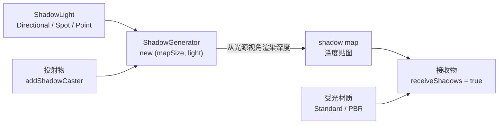

import { Canvas, Controls, Meta } from '@storybook/addon-docs/blocks';
import * as ShadowStories from './shadows-and-shading.stories';

<Meta of={ShadowStories} name="Docs" />

# 明暗与阴影

[光源](?path=/docs/lights--docs)课把光放进了场景；本课回答两件后续事：**明暗**怎么出来，以及 **阴影**怎么开对。两条链不要混：

- **明暗** = 受光材质 × 光。法线朝光的面亮、背光面暗。`StandardMaterial` / `PBRMaterial` 受光；`scene.lights` 为空时它们渲染成全黑。这一层在光源课已经建立，本课只桥接。
- **阴影** = 在明暗之上再加一张 shadow map。Babylon 没有"渲染器总闸"那样的全局开关；只要存在 `ShadowGenerator` 并登记了投射物与接收物，阴影就参与渲染。

直觉一句话：**shadow map 是从光源视角渲染的深度图**。Babylon 把光源的"眼睛"放在 `ShadowLight` 的 `position`（或方向光的"无限远起点"），朝 `direction` 看一眼，把能看见的最近深度写进一张贴图；之后真实渲染时，每个接收物表面上的像素回头查这张图——"从光源看，我前面有没有更近的东西挡着？"有就落在阴影里。理解这条链，后面所有参数（mapSize、bias、filter）都在调"这张图怎么画、怎么查"。



| 输入或状态 | 默认 | 回查要点 |
| --- | --- | --- |
| 光源类型 | 需为 `ShadowLight` 子类 | `HemisphericLight` 直接继承 `Light`，**不能投影**；`DirectionalLight` / `SpotLight` / `PointLight` 继承 `ShadowLight`，可以 |
| `new ShadowGenerator(mapSize, light)` | `mapSize` 必填，无默认 | 每个投影光源**独立一个** `ShadowGenerator`；同一光源多生成器会互相覆盖 |
| `mapSize` | 无默认，常用 `512` / `1024` / `2048` | 越大边缘越清晰也越贵；不必非 2 的幂，但 2 的幂兼容性最好 |
| `addShadowCaster(mesh, includeDescendants = true)` | — | 投射物**不会自动**登记，必须显式调用 |
| `mesh.receiveShadows` | `false` | 接收物**不会自动**采样 shadow map，必须显式置 `true` |
| 过滤模式 `use*` | 全 `false`（`FILTER_NONE`） | 四个布尔互斥；默认是**硬边无过滤** |
| `bias` | `0.00005` | 沿光方向偏移深度，防阴影条纹（acne）；过大脱影（peter-panning） |
| `normalBias` | `0` | 沿法线偏移，曲面浅角更有效；与 `bias` 配合使用 |
| `darkness` | `0` | `0` 最暗，`1` 等于无阴影；**只能调淡**，不能调到比 `0` 更暗 |
| `filteringQuality` | `QUALITY_HIGH` | 仅 PCF / PCSS 生效；调低省 GPU |
| `DirectionalLight.shadowFrustumSize` | `0`（自动） | `0` 时由 `autoUpdateExtends` 按场景包围盒估算；给固定值可稳定覆盖 |

## 快速上手

最小闭环：受光材质 + 一盏方向光 + 一个 `ShadowGenerator`，地面就出现阴影。Babylon 没有"渲染器总闸"——`ShadowGenerator` 存在且登记了投射 / 接收双方，阴影就在每一帧自动参与渲染。

```ts
import {
  Color3, DirectionalLight, HemisphericLight, MeshBuilder,
  Scene, ShadowGenerator, StandardMaterial, Vector3,
} from '@babylonjs/core';

// 填充光抬底色，让阴影区不归零（不投影）。
new HemisphericLight('fill', new Vector3(0, 1, 0), scene).intensity = 0.35;

// 投影光源：方向光必须给一个方向。
const sun = new DirectionalLight('sun', new Vector3(-0.6, -1, -0.45).normalize(), scene);
sun.intensity = 1.2;
sun.shadowFrustumSize = 8; // 固定正交视锥半边长，避免边缘裁影

// 地面：受光材质 + receiveShadows = true 才会采样 shadow map。
const ground = MeshBuilder.CreateGround('ground', { width: 14, height: 14 }, scene);
const groundMat = new StandardMaterial('groundMat', scene);
groundMat.diffuseColor = new Color3(0.55, 0.57, 0.62);
ground.material = groundMat;
ground.receiveShadows = true;

// 投射物：StandardMaterial 自动受光 + 自动接收阴影；
// 但要让它"投出"阴影，必须显式登记进 ShadowGenerator。
const box = MeshBuilder.CreateBox('box', { size: 1.4 }, scene);
box.position.y = 0.7;
const boxMat = new StandardMaterial('boxMat', scene);
boxMat.diffuseColor = new Color3(0.88, 0.42, 0.24);
box.material = boxMat;

const shadowGenerator = new ShadowGenerator(1024, sun);
shadowGenerator.addShadowCaster(box); // 登记后，box 每帧被画进 shadow map
```

`HemisphericLight` 当填充光的代价很小且不投影，是阴影场景的常见搭档——它抬亮阴影区，避免阴影黑成一片看不出形状。

## ShadowGenerator

阴影靠三件事齐备，缺一环就看不到影子：

| 环节 | 写法 | 漏掉的现象 |
| --- | --- | --- |
| 可投影的光源 | `new DirectionalLight / SpotLight / PointLight(...)` | 用 `HemisphericLight` 则 `new ShadowGenerator` 时类型不匹配，TS 报错 |
| ShadowGenerator | `new ShadowGenerator(mapSize, light)` | 没有生成器，所有"投射 / 接收"标志都无效 |
| 投射物登记 | `shadowGenerator.addShadowCaster(mesh)` | 地面看不到任何影子 |
| 接收物置位 | `mesh.receiveShadows = true` | 影子没投到这张面上（其他开了 `receiveShadows` 的面仍能收到） |

**只有 `ShadowLight` 子类能投影。** `HemisphericLight` 直接继承 `Light`，没有 `position` 也没有 `direction` 的有向投影意义；`DirectionalLight` / `SpotLight` / `PointLight` 继承 `ShadowLight`，提供 `position` / `direction` 给 shadow map 的"光源相机"用。这与 three.js 的"全场面光源不投影"一致——Babylon 里就是"HemisphericLight 不投影"。

**一个 `ShadowGenerator` 绑定一个光源。** `ShadowGenerator(mapSize, light)` 在内部把生成器注册到 `light._shadowGenerators`（按相机键索引）；多个投影光源就要 `new` 多个 `ShadowGenerator`，每盏光各自渲染自己的 shadow map。重复对同一光源 `new` 会覆盖前一个的注册项，旧的 shadow map 不会自动释放——切换前先 `oldGenerator.dispose()`。

**受光材质自动接收阴影。** `StandardMaterial` / `PBRMaterial` 在着色器里会查 shadow map，无需在材质上再开开关；只要表面所在 mesh 的 `receiveShadows = true`，阴影就叠在它的明暗之上。这一点和 three.js 不同——Babylon 没有独立的 `ShadowMaterial`，阴影就是受光计算的一个减光项。

```ts
const shadowGenerator = new ShadowGenerator(1024, sun);
shadowGenerator.addShadowCaster(box);          // 写入深度图
shadowGenerator.addShadowCaster(sphere, true); // 第二参 includeDescendants 默认 true
ground.receiveShadows = true;                  // 采样深度图

const map = shadowGenerator.getShadowMap();    // 取 RenderTargetTexture，调试时有用
```

**性能代价：每盏投影光源 = 一次额外深度渲染。** `DirectionalLight` / `SpotLight` 各渲染一次 shadow map（一张 2D 深度贴图）；`PointLight` 因为要全向，默认用**立方体 shadow map**（6 个面各渲染一次），开销约为方向光的 6 倍——所以多灯场景常见做法是"多盏灯照亮，只让一盏 Directional 或 Spot 投影"。`PointLight` 也接受一个可选 `direction`：给个方向后退化成"无限远聚光灯"，shadow map 退化成单张 2D 贴图，前提是所有投射物都在光的同一侧。

### 阴影类型

阴影边缘的软硬由 `ShadowGenerator` 的**过滤模式**决定，四个布尔开关互斥（内部用单一 `_filter` 字段记录当前模式）：

| 开关 | 模式 | 观感 | 代价 | 注意 |
| --- | --- | --- | --- | --- |
| 都不设（默认） | `FILTER_NONE` | 硬边、有锯齿 | 最低 | 入门首选，调通后再升级 |
| `usePercentageCloserFiltering = true` | PCF | 边缘平滑、可调质量 | 中（WebGL2）；WebGL1 回退到 Poisson | 日常推荐；`filteringQuality` 调 `LOW/MEDIUM/HIGH` |
| `usePoissonSampling = true` | Poisson 采样 | 边缘较软、有少量噪点 | 中 | WebGL1 也能跑 |
| `useExponentialShadowMap = true` | ESM | 边缘较软 | 中 | 用指数函数抗锯齿 |
| `useBlurExponentialShadowMap = true` | Blur ESM | 最糊、最柔 | 高（多一次模糊 pass） | **PointLight 不支持**（立方体面模糊太贵），会自动回退到 ESM |

切换模式时给目标开关赋 `true`、其余赋 `false` 即可——把"当前活动"的开关赋 `false` 会自动回退到 `FILTER_NONE`，给非活动的赋 `false` 是无操作。两个"close"变种（`useCloseExponentialShadowMap` / `useBlurCloseExponentialShadowMap`）用于极近距离阴影，普通场景用不到。PCSS 接触硬化（`useContactHardeningShadow`）是更高级的软阴影，需要 `useContactHardeningShadow = true` 并配 `contactHardeningLightSizeUVRatio`。

`mapSize` 决定阴影贴图的像素分辨率。同样的视锥覆盖范围下，`mapSize` 越大，每个世界单位分到的阴影像素越多，边缘越锐利；但纹理内存与重绘成本线性上升。`mapSize` 只在构造时确定——运行时要改尺寸，必须 `dispose` 旧生成器再 `new` 一个新的，并重新登记所有投射物（`addShadowCaster` 的登记存在 shadow map 的 renderList 上，会随旧生成器一起释放）。

下面的实例把同一组投射物 / 接收物放在固定方向光下，让你切换四种过滤模式并调 `mapSize` / `darkness`：

<Canvas of={ShadowStories.Shadows} />

<Controls of={ShadowStories.Shadows} />

| 读者操作 | 可观察证据 |
| --- | --- |
| 默认 `pcf` / `1024` | 阴影边缘平滑、几乎无锯齿；readout 显示"PCF 百分比渐近 / 1024 × 1024" |
| 切到 `none` | 边缘立刻变硬、出现阶梯锯齿——证明默认过滤并不是"自动软边" |
| 切到 `poisson` / `esm` | 边缘变软，但靠近投射物根部仍有清晰轮廓；两种之间软度相近 |
| 切到 `bluresm` | 阴影整体最糊、最柔，像散焦——代价是边界精度下降 |
| `mapSize` 从 `1024` 调到 `512` | 边缘明显变粗、锯齿加大（同视锥下每像素覆盖面积翻倍） |
| `mapSize` 调到 `2048` | 边缘更细；readout 同步显示新尺寸（dispose + 重建已生效） |
| 调 `darkness` 从 `0` 到 `0.5` | 阴影变淡、灰蒙；到 `1` 时阴影完全消失（`darkness` 只能调淡） |
| 鼠标拖拽画布 | 相机绕场景旋转，从不同角度核对阴影边缘质量 |

实例离屏时停止渲染循环、回到视口附近再恢复，调度细节见 [渲染循环与时间](?path=/docs/render-loop-and-timing--docs)。

## 深度偏差与暗度

阴影条纹（acne）和脱影（peter-panning）是 shadow map 的两类经典瑕疵，分别由 `bias` / `normalBias` 和 `darkness` 控制。

**`bias`（默认 `0.00005`）** 沿**光方向**把深度往前推一点点，让曲面"自己挡自己"造成的自阴影条纹消失。Babylon 的 bias 用**正号**：`bias = 0.0001` 加大偏移缓解 acne；过大时阴影会从物体根部脱开，像悬浮在空中（peter-panning）。这和 three.js 用负 bias 的符号约定相反，但物理含义一致。

**`normalBias`（默认 `0`）** 沿**法线方向**偏移采样点，按"法线与光线的夹角"加权——夹角越大（浅角）偏移越多。它对地面、墙面这类大面积平面上的浅角条纹特别有效，且引起的 peter-panning 比等量 `bias` 小，所以常见组合是"小 `bias` + 适度 `normalBias`"：

```ts
shadowGenerator.bias = 0.0001;       // 略高于默认 0.00005
shadowGenerator.normalBias = 0.02;   // 缓解地面浅角条纹
```

`forceBackFacesOnly = true` 是另一种治本思路：渲染 shadow map 时只画背面，从根本上回避自阴影，能显著降低对 bias 的依赖，尤其适合自阴影（角色、骨骼）。代价是薄壁物体可能投不出正确阴影（背面被正面挡住）。

**`darkness`（默认 `0`）** 控制阴影的**暗度上限**——注意方向：`0` 是最暗（默认），`1` 等于无阴影。它只能**调淡**已有阴影，不能让阴影比 `0` 更黑。要"阴影不要那么黑"，调 `darkness` 到 `0.3 ~ 0.5`；要让阴影完全不显示，直接 `dispose` 生成器或 `light.enabled = false`，而不是把 `darkness` 调到 `1` 凑数。

## 最佳实践

- **先确认受光材质出明暗，再开阴影。** 场景全黑时先查 `scene.lights` 和材质（见 [光源](?path=/docs/lights--docs)），不要先调 shadow bias——明暗链不通时阴影也无从叠加。
- **多灯只给主光投影。** `PointLight` 的立方体 shadow map 约为方向光的 6 倍开销；优先让一盏 `DirectionalLight` 或 `SpotLight` 投影，其他灯只照明。
- **`DirectionalLight` 固定 `shadowFrustumSize`。** 默认 `autoUpdateExtends` 会按场景包围盒自动算视锥，物体移动时视锥跟着变、阴影边缘粗细也跟着跳；给 `shadowFrustumSize` 一个贴紧场景的固定值（如 `8`），阴影视锥稳定。
- **`mapSize` 从 `1024` 起步。** `512` 只够小场景或远景；`2048` 以上先确认 `engine.getCaps().maxTextureSize`，并权衡纹理内存。改尺寸时 dispose + 重建，不要指望运行时改属性生效。
- **过滤模式默认 `FILTER_NONE`，先跑通再升级。** 默认硬边足以验证阴影链路是否正确；视觉调优阶段再开 `usePercentageCloserFiltering`（PCF），需要更柔时考虑 `useBlurExponentialShadowMap`（Blur ESM）。
- **acne 先用 `normalBias`，peter-panning 回收 `bias`。** 浅角条纹优先加 `normalBias`（如 `0.02`）；阴影脱开时把 `bias` 往默认值收回。极端情况开 `forceBackFacesOnly = true`。
- **`darkness` 只调淡不调暗。** 想让阴影淡一些用 `darkness = 0.3 ~ 0.5`；想完全关阴影用 `generator.dispose()` 或 `light.enabled = false`，不要用 `darkness = 1` 凑。

## 常见问题

- 为什么加了光、有了 `ShadowGenerator`，地面还是没阴影？
  按四环查：光源是不是 `DirectionalLight` / `SpotLight` / `PointLight`（不是 `HemisphericLight`）；有没有 `new ShadowGenerator(mapSize, light)`；投射物有没有 `addShadowCaster(mesh)`；接收面有没有 `mesh.receiveShadows = true`。任何一环漏掉都没有影子。
- 为什么阴影边缘全是锯齿 / 阶梯？
  默认过滤是 `FILTER_NONE`（硬边）。设 `usePercentageCloserFiltering = true`（PCF，日常推荐）或 `useExponentialShadowMap = true`（ESM）；同时把 `mapSize` 从 `512` 升到 `1024`。
- 为什么阴影表面有条纹（acne），或阴影与物体脱开（peter-panning）？
  条纹：加 `normalBias`（如 `0.02`）或略增 `bias`（如 `0.0001`）。脱影：`bias` 过大，往默认 `0.00005` 收回。薄壁自阴影严重的可 `forceBackFacesOnly = true`。
- 为什么 `useBlurExponentialShadowMap = true` 在 `PointLight` 下没效果？
  立方体 shadow map 的 6 个面分别模糊代价太高，Babylon 会自动回退到 `useExponentialShadowMap = true`。`PointLight` 想要模糊阴影，可给它一个 `direction`，退化成单张 2D shadow map（前提是投射物都在同一侧）。
- 为什么 `darkness` 设到 `1` 阴影反而没了？想更暗怎么调？
  `darkness` 的方向是 `0` 最暗、`1` 等于无阴影——它只能调淡，不能比 `0` 更暗。想完全关阴影用 `generator.dispose()` 或 `light.enabled = false`；想让阴影更暗，确认它已经在 `0`，再去看填充光是否把阴影区抬得太亮（调小填充光 `intensity`）。
- 为什么切换 `mapSize` 后阴影消失了？
  `mapSize` 是构造参数，运行时直接改 `shadowGenerator.mapSize` 不会重建 shadow map 贴图。必须 `oldGenerator.dispose()` 后 `new ShadowGenerator(newSize, light)`，并重新 `addShadowCaster(...)` 登记所有投射物（本课实例的 `buildShadowGenerator` 就是这么做的）。
- 多个投影光源会怎么样？
  每盏光源各自渲染一次 shadow map（`PointLight` 渲染 6 次），开销线性叠加；每个生成器独立调 `mapSize` / `bias` / `filter`。同一光源重复 `new ShadowGenerator` 会覆盖注册项，旧的不会自动释放——切换前先 `dispose`。

## 总结回顾

摘要：

阴影是叠在明暗之上的额外 shadow map 流程。Babylon 没有渲染器总闸：只要 `ShadowGenerator(mapSize, light)` 存在、投射物经 `addShadowCaster` 登记、接收面 `receiveShadows = true`，每一帧就自动渲染并采样深度图。只有 `ShadowLight` 子类（`DirectionalLight` / `SpotLight` / `PointLight`）能投影；`HemisphericLight` 不行。`StandardMaterial` / `PBRMaterial` 自动接收阴影，无需材质开关。每盏投影光源多一次深度渲染，`PointLight` 因立方体贴图约 6 倍开销。阴影边缘软硬由四个互斥的 `use*` 过滤开关决定，默认 `FILTER_NONE`（硬边）；`mapSize` 决定分辨率，改尺寸要 dispose + 重建。`bias` / `normalBias` 治阴影条纹（acne），过大会脱影（peter-panning）；`darkness`（默认 `0`，方向是 0 最暗、1 无阴影）只能调淡。

一句话：

> 阴影四环——可投影光源、`ShadowGenerator`、`addShadowCaster`、`receiveShadows`——齐了才出影子；默认硬边，软边靠四种 `use*` 过滤开关，瑕疵靠 `bias` / `normalBias` 收。

知识要点：

- 明暗链和阴影链分别依赖什么？为什么 `HemisphericLight` 不能投影？
- shadow map 的物理直觉是什么？它从哪个"视角"渲染？
- 阴影四环是哪四个？漏掉 `addShadowCaster` 和漏掉 `receiveShadows` 现象有什么不同？
- 受光材质要不要在材质上单独开"接收阴影"开关？
- 四种 `use*` 过滤模式各自什么观感和代价？默认是哪种？`PointLight` 为什么不支持 Blur ESM？
- `mapSize` 为什么运行时不能直接改属性生效？正确做法是什么？
- `bias` / `normalBias` / `darkness` 各自默认值是什么？分别对应 acne、peter-panning、暗度中的哪一个？
- 多个投影光源的开销为什么线性叠加？`PointLight` 又为什么是约 6 倍？

## 参考资料

- [Babylon.js Features：Shadows](https://doc.babylonjs.com/features/featuresDeepDive/lights/shadows)
- [Babylon.js TypeDoc：ShadowGenerator](https://doc.babylonjs.com/typedoc/classes/BABYLON.ShadowGenerator)
- [Babylon.js TypeDoc：ShadowLight](https://doc.babylonjs.com/typedoc/classes/BABYLON.ShadowLight)
- [Babylon.js TypeDoc：DirectionalLight（shadowFrustumSize / autoUpdateExtends）](https://doc.babylonjs.com/typedoc/classes/BABYLON.DirectionalLight)
- [Babylon.js TypeDoc：AbstractMesh（receiveShadows）](https://doc.babylonjs.com/typedoc/classes/BABYLON.AbstractMesh)
- [Babylon.js Features：Lights Introduction](https://doc.babylonjs.com/features/featuresDeepDive/lights/lights_introduction)
- [Babylon.js API Reference (TypeDoc)](https://doc.babylonjs.com/typedoc/)
