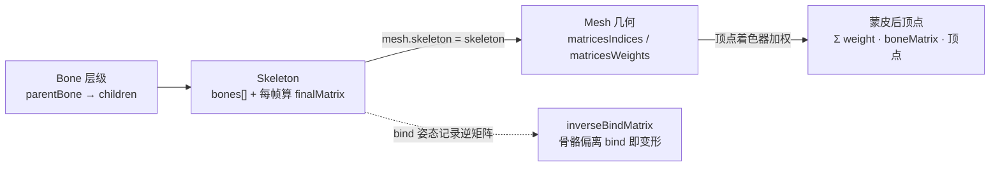

import { Canvas, Controls, Meta } from '@storybook/addon-docs/blocks';
import * as Stories from './skeleton-and-bones.stories';

<Meta of={Stories} name="Docs" />

# 骨骼与蒙皮

刚体 Mesh 只能整体平移、旋转、缩放——想让它"弯曲"得另开一套机制。**骨骼与蒙皮（skinning）** 解决的就是这件事：用一组骨骼（`Bone`）组成层级，再让一个网格的顶点"绑"到这些骨骼上；骨骼一动，挂在它身上的顶点跟着动，于是同一个网格表面可以随关节连续弯曲。角色肢体、披风摆动、面部表情都靠它。

蒙皮由四件事共同决定，先分清它们的作用：

- **骨骼层级**：每根 `Bone` 是 `Node` 的子类，按父子层级组织。旋转一根骨骼，它的子级也跟着旋转——和 [TransformNode](?path=/docs/transformnode-and-grouping--docs) 讲的世界矩阵传递一致。
- **Skeleton**：把一组 `Bone` 收集起来，每帧由引擎算出"每根骨骼的最终变换矩阵"（`getTransformMatrices`），交给顶点着色器。
- **mesh.skeleton**：把骨架挂到某个 Mesh，引擎才会对这个 Mesh 做蒙皮渲染。
- **顶点皮肤数据**：Mesh 几何上携带的 `matricesIndices`（每顶点最多 4 根骨骼的下标）和 `matricesWeights`（对应权重），决定每个顶点受哪几根骨骼影响及权重分配。

通常你不会手写这些——`SceneLoader` 加载带骨骼的 glTF 时会自动建好 `Skeleton`、`Bone` 层级，并写好顶点的 `matricesIndices` / `matricesWeights`，详见 [加载模型](?path=/docs/sceneloader-and-gltf--docs)。手工构造适合学习与最小演示，本课的范例就是手工构造一条两根骨骼的链，再手工写皮肤权重。



| 对象或参数 | 默认 / 常用起点 | 改变后要注意什么 |
| --- | --- | --- |
| `new Skeleton(name, id, scene)` | 第二参是 `id` 字符串，不是 scene | 与 some 引擎不同，Babylon 的 Skeleton 构造要 `(name, id, scene)` 三参 |
| `new Bone(name, skeleton, parentBone?, localMatrix?, restMatrix?, bindMatrix?, index?)` | `parentBone` 缺省 `null`（根骨骼）；`localMatrix` 缺省单位矩阵；`restMatrix` / `bindMatrix` 缺省取 `localMatrix` | 构造时的 `localMatrix` 同时是 bind（绑定）姿态，之后再动骨骼才算变形 |
| `mesh.skeleton = skeleton` | 默认 `null` | 挂上后引擎在 `scene.render()` 内部对该 Mesh 启用蒙皮顶点着色器 |
| `VertexBuffer.MatricesIndicesKind` | 每顶点 4 通道，整数下标以 float 存储 | 下标指向 `skeleton.bones` 数组顺序，不是骨骼的 name 或 id |
| `VertexBuffer.MatricesWeightsKind` | 每顶点 4 通道权重，理想和为 1 | 不归一时蒙皮仍加权求和，但顶点会偏移或缩放 |
| `mesh.numBoneInfluencers` | 由 `matricesIndices` 的 stride 自动得出（4 或 8） | 提供 `matricesIndicesExtra` 时变 8，支持每顶点最多 8 根骨骼 |
| `scene.beginAnimation(target, from, to, loop)` | target 可是 Skeleton、Bone 或任意 `IAnimatable` | 骨骼动画的入口；具体播放控制见 [动画](?path=/docs/animation-system--docs) |
| `new SkeletonViewer(skeleton, mesh, scene)` | `autoUpdateBonesMatrices` 默认 `true`，`renderingGroupId` 默认 `2`（叠在画面上） | 画出骨骼连线，实时跟随骨骼变换 |

## Skeleton 与 Bone

`Bone` 是 `Node` 的子类，它的"骨骼"身份完全靠进入某个 `Skeleton.bones` 数组获得。组织层级的方式就是 `new Bone(..., parentBone, ...)`：传另一根骨骼作为 `parentBone`，子骨骼的绝对矩阵 = 父骨骼绝对矩阵 × 子骨骼局部矩阵，旋转父骨骼时整条链跟随。

```ts
import { Bone, Matrix, Skeleton } from '@babylonjs/core';

const skeleton = new Skeleton('arm', 'arm-0', scene);

// 根骨骼：parentBone 传 null（或缺省），localMatrix 用 Translation 放到圆柱底部。
const root = new Bone('root', skeleton, null, Matrix.Translation(0, -2, 0));

// 子骨骼：parentBone = root。相对 root 平移 (0, 2, 0)，绝对位置 = -2 + 2 = 0（圆柱中点 = 关节）。
const tip = new Bone('tip', skeleton, root, Matrix.Translation(0, 2, 0));
```

构造时传入的 `localMatrix` 同时被当作**绑定姿态（bind pose）**：引擎记录每根骨骼当前的绝对矩阵并取逆，存为 `inverseBindMatrix`。之后你再动骨骼就是"偏离绑定姿态"，引擎每帧算出"当前绝对矩阵 × inverseBindMatrix"，乘积反映了骨骼相对绑定的偏移。所以**先布置好骨骼位置再让它参与蒙皮**；颠倒会让绑定姿态记录的就是错的状态。

| 成员 | 解决的问题 | 边界 |
| --- | --- | --- |
| `skeleton.bones` | 顶点 `matricesIndices` 引用的查找表 | 数组顺序就是写入的下标；顺序变了蒙皮会错乱 |
| `bone.getParent()` / `getChildren()` | 层级遍历 | 根骨骼的 `getParent()` 返回 `null` |
| `bone.getLocalMatrix()` | 局部变换（相对父骨骼） | 由构造时 `localMatrix` 初始化，setter 改值后重算 |
| `bone.getAbsoluteMatrix()` | 相对骨架根的世界矩阵 | 引擎每帧重算；驱动蒙皮的就是它 |
| `bone.getRestMatrix()` / `setRestMatrix()` | rest 姿态局部矩阵 | `returnToRest()` 时把 localMatrix 复位到这里 |
| `bone.setParent(parent, updateAbsoluteBindMatrices?)` | 运行时改父级 | 默认重算绝对 bind 矩阵；仅重排层级时传 `false` |
| `skeleton.returnToRest()` | 整副骨架回到 rest 姿态 | 等价于每根骨骼 `returnToRest()` |
| `skeleton.computeAbsoluteMatrices()` | 手动触发绝对矩阵重算 | 通常引擎自动做；自定义渲染管线才需要显式调 |

## 蒙皮入口：mesh.skeleton 与顶点权重

挂骨架只一行——`mesh.skeleton = skeleton`。挂上之后，引擎在 `scene.render()` 里对该 Mesh 启用蒙皮：顶点着色器按顶点的 `matricesIndices` 取出影响它的骨骼，按 `matricesWeights` 加权，把骨骼变换作用到顶点。

这两份顶点数据每顶点各 4 个分量，意味着**每个顶点最多受 4 根骨骼影响**；需要 8 根时再补一份 `matricesIndicesExtra` / `matricesWeightsExtra`，`mesh.numBoneInfluencers` 自动从 stride 推出 4 或 8。

```ts
import { MeshBuilder, VertexBuffer } from '@babylonjs/core';

const mesh = MeshBuilder.CreateCylinder('arm', { height: 4, diameter: 1 }, scene);
mesh.skeleton = skeleton; // 蒙皮入口

// glTF 加载时由解析器自动写这两份；这里手工演示。
const positions = mesh.getVerticesData(VertexBuffer.PositionKind)!;
const count = positions.length / 3;
const indices = new Float32Array(count * 4); // 整数下标以 float 存储
const weights = new Float32Array(count * 4);

for (let i = 0; i < count; i++) {
  const y = positions[i * 3 + 1];
  // 上半段顶点完全归 tip（下标 1），下半段完全归 root（下标 0）。
  const tip = y >= 0 ? 1 : 0;
  const root = 1 - tip;
  indices[i * 4 + 0] = 0; // root
  indices[i * 4 + 1] = 1; // tip
  weights[i * 4 + 0] = root;
  weights[i * 4 + 1] = tip;
}

mesh.setVerticesData(VertexBuffer.MatricesIndicesKind, indices, false, 4);
mesh.setVerticesData(VertexBuffer.MatricesWeightsKind, weights, false, 4);
```

`matricesIndices` 的分量值是 `skeleton.bones` 数组的**下标**，不是骨骼的 `name` 或 `id`——所以骨骼加入骨架的顺序直接决定下标怎么写。权重理想上每顶点 4 通道之和为 1；不归一时着色器仍会加权求和，但顶点位置会偏移或缩放（glTF 加载的数据通常已归一，手工写时要自己保证）。

## 骨骼变换驱动蒙皮

旋转一根骨骼，挂在它身上的顶点跟着动——这是蒙皮的全部直观证据。下面的范例用两根骨骼驱动一个圆柱：`root` 钉在底部、`tip` 是 `root` 的子级，绝对位置落在圆柱中点（即"关节"）。旋转 `tip`，圆柱上半段绕关节弯曲。

<Canvas of={Stories.Skeleton} />

<Controls of={Stories.Skeleton} />

| 读者操作 | 可观察证据 |
| --- | --- |
| 拉「tip 骨骼旋转」到 60° | 圆柱上半段绕中点弯曲，SkeletonViewer 的骨骼连线同时绕中点转动——证明画面弯曲来自 bone 的变换 |
| 「权重模式」选 `rigid` | 中点处出现明显**尖角**（折线），因为 y=0 上下分属两根骨骼、过渡带为 0 |
| 「权重模式」选 `smooth` | 同一角度下弯曲变成**连续圆弧**，因为 \|y\|&lt;0.6 的顶点在两骨骼间线性混合 |
| 关闭「显示骨骼」 | 只剩蒙皮网格，弯曲仍在——证明骨骼不是"画出来的辅助线"，而是真的在驱动顶点 |
| 读数「骨骼数」 | 一直是 2（root + tip），证明权重模式只改顶点数据，不改骨架结构 |

实例进入视口附近才启动渲染循环、离开后停止并保留最后一帧；调度策略见 [渲染循环与时间](?path=/docs/render-loop-and-timing--docs)。

> **写骨骼旋转必须走 setter。** `bone.rotation.z = x` 只是改了 getter 返回的 `Vector3` 字段，不会触发骨骼重算矩阵，画面不会动。用 `bone.setRotation(vec, Space.LOCAL)`、`bone.setYawPitchRoll(0, 0, rad, Space.LOCAL)`、`bone.rotation = new Vector3(...)` 或 `setRotationQuaternion(quat, Space.LOCAL)`——它们内部先分解当前局部矩阵拿到 position / scale，再写入新旋转并标记 dirty。

## 调试骨骼：SkeletonViewer 与 Inspector

蒙皮出问题时，靠"网格看起来对不对"猜骨骼姿态很难定位。Babylon 提供两条可视化路径：

`SkeletonViewer` 把骨架画成一组连线（默认 `DISPLAY_LINES`），实时跟随骨骼变换。它构造在某个 `(skeleton, mesh, scene)` 上，自动挂在 `renderingGroupId = 2`（叠在默认画面之上），并随 `scene.render()` 每帧更新。

```ts
import { SkeletonViewer } from '@babylonjs/core';

const viewer = new SkeletonViewer(skeleton, mesh, scene);
viewer.color = new Color3(1, 0.85, 0.2);   // 连线颜色
// viewer.dispose(); // 不用时释放
```

| 成员 / 选项 | 含义 |
| --- | --- |
| `autoUpdateBonesMatrices`（构造第 4 参，默认 `true`） | 每帧强制重算骨骼矩阵再画；关掉后要自己 `viewer.update()` |
| `displayMode` | `DISPLAY_LINES`（默认）/ `DISPLAY_SPHERES` / `DISPLAY_SPHERE_AND_SPURS` |
| `changeDisplayOptions(option, value)` | 调整 `midStep`、`sphereBaseSize`、`showLocalAxes` 等细节 |
| `isEnabled` | 开关，不销毁已建资源 |

另一条路是 `scene.debugLayer`（Inspector）：它不画骨骼连线，但能在面板里逐根骨骼查看 `localMatrix` / `absoluteMatrix`、 animations 与属性，还能交互式调整。完整调试习惯见 [调试](?path=/docs/inspector-and-debug--docs)。

```ts
scene.debugLayer.show(); // 需要 @babylonjs/inspector
```

排查"旋转了骨骼画面却没动"时，先开 `SkeletonViewer`：连线动 = 骨骼变换写进去了（问题在蒙皮数据）；连线不动 = 骨骼 setter 没走对或骨架没挂到 mesh。

## 骨骼动画：让骨骼按时间动起来

旋转一根骨骼是手动写值；让一整副骨架按时间播放关键帧，靠的是 [动画](?path=/docs/animation-system--docs) 课讲过的 `Animation` + `scene.beginAnimation`。`Skeleton` 和每根 `Bone` 都实现 `IAnimatable`，各自带一个 `animations` 数组；`Animation` 的 `targetProperty` 写骨骼的属性路径（如 `"rotation"` 或 `Bone` 的局部矩阵字段），引擎每帧把插值写回骨骼，骨骼再驱动蒙皮。

```ts
import { Animation, Space } from '@babylonjs/core';

// 给 tip 骨骼挂一段绕 Z 的关键帧动画（dataType 用 VECTOR3 动整向量 rotation）。
const sway = new Animation(
  'sway',
  'rotation',
  30,
  Animation.ANIMATIONTYPE_VECTOR3,
  Animation.ANIMATIONLOOPMODE_YOYO,
);
sway.setKeys([
  { frame: 0, value: new Vector3(0, 0, 0) },
  { frame: 30, value: new Vector3(0, 0, Math.PI / 4) },
]);
tipBone.animations = [sway];

// 直接播整根骨骼的 animations：scene.beginAnimation 接收任意 IAnimatable（含 Bone / Skeleton）。
const animatable = scene.beginAnimation(tipBone, 0, 30, true);
```

多根骨骼、多段绑定的剪辑用 `AnimationGroup` 打包——它把"哪段 `Animation` 作用在哪个 target（骨骼）上"收成一组，一次 `start()` 一起播。这正是 glTF 加载动画的标准形态：`SceneLoader.ImportMeshAsync` 加载带动画的 glTF 时，`result.skeletons` 是骨架数组、`result.animationGroups` 是已经把每段动画和对应骨骼绑好的 `AnimationGroup[]`，直接 `result.animationGroups[0].start(true)` 就能播放角色的 idle / walk / run。加载流程见 [加载模型](?path=/docs/sceneloader-and-gltf--docs)，播放控制（`loopMode`、`speedRatio`、缓动、混合）见 [动画](?path=/docs/animation-system--docs)。

```ts
import '@babylonjs/loaders/glTF';
import { SceneLoader } from '@babylonjs/core';

const result = await SceneLoader.ImportMeshAsync('', '/models/', 'character.glb', scene);
// result.skeletons[0]：蒙皮骨架（mesh.skeleton 已被解析器设好）。
// result.animationGroups：每段是一个绑好骨骼 target 的 AnimationGroup。
result.animationGroups[0].start(true); // 循环播放第一段
```

蒙皮与形变动画（morph）是两套独立形变机制：skinning 用骨骼驱动顶点，morph 用顶点属性的线性插值产生表情或细节形变，两者可以叠加。morph 的入口见 [形变动画](?path=/docs/morph-targets--docs)。

## 最佳实践

- 优先从 glTF 加载骨骼与皮肤权重，手工构造只在演示、学习或自定义 rig 时使用；手写权重工作量大，错了不易定位。
- 先布置骨骼层级与位置（让构造时的 `localMatrix` 就是想要的 bind 姿态），再 `mesh.skeleton = skeleton`，之后才动骨骼触发变形——颠倒会让绑定姿态记录的就是错的状态。
- 写骨骼旋转 / 位移走 setter（`setRotation` / `setYawPitchRoll` / `setRotationQuaternion` / `setPosition`），不要靠 `bone.rotation.z = x` 字段改值，它不触发骨骼重算矩阵。
- `matricesIndices` 写的是 `skeleton.bones` 数组下标，构造骨骼的顺序直接决定下标；重排骨骼要同步重写权重。
- 蒙皮角色的视锥剔除与拾取要用反映当前姿态的包围盒：`mesh.refreshBoundingInfo({ applySkeleton: true })` 按需重算，否则镜头边缘可能突然消失或拾取偏移。
- 调试用 `SkeletonViewer` 看骨骼连线、用 `scene.debugLayer` 看逐骨骼属性，不要靠"网格看起来对不对"猜骨骼姿态。
- 释放时除 Mesh 的 geometry / material 外，还要 `viewer.dispose()` 和 `skeleton.dispose()`；骨骼本身是 Node，随场景树移除即可。

## 常见问题

- 为什么旋转了骨骼，网格没有变形？
  三种常见原因：骨架没挂到 mesh（缺 `mesh.skeleton = skeleton`）；改旋转用了字段赋值（`bone.rotation.z = x` 不触发重算，要用 setter）；顶点没有 `matricesIndices` / `matricesWeights`（手工构造时漏写）。开 `SkeletonViewer` 区分：连线动 = 骨骼写进去了，问题在蒙皮数据；连线不动 = setter 没走对。
- 为什么绑定姿态看起来就已经是变形的？
  构造骨骼或 `mesh.skeleton =` 赋值时，骨骼的局部矩阵还没布置到位，绑定姿态记录了错的状态。先把骨骼 `localMatrix` 布置好再挂骨架；可用 `skeleton.returnToRest()` 复位对比。
- 为什么加载 glTF 后角色是 T-pose 不动？
  `GLTFFileLoader` 只把骨架、权重和动画组建好；要让角色动起来需播放 `result.animationGroups[i].start(true)`，详见 [动画](?path=/docs/animation-system--docs)。
- 为什么动画在跑，角色却在镜头边缘突然消失？
  蒙皮后 Mesh 的 `boundingInfo` 不会每帧自动反映骨骼变形；动画驱动的角色按需调 `mesh.refreshBoundingInfo({ applySkeleton: true })`，让视锥剔除用当前姿态。
- 为什么手写权重后模型在弯曲时整体缩小或偏移？
  `matricesWeights` 每顶点 4 通道之和理想为 1；不归一时着色器仍加权求和，但结果偏移。手写后检查权重和，必要时归一化。
- 为什么 `matricesIndices` 的下标对不上骨骼？
  下标指向 `skeleton.bones` 数组的顺序，不是骨骼的 `name` 或 `id`。构造顺序变了或换了骨架实例，要同步重写 `matricesIndices`。
- 为什么多个 Mesh 共用一个 Skeleton，第二个变形错乱？
  同一 Skeleton 同时驱动多个 Mesh 时，`needInitialSkinMatrix` 与各 Mesh 的世界矩阵耦合，常见于从 glTF 容器 `instantiateModelsToScene` 复制实例后；给每个实例独立的 Skeleton（`skeleton.clone()`）是最稳妥的隔离方式。

## 总结回顾

摘要：

Babylon 的蒙皮由四件事组成：`Bone`（`Node` 子类）按 `parentBone` 组成层级，子骨骼跟随父骨骼变换；`Skeleton` 把骨骼数组收在一起，每帧算出每根骨骼的最终矩阵；`mesh.skeleton = skeleton` 把骨架挂到 Mesh，引擎对该 Mesh 启用蒙皮；Mesh 几何上的 `matricesIndices` / `matricesWeights`（每顶点 4 通道，可加 Extra 到 8）决定每个顶点受哪几根骨骼影响及权重，顶点着色器据此加权。构造骨骼时的 `localMatrix` 同时是 bind 姿态，引擎记录其逆矩阵，骨骼偏离 bind 即产生变形。写骨骼旋转 / 位移必须走 setter，字段赋值不触发重算。`SkeletonViewer` 画骨骼连线、`scene.debugLayer` 查逐骨骼属性，是排查蒙皮问题的两条路。让骨架按时间动起来走 [动画](?path=/docs/animation-system--docs) 系统：骨骼自带 `animations` 数组，`scene.beginAnimation(boneOrSkeleton, ...)` 或 `AnimationGroup` 打包多骨骼剪辑；glTF 加载结果里的 `result.skeletons` + `result.animationGroups` 已经把骨架和动画绑好。

一句话：

> 蒙皮是顶点着色器用骨骼矩阵 × 权重把骨骼变换加到顶点；骨骼层级、绑定姿态和顶点皮肤数据是它的三组输入，glTF 通常已经替你写好。

知识要点：

- `Skeleton` 与 `Bone` 各自承担什么职责？`Bone` 的父子层级如何让子骨骼跟随父骨骼？
- 构造 `Bone` 时 `localMatrix` / `restMatrix` / `bindMatrix` 的关系是什么？为什么构造时的 `localMatrix` 同时是绑定姿态？
- `mesh.skeleton = skeleton` 之后引擎做了什么？`matricesIndices` / `matricesWeights` 如何决定每个顶点受哪几根骨骼影响？
- 为什么 `bone.rotation.z = x` 不生效？正确的写骨骼旋转 / 位移的方式是什么？
- `SkeletonViewer` 与 `scene.debugLayer` 在排查蒙皮问题时分别能看出什么？
- 骨骼动画通过哪两种入口播放（`scene.beginAnimation` 与 `AnimationGroup`）？glTF 加载结果的 `result.skeletons` 和 `result.animationGroups` 各是什么？

## 参考资料

- [Babylon.js Features：Using Bones and Skeletons](https://doc.babylonjs.com/features/featuresDeepDive/mesh/bonesSkeletons)
- [Babylon.js TypeDoc：Skeleton](https://doc.babylonjs.com/typedoc/classes/BABYLON.Skeleton)
- [Babylon.js TypeDoc：Bone](https://doc.babylonjs.com/typedoc/classes/BABYLON.Bone)
- [Babylon.js TypeDoc：SkeletonViewer](https://doc.babylonjs.com/typedoc/classes/BABYLON.SkeletonViewer)
- [Babylon.js Features：Animation Groups（骨骼动画打包）](https://doc.babylonjs.com/features/featuresDeepDive/animation/groupAnimations)
- [Babylon.js Features：Loading Files（glTF 加载结果含 skeletons / animationGroups）](https://doc.babylonjs.com/features/featuresDeepDive/importers/loadingFileTypes)
