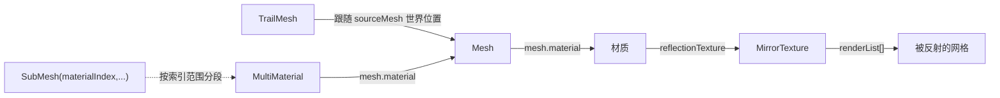

import { Canvas, Controls, Meta } from '@storybook/addon-docs/blocks';
import * as Stories from './special-mesh-types.stories';

<Meta of={Stories} name="Docs" />

# 特殊对象

Babylon.js 把几类“为某一种渲染需求做了特化”的网格/材质类型单列出来：`MirrorTexture` 把一组网格按镜面反射到贴图，`TrailMesh` 跟随源网格自动生成拖尾，`MultiMaterial` 让一个网格按分段用多种材质，`WaterMaterial`（来自 `@babylonjs/materials`）做程序化水面。它们之间没有共同的基类能力，只是都被归到“针对特殊场景”这一节——选对类型能让效果和性能都到位，选错要么效果出不来，要么绕远路。



| 类型 | 一句话用途 | 关键输入 | 挂载点 | 包 |
| --- | --- | --- | --- | --- |
| `MirrorTexture` | 把 `renderList` 里的网格按 `mirrorPlane` 镜面反射到贴图 | `mirrorPlane`、`renderList`、`level` | `material.reflectionTexture` | `@babylonjs/core` |
| `TrailMesh` | 跟随源网格留拖尾（轨迹、光剑、尾迹） | `diameter`、`length`（构造参数） | 独立 Mesh，跟随 `sourceMesh` | `@babylonjs/core` |
| `MultiMaterial` | 一个网格按分段用多种材质 | `subMaterials[]` + `SubMesh(materialIndex,...)` | `mesh.material` | `@babylonjs/core` |
| `WaterMaterial` | 程序化波动水面 | `bumpTexture`、`windForce`、`waveHeight`、`addToRenderList` | `mesh.material` | `@babylonjs/materials` |

按使用目标快速选型：

| 目标 | 推荐 | 原因 |
| --- | --- | --- |
| 平面镜反射（地板倒影、镜面墙） | `MirrorTexture` | 按 `mirrorPlane` 烘焙 `renderList`，贴到 `reflectionTexture` |
| 武器轨迹、光剑、彗星尾巴、鼠标轨迹 | `TrailMesh` | 跟随源网格自动生成带状几何 |
| 一个物体的不同部位用不同材质（轮胎+轮毂、屋顶+墙体） | `MultiMaterial` + `SubMesh` | 按索引范围分段，一次 draw 内多材质 |
| 程序化波动水面（湖、海） | `WaterMaterial` | 内置反射/折射/波浪，需额外装 `@babylonjs/materials` |

## MirrorTexture：镜面反射

`MirrorTexture` 是 `RenderTargetTexture` 的子类。每一帧它把 `renderList` 里的网格按 `mirrorPlane` 镜像后渲染成一张贴图；把这张贴图赋给材质的 `reflectionTexture`，该材质表面就会出现镜面反射。它服务**平面镜**——地板倒影、镜面墙、水面镜面层。非平面的实时反射（金属球反射周围场景）要用 CubeTexture 环境贴图或 SSR 后处理，不在本课范围。

```ts
import {
  MeshBuilder,
  MirrorTexture,
  Plane,
  StandardMaterial,
} from '@babylonjs/core';

const mirror = MeshBuilder.CreateGround('mirror', { width: 8, height: 8 }, scene);
const mirrorMat = new StandardMaterial('mirrorMat', scene);
mirror.material = mirrorMat;

// 构造：new MirrorTexture(name, size, scene, generateMipMaps?)
const reflection = new MirrorTexture('reflection', 512, scene, true);
// mirrorPlane 是平面方程 ax+by+cz+d=0；法线 (a,b,c) 朝“远离观察者”一侧。
reflection.mirrorPlane = new Plane(0, 1, 0, 0); // y=0 平面，法线 +Y（朝上）
reflection.renderList = [box, sphere];           // 被反射的网格
mirrorMat.reflectionTexture = reflection;        // 挂到材质的 reflectionTexture
```

| 成员 / 参数 | 含义 | 注意 |
| --- | --- | --- |
| `new MirrorTexture(name, size, scene, generateMipMaps?)` | `size` 是贴图边长（像素） | `generateMipMaps=true` 让远处反射也清晰；构造后不能再改尺寸 |
| `mirrorPlane` | `Plane(a, b, c, d)`，平面方程 | 法线 `(a, b, c)` 朝“远离观察者”一侧；方向反了反射不出现 |
| `renderList` | 被反射的网格数组（`AbstractMesh[]`） | 空数组 = 镜面只显底色；通常**不含镜面网格自身** |
| `level` | 反射强度（继承自 `Texture`，默认 `1`） | `0` 完全底色，`>1` 增亮 |
| `blurKernel` / `adaptiveBlurKernel` | 模糊反射 | 做磨砂玻璃、模糊镜面 |

下面的实例用一块地面平面做镜面，四个有色方块绕中心公转。调「反射强度」看反射明暗；关掉「把方块纳入 renderList」后镜面冻结为底色，但主场景方块照常动——证明镜面只画 `renderList` 里的网格。

<Canvas of={Stories.MirrorReflection} />

<Controls of={Stories.MirrorReflection} />

| 读者操作 | 可观察证据 |
| --- | --- |
| 调「反射强度」 | 镜面里倒影的明暗随 `level` 变化；`0` 时镜面只剩深色底 |
| 关闭「把方块纳入 renderList」 | `renderList 数量` 变 `0`，镜面不再有倒影，主场景方块继续公转 |
| 调「环绕方块公转速度」 | 镜面里的倒影与主场景同步更新——`MirrorTexture` 每帧按 `renderList` 重渲染 |

边界：`MirrorTexture` 每帧按 `renderList` 重渲染一次，列表越大越贵；纯静态环境（HDR 室内、天空盒）不必每帧烘焙，用预生成的 CubeTexture 环境贴图更便宜，路线见 [PBR 与环境](?path=/docs/pbr-and-environment--docs)。

## TrailMesh：拖尾

`TrailMesh` 是 `Mesh` 的子类，构造时绑定一个 `sourceMesh`，之后每帧根据源网格的世界位置轨迹自动生成一条带状几何，形成拖尾。它服务**运动轨迹可视化**：光剑、赛车尾迹、彗星尾巴、鼠标轨迹。

```ts
import { Color3, MeshBuilder, StandardMaterial, TrailMesh } from '@babylonjs/core';

const source = MeshBuilder.CreateSphere('source', { diameter: 0.6 }, scene);
// 位置参数：name, sourceMesh, scene, diameter, length
const trail = new TrailMesh('trail', source, scene, 0.5, 60);

const trailMat = new StandardMaterial('trailMat', scene);
trailMat.emissiveColor = new Color3(0.9, 0.6, 0.2);
trail.material = trailMat;

trail.start(); // 默认自动开始；stop() 停止记录新段
```

| 成员 | 含义 | 注意 |
| --- | --- | --- |
| `new TrailMesh(name, sourceMesh, scene, diameter?, length?)` | `diameter` 粗细、`length` 长度（世界单位） | `diameter` 只能在构造时设定；改粗细要 `dispose()` + 重建 |
| `start()` / `stop()` | 开始 / 停止记录新拖尾段 | `stop()` 后已有段随 `length` 自然消失，不是立刻清空 |
| 形状来源 | `sourceMesh` 的世界位置轨迹 | 源不动 = 拖尾停在原地；源网格自转不影响拖尾形状，只看世界位置 |

下面的实例让一个发光球体绕原点公转，拖尾跟随。调「拖尾粗细」会触发重建（`diameter` 是构造参数，运行时不可改）；关掉「拖尾运行」调用 `stop()`，已有段逐渐消失。

<Canvas of={Stories.TrailFollow} />

<Controls of={Stories.TrailFollow} />

| 读者操作 | 可观察证据 |
| --- | --- |
| 调「拖尾粗细」 | 范例 `dispose` 旧拖尾按新 `diameter` 重建，拖尾粗细立刻变化 |
| 关闭「拖尾运行」 | 读数「拖尾状态」变为「已停止（stop）」，新段不再生成，旧段沿轨迹逐渐收回 |
| 调「源网格公转速度」到 `0` | 源网格冻结，拖尾停在原地——形状只来自世界位置轨迹 |
| 调「源网格公转速度」 | 拖尾随源网格运动拉出弧线，速度越快弧线越长 |

边界：`diameter` 构造期固定，改粗细的唯一办法是 `dispose` + `new`；`length` 过大会让顶点缓冲变大；源网格的世界矩阵必须每帧更新（默认即如此），否则轨迹错乱。

## MultiMaterial：多材质分段

`MultiMaterial` 让一个 `Mesh` 的不同 `SubMesh` 段各用一种材质。`subMaterials` 是材质数组，每个 `SubMesh` 的 `materialIndex` 指向这个数组的下标。它服务**一个物体多材质**：轮胎（橡胶 + 轮毂）、建筑（屋顶 + 墙体）、地形（沙 + 草 + 石）。

```ts
import {
  Color3,
  MeshBuilder,
  MultiMaterial,
  StandardMaterial,
  SubMesh,
} from '@babylonjs/core';

const sphere = MeshBuilder.CreateSphere('sphere', { diameter: 2, segments: 24 }, scene);

const matA = new StandardMaterial('matA', scene);
matA.diffuseColor = new Color3(0.85, 0.3, 0.3);
const matB = new StandardMaterial('matB', scene);
matB.diffuseColor = new Color3(0.3, 0.62, 0.85);
const matC = new StandardMaterial('matC', scene);
matC.diffuseColor = new Color3(0.4, 0.7, 0.42);

const multiMat = new MultiMaterial('multi', scene);
multiMat.subMaterials.push(matA); // materialIndex 0
multiMat.subMaterials.push(matB); // materialIndex 1
multiMat.subMaterials.push(matC); // materialIndex 2
sphere.material = multiMat;

// SubMesh(materialIndex, verticesStart, verticesCount, indexStart, indexCount, mesh)
sphere.releaseSubMeshes(); // 清掉默认覆盖全网格的那一个 SubMesh
const v = sphere.getTotalVertices();
const idx = sphere.getTotalIndices();
const third = Math.floor(idx / 3);
new SubMesh(0, 0, v, 0, third, sphere);
new SubMesh(1, 0, v, third, third, sphere);
new SubMesh(2, 0, v, third * 2, idx - third * 2, sphere);
```

| 成员 | 含义 | 注意 |
| --- | --- | --- |
| `new MultiMaterial(name, scene)` | 容器，自身不参与渲染 | 靠 `subMaterials` + `SubMesh` 协作 |
| `subMaterials` | 子材质数组（`Material[]`，含 `null` 占位） | 顺序即 `materialIndex`；按需 `push` |
| `mesh.material = multiMat` | 绑到 mesh | 切回单材质：直接赋一个普通 `Material` |
| `new SubMesh(materialIndex, verticesStart, verticesCount, indexStart, indexCount, mesh)` | 定义一段 | 构造时**自动注册**进 `mesh.subMeshes`，不必手动 push |
| `mesh.releaseSubMeshes()` | 清空已有 SubMesh | 改分段方案前先调 |
| `mesh.getTotalVertices()` / `getTotalIndices()` | 顶点 / 索引总数 | 算分段范围用 |

下面的实例把一个球体按索引三等分，分别绑红/蓝/绿三种材质。开关「使用 MultiMaterial」对照单材质：`subMeshes 数量` 在 `3` 和 `1` 之间切换，球体在三色横带与整体灰色之间切换。

<Canvas of={Stories.MultiMaterialSegments} />

<Controls of={Stories.MultiMaterialSegments} />

| 读者操作 | 可观察证据 |
| --- | --- |
| 打开「使用 MultiMaterial」 | `材质模式` 变「MultiMaterial（3 段）」，`subMeshes 数量` 变 `3`，球体呈红/蓝/绿三色横带 |
| 关闭「使用 MultiMaterial」 | 球体切回整体灰色，`subMaterials 数量` 变 `1`，`subMeshes 数量` 变 `1` |
| 等待自转 | 球体缓慢转动，三色横带从各角度可见 |

边界：分段形状取决于几何的顶点 / 索引顺序——本例按索引三等分得到横带，是因为 `CreateSphere` 的索引沿纬度方向连续；自定义几何要按真实布局算范围。跨材质的透明排序仍按材质分组，多种透明子材质可能产生排序问题。把多个已分材质的网格合并成单个 MultiMaterial 网格，可以用 `MergeMeshes` 的 `multiMultiMaterial` 选项。

## WaterMaterial：水面（仅片段）

`WaterMaterial` 来自 `@babylonjs/materials` 材质库，**不在** `@babylonjs/core` 里——需要额外安装：

```bash
npm install @babylonjs/materials
```

它在内部维护反射和折射两张 RenderTargetTexture，再按波纹法线扰动采样，做出湖面、海面。本课不引入该依赖、不在 Canvas 里实跑，仅给最小片段：

```ts
import { WaterMaterial } from '@babylonjs/materials';
import {
  Color3,
  MeshBuilder,
  Texture,
  Vector2,
} from '@babylonjs/core';

const water = MeshBuilder.CreateGround(
  'water',
  { width: 64, height: 64, subdivisions: 64 },
  scene,
);

const waterMat = new WaterMaterial('waterMat', scene);
waterMat.bumpTexture = new Texture('bump.png', scene); // 波纹法线贴图（必需）
waterMat.windForce = 45;                                // 风力
waterMat.waveHeight = 1.3;                              // 浪高
waterMat.bumpHeight = 0.3;                              // 反射/折射扰动强度
waterMat.windDirection = new Vector2(1, 1);             // 风向
waterMat.waterColor = new Color3(0.1, 0.1, 0.6);        // 水色
waterMat.colorBlendFactor = 0.5;                        // 水色与反射/折射的混合比
waterMat.addToRenderList(skybox);                       // 被水面反射 / 折射的网格
waterMat.addToRenderList(terrain);
water.material = waterMat;
```

| 成员 | 含义 | 注意 |
| --- | --- | --- |
| `new WaterMaterial(name, scene, renderTargetSize?)` | `renderTargetSize` 默认 `512×512` | 第三方包，会增大 bundle |
| `bumpTexture` | 波纹法线贴图 | 不设则没有波纹扰动 |
| `windForce` / `windDirection` | 风力与风向 | 决定波纹移动方向和速度 |
| `waveHeight` / `waveLength` | 浪高、波长 | `waveLength` 越小波越多 |
| `addToRenderList(mesh)` | 加入被反射 / 折射的网格 | 与 `MirrorTexture.renderList` 同思路 |

边界：`WaterMaterial` 每帧维护反射 + 折射两张 RTT，开销明显高于普通材质；PBR 环境下用 `PBRMaterial` + 法线动画可做更便宜的简单水面。完整水面效果与 PBR 见 [材质](?path=/docs/materials--docs) 与 [PBR 与环境](?path=/docs/pbr-and-environment--docs)。

## 最佳实践

- 先按使用目标选类型，再关心构造参数：平面镜用 `MirrorTexture`，运动尾迹用 `TrailMesh`，一物多材用 `MultiMaterial`，水面用 `WaterMaterial`。
- `MirrorTexture` 的 `renderList` 只放真正需要反射的网格，列表越大每帧越贵；纯静态反射考虑预烘焙 CubeTexture 环境贴图。
- `MirrorTexture.mirrorPlane` 的法线朝“远离观察者”一侧；方向反了反射不出现——这是最常见的“镜面空白”原因。
- `TrailMesh` 的 `diameter` 是构造期参数，改粗细要 `dispose` + 重建；`length` 过大会让顶点缓冲变大。
- `MultiMaterial` 分段靠 `SubMesh` 的索引范围，分段形状取决于几何顶点 / 索引顺序；改分段方案前先 `releaseSubMeshes()`。
- 离开页面或不再需要时，对 `MirrorTexture`、`TrailMesh` 调用 `dispose()`，释放 RenderTargetTexture 和拖尾顶点缓冲；共享 runtime 的 `dispose()` 会连带释放 Engine/Scene。

## 常见问题

- 为什么镜面里看不到任何倒影？
  `renderList` 为空，或 `mirrorPlane` 法线方向反了（法线要朝“远离观察者”一侧）。先用 `Plane(0,1,0,0)` 在地面镜上验证。
- 为什么镜面是黑的 / 全底色？
  `reflectionTexture.level` 为 `0`，或镜面材质是 `StandardMaterial` 但场景没光（反射叠加在 diffuse 上，diffuse 为黑时反射也暗）。
- 为什么改了 `diameter` 拖尾粗细没变？
  `diameter` 只能在构造时设定。运行时改粗细要 `dispose` 旧 `TrailMesh` 再 `new` 一个新的；本课范例正是这样重建。
- 为什么 `TrailMesh.stop()` 后拖尾没立刻消失？
  `stop()` 只停止记录新段，已有段会沿轨迹随 `length` 自然收回；要立刻清空就 `dispose` 重建。
- 为什么源网格不动了，拖尾还停在场中央？
  拖尾形状只来自 `sourceMesh` 的世界位置轨迹；源网格不动时新段与旧段位置重合，拖尾自然停住，不是 bug。
- 为什么 `MultiMaterial` 只显示第一种颜色？
  `SubMesh` 没切对：可能只留了一个覆盖全网格的 SubMesh，或几个 SubMesh 的 `materialIndex` 全是 `0`。`releaseSubMeshes()` 后按索引范围重新切，并核对每个 SubMesh 的 `materialIndex`。
- 为什么切回单材质后球体颜色没变？
  `SubMesh` 是 mesh 的属性，和 `material` 解耦。切多 / 单材质后要同步 `releaseSubMeshes()` 重建对应分段，否则旧的分段方案可能让单材质重复绘制。

## 总结回顾

摘要：

这四类特殊对象各自服务一种特化需求：`MirrorTexture` 把 `renderList` 里的网格按 `mirrorPlane` 反射到贴图，作为材质的 `reflectionTexture`；`TrailMesh` 跟随 `sourceMesh` 自动生成带状拖尾，`diameter` 与 `length` 是构造参数；`MultiMaterial` 用 `subMaterials` + `SubMesh(materialIndex,...)` 让一个网格按分段用多种材质；`WaterMaterial`（`@babylonjs/materials`）做程序化水面，内置反射 / 折射 / 波浪。它们的共同点只是“针对一种渲染场景的特化”，选错类别要么效果出不来，要么绕远路。`MirrorTexture` 与静态环境贴图、`TrailMesh.diameter` 的构造期约束、`MultiMaterial` 的 SubMesh 分段映射是这一课最值得记住的判断点。

一句话：

> 先按“使用目标”在这四类特殊对象里选对类别，再关心构造参数；`mirrorPlane` 法线方向、`diameter` 构造期约束、`SubMesh` 索引范围是各自最容易踩的坑。

知识要点：

- 平面镜反射、运动拖尾、一物多材、程序化水面，分别选哪种类型？为什么？
- `MirrorTexture.renderList` 为空或 `mirrorPlane` 法线反向时，镜面会出现什么现象？
- 为什么 `TrailMesh` 改 `diameter` 要 `dispose` + 重建？`stop()` 后已有拖尾怎样消失？
- `MultiMaterial` 的 `subMaterials` 与 `SubMesh` 的 `materialIndex` 是什么关系？切分段方案前必须先调哪个方法？
- `WaterMaterial` 来自哪个包？为什么本课不在 Canvas 里实跑？

## 参考资料

- [Babylon.js Features：Using MirrorTexture](https://doc.babylonjs.com/features/featuresDeepDive/materials/using/reflectionTexture)
- [Babylon.js TypeDoc：MirrorTexture](https://doc.babylonjs.com/typedoc/classes/BABYLON.MirrorTexture)
- [Babylon.js Features：TrailMesh](https://doc.babylonjs.com/features/featuresDeepDive/mesh/trailMesh)
- [Babylon.js TypeDoc：TrailMesh](https://doc.babylonjs.com/typedoc/classes/BABYLON.TrailMesh)
- [Babylon.js Features：Multi-Materials](https://doc.babylonjs.com/features/featuresDeepDive/materials/using/multiMaterials)
- [Babylon.js TypeDoc：MultiMaterial](https://doc.babylonjs.com/typedoc/classes/BABYLON.MultiMaterial)
- [Babylon.js TypeDoc：SubMesh](https://doc.babylonjs.com/typedoc/classes/BABYLON.SubMesh)
- [Babylon.js Materials Library：WaterMaterial](https://doc.babylonjs.com/toolsAndResources/assetLibraries/materialsLibrary/waterMat)
- [Babylon.js API Reference (TypeDoc)](https://doc.babylonjs.com/typedoc/)
