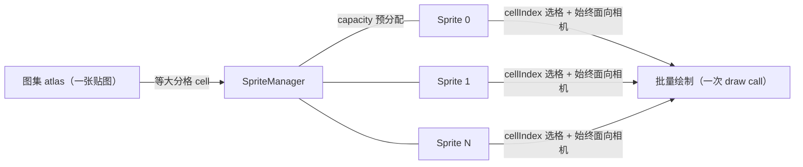

import { Canvas, Controls, Meta } from '@storybook/addon-docs/blocks';
import * as SpriteStories from './sprite-and-spritemanager.stories';

<Meta of={SpriteStories} name="Docs" />

# Sprite

Sprite 是 Babylon.js 里**始终面向相机的 2D 广告牌**。它有 `position`、`size`、`color`，却没有几何体和材质——内部由 `SpriteManager` 用一张公共图集（atlas）批量拼成四边形，每帧根据相机方向重算朝向，让"正面"永远对着观察者。因此 Sprite 不参与光照、不会侧转、不会被相机绕到背后：它是 3D 场景里画标签、图标、位置标注和粒子风发光的轻量单位。

一个 `SpriteManager` 持有**一张图集贴图 + 一组 Sprite**。同一张图集上切成等大分格（cell），每个 Sprite 用 `cellIndex` 选自己显示哪一格；所有 Sprite 由引擎合并成一次批量绘制（batch），不论数量多少都只占一次 draw call。这与"每个 Sprite 各自带几何和材质"的 Mesh billboard 路线截然不同——Sprite 用极小的开销换"少量、独立可控的图标"，详见本课与 [TransformNode](?path=/docs/transformnode-and-grouping--docs) 的对比。



| 对象 / 属性 | 取值 / 默认 | 回查要点 |
| --- | --- | --- |
| `new SpriteManager(name, imgUrl, capacity, cellSize, scene)` | `imgUrl=""` 跳过远程加载；`cellSize` 给像素数或 `{width,height}` | 参数顺序是 **name → imgUrl → capacity → cellSize → scene**；不传纹理时构造后手动赋 `manager.texture` |
| `manager.texture` | `Texture`（含 `DynamicTexture`） | 赋值时强制 `wrapU/wrapV = CLAMP`；图集按 cellSize 等分 |
| `manager.capacity` | 构造时预分配的最大 Sprite 数 | 运行时只读；超出容量的 Sprite 不会绘制 |
| `manager.cellWidth` / `cellHeight` | 来自构造 `cellSize` | 图集每格像素；决定 `cellIndex` 行列布局 |
| `new Sprite(name, manager)` | 自动 `push` 进 `manager.sprites` | 构造只接收 name 与 manager；不传几何或材质 |
| `sprite.position` | `Vector3.Zero()` | 世界坐标；与其它节点一样受父级链影响 |
| `sprite.size` | setter 同步 `width=height`（默认 `1`，世界单位） | 想长宽不同就分别写 `sprite.width` / `sprite.height` |
| `sprite.cellIndex` | `0` 起步，行优先对应图集分格 | 超出格数时按列数回绕；切换立即换图标 |
| `sprite.color` | `Color4(1,1,1,1)` 白色，不染色 | 与图集像素相乘做 tint |
| `sprite.angle` | `0`（弧度） | 绕 Sprite 屏幕中心的额外旋转，不影响 `position` |
| `sprite.isVisible` | `true` | 设 `false` 跳过绘制，不释放资源 |

## SpriteManager：图集与批量渲染

`SpriteManager` 是 Sprite 系统的容器：它把一张图集切成等大的格子，再把这些格子的渲染合并成一次批量绘制。引擎里 Sprite 共享同一份四边形几何，差别只在 `cellIndex`（取哪一格）、`position`、`size`、`color` 等逐 Sprite 属性——所以同一张图集上的 Sprite 越多，相对每个 Mesh billboard 节省的开销越大。

构造函数完整签名（核对自 `@babylonjs/core` 源码）：

```ts
new SpriteManager(
  name: string,
  imgUrl: string,          // 远程图集 URL；传空串 '' 跳过加载
  capacity: number,        // 预分配的最大 Sprite 数（运行时只读）
  cellSize: number | { width: number; height: number }, // 图集每格像素
  scene: Scene,
  epsilon?: number,        // 分格 UV 收敛，默认 0.01
  samplingMode?: number,   // 默认 Texture.TRILINEAR_SAMPLINGMODE
)
```

参数顺序是 **name → imgUrl → capacity → cellSize → scene**。`capacity` 是一次性预分配的上限，之后只能加到这个数量的 Sprite；想动态扩容要重建 manager。`cellSize` 既可以给像素数（正方形格），也可以给 `{width, height}`（长方形格）。

`imgUrl` 非空时，构造函数内部 `new Texture(imgUrl, ...)` 加载远程图集；但这会让范例**依赖网络**，在 headless / 离线环境直接失败。更稳的做法是传空串跳过加载，再手动赋值一张程序化生成的贴图。`SpriteManager.texture` 是可写属性，赋值时自动把 `wrapU / wrapV` 钳到 `CLAMP_ADDRESSMODE`（避免相邻分格采到串色）：

```ts
import { DynamicTexture, SpriteManager } from '@babylonjs/core';

// imgUrl 传 ''：不发起任何网络请求，texture 留空。
const manager = new SpriteManager('icons', '', 64, 128, scene);
// 程序化生成 256×256 的 2×2 图集（4 格），不依赖远程资源。
manager.texture = makeIconAtlas(scene);
```

`DynamicTexture` 继承自 `Texture`，可以直接赋给 `manager.texture`。生成图集的细节见本课末尾的「程序化生成图集」一节；这里先记住**Sprite 必须有贴图**，而远程贴图不是唯一来源——只要在首次渲染前把 `manager.texture` 设成一张已 `update()` 过的 `DynamicTexture` 即可。

## Sprite：广告牌单元

`Sprite` 是 manager 里的一个广告牌实例。构造只接收 name 和 manager，创建后会被自动 push 进 `manager.sprites`：

```ts
import { Sprite, Vector3 } from '@babylonjs/core';

const sprite = new Sprite('label', manager);
sprite.position.set(2, 1, -3); // 世界坐标
sprite.size = 1.2;              // 同步 width = height = 1.2（世界单位）
sprite.cellIndex = 2;           // 显示图集第 2 格
sprite.color.set(1, 1, 0.85, 1); // 偏暖 tint（与图集像素相乘）
sprite.angle = Math.PI / 12;    // 绕屏幕中心额外旋转 15°
```

逐 Sprite 属性的默认值与边界（核对自 `ThinSprite` / `Sprite` 源码）：

| 属性 | 默认 | 说明 |
| --- | --- | --- |
| `position` | `Vector3.Zero()` | Sprite 在世界里的挂点；和其它节点一样受父级链影响 |
| `width` / `height` | `1.0 / 1.0` | Sprite 在世界里的尺寸；`size` setter 同步两者 |
| `cellIndex` | `0` | 行优先对应图集分格；列数 = `texture.width / cellWidth` |
| `color` | `Color4(1,1,1,1)` | 白色 = 不染色；与图集像素逐通道相乘 |
| `angle` | `0` | 弧度；绕 Sprite 屏幕中心额外旋转 |
| `isVisible` | `true` | `false` 跳过绘制，但资源不释放 |
| `invertU` / `invertV` | `false` | 单独镜像某个轴的 UV |
| `isPickable` | `false` | `scene.pick` 是否能命中（见下文） |

释放单个 Sprite 调 `sprite.dispose()`，它会从 `manager.sprites` 里移除自己；释放整个 batch 调 `manager.dispose()`，连带贴图资源由 Texture 自身的引用计数决定——程序化生成的 `DynamicTexture` 不再被引用时要单独 `dispose()`。

## 始终面向相机

Sprite 的核心是 **billboard**：每帧渲染前，引擎把 Sprite 的朝向对齐到相机，让"正面"始终正对观察者。因此：

- 把相机绕到 Sprite 背后，看到的还是它的正面（图标不会反字、不会侧转）。
- `sprite.angle` 只是绕 Sprite 屏幕中心的额外旋转，不会改变它"面向相机"这件事。
- 一张 Sprite 永远是屏幕对齐的四边形，相机再怎么倾斜它都不会变成平行四边形或线段。

这与在 Mesh 上设 `billboardMode = BILLBOARDMODE_ALL` 的效果相似但实现路径不同——详见 [TransformNode](?path=/docs/transformnode-and-grouping--docs) 的 billboard 小节：

| 维度 | `Sprite` + `SpriteManager` | Mesh `billboardMode` |
| --- | --- | --- |
| 形态 | 纯 2D 广告牌，无几何 / 材质 | 真正的 Mesh，自带几何和材质 |
| 批量 | 一个 manager 合并为一次 draw call | 每个 Mesh 一次 draw call（除非实例化） |
| 光照 | 不参与光照，颜色取 `texture × color` | 受场景光源影响（Standard / PBR 材质） |
| 尺寸 | `width / height` 是世界单位，随透视衰减 | 由几何 + `scaling` 决定 |
| 朝向轴 | 恒为完整面向相机（无轴约束选项） | 可按位组合 `X / Y / Z / ALL` |
| 适用 | 标签、图标、位置标注、粒子风发光 | 需要光照、复杂材质或轴约束 billboard 的对象 |

**Sprite 没有屏幕恒定大小的档位。** 它的 `width / height` 是世界单位，随透视距离自然衰减（远小近大）；想做出"屏幕恒定 HUD 标签"的效果，Babylon 没有像 `sizeAttenuation=false` 那样一行开关，应当改用正交相机或在 [GUI 系统](?path=/docs/gui-system--docs) 里用 2D 控件实现。

下面的实例把 SpriteManager 和一组 Sprite 放在一起。范例用 `DynamicTexture` 程序化生成一张 256×256 的 2×2 图集（4 格不同图标），再创建一个容量 64 的 manager，按网格在地面之上摆出若干 Sprite。调整「Sprite 数量」「图集 cellIndex」「Sprite size」，或开启「相机自转」让相机绕 target 公转——不论相机怎么转，所有 Sprite 始终正面朝向观察者。

<Canvas of={SpriteStories.Sprites} />

<Controls of={SpriteStories.Sprites} />

| 读者操作 | 可观察证据 |
| --- | --- |
| 调「Sprite 数量」从 1 到 48 | 活跃 Sprite 读数同步增长；地面上的图标增多，但「渲染批次」始终是 1（一个 manager 合并绘制） |
| 调「图集 cellIndex」0 → 1 → 2 → 3 | 所有 Sprite 同步切换图标（圆 / 方 / 三角 / 星），证明 cellIndex 选的是同一张图集的不同分格 |
| 调「Sprite size」 | 全部 Sprite 等比缩放（世界单位），远端的 Sprite 因透视更小 |
| 开启「相机自转」（或手动拖拽） | 地面网格透视不断变化，但每个 Sprite 的正面始终朝向你——不会侧转、不会露出侧边 |
| 打开 Show code | 看到该 Canvas 实际执行的 `example.ts`，含 `DynamicTexture` 程序化图集与 `SpriteManager` 构造 |

Sprite 还能被 `scene.pick` 命中：默认 `sprite.isPickable = false`，设为 `true` 后 `scene.pick(x, y)` 会把 Sprite 纳入命中判定，`pickInfo.pickedSprite` 给出被点中的那个（不同于 `pickedMesh`）。想精确到贴图 alpha 才算命中，再开 `sprite.useAlphaForPicking = true`。指针与拾取的完整机制见 [指针与拾取](?path=/docs/pointer-input-and-picking--docs)。

## 程序化生成图集：DynamicTexture

范例图集不是远程 PNG，而是用 `DynamicTexture` 程序化绘制的。`DynamicTexture` 内部维护一块 canvas，`getContext()` 拿到 2D 上下文后用标准 canvas API 画图，`update()` 把像素推到 GPU。这样范例**不依赖任何网络资源**，在 headless / 离线 / CI 里都能跑。

```ts
import { DynamicTexture, Texture } from '@babylonjs/core';

function makeIconAtlas(scene) {
  const size = 256;
  const tex = new DynamicTexture(
    'spriteAtlas',
    { width: size, height: size },
    scene,
    false,                          // generateMipMaps
    Texture.TRILINEAR_SAMPLINGMODE,
  );
  tex.hasAlpha = true;
  const ctx = tex.getContext();     // 标准 2D canvas 上下文
  ctx.clearRect(0, 0, size, size);
  // 在 2×2 共 4 格里用 canvas API 画图标（圆 / 方 / 三角 / 星）：
  drawIcon(ctx, 0,   0,   128, 'circle', '#e23c4d');
  drawIcon(ctx, 128, 0,   128, 'square', '#3ca45a');
  // ... 其余两格同理
  tex.update();                     // 上传到 GPU；默认 invertY=true
  return tex;
}
```

几个关键约束：

- **cellSize 必须与图集像素布局一致。** 范例图集 256×256、每格 128 像素，所以 `new SpriteManager(..., 128, scene)`；改成 `{width:64, height:64}` 就能放 4×4 = 16 格。
- **`cellIndex` 按行优先映射。** 列数 = `texture.width / cellWidth`，第 N 格的位置是 `col = N % 列数`、`row = floor(N / 列数)`。范例 2 列：0/1 在上一行，2/3 在下一行（具体 V 朝向取决于贴图 `invertY`，切换 `cellIndex` 即可观察实际对应关系）。
- **`update(invertY)` 控制上传时是否翻转 Y。** 默认 `true`。如果发现 `cellIndex` 与你画在 canvas 上的上下顺序对调，把它显式设成 `false` 比反着重画更直接。
- **图集内容变更后要重新 `update()`。** `DynamicTexture` 不会自动同步；运行时改了 canvas 内容（例如文字标签更新）必须再调一次 `update()`。

文字标签的常见做法是把这套包装成 `makeLabelTexture(text, color)`：在 canvas 上画圆角底色 + 文字，返回 `DynamicTexture`，再交给 `SpriteManager`。标签内容变了就清画布重画、`update()`、必要时重建 manager。

## 最佳实践

- **按图集而非按 Sprite 组织 manager。** 一组同外观、同图集的 Sprite 共用一个 manager 才能合并成一次 draw call；为每个 Sprite 单独建 manager 等于退回到 Mesh 的逐个绘制。
- **`capacity` 留够余量但不滥用。** 它预分配缓冲，过大会占显存、过小要重建。按"这一组图标最多多少个"估，宁可略大。
- **需要光照、轴约束或复杂材质时改用 Mesh billboard。** Sprite 是纯 2D，没有 PBR / 法线 / `side`；只有“面朝相机”的需求时才用它，详见 [TransformNode](?path=/docs/transformnode-and-grouping--docs)。
- **范例贴图优先程序化。** 用 `DynamicTexture` 或 data URL 生成图集，避免远程 URL 在离线 / CI 失败；上线再换成打包好的 atlas。
- **释放时同步释放贴图。** `manager.dispose()` 不会自动 dispose 你手动赋的 `DynamicTexture`；程序化贴图不再被引用时单独 `tex.dispose()`，避免 WebGL 资源累积。
- **想批量切换外观用 `cellIndex`，不用多 manager。** 把多种图标打包到同一张图集，逐 Sprite 切 `cellIndex` 比"每个 manager 装一种图标"开销更低。

## 常见问题

- 为什么 Sprite 看不见？
  先看 `manager.texture` 有没有赋值、`DynamicTexture` 有没有 `update()`；再看 `cellIndex` 是否落在图集格数内、`size` 是否过小、`position` 是否在相机视锥里、`isVisible` 是否被设成 `false`。
- 为什么范例在离线 / CI 里报贴图加载错误？
  `SpriteManager` 构造时传了非空 `imgUrl`，引擎会去拉远程资源。改成传空串 `''` 跳过加载，再手动赋 `DynamicTexture`。
- 为什么所有 Sprite 显示的都是同一格之外的内容，或图集错位？
  `cellSize` 与图集每格像素不一致，或 `cellIndex` 超过格数。核对 `texture.width / cellWidth` 等于你设计的列数；`update(invertY)` 与 canvas 绘制顺序对不上时，换一下 `invertY` 比反着画更省事。
- 为什么改 `sprite.angle` 后 Sprite 没有绕世界轴转？
  `angle` 只绕 Sprite 屏幕中心额外旋转；Sprite 的朝向永远被 billboard 覆盖为面向相机。想"绕轴"旋转得用 Mesh billboard。
- 为什么 Sprite 不会随距离保持屏幕大小？
  Sprite 的 `width / height` 是世界单位，远小近大随透视衰减，没有屏幕恒定档。需要 HUD 类恒定大小标签时改用正交相机或 [GUI 系统](?path=/docs/gui-system--docs)。
- 为什么 `scene.pick` 点不到 Sprite？
  `sprite.isPickable` 默认 `false`。设为 `true` 后命中信息在 `pickInfo.pickedSprite`（不是 `pickedMesh`）；要按贴图 alpha 精确命中再开 `sprite.useAlphaForPicking`。
- 为什么加到 `capacity` 之后再加 Sprite 不显示？
  `capacity` 在构造时预分配，运行时只读。超出容量的 Sprite 会被绘制阶段忽略；要扩容得重建 manager，或一开始就把容量估够。

## 总结回顾

摘要：

Sprite 是 Babylon.js 始终面向相机的 2D 广告牌，没有几何与材质，由 `SpriteManager` 用一张公共图集批量拼成四边形。manager 构造参数顺序是 name → imgUrl → capacity → cellSize → scene，传空串 imgUrl 跳过远程加载、再手动赋 `manager.texture`（常用 `DynamicTexture` 程序化生成图集）。Sprite 构造只接收 name 和 manager，`position` 决定挂点、`size` 同步 `width/height`、`cellIndex` 选图集分格、`color` tint、`angle` 绕屏幕中心额外旋转。一个 manager 共享一张图集，所有 Sprite 合并为一次 draw call；与 Mesh `billboardMode` 相比，Sprite 更轻但不能参与光照、不能按轴约束、没有屏幕恒定大小档。

一句话：

> Sprite 是 3D 空间里的 2D 图标：它的位置在世界里，它的正面永远跟着相机，同一张图集上的所有 Sprite 由 SpriteManager 合并成一次绘制。

知识要点：

- `SpriteManager` 的构造参数顺序是什么？`imgUrl` 传空串时怎么让 Sprite 有贴图？
- `capacity` 与 `cellSize` 各自决定什么？运行时能不能改？
- `cellIndex` 怎样映射到图集分格？图集列数由什么决定？
- Sprite 与 Mesh `billboardMode` 在批量、光照、轴约束和屏幕恒定大小上各差在哪？
- 程序化生成图集为什么比远程 URL 更稳？`DynamicTexture.update()` 何时必须调？
- 一个 manager 占几次 draw call？为什么按图集而非按 Sprite 组织 manager？

## 参考资料

- [Babylon.js TypeDoc：SpriteManager](https://doc.babylonjs.com/typedoc/classes/BABYLON.SpriteManager)
- [Babylon.js TypeDoc：Sprite](https://doc.babylonjs.com/typedoc/classes/BABYLON.Sprite)
- [Babylon.js TypeDoc：DynamicTexture](https://doc.babylonjs.com/typedoc/classes/BABYLON.DynamicTexture)
- [Babylon.js Features：Sprites](https://doc.babylonjs.com/features/featuresDeepDive/sprites)
- [Babylon.js Guided Learning](https://doc.babylonjs.com/guidedLearning/)
- [Babylon.js GitHub：spriteManager.ts / sprite.ts（源码核对构造签名与默认值）](https://github.com/BabylonJS/Babylon.js/blob/master/packages/dev/core/src/Sprites/spriteManager.ts)
