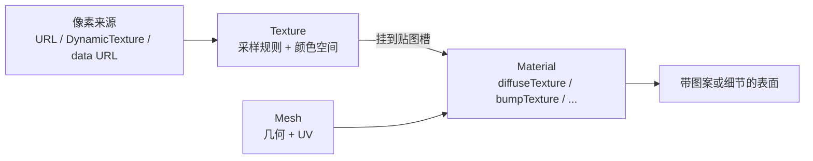

import { Canvas, Controls, Meta } from '@storybook/addon-docs/blocks';
import * as TexturesStories from './textures.stories';

<Meta of={TexturesStories} name="Docs" />

# 纹理

没有纹理时，材质只靠 `diffuseColor` 这类标量上色，整面是一块均匀颜色。纹理把一张图像（或程序生成的像素）交给 `Texture`，再由材质的某个**贴图槽**解释——几何表面上的点按 UV 去贴图里取一个颜色或数值，表面才出现砖墙、木纹、贴纸或凹凸之类的细节。

一次看清纹理怎么进材质：

1. **像素来源**——图片 URL、`DynamicTexture` 的 2D canvas、data URL，或 `ProceduralTexture` 的着色器输出。
2. **`Texture`**——保存像素，并附带采样规则（包裹、过滤、各向异性）与色彩管理（`gammaSpace`）。
3. **材质贴图槽**——决定这些采样值用作颜色（`diffuseTexture`）、法线（`bumpTexture`）、透明（`opacityTexture`）还是其它数据。

像素进 `Texture` 后，由材质槽解释为不同用途；UV 决定取样位置，包裹与过滤决定越界和缩放时怎么采样，颜色空间区分颜色数据与数值数据。本课只讲 `Texture` 自身和它如何挂上材质；材质种类、透明与背面剔除见 [材质](?path=/docs/materials--docs)，PBR 的金属度/粗糙度贴图与 IBL 细节见 [PBR 与环境](?path=/docs/pbr-and-environment--docs)。



| 输入或属性 | 默认 / 常用起点 | 改变后要注意什么 |
| --- | --- | --- |
| `new Texture(url, scene?, noMipmap?, invertY?, samplingMode?, onLoad?, onError?)` | `samplingMode` 默认 `Texture.TRILINEAR_SAMPLINGMODE` | `noMipmap=true` 时 TRILINEAR 无层级可用，会回退；远程 URL 加载是异步的 |
| `wrapU` / `wrapV` | `Texture.WRAP_ADDRESSMODE`（普通 Texture） | **`DynamicTexture` 构造里强制设为 `CLAMP_ADDRESSMODE`**，需要平铺要手动覆盖 |
| `invertY`（构造参数） | `true` | 弥补「canvas 原点在左上、UV 原点在左下」的差异；glTF 模型纹理常为 `false` |
| `samplingMode` | `Texture.TRILINEAR_SAMPLINGMODE` | 改变后需重建贴图；DynamicTexture 在 `createDynamicTexture` 时确定 |
| `anisotropicFilteringLevel` | `1` | 提高倾斜表面清晰度；上限由 `engine` 能力决定 |
| `gammaSpace` | `true` | 颜色贴图保持 `true`；法线/不透明度等数据贴图设 `false` 避免被错误 gamma 解码 |
| `uScale` / `vScale` / `uOffset` / `vOffset` | `1 / 1 / 0 / 0` | UV 变换在纹理侧做，不动几何顶点 UV |
| `uAng` / `vAng` / `wAng` | `0` | UV 旋转（弧度），围绕 `u/v/wRotationCenter`（默认 `0.5`） |

## 加载纹理

`new Texture(url, scene)` 是入口：第一参数是图片 URL（或 data URL），第二参数可省略（默认用最后一个 Scene）。加载是异步的——构造返回的 `Texture` 对象已经可以挂到材质，但像素要等 `onLoad` 触发后才真正上传 GPU。

```ts
import { Texture } from '@babylonjs/core';

const diffuse = new Texture(
  '/textures/brick.png',
  scene,
  false,                          // noMipmap：false 表示生成 mipmap
  true,                           // invertY：默认 true
  Texture.TRILINEAR_SAMPLINGMODE, // 默认值
  () => console.log('loaded', diffuse.getSize()),
  (msg, exc) => console.error('texture error', msg, exc),
);

material.diffuseTexture = diffuse;
```

构造的完整签名是 `Texture(url, scene?, noMipmap?, invertY?, samplingMode?, onLoad?, onError?, samplingMode?)`（前两个最常用，其余按需）。`noMipmap=true` 关闭 mipmap 会让 TRILINEAR 退化为 BILINEAR；除非确定贴图永远 1:1 显示（如全屏 UI），否则保留默认。加载多资源、需要进度和失败汇总时改用 `AssetsTexture` 或 `SceneLoader.ImportMesh`，见 [加载模型](?path=/docs/sceneloader-and-gltf--docs)。

远程 URL 在离线、CI 或 headless 环境会失败。本课的范例就遇到这个问题——Storybook 静态构建不能保证外网可达。两种离线替代：

- **data URL**：把小图编码成 `data:image/png;base64,...` 直接当作 `url` 传给 `Texture`，不发起网络请求。
- **`DynamicTexture`**：用 2D canvas 程序化画一张贴图，完全离线，运行时还能改内容。本课和 [Sprite](?path=/docs/sprite-and-spritemanager--docs) 的范例都用它生成图集；细节见本课末尾「程序化与动态贴图」。

## 采样：包裹与过滤

纹素和表面像素不再一一对应时，GPU 怎么取样由两组规则决定：**包裹模式**回答「UV 越出 `[0,1]` 怎么办」，**过滤模式**回答「相邻纹素怎么混合」。它们都写在 `Texture` 对象上，材质槽只负责把贴图挂上去，不参与采样决策。

### 包裹模式（wrapU / wrapV）

`wrapU` / `wrapV` 各自决定 U、V 方向越界后的处理，三档取值是 `Texture` 的静态常量：

| 常量 | 行为 | 典型现象 |
| --- | --- | --- |
| `Texture.WRAP_ADDRESSMODE`（默认） | 越界部分从 0 重新开始，整图重复平铺 | `uScale=2` 看到左右两份 |
| `Texture.CLAMP_ADDRESSMODE` | 越界部分钳到边缘像素，边缘被拉满 | `uScale=2` 看到一份 + 边缘色填满剩余 |
| `Texture.MIRROR_ADDRESSMODE` | 每次越界翻转一次再平铺，相邻份互为镜像 | `uScale=2` 看到正反两份，箭头朝向交替 |

`wrapU` 和 `wrapV` 互相独立，可以只在 U 方向镜像、V 方向钳制。**注意默认值差异**：普通 `Texture` 两个方向默认都是 `WRAP_ADDRESSMODE`；但 `DynamicTexture` 在构造里被强制设成 `CLAMP_ADDRESSMODE`（避免 canvas 像素在边缘串色），需要平铺时必须手动覆盖回 `WRAP`。

### 过滤与各向异性

**过滤模式**决定放大（一个纹素覆盖多个像素）和缩小（一个像素覆盖多个纹素）时的取值方式，由构造或 `samplingMode` 属性决定，仍是 `Texture` 的静态常量：

| 常量 | 行为 | 适用 |
| --- | --- | --- |
| `Texture.NEAREST_SAMPLINGMODE` | 取最近一个纹素，硬边、有锯齿 | 像素画、需要保留锐利边缘的图标 |
| `Texture.BILINEAR_SAMPLINGMODE` | 在同层 mipmap 上线性插值，平滑 | 不能用 mipmap 时的折中 |
| `Texture.TRILINEAR_SAMPLINGMODE`（默认） | 在最近两层 mipmap 上分别线性插值后再混合 | 通用默认，远距闪烁最少 |

TRILINEAR 需要 mipmap 层级（`noMipmap=false`）。没有 mipmap 时它会退化为 BILINEAR。

**各向异性**（`anisotropicFilteringLevel`，默认 `1`）专门改善「斜视表面在一个方向被强烈压缩」时的模糊——典型例子是地面砖纹在远端糊成一片。它独立于 samplingMode，提高后近距几乎不变、远距更清晰；上限由 `engine` 能力决定。倾斜表面确有收益时再提高，全场景盲目拉高会增加纹理采样成本。

下面的实例把 `Texture` 的采样规则一次性展示。范例用 `DynamicTexture` 程序化生成「4×4 彩色格子 + 中心箭头 + 四角字母」（程序化生成是为避开远程 URL 依赖），挂到一块面向相机的平面。切换「wrapU / wrapV」「uScale / vScale」「samplingMode」「invertY」，观察平铺 / 镜像 / 钳制、锯齿 / 平滑、以及 Y 翻转的差异。

<Canvas of={TexturesStories.Textures} />

<Controls of={TexturesStories.Textures} />

| 读者操作 | 可观察证据 |
| --- | --- |
| 默认（wrapU/V = WRAP，uScale/vScale = 2） | 平面看到 2×2 共 4 份完整格子，四角字母重复出现 |
| 切 wrapU = MIRROR（保留 uScale=2） | 相邻两份左右镜像，中心箭头朝向交替反向 |
| 切 wrapU = CLAMP（保留 uScale=2） | 只剩一份完整格子，其余区域被边缘像素拉满（颜色呈条纹） |
| 切 samplingMode = NEAREST | 格子分隔线和角字母出现明显锯齿；TRILINEAR 时平滑 |
| 关闭 invertY | 中心箭头朝下、四角字母上下颠倒（TL/TR 沉到底部） |
| 调 uScale / vScale 到 1 | 不论 wrapU/V 如何，都只显示一份贴图（UV 没越界，包裹规则不触发） |
| 打开 Show code | 看到该 Canvas 实际执行的 `example.ts`，含 `DynamicTexture` 程序化绘制与采样参数写入 |

实例进入视口附近才启动渲染循环，离开后停止并保留最后一帧，避免离屏空转；调度细节见 [渲染循环与时间](?path=/docs/render-loop-and-timing--docs)。

## UV 坐标与变换

**UV 回答「表面这一点对应贴图的哪里」。** 每个顶点除了 `position`，还可以带一对 `(u, v)` 落在 `[0,1]`——三角形内部的点按插值后的 UV 去贴图取样。Babylon.js 的内置几何（`CreateBox`、`CreatePlane`、`CreateGround`、`CreateSphere` 等）在构造时已经写好 UV，本课直接用，不必先在建模软件里展开。

UV 原点在贴图的**左下角**，而 2D canvas 原点在**左上角**。`Texture` 的构造参数 `invertY`（默认 `true`）弥合这个差异：上传像素时翻转一次 Y 轴，让 canvas 画出的「上」在贴图采样后仍是「上」。两种典型要改成 `invertY=false` 的场景：glTF 模型的纹理按约定已经是正向（`SceneLoader` 会自动处理，手工替换时记得同步）；或调试 UV 时想看「未翻转」的原始像素。

`Texture` 还提供一组 UV 变换属性，在不改几何顶点 UV 的前提下平移、缩放、旋转取样：

```ts
const tex = material.diffuseTexture as Texture;
tex.uScale = 3;            // U 方向重复 3 次（配合 wrapU=WRAP 才平铺）
tex.vScale = 2;            // V 方向重复 2 次
tex.uOffset = 0.25;        // U 方向平移
tex.vOffset = -0.1;
tex.uAng = Math.PI / 6;    // 绕 U 轴旋转（弧度）
tex.uRotationCenter = 0.5; // 旋转中心（默认 0.5，即贴图中心）
```

`invertU` / `invertV` 单独镜像某个轴（等价于该轴 scale 取负并移位），`coordinatesMode` 决定如何把变换矩阵应用到 UV（默认 `EXPLICIT_MODE` 直接用上述属性；环境贴图等特殊用途用 `PROJECTION_MODE` 等）。UV 方向问题只出在某个模型上先查该几何的 UV；所有模型一致再查 `Texture`。

## 颜色空间

同一份像素存成 RGB 通道，**数值含义可能不同**：

- **颜色数据**（diffuse、emissive、UI 图）保存的是给人眼看的颜色，通常按 sRGB / gamma 编码，采样前要解码到线性工作空间再参与光照计算。
- **数值数据**（法线、粗糙度、金属度、不透明度、AO）保存的是数学量，**不能**做 gamma 解码，否则数据被错误拉伸导致渲染偏亮或法线方向异常。

`Texture` 用 `gammaSpace` 区分（默认 `true`，即当作 gamma 编码的颜色贴图）：

```ts
import { Texture } from '@babylonjs/core';

material.diffuseTexture = new Texture('/textures/brick.png', scene); // 默认 gammaSpace=true，正确
material.bumpTexture = new Texture('/textures/normal.png', scene);
material.bumpTexture!.gammaSpace = false; // 法线是数据贴图，必须关闭 gamma 解码
```

`linearSpace` 是 `gammaSpace` 的反义只读属性（`linearSpace === !gammaSpace`）。`StandardMaterial` 假设颜色贴图是 gamma 编码、数据贴图是线性，baking 进 shader；手工替换贴图时要按用途同步 `gammaSpace`。`PBRMaterial` 的色彩管理由 `scene.imageProcessingConfiguration`（tone mapping、contrast、exposure）统一控制，细节见 [PBR 与环境](?path=/docs/pbr-and-environment--docs)；`Color3` / `Color4` 在引擎内部按线性工作空间的分量存储，直接写 `new Color3(r, g, b)` 时注意它代表线性值还是 sRGB 值，遵循当前场景的色彩约定。

## 材质贴图槽

`Texture` 只保存像素和采样规则；**放进材质哪个属性，才决定采样值干什么**。最常见的是 `diffuseTexture`：采样结果当作受光基础颜色（再乘 `diffuseColor`）。同一份像素若进 `bumpTexture`，则改表面法线，画面上看起来像凹凸，颜色本身不变。

`StandardMaterial` 的主要贴图槽（属性名与含义核对自 TypeDoc）：

| 槽位 | 数据含义 | 颜色空间 |
| --- | --- | --- |
| `diffuseTexture` | 受光基础颜色，乘 `diffuseColor` | 颜色，`gammaSpace=true` |
| `emissiveTexture` | 自发光颜色，乘 `emissiveColor`，不受光照 | 颜色，`gammaSpace=true` |
| `bumpTexture` | 切线空间法线（normal map），改变表面朝向 | 数据，`gammaSpace=false` |
| `specularTexture` | 控制高光颜色 / 强度 | 颜色或数据，按用途 |
| `opacityTexture` | 用某个通道控制透明（`useAlphaFromDiffuseTexture` 等开关决定取哪） | 数据，`gammaSpace=false` |
| `ambientTexture` | 环境光贡献颜色 | 颜色，`gammaSpace=true` |
| `lightmapTexture` | 预烘焙光照，乘到最终颜色 | 颜色，`gammaSpace=true` |
| `refractionTexture` | 折射背景 | 视场景而定 |

注意 Babylon.js StandardMaterial 里**法线贴图槽叫 `bumpTexture`**（不是 three.js 的 `normalMap`），属性名遵循引擎命名；同样的贴图进 `diffuseTexture` 是颜色、进 `bumpTexture` 是法线。贴图整体强度由 `BaseTexture.level`（默认 `1`）缩放，法线扰动强度也随它变化；各槽位的具体开关与材质参数见 [材质](?path=/docs/materials--docs)。

同一张 `Texture` 可以复用给多个材质，引擎内部按引用计数管理 GPU 资源；只有确认没有材质继续使用时才调 `texture.dispose()`。

## 程序化与动态贴图

### DynamicTexture

`DynamicTexture` 继承自 `Texture`，内部维护一块 2D canvas：`getContext()` 拿到标准 2D 上下文后用 canvas API 画图，`update()` 把像素推到 GPU。它的内容**完全由代码生成**，不依赖任何网络资源，运行时还能改。

```ts
import { DynamicTexture, Texture } from '@babylonjs/core';

const tex = new DynamicTexture(
  'label',
  { width: 256, height: 128 },
  scene,
  false,                          // generateMipMaps
  Texture.TRILINEAR_SAMPLINGMODE,
);
const ctx = tex.getContext();
ctx.fillStyle = '#222';
ctx.fillRect(0, 0, 256, 128);
ctx.fillStyle = '#fff';
ctx.font = 'bold 48px sans-serif';
ctx.fillText('Hello', 20, 80);
tex.update();                     // 上传到 GPU；默认 invertY=true
```

构造签名 `DynamicTexture(name, size | canvas, scene?, generateMipMaps?, samplingMode?, format?, invertY?)`，`size` 给数字（正方形）或 `{width, height}`。`update(invertY?, premulAlpha?, allowGPUOptimization?)` 上传像素，`invertY` 省略时默认 `true`；想关闭翻转显式传 `false`（`tex.update(false)`）。`drawText(text, x, y, font, color, fillColor, invertY?, update?)` 是封装好的文字绘制助手。

几个关键约束：

- **DynamicTexture 的 `wrapU/wrapV` 默认是 `CLAMP_ADDRESSMODE`**（与普通 `Texture` 不同）。源码在构造里强制设成 CLAMP 避免边缘串色；需要平铺要手动覆盖回 `WRAP`。
- **内容变更后要重新 `update()`。** `DynamicTexture` 不会自动同步；canvas 重画后必须再调一次 `update()`。
- **`update(invertY)` 控制上传时是否翻转 Y。** 默认 `true`，匹配 UV 原点；想看 canvas 原始方向传 `false`。
- **`drawText` 的 `y` 在 `invertY=true` 时从顶部量、`false` 时从底部量。** 排版错位时先核对 `invertY` 而不是反着重画。

文字标签的常见做法是包装成 `makeLabel(text, color)`：在 canvas 上画圆角底色 + 文字，返回 `DynamicTexture`，挂到 GUI 或 Sprite 上。Babylon.js 的 [`@babylonjs/gui`](https://doc.babylonjs.com/typedoc/) 还提供 `AdvancedDynamicTexture`，把完整 2D 控件系统渲染到一张贴图上，见 [GUI 系统](?path=/docs/gui-system--docs)。

### ProceduralTexture

`ProceduralTexture`（及其子类 `NoiseProceduralTexture`，以及 `BrickProceduralTexture`、`MarbleProceduredTexture`、`FireProceduredTexture` 等内置变体）用 **GPU 着色器**实时生成像素，适合做噪声、木纹、火焰、大理石等连续图案。它独立成包 `@babylonjs/procedural-textures`，每帧重新执行着色器，因此能产出永远变化的纹理，但消耗 GPU；与 Node Material、ShaderMaterial 一起放在 [Node Material 与着色器](?path=/docs/node-material-and-shaders--docs) 讲。

## 环境贴图

`scene.environmentTexture` 是一个**立方体贴图**（cube texture），同时承担两件事：作为 PBR 材质的**环境光照（IBL）**输入——把环境光预滤波成不同粗糙度的反射卷；以及作为 `scene.environmentIntensity`、反射、背景天空盒的数据源。

```ts
import { CubeTexture } from '@babylonjs/core';

scene.environmentTexture = new CubeTexture('/environments/studio.env', scene);
scene.environmentIntensity = 1.0; // 全局环境光强度
```

环境贴图的格式（`.env`、HDR、glTF 内嵌）和 IBL 的预滤波机制细节见 [PBR 与环境](?path=/docs/pbr-and-environment--docs)。本课只要记住：`environmentTexture` 也是 `Texture` 家族的一员（`CubeTexture` 继承自 `BaseTexture`），它影响的是 PBR 的反射和环境光，不直接挂在材质的贴图槽上。

## 最佳实践

- **先确认「这张图要干什么」再选槽位和颜色空间。** 颜色进 `diffuseTexture`/`emissiveTexture` 并保持 `gammaSpace=true`；法线/不透明度等数值进对应数据槽并设 `gammaSpace=false`，再调灯光和材质强度。
- **需要平铺时显式覆盖 DynamicTexture 的 wrap。** 它默认 CLAMP，不覆盖就只有一份贴图，`uScale>1` 会出现边缘拉满而不是平铺。
- **纹理变形优先修几何 UV，再用 `uScale`/`uOffset` 做运行时构图。** 不要用极端 UV 变换掩盖错误的 UV 展开；同一份像素多处复用时共享 `Texture`，销毁场景前去重再 `dispose()`。
- **远程 URL 在离线 / CI 会失败。** 范例贴图优先用 `DynamicTexture` 或 data URL 生成，避免外部依赖；上线再换成打包好的资源。
- **TRILINEAR 需要 mipmap。** 除非确定贴图永远 1:1 显示，否则保留 `noMipmap=false`；倾斜表面远端模糊时提高 `anisotropicFilteringLevel`，而不是只靠加大原图分辨率。
- **内容变了要 `update()`。** `DynamicTexture` 不会自动同步 canvas；改了 canvas 必须再调 `update()`，否则画面保留旧像素。

## 常见问题

- 为什么贴图完全不出现？
  先确认 `Texture` 是否赋给了正确的材质槽（如 `material.diffuseTexture = tex`），几何是否有 UV（内置几何默认有），`onLoad` 是否触发（远程 URL 检查网络与 CORS）。Storybook 静态构建或离线环境里远程 URL 大概率失败，改用 `DynamicTexture` 或 data URL。
- 为什么 `uScale > 1` 却只看到一份贴图、其余被边缘色填满？
  `wrapU`（或 `wrapV`）是 `CLAMP_ADDRESSMODE`。普通 `Texture` 默认 WRAP，但 `DynamicTexture` 默认 CLAMP；显式设 `tex.wrapU = Texture.WRAP_ADDRESSMODE` 后再 `uScale=2` 才平铺。
- 为什么法线贴图让物体偏亮或凹凸方向不对？
  法线是数据贴图，必须 `bumpTexture.gammaSpace = false`；放进 `bumpTexture` 而不是 `diffuseTexture`；并确认模型的切线和法线方向约定与贴图一致。
- 为什么贴图颜色整体偏亮或偏灰？
  颜色贴图（diffuse / emissive）保持默认 `gammaSpace=true`，数据贴图设 `false`；PBR 场景再核对 `scene.imageProcessing` 的 tone mapping 与 exposure，见 [PBR 与环境](?path=/docs/pbr-and-environment--docs)。
- 为什么 `DynamicTexture` 画了新内容，画面没变？
  canvas 重画后必须再调 `tex.update()`。`update()` 默认 `invertY=true`，发现上下颠倒就显式传 `update(false)` 比反着重画省事。
- 为什么给 glTF 模型手工替换的贴图上下颠倒？
  glTF 纹理按约定不翻转；构造时传 `invertY=false`（或 `tex.update(false)`）匹配原 UV 方向，同时核对 `gammaSpace` 与贴图槽。
- 为什么远处地面纹理闪烁或出现摩尔纹？
  缩小时优先用 TRILINEAR（需要 `noMipmap=false`）；斜视表面再按 `engine` 能力上限提高 `anisotropicFilteringLevel`，而不是只加大原图分辨率。
- 为什么改成 NEAREST 后边缘反而变锐利但锯齿明显？
  这就是 NEAREST 的预期行为——它取最近一个纹素不插值。需要平滑改回 TRILINEAR 或 BILINEAR。
- 为什么改了 `samplingMode`，画面没变？
  DynamicTexture 的采样状态在 `createDynamicTexture` 时确定，直接改属性未必同步到 GPU；范例里通过重建贴图实现切换。临时验证也可以试 `texture.updateSamplingMode(mode)`，但重建最稳。

## 总结回顾

摘要：

纹理把图像（或程序生成的像素）交给 `Texture`，再由材质的某个贴图槽解释为颜色、法线、透明或其它用途。像素来源可以是 URL、data URL、`DynamicTexture` 的 2D canvas 或 `ProceduralTexture` 的着色器输出。`Texture` 持有采样规则：`wrapU`/`wrapV`（默认 WRAP，但 DynamicTexture 强制 CLAMP）处理 UV 越界，`samplingMode`（默认 TRILINEAR）与 `anisotropicFilteringLevel` 处理放大缩小和斜视。UV 原点在左下，`invertY`（默认 true）弥合与 canvas 左上原点的差异；`uScale`/`vScale`/`uOffset`/`uAng` 在不改正点 UV 的前提下平移缩放旋转取样。颜色贴图保持 `gammaSpace=true`，法线/不透明度等数据贴图设 `false`。`StandardMaterial` 的主要槽位是 `diffuseTexture`、`emissiveTexture`、`bumpTexture`（法线）、`opacityTexture`、`specularTexture`、`ambientTexture`、`lightmapTexture`；注意法线槽在 Babylon 里叫 `bumpTexture`，不是 `normalMap`。

一句话：

> 贴图外观 = 几何 UV × `Texture`（采样规则 + 颜色空间）× 材质贴图槽；先组合这三者，再调采样细节。

知识要点：

- `Texture`、材质贴图槽和几何 UV 分别决定最终画面的哪一部分？
- `wrapU`/`wrapV` 三档常量各自什么行为？普通 `Texture` 与 `DynamicTexture` 的默认值为什么不同？
- `invertY` 默认为什么是 `true`？它弥合的是什么差异？glTF 模型为什么常要改成 `false`？
- NEAREST、BILINEAR、TRILINEAR 各适合什么场景？TRILINEAR 为什么需要 mipmap？
- 颜色贴图和数据贴图（如 `bumpTexture`）在 `gammaSpace` 上为什么必须不同？
- `StandardMaterial` 的法线贴图槽叫什么？它和 three.js 的 `normalMap` 命名有什么区别？
- `DynamicTexture` 改了 canvas 内容后必须做什么？`update(invertY)` 的默认值是什么？
- 环境贴图挂在哪个属性上？它直接影响材质的什么？

## 参考资料

- [Babylon.js TypeDoc：Texture](https://doc.babylonjs.com/typedoc/classes/BABYLON.Texture)
- [Babylon.js TypeDoc：DynamicTexture](https://doc.babylonjs.com/typedoc/classes/BABYLON.DynamicTexture)
- [Babylon.js TypeDoc：StandardMaterial](https://doc.babylonjs.com/typedoc/classes/BABYLON.StandardMaterial)
- [Babylon.js Features：Materials / Using Textures（更详细的贴图教学）](https://doc.babylonjs.com/features/featuresDeepDive/materials/using/materials_introduction)
- [Babylon.js Features：Dynamic Texture](https://doc.babylonjs.com/features/featuresDeepDive/materials/using/dynamicTexture)
- [Babylon.js：Texture Repetition（WRAP 默认值与包裹）](https://doc.babylonjs.com/features/featuresDeepDive/materials/using/textureRepetition)
- [Babylon.js：Controlling Color Space（颜色 vs 数据贴图的色彩管理）](https://doc.babylonjs.com/preparingArtForBabylon/controllingColorSpace)
- [Babylon.js GitHub：dynamicTexture.pure.ts（核对 wrap 默认值与 update 签名）](https://github.com/BabylonJS/Babylon.js/blob/master/packages/dev/core/src/Materials/Textures/dynamicTexture.pure.ts)
