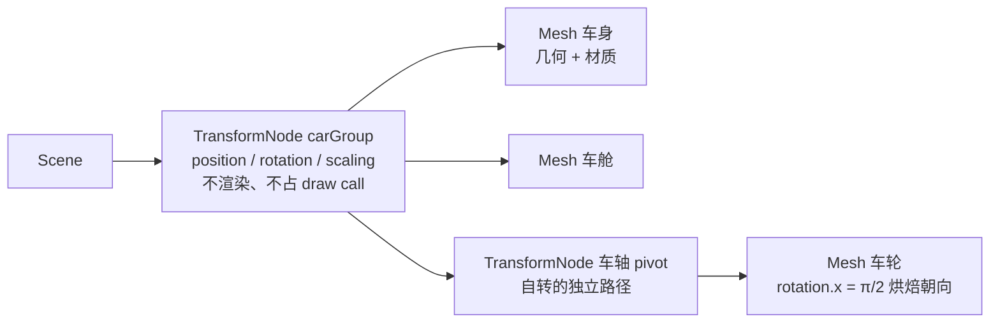

import { Canvas, Controls, Meta } from '@storybook/addon-docs/blocks';
import * as GroupingStories from './transformnode-and-grouping.stories';

<Meta of={GroupingStories} name="Docs" />

# TransformNode

`TransformNode` 是一个**只承担变换、不可见、不参与渲染**的节点，`extends Node`。它拥有完整的变换属性——`position` / `rotation` / `scaling` / `rotationQuaternion` / `billboardMode`——但不带几何与材质，所以不进渲染队列、不占 draw call、不能拾取。这让它成为两件事的载体：一是**承载变换数学**（本课前半），二是**分组与组织**多个对象（本课后半，对应 three.js 的 `Group`）。

`Node` 的公共属性（`name` / `parent` / `setEnabled` 等）和父子挂载的基础语义见 [Node](?path=/docs/node--docs)；本课聚焦 `TransformNode` 自己的东西：变换怎么算、世界矩阵何时更新、`rotationQuaternion` 与 `rotation` 谁说了算、billboard 怎么覆盖朝向，以及怎么用它编组。坐标系、单位、弧度的基础见 [坐标与尺寸](?path=/docs/coordinate-system-and-units--docs)。



| API 或概念 | 取值 / 默认 | 回查要点 |
| --- | --- | --- |
| `new TransformNode(name, scene?, isPure=true)` | 第三参 `isPure` 默认 `true`，属引擎内部标志 | `isPure=true` 时注册进 `scene.transformNodes`；业务代码只传 `name`（和 `scene`） |
| TransformNode 是否渲染 | **不渲染**（无几何、无材质） | 不进渲染队列、不占 draw call、不会被 `scene.pick` 命中 |
| `position=(0,0,0)` `rotation=(0,0,0)` `scaling=(1,1,1)` `rotationQuaternion=null` | 局部变换默认值 | 弧度制；`rotation` 是 YXZ 顺序的欧拉角 |
| `child.parent = group` | 直接赋值（`Node` 上的挂载方式） | 保留子的**局部**变换，世界结果随新父级改变（可能跳变） |
| `child.setParent(group)` | 重算局部以保持世界（`TransformNode` 方法） | 子停留在当前**世界**位置，局部值被改写——与 `parent =` 相反 |
| `getAbsolutePosition()` | 返回世界坐标（`TransformNode` 方法） | 渲染前读先 `computeWorldMatrix(true)` 刷新父级链 |
| `setEnabled(false)` | `Node` 的方法 | 禁用状态沿父子链传播，整组从渲染和拾取中跳过 |
| `getChildTransformNodes()` / `getChildMeshes()` | 遍历子级（前者 `TransformNode` 方法） | 可选只取直系或全部后代，按类型过滤 |
| `scene.getTransformNodeByName(name)` | 在 `scene.transformNodes` 里按名查 | 名字不保证唯一，多个同名返回第一个匹配 |
| `freezeWorldMatrix()` | 冻结世界矩阵（`TransformNode` / `AbstractMesh` 方法） | 静态编组可跳过每帧重算，节省深层级的开销 |

## 局部变换与世界矩阵

每个 `TransformNode` 有两个矩阵层面：**局部变换**（`position` / `rotation` / `scaling` / `rotationQuaternion` 组成的本地状态）和**世界矩阵**（局部叠加上所有父级后的世界结果）。`position` / `rotation` / `scaling` 描述的是**相对父级**的本地状态；世界矩阵把这条父级链逐层组合，把对象放进场景——这就是"父动子动、子的局部值始终不变"的数学来源。

### rotationQuaternion 与 rotation 的关系

`rotation`（`Vector3`，欧拉角，YXZ 顺序）和 `rotationQuaternion`（`Quaternion`）是**两套互斥**的朝向输入，规则很简单：

- `rotationQuaternion === null`（默认）→ 使用 `rotation` 欧拉角。
- `rotationQuaternion !== null` → **忽略 `rotation`**，使用四元数。

一旦给 `rotationQuaternion` 赋过任何 `Quaternion`，再改 `rotation` 的数值就不会生效——这是最高频的"改了没反应"原因。需要切回欧拉角时，把 `rotationQuaternion` 显式置空：

```ts
import { Quaternion, Vector3 } from '@babylonjs/core';

// 用四元数（适合插值、避免万向锁）
mesh.rotationQuaternion = Quaternion.RotationAxis(Vector3.Up(), Math.PI / 2);

// 切回欧拉角：必须先把四元数清空，否则 rotation 不生效
mesh.rotationQuaternion = null;
mesh.rotation.y = Math.PI / 2;
```

经验法则：对象只需要简单绕轴转、用 `rotation`；需要平滑插值（`Quaternion.Slerp`）、复合旋转或导入带骨骼的模型时，用 `rotationQuaternion`。**不要同时设置两者**。Animation 系统也会按你动画化的那个属性决定走哪条路。

### 世界矩阵的更新时机

世界矩阵是**惰性重算**的：Babylon 在每帧 `scene.render()` 之前标记脏值、渲染流水线里按需重算，而不是你一改 `position` 就立刻更新。这带来一个读数陷阱——在 `onBeforeRenderObservable` 里、渲染发生**之前**读 `getAbsolutePosition()`，可能拿到上一帧的旧值，尤其在父级链刚改过的情况下。

```ts
scene.onBeforeRenderObservable.add(() => {
  parent.rotation.y += dt; // 父级刚改

  // ❌ 可能是旧值：父级的世界矩阵还没递归刷新
  const stale = child.getAbsolutePosition();

  // ✅ 强制递归刷新父级链，再读
  child.computeWorldMatrix(true);
  const fresh = child.getAbsolutePosition();
});
```

`computeWorldMatrix(true)` 的 `true` 表示"强制刷新"：内部会先递归刷新父级链，再算本节点。`getWorldMatrix()` 只返回缓存，不触发重算；需要可靠的世界结果时，先用 `computeWorldMatrix(true)`，再读 `getAbsolutePosition()` 或 `getWorldMatrix()`。绝大多数情况你不需要手动调——`scene.render()` 会处理；只有"在渲染前、且父级刚改过"的读数场景才需要显式刷新。

### 挂载与换父级：保局部还是保世界

挂载父子关系有两种行为不同的写法，按场景选（`setParent` / `addChild` / `removeChild` 都是 `TransformNode` 的方法，裸 `Node` / `Camera` / `Light` 没有）：

```ts
// 1. 直接赋值（Node 上唯一、最常见；保留局部、世界会跳）
child.parent = group;

// 2. setParent（保持世界位置，重算局部——适合"换父级但不让对象跳"）
child.setParent(group);

// 3. 父级主动收纳（等价 setParent，同样保持世界）
group.addChild(child);
```

从零搭编组时用 `parent =` 就行——对象刚创建、还在原点，没有"跳"的问题。给一个已经在世界里有位置的对象换父级时，才需要 `setParent` 的保持世界行为：`setParent`（及内部的 `addChild` / `removeChild`）会**重算子的局部变换、保持当前世界位置不动**——换到任意新父级，子在世界里都不跳。而直接 `child.parent = newParent` 只改父级引用、保留子的局部值，世界结果会跳变。

```ts
// setParent 自动保持世界位置：内部先算当前世界矩阵，再用新父级世界矩阵的逆回写局部
child.setParent(newParent); // 子在世界里不动，position/rotation 被重算为相对新父级

// 直接 parent = 不做这个重算，世界结果会跳——只在"不在乎子跳到哪里"时用
child.parent = newParent;
```

若确实要用 `parent =` 又保持世界位置，得自己记下 `getAbsolutePosition()`、换完用新父级世界矩阵的逆回写局部——不如直接用 `setParent`。

## Billboard：让节点始终面向相机

`billboardMode` 让节点**忽略自身和父级继承的朝向**，重新计算一个"面向相机"的旋转，常用于 HUD 标签、精灵、光环或永远正面朝玩家的图标。它定义在 `TransformNode` 上，`Mesh` 直接继承；常量按位组合，可以用 `|` 叠加：

| 常量 | 值 | 行为 |
| --- | --- | --- |
| `BILLBOARDMODE_NONE` | `0` | 默认；不 billboard，朝向由 `rotation` / `rotationQuaternion` 和父级决定 |
| `BILLBOARDMODE_X` | `1` | 只绕世界 X 轴面向相机 |
| `BILLBOARDMODE_Y` | `2` | 只绕世界 Y 轴（常用：让标签直立、不躺倒） |
| `BILLBOARDMODE_Z` | `4` | 只绕世界 Z 轴 |
| `BILLBOARDMODE_ALL` | `7`（`1\|2\|4`） | 完全面向相机；最常用 |

```ts
import { Mesh } from '@babylonjs/core';

label.billboardMode = Mesh.BILLBOARDMODE_ALL; // 始终正对相机
label.billboardMode = Mesh.BILLBOARDMODE_Y;   // 只绕 Y 转，保持直立
```

两个关键边界：

- **billboard 只覆盖朝向，不覆盖位置。** 子节点的世界位置仍由父级链决定——父级旋转时，billboard 节点会**公转**到新位置，但它的**朝向**始终重新计算为面向相机。这是 billboard 最容易误用的地方：它不是"钉在屏幕上"，而是"待在世界里那个位置上、但脸一直转向相机"。
- **与 `rotationQuaternion` 冲突。** billboard 的朝向通过修改世界矩阵实现；如果节点同时设了非空的 `rotationQuaternion`，朝向会和四元数叠加，结果通常偏离预期。用 billboard 时，让节点的 `rotationQuaternion` 保持 `null`（靠 `rotation` 或完全不设朝向）。

## 为什么用 TransformNode 分组

需要"把几个对象当成一个整体"时，有两个常见反模式都不如 `TransformNode`：

- **手动同步一个数组**：把多个 mesh 塞进 `Array<Mesh>`，每帧给每个 mesh 加同一个位移增量。它绕过了 Babylon 的父级矩阵机制，既容易漏对象、又无法整体旋转（旋转要绕一个共同原点，而不是各自中心），每帧还要自己算坐标。
- **用一个空 `Mesh` 当父级**：`Mesh` 也能当父节点，但它进渲染队列（即使没有几何也会参与一些管线判定）、可能被 `scene.pick` 误命中、占一个 mesh 槽位。用它纯粹当"分组锚点"是浪费且语义不清。

`TransformNode` 正是为这个用途设计的：它有和 `Mesh` 一样的完整变换属性，但**没有几何和材质**，所以根本不进渲染队列、不占 draw call、不被拾取。官方原话是：相比用空 mesh 当父级，它能减少内存占用、提升渲染速度，也比手算 pivot 矩阵简单。

最小写法只有两行——建一个不可见的编组，再把对象挂进去：

```ts
import { TransformNode, MeshBuilder } from '@babylonjs/core';

const carGroup = new TransformNode('carGroup', scene);

const body = MeshBuilder.CreateBox('body', { width: 2, height: 0.5, depth: 1.2 }, scene);
body.parent = carGroup;          // 挂进编组：局部 position 现在相对 carGroup
body.position.set(0, 0.1, 0);

const cabin = MeshBuilder.CreateBox('cabin', { width: 1, height: 0.45, depth: 0.95 }, scene);
cabin.parent = carGroup;
cabin.position.set(0.25, 0.575, 0);

// 改编组：body 和 cabin 整体跟随，各自局部 position 不被改写
carGroup.position.x = 1.5;
carGroup.rotation.y = Math.PI / 4;
```

### TransformNode 还是 Mesh 作父级

什么时候确实可以用 `Mesh` 当父级？只有一个判断：**当父级本身就需要被渲染、有几何**。比如把一盏灯挂到"车前灯 mesh"下，或者让一个可见的底座带动上面的零件。除此之外，凡是"只需要一个变换锚点"的场合——分组、rig 根、pivot、相机跟随点——都应该用 `TransformNode`。

| 场景 | 用 TransformNode | 用 Mesh |
| --- | --- | --- |
| 分组多个对象做整体变换 | 推荐 | 可用但浪费 |
| 相机/灯具跟随的 rig 根 | 推荐 | 可用但浪费 |
| 旋转中心 / pivot | 推荐 | 可用但浪费 |
| 父级本身就是可见零件 | 不适用（要可见就别用 TransformNode） | 推荐 |
| 希望被 `scene.pick` 命中 | 不适用（不可拾取） | 推荐 |

## 整体变换与各自变换

把对象挂进编组后，"变换编组"和"变换子物体"是两条互不干扰的独立路径——这是分组最核心的价值：

- **变换编组**（改 `carGroup.position` / `rotation` / `scaling`）：父级变换通过世界矩阵叠加到全部子物体，整组保持原有相对布局一起动；每个子的局部 `position` 永远不被改写。
- **变换子物体**（改某个子的 `position` / `rotation`）：只影响那个子物体自身；编组和其他子物体不受影响。

下面的实例把一辆简易车（车身 + 车舱 + 四个车轮）挂在 `carGroup` 下。前右车轮用对比色，并通过一个嵌套的 `TransformNode`（车轴 pivot）单独驱动自转。调整控件，对照读数里"采样车轮局部"（恒定不变）和"采样车轮世界"（随编组改变、随自转保持）：

<Canvas of={GroupingStories.Grouping} />

<Controls of={GroupingStories.Grouping} />

| 读者操作 | 可观察证据 |
| --- | --- |
| 调「编组 rotation.y」 | 整车（车身、车舱、四轮）一起绕 Y 转动；「采样车轮局部」恒为 `(0.65, -0.05, -0.55)`，「采样车轮世界」随之公转 |
| 调「编组位移 X」 | 整车沿 X 平移；「采样车轮局部」不变，「采样车轮世界」.x 同步改变 |
| 切「前右车轮自转」到 SPIN | 只有前右（橙色）车轮绕自身车轴滚动；编组和其他三轮纹丝不动；「采样车轮世界」（编组静止时）不变，「采样车轮自转」角度持续累加 |
| 同时调编组旋转 + 车轮自转 | 两条路径叠加：整车在转，前右轮同时在滚；互不干扰 |

注意"采样车轮自转"用的是嵌套的 `wheelFRPivot`（一个 `TransformNode`）的 `rotation.z`，而不是直接写车轮 mesh 的 `rotation`。这样做的原因是车轮 mesh 已经有一个 `rotation.x = π/2`（把圆柱从"轴沿 Y"翻成"轴沿 Z"的烘焙朝向）；如果再在它身上叠加绕 Z 的自转，会和 Euler 角的 YXZ 应用顺序互相干扰。把"自转"拆到独立的 pivot 上，让朝向归朝向、滚动归滚动，正是嵌套编组的典型用法（`rotation` 与 `rotationQuaternion` 的互斥规则、Euler 顺序的影响见上文的「局部变换与世界矩阵」一节）。

## 嵌套编组与子层级

`TransformNode` 可以任意嵌套，每一级都是一个独立的局部空间。父级的变换沿链累乘到所有后代，所以复杂结构通常用多级编组表达，每一级只负责自己的那一层变换：

```ts
// 一辆车的典型层级：整车 → 车轴 pivot → 车轮 mesh
const carGroup = new TransformNode('carGroup', scene);          // 整车在世界中的位置/朝向

const wheelFRPivot = new TransformNode('wheelFRPivot', scene);  // 前右轮的自转中心
wheelFRPivot.parent = carGroup;
wheelFRPivot.position.set(0.65, -0.05, -0.55);                  // 相对整车的角落

const wheelFR = MeshBuilder.CreateCylinder('wheelFR', { diameter: 0.5, height: 0.25 }, scene);
wheelFR.parent = wheelFRPivot;
wheelFR.rotation.x = Math.PI / 2;                               // 烘焙"轴沿 Z"的朝向

// 整车前进
carGroup.position.x += dt * speed;
// 前右轮滚动（只转自己，整车不动）
wheelFRPivot.rotation.z += dt * spinSpeed;
```

每一级各司其职：`carGroup` 负责"整车在世界里的运动"，`wheelFRPivot` 负责"这根轴的滚动"，车轮 mesh 只承载几何和烘焙朝向。换车型、换车轮、加悬挂，都只动对应那一级，不污染其他层级。

其他常见嵌套结构：机械臂（底座 → 大臂 → 小臂 → 末端工具，每节一个 `TransformNode`、绕父级顶端旋转）、行星系（太阳系编组 → 地球公转轨道编组 → 地球自转）、UI/HUD 层（一个根编组统一移动，子编组各自布局）。组织子层级时，**子物体的 `position` 一律按"相对最近父级"摆放**，整组放在哪里由各级父级的变换决定——这样相对关系一旦摆好，整组可以任意搬运旋转而不散架。

## 分组调试

编组一旦嵌套，肉眼很难判断"某一级的原点在哪、朝向对不对"。Babylon 提供几个直接的工具：

| 工具或 API | 用途 | 注意 |
| --- | --- | --- |
| `AxesViewer` | 在世界原点显示三色轴（红 X / 绿 Y / 蓝 Z） | 看的是**世界**轴；要看某个编组的局部轴，用下面的 `update` 写法 |
| `node.getAbsolutePosition()` | 读编组原点的世界坐标 | 渲染前读先 `node.computeWorldMatrix(true)` |
| `node.getDirection(Vector3.Up())` | 取编组某条局部轴在世界中的方向 | 判断"车的 +Y 朝哪"等朝向问题 |
| `getChildTransformNodes()` / `getChildMeshes()` | 遍历直系或全部子节点 | 按类型过滤，批量设置属性 |
| `scene.getTransformNodeByName(name)` | 按名找编组 | 在 `scene.transformNodes` 里查；名字不保证唯一 |
| `setEnabled(false)` | 整组从渲染/拾取中跳过 | 禁用状态沿父子链传播 |

要看某个编组的**局部**轴（比如确认 `carGroup` 旋转后它的 +X 朝哪），用 `AxesViewer.update` 每帧把轴对齐到该编组的世界位置和朝向：

```ts
import { AxesViewer, Vector3 } from '@babylonjs/core';

const groupAxes = new AxesViewer(scene, 1.4);

scene.onBeforeRenderObservable.add(() => {
  carGroup.computeWorldMatrix(true);
  const origin = carGroup.getAbsolutePosition();
  const xAxis = carGroup.getDirection(Vector3.Right());   // (1, 0, 0)
  const yAxis = carGroup.getDirection(Vector3.Up());       // (0, 1, 0)
  const zAxis = carGroup.getDirection(Vector3.Forward());  // (0, 0, 1)（左手系）
  groupAxes.update(origin, xAxis, yAxis, zAxis);
});
```

批量操作时，遍历比按名收集更稳。要给整组开启投影、设置可见性或换材质，用 `getChildMeshes()` 一次拿到所有 mesh：

```ts
// 整组开启投影
carGroup.getChildMeshes().forEach((mesh) => {
  mesh.receiveShadows = true;
});

// 整组换一种轮廓预览
carGroup.getChildMeshes(true).forEach((mesh) => {  // true = 只取直系
  mesh.material.wireframe = true;
});
```

## 最佳实践

- 朝向输入 `rotation` 和 `rotationQuaternion` 二选一，不要同时设置；从模型/动画切回手动欧拉角时，先把 `rotationQuaternion` 置空。
- 分组、锚点、相机 rig 根和 pivot 一律用 `TransformNode`，不要建空 `Mesh`——后者会进渲染管线、可能被拾取命中、语义不清。
- 用嵌套 `TransformNode` 表达真实的关节关系（车-轮、机械臂、行星系），每一级只管自己那一层变换；子物体的 `position` 一律按局部坐标摆放。
- 从零搭编组用 `child.parent = group`；给一个已有世界位置的对象换父级、又不想它跳，用 `child.setParent(group)`（保持世界、重算局部）。
- 整组隐藏用 `group.setEnabled(false)`，不要逐个 mesh 切 `isVisible`——前者一次禁用整棵子树，后者要遍历且容易漏。
- 静态编组（不会再去改 transform 的）调 `group.freezeWorldMatrix()`，跳过每帧世界矩阵重算；层级深、子节点多时收益明显。冻结后别再期待矩阵自动更新。
- billboard 用于"需要朝向相机"的标签、精灵和图标，且让节点的 `rotationQuaternion` 保持 `null`；不要用 billboard 解决"保持朝向逻辑"——它只覆盖朝向、不覆盖位置，与父级旋转叠加后位置仍会公转。
- 释放编组时调 `group.dispose()` 会递归解除子节点关系；要连带释放子物体占用的材质和纹理，传 `group.dispose(false, true)` 或自己遍历 `getChildMeshes()` 逐个 dispose 几何与材质。

## 常见问题

- 为什么改了 `mesh.rotation`，朝向没有任何变化？
  检查 `mesh.rotationQuaternion` 是不是非 `null`：一旦赋过 `Quaternion`，`rotation` 就被忽略。把它置空（`mesh.rotationQuaternion = null;`）再改 `rotation`。
- 为什么 `mesh.parent = group` 之后 mesh"跳"到了别处？
  直接 `parent =` 赋值保留子的**局部**变换。如果 mesh 之前在世界里有位置、新父级 `group` 又不在原点，子的世界结果就会跳。想让 mesh 留在原地只换归属，用 `mesh.setParent(group)`——它重算局部以保持世界位置。
- 旋转编组后，子物体的世界位置变了，但 `child.position` 读数没变？
  这是正常的。`child.position` 是**相对父级**的局部值，父级变换通过世界矩阵叠加到子，不会改写局部数字。读子的最终落点用 `child.getAbsolutePosition()`，且在渲染前、父级刚改过时先 `child.computeWorldMatrix(true)`。
- 为什么开了 `billboardMode = BILLBOARDMODE_ALL`，朝向还是不对？
  两种常见原因：节点同时设了非空 `rotationQuaternion`，与 billboard 朝向叠加——清空它；或期望 billboard 把节点"钉在屏幕上"，但 billboard 只覆盖朝向，世界位置仍由父级决定，节点会随父级公转。
- 为什么 `getAbsolutePosition()` 读到的世界坐标是上一帧的旧值？
  世界矩阵是惰性重算的。父级刚改过、又在渲染之前读，要先 `child.computeWorldMatrix(true)` 强制递归刷新父级链，再读 `getAbsolutePosition()`。
- `setEnabled(false)` 设了整组，怎么还有一个子物体在画面里？
  检查它是不是同时挂在另一个启用的父级下，或代码在别处又把它 `setEnabled(true)` / `isVisible = true`。`setEnabled` 的禁用状态沿父子链传播，单独再启用子节点不能绕过被禁用的祖先——除非它另有启用路径。
- dispose 编组后，材质和纹理好像没释放？
  `TransformNode.dispose()` 默认递归解除子节点关系，但**不**自动释放子 mesh 的材质和纹理。要连带释放，调 `group.dispose(false, true)`（第二参 `disposeMaterialAndTextures = true`），或自己遍历 `getChildMeshes()` 逐个 `mesh.material.dispose()`、`mesh.geometry?.dispose()`。

## 总结回顾

摘要：

`TransformNode` 是 `extends Node`、只承担变换、不可见、不参与渲染的节点，专为承载变换数学和分组组织而生。它有完整变换属性（`position` / `rotation` / `scaling` / `rotationQuaternion` / `billboardMode`）：`rotationQuaternion` 非 `null` 时 `rotation` 被忽略，二选一不混用。每个节点的世界结果 = 父级世界矩阵 ∘ 子局部——父动子动、子的局部值永远不变；世界矩阵惰性重算，渲染前读 `getAbsolutePosition()` 要先 `computeWorldMatrix(true)`。把多个 mesh 挂到一个 `TransformNode` 下，对编组的变换整体作用到全部子物体，而子的局部 `position` 不变；每个子物体仍可各自变换，与编组互不干扰。从零搭编组用 `child.parent = group`，换父级不跳用 `setParent`（保持世界）。嵌套 `TransformNode` 形成多级局部空间（整车 → 车轴 pivot → 车轮 mesh），每一级只负责自己那一层变换。`billboardMode`（`ALL=7` 最常用）让节点面向相机，但只覆盖朝向、不覆盖位置，且与 `rotationQuaternion` 冲突。

一句话：

> `TransformNode` 是承载变换的不可见节点——局部值属于子、世界结果属于父级链，`computeWorldMatrix(true)` 是连接两者的刷新开关；做编组时整体变换只动编组、各自变换只动子物体，两条路径互不干扰。

知识要点：

- `TransformNode` 和 `Mesh` 在渲染上有什么本质差别？为什么分组用它而不是空 `Mesh`？
- `rotationQuaternion` 非 `null` 时，`rotation` 还生效吗？怎么切回欧拉角？
- `getAbsolutePosition()` 为什么可能读到旧值？`computeWorldMatrix(true)` 解决了什么？
- `child.parent = group` 和 `child.setParent(group)` 分别保留局部还是世界？
- 变换编组时，子物体的局部 `position` 和世界 `getAbsolutePosition()` 各自怎样变化？变换某个子物体时，编组和其他子物体受影响吗？
- 嵌套编组时每一级的局部坐标系如何叠加？为什么把"车轮自转"拆到独立 pivot 上？
- `billboardMode = BILLBOARDMODE_ALL` 改变了什么、没改变什么？为什么与 `rotationQuaternion` 冲突？
- 怎么用 `AxesViewer` 看一个编组的局部轴朝向？怎么批量操作整组子物体？

## 参考资料

- [Babylon.js TypeDoc：TransformNode（`position` / `rotation` / `scaling` / `rotationQuaternion` / `billboardMode` / `setParent` / `addChild` / `computeWorldMatrix` / `getAbsolutePosition` / `getChildTransformNodes` / `freezeWorldMatrix`）](https://doc.babylonjs.com/typedoc/classes/BABYLON.TransformNode)
- [Babylon.js TypeDoc：AbstractMesh（`BILLBOARDMODE_*` 常量）](https://doc.babylonjs.com/typedoc/classes/BABYLON.AbstractMesh)
- [Babylon.js Features：Billboard Mode](https://doc.babylonjs.com/features/featuresDeepDive/mesh/billboardMode/)
- [Babylon.js Features：Transform Node（作为变换中心、与空 Mesh 对比）](https://doc.babylonjs.com/features/featuresDeepDive/mesh/transforms/parent_pivot/transform_node)
- [Babylon.js Features：Parent and Pivot（`setParent` / `addChild` / `removeChild` 的行为）](https://doc.babylonjs.com/features/featuresDeepDive/mesh/transforms/parent_pivot/parent)
- [Babylon.js Features：Pivot（TransformNode 作为旋转中心）](https://doc.babylonjs.com/features/featuresDeepDive/mesh/transforms/parent_pivot/pivot)
- [Babylon.js Guided Learning：Player Camera（用 TransformNode 链做相机 rig）](https://doc.babylonjs.com/guidedLearning/createAGame/playerCamera)
- [Babylon.js API Reference (TypeDoc)](https://doc.babylonjs.com/typedoc/)
