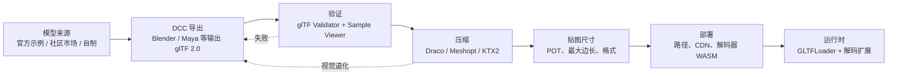

import { Meta } from '@storybook/addon-docs/blocks';

<Meta id="asset-pipeline-checklist" title="纹理与模型/资产" name="Docs" />

# 资产

把一份 3D 模型从来源运到 three.js 场景里，需要走完一条管线：**来源 → 导出 → 压缩 → 贴图 → 部署**。每一步都有可逆和不可逆的决策，可逆的部分留给运行时调整，不可逆的部分必须在交付前一次做对——Blender 没有应用修改器、贴图尺寸过大、Draco 解码器路径错位，都是事后难以从运行时排查或修复的问题。本课是一份从 0 到上线的检查清单，把 [模型加载](?path=/docs/gltf-and-gltfloader--docs)、[纹理](?path=/docs/textures-and-maps--docs) 和 [性能](?path=/docs/performance-and-disposal--docs) 课程里散落的资产侧决策串成一条工作流。



每一步的可逆性不同：路径错了可以改 URL，压缩选错可以重新导出，但贴图导出错了或修改器没应用，就只能回到 DCC 重做。所以本课把"在源头做对"放在前面，把"运行时怎么配"放在后面。

## 快速上手

下面这份最小检查清单覆盖从拿到一份模型到能让它在浏览器里正常显示的全部必要步骤。把它当作着陆点：每一项后面的主题小节解释为什么和怎么做。

**交付前（在 DCC / 处理工具中）**

- 确认模型来源许可允许目标用途；社区市场下载的模型先记录许可证。
- 在 Blender 中导出 glTF 2.0，启用 `Apply Modifiers`、`+Y Up`、`UVs`、`Normals`、`Tangents`，材质选择 `Export`。
- 单位与世界尺度合理：导出后用 `Box3.setFromObject` 检查模型尺寸，必要时在 DCC 中缩放，而不是在运行时强制 `scale.setScalar(0.01)`。
- 贴图尺寸为 2 的幂（1024、2048），最大边长按设备目标选择；法线、粗糙度等数据贴图允许比颜色贴图小一档。
- 把 `.gltf + .bin + textures` 这类多文件资产整组保持原相对路径，或导出成 `.glb` 单文件。

**运行时（在 three.js 项目中）**

- 用 `GLTFLoader.loadAsync` 加载，包一层 `try/catch` 至少覆盖 404、解析失败和扩展缺失三类错误。
- 按模型使用的扩展提前挂上解码器：DRACO / KTX2 / Meshopt 缺一会让 `loadAsync` 直接抛错。
- 用 `Box3` 检查模型大小与位置，必要时整体缩放、平移到可观察范围。
- 加上基础光照或环境贴图——glTF 使用 PBR，缺少环境会偏暗或发灰。
- 卸载时按 geometry / material / texture 三类 `dispose`，并用 `Set` 去重共享资源。

| 输入或决策 | 默认值 / 常用起点 | 改变后要注意什么 |
| --- | --- | --- |
| 资产打包形态 | `.glb` 单文件 | `.gltf + .bin + 贴图` 调试方便但移动时整组一起搬，部署易断链 |
| Blender 导出格式 | `glTF 2.0 (.glb)` | 选 `.gltf`（Separate）会拆出 `.bin` 和贴图；选 Embedded 会增大 JSON |
| `Apply Modifiers` | 启用 | 关闭后导出的是修改前几何，细分、布尔等效果丢失 |
| `+Y Up` | 启用 | glTF 约定 Y 朝上；关闭后模型可能在 three.js 里倒立或躺倒 |
| 几何压缩 | 不压缩 | 启用 Draco 体积最小但运行时必须配 `DRACOLoader`；Meshopt 解码更快、压缩比略低 |
| 纹理压缩 | 不压缩（PNG / JPEG / WebP） | 启用 KTX2 必须配 `KTX2Loader` 并 `detectSupport(renderer)` |
| 贴图最大边长 | 1024 或 2048 | 移动端建议 `<=` 2048；超过 4096 多数 Web 项目无收益 |
| 部署位置 | 与页面同源的静态目录 | 跨域时服务端必须返回 CORS 头，否则纹理会触发污染或 404 |
| 解码器 WASM | `node_modules/three/examples/jsm/libs/` | 复制到静态目录后用 `setDecoderPath` 指向，路径末尾保留 `/` |

## 模型来源

不同来源的模型决定了你需要做多少整理工作。

| 来源 | 适用场景 | 整理工作量 | 注意事项 |
| --- | --- | --- | --- |
| three.js 官方示例模型（`examples/models/`） | 学习范例、Loader 单元测试 | 几乎为零 | 已经过官方测试，但通常很小、没有完整 PBR 材质 |
| Khronos glTF Sample Models | 验证 Loader 行为、对比 PBR、动画与扩展 | 几乎为零 | 用于校准；生产一般不直接发布 |
| Sketchfab 等社区市场 | 快速拿到现成资产、原型验证 | 中等到高 | 检查许可证、单位、贴图完整性；许多模型需要重新导出 |
| Blender / Maya / 3ds Max 自制 | 项目专属资产、可控质量 | 由你掌控 | 必须按 glTF 导出规范处理修改器、单位、命名 |
| 扫描或摄影测量（RealityCapture、Meshroom） | 高度写实的静态对象 | 高 | 拓扑密集、贴图巨大，几乎一定要重建拓扑并压缩 |

社区市场下载的模型常见三类问题：使用了 `.fbx` 或 `.obj` 等非 glTF 格式（需要在 Blender 中转成 glTF）；材质命名混乱、贴图路径松散；单位随意，导入 three.js 后 `Box3` 大小远超预期。这三类问题都建议在 Blender 中统一处理后再导出，而不是把"修补"留给运行时代码。

## Blender 导出 glTF

Blender 自带的 glTF 2.0 I/O 插件是 three.js 资产管线中最常用的导出器。导出路径：`File → Export → glTF 2.0 (.glb/.gltf)`，右侧面板里的设置决定了输出结果能否在浏览器里正确显示。

下表列出对 three.js 影响最大的选项。其他 DCC（Maya、3ds Max）的导出器选项命名可能不同，但概念一致。

| 选项 | 推荐值 | 不这样做的后果 |
| --- | --- | --- |
| Format | `glTF 2.0 (.glb)` | 选 Separate 会拆出 `.bin` 和贴图；选 Embedded 会把贴图嵌入 JSON，体积膨胀且无法被浏览器并行下载 |
| Limit to | `Selected Objects` | 默认导出整场景，会把灯光、相机、辅助物体一起写入 glTF |
| Apply Modifiers | 勾选 | 关闭后导出修改前的几何；细分、布尔、镜像等效果丢失 |
| Y Up | 勾选 | glTF 约定 Y 朝上，Blender 也是 Y 朝上；关闭后模型可能在 three.js 中躺倒或倒立 |
| UVs / Normals / Tangents | 全部勾选 | 缺少切线时法线贴图方向会错；缺少 UV 时贴图无法采样 |
| Vertex Colors / Attributes | 按需勾选 | 不需要顶点色时关闭，减小文件 |
| Materials | `Export` | 选 `Placeholder` 会丢失 PBR 数据；选 `None` 会得到无材质模型 |
| Compression (Draco) | 仅在几何大时启用 | 启用后运行时必须配 `DRACOLoader`，否则 `loadAsync` 抛 `No DRACOLoader instance provided` |
| Animation | 按需 | 静态模型关闭；启用时确认只导出需要的动作 |

最常被忽略的是 `Apply Modifiers` 和 `Tangents`——前者让导出的是最终几何（细分曲面、布尔并集），后者让法线贴图能正确采样。Blender 命令行导出可以写成脚本，便于复现：

```python
# 在 Blender 文本编辑器或命令行中执行
import bpy

# 只导出选中对象为 GLB，应用修改器，生成切线。
bpy.ops.export_scene.gltf(
    filepath='/output/sample.glb',
    export_format='GLB',
    use_selection=True,
    export_apply=True,           # Apply Modifiers
    export_yup=True,             # +Y Up
    export_tangents=True,        # 为法线贴图生成切线
    export_materials='EXPORT',
    export_uv=True,
    export_normals=True,
    export_animations=False,
)
```

导出后立即用 [glTF Validator](https://github.com/KhronosGroup/glTF-Validator) 检查规范错误，再用 [Khronos glTF Sample Viewer](https://github.com/KhronosGroup/glTF-Sample-Viewer) 在标准 PBR 查看器里预览——这一步能排除"是资产的问题还是项目查看器的问题"。导出设置错或修改器没应用，Validator 不一定会报错，但 Sample Viewer 里会看到几何缺失或材质异常。

## 几何压缩

几何数据通常是模型体积的大头。three.js 支持三种几何压缩方式，体积、质量、解码成本各不相同。

| 压缩方式 | 压缩对象 | 体积收益 | 解码成本 | 运行时依赖 | 主要风险 |
| --- | --- | --- | --- | --- | --- |
| Quantization（顶点量化） | 顶点位置 / 法线 / UV 的精度 | 中等（16-bit → 更低位深） | 几乎为零 | 无（导出器内置） | 顶点精度损失导致远处闪烁或接缝 |
| `KHR_draco_mesh_compression` | 几何顶点数据 | 高（常压缩到原大小的 1/5 ~ 1/10） | 高（WASM 解码，启动慢） | `DRACOLoader` + `setDecoderPath` | 移动端首帧明显延迟；解码器路径错位 |
| `EXT_meshopt_compression` | 几何与动画 | 中高（压缩比不如 Draco，但解码快） | 低（专为快速解码设计） | `MeshoptDecoder` | 视觉退化通常少于 Draco，但社区示例更少 |

选型判断：

- 几何是主要体积来源，且能接受首帧延迟 → **Draco**。
- 模型不大，但想进一步压缩或同时压缩动画 → **Meshopt**。
- 只需要做精度优化、不想加解码器 → 在导出器中开启 **Quantization**。
- 几何不是瓶颈（贴图才是）→ 跳过几何压缩，先处理贴图。

Draco 和 Meshopt 可以在 [gltfpack](https://github.com/zeux/meshoptimizer#gltfpack) 或 [glTF Transform](https://gltf-transform.dev/) 中按命令行复现地启用，避免在 Blender 中每次手工切换。压缩后必须重新走一次视觉验证——Draco 的默认参数对法线精度有损，会让光滑曲面出现色带或接缝。

```js
// 运行时挂解码器——三种扩展彼此独立，按需挂即可。
import { GLTFLoader } from 'three/addons/loaders/GLTFLoader.js';
import { DRACOLoader } from 'three/addons/loaders/DRACOLoader.js';
import { MeshoptDecoder } from 'three/addons/libs/meshopt_decoder.module.js';

const draco = new DRACOLoader().setDecoderPath('/decoders/draco/');
const loader = new GLTFLoader();
loader.setDRACOLoader(draco);
loader.setMeshoptDecoder(MeshoptDecoder);
```

解码器 WASM 文件位于 `node_modules/three/examples/jsm/libs/draco/` 与 `libs/meshopt_decoder.module.js`，部署时复制到静态目录并按上面路径配置即可，详见 [模型加载](?path=/docs/gltf-and-gltfloader--docs)。

## 纹理压缩

贴图常常占模型体积的 60% 以上，而且是显存的主要占用源。把 PNG / JPEG / WebP 换成 KTX2 / Basis Universal，可以让纹理以 GPU 原生压缩格式分发，浏览器不再需要解码整张图片到显存。

| 方案 | 适用阶段 | 体积收益 | 解码成本 | 运行时依赖 |
| --- | --- | --- | --- | --- |
| PNG / JPEG | 调试期、小体积贴图 | 无 | 浏览器原生解码（CPU） | 无 |
| WebP / AVIF | 想要更小下载体积，但仍是普通纹理 | 中等 | 浏览器原生解码（CPU） | 确认目标浏览器支持 |
| KTX2 / Basis Universal | 生产、移动端、贴图大 | 高（GPU 压缩格式） | GPU 端转码 | `KTX2Loader` + `detectSupport(renderer)` |

KTX2 的关键是 `KTX2Loader.detectSupport(renderer)`——它会按当前 renderer 的能力选择最合适的 GPU 转码格式（ETC1S、UASTC 等）。调用必须在加载模型之前；漏掉会让纹理加载失败或在移动端崩。

```js
import { KTX2Loader } from 'three/addons/loaders/KTX2Loader.js';

const ktx2 = new KTX2Loader().setDecoderPath('/decoders/basis/');
ktx2.detectSupport(renderer); // 必须在加载模型之前
loader.setKTX2Loader(ktx2);
```

把普通贴图转换为 KTX2 的常用工具有 [KTX-Software](https://github.com/KhronosGroup/KTX-Software)（命令行）、[glTF Transform](https://gltf-transform.dev/) 的 `ktxfix` 与 `etc1s` / `uastc` 任务，以及[gltfpack](https://github.com/zeux/meshoptimizer#gltfpack)。ETC1S 适合颜色贴图，体积小但有损；UASTC 适合法线等数据贴图，质量高但体积大。完整颜色空间和数据语义留给 [纹理](?path=/docs/textures-and-maps--docs)。

## 贴图尺寸

贴图尺寸决定了下载体积、显存占用和 mipmap 层级数。Web 上的取值范围比 DCC 中保守得多。

**2 的幂（Power of Two, POT）**：1、2、4、…、1024、2048、4096。WebGL 1 对非 2 的幂（NPOT）纹理有严格限制——不能生成 mipmap、不能 `RepeatWrapping`。WebGL 2 解除了这个限制，但 POT 仍是兼容性最好、mipmap 最齐的选择。

**最大边长**：按目标设备决定上限。

| 目标设备 | 颜色贴图建议最大边长 | 数据贴图（法线、粗糙度等）建议最大边长 |
| --- | --- | --- |
| 桌面 / 高端独显 | 2048 或 4096 | 1024 或 2048 |
| 移动端 / 集成显卡 | 1024 或 2048 | 512 或 1024 |
| UI 元素 / 远景小对象 | 512 或更小 | 256 或更小 |

颜色贴图（`map`、`emissiveMap`）对人眼最敏感，可以稍大；法线、粗糙度、金属度、AO 等数据贴图通常可以减半，因为它们影响的是细节而非整体识别。绝对值没有硬规则，按"屏幕上这张贴图实际占多少像素"反推；一个永远只占屏幕 200 像素的远景小对象配 4096 贴图纯属浪费。

`renderer.capabilities.getMaxTextureSize()` 给出 GPU 的硬上限（桌面通常 8192 或 16384，移动端常为 4096），但**不要把这个上限当成推荐尺寸**——它只告诉你"再多就直接不能渲染"。Web 项目实际上很少需要超过 2048 的贴图。

## 部署路径

部署决定了模型、依赖文件和解码器 WASM 在静态服务器上的位置，以及运行时如何把它们拼成 URL。

**`.glb` 与 `.gltf` 的部署差异**

| 形态 | 文件组成 | 部署策略 |
| --- | --- | --- |
| `.glb` | 单文件 | 任意静态目录，一个 URL 即可；移动和缓存最简单 |
| `.gltf`（Separate） | JSON + `.bin` + 贴图 | 整组保持原相对路径；不要拆开移动单个文件 |
| `.gltf`（Embedded） | JSON 中嵌入 base64 贴图 | 一个文件但体积大，浏览器无法并行下载贴图 |

`.gltf` 模型换了位置但内部相对路径没改时，用 `GLTFLoader.setPath` 或 `resourcePath` 显式指定依赖目录：

```js
// 方法一：setPath 设置主 URL 的目录前缀
loader.setPath('/assets/models/sample/');
const gltf = await loader.loadAsync('sample.gltf');

// 方法二：resourcePath 单独覆盖依赖文件所在目录
loader.resourcePath = '/assets/models/sample/textures/';
```

**解码器 WASM**

Draco 与 KTX2 的解码器是 WASM 文件，必须随静态服务一起部署：

```text
node_modules/three/examples/jsm/libs/draco/      → /decoders/draco/
node_modules/three/examples/jsm/libs/basis/      → /decoders/basis/
node_modules/three/examples/jsm/libs/meshopt_decoder.module.js → /decoders/
```

`setDecoderPath` 指向解压后的目录，路径末尾保留 `/`；漏掉斜杠会让 loader 拼出错误的 URL。

**CDN 与同源**

把模型或解码器放在 CDN 上时要同时处理两件事：

- **版本一致**：CDN 上的 three.js 版本必须与本地一致；不同版本之间 Loader 与解码器 WASM 不保证兼容。
- **CORS**：跨域加载纹理时，服务器必须返回 `Access-Control-Allow-Origin` 响应头，否则浏览器会因为 WebGL 纹理污染而拒绝使用这张纹理。同一个域名下的资产没有这个问题。

生产部署的常见组合：HTML 与 JS 与项目同源；模型与贴图放在同源静态目录或 CDN（开 CORS）；解码器 WASM 与 three.js 版本严格对应，可以从本地 `node_modules` 复制或从带版本的 CDN 加载。

## 命名与资产清单

资产一多就需要约定。下面是适合 three.js 项目的最小约定：

- **节点命名**：在 Blender 中给 Mesh、骨架骨骼、动画剪辑起有语义的名字（`wheel_front_left`、`arm_lower_R`、`idle`），不要保留默认的 `Cube.001`、`Bone.012`。导出后这些名字会变成 `Object3D.name`、`AnimationClip.name`，是后续拾取、动画切换、调试的基础。
- **文件命名**：用语义命名（`character.glb`、`scene_lobby.glb`），不要用 `model_final_v2.glb` 这类版本号堆叠；版本交给 git。
- **资产清单**：每份可交付模型写一份 `manifest`，至少包含：

  | 字段 | 示例 |
  | --- | --- |
  | 文件名 | `character.glb` |
  | 来源 / 许可证 | `Sketchfab CC-BY-4.0 / author` |
  | 单位 / 大小 | `1 unit = 1 m，包围盒 1.8 × 0.6 × 0.6` |
  | 使用的扩展 | `KHR_draco_mesh_compression`、`KHR_texture_basisu` |
  | 贴图最大边长 | `2048` |
  | 运行时依赖 | `DRACOLoader + KTX2Loader（detectSupport）` |
  | 已知问题 | `左手指尖法线在极端角度有接缝` |

清单不一定要单独成文，但要在团队里能找到——线上排查时，"这份模型用了什么压缩"是高频问题。

## 最佳实践

- 部署优先用 `.glb` 单文件；只有调试或需要 CDN 独立缓存大贴图时才用 `.gltf` Separate。
- 在 Blender 里把单位、原点、命名一次做对，不要把修补留给运行时 `scale.setScalar(0.01)`。
- 每次导出后跑一遍 glTF Validator 和 Sample Viewer，把问题挡在进入项目之前。
- 压缩按瓶颈选：几何大用 Draco / Meshopt，贴图大用 KTX2；不要无脑全开。
- 贴图尺寸按"屏幕上实际占多少像素"反推，颜色贴图允许比数据贴图大一档。
- 解码器 WASM 与 three.js 版本严格对应；从 `node_modules` 复制或锁定 CDN 版本。
- 跨域资产必须开 CORS，否则 WebGL 纹理污染会让贴图变黑或被拒绝使用。
- 维护资产清单，记录每份模型的来源、压缩、贴图尺寸和运行时依赖。

## 常见问题

- 为什么 Blender 导出的模型在 three.js 里躺倒或倒立？
  在 glTF 导出设置中勾选 `+Y Up`；glTF 约定 Y 朝上，关闭后模型的轴方向会与 three.js 不一致。
- 为什么模型体积突然变大但视觉效果没改善？
  检查是否选了 `glTF Embedded`（贴图以 base64 嵌入 JSON）；改回 `.glb` 或 `.gltf Separate`，让贴图以独立二进制文件分发。
- 为什么 `loadAsync` 报 `No DRACOLoader instance provided`？
  模型在 Blender 中启用了 Draco 压缩。在运行时创建 `DRACOLoader`、`setDecoderPath` 指向 WASM 目录，再 `loader.setDRACOLoader(dracoLoader)`。
- 为什么 KTX2 纹理在桌面正常，在移动端崩？
  漏掉了 `KTX2Loader.detectSupport(renderer)`，或调用时机晚于模型加载；必须在加载模型前调用，让 loader 按 renderer 能力选转码格式。
- 为什么贴图尺寸是 4096 的模型在移动端不显示？
  移动端 GPU 的纹理尺寸上限常为 4096，部分设备更低；用 `renderer.capabilities.getMaxTextureSize()` 检查，并把贴图降到 2048 或更小。
- 为什么从 Sketchfab 下载的模型单位特别大？
  社区市场模型单位常常不规范；导入 Blender 后先在属性面板设置场景单位为米，整体缩放到合理大小，再导出 glTF。
- 为什么部署后 `loadAsync` 抛 404，但本地开发正常？
  检查静态服务是否把 `.glb`、`.bin` 和贴图整组都复制过去；`.gltf` 内部以相对路径引用依赖文件，缺一个就 404。必要时用 `setPath` 显式指定目录。
- 为什么跨域加载的贴图变黑或被拒绝使用？
  跨域服务器没有返回 `Access-Control-Allow-Origin` 响应头；WebGL 出于安全考虑会拒绝使用未授权的跨域纹理。让 CDN 开 CORS，或把资产放回同源。
- 为什么同一份模型在某些设备上几何出现接缝或闪烁？
  Draco 默认参数对法线精度有损；改用更高量子量化，或换成 Meshopt；压缩后必须重新走视觉验证。

## 总结回顾

摘要：

资产管线是一条"来源 → 导出 → 压缩 → 贴图 → 部署"的工作流，每一步都有可逆和不可逆的决策。Blender 的 `Apply Modifiers`、`+Y Up`、`Tangents` 一旦遗漏就要回到 DCC 重做；Draco、Meshopt、KTX2 各自压缩几何或纹理，必须配套运行时解码器；贴图尺寸按目标设备和屏幕占比选择，POT 兼容性最好；部署时优先 `.glb` 单文件，跨域要开 CORS，解码器 WASM 与 three.js 版本严格对应。把这些步骤串成检查清单，配合 glTF Validator 与 Sample Viewer 的双重验证，能让模型从来源稳定地运到 three.js 场景里。

一句话：

> 不可逆的决策在交付前一次做对，可逆的调整留给运行时；检查清单比修补代码更可靠。

知识要点：

- 资产管线的五个步骤分别是什么？哪些决策可逆，哪些不可逆？
- `.glb` 与 `.gltf` Separate / Embedded 在部署上有什么差别？
- Blender 导出 glTF 时哪些设置一旦遗漏会破坏运行时？
- Draco、Meshopt、KTX2 各自压缩什么？体积、质量、解码成本如何权衡？
- 贴图尺寸为什么优先取 2 的幂？颜色贴图与数据贴图的最大边长怎么选？
- 解码器 WASM 应该部署在哪里？`setDecoderPath` 末尾为什么要有 `/`？
- 跨域加载模型和贴图时需要注意什么？为什么 WebGL 会拒绝某些跨域纹理？
- 怎样判断一份模型已经达到可交付状态？

## 参考资料

- [Three.js Manual：Loading a 3D model](https://threejs.org/manual/en/load-gltf.html)
- [Three.js Manual：Textures](https://threejs.org/manual/en/textures.html)
- [Three.js Manual：Texture types](https://threejs.org/manual/en/texture-types.html)
- [Blender Manual：glTF 2.0 Importer & Exporter](https://docs.blender.org/manual/en/latest/addons/import_export/scene_gltf2.html)
- [glTF 2.0 Specification](https://registry.khronos.org/glTF/specs/2.0/glTF-2.0.html)
- [glTF Extensions Registry](https://github.com/KhronosGroup/glTF/tree/main/extensions)
- [Khronos glTF Validator](https://github.com/KhronosGroup/glTF-Validator)
- [Khronos glTF Sample Viewer](https://github.com/KhronosGroup/glTF-Sample-Viewer)
- [Khronos glTF Sample Models](https://github.com/KhronosGroup/glTF-Sample-Models)
- [glTF Transform](https://gltf-transform.dev/)
- [gltfpack (meshoptimizer)](https://github.com/zeux/meshoptimizer#gltfpack)
- [KTX-Software](https://github.com/KhronosGroup/KTX-Software)
