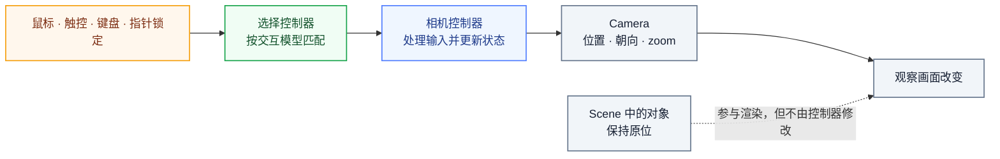

import { Canvas, Controls, Meta } from '@storybook/addon-docs/blocks';

import * as CameraControls from './camera-controls.stories.js';

<Meta of={CameraControls} name="Docs" />

# 相机控制器

相机控制器把用户输入翻译成相机的移动、旋转、缩放或平移。它们不负责创建场景对象，也不替代相机的投影设置；控制器只管理“用户怎样观察场景”这一条链路。

不同控制器的共同接口是“传入相机和事件元素，监听输入，在需要时推进更新，离开页面时销毁”。差异集中在交互模型：`OrbitControls` 围绕 `target` 观察，`MapControls` 面向地图平移，`TrackballControls` 允许相机翻滚，`FlyControls` 和 `FirstPersonControls` 用于漫游，`PointerLockControls` 用于锁定指针后的第一人称观察。



运行前提：沿用 [安装](../vite-threejs-setup/README.mdx) 的项目与启动方式。

本课同时展示多个控制器实例。它们共用按视口状态启停的渲染循环：首次先渲染一帧，画布进入视口前约 `200px` 时开始动画，离开这个范围后暂停并保留最后一帧；因此滚动到对应小节时会继续更新，未看到的实例不会持续占用动画帧。

## 快速上手

下面的完整片段创建一个立方体、相机、渲染器和 `OrbitControls`。重点是：控制器只创建一次，`update(delta)` 位于渲染循环中，页面离开时调用 `dispose()`。

```js
import * as THREE from 'three';
import { OrbitControls } from 'three/addons/controls/OrbitControls.js';

const scene = new THREE.Scene();
scene.background = new THREE.Color(0xf1f5f9);

const camera = new THREE.PerspectiveCamera(45, innerWidth / innerHeight, 0.1, 100);
camera.position.set(3, 2.5, 5);

const renderer = new THREE.WebGLRenderer({ antialias: true });
renderer.setSize(innerWidth, innerHeight);
document.body.append(renderer.domElement);

const cube = new THREE.Mesh(
  new THREE.BoxGeometry(),
  new THREE.MeshNormalMaterial()
);
scene.add(cube);

const controls = new OrbitControls(camera, renderer.domElement);
controls.target.set(0, 0.3, 0);
controls.enableDamping = true;

const clock = new THREE.Clock();
let frameId;

function render() {
  frameId = requestAnimationFrame(render);
  controls.update(clock.getDelta());
  renderer.render(scene, camera);
}

function resize() {
  camera.aspect = innerWidth / innerHeight;
  camera.updateProjectionMatrix();
  renderer.setSize(innerWidth, innerHeight);
}

function dispose() {
  cancelAnimationFrame(frameId);
  removeEventListener('resize', resize);
  controls.dispose();
  renderer.dispose();
  renderer.domElement.remove();
}

addEventListener('resize', resize);
addEventListener('pagehide', dispose, { once: true });

render();
```

| 属性 / 方法 | 默认值或形式 | 改完要注意什么 |
| --- | --- | --- |
| `target` | `(0, 0, 0)` | 环绕、缩放和平移的观察中心；手动修改后调用 `update()`。 |
| `enableDamping` | `false` | 开启后必须持续调用 `update()`，`dampingFactor` 默认是 `0.05`。 |
| `autoRotate` | `false` | 开启后必须持续调用 `update(delta)`；传入秒数可避免帧率影响。 |
| `enablePan` / `enableZoom` / `enableRotate` | `true` / `true` / `true` | 分别控制平移、缩放和环绕输入。 |
| `minDistance` / `maxDistance` | `0` / `Infinity` | 只对透视相机的相机到 `target` 距离生效。 |
| `minZoom` / `maxZoom` | `0` / `Infinity` | 只对正交相机的 `camera.zoom` 生效。 |
| `minPolarAngle` / `maxPolarAngle` | `0` / `π` | 上下环绕范围；默认不是“禁止低头”，要限制视角需自行收窄范围。 |
| `dispose()` | 无返回值 | 移除事件监听；控制器和渲染器应一起进入卸载路径。 |

## 如何选择控制器

先问“相机应该怎样移动”，再选择控制器。不要为了得到地图或第一人称交互，把 `OrbitControls` 的参数强行改成另一种模型。

| 控制器 | 主要交互 | 适合场景 | 关键区别 |
| --- | --- | --- | --- |
| `OrbitControls` | 绕 `target` 环绕、缩放、平移 | 模型查看器、3D 预览 | 保持相机的上方向，不允许任意滚转 |
| `MapControls` | 平移为主，也可旋转和缩放 | 地图、俯视场景 | 预设为地图式鼠标 / 触控操作，世界平面平移 |
| `TrackballControls` | 环绕、缩放、平移、滚转 | 任意角度模型查看 | 不保持固定的相机 `up` 方向 |
| `FlyControls` | 自由飞行、滚转、前进 | DCC 式漫游、空间浏览 | 不围绕固定 `target`，按时间推进位置和姿态 |
| `FirstPersonControls` | 第一人称移动和环顾 | 漫游、场景探索 | 以移动速度和视线速度驱动相机 |
| `PointerLockControls` | 锁定指针后环顾、前后左右移动 | FPS、沉浸式第一人称 | 需要用户手势触发 `lock()`，没有 `OrbitControls` 的 `target` |

## OrbitControls

`OrbitControls` 是最适合模型查看器的默认选择：左键拖拽环绕，滚轮缩放，右键或组合键平移；相机始终围绕 `target`，并保持 `camera.up` 指定的“上方”。

在画布上拖拽、滚轮缩放、右键平移，读数里的 `target` 和距离会跟着变。调低 `maxDistance` 或调高 `minDistance` 后，滚轮缩放会被夹在新的区间内。关闭 `enablePan` 后，平移输入不再改变 `target`。

<Canvas of={CameraControls.Orbit} />

<Controls of={CameraControls.Orbit} />

- `controls.target`：观察中心；改完后调用 `controls.update()`，让相机立即对准新中心。
- `enableDamping` / `autoRotate`：随时间推进的效果，每次 `update(delta)` 只推进一步，所以必须放进渲染循环。
- `minDistance` / `maxDistance`：夹住的是相机到 `target` 的距离，不是相机某个坐标分量。
- `minPolarAngle` / `maxPolarAngle`：限制上下环绕角度；若要保持相机在地平线上方，应设置小于 `Math.PI / 2` 的上限或按场景需求设置范围。
- `minAzimuthAngle` / `maxAzimuthAngle`：限制水平环绕角度，适合只允许观察某个扇区的场景。
- `zoomToCursor`：开启后缩放焦点可以跟随指针位置，而不是始终以 `target` 为焦点。
- `controls.dispose()`：移除事件监听；它不会替你释放 renderer、geometry 或 material。

当阻尼和自动旋转都关闭时，交互事件本身会完成相机更新，但统一在渲染循环里调用 `update(delta)` 可以避免维护分支。

## MapControls

`MapControls` 复用 `OrbitControls` 的相机控制模型，但把鼠标和触控预设为地图交互：左键或单指平移，右键或双指旋转，滚轮或双指缩放。它默认关闭屏幕空间平移，使平移更贴近地图的世界方向。

```js
import { MapControls } from 'three/addons/controls/MapControls.js';

const controls = new MapControls(camera, renderer.domElement);
controls.enableDamping = true;
controls.maxPolarAngle = Math.PI / 2.2;

function render() {
  requestAnimationFrame(render);
  controls.update();
  renderer.render(scene, camera);
}

render();
```

在画布上用左键或单指平移，用右键或双指旋转，再用滚轮或双指缩放；调节右侧的 `maxPolarAngle`，观察俯视范围变化。

<Canvas of={CameraControls.Map} />

<Controls of={CameraControls.Map} />

需要俯视地图但仍允许少量倾斜时，调 `maxPolarAngle`；不要用一组复杂的 `OrbitControls` 鼠标映射去复刻 `MapControls` 的交互预设。用完同样调用 `controls.dispose()`。

## TrackballControls

`TrackballControls` 适合需要任意角度查看的场景。它不像 `OrbitControls` 那样保持固定的 `camera.up`，相机越过“南北极”时不会自动翻回正面，因此可以自由滚转。

```js
import { TrackballControls } from 'three/addons/controls/TrackballControls.js';

const controls = new TrackballControls(camera, renderer.domElement);
controls.rotateSpeed = 1;
controls.zoomSpeed = 1.2;
controls.panSpeed = 0.3;
controls.staticMoving = false;
controls.dynamicDampingFactor = 0.2;

function render() {
  requestAnimationFrame(render);
  controls.update();
  renderer.render(scene, camera);
}

render();
```

在画布上连续拖拽并越过模型的上方或下方，观察相机如何保留滚转姿态；切换 `staticMoving`，对比松手后的惯性。

<Canvas of={CameraControls.Trackball} />

<Controls of={CameraControls.Trackball} />

`staticMoving = false` 时，`dynamicDampingFactor` 控制松手后的惯性；如果产品要求相机始终保持“上方”，应回到 `OrbitControls`。

## FlyControls

`FlyControls` 不围绕 `target` 工作，而是让相机在三维空间自由移动和滚转。它的 `update(delta)` 需要秒数，因此速度参数不应直接当作每帧位移。

```js
import { FlyControls } from 'three/addons/controls/FlyControls.js';

const controls = new FlyControls(camera, renderer.domElement);
controls.movementSpeed = 5;
controls.rollSpeed = Math.PI / 12;
controls.dragToLook = true;

const clock = new THREE.Clock();

function render() {
  requestAnimationFrame(render);
  controls.update(clock.getDelta());
  renderer.render(scene, camera);
}

render();
```

在画布上拖拽观察视线，使用键盘在空间中飞行；调节 `movementSpeed` 和 `rollSpeed`，读数会显示当前位置的变化。

<Canvas of={CameraControls.Fly} />

<Controls of={CameraControls.Fly} />

适合空间漫游、编辑器式飞行和没有固定观察中心的场景；如果需求是“围绕一个模型观察”，不要选择它。

## FirstPersonControls

`FirstPersonControls` 是另一种第一人称实现，默认使用键盘移动和鼠标环顾，并通过 `movementSpeed`、`lookSpeed` 和阻尼参数控制手感。

```js
import { FirstPersonControls } from 'three/addons/controls/FirstPersonControls.js';

const controls = new FirstPersonControls(camera, renderer.domElement);
controls.movementSpeed = 3;
controls.lookSpeed = 0.05;
controls.lookVertical = true;

const clock = new THREE.Clock();

function render() {
  requestAnimationFrame(render);
  controls.update(clock.getDelta());
  renderer.render(scene, camera);
}

render();
```

在画布上拖拽环顾，使用方向键或 `WASD` 移动；调节 `lookSpeed` 或关闭 `lookVertical`，观察第一人称视线的变化。

<Canvas of={CameraControls.FirstPerson} />

<Controls of={CameraControls.FirstPerson} />

它适合需要“人在场景中走动”的交互；需要锁定系统指针、隐藏鼠标并监听锁定状态时，改用 `PointerLockControls`。

## PointerLockControls

`PointerLockControls` 把鼠标移动交给 Pointer Lock API，适合 FPS。锁定必须由用户手势触发，页面需要提供明确的进入和退出入口。

```js
import { PointerLockControls } from 'three/addons/controls/PointerLockControls.js';

const controls = new PointerLockControls(camera, renderer.domElement);

renderer.domElement.addEventListener('click', () => controls.lock());
controls.addEventListener('lock', () => console.log('指针已锁定'));
controls.addEventListener('unlock', () => console.log('指针已释放'));

function render() {
  requestAnimationFrame(render);
  renderer.render(scene, camera);
}

render();

addEventListener('keydown', (event) => {
  if (event.code === 'KeyW') controls.moveForward(0.1);
  if (event.code === 'KeyD') controls.moveRight(0.1);
});
```

点击画布进入指针锁定，移动鼠标环顾，按 `Esc` 释放锁定；读数中的指针状态会从“未锁定”变成“已锁定”。

<Canvas of={CameraControls.PointerLock} />

<Controls of={CameraControls.PointerLock} />

鼠标环顾由控制器的指针事件驱动，不需要像 `FlyControls` 那样调用 `controls.update(delta)`；但渲染循环仍然必须持续运行。页面离开时调用 `controls.dispose()`。

## 共同的更新与销毁

控制器虽然交互模型不同，但都属于页面资源的一部分：创建一次、接入渲染循环或事件链、在离开页面时销毁。

| 控制器 | 是否需要每帧更新 | 更新形式 | 需要特别留意 |
| --- | --- | --- | --- |
| `OrbitControls` | 阻尼或自动旋转时需要 | `update(delta)` | `target`、距离和角度限制 |
| `MapControls` | 阻尼时需要 | `update()` | 地图方向和俯视角限制 |
| `TrackballControls` | 交互有惯性时需要 | `update()` | 相机 `up` 方向会随滚转变化 |
| `FlyControls` | 需要 | `update(delta)` | 速度以秒为单位推进 |
| `FirstPersonControls` | 需要 | `update(delta)` | 移动、视线和阻尼共同影响手感 |
| `PointerLockControls` | 不需要控制器更新 | 渲染循环 + 指针事件 | `lock()` 必须由用户手势触发 |

销毁时至少调用对应控制器的 `dispose()`。如果控制器所在页面还拥有 renderer、geometry、material 或贴图，也要在同一条卸载路径中释放它们。

## 和相机及对象控制的边界

- 相机控制器改变相机的位置、朝向或 `zoom`，不改变场景对象的几何和材质。
- 相机的投影类型、视锥体和 `updateProjectionMatrix()` 属于“相机”课程。
- `TransformControls` 改的是场景对象的平移、旋转和缩放，不是相机观察方式。

## 最佳实践

- **先按交互模型选型。** 模型查看优先 `OrbitControls`，地图优先 `MapControls`，自由滚转优先 `TrackballControls`，漫游优先 `FlyControls` / `FirstPersonControls`，FPS 优先 `PointerLockControls`。
- **把控制器参数和场景尺度绑定。** `target`、距离、移动速度和角度限制都应根据实际模型或地图范围设置，不要照搬示例数字。
- **时间驱动的控制器使用 delta。** `FlyControls`、`FirstPersonControls` 必须使用秒级时间差；`OrbitControls` 的自动旋转也应传入 `delta` 以减少帧率差异。
- **控制器只创建一次。** 不要在渲染循环中 `new` 控制器，否则会叠加事件监听和状态。
- **把销毁放进同一条卸载路径。** 控制器、renderer、观察器和其他 GPU 资源应一起释放。
- **锁定指针前给用户明确入口。** `PointerLockControls.lock()` 需要用户手势，并应提供可见的退出方式。

## 常见问题

| 现象 | 先看哪里 | 判断 |
| --- | --- | --- |
| 阻尼或自动旋转不生效 | `controls.update()` | 是否每帧调用，`OrbitControls` 是否传入了 `delta` |
| 相机围绕奇怪的点转 | `controls.target` | 是否对准要观察的中心，改完是否调用 `update()` |
| 滚轮缩放到头了 | `minDistance` / `maxDistance` 或 `minZoom` / `maxZoom` | 透视相机夹距离，正交相机夹 `zoom` |
| 地图平移方向不对 | `MapControls.screenSpacePanning` | 是否需要世界方向平移；不要只改鼠标按钮映射 |
| 相机突然翻滚 | 控制器类型 | `TrackballControls` 允许滚转，`OrbitControls` 保持 `up` 方向 |
| Fly / FirstPerson 移动速度随帧率变化 | `update(delta)` | 是否传入秒级时间差，而不是按帧固定移动 |
| 点击后无法进入 FPS 模式 | `PointerLockControls.lock()` | 是否由用户手势触发，浏览器是否允许指针锁定 |
| 切换页面后卡顿 | `dispose()` 和渲染循环 | 旧控制器、事件监听或 RAF 是否仍在运行 |
| 画布拖拽没有反应 | 构造参数 | 是否把同一个 `renderer.domElement` 传给控制器 |

## 总结回顾

摘要：

相机控制器位于用户输入和相机之间，选择时先看交互模型，再把对应控制器接入渲染循环。`OrbitControls` 适合围绕目标查看，`MapControls` 适合地图，`TrackballControls` 允许滚转，`FlyControls` 和 `FirstPersonControls` 适合漫游，`PointerLockControls` 适合锁定指针后的第一人称交互。无论选择哪一种，都要明确更新时机和销毁路径。

一句话：

> 先按相机的移动模型选控制器，再把它的更新时间和销毁生命周期接好。

知识要点：

- **关键词：** `target`、OrbitControls、MapControls、TrackballControls、FlyControls、FirstPersonControls、PointerLockControls、`update(delta)`、`dispose()`。
- **关键问题：**
  - 什么时候应该用 `OrbitControls`，什么时候应该换成地图、滚转、漫游或指针锁定控制器？
  - 哪些控制器需要每帧更新，哪些参数需要传入秒级 `delta`？
  - 透视相机和正交相机分别由哪些属性限制缩放范围？
  - 为什么控制器销毁必须和渲染循环、事件监听及 GPU 资源放在同一条卸载路径？

## 参考资料

- [OrbitControls](https://threejs.org/docs/pages/OrbitControls.html)
- [MapControls](https://threejs.org/docs/pages/MapControls.html)
- [TrackballControls](https://threejs.org/docs/pages/TrackballControls.html)
- [FlyControls](https://threejs.org/docs/pages/FlyControls.html)
- [FirstPersonControls](https://threejs.org/docs/pages/FirstPersonControls.html)
- [PointerLockControls](https://threejs.org/docs/pages/PointerLockControls.html)
