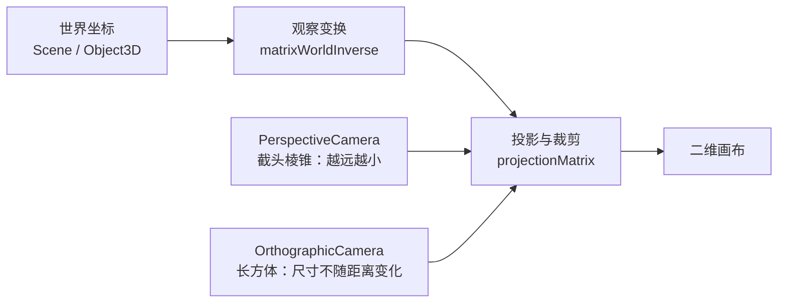

import { Canvas, Controls, Meta } from '@storybook/addon-docs/blocks';
import * as CameraStories from './camera.stories.js';

<Meta of={CameraStories} name="Docs" />

# 相机

`Scene` 决定场景里有哪些对象，`Camera` 决定从哪里看，以及场景的哪一部分能投到二维画布。相机有两套彼此独立的输入：

- `position`、`rotation`、父子层级和 `lookAt()` 决定观察位置与朝向，最终形成 `matrixWorldInverse`（view matrix）。
- `fov`、`aspect`、`left/right/top/bottom`、`near/far` 和 `zoom` 决定观察空间，最终形成 `projectionMatrix`。

渲染时，世界坐标先进入相机观察空间，再经过投影和裁剪。物体只有位于视锥体内，才可能出现在画面中。



## 快速上手

大多数三维场景从 `PerspectiveCamera` 开始。把相机移出原点、朝向目标，再用画布显示尺寸更新 `aspect`：

```js
const camera = new THREE.PerspectiveCamera(
  50,                  // 垂直视野角，单位是度
  canvas.clientWidth / canvas.clientHeight,
  0.1,                 // near 必须大于 0
  100                  // far 必须大于 near
);

camera.position.set(4, 3, 6);
camera.lookAt(0, 0, 0);
renderer.render(scene, camera);

function resizeCamera() {
  camera.aspect = canvas.clientWidth / canvas.clientHeight;
  camera.updateProjectionMatrix();
}
```

| 输入或状态 | 默认值 / 常用起点 | 改变后 |
| --- | --- | --- |
| 相机局部前方 | `-Z`；`up` 默认是 `+Y` | 改 `position` / `rotation` 或调用 `lookAt()`；无需更新投影矩阵 |
| `PerspectiveCamera.fov` | `50` 度，表示垂直视野角 | 越大看到越多，物体越小；调用 `updateProjectionMatrix()` |
| `PerspectiveCamera.aspect` | `1`；通常写成显示宽 / 显示高 | 尺寸变化后重算，否则画面会拉伸；调用 `updateProjectionMatrix()` |
| `PerspectiveCamera.near / far` | `0.1 / 2000` | 只保留两裁剪面之间的内容；透视相机要求 `0 < near < far` |
| `OrthographicCamera.left / right / top / bottom` | `-1 / 1 / 1 / -1` | 共同定义平行观察盒；调用 `updateProjectionMatrix()` |
| `OrthographicCamera.near / far` | `0.1 / 2000` | 正交相机允许 `near = 0`，仍要求 `far > near` |
| `zoom` | 两种相机都是 `1` | 大于 `1` 会放大画面；调用 `updateProjectionMatrix()` |

## 位置与朝向

`Camera` 是抽象基类，也是一个 `Object3D`。相机沿自身局部 `-Z` 轴观察；`position` 回答“从哪里看”，`lookAt(target)` 回答“看向哪里”。这两项改变 view matrix，不会改变 `fov`、裁剪面或投影类型。

```js
camera.position.set(6, 4, 8);
camera.lookAt(0, 0.7, 0);

const direction = camera.getWorldDirection(new THREE.Vector3());
// direction 是归一化的世界空间观察方向。
```

在下面的实例中移动相机或目标。核对“世界观察方向”读数与画面中心的变化；投影参数保持不变。

<Canvas of={CameraStories.CameraDirection} />

<Controls of={CameraStories.CameraDirection} />

相机位置与观察目标不能重合，否则不存在可归一化的观察方向；实例会显示输入错误并保留上一有效朝向。只把相机传给 `renderer.render(scene, camera)` 时，相机不必加入 `scene`。需要让相机继承父对象变换，或希望用 `CameraHelper` 在另一个视角观察它时，再把它挂入相应层级。`lookAt()` 不支持位于非均匀缩放父级之下的对象；这种层级先消除父级非均匀缩放，或改用明确的 quaternion。

## 透视相机

`PerspectiveCamera` 模拟常见三维视觉：同样大小的物体越远，投到画面上越小。它的视锥体是被 `near` 和 `far` 截断的棱锥：

- `fov` 是垂直方向视野角，单位是度；`aspect` 再决定水平方向范围。
- `near` 与 `far` 沿观察方向裁剪内容，不是到世界原点的距离。
- `zoom` 会收窄有效视野角；`getEffectiveFOV()` 能读出计入 `zoom` 后的垂直角度。
- 相机向目标靠近会让物体变大，因为距离参与透视除法。

```js
const camera = new THREE.PerspectiveCamera(50, aspect, 0.1, 100);
camera.zoom = 1.25;
camera.updateProjectionMatrix();

const size = camera.getViewSize(8, new THREE.Vector2());
// size 是沿观察方向 8 个单位处，可见矩形的宽和高。
```

调整 `fov`、`zoom`、相机距离和裁剪面，观察矩阵有效 FOV、目标处观察范围与可见物体。关闭“调用 `updateProjectionMatrix()`”后再改 `fov`：属性读数会先变化，矩阵读数和画面仍保留旧值。

<Canvas of={CameraStories.PerspectiveProjection} />

<Controls of={CameraStories.PerspectiveProjection} />

`near` 或 `far` 把物体裁掉时，物体不会被删除，只是处在当前视锥体之外。若输入形成 `near >= far`，实例会保留上一组有效投影并在“输入检查”中显示原因。

## 焦距与视图窗口

透视相机还提供面向摄影参数、测量和多屏拼接的成员。常规网页三维场景通常不必先用它们，但回查时要分清哪些会直接改变投影。

| 成员 | 用途 | 生效与边界 |
| --- | --- | --- |
| `setFocalLength(value)` / `getFocalLength()` | 在 `fov` 与焦距之间换算 | `setFocalLength()` 会更新投影矩阵；单位必须与 `filmGauge` 一致 |
| `filmGauge` | 胶片较长边尺寸 | 默认 `35`；单独修改通常不改变投影 |
| `filmOffset` | 水平偏轴投影 | 默认 `0`；非零时与 `filmGauge` 一起影响投影，修改后更新矩阵 |
| `getFilmWidth()` / `getFilmHeight()` | 结合 `aspect` 读取当前胶片尺寸 | 只返回计算结果，不修改相机 |
| `getViewBounds(distance, min, max)` | 读取指定观察距离处的二维边界 | 结果写入两个 `Vector2` |
| `getViewSize(distance, target)` | 读取指定观察距离处的宽高 | 结果写入 `target`，依赖当前投影矩阵 |
| `setViewOffset(...)` / `clearViewOffset()` | 从完整视锥体截取子窗口，用于多显示器或分块渲染 | 方法内部会更新投影；不要直接改 `view` |
| `focus` | 立体相机和景深效果使用的对象距离 | 默认 `10`；普通 `PerspectiveCamera` 渲染中不会单独改变投影 |

## 正交相机

`OrthographicCamera` 用平行的长方体观察空间代替透视棱锥。同样大小的物体只要没被裁剪，就不会因为离相机更远而缩小；常用于二维编辑器、轴测图、地图、UI 覆盖层和需要稳定比例的工程视图。

```js
const viewHeight = 6;
const aspect = canvas.clientWidth / canvas.clientHeight;
const halfHeight = viewHeight / 2;
const halfWidth = halfHeight * aspect;

const camera = new THREE.OrthographicCamera(
  -halfWidth, halfWidth,
  halfHeight, -halfHeight,
  0, 100
);
camera.position.set(6, 4, 8);
camera.lookAt(0, 0.7, 0);
```

| 成员 | 决定什么 | 注意 |
| --- | --- | --- |
| `left / right` | 未计 `zoom` 前的水平边界 | 为保持比例，常按 `viewHeight * aspect` 成对计算 |
| `top / bottom` | 未计 `zoom` 前的垂直边界 | `top - bottom` 是基础观察高度 |
| `zoom` | 实际观察范围的缩放 | 实际宽高分别是基础宽高除以 `zoom` |
| `near / far` | 沿观察方向的裁剪范围 | `near = 0` 有效；`far` 仍须大于 `near` |
| `setViewOffset(...)` / `clearViewOffset()` | 截取或恢复观察盒子窗口 | 方法内部会更新投影；不要直接改 `view` |

改变“相机到目标距离”可以看到物体大小基本不变；改变 `viewHeight` 或 `zoom` 才会改变取景范围。关闭投影矩阵更新后，比较“属性观察范围”和“矩阵观察范围”。

<Canvas of={CameraStories.OrthographicProjection} />

<Controls of={CameraStories.OrthographicProjection} />

距离仍会影响裁剪：把相机移到 `near / far` 覆盖不到的位置，物体会消失，只是不会产生透视缩放。

## 画布尺寸与投影更新

直接改投影属性只改变 JavaScript 对象上的值。`renderer` 真正使用的是 `projectionMatrix` 和 `projectionMatrixInverse`，因此修改 `fov`、`aspect`、`near/far`、`zoom` 或正交边界后，要调用一次 `updateProjectionMatrix()`。

透视相机在尺寸变化时更新宽高比：

```js
camera.aspect = canvas.clientWidth / canvas.clientHeight;
camera.updateProjectionMatrix();
```

正交相机没有 `aspect` 属性，需要重算水平或垂直边界。下面固定垂直观察高度，让宽度跟随画布：

```js
const aspect = canvas.clientWidth / canvas.clientHeight;
const halfHeight = viewHeight / 2;

camera.left = -halfHeight * aspect;
camera.right = halfHeight * aspect;
camera.top = halfHeight;
camera.bottom = -halfHeight;
camera.updateProjectionMatrix();
```

构造相机、`setFocalLength()`、`setViewOffset()` 和 `clearViewOffset()` 会在内部生成投影矩阵；批量直接赋值时，最后统一更新一次即可。`position`、`quaternion`、`rotation` 与 `lookAt()` 属于观察变换，不需要调用这个方法。

## 裁剪与深度精度

`near` 与 `far` 的首要作用是限定可见深度，同时也影响深度缓冲区的可用精度。尤其在透视投影中，把 `near` 设得极小、`far` 设得极大，会把有限精度铺到过宽范围，容易出现两个表面闪烁或交错的 z-fighting。

推荐从实际内容范围反推：

1. `near` 在不切掉近处内容的前提下尽量远。
2. `far` 在覆盖最远内容的前提下尽量近。
3. 用 `CameraHelper` 从第二个相机观察视锥体；相机变换或投影改变后同时调用 `helper.update()`。

`Frustum` 主要供渲染器做视锥体剔除。本课实例用它把“当前可见物体”显示为读数；日常渲染无需手工逐个调用。

## 公共成员

两种具体相机都继承 `Camera`。下面这些成员用于调试、投影/反投影和渲染器集成，不替代具体相机的构造参数。

| 成员 | 含义 | 使用判断 |
| --- | --- | --- |
| `isCamera`、`isPerspectiveCamera`、`isOrthographicCamera` | 运行时类型标记 | 只读；处理混合相机集合时判断类型 |
| `matrixWorldInverse` | 世界矩阵的逆，即 view matrix | 由世界变换更新；一般不手写 |
| `projectionMatrix` | 当前投影矩阵 | 投影属性改变后由 `updateProjectionMatrix()` 重建 |
| `projectionMatrixInverse` | 投影矩阵的逆 | 与投影矩阵一起更新，常用于反投影和射线计算 |
| `coordinateSystem` | WebGL 或 WebGPU 的裁剪坐标约定 | 通常由渲染器协调，不作为普通调参入口 |
| `reversedDepth` | 是否使用反向深度 | 默认 `false`；属于渲染器能力边界，不要只改相机来尝试启用 |
| `getWorldDirection(target)` | 读取世界空间观察方向 | 结果写入 `target`；相机默认方向与普通 `Object3D` 的正向约定不同 |

不要缩放相机来模拟镜头缩放。当前版本会从相机的 view matrix 中移除相机自身 scale，以保持符合 glTF 变换约定；父级缩放仍可能改变子相机的世界位置。透视相机用 `fov` / `zoom`，正交相机用观察边界 / `zoom`。

## 最佳实践

- 先按视觉语义选投影：自然三维空间用透视；尺寸必须与深度解耦时用正交。
- 把相机朝向、投影参数和画布尺寸更新分成三个函数，避免 resize 逻辑顺手覆盖业务镜头状态。
- 批量修改投影属性后只调用一次 `updateProjectionMatrix()`，并让 `CameraHelper` 随后 `update()`。
- 用容器的实际显示宽高计算 `aspect`；先防止高度为 `0`，再更新相机与 renderer。
- 让 `near/far` 贴合当前场景尺度；不要用“极小到极大”掩盖对象位置错误。
- 需要切换多台相机时保留各自投影状态，只替换传给 `renderer.render()` 的活动相机。

## 常见问题

- 为什么画面是空白？
  先确认对象位于相机前方，并检查 `near/far` 是否把对象裁掉；相机默认位于原点并朝向局部 `-Z`。
- 为什么画面被横向或纵向拉伸？
  用画布实际宽高重新计算透视相机的 `aspect`，并调用 `camera.updateProjectionMatrix()`；完整的尺寸同步流程见 [坐标与尺寸](?path=/docs/coordinate-system-and-units--docs)。
- 为什么改了 `fov`、`aspect` 或正交边界，画面却没变化？
  这些是投影参数，修改后调用一次 `camera.updateProjectionMatrix()`；相机的 `position`、`rotation` 和 `lookAt()` 不需要调用这个方法。
- 为什么两个表面会闪烁或交错？
  先排除两个几何表面重合，再尽量增大 `near`、减小 `far`，缩小深度范围以改善深度精度。
- 为什么正交相机 resize 后出现裁切或留白？
  按新的宽高比成对重算 `left/right/top/bottom`，然后调用 `camera.updateProjectionMatrix()`。
- 为什么 `lookAt()` 报错或朝向没有变化？
  不要让相机位置和目标点重合；两点必须形成有效的观察方向。

## 总结回顾

摘要：

相机先用 Object3D 变换建立观察位置和方向，再用具体投影建立可见空间。透视相机用 `fov` 与 `aspect` 形成越远越小的视锥体，正交相机用四条边界形成尺寸不随距离变化的观察盒；两者都受 `near/far` 裁剪，并在投影属性变化后依靠 `updateProjectionMatrix()` 才真正更新画面。

一句话：

> 先分清观察变换与投影，再按画布比例、裁剪范围和 `updateProjectionMatrix()` 的生效时机管理相机。

知识要点：

- 相机的位置与朝向和投影参数分别影响哪一段变换？
- 什么场景选择透视相机，什么场景选择正交相机？
- 为什么投影属性已经改变，画面仍可能使用旧值？
- 怎样从空画面、拉伸和 z-fighting 判断相机配置问题？

## 参考资料

- [Three.js Manual：Cameras](https://threejs.org/manual/en/cameras.html)
- [Three.js Docs：Camera](https://threejs.org/docs/pages/Camera.html)
- [Three.js Docs：PerspectiveCamera](https://threejs.org/docs/pages/PerspectiveCamera.html)
- [Three.js Docs：OrthographicCamera](https://threejs.org/docs/pages/OrthographicCamera.html)
- [Three.js Docs：CameraHelper](https://threejs.org/docs/pages/CameraHelper.html)
- [Three.js Manual：How to update things](https://threejs.org/manual/en/how-to-update-things.html)
