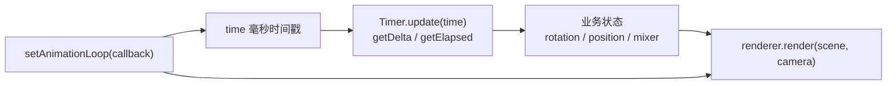

import { Canvas, Controls, Meta } from '@storybook/addon-docs/blocks';
import * as ClockStories from './clock-and-animation-loop.stories.js';

<Meta of={ClockStories} name="Docs" />

# 循环与时间

渲染循环只保证一件事：按浏览器（或 XR）的帧节奏**反复调用**你的回调，并在回调里执行 `renderer.render(scene, camera)`。它不保证运动速度——回调触发次数随刷新率、调度和可见性波动。业务状态（角度、位置、动画时间）要用**秒制时间**推进：`state += speed * delta`，把速度写成“每秒多少”。

`renderer.setAnimationLoop(callback)` 提供帧触发与毫秒时间戳；`THREE.Timer`（或手动相减）把时间戳转成秒制 `delta` / `elapsed`，并把帧率波动与暂停从运动速度里解耦。画布尺寸、pixel ratio 与相机宽高比见 [坐标与尺寸](?path=/docs/coordinate-system-and-units--docs)；`AnimationMixer` 见 [动画](?path=/docs/gltf-animation-mixer--docs)。



| 输入或 API | 默认 / 常用 | 回查要点 |
| --- | --- | --- |
| `setAnimationLoop(cb)` | 无默认循环 | 回调接收毫秒 `time`；传 `null` 停止 |
| `time` | 与 `performance.now()` 同源 | 手动用时除以 `1000` 得秒；首帧基准要清零 |
| `Timer.update(time)` | 每模拟步进一次 | 必须在 `getDelta()` 之前；漏调会停在旧值 |
| `Timer.getDelta()` | 上次 `update` 以来的秒数 | 同一帧多次查询返回同一值 |
| `Timer.getElapsed()` | 自运行以来累计秒数 | 暂停期间不增长；`reset()` 对齐当前时刻 |
| 业务速度 | 写成“每秒多少” | 每帧 `speed * delta`，不要“每帧固定加” |
| `Timer.setTimescale(n)` | `1` | `0.5` 慢放、`2` 快放，直接缩放 delta |
| `Timer.connect(document)` | 可选 | 标签页隐藏时 delta 置 `0`，回来自动 `reset()` |

## 快速上手

用 `setAnimationLoop` 接循环，用 `Timer` 取秒制 delta，再按“每秒多少”推进状态：

```js
import * as THREE from 'three';

const timer = new THREE.Timer();
const angularSpeed = 1.2; // 弧度/秒

renderer.setAnimationLoop((time) => {
  timer.update(time);
  const delta = timer.getDelta();

  cube.rotation.y += angularSpeed * delta;
  renderer.render(scene, camera);
});
```

下面实例用手动 `(time - lastTime) / 1000` 得到同样的秒制 delta（不引入 Timer 时也能跑通）。调角速度，观察 delta 与角度；关掉运行再打开，对比“恢复时是否重置时间基准”。

<Canvas of={ClockStories.DeltaAnimation} />
<Controls of={ClockStories.DeltaAnimation} />

本页多个实例进入视口前 `200px` 才持续渲染，离开后暂停并保留最后一帧。

## 渲染循环

`renderer.setAnimationLoop(callback)` 是 three.js 推荐的渲染循环入口：注册后由框架按帧调用你的回调；传 `null` 停止。回调签名是 `(time, frame?)`——`time` 为毫秒时间戳，`frame` 仅在 XR 会话中有意义。

```js
renderer.setAnimationLoop((time) => {
  // 1. 推进时间与业务状态
  // 2. renderer.render(scene, camera)
});

// 停止循环（组件卸载、离屏、暂停游戏时）
renderer.setAnimationLoop(null);
```

它与手写 `requestAnimationFrame` 的关系：

| 方式 | 适合 | 注意 |
| --- | --- | --- |
| `renderer.setAnimationLoop(cb)` | three.js 默认选择 | 统一启停；WebXR 会话期间由框架切到 XR 帧节奏 |
| 手写 `requestAnimationFrame(loop)` | 与非 three 渲染混排、自管调度 | XR 场景必须改回 `setAnimationLoop`，否则 XR 视图不更新 |

官方建议凡是 three.js 项目都优先用 `setAnimationLoop`，以便日后接 XR 时不必改循环入口。循环**只负责触发**；是否每帧都 `render`、状态如何推进，由你在回调里决定（见后文“持续循环与按需渲染”）。

## frame、delta 与 elapsed

三层时间不要混用：

| 概念 | 表示什么 | 单位 | 受帧率影响吗 |
| --- | --- | --- | --- |
| frame | 回调的一次触发 | 离散次数 | 是——60 Hz 约 60 次/秒，120 Hz 约 120 次/秒 |
| delta | 相邻两次步进的间隔 | 秒 | 单次值波动，但每秒累计约 1 |
| elapsed | 自启动以来的累计运行时间 | 秒 | 否——真实运行时间不随帧率变 |

为什么不能按帧累加？若每帧固定加 `0.018`，60 Hz 下一秒约加 `1.08` 弧度，120 Hz 下一秒约加 `2.16`——同一动画在高刷屏上会快一倍。用 `delta` 后，`angularSpeed = 1.08` 表示每秒约 `1.08` 弧度，与触发频率无关。

`delta` 适合“这一步前进多少”（旋转、位移、`mixer.update(delta)`）；`elapsed` 适合“从启动起过了多久”（周期函数、按绝对时间采样）。下面把回调按模拟帧率节流：左侧按帧固定加，右侧用 `Timer.getDelta()`。降低模拟帧率，观察两侧角速度读数。

<Canvas of={ClockStories.ClockVsFrame} />
<Controls of={ClockStories.ClockVsFrame} />

在 60 fps 时两者角速度接近；降到 10 fps 时，帧推进立方体的角速度大约掉到六分之一，Timer 推进仍保持约 `62°/s`。

## Timer 与时间源

拿到秒制时间有三种常见做法：手动相减、`THREE.Timer`（推荐）、`THREE.Clock`（r183 起弃用）。

```js
const timer = new THREE.Timer();

renderer.setAnimationLoop((time) => {
  timer.update(time); // 先推进
  const delta = timer.getDelta(); // 再查询；同一帧可多次
  const elapsed = timer.getElapsed();

  cube.rotation.y += angularSpeed * delta;
  renderer.render(scene, camera);
});
```

| 成员 | 含义 | 注意 |
| --- | --- | --- |
| `update(timestamp)` | 用毫秒时间戳推进内部状态 | 每个模拟步进一次，且在查询之前；省略则用 `performance.now()` |
| `getDelta()` / `getElapsed()` | 秒制间隔 / 累计 | 查询不修改状态，同一帧结果稳定 |
| `setTimescale(n)` / `getTimescale()` | 时间缩放 | 直接缩放 `update` 算出的 delta |
| `reset()` | 把内部时刻对齐到当前 | 暂停后恢复时重置基准 |
| `connect(document)` | 接入 Page Visibility | 隐藏时 delta 为 `0`，可见时自动 `reset()` |
| `disconnect()` / `dispose()` | 移除可见性监听 | 用过 `connect` 时在销毁阶段调用 |

`THREE.Clock` 靠“调用 `getDelta()` 即推进 `oldTime`”：同一帧先 `getDelta()` 再 `getElapsedTime()` 会不一致（后者内部又调了一次 `getDelta()`）。维护旧代码可继续用，新项目用 Timer。控制台若出现 `Clock: This module has been deprecated...`，迁移到 `Timer.update(time)` 后再查询即可。

| 时间源 | 适合 | 注意 |
| --- | --- | --- |
| 手动 `(time - lastTime) / 1000` | 极简循环、教学演示 | 暂停后清零 `lastTime`；建议 `Math.min(delta, 0.1)` 封顶 |
| `THREE.Timer` | 新项目默认 | 推荐；可接 Visibility 与 timescale |
| `THREE.Clock` | 维护旧代码 | r183 弃用；同一帧不要混调 `getDelta` 与 `getElapsedTime` |

## 暂停、后台与首帧

循环停住再恢复时，墙钟已经走过一段。若仍用旧的 `lastTime` / 未 `reset` 的 Timer，第一帧 `delta` 会等于整段暂停时长，物体瞬间跳很远。

处理原则：

1. **停止**时：`renderer.setAnimationLoop(null)`（或离屏暂停）。
2. **恢复**时：清零时间基准——`lastTime = 0`，或 `timer.reset()`；首帧 delta 应为 `0`。
3. **卡顿尖峰**：即使用户没有暂停，单帧也可能特别长；用 `Math.min(delta, 0.1)` 限制单步，或靠 `Timer.connect(document)` 在标签页隐藏时把 delta 置 `0`。

在「快速上手」里的 delta 实例中：保持「恢复时重置时间基准」开启，关闭运行再打开——首帧 raw delta 为 `0`。再关掉重置、暂停几秒后恢复——raw delta 会出现数百毫秒级尖峰，随后被 `100ms` 上限截断；这就是「暂停后跳一下」的来源。

后台标签页：浏览器会节流或暂停 rAF。显式停止循环并在可见时重置基准，比依赖隐式调度更稳。`Timer.connect(document)` 把 Visibility 接到 Timer 上，适合不想手写 `visibilitychange` 的场景。

## 持续循环与按需渲染

不是所有画面都需要每帧 `render`：

| 模式 | 何时用 | 做法 |
| --- | --- | --- |
| 持续循环 | 动画、相机惯性、粒子、实时仿真 | `setAnimationLoop` 里每帧更新状态并 `render` |
| 按需渲染 | 静态查看器、仅交互时变化 | 平时 `setAnimationLoop(null)`；状态或尺寸变化时调用一次 `render` |

按需模式下，尺寸变化、控制器 `change`、GUI 调参都应触发一次绘制；否则停在旧像素。持续模式在离屏、隐藏标签页或组件销毁时仍应停止 loop，避免空转。

切换下面的渲染模式：持续循环时 `setAnimationLoop` 运行、`render` 次数上涨；按需时 loop 停止，只有拖动角度才增加计数。

<Canvas of={ClockStories.OnDemandRender} />
<Controls of={ClockStories.OnDemandRender} />

## 最佳实践

- 速度统一写成“每秒多少”，乘秒制 `delta`；不要保留“每帧固定增量”。
- 新项目用 `THREE.Timer`：`update(time)` 放在帧回调最前；旧代码的 Clock 注意弃用与同帧混调。
- 启停只走 `setAnimationLoop(cb | null)`；恢复时重置时间基准，并对异常大的 delta 设上限。
- 静态或少变化场景用按需渲染；有持续运动再用常驻 loop，离屏/卸载时停掉。
- 可能接 WebXR 的项目统一用 `setAnimationLoop`，不要手写 `requestAnimationFrame` 主循环。

## 常见问题

- 为什么动画在 120 Hz 屏幕上明显变快？
  用了每帧固定增量；改成 `speed * delta`，按秒解释速度。
- 为什么从后台或暂停回来后对象突然跳很远？
  恢复时重置 `lastTime` / `timer.reset()`，或给 delta 设上限；也可用 `Timer.connect(document)`。
- 为什么首帧对象就跳一下？
  首帧不要把“启动前的延迟”算进状态：基准清零，让第一帧 delta 为 `0`。
- `Timer.getDelta()` 一直是 `0`？
  确认先调用了 `update(time)`，且每个步进只 `update` 一次。
- 控制台提示 Clock 已弃用？
  r183 起改用 `THREE.Timer`；维护期可暂留 Clock，但同帧不要混调 `getDelta` 与 `getElapsedTime`。
- 手写 `requestAnimationFrame` 在 WebXR 里不刷新？
  改用 `renderer.setAnimationLoop(cb)`，让 three.js 绑定 XR 帧节奏。
- 静态场景为什么还要一直开着 loop？
  不需要；停掉 loop，只在状态或尺寸变化时 `render` 一次。

## 总结回顾

摘要：

`setAnimationLoop` 只提供帧触发与时间戳；运动快慢由秒制 `delta` / `elapsed` 决定。frame 是离散触发，delta 是步进间隔，elapsed 是累计运行时间——业务状态用 `speed * delta` 推进，才能与刷新率解耦。推荐 `THREE.Timer` 封装时间源；暂停、后台与首帧都要重置基准并限制尖峰。有持续运动才常驻循环，否则按需 `render`。

一句话：

> 循环保证反复调用 render；运动必须用秒制时间推进，并用 Timer（或等价做法）把帧率与暂停从速度里拆开。

知识要点：

- 循环回调什么时候触发？和 `requestAnimationFrame` 是什么关系？
- 为什么不能按帧累加业务状态？
- `delta` 与 `elapsed` 分别何时用？
- 暂停或切后台后恢复，为什么第一帧会跳？怎样避免？
- 什么时候不需要持续 `setAnimationLoop`？

## 参考资料

- [Three.js Docs：Timer](https://threejs.org/docs/pages/Timer.html)
- [Three.js Docs：Clock（r183 起弃用）](https://threejs.org/docs/pages/Clock.html)
- [Three.js Docs：WebGLRenderer](https://threejs.org/docs/pages/WebGLRenderer.html)
- [Three.js Manual：Creating a scene](https://threejs.org/manual/en/creating-a-scene.html)
- [Three.js Manual：Animation System](https://threejs.org/manual/en/animation-system.html)
- [Three.js Manual：WebXR Basics](https://threejs.org/manual/en/webxr-basics.html)
- [MDN：Window.requestAnimationFrame()](https://developer.mozilla.org/en-US/docs/Web/API/Window/requestAnimationFrame)
- [MDN：performance.now()](https://developer.mozilla.org/en-US/docs/Web/API/Performance/now)
- [MDN：Page Visibility API](https://developer.mozilla.org/en-US/docs/Web/API/Page_Visibility_API)
