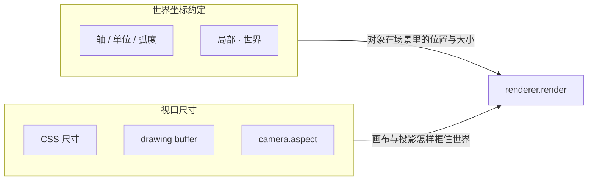

import { Canvas, Controls, Meta } from '@storybook/addon-docs/blocks';
import * as CoordinateStories from './coordinate-system-and-units.stories.js';

<Meta of={CoordinateStories} name="Docs" />

# 坐标与尺寸

three.js 里有两条相关但独立的测量链路：**世界坐标约定**回答场景内“在哪、多大”；**视口尺寸**回答屏幕如何框住世界。轴朝向、世界单位、弧度、局部·世界合起来描述对象状态；canvas 的 CSS 尺寸、drawing buffer、pixel ratio 与 `camera.aspect` 合起来决定投影怎样映射到像素。任一环节不同步，就会出现拉伸、模糊，或让后续拾取坐标错位。



| 概念或输入 | 取值 / 默认 | 回查要点 |
| --- | --- | --- |
| 坐标系 | 右手：`+X` 右、`+Y` 上、`+Z` 朝观察者 | 用 `AxesHelper` 核对；OpenGL/WebGL 同为右手系 |
| `AxesHelper(n)` | `n` 为轴可见长度 | 三色固定：X 红、Y 绿、Z 蓝；只可视化，不改渲染 |
| 世界单位 | 无内置单位；`1` 是场景标量 | “米 / 厘米 / 像素”是约定；模型与相机共用即可 |
| `position` / `scale` | `Vector3`；默认 `(0,0,0)` / `(1,1,1)` | 写世界单位；改大小优先动 `scale` |
| `rotation` / `quaternion` | `Euler`（弧度）/ `Quaternion`；二者同步 | 日常写 `rotation`；内部矩阵用四元数 |
| `PerspectiveCamera.fov` | **度数**，常见 45–60 | 内部换算为弧度；与 `rotation` 的单位不同 |
| CSS 尺寸 | `clientWidth` / `clientHeight` | 布局权威输入；只改它会拉伸旧 buffer |
| `setSize(w, h, false)` | `false` 表示不覆盖 CSS | 按当前 pixel ratio 重建 drawing buffer |
| `setPixelRatio` | 默认 `1`；常用 `min(devicePixelRatio, 2)` | 越高越清晰，像素量按面积增长 |
| `camera.aspect` | 默认 `1` | 设为宽/高后必须 `updateProjectionMatrix()` |

## 快速上手

同时核对轴约定与尺寸同步：原点放 `AxesHelper`，立方体放在 `(2, 0, 0)`；画布由 CSS 定大小，再用同一组宽高更新 renderer 与相机。

```js
import * as THREE from 'three';

const scene = new THREE.Scene();
scene.background = new THREE.Color('#edf3ef');

const camera = new THREE.PerspectiveCamera(50, 2, 0.1, 100);
camera.position.set(6, 5, 7);
camera.lookAt(0, 0, 0);

scene.add(new THREE.AxesHelper(2.4)); // 红 X / 绿 Y / 蓝 Z
scene.add(new THREE.GridHelper(10, 10));

const cube = new THREE.Mesh(
  new THREE.BoxGeometry(0.8, 0.8, 0.8),
  new THREE.MeshStandardMaterial({ color: '#3d73d9', roughness: 0.4 })
);
cube.position.set(2, 0, 0); // 沿 +X，距离原点 2 个世界单位
scene.add(cube);

scene.add(new THREE.HemisphereLight('#ffffff', '#78908a', 0.9));
const key = new THREE.DirectionalLight('#ffffff', 2.1);
key.position.set(4, 6, 5);
scene.add(key);

const renderer = new THREE.WebGLRenderer({ antialias: true });
renderer.setPixelRatio(Math.min(window.devicePixelRatio, 2));
document.body.append(renderer.domElement);

function resize() {
  const width = Math.max(1, Math.floor(renderer.domElement.clientWidth));
  const height = Math.max(1, Math.floor(renderer.domElement.clientHeight));
  renderer.setSize(width, height, false); // false：不覆盖 CSS
  camera.aspect = width / height;
  camera.updateProjectionMatrix();
}

resize();
renderer.setAnimationLoop(() => renderer.render(scene, camera));
```

本页有多个 WebGL Canvas。坐标类实例进入视口附近才持续渲染，离开后暂停并保留最后一帧；尺寸实例只在参数或容器变化时重绘。

## 右手坐标系

three.js 沿用 OpenGL / WebGL 的右手坐标系。把右手放在原点：大拇指 `+X`、食指 `+Y`，中指指向 `+Z`。`AxesHelper` 用三色固定表达：红 = X、绿 = Y、蓝 = Z。

```js
scene.add(new THREE.AxesHelper(2.4));
// 红 = X、绿 = Y、蓝 = Z；三条轴从原点向正方向延伸
```

| 轴 | 颜色 | 方向（默认相机朝 -Z 时） |
| --- | --- | --- |
| `+X` | 红 | 屏幕右方 |
| `+Y` | 绿 | 屏幕上方 |
| `+Z` | 蓝 | 朝向观察者（屏幕外） |
| `-Z` | （反向） | 远离观察者；相机默认朝这里看 |

正向旋转用右手定则：大拇指沿轴正方向，四指卷曲方向就是角度增加的方向。例如增大 `rotation.y` 时，从上向下看（`+Y` 朝你），物体绕 Y 轴**逆时针**旋转。

先切到「前视」核对三色端点球：红在右、绿在上、蓝朝自己。再切到「俯视」，拖大 `rotation.y`，看橙色指针是否逆时针转。

<Canvas of={CoordinateStories.RightHandedAxes} />

<Controls of={CoordinateStories.RightHandedAxes} />

更完整的 Helper 用法见 [Helper](?path=/docs/helpers-and-debug-objects--docs)；这里只用 `AxesHelper` 核对轴约定。

## 世界单位与 TRS

three.js 没有内置物理单位。`position.set(2, 0, 0)` 中的 `2` 只是场景内部标量——常见约定当作“1 米”，也可以是厘米或自定义单位。模型尺寸、相机距离和 `near` / `far` 必须共用同一约定。

这些标量写在 `Object3D` 的变换属性上，类型固定：

| 属性 | 类型 | 默认值 | 本课用法 |
| --- | --- | --- | --- |
| `position` | `Vector3` | `(0, 0, 0)` | `position.set(2, 0, 0)` 或改分量 |
| `rotation` | `Euler` | `(0, 0, 0)`，顺序 `'XYZ'` | `rotation.y = Math.PI / 2`；分量是弧度 |
| `scale` | `Vector3` | `(1, 1, 1)` | `setScalar(2)` 均匀放大；`set(2, 1, 1)` 非均匀 |
| `quaternion` | `Quaternion` | 单位四元数 | 与 `rotation` 自动同步；本课不必手写 |

`BoxGeometry(0.8, 0.8, 0.8)` 决定几何在局部空间的固有尺寸；需要“看起来更大/更小”时优先改 `scale`，不要把几何宽高深当成屏幕像素。几何定形状，`scale` 定相对放大倍数——两者都用世界单位。

世界单位与屏幕像素是两条链：

- **世界单位**：`position`、`scale`、几何尺寸、相机 `near` / `far`
- **屏幕像素**：`setSize` 决定的 drawing buffer，再由 CSS 决定显示多大

近大远小是透视投影结果，不是单位换算。要把一批物体一起放大，用父级 `Group.scale` 即可——相机不动时只是画面变大，并不改变“1 单位是几像素”：

```js
const group = new THREE.Group();
group.add(axes, cube);
scene.add(group);

group.scale.setScalar(2); // Vector3 均匀放大
cube.position.set(2, 0.4, 0); // 仍是世界单位分量
```

拖动「整体缩放」：读数里的 `group.scale` 是 `Vector3`，立方体局部尺寸仍是 `0.8` 世界单位。

<Canvas of={CoordinateStories.WorldUnits} />

<Controls of={CoordinateStories.WorldUnits} />

向量加减、欧拉顺序、万向节死锁，以及何时手写 `quaternion`，留到 [Object3D](?path=/docs/object3d-transform-hierarchy--docs)。

## 角度与弧度

three.js 内部的 `rotation`、以及 `Math.atan2` 的返回值都用**弧度**。度数与弧度通过 `MathUtils` 换算：

```js
THREE.MathUtils.degToRad(90);   // ≈ 1.5708 = Math.PI / 2
THREE.MathUtils.radToDeg(Math.PI); // 180
```

| 度数 | 弧度表达式 | 近似值 |
| --- | --- | --- |
| 30° | `Math.PI / 6` | ≈ 0.524 |
| 45° | `Math.PI / 4` | ≈ 0.785 |
| 60° | `Math.PI / 3` | ≈ 1.047 |
| 90° | `Math.PI / 2` | ≈ 1.571 |
| 180° | `Math.PI` | ≈ 3.142 |
| 360° | `Math.PI * 2` | ≈ 6.283 |

例外：`PerspectiveCamera.fov` 接收的是**度数**；构造器内部再换成弧度参与投影矩阵。对 `Math.cos` / `Math.sin` 传参前，先确认单位是弧度。

实例默认俯视。先保持开关关闭，把意图角度调到 `90`：指针应对准 `-Z` 刻度。再打开「把度数直接写入 `rotation.y`」：同样写 `45` 会变成约 2578°，指针看起来像乱转。

<Canvas of={CoordinateStories.RadiansRotation} />

<Controls of={CoordinateStories.RadiansRotation} />

## 局部空间与世界空间

`Object3D` 的 `position` / `rotation` / `scale` 都是相对**父级**的局部变换。同一个 `child.position.set(2, 0, 0)`，挂在场景根下时世界位置是 `(2, 0, 0)`；挂在已平移到 `(1, 0, 0)` 的父级下时，世界位置变成 `(3, 0, 0)`；父级再绕 Y 转 90°，世界位置会落到另一方向。

```js
const parent = new THREE.Group();
parent.position.set(1, 0, 0);
parent.rotation.y = THREE.MathUtils.degToRad(90);
scene.add(parent);

const child = new THREE.Mesh(geometry, material);
child.position.set(2, 0, 0); // 局部值始终是 (2, 0, 0)
parent.add(child);

const world = child.getWorldPosition(new THREE.Vector3());
// world 大致等于 (1, 0, -2)：父级先转 90°，再平移 1
```

读取世界结果前先确保相关矩阵已更新：

```js
child.updateWorldMatrix(true, false); // 先更新祖先链
child.getWorldPosition(worldPosition);
```

拖动父级平移或旋转：`child` 局部坐标保持 `(2, 0, 0)`，读数里的世界位置和 `matrixWorld` 平移会变；棕色辅助线始终连到立方体的世界位置。

<Canvas of={CoordinateStories.LocalVsWorld} />

<Controls of={CoordinateStories.LocalVsWorld} />

矩阵更新、`attach()`、坐标转换的完整机制见 [Object3D](?path=/docs/object3d-transform-hierarchy--docs)。这里先记住：**判断物体最终在哪里，始终把局部值、父级链和矩阵生效时机一起看**。

## 画布尺寸与像素比

canvas 同时有两层尺寸：**CSS 显示尺寸**回答“页面上占多大”，**drawing buffer** 回答“WebGL 实际画多少像素”。二者可以不同：显示为 `640 × 360` CSS 像素、pixel ratio 为 `2` 时，drawing buffer 通常是 `1280 × 720`。

```text
clientWidth/Height  ──setSize──►  getSize()          （逻辑尺寸，不含 ratio）
                                      │
                                      × getPixelRatio()
                                      ▼
canvas.width/height ◄──setSize──  getDrawingBufferSize()  （drawing buffer）
```

| 读数 / API | 表示什么 | 与谁对齐 | 计入 pixel ratio |
| --- | --- | --- | --- |
| `clientWidth` / `clientHeight` | CSS 布局后的显示尺寸（权威输入） | 同步后 = `getSize()` | 否 |
| `renderer.getSize(target)` | 上次 `setSize` 的逻辑尺寸缓存 | 同步后 = `clientWidth/Height` | 否 |
| `canvas.width` / `height` | drawing buffer | 同步后 = `getDrawingBufferSize()` | 是 |
| `getDrawingBufferSize(target)` | 逻辑尺寸 × ratio | 同步后 = `canvas.width/height` | 是 |
| `getPixelRatio()` | 逻辑尺寸到 buffer 的倍率 | `buffer ≈ size × ratio` | 本身是倍率 |

布局一变，只有 `clientWidth` / `clientHeight` 立刻更新；`getSize()` 与 buffer 仍停在旧值，直到再次 `setSize`。不要用 `canvas.width` 反过来当 CSS 布局来源，否则高 DPR 上会把物理像素又当逻辑像素用。

`renderer.setSize(width, height, false)` 接收逻辑像素，并结合当前 pixel ratio 设置 drawing buffer；第三个参数 `false` 表示不覆盖 CSS style，让布局继续由 CSS 决定。

```js
renderer.setSize(width, height, false);
```

`renderer.setPixelRatio(value)` 会保存倍率，并用当前逻辑尺寸重设 canvas。高 DPR 提升清晰度，但宽高都乘倍率：同样 CSS 面积从 `1` 提到 `2`，像素数约变成四倍。

```js
renderer.setPixelRatio(Math.min(window.devicePixelRatio, 2));
```

上限 `2` 是常见性能策略，不是 three.js 默认值。移动端重场景可能用 `1`；截图等质量优先任务也可能更高。改变下方实例的 pixel ratio，核对 CSS 尺寸不变而 drawing buffer 按倍率变大。

## 响应式投影

一次正确的 resize 用**同一组**显示宽高完成三件事：

```js
renderer.setSize(width, height, false);
camera.aspect = width / height;
camera.updateProjectionMatrix();
```

只改 CSS 会拉伸旧 drawing buffer；更新了 `camera.aspect` 却漏掉 `updateProjectionMatrix()`，属性是新值、投影矩阵仍是旧宽高比，圆环会被拉成椭圆。

下面先把「尺寸策略」切到错误分支，再改变 CSS 宽高比：

- **只改 CSS**：版面变了，renderer 逻辑尺寸与 drawing buffer 停在旧值。
- **漏更新投影矩阵**：renderer 与 `camera.aspect` 已更新，但投影矩阵宽高比仍是旧值。
- **完整同步**：CSS、renderer、drawing buffer 与投影矩阵一致，圆环保持正确比例。

<Canvas of={CoordinateStories.ResizePipeline} />

<Controls of={CoordinateStories.ResizePipeline} />

这个实例只在参数或容器尺寸改变时重绘，不常驻动画循环。读数同时给出 CSS、逻辑尺寸、drawing buffer，以及 `camera.aspect` 属性与投影矩阵中的实际宽高比。

触发入口取决于页面结构：

| 入口 | 适合情况 | 注意 |
| --- | --- | --- |
| 每帧比较 `clientWidth/Height` 与 buffer | 已有持续动画；布局来源复杂 | 比较时计入 pixel ratio，只在确实变化时 `setSize` |
| `ResizeObserver` 监听容器 | 静态或按需渲染 | 监听真正控制布局的容器；防止宽高为 `0` |
| `window.resize` | canvas 只随窗口变化的简单全屏页 | 侧栏、父容器变化不一定触发 |

正交相机没有 `aspect`，需要按新宽高比重算 `left` / `right` / `top` / `bottom`；公式见 [相机](?path=/docs/camera--docs)。用 `delta` 推进动画、暂停与恢复循环，见 [时间](?path=/docs/clock-and-animation-loop--docs)。指针坐标与 NDC 换算见 [拾取](?path=/docs/raycaster-pointer-interaction--docs)。

## 最佳实践

- 新场景先加 `AxesHelper` 和 `GridHelper`，立刻指出朝向错误，再调相机与物体。
- 项目早期确定“1 单位表示什么”，让模型、相机距离和 `near` / `far` 共用约定。
- 改位置写 `position`，改朝向写 `rotation`（弧度），改相对大小写 `scale`；不要把几何宽高深当成像素。
- 度数与弧度统一走 `MathUtils.degToRad` / `radToDeg`；记住 `fov` 是度数例外。
- 需要世界坐标时显式 `getWorldPosition` / `getWorldQuaternion`，读取前 `updateWorldMatrix(true, false)`。
- 让 CSS 负责布局，`setSize(width, height, false)` 保留第三个参数 `false`。
- 把 pixel ratio 当质量预算，不盲目等于设备 DPR；先设倍率，再同步尺寸。
- resize 时用同一组非零宽高更新 renderer 与 camera；改透视参数后统一调用一次 `updateProjectionMatrix()`。
- 跨引擎或与 Blender / Unity / glTF 交换数据时，先核对对方的轴约定与单位。

## 常见问题

- 为什么 `rotation.x = 45` 物体转得过多？
  `rotation` 是弧度；`45` 约等于 2578 度。改用 `degToRad(45)` 或 `Math.PI / 4`。
- 为什么改了 `BoxGeometry` 宽高深，画面尺度还是不对？
  几何与 `scale` 都用世界单位。统一放大一组对象时改父级 `scale`，不要把几何参数当成像素。
- 为什么同一个 `position.set(2, 0, 0)`，最终位置不一样？
  `position` 相对父级。检查挂在哪个父级下，必要时用 `getWorldPosition()` 读世界坐标。
- 为什么容器尺寸变了，画面被横向或纵向拉伸？
  用同一组非零宽高同步 CSS、drawing buffer 与相机投影；透视相机更新 `aspect` 后还要 `updateProjectionMatrix()`。
- 为什么画布看起来大小正确，画面却很模糊？
  检查 drawing buffer 是否按 pixel ratio 放大；只改 CSS 宽高不会增加实际渲染像素。
- 为什么 `camera.aspect` 已经改了，画面仍是旧比例？
  修改后必须调用 `camera.updateProjectionMatrix()`，否则仍使用旧投影矩阵。
- 为什么高 DPR 设备明显掉帧？
  给 `setPixelRatio()` 设合理上限；DPR 同时放大宽高，像素工作量按面积增长。
- 为什么侧栏开合后画布没有更新？
  不要只监听 `window.resize`；容器内部尺寸变化用 `ResizeObserver` 触发同一套同步逻辑。
- 为什么从 Blender / Unity 导入后模型朝向不对？
  来源工具的轴或单位可能不同。核对上方向与单位后，在导入层做一次旋转 / 缩放校正。
- 为什么 `camera.fov = 60` 看起来比预期小？
  `fov` 接收度数；确认没有先 `degToRad()` 一次后又当度数使用。

## 总结回顾

摘要：

世界坐标约定与视口尺寸是两条独立测量链路。轴约定、世界单位（及其 TRS 类型）、弧度、局部·世界描述对象在场景里的状态；CSS 尺寸、drawing buffer、pixel ratio 与 `camera.aspect` 描述屏幕如何框住世界。`AxesHelper` 核对朝向；`setSize(..., false)` 与 `setPixelRatio` 重建像素缓冲；resize 时用同一宽高更新 aspect 并 `updateProjectionMatrix()`。任一层停在旧状态，都会留下可由读数定位的拉伸、模糊或比例失真。

一句话：

> 场景内用轴、单位、弧度与父级链描述对象；屏幕侧用同一组逻辑尺寸同步 drawing buffer 与投影——两条链路各自对齐，画面才不拉伸、不模糊。

知识要点：

- three.js 的三条轴分别指向哪里？怎样用 `AxesHelper` 和视角切换验证？
- `1` 在 `position` / `scale` 里表示多大？世界单位与屏幕像素差在哪？
- `rotation` 用度数还是弧度？`fov` 为什么是例外？
- 同一个局部 `position` 在不同父级下，世界位置为什么会变？
- CSS 尺寸、renderer 逻辑尺寸与 drawing buffer 分别表示什么？
- `setSize` 的第三个参数 `false` 和 `setPixelRatio` 各自影响哪一层？
- 为什么修改 `camera.aspect` 后还必须更新投影矩阵？
- 怎样从尺寸和矩阵读数判断拉伸发生在哪一层？

## 参考资料

- [Three.js Manual：Creating a scene](https://threejs.org/manual/en/creating-a-scene.html)
- [Three.js Manual：Responsive Design](https://threejs.org/manual/en/responsive.html)
- [Three.js Manual：Matrix transformations](https://threejs.org/manual/en/matrix-transformations.html)
- [Three.js Manual：How to update things](https://threejs.org/manual/en/how-to-update-things.html)
- [Three.js Docs：Object3D](https://threejs.org/docs/pages/Object3D.html)
- [Three.js Docs：WebGLRenderer](https://threejs.org/docs/pages/WebGLRenderer.html)
- [Three.js Docs：PerspectiveCamera](https://threejs.org/docs/pages/PerspectiveCamera.html)
- [Three.js Docs：AxesHelper](https://threejs.org/docs/pages/AxesHelper.html)
- [Three.js Docs：MathUtils](https://threejs.org/docs/pages/MathUtils.html)
- [Three.js Docs：Vector3](https://threejs.org/docs/pages/Vector3.html)
- [Three.js Docs：Euler](https://threejs.org/docs/pages/Euler.html)
- [MDN：Window.devicePixelRatio](https://developer.mozilla.org/zh-CN/docs/Web/API/Window/devicePixelRatio)
- [MDN：ResizeObserver](https://developer.mozilla.org/zh-CN/docs/Web/API/ResizeObserver)
- [WebGL 坐标系（MDN）](https://developer.mozilla.org/zh-CN/docs/Web/API/WebGL_API/WebGL_model_view_projection)
