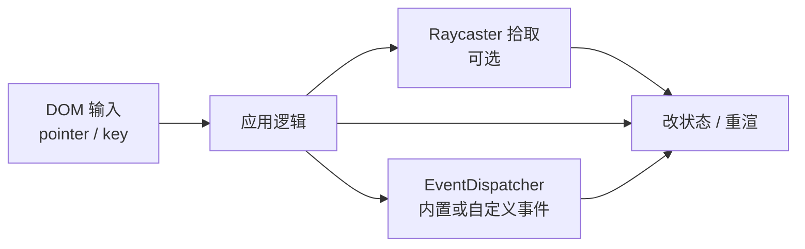

import { Canvas, Controls, Meta } from '@storybook/addon-docs/blocks';
import * as EventsStories from './events-dom-and-dispatcher.stories.js';

<Meta of={EventsStories} name="Docs" />

# 事件

three.js 有两套事件面，职责不同：

- **DOM 事件**负责指针、键盘、滚轮等浏览器输入。监听应挂在实际接收输入的元素上，通常是 `renderer.domElement`（或控制器构造时传入的那个 DOM）。
- **`EventDispatcher`** 负责 Object3D、控制器、加载器等对象的内部通知。`Object3D`、`OrbitControls`、`Texture` 等都混入了这套 API：`addEventListener` / `dispatchEvent` / `removeEventListener`。

给 Mesh 挂 `click` **不会**自动变成“点到物体”。浏览器不会对 3D 三角形做命中测试；正确链路是：DOM 输入 →（可选 [拾取](?path=/docs/raycaster-pointer-interaction--docs)）→ 改状态或 `dispatchEvent` 通知其他模块。



| 面 | 挂在哪里 | 典型事件 | 回查要点 |
| --- | --- | --- | --- |
| DOM | `renderer.domElement`、`window`、页面控件 | `pointerdown`、`keydown`、`wheel` | 只提供输入；命中物体要另做拾取 |
| EventDispatcher | `Object3D` / Controls / Loader / 自写类 | `added`、`change`、`load`、自定 `type` | 对象内部通知；无 DOM 冒泡 |

## 快速上手

在画布上听指针，同时演示 Object3D 内置事件与一次自定义 `dispatchEvent`：

```js
import * as THREE from 'three';

const canvas = renderer.domElement;

// 1) DOM：输入挂在画布上
canvas.addEventListener('pointerdown', (event) => {
  const rect = canvas.getBoundingClientRect();
  const ndcX = ((event.clientX - rect.left) / rect.width) * 2 - 1;
  const ndcY = -((event.clientY - rect.top) / rect.height) * 2 + 1;
  // ndc 交给拾取课的 Raycaster；这里只证明坐标已就绪
  console.log('pointer NDC', ndcX, ndcY);
});

// 2) Object3D 内置：挂载时派发 added / childadded
const parent = new THREE.Group();
const mesh = new THREE.Mesh(geometry, material);

mesh.addEventListener('added', () => console.log('mesh added'));
parent.addEventListener('childadded', (e) => console.log('child', e.child.name));
scene.add(parent);
parent.add(mesh);

// 3) 自定义业务事件：应用自己决定何时通知
mesh.addEventListener('selected', (e) => console.log('selected', e.source));
mesh.dispatchEvent({ type: 'selected', source: 'app' });
```

卸载页面或销毁场景时拆除监听（`removeEventListener` 或 `AbortController.abort()`），避免泄漏，也避免和 [相机控制器](?path=/docs/camera-controls--docs) 抢同一批残留回调。

## 两层事件模型

| 问题 | DOM | EventDispatcher |
| --- | --- | --- |
| 事件从哪来？ | 浏览器（指针、键盘、焦点） | 对象方法内部 `dispatchEvent` |
| API 形状 | `addEventListener(type, fn, options?)` | `addEventListener(type, listener)`（无 capture/冒泡选项） |
| 事件对象 | 标准 `PointerEvent` / `KeyboardEvent` | 普通对象，至少含 `type`；派发后会写上 `target` |
| 冒泡 | DOM 树冒泡 / 捕获 | **无冒泡**；只通知直接注册在该对象上的监听 |
| 典型用途 | 读输入、算坐标、驱动交互 | 场景树变化、控制器状态、加载完成、业务解耦 |

两套 API 名字相似，但 **Mesh 上的 `addEventListener('click')` 不是 DOM click**。除非你自己在拾取命中后 `dispatchEvent({ type: 'click' })`，否则不会触发。

## 画布指针与坐标

指针事件应挂在真正接收输入的元素上。多数场景用 `renderer.domElement`；若使用 `OrbitControls(camera, domElement)`，控制器也在同一元素上注册监听——自定义逻辑要与控制器的 `enabled` / `dispose` 协调，见下文与控制器课。

`clientX` / `clientY` 相对**视口**左上角。画布往往不在页面原点，换算局部坐标与 NDC 时必须减 `getBoundingClientRect()`：

```js
const rect = canvas.getBoundingClientRect();
const localX = event.clientX - rect.left;
const localY = event.clientY - rect.top;
// 为 Raycaster.setFromCamera 准备的 NDC（细节见拾取课）
const ndcX = (localX / rect.width) * 2 - 1;
const ndcY = -(localY / rect.height) * 2 + 1;
```

要点：

- 用 CSS 像素尺寸（`rect.width / height`），**不要**再除 `devicePixelRatio`。
- DOM 的 Y 向下，NDC 的 Y 向上，漏掉负号会上下颠倒。
- `offsetX` / `offsetY` 在部分触摸 / 合成事件上不可靠；`client + rect` 更通用。

下面实例把监听挂在画布上：移动指针看 client / 局部 / NDC 读数；按下时立方体短暂提亮（只表示 DOM 到达，不是拾取）。关闭「监听启用」后读数冻结，对应清理后的行为。

<Canvas of={EventsStories.DomPointer} />
<Controls of={EventsStories.DomPointer} />

本页有两个 WebGL Canvas：进入视口前约 `200px` 启动，离开后暂停并保留最后一帧。

## 键盘与监听清理

键盘通常挂在 `window` 或可聚焦元素上。画布默认不一定能收到 `keydown`，需要 `tabIndex` 并先聚焦，或统一在 `window` 上听并自行判断焦点范围。

```js
const onKeyDown = (event) => {
  if (event.code === 'Space') event.preventDefault();
  // ...
};

window.addEventListener('keydown', onKeyDown);

// 成对拆除：同一函数引用
window.removeEventListener('keydown', onKeyDown);
```

用 `AbortController` 管理一批监听更省事：

```js
const ac = new AbortController();
canvas.addEventListener('pointermove', onMove, { signal: ac.signal });
window.addEventListener('keydown', onKeyDown, { signal: ac.signal });

// 卸载或切页时一次拆光
ac.abort();
```

与控制器共存时：

- 不要在控制器已 `dispose()` 之后还假设它的 DOM 监听仍在。
- 自定义拖拽与 `OrbitControls` 同时听 `pointerdown` 时，用 `controls.enabled = false` 或在捕获阶段协调，避免抢事件。
- `enabled = false` **不会**移除监听，只是控制器内部早退；真正拆除用 `disconnect()` / `dispose()`。

## EventDispatcher API

| 方法 | 作用 |
| --- | --- |
| `addEventListener(type, listener)` | 注册；同一 `listener` 只加一次 |
| `hasEventListener(type, listener)` | 是否已注册该函数 |
| `removeEventListener(type, listener)` | 按**同一函数引用**移除 |
| `dispatchEvent(event)` | 同步调用监听；要求 `event.type`；并设置 `event.target = this` |

```js
const bus = new THREE.EventDispatcher();

function onReady(event) {
  console.log(event.type, event.target, event.payload);
}

bus.addEventListener('ready', onReady);
bus.dispatchEvent({ type: 'ready', payload: { id: 1 } });
bus.hasEventListener('ready', onReady); // true
bus.removeEventListener('ready', onReady);
```

边界：

- `removeEventListener` 必须传入**同一个函数引用**；内联箭头无法成对移除。
- 派发是同步的；监听里再 `dispatchEvent` 要防重入逻辑错误。
- 没有 DOM 那套捕获 / 冒泡；子对象的事件不会自动传到 `parent`。

## 内置事件速查

### Object3D 场景树

| 事件 | 派发在 | 何时 |
| --- | --- | --- |
| `added` | 被加入的子对象 | `parent.add(child)` / `attach` 成功后 |
| `removed` | 被移除的子对象 | `remove` / `removeFromParent` / `clear` 后 |
| `childadded` | 父对象 | 子对象加入后；`event.child` 为该子对象 |
| `childremoved` | 父对象 | 子对象移除后；`event.child` 为该子对象 |

### 控制器（详情见相机控制器课）

常见相机控制器在交互时派发 `change` / `start` / `end`（具体以各控件为准）。用它们做“拖动期间暂停其他逻辑”或“仅在 change 时按需重渲”。完整手势与生命周期见 [相机控制器](?path=/docs/camera-controls--docs)。

### 其他对象

材质、纹理、加载器等也会在自身生命周期里 `dispatchEvent`（如加载完成、贴图更新）。本课只建立「它们走 EventDispatcher」这一判断；各 API 的具体 `type` 回查对应课程与官方文档页。

下面实例切换「挂载立方体」观察树事件；在已挂载时点击画布，应用对 Mesh `dispatchEvent({ type: 'selected' })`，读数与短暂高亮证明自定义事件已到达。

<Canvas of={EventsStories.DispatcherEvents} />
<Controls of={EventsStories.DispatcherEvents} />

## 自定义业务事件

何时自己 `dispatchEvent`：

- 多个模块需要知道“选中了谁 / 加载完了 / 工具切换了”，又不想互相 import 调用。
- 想让 Object3D 或自写服务对外暴露稳定通知，而不是轮询标志位。
- 拾取命中后，把结果翻译成领域事件（如 `selected`、`hover-changed`），UI 与场景逻辑都只订事件。

约定：

- `type` 用短字符串；payload 放在同一对象的自定义字段上。
- 先 `addEventListener`，再在确定时机 `dispatchEvent`；对称地在销毁时 `removeEventListener`。
- 不要指望冒泡：需要通知父级或全局时，显式在父级 / 总线对象上派发。

## 最佳实践

- 指针监听默认挂 `renderer.domElement`；与控制器共用同一元素时，用 `enabled` 或显式互斥，不要双写同一套拖拽语义。
- 坐标换算固定走 `clientX/Y - getBoundingClientRect()`，并为拾取准备好 NDC；像素比交给 `setPixelRatio` / `setSize`。
- 场景树观察用 Object3D 内置 `added` / `childadded` 等；业务语义用自定义 `type`，不要滥用 `change` 当万能事件名（除非你就在监听控制器的 `change`）。
- 清理与注册成对：优先 `AbortController`，或保存函数引用后 `removeEventListener`；组件卸载、Story 销毁、`controls.dispose()` 时都要走到清理。
- 需要“点到某个 Mesh”时进入拾取课，不要在 Mesh 上假扮 DOM `click`。

## 常见问题

- 为什么 `mesh.addEventListener('click', …)` 点了没反应？
  那是 EventDispatcher 通道，浏览器不会往 Mesh 派 DOM click。在画布上听 pointer，必要时用 [拾取](?path=/docs/raycaster-pointer-interaction--docs) 命中后再 `dispatchEvent` 或改状态。
- 为什么监听写在 `document` 上坐标总偏？
  应用画布的 `getBoundingClientRect()` 把 client 坐标落到画布局部；侧栏、padding、居中布局都会造成 offset。
- 为什么拆不掉监听？
  `removeEventListener` 必须是注册时的同一函数引用；内联函数每次都是新引用。改用命名函数或 `AbortController`。
- 为什么和 OrbitControls 一起用时拖拽打架？
  两者都在听同一画布的指针。拖 gizmo 或自定义拖拽期间设 `controls.enabled = false`，结束再打开；见 [TransformControls](?path=/docs/transform-controls--docs) 与 [相机控制器](?path=/docs/camera-controls--docs)。
- 为什么子对象 `dispatchEvent` 父级听不到？
  EventDispatcher 无冒泡。在父级或共享总线对象上监听 / 派发。
- 为什么 `enabled = false` 之后仍觉得有监听？
  `enabled` 只让控制器忽略输入，DOM 监听还在。要拆除用 `disconnect()` 或 `dispose()`。

## 总结回顾

摘要：

交互输入走 DOM，对象通知走 EventDispatcher。指针挂在 `renderer.domElement` 上，用 `getBoundingClientRect` 得到局部坐标与 NDC；Mesh 不会自动收到 click。Object3D 在挂载卸载时派发 `added` / `removed` / `childadded` / `childremoved`；控制器另有 `change` 等事件。业务用自定义 `type` 解耦。监听必须成对清理。

一句话：

> DOM 管输入，EventDispatcher 管对象通知；点中物体要自己做拾取或显式 `dispatchEvent`，并记得拆除监听。

知识要点：

- DOM 事件通常应挂在哪个元素上？和控制器的 `domElement` 是什么关系？
- 为什么 `Mesh.addEventListener('click')` 不足以实现点击物体？
- EventDispatcher 解决什么问题？和 DOM 冒泡有何不同？
- 如何用 `removeEventListener` 或 `AbortController` 安全清理？
- Object3D 的 `added` / `childadded` 分别在谁身上触发？

## 参考资料

- [Three.js Docs：EventDispatcher](https://threejs.org/docs/#api/en/core/EventDispatcher)
- [Three.js Docs：Object3D（Events）](https://threejs.org/docs/#api/en/core/Object3D)
- [Three.js Docs：WebGLRenderer.domElement](https://threejs.org/docs/#api/en/renderers/WebGLRenderer)
- [MDN：Pointer events](https://developer.mozilla.org/en-US/docs/Web/API/Pointer_events)
- [MDN：AbortController](https://developer.mozilla.org/en-US/docs/Web/API/AbortController)
- [Three.js Manual：Responsive design](https://threejs.org/manual/en/responsive.html)
