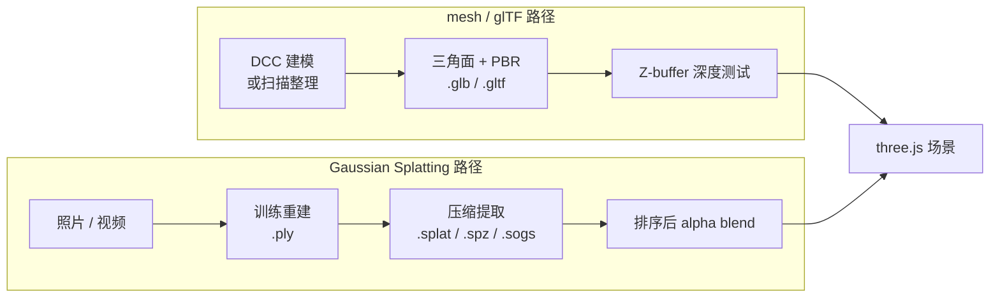

import { Meta } from '@storybook/addon-docs/blocks';

<Meta id="gaussian-splatting-viewer" title="进阶分支/渲染技术/Splatting" name="Docs" />

# Splatting

Gaussian Splatting 是一种用大量"带 alpha 的小高斯斑"叠加出整个场景的表示法。每一个 splat 是一个三维高斯——有位置、协方差（决定形状和朝向）、不透明度，以及用球谐函数表示的视角相关颜色；上百万个 splat 按深度排序后做 alpha 混合，画面看起来就是照片级真实场景。它从 NeRF 一族的辐射场方法衍生而来，但与 NeRF 不同的是 splat 是显式存储的几何体，可以实时渲染、剔除和整体变换。

它与 three.js 原生 mesh 路径差异是根本性的：mesh 用三角面拼出表面，glTF 描述这些面的几何、材质和动画；splat 没有显式面，整个场景是半透明斑的叠加。这种差异决定了 splat 适合"从照片或扫描重建出来的真实场景"，不适合"需要程序化编辑、骨骼动画或精确拾取的几何"。three.js 0.185.1 的核心和 `examples/jsm` 还**没有**内置 splat loader 或 splat 对象（在 `node_modules/three` 全文搜索 "splat" 零命中），实际项目都要走社区库。



本课聚焦"是什么、与 mesh 的差异、文件格式、排序难点和 viewer 怎么选"，不深入高斯重建算法、训练过程或 NeRF 原理。自定义粒子着色器渲染留给路线 [6.1.3 粒子](?path=/docs/points-particles-instancing--docs)。

## 快速上手

拿到一份 splat 文件，先识别它的格式和来源，再按下表选接入路径：

| 你手上的文件 | 来源 | 推荐路径 |
| --- | --- | --- |
| `.ply`（INRIA 训练结果，几十 MB 到几 GB） | 3D Gaussian Splatting 训练脚本输出 | 用社区库直接加载；体积过大时先转 `.splat` / `.spz` / `.sogs` |
| `.splat` / `.ksplat` / `.sogs` / `.spz` | 训练后转换的实时格式 | Spark（四种都支持）或 GaussianSplats3D（`.splat` / `.ksplat`） |
| `.glb`（带 splat 扩展） | 某些工具把 splat 塞进 glTF 容器 | 仍需 splat 库解析扩展；标准 `GLTFLoader` 不会渲染 splat |

最小闭环（以 GaussianSplats3D 的自包含 `Viewer` 为例，API 已稳定）：

```js
import * as THREE from 'three';
import * as GaussianSplats3D from '@mkkellogg/gaussian-splats-3d';

// Viewer 自带相机、控制器和渲染循环，适合独立 viewer。
const viewer = new GaussianSplats3D.Viewer({
  cameraUp: new THREE.Vector3(0, 1, 0),
  initialCameraPosition: new THREE.Vector3(0, 1.5, -4)
});

viewer.addSplatScene('/scenes/sample.splat').then(() => viewer.start());
```

要嵌入已有 three.js 场景，用同库的 `DropInViewer`（继承 `Object3D`）；Spark 的对应入口是 `SplatMesh` + `SparkRenderer`。具体参数以所选库当前文档为准——splatter 生态仍在快速演进。

| 输入或状态 | 默认值 / 常用起点 | 改变后要注意什么 |
| --- | --- | --- |
| 文件格式 | `.ply` 训练结果；`.splat` / `.spz` 实时 | 格式决定体积、加载时长和能否流式；库不支持时要先转换 |
| splat 数量 | 数十万到数百万 | 决定排序开销；超过百万级必须用 GPU 排序或近似排序 |
| 排序精度 | 库默认（多数精确排序） | 近似排序更快但可能产生"飞斑"伪影 |
| 渲染器 | WebGLRenderer | three.js 0.185.1 的 WebGPURenderer 还没有官方 splat 支持；社区库目前基本只覆盖 WebGL |
| 相机参数 | 沿用 mesh 项目常不合适 | 先按 splat 世界包围盒重设 near/far 与 OrbitControls 的 target、min/max distance |

## 表示模型：mesh 与 splat 的差异

理解 splat 的关键不是"另一种 mesh"，而是另一种场景表示。下表按"基本图元、表面、来源、能做什么"逐项对照：

| 维度 | mesh / glTF | Gaussian Splatting |
| --- | --- | --- |
| 基本图元 | 三角面 | 三维高斯（位置 + 协方差 + alpha + 球谐颜色） |
| 表面 | 显式、离散的三角形 | 隐式，由斑叠加出"看上去连续"的表面 |
| 来源 | DCC 工具建模，或扫描重建后整理 | 摄影测量 / 视频经训练直接重建 |
| 几何精度 | 顶点位置精确可控 | splat 是统计数据，没有可编辑顶点 |
| 编辑性 | 高：可移动、变形、布尔、蒙皮 | 低：基本只能整体变换或裁剪 |
| 动画 | 完整支持（骨骼、形变、关键帧） | 几乎没有；splat 本身不参与变形动画 |
| 材质 | PBR（金属度、粗糙度、贴图） | 视角相关颜色藏在球谐系数里，无法换材质 |
| 拾取 | `Raycaster` 命中三角面 | 多数库不直接支持精确拾取单个 splat |
| 文件 | `.glb` / `.gltf`，标准、可压缩 | `.ply` / `.splat` / `.spz` / `.sogs` / `.ksplat`，尚未标准化 |
| 渲染方式 | Z-buffer 深度测试 | 排序后 alpha blend（见下节） |
| 适用场景 | 可编辑、可控、程序化、动画的角色与物体 | 从照片重建的真实场景、室内漫游、文化遗产、产品 360° |

判断"该不该用 splat"，先回答三个问题：场景是否来自真实拍摄或扫描？是否几乎不需要编辑几何和动画？是否追求照片级真实感？三个都"是"时 splat 才明显优于 mesh；只要有一个"否"，传统 mesh + PBR 通常更稳，相关加载流程见 [模型](?path=/docs/gltf-and-gltfloader--docs) 与 [PBR](?path=/docs/pbr-and-environment-maps--docs)。

## 文件格式

splat 还没有像 glTF 那样的统一标准，每种格式对应不同的取舍：

| 格式 | 来源 | 内容 | 体积 | 常见库支持 |
| --- | --- | --- | --- | --- |
| `.ply` | INRIA 训练脚本直接输出 | 每个 splat 的位置、缩放、四元数旋转、球谐系数、alpha | 最大（原始 float，几十 MB 到几 GB） | Spark、GaussianSplats3D |
| `.splat` | 提取后的简化格式 | 每 splat 约 32 字节：位置 + 缩放 + 旋转 + 颜色 alpha | 中等 | Spark、GaussianSplats3D |
| `.ksplat` | GaussianSplats3D 自定义压缩 | 量化 + 压缩的 splat 数据 | 较小 | GaussianSplats3D、Spark（只读） |
| `.sogs` | 结构化分块压缩 | 分块压缩，支持流式加载 | 较小，适合 Web | Spark |
| `.spz` | PlayCanvas 提出的压缩格式 | gzip 友好的紧凑二进制 | 较小 | Spark |
| `.glb`（带扩展） | 部分工具把 splat 包装成 glTF 扩展 | glTF 容器内的 splat 数据 | 视实现 | 不通用，`GLTFLoader` 默认不解析 |

训练得到的是 `.ply`；上线前通常转成 `.splat` / `.spz` / `.sogs` 等实时格式压缩体积并便于流式加载。选库时先确认库支持哪些格式，再决定转换路径；不要假设标准 `GLTFLoader` 能加载任何 splat——它只认 mesh、动画和已注册的 glTF 扩展。

## 渲染难点：排序与 alpha blend

splat 半透明，渲染时不能用 Z-buffer 直接剔除——后面的 splat 要和前面已经画上去的混色，必须按"从远到近"（back-to-front）顺序 alpha blend。这是 splat 渲染的核心难点，也是性能关键：

| 排序策略 | 实现 | 适用规模 | 代价 |
| --- | --- | --- | --- |
| CPU 精确排序 | 每帧按 splat 到相机距离做 N·log N 排序 | 数十万以内 | CPU 时间随数量线性放大，移动端吃力 |
| GPU radix sort | 把排序搬上 GPU，多 pass 桶排 | 百万级 | 需要更多 GPU 显存和 pass，实现复杂 |
| 分块近似排序（3DGS 原论文） | 视锥切成 16×16 屏幕块，块内排序、块间按深度 | 数百万、可实时 | 块边界可能出现轻微"飞斑"或排序错误 |

为什么排序开销这么大：百万级 splat 每帧都要重排，相机一移动就改变全部顺序；CPU 排序在低端设备上会直接掉到几十帧。分块近似排序是 3D Gaussian Splatting 原论文的关键工程贡献，把排序限制在屏幕块内才做到实时。社区库多数默认精确排序以保证画面质量，性能不够时切到近似排序或减少 splat 数量。

排序之外还要注意 alpha blend 的两个副作用：半透明 splat 必须关 `depthWrite`，否则它会用半透明像素覆盖深度缓冲、把后面的 splat 或 mesh 错误剔除；以及视锥外或背后的 splat 必须先剔除，否则会把无意义的 splat 也算进排序，白白浪费 CPU/GPU。

## three.js 支持现状与 viewer 选型

核对结论（基于 0.185.1 实际 `node_modules/three` 与社区讨论）：three.js **核心和 `examples/jsm` 都没有 splat loader、splat 几何或 splat 材质**；维护者社区（donmccurdy、manthrax 等）的共识是 splat 实现复杂、格式未标准化，应留在第三方库，短期内不会进核心。WebGPURenderer 也没有官方 splat 支持。因此选型只在社区库之间进行：

| 库 | 渲染器 | 支持格式 | 维护状态 | 适用 |
| --- | --- | --- | --- | --- |
| [GaussianSplats3D](https://github.com/mkkellogg/GaussianSplats3D) | WebGLRenderer | `.ply` / `.splat` / `.ksplat` | **已停止活跃开发**，作者推荐迁移到 Spark | 旧项目维护、已用 `.ksplat` 资产 |
| [Spark](https://sparkjs.dev/) | 自带 `SparkRenderer`（基于 three.js WebGL） | `.ply` / `.splat` / `.ksplat` / `.sogs` / `.spz` | 活跃，2.0 已发布，由 World Labs 维护 | 新项目首选，格式覆盖最广 |
| 自建（基于 `Points` / `ShaderMaterial`） | WebGLRenderer 或 WebGPURenderer | 自定义 | 自行维护 | 需要完全控制渲染管线、splat 数量不大或要特殊效果 |

GaussianSplats3D 提供两种接入形态，边界清楚：

```js
// 形态一：自包含 Viewer，自带相机、控制器与渲染循环，适合独立 viewer
const viewer = new GaussianSplats3D.Viewer({ /* cameraUp, initialCameraPosition ... */ });
viewer.addSplatScene('/scenes/sample.splat').then(() => viewer.start());

// 形态二：DropInViewer 继承 Object3D，可 add 进已有 three.js 场景
const dropIn = new GaussianSplats3D.DropInViewer();
dropIn.addSplatScene('/scenes/sample.splat');
scene.add(dropIn);
```

Spark 的对应入口是 `SplatMesh`（作为 `Object3D` 挂进场景）配合 `SparkRenderer`（接管 splat 的排序与混合），具体签名以官方文档为准。

选 mesh 还是 splat 的最终判断：

| 需求 | 选 |
| --- | --- |
| 照片级真实重建场景、几乎不编辑、无角色动画 | splat |
| 可编辑几何、可控材质、骨骼动画 | mesh |
| 既有 mesh 又想叠加 splat 背景 | 两者并存，把 splat 放进场景作为环境或背景 |
| 要 WebGPU / NodeMaterial | 暂时只能自建或等社区库跟进，不要假设官方会短期补齐 |

## 最佳实践

- 选库前先盘资产格式：训练结果是 `.ply` 就选能直接吃的库；线上已部署 `.ksplat` 时可继续用 GaussianSplats3D，新项目优先 Spark。
- 大场景上线前把 `.ply` 转成压缩格式（`.splat` / `.spz` / `.sogs`），并把 splat 数量裁剪到百万级以内，移动端再减半。
- 性能不够时优先切近似排序或减少 splat 数量，不要靠缩小 canvas 掩盖排序开销。
- 把 splat 场景的相机 near/far、target、OrbitControls 的 min/max distance 都按 splat 的世界包围盒重新设一遍；直接套 mesh 项目参数常会让相机陷在 splat 内部或飞出远近裁面。
- splat 与 mesh 混排时让 splat 层关 `depthWrite`，由 mesh 提供可拾取、可动画的前景对象。
- 不要把 splat 当 mesh 用：避免对它做布尔、形变、骨骼绑定，这类操作在 splat 表示下要么不成立、要么需要重训。
- 跟踪社区库版本：splatter 生态仍快速演进，API、格式和渲染器支持每版都可能变；生产部署锁版本。

## 常见问题

- 为什么 `GLTFLoader` 加载 `.glb` 后看不到 splat？
  标准 `GLTFLoader` 只解析 mesh、动画和已注册的 glTF 扩展；splatter 没有官方 glTF 扩展，`.glb` 里塞 splat 数据是工具私有做法。换用支持 splat 的库直接加载原始格式。
- 为什么加载 `.ply` 后画面卡住几秒甚至崩溃？
  `.ply` 体积大，加载时还要做一次排序和格式转换。先转成 `.splat` / `.spz` 等实时格式并裁剪 splat 数量；移动端用更激进的压缩。
- 为什么旋转相机时 splat 出现"飞斑"或边缘抖动？
  多数是切到了近似排序或库的精度模式被关；切回精确排序，或接受该模式的轻微伪影换取帧率。
- 为什么 splat 场景和 mesh 混排时 mesh 闪一下就不见？
  splat 的 alpha blend 需要关 `depthWrite`，否则它会用半透明像素覆盖深度缓冲、把后面的 mesh 剔除掉。确认 splat 这一层 `depthWrite = false`。
- three.js 升级后 splat 不显示了？
  社区库通常滞后主版本；先看库的 release notes 是否支持当前的 three.js 大版本，必要时锁 three.js 版本或换库。
- WebGPURenderer 能渲染 splat 吗？
  three.js 0.185.1 的 WebGPURenderer 没有官方 splat 支持；社区库目前基本只覆盖 WebGLRenderer。需要 WebGPU 时只能自建或等社区库跟进。
- 该用 `.ply` 还是 `.splat`？
  `.ply` 是训练输出，体积大、信息全；`.splat` 是为实时渲染做的提取格式，体积小。线上用 `.splat` / `.spz` / `.sogs`，本地调试和再加工用 `.ply`。

## 总结回顾

摘要：

Gaussian Splatting 用大量带 alpha 的三维高斯叠加出场景，与 mesh 的三角面表示完全不同：没有显式几何面、不可程序化编辑、材质藏在球谐里、拾取困难，但能从照片直接重建出照片级真实场景。文件格式尚未标准化，训练得到的 `.ply` 在上线前通常转成 `.splat` / `.spz` / `.sogs` / `.ksplat` 等实时格式。渲染核心难点是 splats 半透明，必须按深度排序后再 alpha blend，百万级 splat 的排序是性能关键，库会提供精确或近似两种策略。three.js 0.185.1 没有内置 splat 支持，实际项目走社区库：新项目优先 Spark，旧 `.ksplat` 资产继续用 GaussianSplats3D；两者目前主要覆盖 WebGLRenderer。

一句话：

> splat 是另一种场景表示，不是另一种 mesh——选它之前先确认你要的是"照片级重建"而不是"可编辑几何"。

知识要点：

- splat 与 mesh 在基本图元、表面、来源和可编辑性上有哪些根本差异？
- 训练得到的 `.ply` 与实时格式 `.splat` / `.spz` / `.sogs` / `.ksplat` 各自解决什么问题？
- 为什么 splat 渲染必须排序？精确排序与近似排序在性能和画面上各有什么代价？
- three.js 0.185.1 有没有内置 splat 支持？目前主流社区库覆盖哪些格式和渲染器？
- 怎样判断一个场景应该用 splat 还是 mesh？混排时要注意什么？

## 参考资料

- [Three.js Discourse：Future of Gaussian Splatting Support Directly in three.js?](https://discourse.threejs.org/t/future-of-gaussian-splatting-support-directly-in-three-js/82481)
- [GaussianSplats3D（GitHub）](https://github.com/mkkellogg/GaussianSplats3D)
- [Spark — Advanced 3D Gaussian Splatting renderer for THREE.js](https://sparkjs.dev/)
- [3D Gaussian Splatting for Real-Time Radiance Field Rendering（INRIA 论文）](https://repo-sam.inria.fr/fungraph/3d-gaussian-splatting/)
- [glTF 2.0 Specification](https://registry.khronos.org/glTF/specs/2.0/glTF-2.0.html)
- [Three.js Manual](https://threejs.org/manual/)
