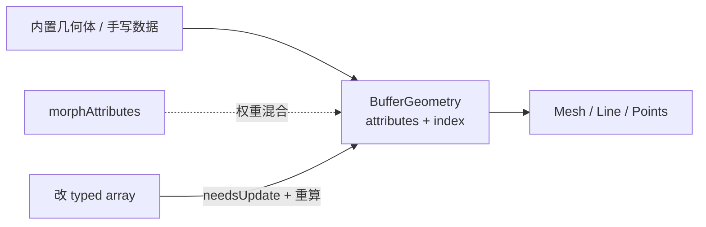

import { Canvas, Controls, Meta } from '@storybook/addon-docs/blocks';
import * as GeometryStories from './geometry-and-buffergeometry.stories.js';

<Meta of={GeometryStories} name="Docs" />

# 几何

所有可渲染形状最终都落在 `BufferGeometry` 上：它保存顶点 attribute（至少要有 `position`）、可选的 `index`，以及包围体、`drawRange`、`groups`、morph 等绘制相关状态。内置几何体（`BoxGeometry`、`SphereGeometry`、`ExtrudeGeometry`…）只是**工厂**——构造时生成一份 `BufferGeometry`，之后改构造参数不会自动重建网格，需要新建并替换。

`Mesh` / `Line` / `Points` 负责“用这份几何怎么画”；本课负责“几何数据本身怎样来、怎样改”。材质见[材质](?path=/docs/materials-and-render-states--docs)，对象组合见 [Mesh](?path=/docs/mesh-geometry-material--docs)。



| 成员 / 状态 | 默认值 / 常用起点 | 回查要点 |
| --- | --- | --- |
| `attributes.position` | 无则画不出三角形 | itemSize 通常为 `3`；改数组后设 `needsUpdate` |
| `attributes.normal` | 内置几何体自带 | 受光材质依赖；手写几何常需 `computeVertexNormals()` |
| `attributes.uv` | 内置几何体自带 | 贴图采样；细节见[纹理](?path=/docs/textures-and-maps--docs) |
| `index` | `null`（non-indexed） | 有 index 时每 3 个索引一个三角形，可复用顶点 |
| `drawRange` | `{ start: 0, count: Infinity }` | 用 `setDrawRange`；不删数据，只限制提交范围 |
| `groups` | `[]` | 多材质分区；用法见 [Mesh](?path=/docs/mesh-geometry-material--docs) |
| `boundingSphere` | 引擎按需计算 | 顶点大改后应 `computeBoundingSphere()` |
| `boundingBox` | `null`，需自算 | 应用侧调用 `computeBoundingBox()` |
| `morphAttributes` | `{}` | 渲染后不要改 morph 缓冲；改权重即可 |
| `dispose()` | 不自动调用 | 确认无共享引用后再释放 GPU 缓冲 |

## 快速上手

创建内置几何，交给 Mesh，读一下顶点数：

```js
const geometry = new THREE.BoxGeometry(1, 1, 1);
const material = new THREE.MeshStandardMaterial({
  color: '#3d73d9',
  roughness: 0.45
});
const mesh = new THREE.Mesh(geometry, material);
scene.add(mesh);

console.log(geometry.getAttribute('position').count); // 24（带 index 的盒）
console.log(geometry.index.count); // 36
```

`BoxGeometry` 等构造参数只在**创建时**生效；要换尺寸或分段，新建几何并 `mesh.geometry = next`（记得 `dispose()` 旧的）。

## BufferGeometry

`BufferGeometry` 是 three.js 的几何数据容器。它不负责变换层级（那是 Object3D），只描述“有哪些顶点、如何连成图元”。

- **有 `index`：** renderer 按索引取顶点，适合共享顶点的网格。
- **无 `index`：** 每 3 个连续 `position` 一个三角形，顶点不能跨三角形复用。

```js
const geometry = new THREE.BufferGeometry();
geometry.setAttribute(
  'position',
  new THREE.Float32BufferAttribute(new Float32Array([/* x,y,z,... */]), 3)
);
geometry.setIndex([0, 1, 2, 0, 2, 3]);
```

常用读写：`setAttribute` / `getAttribute` / `hasAttribute` / `deleteAttribute`，以及 `setIndex` / `getIndex`。`setFromPoints(points)` 只写入 `position`，适合线、轨迹；三角网格还要自己补 `index` / `normal` / `uv`。

## attribute

attribute 是按顶点（或按索引指向的顶点）存储的 typed array 视图。网格最常见的三个：

| 名称 | itemSize | 作用 |
| --- | --- | --- |
| `position` | 3 | 顶点局部坐标，必填 |
| `normal` | 3 | 光照；可用 `computeVertexNormals()` 生成 |
| `uv` | 2 | 贴图坐标 |

```js
const positions = new Float32Array([-1, 0, 0, 1, 0, 0, 0, 1, 0]);
geometry.setAttribute('position', new THREE.Float32BufferAttribute(positions, 3));
geometry.computeVertexNormals();
```

改已上传过的数据时，直接改 `attribute.array`（或 `setX` / `setY` / `setZ`），然后 `attribute.needsUpdate = true`。顶点数变化通常要重建 attribute / geometry，而不是只改几个值。

自定义 attribute（如 `aSeed`）只有着色器真正读取时才有意义，见 [Shader](?path=/docs/shader-basics--docs) 与[粒子](?path=/docs/points-particles-instancing--docs)。

## index

`index` 让多个三角形共享同一套顶点数据，减少重复、保证硬边/平滑法线在共享处按预期平均。

```js
geometry.setIndex([0, 1, 2, 0, 2, 3]);
// 或 geometry.setIndex(new THREE.Uint16BufferAttribute(indices, 1));
```

- 顶点很多时用 `Uint32BufferAttribute`；少量可用 `Uint16`。
- `toNonIndexed()` 会展开成不共享顶点的新几何，便于需要每面独立法线/颜色的情况。
- `Line` / `LineSegments` / `LineLoop` 一般**不靠 index** 解释连线，见 [Line](?path=/docs/line-and-segments--docs)。

有无 index 的顶点计数对照见下面「自定义几何」实例。

## 内置几何体

内置几何体都是生成 `BufferGeometry` 的工厂：构造时写入 `position` / `normal` / `uv`（以及常见的 `index`）。它们是 `BufferGeometry` 子类；实例上的 `parameters` 只是记录构造参数，**改 `parameters` 不会变形**——要换尺寸或分段就新建并替换。

大致两类输入模型：

- **参数化体：** `BoxGeometry`、`SphereGeometry`、`CylinderGeometry` 等，用宽高半径与分段直接生成。
- **轮廓 / 路径型：** `ShapeGeometry`、`ExtrudeGeometry`、`LatheGeometry`、`TubeGeometry`；`TextGeometry` 在 addons 里，但也是同一类挤出工厂。

共同用法：

```js
const geometry = new THREE.BoxGeometry(1, 1, 1);
mesh.geometry = geometry; // 替换时 dispose() 旧几何
```

`EdgesGeometry` / `WireframeGeometry` 用于从网格生成线框数据，见 [Line](?path=/docs/line-and-segments--docs)。

本页有多个 WebGL Canvas。进入视口附近才创建 WebGL，离开后冻住最后一帧并释放上下文，避免一页实例过多占满浏览器额度。

### BoxGeometry

`BoxGeometry` 生成轴对齐长方体，适合占位块、房间模块和简单碰撞示意。

```js
new THREE.BoxGeometry(
  width = 1,
  height = 1,
  depth = 1,
  widthSegments = 1,
  heightSegments = 1,
  depthSegments = 1
);
```

| 参数 | 默认 | 作用 |
| --- | --- | --- |
| `width` / `height` / `depth` | `1` | 三边长度 |
| `*Segments` | `1` | 对应轴向上的细分；升高后顶点与三角形增加 |

默认 `BoxGeometry(1,1,1)` 有 24 个 position 顶点、36 个 index（每面独立四角，便于每面法线）。

<Canvas of={GeometryStories.BoxGeometry} />
<Controls of={GeometryStories.BoxGeometry} />

### SphereGeometry

`SphereGeometry` 按经纬分段生成球体，也可截成穹顶或半球。

```js
new THREE.SphereGeometry(
  radius = 1,
  widthSegments = 32,
  heightSegments = 16,
  phiStart = 0,
  phiLength = Math.PI * 2,
  thetaStart = 0,
  thetaLength = Math.PI
);
```

| 参数 | 默认 | 作用 |
| --- | --- | --- |
| `radius` | `1` | 球半径 |
| `widthSegments` | `32` | 经度分段（水平一圈） |
| `heightSegments` | `16` | 纬度分段 |
| `phiLength` | `2π` | 水平扫过弧度；小于 `2π` 出现缺口 |
| `thetaLength` | `π` | 垂直扫过弧度；`π/2` 近似半球穹顶 |

分段过低会露棱；过高徒增三角形。天空穹顶常用较大半径 + 倒置法线或 `BackSide` 材质。

<Canvas of={GeometryStories.SphereGeometry} />
<Controls of={GeometryStories.SphereGeometry} />

### PlaneGeometry

`PlaneGeometry` 在局部 XY 平面生成矩形网格，适合地面、墙面、位移地形底板和全屏四边形。

```js
new THREE.PlaneGeometry(
  width = 1,
  height = 1,
  widthSegments = 1,
  heightSegments = 1
);
```

| 参数 | 默认 | 作用 |
| --- | --- | --- |
| `width` / `height` | `1` | 平面尺寸 |
| `widthSegments` / `heightSegments` | `1` | 细分；做地形位移时常拉高 |

当地面用时通常 `geometry.rotateX(-Math.PI / 2)`，或直接转 `mesh`。默认只朝 +Z 正面；要双面看见设材质 `side = DoubleSide`。

<Canvas of={GeometryStories.PlaneGeometry} />
<Controls of={GeometryStories.PlaneGeometry} />

### CylinderGeometry

`CylinderGeometry` 生成圆柱或圆台（上下半径不同）。

```js
new THREE.CylinderGeometry(
  radiusTop = 1,
  radiusBottom = 1,
  height = 1,
  radialSegments = 32,
  heightSegments = 1,
  openEnded = false,
  thetaStart = 0,
  thetaLength = Math.PI * 2
);
```

| 参数 | 默认 | 作用 |
| --- | --- | --- |
| `radiusTop` / `radiusBottom` | `1` | 顶 / 底半径；不等时为圆台 |
| `height` | `1` | 柱高 |
| `radialSegments` | `32` | 圆周分段 |
| `heightSegments` | `1` | 高度分段 |
| `openEnded` | `false` | `true` 时去掉顶底盖 |

需要尖顶时用 `ConeGeometry`；只要侧面可用 `openEnded: true`。

<Canvas of={GeometryStories.CylinderGeometry} />
<Controls of={GeometryStories.CylinderGeometry} />

### ConeGeometry

`ConeGeometry` 是顶半径为 0 的圆柱特例，参数更短。

```js
new THREE.ConeGeometry(
  radius = 1,
  height = 1,
  radialSegments = 32,
  heightSegments = 1,
  openEnded = false,
  thetaStart = 0,
  thetaLength = Math.PI * 2
);
```

| 参数 | 默认 | 作用 |
| --- | --- | --- |
| `radius` | `1` | 底面半径 |
| `height` | `1` | 锥高 |
| `radialSegments` / `heightSegments` | `32` / `1` | 圆周与高度分段 |
| `openEnded` | `false` | 是否去掉底盖 |

与 `CylinderGeometry(0, radius, …)` 拓扑同类；可读性优先用 Cone。

<Canvas of={GeometryStories.ConeGeometry} />
<Controls of={GeometryStories.ConeGeometry} />

### TorusGeometry

`TorusGeometry` 生成圆环（甜甜圈），由环半径与管半径决定外形。

```js
new THREE.TorusGeometry(
  radius = 1,
  tube = 0.4,
  radialSegments = 12,
  tubularSegments = 48,
  arc = Math.PI * 2
);
```

| 参数 | 默认 | 作用 |
| --- | --- | --- |
| `radius` | `1` | 从中心到管子中心的距离 |
| `tube` | `0.4` | 管子截面半径 |
| `radialSegments` | `12` | 管子截面分段 |
| `tubularSegments` | `48` | 沿圆环一圈的分段 |
| `arc` | `2π` | 环向扫过弧度 |

需要打结环带时用 `TorusKnotGeometry`。

<Canvas of={GeometryStories.TorusGeometry} />
<Controls of={GeometryStories.TorusGeometry} />

### CapsuleGeometry

`CapsuleGeometry` 是圆柱两端加半球盖，常用于角色/碰撞体示意。

```js
new THREE.CapsuleGeometry(
  radius = 1,
  length = 1,
  capSegments = 4,
  radialSegments = 8
);
```

| 参数 | 默认 | 作用 |
| --- | --- | --- |
| `radius` | `1` | 柱与端盖半径 |
| `length` | `1` | 中间圆柱段长度（不含端盖） |
| `capSegments` | `4` | 端盖纬度分段 |
| `radialSegments` | `8` | 圆周分段 |

总高度约为 `length + 2 * radius`。物理引擎里的 capsule 碰撞体常与它对齐。

<Canvas of={GeometryStories.CapsuleGeometry} />
<Controls of={GeometryStories.CapsuleGeometry} />

### CircleGeometry

`CircleGeometry` 生成圆盘（填充圆面），在局部 XY 平面。

```js
new THREE.CircleGeometry(
  radius = 1,
  segments = 32,
  thetaStart = 0,
  thetaLength = Math.PI * 2
);
```

| 参数 | 默认 | 作用 |
| --- | --- | --- |
| `radius` | `1` | 半径 |
| `segments` | `32` | 圆周分段 |
| `thetaLength` | `2π` | 扇形扫角 |

只要圆环边框用 `RingGeometry` 或 `LineLoop`；要厚圆盘用很矮的 `CylinderGeometry`。

<Canvas of={GeometryStories.CircleGeometry} />
<Controls of={GeometryStories.CircleGeometry} />

### RingGeometry

`RingGeometry` 生成圆环面片（有内径的圆盘）。

```js
new THREE.RingGeometry(
  innerRadius = 0.5,
  outerRadius = 1,
  thetaSegments = 32,
  phiSegments = 1,
  thetaStart = 0,
  thetaLength = Math.PI * 2
);
```

| 参数 | 默认 | 作用 |
| --- | --- | --- |
| `innerRadius` / `outerRadius` | `0.5` / `1` | 内 / 外半径 |
| `thetaSegments` | `32` | 圆周分段 |
| `phiSegments` | `1` | 径向分段 |
| `thetaLength` | `2π` | 环向扫角 |

UI 环、瞄准圈、简单光环常用它；要立体圆环用 `TorusGeometry`。

<Canvas of={GeometryStories.RingGeometry} />
<Controls of={GeometryStories.RingGeometry} />

### TorusKnotGeometry

`TorusKnotGeometry` 生成环面纽结，`p` / `q` 控制绕行周期。

```js
new THREE.TorusKnotGeometry(
  radius = 1,
  tube = 0.4,
  tubularSegments = 64,
  radialSegments = 8,
  p = 2,
  q = 3
);
```

| 参数 | 默认 | 作用 |
| --- | --- | --- |
| `radius` / `tube` | `1` / `0.4` | 尺度与管粗 |
| `tubularSegments` / `radialSegments` | `64` / `8` | 沿结与截面分段 |
| `p` / `q` | `2` / `3` | 纽结参数；互质时更“打结” |

适合演示与装饰；一般道具仍优先简单体素。

<Canvas of={GeometryStories.TorusKnotGeometry} />
<Controls of={GeometryStories.TorusKnotGeometry} />

### 多面体族

正多面体与可细分多面体共享 `radius` + `detail` 模型：

| 类 | 说明 |
| --- | --- |
| `TetrahedronGeometry` | 正四面体 |
| `OctahedronGeometry` | 正八面体 |
| `DodecahedronGeometry` | 正十二面体 |
| `IcosahedronGeometry` | 正二十面体；`detail` 升高可近似球面 |
| `PolyhedronGeometry` | 自定义顶点 / 索引的多面体基类 |

```js
new THREE.IcosahedronGeometry(radius = 1, detail = 0);
```

`detail = 0` 为原始面；每加 1 层细分，三角形显著增加。需要完全自定义顶点表时用 `PolyhedronGeometry`。

<Canvas of={GeometryStories.PolyhedronGeometry} />
<Controls of={GeometryStories.PolyhedronGeometry} />

### ShapeGeometry

`ShapeGeometry` 把二维 `Shape`（可含 `holes`）三角化成**平面**网格，默认在 XY 平面。适合徽章、面板、挤出前的剖面预览。

```js
const shape = new THREE.Shape();
shape.moveTo(0, 0);
shape.lineTo(1, 0);
shape.lineTo(1, 1);
shape.lineTo(0, 1);

const geometry = new THREE.ShapeGeometry(shape, 12); // curveSegments
```

`curveSegments`（默认 `12`）控制曲线细分。需要厚度时改用 `ExtrudeGeometry`，不要对 `ShapeGeometry` 期望“自动挤出”。

<Canvas of={GeometryStories.ShapeGeometry} />
<Controls of={GeometryStories.ShapeGeometry} />

### ExtrudeGeometry

`ExtrudeGeometry` 沿深度（或 `extrudePath`）挤出 `Shape`，是做立体徽章、文字底座、扫掠截面的常用入口。

```js
const geometry = new THREE.ExtrudeGeometry(shape, {
  depth: 0.4,
  steps: 1,
  bevelEnabled: true,
  bevelThickness: 0.08,
  bevelSize: 0.06,
  bevelSegments: 2
});
```

| 选项 | 默认 | 作用 |
| --- | --- | --- |
| `depth` | `1` | 挤出厚度 |
| `steps` | `1` | 厚度方向细分 |
| `bevelEnabled` | `true` | 是否倒角 |
| `bevelThickness` / `bevelSize` | `0.2` / 派生 | 倒角深入与外扩 |
| `bevelSegments` | `3` | 倒角平滑度 |
| `extrudePath` | `null` | 沿曲线挤出；此时不支持 bevel |
| `curveSegments` | `12` | 轮廓曲线分段 |

沿路径挤出且需要圆管外观时，也可对比 `TubeGeometry`（圆截面扫掠）。

<Canvas of={GeometryStories.ExtrudeGeometry} />
<Controls of={GeometryStories.ExtrudeGeometry} />

### LatheGeometry

`LatheGeometry` 把一组 `Vector2` 轮廓点绕 Y 轴旋转生成旋转体（花瓶、棋子、杯壁）。

```js
const points = [
  new THREE.Vector2(0, -1),
  new THREE.Vector2(0.6, 0),
  new THREE.Vector2(0.2, 1)
];
const geometry = new THREE.LatheGeometry(points, 24, 0, Math.PI * 2);
```

构造：`LatheGeometry(points, segments = 12, phiStart = 0, phiLength = Math.PI * 2)`。`phiLength` 小于 `2π` 会留出缺口，便于看内部。

<Canvas of={GeometryStories.LatheGeometry} />
<Controls of={GeometryStories.LatheGeometry} />

### TubeGeometry

`TubeGeometry` 沿三维 `Curve` 扫出圆形截面管子，适合缆线、轨道、路径可视化。

```js
const path = new THREE.CatmullRomCurve3([/* Vector3... */]);
const geometry = new THREE.TubeGeometry(
  path,
  64,   // tubularSegments
  0.2,  // radius
  8,    // radialSegments
  false // closed
);
```

| 参数 | 含义 |
| --- | --- |
| `tubularSegments` | 沿路径分段 |
| `radius` | 管半径 |
| `radialSegments` | 截面圆周分段 |
| `closed` | 路径是否按闭合管处理 |

截面不是圆、或要沿路径挤出任意 `Shape` 时，用 `ExtrudeGeometry` 的 `extrudePath`。

<Canvas of={GeometryStories.TubeGeometry} />
<Controls of={GeometryStories.TubeGeometry} />

### TextGeometry

`TextGeometry` 在 addons 中（`three/addons/geometries/TextGeometry.js`），本质是按字形生成 `Shape` 再 `ExtrudeGeometry`。必须提供 `FontLoader` 解析的 typeface 字体。

```js
import { FontLoader } from 'three/addons/loaders/FontLoader.js';
import { TextGeometry } from 'three/addons/geometries/TextGeometry.js';

const font = await new FontLoader().loadAsync('helvetiker_regular.typeface.json');
const geometry = new TextGeometry('Hello', {
  font,
  size: 0.8,
  depth: 0.2,
  curveSegments: 6,
  bevelEnabled: true
});
geometry.center();
```

| 选项 | 作用 |
| --- | --- |
| `font` | 必填，`Font` 实例 |
| `size` | 字号 |
| `depth` | 挤出厚度（新 API；勿与旧名 `height` 混淆） |
| `curveSegments` | 字形曲线分段 |
| `bevel*` | 与 Extrude 相同的倒角开关 |

中文等复杂字形需要对应 typeface；生产环境常改为建模软件导出 glTF 文字，而不是运行时挤出。

<Canvas of={GeometryStories.TextGeometryDemo} />
<Controls of={GeometryStories.TextGeometryDemo} />

## 自定义几何

当内置形状不够用时，直接写 `BufferGeometry`：先定顶点，再定连接，再补法线。

```js
const geometry = new THREE.BufferGeometry();
geometry.setAttribute(
  'position',
  new THREE.Float32BufferAttribute(
    new Float32Array([-1, 0, 0, 1, 0, 0, 0, 1, 0]),
    3
  )
);
geometry.setIndex([0, 1, 2]);
geometry.computeVertexNormals();
geometry.computeBoundingSphere();
```

最小清单：`position`（必填）→ `index`（可选但推荐）→ `normal`（受光需要）→ `uv`（贴图需要）→ 包围体。

下面用同一四边形对照：开 `index` 时 4 顶点；关掉后 6 顶点。再关 `computeVertexNormals`，受光面会明显异常。

<Canvas of={GeometryStories.CustomGeometry} />
<Controls of={GeometryStories.CustomGeometry} />

## morphAttributes

morph 在**不改写基座 attribute** 的前提下，用目标 attribute 做加权混合。常见是 `morphAttributes.position` 数组；Mesh 会暴露 `morphTargetInfluences`。

```js
geometry.morphAttributes.position = [
  new THREE.Float32BufferAttribute(targetPositions, 3)
];

mesh.morphTargetInfluences[0] = 0.5; // 0 = 基座，1 = 该目标
```

| 要点 | 说明 |
| --- | --- |
| 目标与基座顶点数 | 必须一致 |
| `morphTargetsRelative` | 默认 `false`（目标为绝对坐标）；`true` 时目标为相对偏移 |
| 渲染后改 morph 数据 | 文档要求 `dispose()` 后换新几何，不要热改已上传的 morph 缓冲 |
| 动画驱动 | 权重常由 `AnimationMixer` 写入，见[动画](?path=/docs/gltf-animation-mixer--docs) |

下面拖动 `influence`：形状变化，但读数里基座 `position` 采样应保持不变。

<Canvas of={GeometryStories.MorphAttributes} />
<Controls of={GeometryStories.MorphAttributes} />

## 顶点更新

运行时变形（波浪、挤压、CPU 粒子位置）通常改 `position.array`，然后同步 GPU 与剔除数据：

```js
const position = geometry.attributes.position;
// ... 写入 array ...
position.needsUpdate = true;
geometry.computeVertexNormals();   // 若光照依赖法线
geometry.computeBoundingSphere();  // 避免包围体过期导致误剔除
```

隐蔽步骤值得故意漏一次：关掉 `needsUpdate`，画面可能停在旧形状；关掉包围体重算，大幅位移后物体可能“消失”却仍占逻辑位置。`drawRange` 只限制提交范围，不删 attribute，动态少画时可用。

<Canvas of={GeometryStories.VertexUpdate} />
<Controls of={GeometryStories.VertexUpdate} />

## 几何变换

`geometry.translate` / `rotateX|Y|Z` / `scale` / `center` / `applyMatrix4` 会**把变换烘焙进顶点**，一般只做一次；实时朝向应改 `Object3D` 的 `position` / `rotation` / `scale`。

```js
geometry.center();          // 按 boundingBox 居中
geometry.rotateY(Math.PI / 4);
geometry.computeBoundingBox();
```

| 方式 | 改什么 | 适用 |
| --- | --- | --- |
| Object3D 变换 | 实例矩阵 | 每帧运动、层级、复用同一几何 |
| 几何烘焙 | 顶点数组 | 校正建模朝向、合并前对齐、一次性镜像 |

下面切换模式：Object3D 路径下 `mesh.rotation.y` 跟随角度；烘焙路径下旋转进顶点，`mesh.rotation.y` 保持 0，局部包围盒最大值会变。

<Canvas of={GeometryStories.GeometryTransform} />
<Controls of={GeometryStories.GeometryTransform} />

## 最佳实践

- 能用内置工厂就先用；只在轮廓、路径、字形或完全自定义拓扑时下手写 attribute。
- 静态复用同一份几何，用 Object3D 摆很多实例；不要为每个位置 clone 一份顶点。
- 改构造尺寸 / 分段：新建几何并替换，`dispose()` 旧几何；不要指望改 `parameters`。
- 动态顶点：改数组 → `needsUpdate` → 按需重算法线与包围体。
- 实时旋转用 Object3D；烘焙变换留给资源预处理。
- 多材质分区用 `groups`，完整用法见 [Mesh](?path=/docs/mesh-geometry-material--docs)。
- 合并多份静态几何见[性能](?path=/docs/performance-and-disposal--docs)的 `BufferGeometryUtils.mergeGeometries`。

## 常见问题

- 为什么改了 `geometry.parameters.width` 形状不变？
  `parameters` 只是构造记录。新建几何并赋给 `mesh.geometry`，再 `dispose()` 旧的。
- 为什么自定义网格是黑的或不受光？
  检查是否有 `normal`，没有就 `computeVertexNormals()`；并确认材质不是只靠贴图且 Light 存在。
- 为什么改了顶点画面不动？
  设置 `geometry.attributes.position.needsUpdate = true`。
- 为什么物体突然消失，日志里位置还在？
  顶点大改后调用 `computeBoundingSphere()`；过期包围体可能被视锥剔除。
- 为什么 morph 权重变了没效果？
  确认 `morphAttributes` 与基座顶点数一致，且 `morphTargetInfluences` 已建立；渲染后不要热替换 morph 缓冲。
- 为什么 `TextGeometry` 报找不到 font？
  先用 `FontLoader` 加载 typeface JSON，再把 `font` 传进构造参数。
- 为什么 Line 看起来不读我设的 index？
  线对象按顶点顺序解释线段，不要用三角网格的 index 思维硬套，见 [Line](?path=/docs/line-and-segments--docs)。

## 总结回顾

摘要：

几何的核心是 `BufferGeometry`：attribute 描述每顶点数据，index 描述三角形连接。内置几何体都是工厂——参数化体（Box / Sphere 等）与轮廓路径型（Shape / Extrude / Lathe / Tube / Text）只是输入模型不同；手写几何则直接填数组。morph 用权重混合目标而不改写基座 attribute。运行时改顶点必须同步 `needsUpdate` 与包围体；烘焙变换与 Object3D 变换要分开选。

一句话：

> 形状就是 BufferGeometry 里的顶点数据；内置工厂负责生成，更新负责同步，morph 负责加权形变。

知识要点：

- 内置几何体和 `BufferGeometry` 是什么关系？为什么改 `parameters` 无效？
- 有无 `index` 时 renderer 怎样解释 `position`？
- `normal` / `uv` 缺失时受光与贴图会怎样？
- 参数化体与 Shape / Extrude / Lathe / Tube / Text 的输入模型差在哪？
- 自定义几何的最小 attribute 清单是什么？
- morph 权重如何在不改写基座 attribute 的情况下变形？
- 漏掉 `needsUpdate` 或包围体重算会出现什么现象？
- 何时烘焙几何变换，何时只用 Object3D？

## 参考资料

- [Three.js Docs：BufferGeometry](https://threejs.org/docs/pages/BufferGeometry.html)
- [Three.js Docs：BufferAttribute](https://threejs.org/docs/pages/BufferAttribute.html)
- [Three.js Docs：BoxGeometry](https://threejs.org/docs/pages/BoxGeometry.html)
- [Three.js Docs：ShapeGeometry](https://threejs.org/docs/pages/ShapeGeometry.html)
- [Three.js Docs：ExtrudeGeometry](https://threejs.org/docs/pages/ExtrudeGeometry.html)
- [Three.js Docs：LatheGeometry](https://threejs.org/docs/pages/LatheGeometry.html)
- [Three.js Docs：TubeGeometry](https://threejs.org/docs/pages/TubeGeometry.html)
- [Three.js Docs：TextGeometry](https://threejs.org/docs/pages/TextGeometry.html)
- [Three.js Manual：Custom BufferGeometry](https://threejs.org/manual/en/custom-buffergeometry.html)
- [Three.js Manual：Primitives](https://threejs.org/manual/en/primitives.html)
