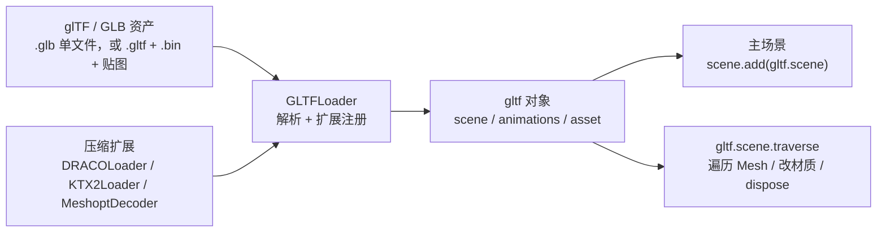

import { Canvas, Controls, Meta } from '@storybook/addon-docs/blocks';
import * as GLTFStories from './gltf-and-gltfloader.stories.js';

<Meta of={GLTFStories} name="Docs" />

# 模型

`GLTFLoader` 把一份 glTF / GLB 资产解析成 three.js 的对象图：`gltf.scene` 是可以直接 `scene.add` 的根 `Object3D`，`gltf.animations` 是预烘焙的 `AnimationClip[]`，`gltf.asset` 携带版本和生成器元信息。能否成功接入主场景，由路径解析、外部依赖文件和压缩扩展共同决定；卸载时还要主动 `dispose` 几何、材质和纹理，否则显存不会随 `scene.remove` 一起回收。



glTF 资源一律使用 PBR 材质（`MeshStandardMaterial`），完整的环境贴图和 color management 留给 [PBR](?path=/docs/pbr-and-environment-maps--docs)；本课只关注怎样把模型加载进来、解析对了、卸载干净。

## 快速上手

最小闭环：拿到一个 GLB 的 URL，`loadAsync` 解析后把 `gltf.scene` 挂进主场景。

```js
import { GLTFLoader } from 'three/addons/loaders/GLTFLoader.js';

const loader = new GLTFLoader();
const gltf = await loader.loadAsync('/models/sample.glb');

// gltf.scene 是根 Object3D，直接挂进主场景就能渲染。
scene.add(gltf.scene);
```

`loadAsync` 是真实异步——返回 `Promise`，解析完成前不要去读 `gltf.scene` 的属性。下面的实例在浏览器里跑完整的 `GLTFLoader.loadAsync` 闭环，模型由 `GLTFExporter` 在内存里导出成 GLB blob URL，不依赖外部网络；切换"加载源"可以触发 404 和解码失败两条错误路径。

<Canvas of={GLTFStories.GLTFLoading} />

<Controls of={GLTFStories.GLTFLoading} />

| 输入或状态 | 默认值 / 常用起点 | 改变后要注意什么 |
| --- | --- | --- |
| `url` | 模型文件路径 | `.glb` 自包含；`.gltf` 通常还引用 `.bin` 和贴图，移动时整组一起搬 |
| `loader.loadAsync(url)` | 返回 `Promise<gltf>` | 异步解析；调用后立刻读 `gltf.scene` 会得到 `undefined` |
| `gltf.scene` | 根 `Object3D`，多数是 `Group` | 直接 `scene.add` 会共享子节点引用；卸载前要 `dispose`（见内存与销毁） |
| `gltf.animations` | `AnimationClip[]`，静态模型为空数组 | 播放需要 `AnimationMixer`，留给 [动画](?path=/docs/gltf-animation-mixer--docs) 课 |
| 材质 | glTF 一律用 PBR | 没有环境光或环境贴图时会偏暗；正式项目用环境贴图，调试期可用 `HemisphereLight` + `DirectionalLight` |
| 压缩扩展 | 默认不挂 | 模型用了 DRACO / KTX2 / Meshopt 时必须先装上对应解码器 |

## 加载结果的结构

`loadAsync` 解析成功后返回的 `gltf` 对象不只包含场景图：

| 字段 | 类型 | 用途 |
| --- | --- | --- |
| `scene` | `Object3D` | 默认场景的根节点，通常是 `Group`；直接 `scene.add(gltf.scene)` 即可 |
| `scenes` | `Object3D[]` | 文件里所有场景；按 glTF 的 `scene` 字段选择默认场景 |
| `animations` | `AnimationClip[]` | 内置动画剪辑，空数组表示无动画 |
| `asset` | `Object` | glTF 资产元信息，`asset.version` 一定是 `'2.0'` |
| `parser` | `GLTFParser` | 解析上下文；可调用 `parser.getDependency('node', i)` 按需取节点 |
| `userData` | 自定义 | glTF 的 `extras` 字段会落到对应节点的 `userData` |

挂进主场景前，glTF 模型常需要两类修正：模型不一定以原点为中心，加载后先用 `Box3.setFromObject` 算一次世界包围盒再平移到地面之上；不同导出器使用的单位差异较大，必要时整体 `scale.setScalar(factor)` 统一尺度。

```js
const box = new THREE.Box3().setFromObject(gltf.scene);
const center = box.getCenter(new THREE.Vector3());
gltf.scene.position.x -= center.x;
gltf.scene.position.z -= center.z;
gltf.scene.position.y -= box.min.y; // 底面贴到 y=0
```

`gltf.scene.traverse(callback)` 按深度优先访问整棵子树，回调里常见判断是 `child.isMesh`、`child.isCamera`、`child.isLight`（后者需要 `KHR_lights_punctual` 扩展）。下面的实例遍历加载好的模型，把每个节点的名字和类型显示成读数；切换"操作"为释放计数，可以观察一次 `traverse` 收集到多少 geometry / material / texture。

<Canvas of={GLTFStories.TraverseAndDispose} />

<Controls of={GLTFStories.TraverseAndDispose} />

## 路径与依赖资源

glTF 资源有两种打包形态，路径策略不同：

| 形态 | 文件组成 | 路径策略 |
| --- | --- | --- |
| `.glb` | 单一二进制文件 | 一个 URL 即可，移动和部署最简单 |
| `.gltf` | JSON + 外部 `.bin` + 外部贴图 | 依赖文件必须和 JSON 里写的相对路径对得上 |

`GLTFLoader` 解析 `.gltf` 时，依赖文件的 URL 默认按"JSON 自身 URL 所在目录"拼接。模型文件换了位置但内部相对路径没改时，用 `setPath` 或 `resourcePath` 显式指定依赖文件所在目录：

```js
// 方法一：setPath 设置主 URL 的目录前缀，loadAsync 传入相对文件名
loader.setPath('/assets/models/sample/');
const gltf = await loader.loadAsync('sample.gltf');

// 方法二：resourcePath 单独覆盖依赖文件解析时使用的基目录，与主 URL 解耦
loader.resourcePath = '/assets/models/sample/textures/';
```

`setPath` 影响主 URL 自身；`resourcePath` 单独覆盖依赖文件（`.bin`、贴图）解析时使用的基目录。两者都为空时，loader 用 URL 自身的目录。生产部署的常见做法：把整个模型目录原样放到静态服务器，URL 直接指向 `.gltf`，让默认相对路径生效。

## 压缩扩展

模型文件常被进一步压缩以减小体积，三种主流扩展各自需要先给 `GLTFLoader` 装上解码器：

| 扩展 | 压缩对象 | 配套组件 | 必须的设置 |
| --- | --- | --- | --- |
| `KHR_draco_mesh_compression` | 几何顶点数据 | `DRACOLoader` | `setDecoderPath` 指向解码器目录；`loader.setDRACOLoader(dracoLoader)` 注入 |
| `KHR_texture_basisu` | 纹理 | `KTX2Loader` | `setDecoderPath` 指向 basis 解码器；`loader.setKTX2Loader(ktx2Loader)`；通常还要 `ktx2Loader.detectSupport(renderer)` |
| `EXT_meshopt_compression` | 几何与动画 | `MeshoptDecoder` | `loader.setMeshoptDecoder(MeshoptDecoder)`，无需独立解码路径 |

```js
import { GLTFLoader } from 'three/addons/loaders/GLTFLoader.js';
import { DRACOLoader } from 'three/addons/loaders/DRACOLoader.js';
import { KTX2Loader } from 'three/addons/loaders/KTX2Loader.js';
import { MeshoptDecoder } from 'three/addons/libs/meshopt_decoder.module.js';

const draco = new DRACOLoader().setDecoderPath('/decoders/draco/');
const ktx2 = new KTX2Loader().setDecoderPath('/decoders/basis/');
ktx2.detectSupport(renderer);

const loader = new GLTFLoader();
loader.setDRACOLoader(draco);
loader.setKTX2Loader(ktx2);
loader.setMeshoptDecoder(MeshoptDecoder);
```

解码器是 WASM 文件，部署时把 `node_modules/three/examples/jsm/libs/draco/`、`libs/basis/` 和 `libs/meshopt_decoder.module.js` 复制到静态目录即可。三个扩展彼此独立：模型没用 DRACO 就不必挂 `DRACOLoader`，但提前挂上也不会拖慢普通模型加载——loader 只在解析到对应扩展时才调用解码器。

## 加载错误处理

`loadAsync` 失败时 `reject`，`load` 通过第四个参数 `onError` 回调；二者覆盖的失败路径相同——网络错误、HTTP 错误、解析错误和扩展缺失。

```js
// 写法一：async/await + try/catch
try {
  const gltf = await loader.loadAsync(url);
  scene.add(gltf.scene);
} catch (err) {
  console.error('glTF 加载失败：', err);
}

// 写法二：回调四件套
loader.load(
  url,
  (gltf) => scene.add(gltf.scene),
  (event) => console.log(`进度：${event.loaded}/${event.total}`),
  (err) => console.error('glTF 加载失败：', err)
);
```

常见失败原因和判断线索：

| 错误信息特征 | 可能原因 | 处理方向 |
| --- | --- | --- |
| HTTP 404 / 403 | URL 错误或权限不足 | 核对部署路径与 `setPath` / `resourcePath` |
| `Unsupported glTF-Binary header` / `JSON content not found` | 文件不是合法 glTF，或把 HTML 错误页当成了模型 | 直接打开 URL 看返回内容；确认服务器返回正确的 MIME |
| `Unsupported asset. glTF versions >= 2.0` | 文件不是 glTF 2.0 | 用支持 glTF 2.0 的导出器重新导出 |
| `No DRACOLoader instance provided.` | 模型用了 DRACO 但没装解码器 | 创建 `DRACOLoader`、`setDecoderPath` 并 `setDRACOLoader` |
| `setKTX2Loader must be called` / `setMeshoptDecoder must be called` | 模型含 KTX2 纹理或 Meshopt 压缩 | 按压缩扩展表挂上对应组件 |
| 加载完成但模型看不见 | 包围盒不在视锥里、单位过大或过小、缺少光照 | 打印 `Box3` 与相机位置，先加环境光再排查 |

切换上方加载 Canvas 的"加载源"为 404 或损坏字节，可以在读数里看到 `loadAsync` 抛出的错误类型；正确路径下错误字段为 `—`。

## 内存与销毁

`scene.remove(gltf.scene)` 只把节点从场景树里摘掉，GPU 上传的 geometry、material 和 texture 仍然保留。完整释放需要在卸载前遍历整棵子树调用 `dispose`：

```js
function disposeModel(root) {
  const geometries = new Set();
  const materials = new Set();
  const textures = new Set();

  root.traverse((child) => {
    if (child.geometry) {
      geometries.add(child.geometry);
    }

    const material = child.material;
    if (Array.isArray(material)) {
      material.forEach((entry) => materials.add(entry));
    } else if (material) {
      materials.add(material);
    }
  });

  // 材质上的纹理不会随 material.dispose() 自动释放，需要单独收集。
  materials.forEach((material) => {
    for (const value of Object.values(material)) {
      if (value && value.isTexture) {
        textures.add(value);
      }
    }
    material.dispose();
  });

  geometries.forEach((geometry) => geometry.dispose());
  textures.forEach((texture) => texture.dispose());
}
```

用 `Set` 去重：同一份几何或材质被多个 Mesh 共享时只释放一次。把仍在使用的共享资源提前 `dispose`，会让其它对象出现纹理丢失或几何不可见——确认所有权后再释放，必要时为共享资源单独维护引用计数。完整性能与 dispose 策略留给 [性能](?path=/docs/performance-and-disposal--docs) 课。

切换上方遍历 Canvas 的"操作"为释放计数，可以观察一次完整 `dispose` 释放了多少资源；释放后模型从场景里消失，切回节点列表会自动重新加载一份。

## 最佳实践

- 部署 glTF 时优先用 `.glb` 单文件；多文件 `.gltf` 移动时整组一起搬，避免相对路径断链。
- 提前确认模型使用了哪些压缩扩展，在创建 loader 时就装好对应解码器，避免运行时才发现 `No DRACOLoader instance provided` 之类错误。
- `await loader.loadAsync(url)` 之后立刻包一层 `try/catch`，至少覆盖 404、解析失败和扩展缺失三类错误。
- 加载后用 `Box3.setFromObject` 检查模型大小和位置，必要时缩放、平移到可观察范围再渲染。
- glTF 用 PBR 材质，需要环境光或环境贴图才有合理明暗；调试期可先用 `HemisphereLight` + `DirectionalLight`。
- 卸载模型时按 geometry / material / texture 三类 `dispose`，并用 `Set` 去重共享资源。

## 常见问题

- 为什么模型加载成功却完全看不见？
  先 `Box3.setFromObject(gltf.scene)` 打印 `size` 和 `center`，确认模型是否过大、过远或不在相机视锥里；再检查场景是否有环境光或方向光。
- 为什么 `.gltf` 模型的纹理变成 404？
  `.gltf` 内部以相对路径引用 `.bin` 和贴图；移动文件时整组一起搬，或用 `setPath` / `resourcePath` 显式指定依赖目录。
- 为什么报 `No DRACOLoader instance provided.`？
  模型用了 DRACO 压缩。先 `new DRACOLoader().setDecoderPath('/decoders/draco/')`，再 `loader.setDRACOLoader(dracoLoader)`；解码器 WASM 文件来自 `node_modules/three/examples/jsm/libs/draco/`。
- 为什么 KTX2 纹理加载失败或显示异常？
  没挂 `KTX2Loader`，或忘了 `detectSupport(renderer)`；按压缩扩展表配置，并确认解码器路径可达。`detectSupport` 必须在加载模型前调用。
- 为什么同一个模型在桌面正常、在移动端崩？
  移动端对 KTX2 转码格式的支持不同；`KTX2Loader.detectSupport(renderer)` 会按 renderer 能力选转码格式，调用前不要解析模型。
- 为什么 `scene.remove(gltf.scene)` 之后显存没下降？
  `remove` 只断开场景树，GPU 资源仍保留；按"内存与销毁"遍历 `dispose` geometry / material / texture。
- 为什么模型表面颜色偏暗或发灰？
  glTF 用 PBR 材质，缺少环境光或环境贴图时会偏暗；先加 `HemisphereLight` + `DirectionalLight`，正式项目用环境贴图（见 [PBR](?path=/docs/pbr-and-environment-maps--docs)）。
- 为什么手工替换 glTF 模型上的 `material.map` 后颜色或方向不对？
  `GLTFLoader` 会按 glTF 语义设置纹理的 `colorSpace` 与 `flipY`；新纹理要自己设 `SRGBColorSpace`，通常也要把 `flipY` 设为 `false`，详见 [纹理](?path=/docs/textures-and-maps--docs)。

## 总结回顾

摘要：

glTF 资产通过 `GLTFLoader` 解析成 three.js 对象图：`gltf.scene` 是可直接挂载的根节点，`gltf.animations` 留给动画系统，`gltf.scene.traverse` 用来访问每一个 Mesh。`.glb` 自包含，`.gltf` 依赖外部文件，路径解析由 URL 目录、`setPath` 和 `resourcePath` 决定。DRACO、KTX2 和 Meshopt 三种压缩扩展各自需要配套解码器，缺失会直接报错。`loadAsync` 失败时 `reject`，覆盖网络、解析和扩展三类错误；卸载时按 geometry / material / texture 三类 `dispose` 才能真正回收显存。

一句话：

> `gltf.scene` 是结果，路径、压缩扩展和 `dispose` 决定它能否可靠接入和干净卸载。

知识要点：

- `gltf.scene`、`animations`、`asset` 分别承载什么？挂进主场景前要做哪些修正？
- `.glb` 和 `.gltf + 依赖文件` 在路径策略上有什么差别？`setPath` 和 `resourcePath` 各管什么？
- DRACO、KTX2、Meshopt 三种压缩扩展分别需要什么配套组件？缺少时会出现什么错误？
- 怎样从 `loadAsync` 抛出的错误信息区分 404、解析失败和扩展缺失？
- `scene.remove` 之后为什么显存不下降？完整释放要 `dispose` 哪几类资源？

## 参考资料

- [Three.js Manual：Loading a 3D model](https://threejs.org/manual/en/load-gltf.html)
- [Three.js Docs：GLTFLoader](https://threejs.org/docs/pages/examples/loaders/GLTFLoader.html)
- [Three.js Docs：DRACOLoader](https://threejs.org/docs/pages/examples/loaders/DRACOLoader.html)
- [Three.js Docs：KTX2Loader](https://threejs.org/docs/pages/examples/loaders/KTX2Loader.html)
- [Three.js Examples：webgl_loader_gltf](https://threejs.org/examples/#webgl_loader_gltf)
- [glTF 2.0 Specification](https://registry.khronos.org/glTF/specs/2.0/glTF-2.0.html)
- [glTF Extensions Registry](https://github.com/KhronosGroup/glTF/tree/main/extensions)
