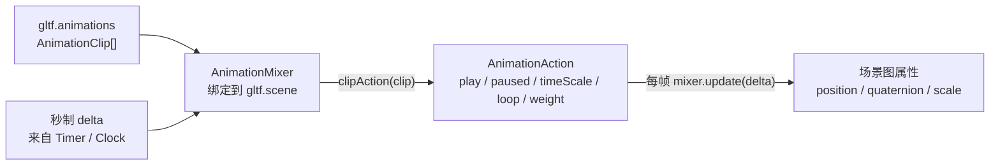

import { Canvas, Controls, Meta } from '@storybook/addon-docs/blocks';
import * as AnimationStories from './gltf-animation-mixer.stories.js';

<Meta of={AnimationStories} name="Docs" />

# 动画

`AnimationMixer` 把"动画数据"和"播放控制"拆成三层，让一段烘焙好的关键帧能按你的意图回放到场景图上：

- **AnimationClip** 是一段动画数据：一个 `tracks` 数组，每条 `KeyframeTrack` 描述"某个节点的某个属性随时间怎么变"。`GLTFLoader` 加载带动画的 glTF 时，`gltf.animations` 就是 `AnimationClip[]`。
- **AnimationAction** 是一段 clip 的播放句柄：`mixer.clipAction(clip)` 拿到一个 action，再用 `play()` / `stop()` / `paused` / `timeScale` / `loop` / `weight` 控制它怎么播。同一 clip 复用同一个 action。
- **AnimationMixer** 是驱动引擎：每帧调用 `mixer.update(deltaSeconds)`，mixer 把所有"正在播"的 action 的关键帧插值结果累加并写回场景图对象的 `position` / `quaternion` / `scale` 等属性。



三条独立控制维度分别决定不同结果：**mixer 一个**——一棵对象图（一个 glTF 模型根）只要一个 mixer；**action 多个**——同图的每个 clip 各对应一个 action，参数独立；**时间一条**——所有 action 共享 `mixer.update(delta)` 推进的全局时钟，delta 必须是秒，来源见 [时间](?path=/docs/clock-and-animation-loop--docs) 课。

## 快速上手

最小闭环：加载一个带动画的 GLB → 用 `gltf.scene` 建 mixer → 拿一个 action 并 `play()` → 在每帧的渲染循环里 `mixer.update(delta)`。

```js
import * as THREE from 'three';
import { GLTFLoader } from 'three/addons/loaders/GLTFLoader.js';

const loader = new GLTFLoader();
const gltf = await loader.loadAsync('/models/robot.glb');
scene.add(gltf.scene);

// 一个 mixer 管理整棵对象图；clipAction 把 clip 包装成可播放的 action。
const mixer = new THREE.AnimationMixer(gltf.scene);
const idleAction = mixer.clipAction(gltf.animations[0]);
idleAction.play();

renderer.setAnimationLoop((time) => {
  timer.update(time);
  const delta = timer.getDelta();

  // delta 必须是秒；AnimationMixer 内部所有时间都是秒。
  mixer.update(delta);

  renderer.render(scene, camera);
});
```

| 输入或状态 | 默认值 / 常用起点 | 改变后要注意什么 |
| --- | --- | --- |
| `new AnimationMixer(root)` | root 是要播放动画的 `Object3D`，通常是 `gltf.scene` | 一个 mixer 只管一棵对象图；多个模型各建各的 mixer |
| `mixer.clipAction(clip)` | 同一 clip 返回同一 action（带缓存） | 想要"同 clip 多份独立播放"用 `clipAction(clip, root)` 指定不同 localRoot |
| `action.play()` | 把 action 加入 mixer 的激活列表 | 只 `play()` 不够，必须每帧 `mixer.update(delta)` 才会推进 |
| `mixer.update(delta)` | delta 单位是**秒** | 传毫秒会让动画快 1000 倍；首帧或恢复后异常大 delta 要 clamp |
| `gltf.animations` | `AnimationClip[]`，静态模型是空数组 | 空数组时 `clipAction` 无从建 action；先确认 `length > 0` |
| `action.loop` | `THREE.LoopRepeat` | 改成 `LoopOnce` 时通常要配 `clampWhenFinished = true` 停在末帧 |
| `action.timeScale` | `1` | `0` 冻结、`-1` 倒放、`2` 快放；负值需要 clip 的关键帧允许反向插值 |

下面的实例在浏览器里跑完整的"导出带动画的 GLB → `GLTFLoader` 加载 → `AnimationMixer` 播放"闭环，模型与 clip 都在内存里构造，不依赖外部网络。控件映射到 `AnimationAction` 的核心参数。

<Canvas of={AnimationStories.PlaybackControl} />

<Controls of={AnimationStories.PlaybackControl} />

切换 clip 时实例会 `stop()` 旧 action 再 `play()` 新 action；`LoopOnce` 播完后状态读数变成 `finished`，再切回 `playing` 会 `reset()` 重播。实例进入视口前 200 px 时启动渲染循环，离开后停止并保留最后一帧，重新进入时从当前 `action.time` 继续推进。

## AnimationClip 与轨道

`AnimationClip` 是一段与播放控制无关的**纯数据**：`duration`（秒）加一个 `tracks` 数组。每条 `KeyframeTrack` 由三部分确定：轨道名、时间数组、值数组。轨道名解析由 `PropertyBinding` 负责，格式是 `<节点名>.<属性名>`：

```js
// 来自 gltf.animations[0] 的一段 clip：
clip.duration;   // 1.6（秒）
clip.tracks.length;
clip.tracks[0].name;        // 'ArmR.quaternion'
clip.tracks[0].times;       // Float32Array [0, 0.4, 0.8, 1.2, 1.6]
clip.tracks[0].values;      // 四元数序列，每 4 个数一组
clip.tracks[0].ValueTypeName; // 'quaternion'
```

glTF 只允许动画作用在 `translation` / `rotation` / `scale` / `weights`（morph）上，加载后对应到 three.js 的轨道类型：

| glTF 路径 | three.js 属性 | 轨道类型 | 每个关键帧的值 |
| --- | --- | --- | --- |
| `translation` | `position` | `VectorKeyframeTrack` | 3 个数 `[x, y, z]` |
| `rotation` | `quaternion` | `QuaternionKeyframeTrack` | 4 个数 `[x, y, z, w]`，球面插值（slerp） |
| `scale` | `scale` | `VectorKeyframeTrack` | 3 个数 `[x, y, z]` |
| `weights` | `morphTargetInfluences` | `NumberKeyframeTrack` | 每个目标权重一个数 |

轨道名里的节点名是 `PropertyBinding` 在 mixer 根下**递归按名查找**的结果，不要求节点是 mixer 根的直接子级；`Body.quaternion` 会找到任意深度的 `Body` 节点。`GLTFLoader` 加载时已经把节点名写回 `object.name`，所以 `gltf.animations` 里的轨道名能直接解析到 `gltf.scene` 下的对象。

`AnimationClip.findByName(clips, name)` 按名查找 clip；自己合成 clip 用 `AnimationClip.CreateFromMorphTargetSequence` 或直接 `new THREE.AnimationClip(name, duration, tracks)`。`AnimationUtils.makeClipAdditive(clip)` 可以把一段 clip 转成加法形态，配合 `clip.blendMode = THREE.AdditiveAnimationBlendMode` 做叠加混合（见多动画混合）。

## AnimationAction：play、stop、reset 与 paused

`AnimationAction` 是你日常调参的对象。`play()` 把 action 加入 mixer 的激活列表，`stop()` 把它移出并 `reset()`，`reset()` 把时间、状态归零但保持激活——这三个是生命周期，`paused` 和 `enabled` 是运行时开关：

```js
const action = mixer.clipAction(clip);

action.play();         // 激活并开始播放
action.paused = true;  // 暂停：保留 action.time，不归零
action.paused = false; // 从当前时间继续
action.reset();        // time 归零、清掉 finished 状态，不影响激活
action.stop();         // 移出激活列表并 reset
```

| 成员 | 含义 | 与相邻成员的差别 |
| --- | --- | --- |
| `play()` | 激活 action，开始推进时间 | 已激活再调是幂等的 |
| `stop()` | 取消激活并 `reset()` | 与 `paused = true` 不同：stop 后 action 不再写入属性 |
| `reset()` | time 归零、paused 置 false、enabled 置 true | 不改变激活状态；要让单次动画从头再播就 reset 后 play |
| `paused` | `true` 时 mixer 不推进本 action 的 `time` | 仍处于激活状态，最后一帧的属性值继续生效 |
| `enabled` | `false` 时 action 完全不参与混合 | 与 `paused` 不同：禁用后属性恢复到 rest 姿态 |
| `time` | action 内部时间（秒），范围受 loop 模式影响 | 可手动设置跳到某一刻；loop 模式决定超出 duration 后是回绕、停止还是反向 |
| `weight` | 在混合里的影响力，范围 `[0, 1]` | 见多动画混合 |

`stop()` 与 `paused = true` 的差别是常见坑：暂停时模型保持暂停瞬间的姿势（action 仍激活、属性仍写入）；`stop()` 之后 action 被移出激活列表，模型回到其它激活 action 或 rest 决定的姿态。要"暂停后能从原位置继续"用 `paused`，要"完全卸载这段动画"用 `stop()`。

## timeScale、loop 与单次播放

`timeScale` 直接缩放本 action 的推进速度，与全局 `mixer.timeScale` 是乘法关系：

```js
action.timeScale = 1;   // 正常
action.timeScale = 0;   // 冻结（time 不再推进）
action.timeScale = -1;  // 倒放
action.timeScale = 2;   // 快放
action.setEffectiveTimeScale(0.5); // 考虑 warping 后的"有效"timeScale
```

`loop` 决定 `time` 超出 `[0, duration]` 后怎么办。用 `setLoop(mode, repetitions)` 一次设两个参数，因为某些组合（`LoopOnce` + 多次）本身无意义：

| 模式 | 行为 | `repetitions` | 典型用法 |
| --- | --- | --- | --- |
| `THREE.LoopRepeat`（默认） | 正向循环，到末尾回到开头 | `Infinity` 或指定次数 | Idle、Walk 等循环动画 |
| `THREE.LoopPingPong` | 到末尾后反向播，再到开头反向，来回 | 同上 | 摆动、来回机构 |
| `THREE.LoopOnce` | 播一遍就停 | 忽略 | 开门、攻击等一次性动画 |

`LoopOnce` 有两种结束姿态，由 `clampWhenFinished` 决定：

- `clampWhenFinished = true`（推荐）：到末帧后 action 自动 `paused = true`，模型**停在最后一帧**；mixer 派发 `'finished'` 事件。
- `clampWhenFinished = false`（默认）：到末帧后 action 自动 `enabled = false`，模型**回到 rest 姿态**；同样派发 `'finished'`。

要监听循环边界或结束，在 mixer 上挂事件（不是 action）：

```js
mixer.addEventListener('loop', (event) => {
  // event.action / event.type
});
mixer.addEventListener('finished', (event) => {
  // LoopOnce 结束时触发；event.action 是结束的 action
});
```

回到上方播放控制实例：把 loop 切到 `LoopOnce`，再开关 `clampWhenFinished`，能直接看到模型"停在末帧"与"回到 rest"的差别；把 `timeScale` 调成 `-1` 能看到倒放（前提是当前 clip 的关键帧允许反向插值，绝大多数 glTF 动画都允许）。

## 多动画混合：weight 与 crossfade

当多个 action 同时激活、且它们作用在同一属性上时，mixer 按各自的 `weight` 做加权平均；作用在不同属性上时则各写各的、互不干扰。直接调 `weight` 是最基础的混合方式：

```js
const idle = mixer.clipAction(idleClip).play();
const wave = mixer.clipAction(waveClip).play();
wave.setEffectiveWeight(0); // 开始时 Wave 不参与

// 手动渐变：每帧把 wave 的权重抬高、idle 的权重压低。
wave.setEffectiveWeight(t);
idle.setEffectiveWeight(1 - t);
```

`setEffectiveWeight(w)` 与直接写 `action.weight = w` 在普通混合模式下等价；它存在是因为 action 内部还有"warping"（时间缩放插值）会乘进有效权重，需要 `getEffectiveWeight()` 查实际生效值。

要做一段时长的平滑过渡，用 `crossFadeFrom` / `crossFadeTo`，它内部就是一个按时间插值两个 action 权重的调度：

```js
// 从 idle 在 0.4 秒内渐变到 wave；第三参数 warp=true 时同时插值 timeScale，
// 适合"走 → 跑"这种动作时长不同的切换；普通切换保持 false。
wave.crossFadeFrom(idle, 0.4, false);
```

加法混合（`AdditiveAnimationBlendMode`）走另一条路：基类动画正常播放，叠加层只贡献"差值"。例如 Idle 循环做基底，Wave 作为加法层叠加，就能一边呼吸一边挥手。把 clip 标记为加法用 `AnimationUtils.makeClipAdditive(clip)`，再用 `mixer.clipAction(additiveClip)` 拿到的 action 默认就是 `blendMode = AdditiveAnimationBlendMode`。

下面的实例让 Idle 与 Wave 同时 `play()`，用 blend 滑块在两个 action 的 `effectiveWeight` 之间线性分配；两个 clip 作用的属性互不重叠（Idle 改身体与头部旋转，Wave 改右臂旋转），所以混合时各自按权重缩放、不会互相覆盖。把它当作手动 crossfade 的可视版本。

<Canvas of={AnimationStories.WeightBlend} />

<Controls of={AnimationStories.WeightBlend} />

## mixer.update 与帧循环

`mixer.update(deltaSeconds)` 是 mixer 唯一的推进入口。它在内部把全局时间前进 `delta`，更新所有激活 action 的 `time`，再把插值结果写入属性绑定。三件事必须在每帧的渲染循环里完成：

```js
renderer.setAnimationLoop((time) => {
  timer.update(time);
  const delta = Math.min(timer.getDelta(), 0.1); // 防御性 clamp

  mixer.update(delta);     // 推进所有 action
  renderer.render(scene, camera);
});
```

关键约束：

- **delta 必须是秒。** `Timer.getDelta()` 返回秒；若用 `setAnimationLoop` 的毫秒时间戳手动相减，记得除以 `1000`，否则动画会快 1000 倍。
- **首帧和恢复后要 clamp。** 从后台切回或暂停恢复时第一帧 delta 可能很大，会让动画一次性跳过一大段。`Timer` 在恢复时把基准清零（第一帧 delta = 0），额外再 `Math.min(delta, 0.1)` 兜底。
- **一个 mixer 只推进它自己。** 多个模型的 mixer 各自调 `update(delta)`，共享同一个 delta 来源。
- **`mixer.timeScale` 是全局慢放。** 设成 `0.2` 会让这个 mixer 下所有 action 一起慢放，不影响别的 mixer；与 `action.timeScale` 是乘法关系。
- **卸载时 `stopAllAction()` 并解除引用。** `mixer.stopAllAction()` 把所有 action 移出激活列表；模型本身还要按 [模型](?path=/docs/gltf-and-gltfloader--docs) 课的内存与销毁释放 geometry / material / texture。mixer 没有 `dispose()`，停掉所有 action、解除对 root 的引用即可。
- **`mixer.stats.actions`** 给出 `total`（缓存过的 action 总数）和 `inUse`（当前激活数），调试"动画为什么没停下"时常用。

## 最佳实践

- 一个模型一个 `AnimationMixer`，建在 `gltf.scene` 上；同图的 clip 共享这个 mixer，用 `clipAction(clip)` 拿各自的 action。
- delta 统一从 [时间](?path=/docs/clock-and-animation-loop--docs) 课推荐的 `Timer.getDelta()` 来，并 `Math.min(delta, 0.1)` 兜底大跳变。
- 要"暂停后从原位置继续"用 `action.paused = true`；要"完全卸载动画"用 `action.stop()`；要让单次动画从头再播用 `reset().play()`。
- 一次性动画用 `LoopOnce` + `clampWhenFinished = true`，并在 `'finished'` 事件里决定下一步（切别的 clip、或保持末帧）。
- 平滑切换用 `crossFadeFrom` / `crossFadeTo`，普通切换传 `warp = false`；只有当两段动画时长差异大、需要同步 timeScale 时才开 `warp = true`。
- 需要基底动画 + 局部叠加（边走边挥手）时，把叠加层 clip 用 `AnimationUtils.makeClipAdditive` 转成加法形态，再用 `AdditiveAnimationBlendMode` 的 action 播放。
- 卸载模型前 `mixer.stopAllAction()`，再按 geometry / material / texture 三类 dispose（见 [模型](?path=/docs/gltf-and-gltfloader--docs) 课）。

## 常见问题

- 调了 `action.play()` 之后模型完全不动？
  检查每帧是否调了 `mixer.update(delta)`，且 delta 是秒；`Timer` 要先 `update(time)` 再 `getDelta()`。
- 动画速度比预期快了 1000 倍？
  把毫秒当成了秒。`setAnimationLoop` 的时间戳是毫秒，手动相减要除以 `1000`，或交给 `Timer.getDelta()`。
- 从后台切回来模型突然抽搐一下？
  恢复循环时第一帧 delta 太大；用 `Timer` 并 `Math.min(delta, 0.1)` clamp，或调 `timer.reset()` 重置基准。
- `LoopOnce` 播完之后模型"弹回"了 rest 姿态？
  `clampWhenFinished` 没设或设成了 `false`；改成 `true` 让它停在最后一帧。
- `action.paused = true` 之后模型姿势变了？
  `paused` 只是停止推进时间，action 仍处于激活状态、属性仍写入；若同时还有别的激活 action 作用在同一属性上，就会互相覆盖。要彻底卸载用 `stop()`。
- `crossFadeFrom` 之后两个动画都还在播？
  `crossFadeFrom` 只插值权重，不会自动 `stop()` 淡出的 action；过渡结束后淡出 action 的权重为 0 但仍激活。若要彻底卸载，在 `'finished'` 之类时机显式 `stop()`。
- 同一段 clip 想让两个对象同时各播一份怎么办？
  默认 `clipAction(clip)` 会复用同一 action；要独立播放用 `mixer.clipAction(clip, otherRoot)` 指定不同的 localRoot，或为另一个对象单独建 mixer。
- `gltf.animations` 是空数组？
  模型本身没有内置动画。先用 `GLTFLoader` 确认 `gltf.animations.length`；需要时在 Blender 等工具里给模型导出动画轨道（translation / rotation / scale / morph）。

## 总结回顾

摘要：

three.js 的动画系统分三层：`AnimationClip` 是纯数据（`tracks` 数组，每条轨道描述某节点的某属性随时间的变化），`AnimationAction` 是 clip 的播放句柄（`play` / `stop` / `paused` / `timeScale` / `loop` / `weight`），`AnimationMixer` 是驱动引擎（每帧 `update(deltaSeconds)` 把激活 action 的插值结果写回场景图）。`GLTFLoader` 把 glTF 内置动画解析成 `gltf.animations`，建一个绑定到 `gltf.scene` 的 mixer，对每个 clip 调 `clipAction(clip)` 拿 action。`LoopRepeat` / `LoopPingPong` / `LoopOnce`（配 `clampWhenFinished`）覆盖循环、来回、一次性三类播放；多动画按 `weight` 加权混合，`crossFadeFrom` / `crossFadeTo` 把权重渐变调度好。delta 必须是秒、首帧和恢复后要 clamp，多模型各建各的 mixer，卸载时 `stopAllAction()` 后再释放资源。

一句话：

> AnimationMixer 把 clip 数据变成场景图上每帧的属性写入；用秒制 delta 喂它，用 action 控制每段动画怎么播、怎么混。

知识要点：

- `AnimationClip`、`AnimationAction`、`AnimationMixer` 各自承担什么？为什么不能只靠 clip 播放动画？
- 为什么 `mixer.update(delta)` 的 delta 必须是秒？传毫秒会发生什么？
- `action.stop()` 和 `action.paused = true` 在场景图上的可见差别是什么？
- `LoopOnce` 配 `clampWhenFinished` 的 true / false 各自让模型停在哪里？
- 两个 action 同时激活、作用在同一属性上时，mixer 怎么决定最终值？作用在不同属性上呢？
- `crossFadeFrom` 内部改的是哪个属性？为什么过渡结束后淡出的 action 仍处于激活状态？
- 一个 glTF 模型需要几个 mixer？多个模型需要几个？

## 参考资料

- [Three.js Manual：Animation System](https://threejs.org/manual/en/animation-system.html)
- [Three.js Docs：AnimationMixer](https://threejs.org/docs/pages/animation/AnimationMixer.html)
- [Three.js Docs：AnimationClip](https://threejs.org/docs/pages/animation/AnimationClip.html)
- [Three.js Docs：AnimationAction](https://threejs.org/docs/pages/animation/AnimationAction.html)
- [Three.js Docs：KeyframeTrack](https://threejs.org/docs/pages/animation/KeyframeTrack.html)
- [Three.js Examples：webgl_animation_keyframes](https://threejs.org/examples/#webgl_animation_keyframes)
- [Three.js Manual：Loading a 3D model](https://threejs.org/manual/en/load-gltf.html)
