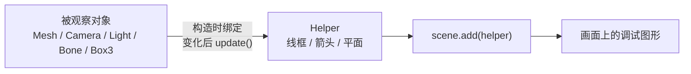

import { Canvas, Controls, Meta } from '@storybook/addon-docs/blocks';
import * as HelperStories from './helpers-and-debug-objects.stories.js';

<Meta of={HelperStories} name="Docs" />

# Helper

Helper 是挂进场景的**调试用 Object3D**（多数是线框 `LineSegments`）：把坐标轴、网格、包围盒、视锥、灯光形状、骨骼等平时看不见的状态画出来。它们继承 Object3D，可以 `add` 到 `scene` 或某个对象下，参与层级变换；但用途是观察，不是正式场景内容。

多数 Helper 只在构造时读一次被观察对象。之后改了相机投影、灯光方向、包围对象变换，或 `SpotLight.target`，需要再调用 `helper.update()`，否则线框会停在旧状态。不用时设 `visible = false`，或 `remove` 后调用 `dispose()` 释放几何与材质。生产构建应关掉调试 Helper，完整调试习惯见 [调试](?path=/docs/debug-gui-and-stats--docs)。



| 成员 / 约定 | 默认 / 常用 | 回查要点 |
| --- | --- | --- |
| 挂载 | `scene.add(helper)` | 必须进场景树才看得见；`CameraHelper` 文档要求挂在 scene |
| `update()` | 视类型 | `BoxHelper`、`CameraHelper`、光源 Helper 等在目标变化后需要 |
| `dispose()` | 无自动调用 | 释放 geometry / material；页面卸载或关掉调试时调用 |
| `matrixAutoUpdate` | 部分为 `false` | 许多 Helper 用被观察对象的 `matrixWorld`，勿随意改乱 |
| 颜色 | 各构造参数 | 光源 Helper 未传 `color` 时常跟随灯光颜色 |
| 生产环境 | 关闭 | `visible=false` 或条件创建，避免进正式画面 |

## 快速上手

给场景加坐标轴和地面网格，再用 `BoxHelper` 跟踪一个 Mesh；物体转动时每帧 `update()`：

```js
scene.add(new THREE.AxesHelper(2));
scene.add(new THREE.GridHelper(10, 10));

const mesh = new THREE.Mesh(geometry, material);
scene.add(mesh);

const boxHelper = new THREE.BoxHelper(mesh, 0xffff00);
scene.add(boxHelper);

renderer.setAnimationLoop(() => {
  mesh.rotation.y += 0.01;
  boxHelper.update(); // 物体变了，包围盒线框也要跟上
  renderer.render(scene, camera);
});
```

本页有多个 WebGL Canvas。每个实例进入视口前后 `200px` 才持续渲染，离开后暂停并保留最后一帧。

## 坐标轴

`AxesHelper` 是三轴线框，用来标出某个坐标系的 +X / +Y / +Z（红 / 绿 / 蓝），帮助判断物体朝哪、父子层级有没有拧反。

构造参数 `size` 是轴长，默认 `1`。挂到 `scene` 时表示世界轴；挂到某个 `Object3D` 上时跟着该对象的局部坐标转。可用 `setColors(x, y, z)` 改三轴颜色。

```js
scene.add(new THREE.AxesHelper(5));

const localAxes = new THREE.AxesHelper(1.5);
mesh.add(localAxes); // 随 mesh 的局部轴旋转
```

下面旋转 Mesh，并切换对照轴挂在 `mesh` 还是 `scene`：挂在 `mesh` 时对照轴跟物体一起转；挂在 `scene` 时停在世界方向（位置仍对齐物体）。

<Canvas of={HelperStories.Axes} />
<Controls of={HelperStories.Axes} />

## 网格

网格 Helper 在 y=0 的 XZ 平面上画参考线，用来估距离、对齐摆放。方形网格用 `GridHelper`，圆周对称场景用 `PolarGridHelper`。

### GridHelper

`GridHelper` 在地面画一张方形方格网，用来当世界尺度尺：估距离、对齐物体、确认「地面」在哪。

构造：`GridHelper(size = 10, divisions = 10, color1 = 0x444444, color2 = 0x888888)`。`size` 是总边长，`divisions` 是分段数，`color1` 是中心线，`color2` 是其余线。几何在构造时生成；改尺寸通常新建一个替换旧的，并 `dispose()` 旧实例。

```js
const grid = new THREE.GridHelper(10, 10);
scene.add(grid);
```

<Canvas of={HelperStories.Grid} />
<Controls of={HelperStories.Grid} />

### PolarGridHelper

`PolarGridHelper` 画极坐标式的径向与环向网格，用来调试绕原点旋转、圆周摆放或半径相关的布局。

构造：`PolarGridHelper(radius = 10, sectors = 16, rings = 16, divisions = 64, color1, color2)`。`sectors` 是扇区数，`rings` 是同心环数，`divisions` 是每段圆环的细分。

```js
const polar = new THREE.PolarGridHelper(8, 16, 8, 64);
scene.add(polar);
```

<Canvas of={HelperStories.PolarGrid} />
<Controls of={HelperStories.PolarGrid} />

## 包围盒

包围盒 Helper 把轴对齐盒子画成线框，用来看物体占多大空间、有没有重叠或飞出预期范围。跟**某个 Object3D** 用 `BoxHelper`；跟**独立的 `Box3`** 用 `Box3Helper`。

### BoxHelper

`BoxHelper` 跟着一个 `Object3D`（含其后代）画出世界轴对齐包围盒，用来在变换、缩放时核对「物体现在占多大」。

构造：`BoxHelper(object, color = 0xffff00)`。对象变换后调用 `update()`；也可以 `setFromObject(other)` 换跟踪目标。目标需要有可计算包围盒的几何（普通 Mesh 可以；Sprite 等不适用）。

```js
const helper = new THREE.BoxHelper(mesh, 0xffff00);
scene.add(helper);

// 每帧或变换后：
helper.update();
```

关闭「调用 helper.update()」后继续旋转：物体在动，线框停在旧盒子——这就是漏掉 `update()` 时的典型现象。

<Canvas of={HelperStories.Box} />
<Controls of={HelperStories.Box} />

### Box3Helper

`Box3Helper` 把已经算好的 `Box3` 画成线框，不绑定 Mesh；用来调试手动盒子、碰撞体或空间查询结果。

构造：`Box3Helper(box, color = 0xffff00)`。它在 `updateMatrixWorld` 时从 `box` 读中心和尺寸；改 `Box3` 后下一帧矩阵更新即可看到，不必像 `BoxHelper` 那样调 `update()`。

```js
const box = new THREE.Box3().setFromCenterAndSize(
  new THREE.Vector3(0, 1, 0),
  new THREE.Vector3(2, 2, 2)
);
scene.add(new THREE.Box3Helper(box, 0xffff00));
```

<Canvas of={HelperStories.Box3} />
<Controls of={HelperStories.Box3} />

## 相机

`CameraHelper` 把另一台相机的视锥画成线框，用来检查它能「看见」哪一块空间，以及 fov、near、far、位姿是否合理。

Helper **必须加进 scene**；被观察的相机可以挂进场景，也可以只作为数据对象存在。改投影或变换后调用 `helper.update()`，改投影参数前通常还要 `camera.updateProjectionMatrix()`。

```js
const helperCamera = new THREE.PerspectiveCamera(50, 1.2, 0.5, 10);
helperCamera.position.set(3, 2, 4);
helperCamera.lookAt(0, 0, 0);

const helper = new THREE.CameraHelper(helperCamera);
scene.add(helper);

helperCamera.fov = 35;
helperCamera.updateProjectionMatrix();
helper.update();
```

本实例的观察相机在侧面，才能看清辅助相机的视锥。关掉 `update()` 后再改 fov / 位姿，线框会与真实投影脱节。

<Canvas of={HelperStories.Camera} />
<Controls of={HelperStories.Camera} />

## 光源

光源 Helper 把灯光位置、方向或照射范围画出来，用来核对「光从哪来、照到哪」。它们通常把 `matrix` 绑到 `light.matrixWorld`，并在灯光属性变化后调用 `update()`。灯光本身的类型与受光见 [Light](?path=/docs/light-objects--docs) 与 [明暗与阴影](?path=/docs/lighting-and-shadows--docs)。

### DirectionalLightHelper

`DirectionalLightHelper` 可视化平行光：在灯光位置画一个平面，并画一条指向 `light.target` 的方向线，用来确认平行光从哪边打过来。

构造：`DirectionalLightHelper(light, size = 1, color?)`。未传 `color` 时跟随灯光颜色。移动灯光或 target 后调用 `update()`。

```js
const light = new THREE.DirectionalLight(0xffffff, 2);
light.position.set(3, 4, 2);
scene.add(light);
scene.add(light.target);

const helper = new THREE.DirectionalLightHelper(light, 1.2);
scene.add(helper);
helper.update();
```

<Canvas of={HelperStories.DirectionalLight} />
<Controls of={HelperStories.DirectionalLight} />

### PointLightHelper

`PointLightHelper` 在点光源位置画一个线框球，用来标出「光在哪」以及调试时的大致尺度。

构造：`PointLightHelper(light, sphereSize = 1, color?)`。球心跟随 `light.matrixWorld`；改颜色后调用 `update()` 刷新。

```js
const light = new THREE.PointLight(0xff0000, 40, 20);
light.position.set(2, 2, 2);
scene.add(light);
scene.add(new THREE.PointLightHelper(light, 0.4));
```

<Canvas of={HelperStories.PointLight} />
<Controls of={HelperStories.PointLight} />

### SpotLightHelper

`SpotLightHelper` 画出聚光灯的光锥，用来检查照射方向、锥角和目标点是否对准预期区域。

构造：`SpotLightHelper(light, color?)`。灯光、`target` 或 `angle` / `distance` 变化后**必须** `update()`，否则锥体方向或大小会过期。这是最容易漏更新的光源 Helper。

```js
const spot = new THREE.SpotLight(0xffffff, 80, 20, Math.PI / 6);
spot.position.set(3, 5, 3);
scene.add(spot);
scene.add(spot.target);

const helper = new THREE.SpotLightHelper(spot);
scene.add(helper);

spot.target.position.set(1, 0, 0);
helper.update();
```

先移动 target 或灯光，再关闭「调用 helper.update()」对比：光照已经变了，锥体线框仍停在旧方向。

<Canvas of={HelperStories.SpotLight} />
<Controls of={HelperStories.SpotLight} />

### HemisphereLightHelper

`HemisphereLightHelper` 用八面体线框标出半球光的位置，并（在未指定 `color` 时）用顶点色区分天空色与地面色，用来确认环境上下光是否摆对。

构造：`HemisphereLightHelper(light, size = 1, color?)`。改位置或颜色后 `update()`。

```js
const hemi = new THREE.HemisphereLight(0xffffbb, 0x080820, 1);
scene.add(hemi);
scene.add(new THREE.HemisphereLightHelper(hemi, 1.2));
```

<Canvas of={HelperStories.HemisphereLight} />
<Controls of={HelperStories.HemisphereLight} />

矩形区域光的外形可视化见下方「addons」章的 `RectAreaLightHelper`。

## 骨骼

`SkeletonHelper` 把骨骼层级画成彩色线段，用来检查关节父子关系、姿态是否拧歪，而不必先看蒙皮网格表面。

参数通常是 `SkinnedMesh`，也可以是任意含 `Bone` 层级的根节点。Helper 加到 `scene`，不要指望它替代蒙皮网格；蒙皮、权重与 `AnimationMixer` 见 [SkinnedMesh](?path=/docs/skinned-mesh-and-bones--docs)。

```js
const helper = new THREE.SkeletonHelper(skinnedMesh);
scene.add(helper);
```

下面用最小 Bone 层级演示：拧转脊柱与手臂时，线段跟着关节走。

<Canvas of={HelperStories.Skeleton} />
<Controls of={HelperStories.Skeleton} />

## 其他

### ArrowHelper

`ArrowHelper` 画一支三维箭头，用来标出方向向量：法线、速度、瞄准方向等「朝哪」的调试信息。

构造：`ArrowHelper(dir, origin, length = 1, color = 0xffff00, headLength, headWidth)`。`dir` 应归一化。之后用 `setDirection`、`setLength`、`setColor` 更新。

```js
const dir = new THREE.Vector3(1, 0.5, 0).normalize();
const arrow = new THREE.ArrowHelper(dir, new THREE.Vector3(0, 0.5, 0), 2, 0xffff00);
scene.add(arrow);
```

<Canvas of={HelperStories.Arrow} />
<Controls of={HelperStories.Arrow} />

### PlaneHelper

`PlaneHelper` 把数学 `Plane`（法线 + constant）画成有限大小的半透明平面，用来调试裁剪平面、反射面或任意「无限平面」在场景中的位置与朝向。

构造：`PlaneHelper(plane, size = 1, color = 0xffff00)`。

```js
const plane = new THREE.Plane(new THREE.Vector3(1, 1, 0).normalize(), 0);
scene.add(new THREE.PlaneHelper(plane, 4, 0xffff00));
```

<Canvas of={HelperStories.Plane} />
<Controls of={HelperStories.Plane} />

## addons

核心包以外的 Helper 从 `three/addons/helpers/...` 导入，用来可视化区域光、法线、视口轴向、纹理、音频锥、八叉树、动画路径和物理调试等专用对象。它们仍是调试用可视化，生命周期约定与核心 Helper 相同：挂进场景、目标变化后按文档 `update()`、不用时 `dispose()`。

下列可在本页直接观察的实例；`LightProbeHelperGPU` / `TextureHelperGPU` 依赖 WebGPURenderer，`LightProbeGridHelper` 需先 bake 探针网格，`RapierHelper` 依赖 Rapier 物理世界——这三项保留代码说明，不在当前 WebGL 课页强行挂 Canvas。

### RectAreaLightHelper

`RectAreaLightHelper` 画出矩形区域光的外形，用来确认灯光平面大小与朝向。通常作为 `RectAreaLight` 的子对象挂载。使用前需 `RectAreaLightUniformsLib.init()`。

```js
import { RectAreaLightHelper } from 'three/addons/helpers/RectAreaLightHelper.js';

const rectLight = new THREE.RectAreaLight(0xffffbb, 1, 5, 5);
scene.add(rectLight);
rectLight.add(new RectAreaLightHelper(rectLight));
```

<Canvas of={HelperStories.RectAreaLight} />
<Controls of={HelperStories.RectAreaLight} />

### VertexNormalsHelper

`VertexNormalsHelper` 在网格顶点处画出法线线段，用来检查法线方向、平滑组或法线贴图调试前的几何法线是否正确。几何需要已有 `normal` 属性，或先 `computeVertexNormals()`。

```js
import { VertexNormalsHelper } from 'three/addons/helpers/VertexNormalsHelper.js';

const helper = new VertexNormalsHelper(mesh, 1, 0xff0000);
scene.add(helper);
// 网格变形后：helper.update();
```

构造：`VertexNormalsHelper(object, size = 1, color = 0xff0000)`。

<Canvas of={HelperStories.VertexNormals} />
<Controls of={HelperStories.VertexNormals} />

### VertexTangentsHelper

`VertexTangentsHelper` 画出顶点切线，用来调试法线贴图所需的 tangent 空间是否齐全、朝向是否合理。几何需要先 `computeTangents()`。

```js
import { VertexTangentsHelper } from 'three/addons/helpers/VertexTangentsHelper.js';

geometry.computeTangents();
const helper = new VertexTangentsHelper(mesh, 1, 0x00ffff);
scene.add(helper);
```

构造：`VertexTangentsHelper(object, size = 1, color = 0x00ffff)`。

<Canvas of={HelperStories.VertexTangents} />
<Controls of={HelperStories.VertexTangents} />

### ViewHelper

`ViewHelper` 在视口一角画出可点击的轴向 gizmo，用来快速把观察相机对齐到 X / Y / Z，常见于编辑器式场景。主场景渲染后调用 `viewHelper.render(renderer)`，通常配合 `renderer.autoClear = false`。

```js
import { ViewHelper } from 'three/addons/helpers/ViewHelper.js';

renderer.autoClear = false;
const viewHelper = new ViewHelper(camera, renderer.domElement);

renderer.clear();
renderer.render(scene, camera);
viewHelper.render(renderer);
```

下面用方位角 / 极角转动主相机，观察右下角 gizmo 是否同步。

<Canvas of={HelperStories.View} />
<Controls of={HelperStories.View} />

### LightProbeHelper

`LightProbeHelper` 把 `LightProbe` 画成球体，用来查看探针采样到的环境光照外观。仅适用于 `WebGLRenderer`。它没有 `update()`：渲染前 `onBeforeRender` 会同步探针位置、`helper.size` 和 `intensity`。

```js
import { LightProbeHelper } from 'three/addons/helpers/LightProbeHelper.js';

const helper = new LightProbeHelper(lightProbe, 1);
scene.add(helper);
helper.size = 1.5; // 改尺寸写 helper.size，不必重建
```

<Canvas of={HelperStories.LightProbe} />
<Controls of={HelperStories.LightProbe} />

### LightProbeHelperGPU

`LightProbeHelperGPU` 是同一用途的 WebGPU 版本，仅适用于 `WebGPURenderer`；API 与 `LightProbeHelper` 类似，导入路径不同。本课 Storybook 使用 WebGL，不挂运行实例。

```js
import { LightProbeHelper } from 'three/addons/helpers/LightProbeHelperGPU.js';
```

### LightProbeGridHelper

`LightProbeGridHelper` 在 `LightProbeGrid` 的每个探针位置画小球，用来检查探针网格密度与覆盖范围。需要先对 `LightProbeGrid` 完成 bake，否则没有可用的 SH 数据。本课不演示完整 bake 流程。

```js
import { LightProbeGridHelper } from 'three/addons/helpers/LightProbeGridHelper.js';

const helper = new LightProbeGridHelper(probes, 0.12);
scene.add(helper);
```

### TextureHelper

`TextureHelper` 把任意纹理显示成平面或盒体，用来预览贴图内容、通道或 Cubemap，而不必先绑到正式材质上。仅适用于 `WebGLRenderer`。

```js
import { TextureHelper } from 'three/addons/helpers/TextureHelper.js';

const helper = new TextureHelper(texture, 1, 1, 1);
scene.add(helper);
```

<Canvas of={HelperStories.Texture} />
<Controls of={HelperStories.Texture} />

### TextureHelperGPU

`TextureHelperGPU` 是纹理预览的 WebGPU 版本，仅适用于 `WebGPURenderer`。本课不挂运行实例。

```js
import { TextureHelper } from 'three/addons/helpers/TextureHelperGPU.js';
```

### PositionalAudioHelper

`PositionalAudioHelper` 画出位置音频的方向锥，用来调试空间音源朝向与可听范围。通常挂在 `PositionalAudio` 上。下面只可视化锥体，不播放声音。

```js
import { PositionalAudioHelper } from 'three/addons/helpers/PositionalAudioHelper.js';

const helper = new PositionalAudioHelper(positionalAudio);
positionalAudio.add(helper);
```

<Canvas of={HelperStories.PositionalAudio} />
<Controls of={HelperStories.PositionalAudio} />

### OctreeHelper

`OctreeHelper` 画出八叉树分区线框，用来检查空间划分、碰撞或拾取加速结构是否覆盖预期区域。

```js
import { OctreeHelper } from 'three/addons/helpers/OctreeHelper.js';

const helper = new OctreeHelper(octree, 0xffff00);
scene.add(helper);
```

<Canvas of={HelperStories.Octree} />

### AnimationPathHelper

`AnimationPathHelper` 根据位置关键帧画出动画运动路径，用来检查轨迹是否穿过障碍、幅度是否过大。

```js
import { AnimationPathHelper } from 'three/addons/helpers/AnimationPathHelper.js';

const helper = new AnimationPathHelper(model, clip, object);
scene.add(helper);
```

<Canvas of={HelperStories.AnimationPath} />
<Controls of={HelperStories.AnimationPath} />

### RapierHelper

`RapierHelper` 画出 Rapier 物理世界的调试形状，用来核对刚体、碰撞体与场景网格是否对齐。本工作区未把 Rapier 装进本课依赖，完整用法见 [物理](?path=/docs/physics-with-rapier--docs)。

```js
import { RapierHelper } from 'three/addons/helpers/RapierHelper.js';

const helper = new RapierHelper(world);
scene.add(helper);
// 物理步进后：helper.update();
```

## 最佳实践

- 调试阶段按需创建 Helper，用统一开关（如 `debug = import.meta.env.DEV`）控制是否加入场景。
- 把 Helper 挂在能表达「相对谁」的父级上：世界参考挂 `scene`，局部轴挂对象。
- 在改完被观察对象的同一处逻辑里调用 `update()`；不要假设 Helper 会自动侦听。
- 卸页面、热更新或关掉调试面板时 `remove` + `dispose()`，避免几何材质泄漏。
- Helper 增加 draw call；性能分析时应能一键关闭，见 [性能](?path=/docs/performance-and-disposal--docs)。

## 常见问题

- 加了 Helper 但画面上没有
  确认 `scene.add(helper)`（或正确父级），检查 `visible`、`layers` 是否与相机相交，以及相机是否从能看见线框的角度观察。

- 物体 / 灯光已经动了，线框还在旧位置
  对 `BoxHelper`、`CameraHelper`、`SpotLightHelper` 等调用 `update()`；改相机投影时先 `updateProjectionMatrix()`。

- `BoxHelper` 盒子是空的或不更新
  目标需要有可计算包围的几何；Group 内要有 Mesh。变换后调用 `update()`。Sprite 不适用。

- `SpotLightHelper` 锥体方向不对
  确保 `light.target` 已加入场景或层级，移动 target 后调用 `helper.update()`。

- 正式环境仍能看见调试线
  用环境变量或构建开关跳过创建，或统一 `helper.visible = false` / 从场景移除并 `dispose()`。

## 总结回顾

摘要：

Helper 把空间与灯光里看不见的状态画成线框，方便核对轴向、尺度、视锥、光照范围和骨骼。它们是场景中的 Object3D，但生命周期是调试向的：构造时绑定，变化后常需 `update()`，结束时 `dispose()` 或关闭。核心包装坐标轴、网格、包围盒、相机、光源、骨骼、箭头与平面；更专用的可视化在 `three/addons/helpers`（区域光、法线、视口 gizmo、纹理预览、音频锥、八叉树、动画路径、物理等）。

一句话：

> Helper 是只用于调试的 Object3D 线框：把坐标、盒子、视锥、灯光和骨骼画出来，改目标后记得 `update()`，上线前关掉。

知识要点：

- Helper 和普通 Mesh 在用途与生命周期上有什么差别？
- 挂到 `scene` 与挂到被观察对象下，轴向含义有何不同？
- 哪些 Helper 在目标变化后必须 `update()`？漏了会看到什么？
- `BoxHelper` 与 `Box3Helper` 分别跟什么，何时选哪个？
- `SpotLightHelper` 为什么特别依赖对 `target` 的 `update()`？
- `SkeletonHelper` 与蒙皮动画课如何分工？
- 核心 Helper 与 `three/addons/helpers` 里的扩展 Helper 如何分工？
- 上线前如何关闭并释放 Helper 资源？

## 参考资料

- [AxesHelper](https://threejs.org/docs/#api/en/helpers/AxesHelper)
- [GridHelper](https://threejs.org/docs/#api/en/helpers/GridHelper)
- [PolarGridHelper](https://threejs.org/docs/#api/en/helpers/PolarGridHelper)
- [BoxHelper](https://threejs.org/docs/#api/en/helpers/BoxHelper)
- [Box3Helper](https://threejs.org/docs/#api/en/helpers/Box3Helper)
- [CameraHelper](https://threejs.org/docs/#api/en/helpers/CameraHelper)
- [DirectionalLightHelper](https://threejs.org/docs/#api/en/helpers/DirectionalLightHelper)
- [PointLightHelper](https://threejs.org/docs/#api/en/helpers/PointLightHelper)
- [SpotLightHelper](https://threejs.org/docs/#api/en/helpers/SpotLightHelper)
- [HemisphereLightHelper](https://threejs.org/docs/#api/en/helpers/HemisphereLightHelper)
- [SkeletonHelper](https://threejs.org/docs/#api/en/helpers/SkeletonHelper)
- [ArrowHelper](https://threejs.org/docs/#api/en/helpers/ArrowHelper)
- [PlaneHelper](https://threejs.org/docs/#api/en/helpers/PlaneHelper)
- [RectAreaLightHelper](https://threejs.org/docs/#examples/en/helpers/RectAreaLightHelper)
- [VertexNormalsHelper](https://threejs.org/docs/#examples/en/helpers/VertexNormalsHelper)
- [ViewHelper](https://threejs.org/docs/#examples/en/helpers/ViewHelper)
- [three.js Manual](https://threejs.org/manual/)
