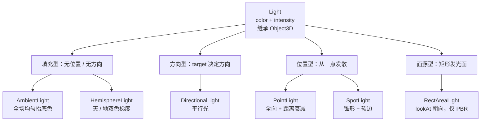

import { Canvas, Controls, Meta } from '@storybook/addon-docs/blocks';
import * as LightStories from './light-objects.stories.js';

<Meta of={LightStories} name="Docs" />

# Light

`Light` 是 `Object3D` 的子类，但它不绘制几何，而是把 `color` 和 `intensity` 写进 shader 的光照 uniform，让受光材质（`MeshStandardMaterial`、`MeshPhongMaterial` 等）算出明暗。把它 `scene.add()` 进场景树后，它和 Mesh 一样有 `position`、`rotation`，可以挂父级、可以用 Helper 显示——区别只是它影响的是"别的物体怎么被照亮"，而不是"自己长什么样"。

三种判断先建立起来，后面选型和参数才不容易混：

- **选哪种 Light 决定光的形状。** three.js 提供 6 种：`AmbientLight`、`HemisphereLight`、`DirectionalLight`、`PointLight`、`SpotLight`、`RectAreaLight`。前三者提供环境与方向基底，后三者从空间中某一点或一面发散。
- **只有受光材质响应光。** `MeshBasicMaterial`、`LineBasicMaterial`、`PointsMaterial` 默认都不受光，加多少 Light 都不会变。如果整个场景全黑，先看材质，再看光源。
- **当前版本只有物理正确光照一种模式。** r155 起 `useLegacyLights` 默认为 `false`，r165 把这个开关整体移除。旧教程里 `renderer.useLegacyLights = true` 或 `physicallyCorrectLights = true` 的写法在 r165+ 已无效；点光源与聚光灯的 intensity 改用 candela（cd），其它光源不再被 PI 除，旧教程的强度数值需要重新标定。

阴影（`castShadow` / `receiveShadow`、`shadow.mapSize`、`shadow.camera`）不在本课展开，留给 [明暗与阴影](?path=/docs/lighting-and-shadows--docs)；这里只把光源本身放进场景并讲清各自的关键参数。



## 快速上手

最小闭环：用一个 `DirectionalLight` 作主光，加一个 `HemisphereLight` 填背光面，照亮一个 `MeshStandardMaterial` 物体：

```js
const mesh = new THREE.Mesh(
  new THREE.BoxGeometry(1, 1, 1),
  new THREE.MeshStandardMaterial({ color: '#3d73d9', roughness: 0.5 })
);
mesh.position.y = 0.5;
scene.add(mesh);

const key = new THREE.DirectionalLight('#ffffff', 3.0);
key.position.set(3, 5, 3);
key.target.position.set(0, 0.5, 0);
scene.add(key);
scene.add(key.target); // target 必须进场景树，方向才生效

scene.add(new THREE.HemisphereLight('#bdd7ff', '#4a3a2a', 1.2));
```

| 输入或状态 | 默认值 / 常用起点 | 改变后要注意什么 |
| --- | --- | --- |
| `color` | `0xffffff` | 与 `intensity` 相乘决定光色；用于偏暖 / 偏冷色温 |
| `intensity` | `1` | r165+ 只有物理模式；点 / 聚光为 cd，其它光源不再被 PI 除，数值与旧教程不可直接照搬 |
| `position` | `(0, 0, 0)` | Light 是 Object3D；位置对环境光 / 半球光无意义，对其它四种决定发光点 |
| `target` | 自带 `Object3D`，位于原点 | 仅 `DirectionalLight` / `SpotLight` 使用；必须 `scene.add(light.target)` |
| 受光材质 | 需要 `MeshStandardMaterial` 等 | `MeshBasicMaterial` / `LineBasicMaterial` 不响应任何 Light |
| `castShadow` | `false` | 还需 renderer 开阴影与可投影光源；详见 [明暗与阴影](?path=/docs/lighting-and-shadows--docs) |

## 环境光 AmbientLight

`AmbientLight` 给场景里每个像素叠一层与位置、法线无关的恒定光。它的作用不是"方向"，而是把阴影面统一抬高，避免完全死黑。没有 `position`、没有 `target`，也不投影；`scene.add(new THREE.AmbientLight(color, intensity))` 之后就固定。

```js
scene.add(new THREE.AmbientLight('#ffffff', 0.6));
```

因为对所有受光材质乘同一个值，把它调高会"洗平"方向光的对比度。需要带有方向感的基底时改用 `HemisphereLight`。

| 成员 | 默认参数 | 用途 |
| --- | --- | --- |
| `AmbientLight(color=0xffffff, intensity=1)` | 全场均匀 | 抬底色，防死黑 |
| `intensity` 性质 | 不再被 PI 除 | 常用 0.3 ~ 1.0 作弱填充 |

## 半球光 HemisphereLight

`HemisphereLight` 用法线方向把天空色与地面色做线性插值：朝上的面接近 `skyColor`，朝下的面接近 `groundColor`，中间过渡。比 `AmbientLight` 更有空间感，常用于户外天光填充。同样没有有意义的 `position`，也不投影。

```js
scene.add(new THREE.HemisphereLight('#bdd7ff', '#4a3a2a', 1.2));
```

| 成员 | 默认参数 | 用途 |
| --- | --- | --- |
| `HemisphereLight(skyColor=0xffffff, groundColor=0xffffff, intensity=1)` | 天 / 地双色 | 户外天光基底 |
| `groundColor` | `0xffffff` | 多数场景调成地面的暗暖色，比环境光更有层次 |
| `intensity` 性质 | 不再被 PI 除 | 与 `AmbientLight` 一样是全场叠加 |

## 平行光 DirectionalLight

`DirectionalLight` 发出平行光，所有光线方向一致，强度不随距离衰减。光照方向由 `light.position` 指向 `light.target` 的世界坐标之差决定；它常用来模拟太阳。`light.target` 是一个独立的 `Object3D`，默认在原点——你移动它，光照方向就跟着变。

最容易踩的坑是：`scene.add(light)` 不会自动把 `target` 加进场景树。target 不在树中时，renderer 不会更新它的世界矩阵，改 `target.position` 对画面没有任何影响，光照方向停在旧值。

```js
const key = new THREE.DirectionalLight('#ffffff', 3.0);
key.position.set(3.2, 5, 3.2);
key.target.position.set(0, 1.3, 0);
scene.add(key);
scene.add(key.target); // 漏掉这一行，target 就不被 renderer 更新
```

移动 target，并切换"target 加入场景树"：关闭后画面里的高光方向和读数里的"target 世界位置"都停留在上一次 renderer 写入的旧值，而 `target.position` 局部值仍在变。

<Canvas of={LightStories.DirectionalLight} />

<Controls of={LightStories.DirectionalLight} />

Canvas 进入视口前 `200px` 启动，离开后暂停并保留最后一帧。`DirectionalLightHelper` 的方向线跟随 target；它本身和光源一样是 Object3D，但只服务调试，交付前移除。

## 点光源 PointLight

`PointLight` 从一点向四周均匀发光，强度随距离按 `decay` 给的指数衰减。物理默认 `decay = 2`（反平方），`distance = 0` 表示不设上限、按反平方衰减到无穷；`distance > 0` 时会在该距离处平滑收尾到 0（这一段截断不是物理正确的）。

```js
const bulb = new THREE.PointLight('#fff3d6', 18, 0, 2);
bulb.position.set(0, 2.6, 0);
scene.add(bulb);
```

调 intensity、distance 和 decay，观察雕塑和周围小球的亮度分布：`decay` 从 2 调到 0 时远端被显著抬起；`distance` 调小后远端被截掉。

<Canvas of={LightStories.PointLight} />

<Controls of={LightStories.PointLight} />

| 成员 | 默认值 | 影响什么 |
| --- | --- | --- |
| `intensity` | `1`（cd） | 全向发光强度；物理模式下常用十几到几十 |
| `distance` | `0` | 0 表示无上限；>0 时在该距离处平滑收尾 |
| `decay` | `2` | 反平方衰减；调成 0 时全场不衰减（非物理） |
| `power` | 自动 | 改它（单位 lm）会反向写 `intensity` |

## 聚光灯 SpotLight

`SpotLight` 从一点沿锥形方向发光，方向同样由 `light.target` 决定，因此 target 也必须加入场景树。锥形由两个参数控制：`angle` 是从中心轴起的半角（上限 `Math.PI / 2`），`penumbra` 在 `[0, 1]` 上决定软边占比——0 是硬边，1 是从中心开始全程衰减。

```js
const spot = new THREE.SpotLight('#fff3d6', 80, 12, Math.PI / 6, 0.3, 2);
spot.position.set(3.2, 5.2, 3.2);
spot.target.position.set(0, 1.3, 0);
scene.add(spot);
scene.add(spot.target); // 与 DirectionalLight 一样，target 必须进场景树
```

调 angle 和 penumbra，观察锥体边界与软硬：`SpotLightHelper` 的锥线也跟着变（helper 本身的更新时机见 [Helper](?path=/docs/helpers-and-debug-objects--docs)）。

<Canvas of={LightStories.SpotLight} />

<Controls of={LightStories.SpotLight} />

| 成员 | 默认值 | 影响什么 |
| --- | --- | --- |
| `angle` | `Math.PI / 3`（60°） | 锥体半角；上限 `Math.PI / 2` |
| `penumbra` | `0` | 0 硬边，1 全程软边 |
| `distance` / `decay` | `0` / `2` | 与 `PointLight` 一致 |
| `intensity` | `1`（cd） | 物理模式下常用几十到上百 |

## 面光源 RectAreaLight

`RectAreaLight` 把一个矩形平面当作发光体，能产生柔和的矩形高光，适合模拟窗户、灯箱、LED 柔光板。它和前五种差异最大：

- **只对 PBR 材质生效**（`MeshStandardMaterial` / `MeshPhysicalMaterial`），其它材质看不见它。
- **使用前必须初始化 LTC uniforms**：`RectAreaLightUniformsLib.init()`。漏掉这行，光照几乎不显现。
- **朝向由 `lookAt()` 决定**，发光面背向目标的一侧不照亮。
- **不支持阴影。**

```js
import { RectAreaLightUniformsLib } from 'three/addons/lights/RectAreaLightUniformsLib.js';

RectAreaLightUniformsLib.init(); // 全局调用一次

const panel = new THREE.RectAreaLight('#fff3d6', 6, 3, 3);
panel.position.set(2.4, 3.2, 2.8);
panel.lookAt(0, 1.3, 0); // 让发光面对准目标
scene.add(panel);
```

调 width、height 和 intensity，观察矩形高光面积和整体亮度的变化；线框矩形同步显示发光面位置与朝向。

<Canvas of={LightStories.RectAreaLight} />

<Controls of={LightStories.RectAreaLight} />

| 成员 | 默认值 | 影响什么 |
| --- | --- | --- |
| `width` / `height` | `10` / `10` | 发光面尺寸；越大照亮范围越广 |
| `intensity` | `1` | 面光源亮度，常用 5 以上才有明显效果 |
| `lookAt(target)` | — | 决定发光面朝向；漏调会照向错误方向 |
| LTC uniforms | 未初始化 | 漏 `init()` 光照几乎不显现，且无报错 |

## 颜色、强度与物理单位

所有 Light 共享 `color`（`Color`）和 `intensity`（数值）。`color` 与 `intensity` 相乘后送入 shader；色温由 `color` 近似（暖光偏黄橙，冷光偏蓝白），亮度由 `intensity` 决定。

r165 起 `useLegacyLights` 被整体移除，只有物理正确光照这一种模式。`intensity` 的含义按光源类型不同：点光源与聚光灯使用 SI 单位 candela，其它光源不是 SI 单位，只是不再被 PI 除：

| 光源类型 | intensity 性质 | 典型起点 |
| --- | --- | --- |
| `AmbientLight` / `HemisphereLight` | 非 SI，不再被 PI 除 | 0.3 ~ 1.5 |
| `DirectionalLight` | 非 SI，不再被 PI 除 | 2 ~ 5 |
| `PointLight` / `SpotLight` | candela（cd） | 十几 ~ 上百 |
| `RectAreaLight` | 非 SI，亮度与尺寸相关 | 5 以上 |

`PointLight`、`SpotLight`、`RectAreaLight` 还提供 `power`（单位流明 lm），改它会自动反算 `intensity`。从旧教程迁移时，看到 `renderer.useLegacyLights = true` 或 `physicallyCorrectLights = true` 直接删掉，并用本表重新标定 `intensity`——这两个属性在 r165+ 已不存在。要按 SI 单位严格换算，还需场景使用真实尺度（1 单位 = 1 米）并保留 `decay = 2`。

## 类型选型

按"需要什么形状的光"选类型，再按"是否需要 target 和衰减"定参数：

| 类型 | 光的形状 | 用 target | 关键参数 | 典型场景 |
| --- | --- | --- | --- | --- |
| `AmbientLight` | 全场均匀 | 否 | color, intensity | 抬底色，防死黑 |
| `HemisphereLight` | 天 / 地梯度 | 否 | skyColor, groundColor, intensity | 户外天光填充 |
| `DirectionalLight` | 平行光 | 是 | color, intensity, position, target | 太阳、主光 |
| `PointLight` | 全向发散 | 否 | color, intensity, distance, decay | 灯泡、火光 |
| `SpotLight` | 锥形 | 是 | angle, penumbra, distance, decay, target | 聚光灯、舞台 |
| `RectAreaLight` | 矩形面 | 否（用 `lookAt`） | width, height, intensity（仅 PBR） | 窗户、灯箱 |

填充型（`AmbientLight` / `HemisphereLight`）提供基底，通常和方向 / 位置光源组合使用；单独一个填充光会显得平淡。方向型和位置型作主光时，根据是否需要衰减选择：要太阳选 `DirectionalLight`，要灯泡选 `PointLight`，要可控制锥角选 `SpotLight`，要矩形高光且材质已经是 PBR 时选 `RectAreaLight`。

## 最佳实践

- 主光 + 填充光组合：用 `DirectionalLight` 或 `SpotLight` 作主光，加一个弱 `HemisphereLight` 或 `AmbientLight` 抬背光面，比单光源更自然。
- `DirectionalLight` 和 `SpotLight` 的 `target` 必须 `scene.add()`；要移动目标，挂到可变换的父对象上，或直接改 `target.position`。
- 物理模式下从旧教程迁移时，删掉 `useLegacyLights` / `physicallyCorrectLights`，按单位重新标定 `intensity`，不要照搬旧数值。
- 用 `RectAreaLight` 前确认：材质是 PBR、已调 `lookAt()`、已调用 `RectAreaLightUniformsLib.init()`；它不投影。
- 静态场景里光源参数稳定后，不必每帧重设；改 `position` / `target.position` 后依赖 renderer 的矩阵更新即可。
- 交付前用 [Helper](?path=/docs/helpers-and-debug-objects--docs) 核对光源位置与方向，再移除 Helper。

## 常见问题

- 为什么加了 Light 整个场景还是很暗？
  先确认材质是受光材质（`MeshStandardMaterial` 等）——`MeshBasicMaterial` 不响应光。再检查 `intensity`：r155 后点 / 聚光用 candela，常用十几到上百；方向 / 环境光不再被 PI 除，常用 2 ~ 5 或 0.3 ~ 1.5。旧教程的 `1` 通常不够。
- 为什么旧教程里的 `renderer.useLegacyLights = true` 报错或无效？
  r165 已移除该属性，物理正确光照是唯一模式。删掉这行，重新标定 `intensity`（点 / 聚光用 candela，其它光源不再被 PI 除）。
- 为什么 `DirectionalLight` 改了 `target.position`，光照方向不变？
  `light.target` 默认不在场景树中，renderer 不会更新它的世界矩阵。把 `light.target` 也 `scene.add()` 进去。
- 为什么 `RectAreaLight` 几乎看不到效果？
  检查三件事：材质是否为 PBR（`MeshStandardMaterial` / `MeshPhysicalMaterial`）；是否调用了 `RectAreaLightUniformsLib.init()`；是否用 `lookAt()` 把发光面对准了目标。
- 为什么 `PointLight` 的 `distance` 设大了反而看不出衰减？
  `distance = 0` 表示按 `decay` 反平方衰减到无穷远；只有 `distance > 0` 时才会在该距离处截断。`decay` 调小会让远端更亮，调到 0 时全场不衰减。
- 同时加多个光源会影响性能吗？
  每种受光材质的 shader 要为每盏 Light 计算光照，光源越多 draw call 内的着色成本越高；静态场景里尽量精简，或把不影响当前物体的光源排除（见 [性能](?path=/docs/performance-and-disposal--docs)）。

## 总结回顾

摘要：

Light 是 Object3D 的子类，用 `color` 和 `intensity` 给受光材质提供光照参数。6 种 Light 按光的形状分工：环境 / 半球做填充，平行做太阳，点 / 聚做局部发散，矩形做面光。当前版本只有物理正确光照一种模式，点 / 聚光的 intensity 使用 candela，其它光源不再被 PI 除。`DirectionalLight` 和 `SpotLight` 的方向依赖必须加入场景树的 `target`；`RectAreaLight` 需要 LTC uniforms 初始化和 `lookAt()`，且只对 PBR 生效。

一句话：

> 选 Light 先选光的形状，强度按 r165 后的新刻度标定，并补上 target / init / lookAt 这些容易漏的生效步骤。

知识要点：

- Light 作为 Object3D 进入场景树后影响什么？哪些材质会响应它？
- 6 种 Light 各自发出什么形状的光，分别适合什么场景？
- r165 后 `useLegacyLights` 为什么不再可用？点 / 聚光的 intensity 单位是什么，其它光源呢？
- `DirectionalLight` / `SpotLight` 的 `target` 为什么必须加入场景树？
- 用 `RectAreaLight` 时容易漏掉哪几个生效步骤？

## 参考资料

- [Three.js Docs：Light](https://threejs.org/docs/pages/Light.html)
- [Three.js Docs：AmbientLight](https://threejs.org/docs/pages/AmbientLight.html)
- [Three.js Docs：HemisphereLight](https://threejs.org/docs/pages/HemisphereLight.html)
- [Three.js Docs：DirectionalLight](https://threejs.org/docs/pages/DirectionalLight.html)
- [Three.js Docs：PointLight](https://threejs.org/docs/pages/PointLight.html)
- [Three.js Docs：SpotLight](https://threejs.org/docs/pages/SpotLight.html)
- [Three.js Docs：RectAreaLight](https://threejs.org/docs/pages/RectAreaLight.html)
- [Three.js Manual：Lights](https://threejs.org/manual/en/lights.html)
- [Three.js Migration Guide](https://github.com/mrdoob/three.js/wiki/Migration-Guide)
- [Three.js Forum：Updates to lighting in three.js r155](https://discourse.threejs.org/t/updates-to-lighting-in-three-js-r155/53733)
