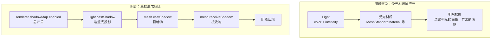

import { Canvas, Controls, Meta } from '@storybook/addon-docs/blocks';
import * as LightingStories from './lighting-and-shadows.stories.js';

<Meta of={LightingStories} name="Docs" />

# 明暗与阴影

明暗和阴影是两条独立的链路，先分清各自依赖什么：

- **明暗层次** 由"受光材质 + 光源"形成。法线朝光的面亮、背离的面暗；填充光（`AmbientLight` / `HemisphereLight`）把背光面抬起，主光（`DirectionalLight` 等）形成对比。整条链路只关心"材质怎么响应光"，不关心光是否被遮挡。
- **阴影** 由"光被物体遮挡"形成，需要四处开关同时打开：`renderer.shadowMap.enabled` 是总开关，`light.castShadow` 让这盏光产生 shadow map，投射物的 `mesh.castShadow` 标记谁挡光，接收物的 `mesh.receiveShadow` 标记把阴影画在谁身上。任一缺失，画面里就没有阴影。

两条链路独立意味着：你可以有明暗但没阴影（没开 castShadow），也可以开了阴影但明暗平淡（只剩环境光）。阴影质量则由 `shadow.mapSize`（分辨率）和 `shadow.camera` 范围（覆盖区域）共同决定——同一张纹理覆盖的世界区域越大，每个纹素对应的世界空间越大，阴影越糊。



## 快速上手

最小闭环：开四处开关，让一个 `MeshStandardMaterial` 雕塑在地面上投出阴影：

```js
const renderer = new THREE.WebGLRenderer({ canvas });
renderer.shadowMap.enabled = true; // 1. 总开关

const ground = new THREE.Mesh(
  new THREE.PlaneGeometry(10, 10),
  new THREE.MeshStandardMaterial({ color: '#4a515a', roughness: 0.9 })
);
ground.rotation.x = -Math.PI / 2;
ground.receiveShadow = true; // 2. 接收物
scene.add(ground);

const statue = new THREE.Mesh(
  new THREE.TorusKnotGeometry(0.5, 0.18, 100, 16),
  new THREE.MeshStandardMaterial({ color: '#e8d8b5', roughness: 0.4 })
);
statue.position.y = 1.1;
statue.castShadow = true; // 3. 投射物
scene.add(statue);

const light = new THREE.DirectionalLight('#fff3d6', 3.0);
light.position.set(3, 5, 3);
light.target.position.set(0, 1.1, 0);
light.castShadow = true; // 4. 光源开关
light.shadow.mapSize.set(1024, 1024); // 阴影分辨率（方阵）
light.shadow.camera.left = -4;        // 正交阴影相机范围
light.shadow.camera.right = 4;
light.shadow.camera.top = 4;
light.shadow.camera.bottom = -4;
light.shadow.camera.updateProjectionMatrix();
scene.add(light, light.target); // target 必须进场景树，方向才生效
```

| 输入或状态 | 默认值 / 常用起点 | 改变后要注意什么 |
| --- | --- | --- |
| `renderer.shadowMap.enabled` | `false` | 总开关；关掉后所有光源都不投影 |
| `renderer.shadowMap.type` | `PCFShadowMap`（默认且软） | r182 起 `PCFSoftShadowMap` 已废弃，设置后会回退并告警 |
| `light.castShadow` | `false` | 单光源开关；只影响这一盏光 |
| `mesh.castShadow` / `mesh.receiveShadow` | `false` | 投射物和接收物各自独立，必须分别打开 |
| `light.shadow.mapSize` | `Vector2(512, 512)` | 改后需 dispose 旧 map 才生效；常用 1024 / 2048（方阵） |
| `light.shadow.camera`（DirectionalLight） | `OrthographicCamera(±5, near 0.5, far 500)` | 范围越大阴影越糊；改后调 `updateProjectionMatrix()` |
| `light.shadow.bias` / `normalBias` | `0` / `0` | 治阴影痤疮（acne）与漏光（light leaking） |

## 明暗层次

材质要"响应光"才会出现明暗梯度。three.js 的材质分两类：

- **受光材质**：`MeshLambertMaterial`（漫反射）、`MeshPhongMaterial`（漫反射 + 高光）、`MeshStandardMaterial` / `MeshPhysicalMaterial`（PBR，金属度 + 粗糙度）、`MeshToonMaterial`（卡通分层）。它们的着色器读取场景里所有 Light 的 `color` × `intensity`，按顶点法线和光源方向的夹角计算亮度——法线朝光的面亮，背离的面暗。
- **不受光材质**：`MeshBasicMaterial`、`LineBasicMaterial` / `LineDashedMaterial`、`PointsMaterial`、`SpriteMaterial`。它们直接用 `color` / `map` 显示，加多少 Light 都不变。整个场景全黑时，先看材质再看光源。

明暗层次靠"主光 + 填充光"两层叠加形成：主光（`DirectionalLight`、`SpotLight`、`PointLight`）从一个方向打过来，形成亮面和暗面；填充光（`AmbientLight` 给全场抬底色，`HemisphereLight` 按法线方向做天 / 地双色梯度）把背光面从死黑抬起。只用一个主光会让背光面完全黑，只用填充光会让画面平淡无方向感。

PBR 材质（`MeshStandardMaterial` / `MeshPhysicalMaterial`）的完整明暗模型还涉及金属度、粗糙度、环境贴图和色调映射，本课只把它作为受光材质的入口，完整工作流在 [PBR 与环境贴图](?path=/docs/pbr-and-environment-maps--docs)。光源本身的 6 种类型、`color` / `intensity` 单位和 `target` 生效步骤在 [Light](?path=/docs/light-objects--docs) 课展开，这里不重复。

## 阴影开关链路

阴影是"光被投射物遮挡、在接收物上形成的暗区"。three.js 把这件事拆成四个独立开关，任一关闭，阴影就不出现：

```js
renderer.shadowMap.enabled = true; // 1. 渲染器总开关
light.castShadow = true;           // 2. 这盏光产生 shadow map
mesh.castShadow = true;            // 3. 这个物体挡光（投射物）
ground.receiveShadow = true;       // 4. 这个物体画阴影（接收物）
```

这四步分别属于不同对象，没有"一处打开全部"的捷径。最容易漏的是 `renderer.shadowMap.enabled`（默认 `false`）和 `receiveShadow`（默认 `false`）——前三个全开了，地面不 `receiveShadow`，画面里还是没阴影。

逐个切换下面四个开关，读数里的"阴影链路"会指出当前断在哪一环；任一关闭，画面里阴影立即消失。

<Canvas of={LightingStories.ShadowToggles} />

<Controls of={LightingStories.ShadowToggles} />

Canvas 进入视口前 `200px` 启动，离开后暂停并保留最后一帧。`DirectionalLight` 和 `SpotLight` 投影时还要求 `light.target` 在场景树中，否则光源方向停在旧值（见 [Light](?path=/docs/light-objects--docs)）；`RectAreaLight` 不支持阴影。

## 阴影质量：mapSize 与阴影相机

阴影质量由"shadow map 纹素对应的世界空间大小"决定，它等于 `shadow.camera 覆盖范围 / shadow.mapSize`。两条途径都能改善阴影：调大 `mapSize` 让纹素更密，或调小 `shadow.camera` 范围让同一张纹理覆盖更小的区域。

```js
// 分辨率：常用 1024 或 2048（必须 2 的幂方阵）
light.shadow.mapSize.set(2048, 2048);
// 改 mapSize 后要 dispose 旧纹理，three.js 才会在下一帧用新尺寸重建
if (light.shadow.map) {
  light.shadow.map.dispose();
  light.shadow.map = null;
}

// DirectionalLight 的 shadow.camera 是 OrthographicCamera
light.shadow.camera.left = -3;
light.shadow.camera.right = 3;
light.shadow.camera.top = 3;
light.shadow.camera.bottom = -3;
light.shadow.camera.updateProjectionMatrix();
```

不同光源的 shadow camera 类型不同，决定了"范围"怎么调：

| 光源 | shadow camera | 范围参数 | 说明 |
| --- | --- | --- | --- |
| `DirectionalLight` | `OrthographicCamera` | `left/right/top/bottom/near/far` | 平行光不衰减，用正交盒子包住要投影的区域；盒子越大，阴影越糊 |
| `SpotLight` | `PerspectiveCamera` | `near/far`，fov 自动 | fov 由 `2 × light.angle × shadow.focus` 推导，你不直接设；`focus` 默认 `1` |
| `PointLight` | `PerspectiveCamera(fov=90)` | `near/far` | 渲染成立方体 6 个面，fov 固定 90；`far` 决定最远投射距离 |

调大 `range`（阴影相机半范围）或调小 `mapSize`，看阴影边缘如何变糊；`CameraHelper` 同步显示阴影相机的正交视锥，范围变化在画面里直接可见。

<Canvas of={LightingStories.ShadowQuality} />

<Controls of={LightingStories.ShadowQuality} />

## 阴影类型与过滤

`renderer.shadowMap.type` 控制 shadow map 采样方式，影响阴影边缘的软硬和性能：

| 类型 | 行为 | 适用 |
| --- | --- | --- |
| `BasicShadowMap` | 硬阴影，无过滤 | 风格化硬阴影或最低开销 |
| `PCFShadowMap`（默认） | 软阴影，百分比渐近过滤 | 通用，r182 起已自带软边 |
| `VSMShadowMap` | 方差阴影贴图，边缘更柔和 | 需要更软的阴影；不支持 `PointLight` |
| `PCFSoftShadowMap` | r182 起废弃 | 设置后会回退到 `PCFShadowMap` 并告警，迁移时直接删掉 |

```js
renderer.shadowMap.type = THREE.PCFShadowMap; // 默认值，r182 起即软阴影
```

r182 之前 `PCFShadowMap` 是硬边、`PCFSoftShadowMap` 才是软边；r182 把 `PCFShadowMap` 升级成自带软边后，`PCFSoftShadowMap` 失去意义并被废弃。当前版本（r165 之后）从旧代码迁移时，把 `renderer.shadowMap.type = THREE.PCFSoftShadowMap` 直接改成 `THREE.PCFShadowMap`，或直接删掉这行用默认值。

`LightShadow` 还提供 `radius`（`BasicShadowMap` 下无效，控制 PCF 采样半径）和 `blurSamples`（VSM 模糊采样数，默认 8），数值越大阴影越柔但开销越高。`light.shadow.intensity`（范围 `[0, 1]`，默认 1）控制阴影本身的明暗程度，不依赖材质——调小可以让阴影更淡。

## 阴影偏移与精度

阴影的两个典型瑕疵都靠偏移参数治：

- **阴影痤疮（shadow acne）**：物体表面出现条纹状自阴影。原因是 shadow map 的量化精度让"同一表面"在比较深度时忽前忽后。调 `light.shadow.bias`（默认 `0`）加一个负偏移（如 `-0.0005`），把表面往光的方向推一点点；调太多会让阴影脱离脚底（peter-panning）。
- **漏光（light leaking）**：本该在阴影里的接缝或薄墙反而被照亮。调 `light.shadow.normalBias`（默认 `0`）沿法线方向偏移采样点，常用于大场景中浅角度入射时的 acne；调太多阴影会变形。

```js
light.shadow.bias = -0.0005;       // 负值治 acne；正值会加重
light.shadow.normalBias = 0.02;    // 沿法线偏移，治浅角度 acne / 漏光
```

精度由 `light.shadow.mapType` 控制（默认 `UnsignedByteType`，即 8 位）。大场景或 `near/far` 跨度很大时，8 位深度量化误差会引起 acne 和锯齿，改 `THREE.FloatType` 或 `THREE.HalfFloatType` 能显著改善：

```js
light.shadow.mapType = THREE.HalfFloatType; // 提升深度精度，缓解大范围阴影的 acne
```

## 最佳实践

- 先确认四处开关都打开，再调阴影质量参数；排查阴影"没出现"永远是查开关，不是查 mapSize。
- DirectionalLight 阴影相机的正交范围尽量贴合要投影的区域，不要默认 `±5` 一把梭；范围越大阴影越糊。
- `mapSize` 改完务必 dispose 旧 map 并置 `null`，否则新尺寸不生效；1024 是常用起点，2048 用于近处细节阴影。
- 先用默认的 `PCFShadowMap`，确认阴影软硬再决定是否换 `VSMShadowMap`；不要从旧代码复制 `PCFSoftShadowMap`。
- 出现 acne 先试很小的负 `bias`（`-0.0005` 量级），仍有问题再叠 `normalBias`；大场景 acne 考虑 `HalfFloatType` 的 mapType。
- 交付前用 `CameraHelper(light.shadow.camera)` 核对正交范围是否包住物体，再移除 helper。
- 静态场景里关掉 `light.shadow.autoUpdate`（默认 `true`），或把 `renderer.shadowMap.needsUpdate` 只在变化时置 `true`，避免每帧重算 shadow map。

## 常见问题

- 为什么加了光源、开了 `castShadow`，画面里还是没阴影？
  按四处开关逐个查：`renderer.shadowMap.enabled`、`light.castShadow`、投射物的 `mesh.castShadow`、接收物的 `mesh.receiveShadow`。最容易漏的是总开关（默认 `false`）和地面的 `receiveShadow`（默认 `false`）。还要确认 `DirectionalLight` / `SpotLight` 的 `target` 在场景树中。
- 为什么阴影边缘全是锯齿 / 糊成一片？
  看阴影相机的正交范围（`shadow.camera.left/right/top/bottom`）是否远大于实际物体——同一张 `mapSize` 覆盖的世界区域越大，纹素越粗。调小范围或调大 `shadow.mapSize`（1024 → 2048），改完记得 dispose 旧 map。
- 为什么旧代码里 `renderer.shadowMap.type = THREE.PCFSoftShadowMap` 报警告？
  r182 起 `PCFSoftShadowMap` 已废弃，`PCFShadowMap` 默认就是软阴影。把这行改成 `THREE.PCFShadowMap` 或直接删掉。
- 为什么物体表面出现密集的条纹状自阴影（acne）？
  shadow map 深度量化精度不够。先试 `light.shadow.bias = -0.0005` 这一级别的负偏移；浅角度入射的大场景再叠 `light.shadow.normalBias`（如 `0.02`）；范围跨度过大时改 `light.shadow.mapType = THREE.HalfFloatType`。
- 为什么阴影飘在脚底、不贴地面（peter-panning）？
  `bias` 调得太负，把投射物整体往光的方向推远了。把 `bias` 往 `0` 收一点，或改用 `normalBias` 替代。
- 为什么改了 `shadow.mapSize` 没生效？
  three.js 只在 `shadow.map` 为 `null` 时按新尺寸重建纹理。改完 `mapSize` 要 `light.shadow.map.dispose()` 并把 `light.shadow.map` 置 `null`，下一帧才会用新尺寸。
- `SpotLight` 的阴影相机 `fov` 怎么改不动？
  `SpotLightShadow` 每帧用 `2 × light.angle × shadow.focus` 自动推导 fov，你不直接设；要收窄阴影范围就调小 `light.angle`，或用 `light.shadow.focus`（`[0, 1]`，默认 `1`）。

## 总结回顾

摘要：

明暗和阴影是两条独立链路。明暗由受光材质（`MeshStandardMaterial` 等）响应 Light 形成，靠主光 + 填充光叠出层次；不受光材质（`MeshBasicMaterial` 等）加多少光都不变。阴影需要 `renderer.shadowMap.enabled`、`light.castShadow`、投射物的 `mesh.castShadow`、接收物的 `mesh.receiveShadow` 四处开关同时打开，任一缺失就没有阴影。阴影质量由 `shadow.mapSize`（分辨率）和 `shadow.camera` 范围（覆盖区域）共同决定——DirectionalLight 用正交相机，范围越大阴影越糊；SpotLight 的 fov 由 `light.angle` 自动推导，PointLight 固定 90° 立方体。r182 起 `PCFSoftShadowMap` 已废弃，`PCFShadowMap` 默认即软阴影。acne 和漏光分别用 `bias` 和 `normalBias` 治，大场景可改 `mapType` 提升深度精度。

一句话：

> 阴影不出现永远先查四处开关，阴影糊永远先看 mapSize 与阴影相机范围的纹素密度。

知识要点：

- 明暗层次和阴影是两条独立链路，各自依赖什么？哪些材质响应光、哪些不响应？
- 阴影的四处开关分别属于哪个对象？为什么任一缺失阴影就不出现？
- `shadow.mapSize` 和 `shadow.camera` 范围怎样共同决定阴影清晰度？
- DirectionalLight、SpotLight、PointLight 的 shadow camera 类型有何不同？哪些参数能调、哪些自动推导？
- r182 后 `PCFSoftShadowMap` 为什么不能再用？默认的 `PCFShadowMap` 行为有什么变化？
- 阴影痤疮和漏光分别用什么参数治？为什么 `bias` 调太多会让阴影脱离脚底？

## 参考资料

- [Three.js Docs：WebGLRenderer.shadowMap](https://threejs.org/docs/#api/en/renderers/WebGLRenderer.shadowMap)
- [Three.js Docs：LightShadow](https://threejs.org/docs/?q=LightShadow#api/en/lights/shadows/LightShadow)
- [Three.js Docs：DirectionalLightShadow](https://threejs.org/docs/?q=DirectionalLightShadow#api/en/lights/shadows/DirectionalLightShadow)
- [Three.js Docs：SpotLightShadow](https://threejs.org/docs/?q=SpotLightShadow#api/en/lights/shadows/SpotLightShadow)
- [Three.js Docs：PointLightShadow](https://threejs.org/docs/?q=PointLightShadow#api/en/lights/shadows/PointLightShadow)
- [Three.js Manual：Lights](https://threejs.org/manual/en/lights.html)
- [Three.js Migration Guide（r155 → r182 阴影变化）](https://github.com/mrdoob/three.js/wiki/Migration-Guide)
- [Three.js Forum：Shadow Pixelation Issue in 0.182.0（PCFSoftShadowMap 废弃讨论）](https://discourse.threejs.org/t/shadow-pixelation-issue-in-three-js-0-182-0/88746)
