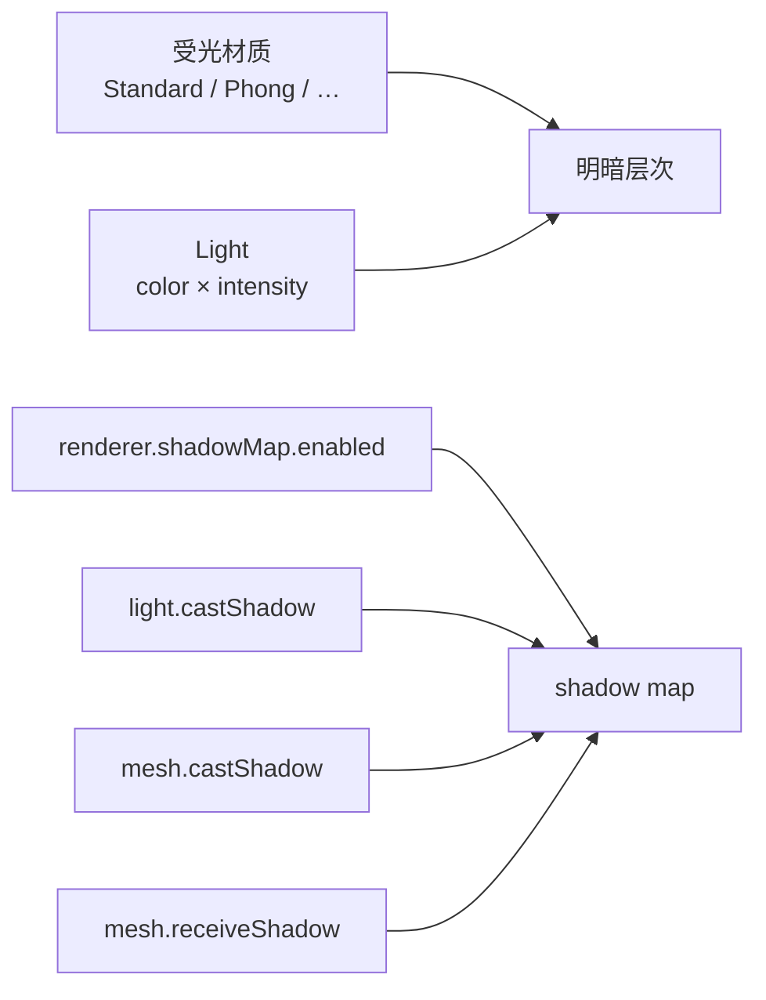

import { Canvas, Controls, Meta } from '@storybook/addon-docs/blocks';
import * as LightingStories from './lighting-and-shadows.stories.js';

<Meta of={LightingStories} name="Docs" />

# 明暗与阴影

[Light](?path=/docs/light-objects--docs) 课把光源放进场景；本课回答两件后续事：**明暗**怎么出来，以及 **阴影**怎么开对。

两条链不要混：

- **明暗** = 受光材质 × Light。法线朝向光的一面亮，背光面暗。`MeshBasicMaterial` 不参与这条链。
- **阴影** = 在明暗之上再加 shadow map。渲染器从光源视角把 `castShadow` 物体画进深度图，再在 `receiveShadow` 表面上采样。少开一环就看不到影。

只有 `DirectionalLight`、`SpotLight`、`PointLight` 能投影；`AmbientLight` / `HemisphereLight` / `RectAreaLight` 永远不行。



| 输入或状态 | 默认值 | 回查要点 |
| --- | --- | --- |
| 受光材质 | 需自选 `MeshStandardMaterial` 等 | `MeshBasicMaterial` / `LineBasicMaterial` / `PointsMaterial` 不受光 |
| `renderer.shadowMap.enabled` | `false` | 全局总闸；不开则无任何阴影 |
| `renderer.shadowMap.type` | `PCFShadowMap` | `BasicShadowMap` / `PCFShadowMap` / `VSMShadowMap`；`PCFSoftShadowMap` 已弃用并回退到 PCF |
| `light.castShadow` | `false` | 仅 Directional / Spot / Point 有效 |
| `mesh.castShadow` / `receiveShadow` | `false` / `false` | 投射与接收分开设；地面常只 `receiveShadow` |
| `shadow.mapSize` | `(512, 512)` | 须为 2 的幂；越大越清晰也越贵 |
| `DirectionalLight.shadow.camera` | 正交，半宽约 `5`，`near=0.5`，`far=500` | 过小裁影，过大糊块 |
| `shadow.bias` / `normalBias` | `0` / `0` | 微调防 acne；过负易 peter-panning |
| `shadow.intensity` | `1` | `[0, 1]`，压暗阴影浓度 |
| `shadow.radius` | `1` | >1 软边；对 `BasicShadowMap` 无效 |
| `shadow.autoUpdate` | `true` | 静态阴影可关，改完后手动 `needsUpdate = true` |

## 快速上手

最小闭环：受光材质 + 一盏可投影平行光 + 四开关全开，地面出现阴影。

```js
renderer.shadowMap.enabled = true;

const ground = new THREE.Mesh(
  new THREE.PlaneGeometry(20, 20),
  new THREE.MeshStandardMaterial({ color: '#3a3f47', roughness: 0.95 })
);
ground.rotation.x = -Math.PI / 2;
ground.receiveShadow = true;
scene.add(ground);

const box = new THREE.Mesh(
  new THREE.BoxGeometry(1, 1, 1),
  new THREE.MeshStandardMaterial({ color: '#e8d8b5', roughness: 0.4 })
);
box.position.y = 0.5;
box.castShadow = true;
scene.add(box);

const key = new THREE.DirectionalLight('#ffffff', 3);
key.position.set(4, 8, 4);
key.castShadow = true;
key.shadow.mapSize.set(1024, 1024);
key.shadow.camera.left = -6;
key.shadow.camera.right = 6;
key.shadow.camera.top = 6;
key.shadow.camera.bottom = -6;
key.shadow.camera.near = 1;
key.shadow.camera.far = 24;
scene.add(key);
scene.add(key.target);
```

## 受光材质与明暗

明暗是材质在 shader 里按法线对 Light 求贡献的结果。`MeshStandardMaterial`、`MeshPhongMaterial`、`MeshLambertMaterial`、`MeshToonMaterial`、`MeshPhysicalMaterial` 会响应光；`MeshBasicMaterial` 只显示固有色，加多少灯都不变。

```js
// 受光：有亮面与背光面
new THREE.MeshStandardMaterial({ color: '#3d73d9', roughness: 0.45 });

// 不受光：颜色恒定
new THREE.MeshBasicMaterial({ color: '#3d73d9' });
```

切换材质并调 `intensity`：`standard` 时明暗随光强变化；`basic` 时读数仍变、画面不变。

<Canvas of={LightingStories.LitMaterial} />

<Controls of={LightingStories.LitMaterial} />

材质选项全集（透明、深度、线框等）见 [材质](?path=/docs/materials-and-render-states--docs)；本课只桥接“会不会受光”这一判断。环境反射与金属度见 [PBR](?path=/docs/pbr-and-environment-maps--docs)。

## 阴影开关

shadow map 要四环齐开。渲染器从每个 `castShadow` 光源的视角，把场景里 `castShadow` 的物体画成深度图；再在 `receiveShadow` 表面上比较深度，决定是否落在阴影里。

```js
renderer.shadowMap.enabled = true; // 1 总闸
light.castShadow = true;           // 2 该光源生成深度图
mesh.castShadow = true;            // 3 写入深度图
ground.receiveShadow = true;       // 4 采样深度图
```

逐个关掉开关：任意一环为关，地面阴影消失，读数标出断点。

<Canvas of={LightingStories.ShadowSwitches} />

<Controls of={LightingStories.ShadowSwitches} />

Canvas 进入视口前 `200px` 启动，离开后暂停并保留最后一帧。

## 平行光阴影相机

`DirectionalLight` 的阴影相机是 `OrthographicCamera`（默认半宽约 `5`，`near=0.5`，`far=500`）。只有落在这个盒子里的投射物与接收面才会参与阴影；盒子外的区域没有阴影数据。

```js
const cam = light.shadow.camera; // OrthographicCamera
cam.left = cam.bottom = -6;
cam.right = cam.top = 6;
cam.near = 1;
cam.far = 24;
cam.updateProjectionMatrix();

scene.add(new THREE.CameraHelper(cam)); // 调试时看覆盖范围
```

调半宽与 near/far：黄线盒子是阴影相机视锥。半宽过小，远处柱子的影被裁掉；半宽拉到很大时，同一 `mapSize` 下阴影变糊——贴图像素被摊到更大世界面积上。

<Canvas of={LightingStories.DirectionalShadowCamera} />

<Controls of={LightingStories.DirectionalShadowCamera} />

默认 `far=500` 往往过大。把 near/far 贴紧场景深度，把 left/right/top/bottom 贴紧需要投影的区域，再用 `CameraHelper` 核对。Helper 用法见 [Helper](?path=/docs/helpers-and-debug-objects--docs)。

## 聚光与点光阴影

三种可投影光的阴影相机不同：

| 光源 | 阴影相机 | 关键控制 | 成本 |
| --- | --- | --- | --- |
| `DirectionalLight` | 正交 | 自调 `left/right/top/bottom/near/far` | 每光源约 1 次深度渲染 |
| `SpotLight` | 透视 | `fov` 跟 `spot.angle`；`aspect` 跟 mapSize | 每光源约 1 次 |
| `PointLight` | 立方体 6 面 | 主要调 `near` / `far` | **约 6 次**深度渲染 |

```js
// Spot：阴影锥随 angle；改 angle 后阴影覆盖跟着变
const spot = new THREE.SpotLight('#fff3d6', 80, 20, Math.PI / 6, 0.25, 2);
spot.castShadow = true;
spot.shadow.mapSize.set(1024, 1024);
spot.shadow.camera.near = 1;
spot.shadow.camera.far = 20;
scene.add(spot);
scene.add(spot.target);

// Point：全向阴影贵，优先只给主光投影
const bulb = new THREE.PointLight('#fff3d6', 40, 0, 2);
bulb.castShadow = true;
bulb.shadow.mapSize.set(512, 512); // 实际是立方体贴图，更吃显存
bulb.shadow.camera.near = 0.5;
bulb.shadow.camera.far = 12;
```

`AmbientLight`、`HemisphereLight` 没有方向，不能投影。`RectAreaLight` 也不支持阴影。多灯场景常见做法：多盏灯照亮，**只让一盏 Directional 或 Spot 投影**。

## 阴影贴图质量

质量由三件事决定：分辨率（`mapSize`）、过滤（`shadowMap.type`）、深度偏移（`bias` / `normalBias`）。

```js
renderer.shadowMap.type = THREE.PCFShadowMap; // 默认

light.shadow.mapSize.set(1024, 1024); // 2 的幂
light.shadow.bias = -0.0002;          // 防 acne；过负会脱影
light.shadow.normalBias = 0.02;       // 大场景浅角时常用
light.shadow.radius = 2;              // 软边；Basic 无效
light.shadow.intensity = 1;           // 阴影浓度 0~1
```

| `shadowMap.type` | 观感 | 注意 |
| --- | --- | --- |
| `BasicShadowMap` | 硬边、块状 | 最快 |
| `PCFShadowMap` | 默认，边缘有过滤 | 日常首选 |
| `VSMShadowMap` | 更软 | 接收物也会投影；不支持 PointLight |
| `PCFSoftShadowMap` | — | **已弃用**，运行时回退到 `PCFShadowMap` |

改 `mapSize` 后要丢掉旧的 `light.shadow.map`（设为 `null` 并 `dispose`），下一帧才会按新尺寸重建。

调 `mapSize`、`type`、`bias`：分辨率上去边缘更清晰；把 `bias` 拧到很负，阴影会与物体脱开（peter-panning）；接近 `0` 且无 `normalBias` 时，曲面易出条纹 acne。

<Canvas of={LightingStories.ShadowMapQuality} />

<Controls of={LightingStories.ShadowMapQuality} />

| 回查项 | 默认 | 何时动 |
| --- | --- | --- |
| `shadow.radius` | `1` | 需要更软边且 type 不是 Basic |
| `shadow.blurSamples` | `8` | 仅 VSM 模糊采样数 |
| `shadow.autoUpdate` | `true` | 灯光与投射物都静止时可 `false`，变更后 `shadow.needsUpdate = true` |
| `renderer.shadowMap.autoUpdate` | `true` | 整场景阴影静态时同理，用 `needsUpdate` 点一次 |

## 最佳实践

- 先确认受光材质与 Light，再开阴影；场景全黑时先查材质，不要先调 shadow bias。
- 多灯只给主光投影；PointLight 阴影贵，优先 Directional 或 Spot。
- 用 `CameraHelper(light.shadow.camera)` 把阴影范围贴紧场景，再提高 `mapSize`，不要用巨大 frustum + 低分辨率硬撑。
- `mapSize` 从 `512` 或 `1024` 起步；超过 `2048` 前先确认 `renderer.capabilities.maxTextureSize`。
- 类型默认用 `PCFShadowMap`；不要再写 `PCFSoftShadowMap`。
- 静态场景可关 `shadow.autoUpdate`，只在物体或灯光移动后置 `needsUpdate`。
- 交付前移除 `CameraHelper` / Light Helper。

## 常见问题

- 为什么开了灯有明暗，却完全没有阴影？
  按四环排查：`renderer.shadowMap.enabled`、`light.castShadow`、投射物 `castShadow`、接收面 `receiveShadow`。再确认光源是 Directional / Spot / Point。
- 为什么阴影缺一块，或只有近处有影？
  阴影相机范围不够。给 Directional 调大 `left/right/top/bottom` 或收紧后移动灯光；用 `CameraHelper` 看黄线盒子是否罩住投射物与落影面。
- 为什么阴影很糊、像马赛克？
  frustum 太大或 `mapSize` 太小。先缩小阴影相机覆盖，再升 `mapSize`。
- 为什么阴影表面有条纹（acne），或阴影与物体脱开？
  条纹：略增 `normalBias`，或把 `bias` 调到很小的负值（如 `-0.0001` ~ `-0.0005`）。脱开（peter-panning）：`bias` 过负，往 `0` 收回。
- 为什么 `MeshBasicMaterial` 地面收不到看起来正常的阴影明暗？
  Basic 不受光，阴影采样也缺乏光照着色上下文。接收面用 `MeshStandardMaterial` 等受光材质；若只要影子剪影，可查 `ShadowMaterial`。
- 为什么旧代码里的 `PCFSoftShadowMap` 没区别？
  当前版本已弃用，会警告并改用 `PCFShadowMap`。直接写 `PCFShadowMap`，软边靠 `radius` 或改用 `VSMShadowMap`（注意 VSM 副作用）。

## 总结回顾

摘要：

明暗由受光材质与 Light 共同决定；阴影是额外的 shadow map 流程，依赖渲染器总闸、光源投影、物体投射与接收四环。Directional 用正交阴影相机，范围与 `mapSize` 互相制约；Spot 跟锥角，Point 要六面深度所以贵。质量靠 `mapSize`、`type`、`bias`/`normalBias` 平衡，`PCFSoftShadowMap` 已弃用。

一句话：

> 先保证受光材质出明暗，再把阴影四开关与阴影相机范围开对，最后才调 mapSize 和 bias。

知识要点：

- 明暗和阴影分别依赖什么？为什么 Basic 材质调灯无效？
- 阴影四环是什么？漏掉一环会怎样？
- 哪些 Light 能投影？PointLight 阴影为什么贵？
- Directional 阴影相机过小 / 过大会分别出现什么现象？
- `bias` 与 `normalBias` 如何对应 acne 和 peter-panning？
- `PCFSoftShadowMap` 在当前版本应如何处理？

## 参考资料

- [Three.js Manual：Shadows](https://threejs.org/manual/en/shadows.html)
- [Three.js Docs：WebGLRenderer（shadowMap）](https://threejs.org/docs/pages/WebGLRenderer.html)
- [Three.js Docs：LightShadow](https://threejs.org/docs/pages/LightShadow.html)
- [Three.js Docs：DirectionalLightShadow](https://threejs.org/docs/pages/DirectionalLightShadow.html)
- [Three.js Docs：SpotLightShadow](https://threejs.org/docs/pages/SpotLightShadow.html)
- [Three.js Docs：PointLightShadow](https://threejs.org/docs/pages/PointLightShadow.html)
- [Three.js Docs：DirectionalLight](https://threejs.org/docs/pages/DirectionalLight.html)
- [Three.js Docs：SpotLight](https://threejs.org/docs/pages/SpotLight.html)
- [Three.js Docs：PointLight](https://threejs.org/docs/pages/PointLight.html)
- [Three.js Docs：CameraHelper](https://threejs.org/docs/pages/CameraHelper.html)
- [Three.js Docs：ShadowMaterial](https://threejs.org/docs/pages/ShadowMaterial.html)
