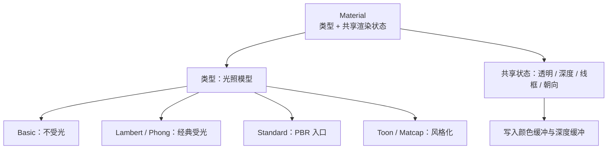

import { Canvas, Controls, Meta } from '@storybook/addon-docs/blocks';
import * as MaterialStories from './materials-and-render-states.stories.js';

<Meta of={MaterialStories} name="Docs" />

# 材质

Material 决定表面片段怎样写入颜色、透明度和深度。Geometry 提供“画什么形状”，Material 提供“这些像素按什么规则上色”；Light 只影响受光材质。同一个 Mesh 可以随时替换材质，形状与变换不变。

两层判断先分开，后面选型才不容易混：

- **材质类型决定光照模型。** `MeshBasicMaterial` 不受光；Lambert / Phong 是经典受光；`MeshStandardMaterial` 是 PBR 入口；Toon / Matcap 用分档或烘焙贴图换造型。
- **共享渲染状态决定合成结果。** `transparent` / `opacity` / `alphaTest`、`wireframe`、`depthTest` / `depthWrite`、`side` 对多数材质通用，也是半透明闪烁、背面消失等问题的落点。

贴图槽细节见[纹理](?path=/docs/textures-and-maps--docs)；`metalness` / 环境反射 / `MeshPhysicalMaterial` 见 [PBR](?path=/docs/pbr-and-environment-maps--docs)；阴影见[明暗与阴影](?path=/docs/lighting-and-shadows--docs)。



| 输入或状态 | 默认值 / 常用起点 | 改变后要注意什么 |
| --- | --- | --- |
| 材质类型 | 视目标选型 | 不受光材质加多少 Light 都不变 |
| `color` | `0xffffff` | 与 `map` 相乘；金属面语义见 PBR 课 |
| `transparent` | `false` | `true` 才让 `opacity < 1` 按透明路径合成 |
| `opacity` | `1` | 需配合 `transparent: true` |
| `alphaTest` | `0` | `> 0` 时按阈值丢弃，常用于镂空，不必开 transparent |
| `wireframe` | `false` | WebGL 线宽通常固定 1px |
| `depthTest` | `true` | 关闭后不再与深度缓冲比较 |
| `depthWrite` | `true` | 半透明常关，避免挖空后方物体 |
| `side` | `FrontSide` | 也影响 Raycaster 命中面 |
| `flatShading` | `false` | `true` 按面法线着色，棱角更硬 |
| `needsUpdate` | `false` | 改会切换 shader 分支的字段后要设 `true` |
| `dispose()` | 不自动调用 | 确认无共享引用后再释放 |

## 快速上手

给 Mesh 挂一个受光材质，改 `color` 和 `opacity`：

```js
const material = new THREE.MeshStandardMaterial({
  color: '#3d73d9',
  roughness: 0.45,
  transparent: true,
  opacity: 0.85
});

const mesh = new THREE.Mesh(new THREE.BoxGeometry(1, 1, 1), material);
scene.add(mesh);

// 场景里需要有 Light，Standard / Lambert / Phong / Toon 才会有明暗
scene.add(new THREE.DirectionalLight('#ffffff', 2.5));
scene.add(new THREE.AmbientLight('#ffffff', 0.4));
```

## 材质选型

按“要不要响应光、要不要物理参数、要不要风格化”选类型：

| 类型 | 响应 Light | 关键特征 | 典型场景 |
| --- | --- | --- | --- |
| `MeshBasicMaterial` | 否 | 恒定色 / 贴图 | UI 色块、不受光调试、自发光外观 |
| `MeshLambertMaterial` | 是 | 仅漫反射 | 哑光体、无高光需求 |
| `MeshPhongMaterial` | 是 | `shininess` 镜面高光 | 塑料感、经典高光 |
| `MeshStandardMaterial` | 是 | `roughness` / `metalness` | 默认写实入口 |
| `MeshToonMaterial` | 是 | `gradientMap` 分档 | 卡通、插画风 |
| `MeshMatcapMaterial` | 否（贴图烘焙） | `matcap` | 无光场景的快速造型 |

`MeshPhysicalMaterial` 是 Standard 的超集，清漆 / 透射等见 [PBR](?path=/docs/pbr-and-environment-maps--docs)。`LineBasicMaterial` / `PointsMaterial` / `SpriteMaterial` 跟对应对象课；`ShaderMaterial` 见 [Shader](?path=/docs/shader-basics--docs)。

## MeshBasicMaterial

`MeshBasicMaterial` 按 `color` / `map` 直接上色，**不计算场景光**。场景再亮、再暗，它都保持设定颜色。适合标注、UI 平面、不依赖光照的纯色块。

```js
const material = new THREE.MeshBasicMaterial({ color: '#3d73d9' });
```

同场景加一盏可调 `DirectionalLight`：左侧 Basic 亮度不变，右侧 Standard 随光变。

<Canvas of={MaterialStories.MeshBasic} />
<Controls of={MaterialStories.MeshBasic} />

Canvas 进入视口前 `200px` 启动，离开后暂停并保留最后一帧。若整个场景“加了光也不变”，先确认是不是误用了 Basic。

| 成员 | 默认 | 回查 |
| --- | --- | --- |
| `color` | 白 | 与 `map` 相乘 |
| `map` / `alphaMap` | `null` | 贴图细节见纹理课 |
| `wireframe` | `false` | 与共享状态一节相同 |
| `fog` | `true` | 是否受场景雾影响 |

## MeshLambertMaterial

`MeshLambertMaterial` 只做漫反射受光：朝光面亮、背光面暗，**没有镜面高光**。需要简单明暗、又不想调 `shininess` / `roughness` 时可用。

```js
const material = new THREE.MeshLambertMaterial({ color: '#3d73d9' });
```

<Canvas of={MaterialStories.MeshLambert} />
<Controls of={MaterialStories.MeshLambert} />

需要高光时改用 Phong 或 Standard，不要指望把 Lambert 的 `color` 调亮来“做出高光”。

## MeshPhongMaterial

`MeshPhongMaterial` 在漫反射之外增加镜面高光。`shininess`（默认 `30`）控制高光锐度：值越大，高光越小越锐。`specular`（默认 `0x111111`）是高光颜色。

```js
const material = new THREE.MeshPhongMaterial({
  color: '#3d73d9',
  specular: '#ffffff',
  shininess: 40
});
```

<Canvas of={MaterialStories.MeshPhong} />
<Controls of={MaterialStories.MeshPhong} />

Phong 适合快速塑料感；写实金属 / 粗糙度流程优先 Standard，并接到 PBR 课补环境反射。

## MeshStandardMaterial

`MeshStandardMaterial` 是常用的 PBR 网格材质入口。`roughness`（默认 `1`）控制微表面粗糙度，`metalness`（默认 `0`）区分电介质与金属。本课只建立这三项与直接光的关系；环境贴图、色调映射和 Physical 扩展见 [PBR](?path=/docs/pbr-and-environment-maps--docs)。

```js
const material = new THREE.MeshStandardMaterial({
  color: '#3d73d9',
  roughness: 0.4,
  metalness: 0.1
});
```

<Canvas of={MaterialStories.MeshStandard} />
<Controls of={MaterialStories.MeshStandard} />

`metalness` 接近 `1` 且没有 `scene.environment` 时，金属面会明显偏暗——这是缺 IBL，不是 Light 坏了。

| 成员 | 默认 | 本课边界 |
| --- | --- | --- |
| `color` | 白 | 非金属偏漫反射色，金属偏反射色调 |
| `roughness` | `1` | 0 更镜，1 更哑 |
| `metalness` | `0` | 高金属度依赖环境 → PBR 课 |
| `emissive` / `emissiveIntensity` | 黑 / `1` | 与光照无关的自发光 |
| `envMap` / `envMapIntensity` | `null` / `1` | 环境反射入口 → PBR 课 |
| 各类 `*Map` | `null` | 贴图槽 → 纹理课 / PBR 课 |

## MeshToonMaterial

`MeshToonMaterial` 用 `gradientMap` 把连续光照压成离散色阶，形成卡通分档。没有 `gradientMap` 时仍受光，但分档感弱；常用一张窄条、`NearestFilter` 的灰度纹理。

```js
const gradientMap = /* DataTexture 或加载的色阶图 */;
gradientMap.minFilter = THREE.NearestFilter;
gradientMap.magFilter = THREE.NearestFilter;

const material = new THREE.MeshToonMaterial({
  color: '#3d73d9',
  gradientMap
});
```

<Canvas of={MaterialStories.MeshToon} />
<Controls of={MaterialStories.MeshToon} />

分档越少，块面越硬；分档增多会接近普通受光材质的连续明暗。

## MeshMatcapMaterial

`MeshMatcapMaterial` 用一张球面烘焙贴图（MatCap）按法线采样明暗与高光，**不依赖场景 Light**。适合快速预览造型、雕塑风或没有完整光照方案时的占位。

```js
const material = new THREE.MeshMatcapMaterial({ matcap });
```

<Canvas of={MaterialStories.MeshMatcap} />
<Controls of={MaterialStories.MeshMatcap} />

换 MatCap 等于换整套“假光照”。它不是物理正确光照；要与真实 Light / 阴影互动时改回 Standard 等受光材质。

## 透明

半透明要同时想“透明度从哪来”和“怎样与深度缓冲共存”：

| 方式 | 关键设置 | 适用 |
| --- | --- | --- |
| 整体半透明 | `transparent: true` + `opacity` | 玻璃罩、淡化物体 |
| 镂空裁切 | `alphaTest`（常 `0.1~0.5`） | 树叶、栅栏；碎片边缘硬 |
| 贴图 alpha | `map`/`alphaMap` + transparent 或 alphaTest | 带透明通道的贴图 |

```js
material.transparent = true;
material.opacity = 0.45;
// 半透明物体通常关闭深度写入，减少挖空后方内容
material.depthWrite = false;
```

只调 `opacity` 却不设 `transparent: true`，画面往往仍不透明。`alphaTest > 0` 会丢弃低于阈值的片元，常用于镂空，不一定要走透明排序路径。

下面前景球与后方色块叠在一起：开关 `transparent`、`opacity`、`depthWrite`，对照读数里的合成提示。

<Canvas of={MaterialStories.TransparencyDepth} />
<Controls of={MaterialStories.TransparencyDepth} />

多个半透明物体交叉时，three.js 默认按距离排序仍可能出错；复杂场景需要拆网格、预乘 alpha、或专用 OIT 方案，本课不展开。

## 线框

`wireframe: true` 让**当前 Mesh 材质**按三角形边绘制，对象仍是 Mesh，不是 `Line` / `LineSegments`。适合看拓扑、调试几何；正式描边路径更常用独立 Line 或后处理描边。

```js
material.wireframe = true;
```

<Canvas of={MaterialStories.Wireframe} />
<Controls of={MaterialStories.Wireframe} />

`wireframeLinewidth` 在多数 WebGL / WebGPU 实现里无效，线宽通常固定 1 像素。需要粗线时用 `Line2` 等扩展或屏幕空间描边。

## 深度

深度相关开关决定片元是否参与深度测试、是否写入深度缓冲：

| 属性 | 默认 | 作用 |
| --- | --- | --- |
| `depthTest` | `true` | 与深度缓冲比较，决定是否被遮挡 |
| `depthWrite` | `true` | 是否把本片元深度写入缓冲 |
| `renderOrder` | `0`（在 Object3D） | 同层绘制顺序；半透明常靠它微调 |

不透明物体保持默认即可。半透明常见组合是 `transparent: true`、`depthWrite: false`，必要时再调 `renderOrder`。关闭 `depthTest` 会让物体“穿透”深度关系，适合屏幕空间叠加，不适合普通场景物体。

`depthWrite` 开关对半透明遮挡的影响，可在上一节「透明」范例里直接对照。

## 朝向

`side` 控制渲染哪一面：

| 值 | 含义 |
| --- | --- |
| `FrontSide`（默认） | 只画正面 |
| `BackSide` | 只画背面（法线也按背面） |
| `DoubleSide` | 正反都画，开销更高 |

```js
material.side = THREE.DoubleSide;
```

平面、薄片、打开的盒子内壁常需要 `DoubleSide` 或 `BackSide`。Raycaster 默认也受 `side` 影响：`FrontSide` 时从背面点不中。

<Canvas of={MaterialStories.MaterialSide} />
<Controls of={MaterialStories.MaterialSide} />

## 调试与其它材质

| 材质 | 用途 | 入口 |
| --- | --- | --- |
| `MeshNormalMaterial` | 看法线方向（RGB） | 调试几何朝向 |
| `MeshDepthMaterial` | 看深度 | 调试深度 / 特效输入 |
| `ShadowMaterial` | 只接收阴影的暗面 | [明暗与阴影](?path=/docs/lighting-and-shadows--docs) |
| `MeshPhysicalMaterial` | 清漆、透射等 | [PBR](?path=/docs/pbr-and-environment-maps--docs) |
| `ShaderMaterial` | 自定义着色器 | [Shader](?path=/docs/shader-basics--docs) |

## 最佳实践

- 默认写实网格优先 `MeshStandardMaterial`；只要纯色不受光就用 Basic，不要“先 Standard 再把光关掉”来冒充。
- 半透明：`transparent` + `opacity`，并评估是否关闭 `depthWrite`；镂空优先试 `alphaTest`。
- 改会切换 shader 分支的字段（如首次赋 `map`、改 `transparent`、换 `vertexColors`）后设 `material.needsUpdate = true`。
- 多个 Mesh 可共享同一 Material；改一处会影响全部引用者，只改单个实例时先 `clone()`。
- 不用的材质调用 `dispose()`；有贴图时一并 `texture.dispose()`。
- `DoubleSide` 只在确需看见背面时开启；能补几何就补几何。

## 常见问题

- 为什么加了 Light，物体颜色完全不变？
  检查是否用了 `MeshBasicMaterial` 或 `MeshMatcapMaterial`。换成 Lambert / Phong / Standard / Toon 等受光材质。
- 为什么调了 `opacity` 还是完全不透明？
  设置 `material.transparent = true`。只有 `opacity` 不够。
- 为什么半透明物体把后面的东西挖成洞？
  半透明仍 `depthWrite: true` 时会写入深度。对半透明物体设 `depthWrite: false`，并检查绘制顺序。
- 为什么平面转到背面就消失了？
  默认 `side = FrontSide`。需要看背面时用 `BackSide` 或 `DoubleSide`。
- 为什么金属感 Standard 物体几乎全黑？
  高 `metalness` 需要环境反射。见 [PBR](?path=/docs/pbr-and-environment-maps--docs) 的 `scene.environment`。
- 为什么改了贴图或 transparent 画面没更新？
  对切换程序分支的改动设 `material.needsUpdate = true`。
- 为什么 `wireframeLinewidth` 怎么调都不变粗？
  WebGL 通常忽略该值。粗线用扩展 Line 或后处理，不要依赖 `wireframeLinewidth`。

## 总结回顾

摘要：

Material 负责表面怎样着色与写入深度。先选类型（不受光 / 经典受光 / PBR 入口 / 风格化），再用共享状态处理透明、线框、深度和朝向。Basic 与 Matcap 不响应场景光；Lambert 无高光，Phong 用 `shininess`，Standard 用 `roughness` / `metalness` 并接到 PBR 课。半透明要同时配置 `transparent` 与深度写入策略；`side` 同时影响画面与拾取。

一句话：

> 选材质先选光照模型，再用透明、深度、线框和朝向控制合成结果。

知识要点：

- Material、Geometry、Light 各自决定画面的哪一部分？
- 哪些材质响应 Light？Basic / Matcap 为什么加光不变？
- Lambert、Phong、Standard、Toon、Matcap 各自适合什么目标？
- `transparent`、`opacity`、`alphaTest`、`depthWrite` 如何配合？
- `wireframe` 与 `Line` 对象有什么区别？
- `side` 如何影响可见面与 Raycaster？
- 何时需要 `needsUpdate`？共享材质改一处为何多处变化？

## 参考资料

- [Three.js Docs：Material](https://threejs.org/docs/#api/en/materials/Material)
- [Three.js Docs：MeshBasicMaterial](https://threejs.org/docs/#api/en/materials/MeshBasicMaterial)
- [Three.js Docs：MeshLambertMaterial](https://threejs.org/docs/#api/en/materials/MeshLambertMaterial)
- [Three.js Docs：MeshPhongMaterial](https://threejs.org/docs/#api/en/materials/MeshPhongMaterial)
- [Three.js Docs：MeshStandardMaterial](https://threejs.org/docs/#api/en/materials/MeshStandardMaterial)
- [Three.js Docs：MeshToonMaterial](https://threejs.org/docs/#api/en/materials/MeshToonMaterial)
- [Three.js Docs：MeshMatcapMaterial](https://threejs.org/docs/#api/en/materials/MeshMatcapMaterial)
- [Three.js Manual：Materials](https://threejs.org/manual/#en/materials)
- [Three.js Manual：Transparency](https://threejs.org/manual/#en/transparency)
