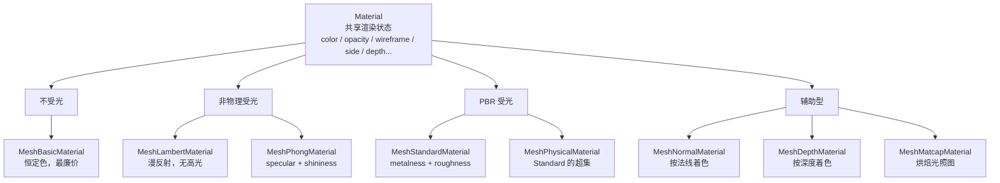

import { Canvas, Controls, Meta } from '@storybook/addon-docs/blocks';
import * as MaterialsStories from './materials-and-render-states.stories.js';

<Meta of={MaterialsStories} name="Docs" />

# 材质

`Material` 决定 [BufferGeometry](?path=/docs/geometry-and-buffergeometry--docs) 的顶点怎样写入颜色、深度和其他渲染通道。它在 [Mesh](?path=/docs/mesh-geometry-material--docs)（以及 Line、Points）上和 Geometry 配合，组成可渲染表面：改 Geometry 的形状不动表面规则，改 Material 才动表面规则。

四种判断先建立起来，后面选型和参数才不容易混：

- **选哪种 Material 先选受光模型。** 不受光的 `MeshBasicMaterial` 不响应任何 [Light](?path=/docs/light-objects--docs)；非物理受光的 `MeshLambertMaterial`（漫反射，无高光）和 `MeshPhongMaterial`（含 specular/shininess 高光）；PBR 受光的 `MeshStandardMaterial`（metalness/roughness，物理正确）和它的超集 `MeshPhysicalMaterial`；另有按法线着色的 `MeshNormalMaterial`、按深度着色的 `MeshDepthMaterial` 和用预烘焙 matcap 的 `MeshMatcapMaterial` 三种辅助型。
- **只有受光材质响应光。** 这条和 Light 一课直接挂钩：场景全黑先看材质，再看光源。`MeshBasicMaterial` 加多少光都不变。
- **所有 Material 共享一组渲染状态。** `color`、`map`、`transparent`+`opacity`、`wireframe`、`visible`、`side`、`depthTest`、`depthWrite`、`blending`、`toneMapped`、`vertexColors`、`flatShading`——它们不属于某一种受光模型，决定表面如何写入帧缓冲。
- **PBR 的深入（环境贴图、envMapIntensity、clearcoat、transmission、ior 等）留给 [PBR](?path=/docs/pbr-and-environment-maps--docs) 课。** 本课把 Standard/Physical 当作受光材质家族里的两档入口，讲到能识别边界即可。

纹理（贴图类型、UV、color space、wrap/filter）的完整体系留给[纹理](?path=/docs/textures-and-maps--docs)课；这里只用 `map` 一个槽说明材质与纹理的接口。



## 快速上手

最小闭环：受光材质 + 灯光 + 几何体。受光材质需要场景里有合适的 Light，否则表面会黑。

```js
const mesh = new THREE.Mesh(
  new THREE.IcosahedronGeometry(0.7, 0),
  new THREE.MeshStandardMaterial({ color: '#3d73d9', roughness: 0.5, metalness: 0.1 })
);
mesh.position.y = 0.7;
scene.add(mesh);

const key = new THREE.DirectionalLight('#ffffff', 3.0);
key.position.set(3, 5, 3);
scene.add(key, key.target);
scene.add(new THREE.HemisphereLight('#bdd7ff', '#4a3a2a', 1.2));
```

材质家族对照：

| 材质 | 受光 | 关键参数 | 典型用途 |
| --- | --- | --- | --- |
| `MeshBasicMaterial` | 否 | color, map | 恒定色、HUD、不受光的辅助对象 |
| `MeshLambertMaterial` | 是（漫反射，无高光） | color, emissive | 哑光表面：木材、布料、混凝土 |
| `MeshPhongMaterial` | 是（含 specular） | specular, shininess | 旧式高光表面：塑料、漆面 |
| `MeshStandardMaterial` | 是（PBR） | metalness, roughness | 现代 PBR 主力 |
| `MeshPhysicalMaterial` | 是（PBR 超集） | clearcoat, transmission, ior, sheen | 玻璃、车漆、皮肤等进阶边界 |
| `MeshNormalMaterial` | 否（按法线着色） | flatShading | 调试法线方向 |
| `MeshDepthMaterial` | 否（按深度着色） | depthPacking | 调试深度、生成深度贴图 |
| `MeshMatcapMaterial` | 否（烘焙光照） | matcap | 不需要光源就能呈现材质感 |

共享渲染状态默认值：

| 状态 | 默认值 | 影响什么 |
| --- | --- | --- |
| `color` | `0xffffff` | 与 `map` 相乘决定最终色 |
| `map` | `null` | 颜色贴图，决定表面纹理 |
| `transparent` | `false` | `true` 时进入透明渲染队列并按 depth 排序 |
| `opacity` | `1` | 配合 `transparent` 才有效 |
| `alphaTest` | `0` | 大于 0 时丢弃 alpha 低于阈值的片元 |
| `wireframe` | `false` | `true` 时画成线框 |
| `visible` | `true` | `false` 时完全不绘制 |
| `side` | `FrontSide` | 渲染哪一面：FrontSide / BackSide / DoubleSide |
| `depthTest` | `true` | `false` 时绘制不被深度缓冲挡住 |
| `depthWrite` | `true` | `false` 时不写深度，透明面常用 |
| `blending` | `NormalBlending` | 颜色混合方式（AdditiveBlending 等） |
| `vertexColors` | `false` | `true` 时按顶点色与 `color` 相乘 |
| `flatShading` | `false` | `true` 时不平滑法线，硬边低多边形风 |
| `toneMapped` | `true` | `false` 时不参与渲染器的色调映射 |

## MeshBasicMaterial

`MeshBasicMaterial` 不响应任何光源，按 `color * map` 给出恒定颜色。它是家族里最廉价、最稳定的一档：改光源强度、移动光源位置都不会改变它的画面。需要 HUD、纯色辅助对象、视口 gizmo，或在光源调试时换一个不受光材质先排除光照问题时，选它。

```js
new THREE.MeshBasicMaterial({ color: '#3d73d9' });
```

| 成员 | 默认值 | 说明 |
| --- | --- | --- |
| `color` | `0xffffff` | 与 `map` 相乘的恒定色 |
| `map` | `null` | 颜色贴图；alpha 通道需要配 `transparent` 或 `alphaTest` |
| `wireframe` | `false` | 线框模式 |

Basic 没有 `emissive`，因为本身就不依赖光照——它就是"自己发光"的等价。需要让受光材质也具备"不受光也能亮"的自发光时，改用 Lambert/Phong/Standard 并配 `emissive`。

## MeshLambertMaterial 与 MeshPhongMaterial

两种材质都属于非物理受光模型，开销低于 PBR，常用于轻量场景或与旧教程对接。

- **`MeshLambertMaterial`** 只算漫反射，没有 specular 高光。表面哑光（木材、布料、混凝土），默认 `emissive = 0x000000`，需要自发光时单独设置。
- **`MeshPhongMaterial`** 在 Lambert 基础上加了 Blinn-Phong 高光：`specular` 决定高光颜色（默认 `0x111111` 暗灰，调到白色满高光），`shininess` 决定高光锐度（默认 30，越大越集中越亮）。它支持 per-fragment 着色，开销比 Lambert 大但比 PBR 小。

```js
// Lambert：哑光
new THREE.MeshLambertMaterial({ color: '#7a4a2a' });

// Phong：带高光，shininess 越大高光越锐
new THREE.MeshPhongMaterial({
  color: '#7a4a2a',
  specular: '#ffffff',
  shininess: 90
});
```

调 `shininess` 和 specular 强度，观察高光锐度与亮度的变化：specular 强度为 0 时材质退化到接近 Lambert。

<Canvas of={MaterialsStories.MeshPhong} />

<Controls of={MaterialsStories.MeshPhong} />

Canvas 进入视口前 `200px` 启动，离开后暂停并保留最后一帧。Phong 用 Blinn-Phong 模型，光照效果不物理正确，但开销低、对低端硬件友好。

| 成员 | 默认值 | 说明 |
| --- | --- | --- |
| `specular` | `0x111111` | 高光颜色；黑则无高光 |
| `shininess` | `30` | 高光锐度，常用 10 ~ 200 |
| `emissive` | `0x000000` | 自发光色，与光照无关 |
| `map` / `normalMap` / `specularMap` | `null` | 各类贴图槽；纹理细节见[纹理](?path=/docs/textures-and-maps--docs)课 |

## MeshStandardMaterial

`MeshStandardMaterial` 是 three.js 的 PBR（基于物理的渲染）主力，用 `metalness`（金属度）和 `roughness`（粗糙度）两个参数表达表面属性。它的光照比 Phong 更准确，但开销也更大；要呈现金属感几乎离不开环境反射（`scene.environment` 或材质 `envMap`）。

```js
new THREE.MeshStandardMaterial({
  color: '#3d73d9',
  roughness: 0.4,
  metalness: 0.6
});
```

调 `metalness` 和 `roughness`，观察金属感与高光锐度的变化：`metalness = 1` 时表面以反射环境为主（没环境反射会全黑），`roughness = 0` 时高光极锐、`= 1` 时完全漫反射。

<Canvas of={MaterialsStories.MeshStandard} />

<Controls of={MaterialsStories.MeshStandard} />

Canvas 进入视口前 `200px` 启动，离开后暂停并保留最后一帧。范例用 `PMREMGenerator.fromScene(new RoomEnvironment())` 给 `scene.environment` 提供了一份室内环境反射——这是 PBR 金属面不黑的关键；环境贴图的完整体系（HDR 加载、prefilter、`envMapIntensity`、color management）见 [PBR](?path=/docs/pbr-and-environment-maps--docs)。

| 成员 | 默认值 | 说明 |
| --- | --- | --- |
| `metalness` | `0` | 0=电介质，1=纯金属；可用 `metalnessMap` 调制 |
| `roughness` | `1` | 0=镜面，1=完全漫反射 |
| `envMapIntensity` | `1` | 环境反射强度，详见 PBR 课 |
| `emissive` / `emissiveIntensity` | `0x000000` / `1` | 自发光，常用于屏幕、灯具 |
| `map` / `roughnessMap` / `metalnessMap` / `normalMap` / `aoMap` | `null` | PBR 各贴图槽；纹理细节见[纹理](?path=/docs/textures-and-maps--docs)课 |

## MeshPhysicalMaterial

`MeshPhysicalMaterial` 是 `MeshStandardMaterial` 的超集，在 metalness/roughness 之外提供 `clearcoat`（清漆）、`transmission`（透射）、`ior`（折射率）、`sheen`（织物光泽）、`specularIntensity`（镜面强度）等高级参数。它适合玻璃、车漆、皮肤、丝绸这类需要多层或透射的边界材质，开销也最大。

```js
new THREE.MeshPhysicalMaterial({
  color: '#b8d9f0',
  roughness: 0.05,
  transmission: 0.9,   // 透射：玻璃
  thickness: 0.5,      // 厚度：影响折射
  ior: 1.5
});
```

| 成员 | 默认值 | 说明 |
| --- | --- | --- |
| `clearcoat` | `0` | 0~1 清漆层强度；车漆、漆面 |
| `clearcoatRoughness` | `0` | 清漆粗糙度 |
| `transmission` | `0` | 0~1 透射；玻璃需要接近 1，并设 `transparent` |
| `thickness` | `0` | 透射材质的厚度 |
| `ior` | `1.5` | 折射率，水 1.33，玻璃 1.5，钻石 2.4 |
| `sheen` / `sheenColor` / `sheenRoughness` | `0` / 白 / `1` | 织物光泽 |
| `attenuationDistance` / `attenuationColor` | `Infinity` / 白 | 透射光的衰减 |

`clearcoat`、`transmission`、`sheen` 等参数的完整调参实践、与 tone mapping 和 environment map 的配合见 [PBR](?path=/docs/pbr-and-environment-maps--docs)；本课只需要知道它们存在并位于 Physical 的扩展槽里。

## 辅助型材质

三种不依赖光照模型的辅助材质，常用于调试或特殊视觉风格：

| 材质 | 不响应光 | 关键参数 | 用途 |
| --- | --- | --- | --- |
| `MeshNormalMaterial` | 是 | `flatShading` | 按顶点法线着色（RGB ≈ 法向 XYZ），调试法线方向、检查平滑/硬边 |
| `MeshDepthMaterial` | 是 | `depthPacking` | 按片元到相机距离的深度着色，调试深度、生成深度贴图 |
| `MeshMatcapMaterial` | 是 | `matcap` | 用一张预烘焙的材质捕捉图直接给表面着色，不需要光源也能呈现材质感 |

```js
new THREE.MeshNormalMaterial({ flatShading: false });
new THREE.MeshDepthMaterial();           // depthPacking 默认 BasicDepthPacking
new THREE.MeshMatcapMaterial({ matcap: matcapTexture });
```

`MeshNormalMaterial` 在 [Helper](?path=/docs/helpers-and-debug-objects--docs) 一类的调试场景里很常见：法线方向不对时切到它就能立刻看出哪一面算错。Matcap 不响应光但需要一张 matcap 纹理，常用于概念图、低开销的角色 viewer。

## 颜色、贴图与顶点色

最终片元色由几路来源叠加：

| 来源 | 默认值 | 与谁相乘 |
| --- | --- | --- |
| `material.color` | `0xffffff` | 与 `map` 相乘 |
| `material.map` | `null` | 颜色贴图（应设 `SRGBColorSpace`） |
| `geometry.attributes.color` + `material.vertexColors` | `false` | 启用后按顶点色与上述结果相乘 |
| `material.emissive`（Lambert/Phong/Standard/Physical） | `0x000000` | 与光照无关的自发光，最后叠加上去 |

```js
// color 与 map 相乘：纯白时贴图按原色显示，调暗 color 整体压暗
new THREE.MeshStandardMaterial({ color: '#ffffff', map: texture });

// 顶点色：开启后每顶点色调制整个表面
geometry.setAttribute('color', new THREE.Float32BufferAttribute(colors, 3));
material.vertexColors = true;
```

贴图类型（`map`、`normalMap`、`roughnessMap`、`metalnessMap`、`emissiveMap` 等）和它们的 color space、wrap/filter、UV 体系见[纹理](?path=/docs/textures-and-maps--docs)课；这里只把 `map` 作为材质与纹理的接口说明。

## 透明、深度与混合

`transparent` + `opacity` + `alphaTest` + `depthTest`/`depthWrite` + `blending` 这一组是材质渲染状态里最容易踩坑的部分：

- **`transparent`（默认 `false`）：** 开启后材质进入透明渲染队列，renderer 按对象 depth 从远到近排序后再绘制，让背后对象透过它显示。
- **`opacity`（默认 `1`）：** 只在 `transparent = true` 时才有意义；`transparent = false` 时改成小于 1 的值，画面通常不对（不进排序队列）。
- **`alphaTest`（默认 `0`）：** 大于 0 时片元 alpha 低于阈值的直接丢弃，不进透明队列，能写出干净的硬边缘（贴图叶子、UI 精灵的常见做法）。
- **`depthTest`（默认 `true`）：** 决定绘制时是否被深度缓冲挡住；`false` 时该材质不被已有几何挡住。
- **`depthWrite`（默认 `true`）：** 决定绘制后是否写入深度。多个半透明物体交叠时设 `false`，否则近处透明面会"挖掉"远处透明面，出现黑色或错位接缝。
- **`blending`（默认 `NormalBlending`）：** 决定片元色如何与帧缓冲里的已有颜色合成；`AdditiveBlending`（加法混合）常做发光、火焰、粒子。

```js
// 半透明：基础组合
new THREE.MeshStandardMaterial({
  color: '#3d73d9',
  transparent: true,
  opacity: 0.6,
  depthWrite: false   // 多个透明面交叠时推荐
});

// 硬边缘（贴图 alpha）：不需要 transparent
new THREE.MeshBasicMaterial({
  map: leafTexture,
  alphaTest: 0.5,
  side: THREE.DoubleSide
});
```

切 `opacity` / `alphaTest` / `depthWrite`，观察 3 个交错半透明球之间的"挖洞"伪影：`alphaTest` 大于 0 时低于阈值的片元直接消失；`depthWrite = false` 让中间球前后平移时不再"切掉"两侧球。

<Canvas of={MaterialsStories.Transparency} />

<Controls of={MaterialsStories.Transparency} />

Canvas 进入视口前 `200px` 启动，离开后暂停并保留最后一帧。切换 `transparent` 会改变 shader 路径，所以范例里改完 `transparent` 会把 `material.needsUpdate` 设为 `true`；资源生命周期见 [Mesh](?path=/docs/mesh-geometry-material--docs)。

## 线框、平面着色与面方向

`wireframe`、`flatShading` 和 `side` 这三个开关在所有受光材质上行为一致，决定表面"长什么样"：

| 状态 | 默认值 | 行为 |
| --- | --- | --- |
| `wireframe` | `false` | `true` 时把三角形画成线段（边框/调试），与 LineSegments 的线框在来源上不同 |
| `flatShading` | `false` | `true` 时不按顶点法线平滑插值，每个三角形一个法线，呈现低多边形硬边风 |
| `side` | `FrontSide` | FrontSide 只画正面，BackSide 只画背面，DoubleSide 两面都画（射线拾取也响应） |

```js
// 低多边形风格：硬边 + 法线着色
new THREE.MeshStandardMaterial({ flatShading: true, color: '#3d73d9' });

// 双面：单面平面从背面也能看到
new THREE.MeshBasicMaterial({ side: THREE.DoubleSide });
```

`wireframe = true` 时画面看到的"线"是把每个三角形的三条边都画出来，密度高；要只画几何的轮廓边应改用 [EdgesGeometry + LineSegments](?path=/docs/geometry-and-buffergeometry--docs)，两者来源不同。

`side` 还会影响 `Raycaster.intersectObject` 的命中：默认 FrontSide 从背面拾取不到平面，要 DoubleSide 或反向射线才能命中，详见 [Mesh](?path=/docs/mesh-geometry-material--docs) 的射线与裁剪。

## 类型选型

横向对照器：同一 TorusKnot + 同一光源，切换 5 种材质，观察受光/高光/无光差异。Basic 不响应光（再加光也不变），Normal 按法线着色也不响应光，Lambert 漫反射无高光，Phong 带高光，Standard 是 PBR。

<Canvas of={MaterialsStories.MaterialFamily} />

<Controls of={MaterialsStories.MaterialFamily} />

Canvas 进入视口前 `200px` 启动，离开后暂停并保留最后一帧。这是补充对照入口；各成员的关键参数（Phong 的 `shininess`、Standard 的 `metalness`/`roughness`、透明组合）已在各自小节单独提供主范例。

选型清单：

- **不需要光照** → `MeshBasicMaterial`。
- **轻量哑光** → `MeshLambertMaterial`。
- **轻量高光** → `MeshPhongMaterial`。
- **PBR 主力** → `MeshStandardMaterial`（需要环境反射才能呈现金属）。
- **玻璃/车漆/皮肤等透射或多层** → `MeshPhysicalMaterial`。
- **调试法线** → `MeshNormalMaterial`。
- **不需要光源但有材质感** → `MeshMatcapMaterial`。

## 最佳实践

- 选材质先选受光模型：确认是否需要响应光、是否需要 PBR，再回到具体类型。
- 切换 `transparent` 后把 `material.needsUpdate = true`，shader 路径才会重编。
- 多个半透明物体交叠时 `depthWrite = false`，避免近处透明面挖掉远处。
- 金属感依赖环境反射：用 `MeshStandardMaterial`/`MeshPhysicalMaterial` 时给 `scene.environment` 提供反射，否则 `metalness = 1` 会全黑。
- 受光材质配 [Light](?path=/docs/light-objects--docs)；不要试图给 `MeshBasicMaterial` 加光，它不响应。
- 共享 material 时先 `clone()` 再单独改 `color` / `opacity` 等属性，否则会联动。
- 释放资源时分别 dispose geometry、material 和它引用的 Texture；详见 [Mesh](?path=/docs/mesh-geometry-material--docs)。
- 旧教程的 Phong/Lambert 写法仍可用，但光照强度需要按 r155+ 物理模式重新标定（详见 [Light](?path=/docs/light-objects--docs)）。

## 常见问题

- 为什么材质看起来全黑？
  先看材质类型：Basic/Normal/Matcap 不响应光，需要靠 `color` / 法线 / matcap 显示；Standard/Physical 等受光材质需要场景里有合适 Light，且金属感依赖环境反射（`metalness` 高时尤其明显）。
- 为什么 `MeshStandardMaterial` 设 `metalness = 1` 后表面变黑？
  金属表面靠反射环境出颜色，没有 `scene.environment` 或 `material.envMap` 时无内容可反射。用 `PMREMGenerator` 生成环境反射，或降低 `metalness`。
- 为什么 `opacity` 改成 0.5 后画面不对（透明物体没透过去）？
  `opacity` 小于 1 必须同时 `transparent = true`，renderer 才会把它放进透明排序队列。只改 `opacity` 不开 `transparent` 通常渲染错误。
- 为什么多个半透明物体交叠处出现黑色或错位？
  透明物体默认 `depthWrite = true`，近处透明面把远处透明面从深度缓冲里"挖掉"了。把透明材质的 `depthWrite` 设为 `false`。
- 为什么带 alpha 的贴图边缘有锯齿或半透明 artifacts？
  用 `alphaTest`（如 `0.5`）丢弃低 alpha 片元，写边缘干净；它不进透明排序队列，也不需要 `transparent`。需要真正的半透明渐变时再用 `transparent` + `opacity`。
- 为什么从背面看不到平面？
  默认 `side = FrontSide`，只渲染法线方向的正向面。改成 `THREE.DoubleSide` 让两面都画；拾取也要相应调整。
- 为什么 `wireframe` 看到的线比 `EdgesGeometry` 多？
  `wireframe` 把每个三角形的三条边都画出来，密度高；`EdgesGeometry` 只保留夹角超过阈值的边，做轮廓线选它。
- 切换 `transparent` 后画面没变？
  `transparent` 决定 shader 路径，切完要把 `material.needsUpdate = true`，否则还跑旧 shader。

## 总结回顾

摘要：

Material 决定 BufferGeometry 的顶点怎样写入帧缓冲。家族按受光模型分档：`MeshBasicMaterial` 不受光，`MeshLambertMaterial`/`MeshPhongMaterial` 是非物理受光（无/有高光），`MeshStandardMaterial`/`MeshPhysicalMaterial` 是 PBR（metalness/roughness），`MeshNormalMaterial`/`MeshMatcapMaterial`/`MeshDepthMaterial` 是辅助型。所有 Material 共享一组渲染状态：`color`、`map`、`vertexColors` 决定色源；`transparent` + `opacity` + `alphaTest` + `depthWrite` + `blending` 决定透明；`wireframe`、`flatShading`、`side` 决定表面外观。PBR 金属面依赖环境反射，深度细节（`envMap`、`clearcoat`、`transmission`、`ior` 等）见 PBR 课。

一句话：

> 选 Material 先选受光模型——不受光、非物理受光、PBR、辅助型——再让 color、透明、深度和面方向这组共享状态决定它如何写入画面。

知识要点：

- Material 家族按受光模型分成哪几档？哪些响应光，哪些不响应？
- `MeshStandardMaterial` 设 `metalness = 1` 时为什么需要环境反射？
- `transparent` / `opacity` / `alphaTest` / `depthWrite` 这一组分别解决什么透明问题？
- `wireframe` / `flatShading` / `side` 这三个共享开关分别影响什么？
- 切换 `transparent` 后为什么必须把 `material.needsUpdate` 设为 `true`？
- `MeshPhysicalMaterial` 在 `MeshStandardMaterial` 之上扩展了哪些边界参数？深入在哪里讲？

## 参考资料

- [Three.js Manual：Materials](https://threejs.org/manual/en/materials.html)
- [Three.js Docs：Material](https://threejs.org/docs/pages/Material.html)
- [Three.js Docs：MeshBasicMaterial](https://threejs.org/docs/pages/MeshBasicMaterial.html)
- [Three.js Docs：MeshLambertMaterial](https://threejs.org/docs/pages/MeshLambertMaterial.html)
- [Three.js Docs：MeshPhongMaterial](https://threejs.org/docs/pages/MeshPhongMaterial.html)
- [Three.js Docs：MeshStandardMaterial](https://threejs.org/docs/pages/MeshStandardMaterial.html)
- [Three.js Docs：MeshPhysicalMaterial](https://threejs.org/docs/pages/MeshPhysicalMaterial.html)
- [Three.js Docs：MeshNormalMaterial](https://threejs.org/docs/pages/MeshNormalMaterial.html)
- [Three.js Docs：MeshDepthMaterial](https://threejs.org/docs/pages/MeshDepthMaterial.html)
- [Three.js Docs：MeshMatcapMaterial](https://threejs.org/docs/pages/MeshMatcapMaterial.html)
- [Three.js Migration Guide](https://github.com/mrdoob/three.js/wiki/Migration-Guide)
