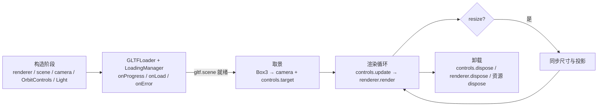

import { Canvas, Controls, Meta } from '@storybook/addon-docs/blocks';
import * as ViewerStories from './minimal-model-viewer.stories.js';

<Meta of={ViewerStories} name="Docs" />

# 查看器

最小查看器不是新概念，而是把已经分开练过的几件事按一条生命周期串起来：`WebGLRenderer` 画像素、`Scene` 装对象、`PerspectiveCamera` 决定视锥、`OrbitControls` 接管输入、`Light` 照亮受光材质、`GLTFLoader` 把模型解析成对象图、`ResizeObserver` 同步画布尺寸。每一件都在自己的课里讲过；本课只回答"它们怎样共同形成一个可用的查看器"。

组合的难点不在任何单个组件，而在两件事：**生命周期顺序**和**更新时机**。模型加载是异步的，加载完之前读 `gltf.scene` 拿不到东西，加载完之后才能用它的包围盒给相机和 `controls.target` 取景；resize 同步必须把 renderer 尺寸、相机 `aspect` 和 `updateProjectionMatrix()` 一起完成；阻尼、自动旋转或场景动画开启后，控制器必须每帧 `update()`，否则松手后没有任何推进。



各组件的细节这里不再重讲：相机和投影矩阵见 [相机](?path=/docs/camera--docs)，控制器选型和更新契约见 [相机控制器](?path=/docs/camera-controls--docs)，受光材质与光照选型见 [Light](?path=/docs/light-objects--docs)，glTF 加载、压缩扩展和模型 `dispose` 见 [模型](?path=/docs/gltf-and-gltfloader--docs)，秒制 `delta` 见 [循环与时间](?path=/docs/clock-and-animation-loop--docs)，画布尺寸与 `setPixelRatio` 见 [坐标与尺寸](?path=/docs/coordinate-system-and-units--docs)。本课的范例把上述八件事组合成一个可运行查看器：内存里用 `GLTFExporter` 生成 GLB 喂给 `GLTFLoader`，加载完成后自动取景并接入 OrbitControls，本页有两个 Canvas，进入视口前后 `200px` 才运行，离屏暂停并保留最后一帧。

## 快速上手

最小查看器的骨架：构造 → 加载 → 取景 → 渲染循环。每一段都不可省，顺序也不能随意换。

```js
import * as THREE from 'three';
import { OrbitControls } from 'three/addons/controls/OrbitControls.js';
import { GLTFLoader } from 'three/addons/loaders/GLTFLoader.js';

// 1. 构造阶段：renderer、scene、camera、controls、Light 一次性建好。
const renderer = new THREE.WebGLRenderer({ canvas, antialias: true });
renderer.setPixelRatio(Math.min(window.devicePixelRatio, 2));
renderer.outputColorSpace = THREE.SRGBColorSpace;

const scene = new THREE.Scene();
scene.add(new THREE.HemisphereLight('#ffffff', '#7c8a82', 1.0));

const key = new THREE.DirectionalLight('#ffffff', 2.2);
key.position.set(3, 5, 4);
scene.add(key);

const camera = new THREE.PerspectiveCamera(38, 1, 0.1, 200);

const controls = new OrbitControls(camera, renderer.domElement);
controls.enableDamping = true;
controls.target.set(0, 1, 0);
controls.update();

// 2. 加载阶段：LoadingManager 汇报进度与错误；loadAsync 解析完才能读 gltf.scene。
const manager = new THREE.LoadingManager();
manager.onProgress = (url, loaded, total) => {
  console.log(`进度：${Math.round((loaded / total) * 100)}%`);
};
manager.onError = (url) => console.error(`依赖加载失败：${url}`);

const loader = new GLTFLoader(manager);

try {
  const gltf = await loader.loadAsync('/models/sample.glb');
  scene.add(gltf.scene);

  // 3. 取景阶段：用包围盒给相机和 controls.target 选位置。
  const box = new THREE.Box3().setFromObject(gltf.scene);
  const center = box.getCenter(new THREE.Vector3());
  const size = box.getSize(new THREE.Vector3());
  const extent = Math.max(size.x, size.y, size.z);
  const halfFov = THREE.MathUtils.degToRad(camera.fov) / 2;
  const distance = (extent / 2 / Math.tan(halfFov)) * 1.6;

  controls.target.copy(center);
  camera.position.copy(center).add(new THREE.Vector3(1, 0.55, 1).normalize().multiplyScalar(distance));
  controls.update();
} catch (err) {
  console.error('glTF 加载失败：', err);
}

// 4. 渲染循环 + resize 同步：阻尼或自动旋转开启时逐帧 controls.update。
function resize() {
  const width = renderer.domElement.clientWidth;
  const height = renderer.domElement.clientHeight;
  renderer.setSize(width, height, false);
  camera.aspect = width / height;
  camera.updateProjectionMatrix();
}
new ResizeObserver(resize).observe(renderer.domElement.parentElement);
resize();

renderer.setAnimationLoop(() => {
  controls.update();
  renderer.render(scene, camera);
});
```

下面的 Canvas 跑的就是这段骨架。它用 `GLTFExporter` 在内存里把示例模型导出成 GLB blob URL 喂给 `GLTFLoader`，不依赖外部网络；通过参数面板可以切换加载源（验证 `LoadingManager` 三条路径）、切换光照（看 PBR 材质对光的依赖）、开关阻尼和自动旋转（验证控制器的更新契约）。

<Canvas of={ViewerStories.ViewerCanvas} />

<Controls of={ViewerStories.ViewerCanvas} />

| 输入或状态 | 默认值 / 常用起点 | 改变后要注意什么 |
| --- | --- | --- |
| 构造顺序 | renderer → scene → camera → controls → loader | 控制器要 `renderer.domElement` 和 camera，必须在它们之后建 |
| `LoadingManager.onProgress` | `loaded/total` 字节比 | 子加载器（纹理等）触发；不一定每帧都回调 |
| `LoadingManager.onError` | 单个依赖失败 | 主 URL 失败由 `loadAsync` 的 `catch` 捕获 |
| `Box3.setFromObject` | 加载完成后调用 | 加载完之前 `gltf.scene` 是空，包围盒是空的 |
| `controls.target` | 默认 `(0, 0, 0)` | 取景时复制成包围盒中心，否则旋转中心不在模型上 |
| `controls.update()` | 改 target、相机或开启阻尼/自动旋转后调用 | 不调用，控制器内部球坐标与相机当前状态不同步 |
| `renderer.setSize(w, h, false)` | `false` 保留 CSS 尺寸 | 与 `camera.aspect` 和 `updateProjectionMatrix()` 同一组完成 |
| `dispose` 顺序 | controls → renderer → 模型资源 | 模型资源按 geometry / material / texture 三类，并用 `Set` 去重 |

## 加载状态反馈

`GLTFLoader.loadAsync` 是真实异步：返回 `Promise`，解析完成前 `gltf.scene` 是 `undefined`。等待期间用户面对的是一块空白画布；要让"加载 → 完成 → 失败"可观察，把进度和错误交给 `LoadingManager`。

```js
const manager = new THREE.LoadingManager();
manager.onProgress = (url, loaded, total) => {
  // loaded / total 是字节数，相除得到 0~1 的进度比。
  setProgress(Math.round((loaded / total) * 100));
};
manager.onError = (url) => {
  // 单个依赖文件（.bin、贴图）失败时触发；主 URL 失败走 loadAsync 的 catch。
  console.error(`依赖加载失败：${url}`);
};
manager.onLoad = () => {
  // 所有依赖文件全部就绪；通常在这里收尾加载 UI。
};

const loader = new GLTFLoader(manager);
```

三条回调各自覆盖不同的失败路径，不要只依赖 `loadAsync` 的 `catch`：

| 触发位置 | 触发时机 | 适合做什么 |
| --- | --- | --- |
| `manager.onProgress(url, loaded, total)` | 每个文件下载过程中 | 更新进度条；`total` 未知时为 `0`，要兜底 |
| `manager.onError(url)` | 单个依赖文件加载失败 | 记录哪个文件失败，提示用户重试 |
| `manager.onLoad()` | 所有依赖文件就绪 | 收尾加载 UI，开启交互 |
| `loadAsync` 的 `catch(err)` | 主 URL 或解析阶段失败 | 区分 404、解析失败和扩展缺失（详见 [模型](?path=/docs/gltf-and-gltfloader--docs)） |

切换上方 Canvas 的"加载源"为 `missing` 或 `corrupt`，可以在读数里看到状态、进度和错误字段同步变化：`missing` 触发 `loadAsync` 的 `catch`（HTTP 404），`corrupt` 在二进制头或 JSON 解析阶段抛错；正确路径下错误字段为 `—`，进度从 `0%` 推进到 `100%`。

不需要进度时也可以省掉 `LoadingManager`，直接 `await loader.loadAsync(url)`；这是一种合法的简化，但生产环境推荐至少把进度和错误反馈做出来，否则用户无法区分"在加载"和"加载失败"。

## 取景与 target 同步

模型加载成功不代表它就在相机视野里。glTF 模型的局部坐标系由导出器决定：可能以原点为枢轴，也可能以脚底、几何中心或随机点为枢轴；尺度也可能是厘米、米或任意单位。直接挂进场景，相机看到的可能是空画面、远处一个小点，或一个被截断的局部。

正确做法：加载完成后用 `Box3.setFromObject(gltf.scene)` 在世界坐标系里算包围盒，再用它的中心和尺寸给相机和 `controls.target` 取景。

```js
const box = new THREE.Box3().setFromObject(gltf.scene);
const center = box.getCenter(new THREE.Vector3());
const size = box.getSize(new THREE.Vector3());

// 取最大边作为距离计算基准，避免细长模型在某一方向溢出画面。
const extent = Math.max(size.x, size.y, size.z);
const halfFov = THREE.MathUtils.degToRad(camera.fov) / 2;
const distance = (extent / 2 / Math.tan(halfFov)) * 1.6; // 1.6 留出余量

controls.target.copy(center);
camera.position.copy(center).add(
  new THREE.Vector3(1, 0.55, 1).normalize().multiplyScalar(distance)
);
camera.near = Math.max(distance / 1000, 0.01);
camera.far = distance * 100;
camera.updateProjectionMatrix();
controls.update();
```

这里有两件容易漏的事，漏掉任一件都会让交互失去焦点：

- **必须更新 `controls.target`。** 相机挪到模型附近，但 `OrbitControls` 仍绕旧的 `target`（默认原点）旋转；拖动时模型会"滑出画面"，因为旋转中心不在模型上。
- **必须调用 `controls.update()`。** 控制器内部保存的球坐标、距离与 `target` 是独立的；不调用就不同步，第一次交互会跳回旧位置。

下面的 Canvas 把三种取景策略放在一起对照：`fit` 同时更新相机和 `target`，`no-fit` 故意停在构造时的默认位置，`fit-no-target` 只挪相机不更新 `target`。读数里的"模型中心"和"`controls.target`"会暴露两者的偏差，"`target` 在模型上"在 `fit` 下是"是"，在 `fit-no-target` 下显示偏移量；切换到 `fit-no-target` 后再拖动画布，可以观察到模型绕一个不在它身上的点旋转。

<Canvas of={ViewerStories.ViewerFraming} />

<Controls of={ViewerStories.ViewerFraming} />

包围盒除了取景，也是诊断"模型为什么看不见"的第一手工具：先打印 `box.min`、`box.max` 和 `size`，确认模型大小是否在合理范围（不要小于相机 `near`，也不要大到塞满整个视锥），再看相机是否在 `box` 外面。

## 更新时机与协作顺序

查看器不是"建好就完事"。组件之间有先后依赖，更新调用也有固定时机；放错位置会让正确的代码产生错误的画面。

| 操作 | 触发时机 | 必须紧接着做什么 | 漏掉的可见结果 |
| --- | --- | --- | --- |
| 改 `camera.position` 或 `controls.target` | 取景、跳转视角、响应用户输入 | `controls.update()` | 控制器球坐标不同步，第一次拖动会跳 |
| 改 `camera.fov` / `aspect` / `near` / `far` | resize、视角切换、取景 | `camera.updateProjectionMatrix()` | 投影矩阵停在旧值，画面拉伸或裁剪错误 |
| 改 renderer 显示尺寸 | resize、布局变化 | `renderer.setSize(w, h, false)` + 上面的相机更新 | 旧 drawing buffer 被 CSS 拉伸，画面模糊 |
| `enableDamping` 或 `autoRotate` 设为 `true` | 配置控制器 | 渲染循环里逐帧 `controls.update(delta)` | 松手后没有惯性，自动旋转不动 |
| `scene.add(gltf.scene)` | 加载完成 | 先 `Box3.setFromObject` 再取景，最后才渲染 | 模型可能完全不在视野里 |

resize 三件套——`renderer.setSize(width, height, false)`、`camera.aspect = width / height`、`camera.updateProjectionMatrix()`——必须用同一组非零宽高一起完成。它们之间没有"先做哪一个"的选择，缺任何一件都会留下可由尺寸和矩阵读数定位的模糊或拉伸。详细解释和 `setPixelRatio` 的取舍见 [坐标与尺寸](?path=/docs/coordinate-system-and-units--docs)。

渲染循环里 `controls.update()` 的位置在 `renderer.render()` 之前：先把控制器推进到当前帧的状态，再画。阻尼和自动旋转都依赖这个顺序；省掉 `update` 后两者都不会推进。秒制 `delta` 用于控制器内部的速度积分（`FlyControls`、`FirstPersonControls`、`OrbitControls.autoRotateSpeed` 在某些版本下），让动画与刷新率解耦。

## 卸载与资源回收

查看器卸载（路由切换、组件销毁、重建 renderer）时，三类资源要按顺序释放：DOM 监听、WebGL 上下文、模型上传到 GPU 的资源。`scene.remove(model)` 只断开场景树，不动显存；完整释放需要遍历 `dispose`。

```js
function disposeViewer(controls, renderer, modelRoot) {
  // 1. 先停控制器：移除 DOM 监听，避免释放后的 renderer.domElement 仍响应输入。
  controls.dispose();

  // 2. 停渲染循环：renderer.dispose() 后画布不可再画。
  renderer.setAnimationLoop(null);

  // 3. 释放模型资源：按 geometry / material / texture 三类 dispose，用 Set 去重共享资源。
  modelRoot.traverse((child) => {
    if (child.geometry) child.geometry.dispose();

    const material = child.material;
    const materials = Array.isArray(material) ? material : [material];
    materials.forEach((material) => {
      if (!material) return;
      for (const value of Object.values(material)) {
        if (value && value.isTexture) value.dispose();
      }
      material.dispose();
    });
  });

  // 4. 最后释放 WebGL 上下文。
  renderer.dispose();
}
```

`ResizeObserver`、`IntersectionObserver`、键盘监听和应用自己注册的事件也要在同一个卸载流程里 `disconnect()` 和 `removeEventListener()`。完整的 dispose 策略和性能权衡（共享资源、引用计数、按需渲染）见 [性能](?path=/docs/performance-and-disposal--docs)。

## 最佳实践

- 构造顺序固定为 renderer → scene → camera → controls → loader；控制器依赖前两者，建反了会拿到空对象。
- 模型加载用 `LoadingManager` 至少把 `onProgress`、`onError` 和 `onLoad` 接上，让用户能区分"在加载"和"加载失败"。
- 加载完成后立刻 `Box3.setFromObject(gltf.scene)`，把模型中心和尺寸作为相机和 `controls.target` 的取景依据；不要假设模型以原点为中心。
- 取景时同时更新 `camera.position`、`controls.target` 和 `camera.near/far`，最后调用 `controls.update()` 与 `camera.updateProjectionMatrix()`。
- resize 用同一组非零宽高更新 renderer 尺寸、相机 `aspect` 和投影矩阵；用 `ResizeObserver` 监听真正控制布局的容器，不要只监听 `window.resize`。
- 渲染循环里 `controls.update()` 放在 `renderer.render()` 之前；阻尼、自动旋转或场景动画开启后逐帧调用。
- 一页同时挂多个 Canvas 时，用 `IntersectionObserver` 让画布只在视口附近运行，离屏暂停并保留最后一帧，限制同时活跃的 WebGL 上下文数量。
- 卸载顺序：`controls.dispose()` → 停渲染循环 → 模型资源 `dispose` → `renderer.dispose()`；observer 和事件监听配对清理。

## 常见问题

- 为什么模型加载成功却完全看不见？
  先 `Box3.setFromObject(gltf.scene)` 打印 `size` 和 `center`，确认模型是否过大、过远或不在相机视锥里；再用包围盒取景。也可能是场景缺少光照，glTF 的 PBR 材质没有环境光时会偏暗。
- 为什么拖动 OrbitControls 时模型会"滑出画面"？
  取景时只挪了相机，没更新 `controls.target`，旋转中心仍在原点。把 `controls.target` 复制成包围盒中心，再调用 `controls.update()`。
- 为什么加载进度条卡在 0% 不动？
  `LoadingManager.onProgress` 的 `total` 在服务器不返回 `Content-Length` 时为 `0`；按 `total > 0` 兜底，否则只显示"加载中"而不显示百分比。
- 为什么 `manager.onError` 没触发，但加载还是失败了？
  主 URL 失败（404、解析错误、扩展缺失）由 `loadAsync` 的 `catch` 捕获；`manager.onError` 只覆盖单个依赖文件（`.bin`、贴图）。两条路径都要接。
- 为什么 resize 后画面被拉伸？
  resize 三件套漏了一件：只改了 `renderer.setSize` 没更新 `camera.aspect`，或更新了 `aspect` 没调用 `updateProjectionMatrix()`。三件事必须用同一组宽高一起完成。
- 为什么开启阻尼后松手就停了？
  阻尼开启后渲染循环里必须逐帧 `controls.update()`；`enableDamping = true` 只打开开关，不会自动启动更新。
- 为什么同一页面挂多个查看器会掉帧或丢 WebGL 上下文？
  浏览器对 WebGL 上下文数量有限制（通常 16 个）。让离屏 Canvas 暂停渲染（`IntersectionObserver`），并在卸载时 `renderer.dispose()` 释放上下文。
- 为什么路由切换后旧查看器还在响应鼠标？
  卸载时漏了 `controls.dispose()`；它移除控制器注册的 DOM 监听，是卸载流程的第一步。

## 总结回顾

摘要：

最小查看器把 renderer、scene、camera、OrbitControls、Light、GLTFLoader 和 resize 按一条生命周期串起来：构造阶段一次性建好所有组件，加载阶段用 `LoadingManager` 反馈进度与错误，加载完成后用 `Box3` 给相机和 `controls.target` 取景，渲染循环里在 `renderer.render()` 之前调用 `controls.update()`，resize 时用同一组宽高同步 renderer 尺寸、相机 `aspect` 和投影矩阵。卸载顺序为 `controls.dispose()` → 停渲染循环 → 模型资源 `dispose` → `renderer.dispose()`。每件组件的能力都在自己的课里讲过，本课的难点是它们的协作时机。

一句话：

> 加载完才能取景，取景时同时更新 camera 与 `controls.target`，每帧先 `controls.update()` 再 render，resize 三件套一起做。

知识要点：

- 一个最小查看器至少包含哪些组件？构造阶段的顺序为什么固定？
- `LoadingManager` 的 `onProgress`、`onError`、`onLoad` 各覆盖什么路径？它们和 `loadAsync` 的 `catch` 怎样分工？
- 加载成功后为什么必须用 `Box3.setFromObject` 取景？只挪相机不更新 `controls.target` 会发生什么？
- 取景后必须调用哪两个更新？分别同步什么？
- resize 三件套是什么？为什么必须用同一组宽高一起完成？
- 阻尼或自动旋转开启后，渲染循环里必须做什么？
- 卸载一个查看器要释放哪几类资源？顺序如何？

## 参考资料

- [Three.js Manual：Loading a 3D model](https://threejs.org/manual/en/load-gltf.html)
- [Three.js Manual：Lights](https://threejs.org/manual/en/lights.html)
- [Three.js Manual：Responsive Design](https://threejs.org/manual/en/responsive.html)
- [Three.js Docs：WebGLRenderer](https://threejs.org/docs/pages/WebGLRenderer.html)
- [Three.js Docs：PerspectiveCamera](https://threejs.org/docs/pages/PerspectiveCamera.html)
- [Three.js Docs：LoadingManager](https://threejs.org/docs/pages/loaders/LoadingManager.html)
- [Three.js Docs：GLTFLoader](https://threejs.org/docs/pages/examples/loaders/GLTFLoader.html)
- [Three.js Docs：OrbitControls](https://threejs.org/docs/pages/OrbitControls.html)
- [Three.js Docs：Box3](https://threejs.org/docs/pages/Box3.html)
- [MDN：ResizeObserver](https://developer.mozilla.org/en-US/docs/Web/API/ResizeObserver)
- [MDN：IntersectionObserver](https://developer.mozilla.org/en-US/docs/Web/API/IntersectionObserver)
