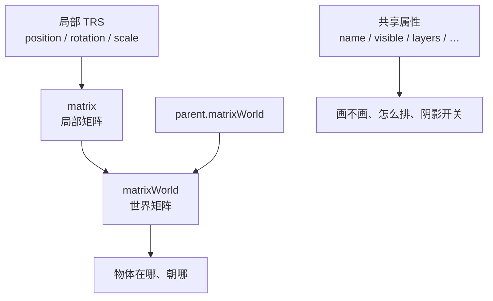

import { Canvas, Controls, Meta } from '@storybook/addon-docs/blocks';
import * as Object3DStories from './object3d-transform-hierarchy.stories.js';

<Meta of={Object3DStories} name="Docs" />

# Object3D

`Object3D` 是 three.js 场景树里几乎所有可变换对象的公共基类：`Mesh`、`Group`、`Camera`、`Light`、`Helper` 都继承它。它管两件事——**局部 TRS 如何沿父子链变成世界矩阵**，以及每个对象自带的 **name、可见性、层、排序、阴影开关** 等共享属性。



轴约定、世界单位与弧度见 [坐标与尺寸](?path=/docs/coordinate-system-and-units--docs)；本课在此之上讲清层级、矩阵更新、换父级与共享属性。

| 成员 | 默认 | 回查要点 |
| --- | --- | --- |
| `position` / `rotation` / `scale` | `(0,0,0)` / `(0,0,0)` / `(1,1,1)` | 局部值；相对 `parent` |
| `quaternion` | 单位四元数 | 与 `rotation` 自动同步 |
| `matrix` / `matrixWorld` | 单位矩阵 | 局部 / 世界；默认每帧由 TRS 重算 |
| `matrixAutoUpdate` | `true` | `false` 时改 TRS 后需 `updateMatrix()` |
| `parent` / `children` | `null` / `[]` | 最多一个父级；`add` 会脱离旧父级 |
| `name` / `userData` | `''` / `{}` | 查找与自定义数据；`userData` 勿存函数 |
| `visible` | `true` | `false` 隐藏自身与后代，但仍在树上 |
| `layers` | 第 0 层 | 与相机至少共一层才渲染 / 可被拾取 |
| `renderOrder` | `0` | 主要影响透明物体排序；Group 上会带动整组 |
| `castShadow` / `receiveShadow` | `false` | 对象侧开关；出影还需灯光与 `renderer.shadowMap` |
| `up` | `(0,1,0)` | 影响 `lookAt` 的上方向 |
| `frustumCulled` | `true` | 视锥外可跳过绘制 |
| `uuid` / `id` / `type` | 自动 | 身份与序列化；`id` 会话内唯一 |

## 快速上手

创建父子层级，改局部变换，再读世界坐标：

```js
const parent = new THREE.Object3D();
parent.position.set(1, 0, 0);
scene.add(parent);

const child = new THREE.Mesh(geometry, material);
child.position.set(2, 0, 0); // 相对 parent 的局部坐标
parent.add(child);

child.updateWorldMatrix(true, false);
const world = child.getWorldPosition(new THREE.Vector3());
// world ≈ (3, 0, 0)：父级平移 + 子级局部平移
```

## 父子层级

`add` 把对象挂进场景树；`remove` / `removeFromParent` / `clear` 拆除关系。一个对象最多一个 `parent`——再 `add` 到别处会先脱离旧父级。

```js
parent.add(child);
parent.remove(child);
child.removeFromParent();
parent.clear(); // 移除全部直属子对象
```

遍历用 `traverse`（含不可见）、`traverseVisible`（跳过 `visible=false` 子树）、`traverseAncestors`（只走祖先）。按名字查找可用 `getObjectByName`（依赖你先设好 `name`）。

开关挂载，或经 `pivot` 嵌套一层：读数里的 `child.parent` 与 `parent.children` 会变；未挂载时没有世界位置。

<Canvas of={Object3DStories.Hierarchy} />

<Controls of={Object3DStories.Hierarchy} />

## 局部变换

`position`、`rotation`（`Euler`，弧度）、`scale` 都是**相对父级**的局部 TRS；`quaternion` 与 `rotation` 保持同步。父级一变，子级局部值可以不动，世界结果却会变。

```js
child.position.set(2, 0, 0);
child.rotation.y = Math.PI / 4;
child.scale.setScalar(1.2);

child.rotateY(0.1);          // 在当前朝向上累加
child.translateOnAxis(axis, 1); // 沿局部轴平移
```

常用写法：

| 方法 | 作用 |
| --- | --- |
| `rotateX/Y/Z` / `rotateOnAxis` | 绕局部轴旋转（弧度） |
| `rotateOnWorldAxis` | 绕世界轴旋转 |
| `translateX/Y/Z` / `translateOnAxis` | 沿局部轴平移 |
| `applyMatrix4` / `applyQuaternion` | 把矩阵或四元数打进当前 TRS |
| `setRotationFromEuler` / `FromQuaternion` / `FromMatrix` / `FromAxisAngle` | 直接设定朝向 |

拖动父级平移、旋转或缩放：`child` 局部 `position` 保持 `(2, 0, 0)`，世界位置与棕色辅助线跟着变。

<Canvas of={Object3DStories.LocalTransform} />

<Controls of={Object3DStories.LocalTransform} />

## 旋转顺序

`rotation` 是欧拉角，按 `rotation.order`（默认 `'XYZ'`）依次绕轴旋转。多轴叠转时，不同顺序得到不同朝向；某一轴接近 ±90° 时，另外两轴可能挤到同一自由度——这就是万向节死锁。需要稳定插值或自由多轴旋转时，优先写 `quaternion`（或 `setRotationFromQuaternion`）。

```js
object.rotation.order = 'YXZ';
object.rotation.set(
  THREE.MathUtils.degToRad(90),
  THREE.MathUtils.degToRad(30),
  0
);
```

先保持 `XYZ`，把 `rotation.x` 拖到 ±90° 附近，再拧 `Y` / `Z`，观察指针与读数提示；换 `YXZ` 等顺序对比同一组角度。

<Canvas of={Object3DStories.RotationOrder} />

<Controls of={Object3DStories.RotationOrder} />

## 世界矩阵

引擎默认把局部 TRS 合成 `matrix`，再沿父级链乘成 `matrixWorld`。`matrixAutoUpdate === true`（默认）时每帧自动做这件事。关掉之后，改 `position` 只改属性，**不等于**矩阵已更新——画面与 `getWorldPosition` 都会落后，直到你调用 `updateMatrix()`（并保证世界矩阵也会更新）。

```js
object.matrixAutoUpdate = false;
object.position.x = 3;
object.updateMatrix();
object.updateWorldMatrix(true, false); // 先更新祖先，再更新自己
```

- `updateMatrix()`：只从当前 TRS 重算局部 `matrix`。
- `updateMatrixWorld(force)`：更新自己与后代的世界矩阵。
- `updateWorldMatrix(updateParents, updateChildren)`：更细的控制；读世界坐标前常用 `(true, false)`。

橙色半透明盒跟随 `position` 意图；蓝色实体盒跟随当前 `matrixWorld`。关闭 `matrixAutoUpdate` 且不手动更新时，两者会错开。

<Canvas of={Object3DStories.WorldMatrix} />

<Controls of={Object3DStories.WorldMatrix} />

## 局部与世界换算

跨空间读写时用这些 API（它们都依赖当前 `matrixWorld`）：

```js
object.updateWorldMatrix(true, false);

object.getWorldPosition(target);
object.getWorldQuaternion(target);
object.getWorldScale(target);
object.getWorldDirection(target); // 局部 +Z 在世界中的方向

object.localToWorld(vector); // 就地修改
object.worldToLocal(vector);
```

目标参数由调用方传入并复用，避免每帧 `new Vector3()`。轴、单位与“局部相对父级”的直觉见 [坐标与尺寸](?path=/docs/coordinate-system-and-units--docs)；本课实例见上方「局部变换」「世界矩阵」。

## 换父级

`add` 换父级时**保留局部 TRS**，世界位置通常会跳。`attach` 换父级时会改写局部 TRS，尽量**保持世界变换**（不支持祖先链上有非均匀缩放的场景）。

```js
// 局部不变 → 世界位置随新父级跳变
right.add(child);

// 世界尽量不变 → 局部被重算
right.attach(child);
```

先保持 child 在左侧绿点父级，再打开「换到 right」，分别用 `add` / `attach` 对比局部与世界读数。

<Canvas of={Object3DStories.Reparent} />

<Controls of={Object3DStories.Reparent} />

## 朝向

`lookAt` 让物体正面转向**世界空间**中的一点（随后可用 `getWorldDirection` 读取局部 `+Z` 的世界方向）；实际扭转还受 `up` 影响。父级带非均匀缩放时 `lookAt` 可能不符合预期。

```js
object.up.set(0, 1, 0); // 默认
object.lookAt(target.position); // target 是世界坐标
```

拖动目标球，圆锥尖端跟随；再把 `up` 切到 `+Z`，观察侧倾变化。

<Canvas of={Object3DStories.LookAt} />

<Controls of={Object3DStories.LookAt} />

## 共享属性

这些字段所有 `Object3D` 都有，和变换并列，决定“找得到谁、画不画、怎么排、阴影开关开没开”。

**身份与数据**

```js
mesh.name = 'hero';
mesh.userData = { role: 'player', hp: 3 };
scene.getObjectByName('hero');
```

`userData` 可放自定义信息，但不要放函数——`clone` / `toJSON` 不会按你期望保留它们。`id` / `uuid` 由引擎生成，适合内部关联。

**可见性与层**

```js
mesh.visible = false; // 自身与后代都不画，但仍在 children 里
mesh.layers.set(1);   // 只属于第 1 层
camera.layers.enable(1); // 相机至少与物体共一层才渲染
```

`visible=false` ≠ `remove`：前者还在树上，后者脱离父子关系。`layers` 同时影响渲染与 `Raycaster` 拾取过滤。

**排序与阴影开关**

```js
mesh.renderOrder = 2; // 同为透明时，较大者更晚画（通常更靠上）
mesh.castShadow = true;
mesh.receiveShadow = true;
```

`renderOrder` 对不透明物体影响有限；透明物体才会明显感到叠序变化。写在 `Group` 上时，会让整组按同一 `renderOrder` 一起排序。`castShadow` / `receiveShadow` 只是对象侧布尔开关——还要灯光 `castShadow` 与 `renderer.shadowMap.enabled` 等，细节见 [明暗与阴影](?path=/docs/lighting-and-shadows--docs)。

改 `name` / `userData`、关 `visible`、把立方体放到 layer 1，并调节两块透明板的 `renderOrder`；阴影两项只看读数是否写入。

<Canvas of={Object3DStories.SharedProperties} />

<Controls of={Object3DStories.SharedProperties} />

其余回查：

| 成员 | 用途 |
| --- | --- |
| `clone(recursive)` / `copy(source, recursive)` | 复制对象；默认连后代一起 |
| `toJSON` | 序列化；配合场景导出 |
| `getObjectById` / `ByName` / `ByProperty` | 在子树中查找 |
| `pivot` | 非原点的旋转/缩放枢轴；默认 `null` |
| `frustumCulled` | `false` 时即使出锥也尝试绘制（代价是性能） |
| `static` | WebGPURenderer 下提示对象不再变化 |

## 最佳实践

- 日常改姿态写 `position` / `rotation` / `scale`，让 `matrixAutoUpdate` 保持默认 `true`；只有批量静态物体或手写矩阵时再关掉并自己 `updateMatrix`。
- 读世界坐标、做 `lookAt` 目标、换算向量之前，对相关对象 `updateWorldMatrix(true, false)`，不要假设刚改完的局部值已经进了 `matrixWorld`。
- 需要“换组但画面不动”时用 `attach`；只是重组局部布局时用 `add`。
- 给关键节点起 `name`，业务状态放 `userData`；查找用 `getObjectByName`，不要依赖 `children` 下标。
- 分层显示或拾取过滤用 `layers`，临时隐藏用 `visible`，真正不要的对象再 `remove` 并在适当时机 `dispose`。
- 多轴动画与插值优先 `quaternion`；欧拉角留给作者可读的初始姿态。
- 容器型组织（整组移动、相对布局）用 [Group](?path=/docs/group-and-local-space--docs)；渲染根与雾/背景用 [Scene](?path=/docs/scene-render-root--docs)。

## 常见问题

- 为什么 `child.position` 没变，物体却跑了？
  父级的 TRS 变了。局部值相对父级；用 `getWorldPosition` 看最终位置。
- 为什么改了 `position`，`getWorldPosition` 还是旧的？
  检查是否关掉了 `matrixAutoUpdate`，或在渲染前读数却没 `updateWorldMatrix`。本课「世界矩阵」实例可复现意图与矩阵脱节。
- `add` 到新父级后物体为什么瞬移？
  `add` 保留局部 TRS。若要保持世界姿态，改用 `attach`。
- 为什么 `lookAt` 后朝向歪了？
  检查 `up`、父级是否有非均匀缩放，以及目标点是否已是世界坐标。
- `rotation.x = 90` 为什么不像转了 90 度？
  `rotation` 用弧度。写 `Math.PI / 2` 或 `degToRad(90)`；单位细节见 [坐标与尺寸](?path=/docs/coordinate-system-and-units--docs)。
- 为什么开了 `castShadow` 还是没有影子？
  对象开关只是条件之一；还需要灯光投射、`renderer.shadowMap`，以及接收面的 `receiveShadow`。见 [明暗与阴影](?path=/docs/lighting-and-shadows--docs)。
- `visible=false` 和 `remove` 有什么区别？
  `visible` 仍留在 `children` 里，只是不画也不被 `traverseVisible` 走到；`remove` 断开父子关系。
- 为什么改了 `renderOrder` 不透明物体叠序没变？
  不透明与透明分开排序；`renderOrder` 对透明物体更明显。确认材质 `transparent: true`。
- 物体在场景树里，为什么相机看不到？
  除了视锥与遮挡，检查 `layers` 是否与相机有交集，以及 `visible` 是否为 `true`。

## 总结回顾

摘要：

`Object3D` 提供场景树的公共变换与共享属性：局部 TRS 经 `matrix` 沿父子链累乘为 `matrixWorld`；`add` / `attach` 决定换父级时保留局部还是世界；`lookAt` / `up` 设定朝向；`name`、`userData`、`visible`、`layers`、`renderOrder` 与阴影开关决定查找、绘制与对象侧阴影条件。读世界状态前确认矩阵已更新。

一句话：

> 判断物体在哪、朝哪、画不画，始终同时看局部 TRS、父级链、矩阵是否已更新，以及共享属性是否允许它进入这一帧。

知识要点：

- 为什么 Mesh / Group / Camera 都能设 `position`？
- 一个对象能否同时有两个父级？`add` 到新父级时旧关系怎样？
- 父级旋转时，子级局部 `position` 与世界位置分别怎样变？
- `rotation` 与 `quaternion` 什么关系？何时会遇到万向节死锁？
- 关掉 `matrixAutoUpdate` 后，怎样让 `position` 重新生效到 `matrixWorld`？
- `add` 与 `attach` 换父级时，局部与世界变换各发生什么？
- `lookAt` 使用的是世界空间还是局部空间？`up` 影响什么？
- `visible`、`layers`、`renderOrder`、`castShadow` 分别在什么条件下改变你看到的结果？

## 参考资料

- [Three.js Docs：Object3D](https://threejs.org/docs/pages/Object3D.html)
- [Three.js Docs：Euler](https://threejs.org/docs/pages/Euler.html)
- [Three.js Docs：Quaternion](https://threejs.org/docs/pages/Quaternion.html)
- [Three.js Docs：Layers](https://threejs.org/docs/pages/Layers.html)
- [Three.js Manual：Scene graph](https://threejs.org/manual/en/scenegraph.html)
- [Three.js Manual：Matrix transformations](https://threejs.org/manual/en/matrix-transformations.html)
- [Three.js Manual：How to update things](https://threejs.org/manual/en/how-to-update-things.html)
