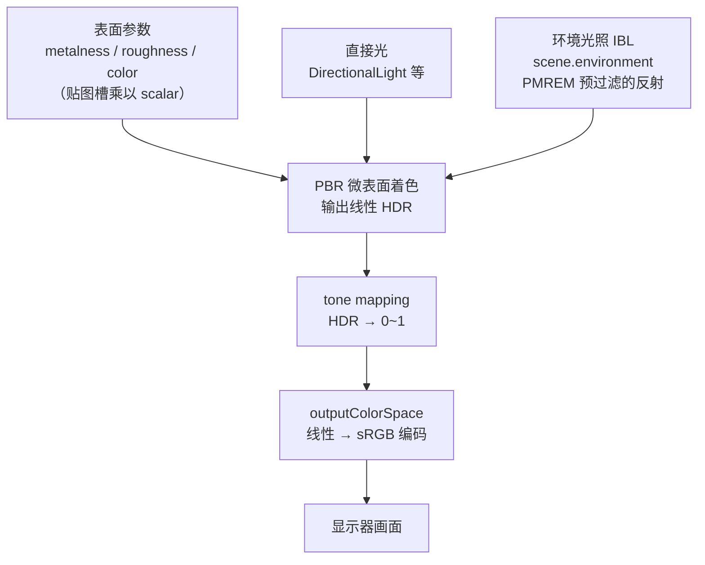

import { Canvas, Controls, Meta } from '@storybook/addon-docs/blocks';
import * as PbrStories from './pbr-and-environment-maps.stories.js';

<Meta of={PbrStories} name="Docs" />

# PBR

PBR（基于物理的渲染）不是某个材质参数，而是"表面属性 + 环境光照 + 颜色管线"三件事共同作用的结果。把这三件事拆开看，PBR 的所有"为什么变黑""为什么偏色""为什么不真实"都能落到具体一环：

- **表面参数** 决定光怎样反射。`MeshStandardMaterial` 的 `metalness`（金属度，0 绝缘体 / 1 金属）和 `roughness`（粗糙度，0 镜面 / 1 漫反射）描述微表面属性；`color` 在金属上是反射色调、在非金属上是漫反射反照率。
- **环境光照（IBL）** 决定金属和低粗糙度表面"反射到了什么"。金属面几乎全靠环境反射出颜色，没有环境贴图时 `metalness = 1` 会几乎全黑。
- **颜色管线** 决定算出来的线性颜色怎样进显示器。`ColorManagement`（r152+ 默认开）、`texture.colorSpace`（颜色贴图设 sRGB、数据贴图保持线性）、`renderer.outputColorSpace`（默认 sRGB）保证颜色不被偏移；`renderer.toneMapping` + `toneMappingExposure` 把 HDR 结果（线性值大于 1）压回 0~1。

材质家族、共享渲染状态和 `MeshStandardMaterial` 的基础入口在[材质](?path=/docs/materials-and-render-states--docs)课；贴图对象、UV、wrap/filter 和 `colorSpace` 的通用机制在[纹理](?path=/docs/textures-and-maps--docs)课；直接光源的类型和单位在 [Light](?path=/docs/light-objects--docs) 课。本课只讲把这三条链路接成"物理可信画面"的 PBR 全链路。



## 快速上手

最小闭环：`MeshStandardMaterial` + 一份环境反射。PBR 金属面要有内容可反射，所以环境贴图是默认配置而不是可选增强。`three/addons/environments/RoomEnvironment.js` 是一份程序化室内环境，不需要任何 HDR 文件就能让金属面亮起来：

```js
import { RoomEnvironment } from 'three/addons/environments/RoomEnvironment.js';

const renderer = new THREE.WebGLRenderer({ canvas, antialias: true });
renderer.outputColorSpace = THREE.SRGBColorSpace; // r152+ 默认值，显式写更清楚
renderer.toneMapping = THREE.ACESFilmicToneMapping; // 默认 NoToneMapping，配环境贴图建议换成 ACES

const scene = new THREE.Scene();

// 把 RoomEnvironment 烘焙成 PMREM 反射纹理，挂到 scene.environment 给全场 PBR 材质用
const pmrem = new THREE.PMREMGenerator(renderer);
scene.environment = pmrem.fromScene(new RoomEnvironment(), 0.04).texture;

const mesh = new THREE.Mesh(
  new THREE.IcosahedronGeometry(0.7, 0),
  new THREE.MeshStandardMaterial({ color: '#d8b15a', roughness: 0.3, metalness: 1.0 })
);
mesh.position.y = 0.7;
scene.add(mesh);

const key = new THREE.DirectionalLight('#fff3d6', 1.5);
key.position.set(3, 5, 3);
scene.add(key);
```

| 输入或状态 | 默认值 / 常用起点 | 改变后要注意什么 |
| --- | --- | --- |
| `MeshStandardMaterial.metalness` | `0` | 1 时表面颜色几乎全靠环境反射；没环境会黑 |
| `MeshStandardMaterial.roughness` | `1` | 0 时镜面高光极锐；配低粗糙度金属更依赖环境 |
| `MeshStandardMaterial.envMapIntensity` | `1` | 单材质环境反射强度乘数；`scene.environmentIntensity` 是全场版 |
| `scene.environment` | `null` | 不设则金属面无 IBL；PBR 主力材质几乎都需要 |
| `scene.environmentIntensity` | `1` | 全场环境强度乘数（在材质未单独设 `envMap` 时生效） |
| `renderer.outputColorSpace` | `SRGBColorSpace` | r152+ 默认；不要改回线性，否则画面发暗发灰 |
| `texture.colorSpace`（颜色贴图） | `NoColorSpace` | `map` / `emissiveMap` 等颜色纹理要显式设 `SRGBColorSpace` |
| `renderer.toneMapping` | `NoToneMapping` | 配环境贴图或 HDR 源时建议 `ACESFilmicToneMapping` / `AgXToneMapping` |
| `renderer.toneMappingExposure` | `1` | tone mapping 之前的整体亮度乘数 |
| `ColorManagement.enabled` | `true` | r152+ 默认开；关掉会回到旧版线性工作流，颜色会偏 |

## PBR 表面参数

`metalness` 和 `roughness` 是 PBR 的两个核心开关。它们不是"调亮度"，而是改变光的反射模型：

- **`metalness`（默认 `0`）**：0 是电介质（塑料、木材、皮肤），1 是纯金属（铜、金、铬），中间值通常是金属/非金属过渡或脏污表面。真实材质通常取 `0` 或 `1` 两个端点，少用中间值——现实物体极少是"半金属"。
- **`roughness`（默认 `1`）**：0 时表面像镜子，反射集中成一个锐点；1 时完全漫反射，反射被抹平成均匀的哑光。它和 `metalness` 独立：金属也能很粗糙（拉丝钢），非金属也能很光滑（车漆表面的清漆层）。
- **`color`（反照率 / 反射色调）**：对非金属（`metalness = 0`），`color` 是漫反射反照率，影响整个表面颜色；对金属（`metalness = 1`），`color` 变成反射色调（F0），金属表面几乎不产生漫反射，颜色全来自带色调的镜面反射。这就是为什么金属的 `color` 看起来像"金属本色"而不是涂装色。

贴图槽与 scalar 的乘法规则：`roughnessMap` 的绿色通道会乘上 `material.roughness`，`metalnessMap` 的蓝色通道会乘上 `material.metalness`——贴图不替换 scalar，而是逐像素调制。完整的贴图槽语义（`map` / `normalMap` / `aoMap` / `emissiveMap` 等）和它们的 `colorSpace`、UV、wrap/filter 细节在[纹理](?path=/docs/textures-and-maps--docs)课。

`MeshStandardMaterial` 的 PBR 成员：

| 成员 | 默认值 | 说明 |
| --- | --- | --- |
| `metalness` | `0` | 0=电介质，1=金属；可被 `metalnessMap` 调制 |
| `roughness` | `1` | 0=镜面，1=完全漫反射；可被 `roughnessMap` 调制 |
| `envMapIntensity` | `1` | 环境反射强度乘数 |
| `emissive` / `emissiveIntensity` | `0x000000` / `1` | 与光照无关的自发光 |
| `map` / `roughnessMap` / `metalnessMap` / `normalMap` / `aoMap` / `emissiveMap` | `null` | PBR 贴图槽；数据贴图保持 `NoColorSpace` |

材质家族的基础属性、共享渲染状态（`transparent` / `opacity` / `side` / `flatShading` 等）见[材质](?path=/docs/materials-and-render-states--docs)课；本课只展开 PBR 链路。

## 环境贴图

环境贴图（image-based lighting，IBL）是 PBR 金属面和低粗糙度表面的"反射内容来源"。直接光只能给出几个锐高光，环境贴图给出整张图的全方向反射，金属面才能呈现真实的金属感。

three.js 用 `PMREMGenerator` 把任意环境来源（场景、等距矩形 HDR、立方体贴图）预过滤成一份多粗糙度 MIP 的反射纹理，让不同 `roughness` 的表面能采样到对应模糊程度的反射：

```js
const pmrem = new THREE.PMREMGenerator(renderer);
// 程序化室内环境，无需 HDR 文件
const envMap = pmrem.fromScene(new RoomEnvironment(), 0.04).texture;
scene.environment = envMap; // 全场 PBR 材质共享这份反射
```

环境贴图有两个挂载点，作用范围不同：

- **`scene.environment`**：给场景里所有 `MeshStandardMaterial` / `MeshPhysicalMaterial`（以及 Lambert / Phong）自动提供反射，是最常用的入口。
- **`material.envMap`**：只给单个材质提供反射，会覆盖 `scene.environment`。需要让某个材质反射和全场不同的环境时才用。

强度控制有两层，按"材质未单独设 `envMap`"时生效：

- **`scene.environmentIntensity`（默认 `1`）**：全场环境强度乘数。
- **`material.envMapIntensity`（默认 `1`）**：单材质乘数，只在该材质用 `scene.environment`（未设 `envMap`）时生效。
- **`scene.environmentRotation`（默认零旋转）**：旋转环境反射方向，常用于让金属面的反射高光落在想要的位置，不改光源。

调 `metalness` 和 `roughness`，再切换 `scene.environment` 开关：`envOn` 关掉且 `metalness` 接近 1 时，金属面没有内容可反射，几乎只剩直接光的镜面高光，整体变黑。

<Canvas of={PbrStories.MetalnessEnvironment} />

<Controls of={PbrStories.MetalnessEnvironment} />

Canvas 进入视口前 `200px` 启动，离开后暂停并保留最后一帧。运行时把 `scene.environment` 从纹理切到 `null` 会改变材质的 envMap 程序分支，范例在切换时把 `material.needsUpdate` 设为 `true`，让 shader 重编译。

`PMREMGenerator` 的来源方法：

| 方法 | 输入 | 适用 |
| --- | --- | --- |
| `fromScene(scene, sigma=0)` | 一个 Scene 对象 | `RoomEnvironment` 这类程序化场景；`sigma` 是模糊量 |
| `fromEquirectangular(texture)` | 等距矩形纹理（HDR / LDR） | 从 `.hdr` / `.exr` 加载的环境 |
| `fromCubemap(cubemap)` | 立方体贴图（6 面） | 旧式立方体环境 |

`PMREMGenerator` 内部建了渲染目标，一个 renderer 共用一个实例即可；不再使用时调 `pmrem.dispose()` 释放。

## 加载 HDRI

`RoomEnvironment` 是零依赖的起步方案，但真实场景通常用一张 HDRI（`.hdr` / `.exr`）提供更有质感的环境。`RGBELoader` 加载等距矩形 HDR，再交给 `PMREMGenerator.fromEquirectangular` 预过滤：

```js
import { RGBELoader } from 'three/addons/loaders/RGBELoader.js';

const texture = await new RGBELoader().loadAsync('/environments/brown_photostudio_02_1k.hdr');
// HDR 数据本身就是线性的，不要再设 SRGBColorSpace
const envMap = pmrem.fromEquirectangular(texture).texture;
scene.environment = envMap;

// 可选：把原图也设成可见背景。设 background 不会自动当 IBL，environment 才是反射来源
scene.background = envMap;
texture.dispose(); // PMREM 已经烘焙好，原始等距矩形纹理可以释放
```

`scene.background` 和 `scene.environment` 是两件事：

- **`scene.environment`**：PBR 反射和 IBL 的来源，影响所有受光材质。
- **`scene.background`**：画面背景（可见的天空 / 环境）。设成同一张 envMap 时，背景和环境反射一致；只设 `environment` 不设 `background` 时，画面背景仍是纯色或透明，但金属面已经有反射。

背景还能进一步调整：`scene.backgroundBlurriness`（默认 `0`，大于 0 时对背景做 PMREM 模糊）、`scene.backgroundIntensity`（默认 `1`，背景亮度乘数）。HDR 背景通常亮度高，配 `toneMapping` 才不会过曝——见下一节。

`RGBELoader` 默认按等距矩形投影解析；加载立方体形式的 HDR 用 `HDRCubeTextureLoader`。EXR 文件用 `EXRLoader`。Loader 的加载状态、错误处理和 `LoadingManager` 用法和[纹理](?path=/docs/textures-and-maps--docs)课一致。

## MeshPhysicalMaterial 进阶

`MeshPhysicalMaterial` 是 `MeshStandardMaterial` 的超集：它继承 metalness/roughness/color，再扩展几类需要多层或透射的边界材质。开销比 Standard 大，按需使用。

| 成员 | 默认值 | 解决什么问题 |
| --- | --- | --- |
| `clearcoat` / `clearcoatRoughness` | `0` / `0` | 清漆层：在金属/粗糙表面之上再叠一层高光，做车漆、漆面、碳纤维 |
| `transmission` / `thickness` / `ior` | `0` / `0` / `1.5` | 透射：做玻璃、水；`thickness` 影响折射厚度，`ior` 是折射率（水 1.33、玻璃 1.5、钻石 2.4） |
| `attenuationDistance` / `attenuationColor` | `Infinity` / 白 | 透射光的距离衰减与颜色吸收，做有色玻璃 |
| `sheen` / `sheenColor` / `sheenRoughness` | `0` / 黑 / `1` | 织物光泽：布料边缘的柔和高光 |
| `iridescence` / `iridescenceIOR` | `0` / `1.3` | 虹彩：肥皂泡、油膜、珍珠的彩色随角度变化 |
| `specularIntensity` / `specularColor` | `1` / 白 | 直接控制非金属的镜面反射强度与颜色 |
| `dispersion` | `0` | 色散：玻璃边缘的彩色分离（需要 `transmission > 0`） |

调 `transmission` 从 0 到 1，背后彩色方块从清晰可见变成折射变形并带反射高光；调 `clearcoat` 从 0 到 1，球面多出一层更锐的反射高光（车漆感）。

<Canvas of={PbrStories.PhysicalMaterial} />

<Controls of={PbrStories.PhysicalMaterial} />

Canvas 进入视口前 `200px` 启动，离开后暂停并保留最后一帧。`transmission > 0` 时 three.js 走透射渲染通道，范例保持 `transparent = true` 让材质进入透明排序队列；`roughness` 越低玻璃越通透。

## 颜色管线

颜色管线回答"算出来的线性颜色怎样进显示器"。PBR 全程在线性空间计算光照（光强叠加、反射模型都假设线性），但图片文件、显示器、人眼都用 sRGB。管线断在任何一环，画面都会偏色、发灰或过曝。

r152 起 three.js 默认开启 `ColorManagement`，把线性工作流作为默认：

```js
THREE.ColorManagement.enabled = true; // r152+ 默认 true，无需手写
renderer.outputColorSpace = THREE.SRGBColorSpace; // 默认值，画布最终编码
```

输入端的 `texture.colorSpace` 是最容易出错的一环，按"颜色还是数值"分类：

| 贴图类型 | `colorSpace` | 理由 |
| --- | --- | --- |
| `map` / `emissiveMap`（颜色纹理） | `SRGBColorSpace` | 存的是供人眼看的颜色，采样前要解码到线性 |
| `normalMap` / `roughnessMap` / `metalnessMap` / `aoMap` / `alphaMap`（数据纹理） | `NoColorSpace`（默认） | 存的是数值，做 sRGB 解码会破坏数据 |
| HDR / EXR（`RGBELoader` 加载） | 保持线性（不要设 sRGB） | 数据本身就是线性，直接喂给 `PMREMGenerator` |

颜色空间、UV、wrap/filter 的通用机制在[纹理](?path=/docs/textures-and-maps--docs)课的"颜色空间"小节；这里只补充 PBR 全链路里的位置：输入纹理声明（`texture.colorSpace`）→ 线性 PBR 着色 → `toneMapping` → `outputColorSpace` 编码 → 显示器。`GLTFLoader` 会按 glTF 材质语义自动设好颜色空间和 `flipY`；手工替换模型贴图时要自己复核。

`ColorManagement.legacyMode` 是旧版兼容开关，r152+ 已不推荐；新项目不要用它回到旧线性工作流。

## 色调映射

PBR 加上环境贴图和强光，某些片元的线性颜色会远大于 1（金属反射的亮点、自发光灯泡、HDR 天空）。显示器只能表达 0~1，直接截断会让高光硬切成纯白、丢失层次。`renderer.toneMapping` 用一条曲线把 HDR 柔和地压回 0~1：

| `toneMapping` | 行为 | 适用 |
| --- | --- | --- |
| `NoToneMapping`（默认） | 不压缩，大于 1 直接截断 | 低动态范围（LDR）场景、调试 |
| `LinearToneMapping` | 线性乘 exposure | 简单可控，色彩偏平 |
| `ReinhardToneMapping` | Reinhard 曲线 | 旧式柔和过渡 |
| `CineonToneMapping` | 仿 log 胶片 | 胶片风 |
| `ACESFilmicToneMapping` | ACES 电影曲线 | 通用推荐，对比强、色彩饱和 |
| `AgXToneMapping` | AgX 曲线（r162+） | 现代、中性，高光过渡更自然 |
| `NeutralToneMapping` | 中性曲线（r162+） | 忠实原色，工业 / 产品展示 |

```js
renderer.toneMapping = THREE.ACESFilmicToneMapping;
renderer.toneMappingExposure = 1.0; // tone mapping 之前的整体亮度乘数
```

切 `toneMapping` 在 No / ACES / AgX / Neutral 之间，观察灯泡和金属反射点：No 把高光硬切到纯白，ACES 柔和过渡并带电影感，AgX / Neutral 又是不同的色彩与对比风格；`exposure` 整体压暗或提亮。

<Canvas of={PbrStories.ToneMapping} />

<Controls of={PbrStories.ToneMapping} />

Canvas 进入视口前 `200px` 启动，离开后暂停并保留最后一帧。改 `renderer.toneMapping` 不需要手动设 `material.needsUpdate`——渲染器发现 tone mapping 参数变化会自己重编译对应 shader；`toneMappingExposure` 是 uniform，下一帧立即生效。材质级开关 `material.toneMapped`（默认 `true`）设 `false` 可让 HUD、纯色辅助对象不参与 tone mapping，保持原色。

## 最佳实践

- PBR 默认就要配环境贴图：用 `MeshStandardMaterial` 时随手 `PMREMGenerator + RoomEnvironment` 给 `scene.environment`，否则金属面会黑、低粗糙度表面会平淡。
- 真实材质的 `metalness` 取 `0` 或 `1` 两端，少用中间值；用 `metalnessMap` 做金属/非金属分区，而不是调一个 0.5 的折中值。
- 颜色纹理设 `SRGBColorSpace`、数据纹理保持 `NoColorSpace`，是 PBR 不偏色的底线；HDR 数据不要设 sRGB。
- 配环境贴图或 HDR 源时把 `renderer.toneMapping` 设成 `ACESFilmicToneMapping` 或 `AgXToneMapping`，避免高光硬切；HUD、纯色 UI 用 `material.toneMapped = false` 保持原色。
- 运行时切换 `scene.environment`（纹理 ↔ null）后给受影响材质设 `material.needsUpdate = true`，envMap 程序分支才会重编。
- 全场调强度优先用 `scene.environmentIntensity`；单材质差异化才用 `material.envMapIntensity` 或 `material.envMap`。
- 不再使用的 `PMREMGenerator` 调 `dispose()`；`fromEquirectangular` 烘焙完后原始等距矩形纹理可以 `dispose()` 释放显存。
- `MeshPhysicalMaterial` 按需开：玻璃才用 `transmission`、车漆才用 `clearcoat`、布料才用 `sheen`，全开会让 shader 变重。
- 旧代码里的 `physicallyCorrectLights = true` 在 r155+ 已是默认且属性被移除；光照强度按 r155+ 物理模式重新标定，详见 [Light](?path=/docs/light-objects--docs) 课。

## 常见问题

- 为什么 `MeshStandardMaterial` 设 `metalness = 1` 后表面全黑？
  金属面几乎不产生漫反射，颜色全靠环境反射。场景没有 `scene.environment` 或 `material.envMap` 时无内容可反射。用 `PMREMGenerator + RoomEnvironment` 生成环境反射挂到 `scene.environment`，或降低 `metalness`。
- 为什么金属面看着有反射，但颜色不对、偏暗或发灰？
  先查输入纹理的 `colorSpace`：颜色贴图（`map`/`emissiveMap`）设 `SRGBColorSpace`，数据贴图（法线/粗糙度/金属度）保持 `NoColorSpace`。再确认 `renderer.outputColorSpace` 是默认的 `SRGBColorSpace`，不要改回线性。
- 为什么配上 HDR 环境贴图后高光全炸成纯白？
  HDR 的线性值远大于 1，默认的 `NoToneMapping` 会硬切。把 `renderer.toneMapping` 设成 `ACESFilmicToneMapping` 或 `AgXToneMapping`，必要时调 `toneMappingExposure` 降一点。
- 为什么 `scene.environment` 设了，材质还是没反射？
  确认材质是 `MeshStandardMaterial` / `MeshPhysicalMaterial`（或 Lambert/Phong）——`MeshBasicMaterial` 不响应环境；确认材质没单独设一个空的 `envMap`（会覆盖 `scene.environment`）；运行时从 null 切到纹理后给材质设 `material.needsUpdate = true`。
- 为什么玻璃材质（`transmission > 0`）看着不透明？
  透射需要 `transparent` 配合（建议保持 `true`），且玻璃的"质感"主要来自表面反射的环境；没有 `scene.environment` 时玻璃面会偏平。同时检查 `roughness` 是否过高，低粗糙度才通透。
- 为什么 `RGBELoader` 加载的 HDR 背景颜色不对？
  HDR 数据本身就是线性的，不要再设 `texture.colorSpace = SRGBColorSpace`。把等距矩形纹理交给 `PMREMGenerator.fromEquirectangular` 处理，背景过亮时配 `toneMapping` 和 `scene.backgroundIntensity`。
- 为什么开了 ACES 后颜色发暗、不够亮？
  ACES 会压暗中调。调大 `renderer.toneMappingExposure`（如 `1.2`）补偿，或换 `AgXToneMapping` / `NeutralToneMapping` 看色彩风格是否更合适。
- 旧代码里 `renderer.physicallyCorrectLights = true` 报错？
  r155 起物理光照是默认且该属性已移除。删掉这行；光照强度需要按 r155+ 物理模式重新标定（详见 [Light](?path=/docs/light-objects--docs) 课）。

## 总结回顾

摘要：

PBR 是"表面参数 + 环境光照 + 颜色管线"三件事的合作用。`MeshStandardMaterial` 用 `metalness`（0 绝缘 / 1 金属）和 `roughness`（0 镜面 / 1 漫反射）描述表面；`color` 在金属上是反射色调、在非金属上是反照率。金属面和低粗糙度表面靠环境反射出颜色，`PMREMGenerator` 把 `RoomEnvironment` 或等距矩形 HDR 预过滤成反射纹理，挂到 `scene.environment` 给全场受光材质，或用 `material.envMap` 单独覆盖；强度由 `scene.environmentIntensity` / `material.envMapIntensity` 控制。`MeshPhysicalMaterial` 在 Standard 之上扩展 `clearcoat`（清漆）、`transmission`/`ior`（玻璃）、`sheen`（织物）、`iridescence`（虹彩）等边界。颜色管线保证不偏色：r152+ 默认开 `ColorManagement`，颜色贴图设 `SRGBColorSpace`、数据贴图保持 `NoColorSpace`、`renderer.outputColorSpace` 默认 sRGB；`renderer.toneMapping`（推荐 ACES / AgX）配 `toneMappingExposure` 把 HDR 结果压回 0~1。

一句话：

> PBR 的真实感来自表面参数、环境反射和颜色管线三件事共同作用——金属面没有环境贴图就会黑，颜色管线断在任何一环就会偏。

知识要点：

- PBR 的三件事分别是什么？它们怎样共同决定最终画面？
- 为什么 `metalness = 1` 的金属面没有环境贴图会几乎全黑？
- `scene.environment` 和 `material.envMap` 的作用范围有什么不同？运行时切换为什么常要 `material.needsUpdate`？
- 颜色贴图和数据贴图的 `colorSpace` 分别怎么设？设错会怎样？
- `renderer.toneMapping` 解决什么问题？默认的 `NoToneMapping` 在什么场景下不够用？
- `MeshPhysicalMaterial` 在 `MeshStandardMaterial` 之上扩展了哪几类边界参数？玻璃和车漆分别用哪些？
- `PMREMGenerator` 的 `fromScene` 和 `fromEquirectangular` 分别处理什么来源？

## 参考资料

- [Three.js Manual：Materials（PBR / MeshStandardMaterial）](https://threejs.org/manual/en/materials.html)
- [Three.js Manual：Color management](https://threejs.org/manual/en/color-management.html)
- [Three.js Docs：MeshStandardMaterial](https://threejs.org/docs/pages/MeshStandardMaterial.html)
- [Three.js Docs：MeshPhysicalMaterial](https://threejs.org/docs/pages/MeshPhysicalMaterial.html)
- [Three.js Docs：PMREMGenerator](https://threejs.org/docs/pages/PMREMGenerator.html)
- [Three.js Docs：WebGLRenderer（outputColorSpace / toneMapping）](https://threejs.org/docs/pages/WebGLRenderer.html)
- [Three.js Docs：Scene（environment / environmentIntensity）](https://threejs.org/docs/pages/Scene.html)
- [Three.js Examples：WebGL Materials Physical Transmission](https://threejs.org/examples/?q=materi#webgl_materials_physical_transmission)
- [Three.js Migration Guide（r155 物理光照默认、r152 Color Management）](https://github.com/mrdoob/three.js/wiki/Migration-Guide)
- [RoomEnvironment（three/addons/environments/RoomEnvironment.js）](https://github.com/mrdoob/three.js/blob/master/examples/jsm/environments/RoomEnvironment.js)
- [RGBELoader（three/addons/loaders/RGBELoader.js）](https://github.com/mrdoob/three.js/blob/master/examples/jsm/loaders/RGBELoader.js)
