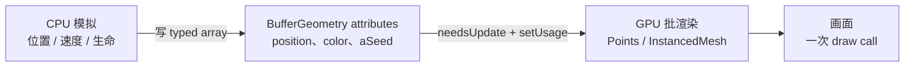

import { Canvas, Controls, Meta } from '@storybook/addon-docs/blocks';
import * as ParticlesStories from './points-particles-instancing.stories.js';

<Meta of={ParticlesStories} name="Docs" />

# 粒子

大规模粒子系统不是"画很多点"那么简单。当数量从 [Points 基础课](?path=/docs/points-object--docs)的 1500 涨到几万、并要求每帧动画时，瓶颈不再是 draw call，而是**如何把 CPU 端模拟出来的状态正确、便宜地送回 GPU**。本课就是回答这个问题。

一个粒子系统可以拆成三段独立的数据流，先建立这个心智模型，后面所有 API 选择都能落到正确位置：



- **CPU 模拟**在普通 JS 数组或 typed array 里跑：速度积分、重力、生命周期回收。它不直接接触 three.js。
- **attributes 是 CPU 与 GPU 之间的桥**：模拟结果按顶点格式写入 `BufferGeometry.attributes.position.array` 等 typed array；内置 attribute（`position` / `color`）会被 [PointsMaterial](https://threejs.org/docs/pages/PointsMaterial.html) 直接消费，自定义 attribute（`aSeed` 等）只在你写 shader 时才被读——见 [Shader 基础课](?path=/docs/shader-basics--docs)。
- **批渲染**由 [Points](https://threejs.org/docs/pages/Points.html) 或 [InstancedMesh](https://threejs.org/docs/pages/InstancedMesh.html) 一次提交。几万个粒子也只产生 1 次 draw call。

三条流之间有三个常被忽略的同步点：写完 typed array 必须 `attribute.needsUpdate = true`，频繁更新的 attribute 应 `setUsage(THREE.DynamicDrawUsage)`，分布范围动态变化时要 `computeBoundingSphere()`。本课的故障排查大部分围绕这三点。

本课是 [Points 基础课](?path=/docs/points-object--docs)的深入实现版本：基础课讲的"顶点怎么变成画面上的点"在此默认你已掌握，本课专注"大规模 + 动画"的工程实现，并给出 [Points](?path=/docs/points-object--docs) 与 [InstancedMesh](?path=/docs/instanced-mesh-object--docs) 在粒子场景下的选型依据。

## 快速上手

最小闭环：一份大顶点 `BufferGeometry` + 每帧改 `position` attribute 驱动的喷泉粒子系统。

```js
import * as THREE from 'three';

const COUNT = 8000;

// 1. 准备 typed array：position 是 GPU 必需的 attribute；velocity / age 是 CPU 模拟用的普通数组
const positions = new Float32Array(COUNT * 3);
const velocities = new Float32Array(COUNT * 3);
const ages = new Float32Array(COUNT);

for (let i = 0; i < COUNT; i++) {
  ages[i] = Math.random() * 2.4;           // 错开生命阶段，避免第一帧全部一起发射
  velocities[i * 3 + 1] = 5 + Math.random(); // 初始向上速度
}

// 2. 把数据装进 BufferGeometry
const geometry = new THREE.BufferGeometry();
geometry.setAttribute('position', new THREE.BufferAttribute(positions, 3));
geometry.attributes.position.setUsage(THREE.DynamicDrawUsage); // 每帧都会改，告诉驱动动态上传
geometry.computeBoundingSphere();

// 3. 用 PointsMaterial 做发光颗粒：圆形 alpha 纹理 + 加性混合 + 不写深度
const material = new THREE.PointsMaterial({
  size: 0.12,
  vertexColors: false,
  transparent: true,
  depthWrite: false,
  blending: THREE.AdditiveBlending
});

const points = new THREE.Points(geometry, material);
scene.add(points);

// 4. 每帧：CPU 模拟 → 写 typed array → 同步到 GPU
function frame(delta) {
  for (let i = 0; i < COUNT; i++) {
    ages[i] += delta;
    velocities[i * 3 + 1] += -9.8 * delta;          // 重力
    positions[i * 3]     += velocities[i * 3]     * delta;
    positions[i * 3 + 1] += velocities[i * 3 + 1] * delta;
    positions[i * 3 + 2] += velocities[i * 3 + 2] * delta;

    if (positions[i * 3 + 1] < 0 || ages[i] > 2.4) {
      positions[i * 3 + 1] = 0;
      velocities[i * 3 + 1] = 5 + Math.random();
      ages[i] = 0;
    }
  }
  geometry.attributes.position.needsUpdate = true;  // 关键：让 GPU 拿到新数据
  renderer.render(scene, camera);
}
```

无论 `COUNT` 是 2000 还是 20000，粒子本身只占一次 draw call——几万顶点都进入同一次 GPU 提交，而不是按顶点数线性增长。下面范例的读数里 "本帧 draw calls" 显示 2，多出的那 1 次是参考网格（`GridHelper`）的提交；切粒子数时它不会变。

| 输入或状态 | 默认值 / 常用起点 | 改变后要注意什么 |
| --- | --- | --- |
| `position` attribute 顶点数 | 由 typed array 长度决定 | 顶点数变化要重建 `BufferGeometry`；临时少画用 `geometry.setDrawRange(0, n)` |
| `attribute.setUsage` | `StaticDrawUsage` | 每帧重写 position / color 时改 `DynamicDrawUsage`，否则驱动按静态策略上传，性能差 |
| `attribute.needsUpdate` | `false` | 改完 typed array 必须置 `true`；下一帧 renderer 上传后会自动复位 |
| `material.size` + `sizeAttenuation` | `1` + `true` | 见 [Points 基础课](?path=/docs/points-object--docs)；粒子场景常用小尺寸 + 衰减 |
| `material.blending` | `NormalBlending` | 发光颗粒用 `AdditiveBlending`，并在深色背景下才看得见叠加效果 |
| `material.depthWrite` | `true` | 半透明 + 加性混合时置 `false`，否则按绘制顺序错误遮挡 |
| CPU 模拟用的 velocity / age | 普通数组 | 不放 attribute 也可以，只有想让 GPU shader 也读到它时才升级成 attribute |
| `geometry.boundingSphere` | 渲染时按需自动算 | 顶点大幅变化后调 `computeBoundingSphere()`，否则视锥剔除判断错误 |

## 大顶点 BufferGeometry 与自定义 attribute

几万个粒子起步时，几何构造本身就是性能点。三条原则：

**1. typed array 一次性分配，不要 `push`。** `Float32Array(count * 3)` 在创建时一次性分配内存；用普通数组 `positions.push(x, y, z)` 然后再 `new Float32Array(arr)` 会先建一份动态数组、再复制一遍，几万顶点下浪费明显。

**2. 区分"GPU 要读"和"只在 CPU 用"两类数据。** 内置 attribute（`position` / `color` / `uv` / `normal`）由材质读取；自定义 attribute（如 `aSeed` / `aVelocity`）需要 [ShaderMaterial](https://threejs.org/docs/pages/ShaderMaterial.html) 才会被消费。只在 CPU 模拟里用的速度、生命、种子等数据，写成普通 typed array 即可，不要为了"看起来规范"全部塞进 attributes——每一份 attribute 都占一份 GPU buffer 和一次上传。

```js
// GPU 要读的：作为 attribute
geometry.setAttribute('position', new THREE.BufferAttribute(positions, 3));
geometry.setAttribute('color',    new THREE.BufferAttribute(colors, 3));
geometry.setAttribute('aSeed',    new THREE.BufferAttribute(seeds, 1)); // 自定义：默认材质不读，写 shader 才生效

// 只在 CPU 用的：普通数组
const velocities = new Float32Array(count * 3);
const ages       = new Float32Array(count);
```

**3. 内置名字被占用，自定义 attribute 用 `a` 前缀。** `position` / `color` / `uv` / `normal` / `tangent` 由 three.js 自动声明，自定义 attribute 同名会冲突或被覆盖。习惯用 `aSeed`、`aOffset`、`aPhase` 这类 `a` 开头的名字——这是与 [Shader 基础课](?path=/docs/shader-basics--docs) 一致的约定。

`itemSize` 决定 GLSL 端类型（1=`float`，2=`vec2`，3=`vec3`，4=`vec4`）；所有 attribute 的 `count`（顶点数）必须一致，否则 renderer 组装图元时会越界。

下面范例把这三条都落到代码里：8000 个粒子用 `position` + `color` + `aSeed` 三块 attribute，velocity / age 放普通数组。读数里的 "attributes 数" 会稳定显示为 3。

## 每帧更新 attribute

CPU 模拟跑完后，必须显式告诉 GPU "这块 buffer 变了"。这是大规模粒子系统最容易踩坑的一步，三个动作都不能漏：

```js
// 1. 直接改 typed array
for (let i = 0; i < count; i++) {
  positions[i * 3 + 1] += velocities[i * 3 + 1] * delta;
}

// 2. 标记 buffer 变化
geometry.attributes.position.needsUpdate = true;

// 3. 频繁更新的 attribute 在构造后改一次 usage，之后保持
//    geometry.attributes.position.setUsage(THREE.DynamicDrawUsage);
```

`needsUpdate = true` 只让 renderer 在下次提交时重新上传这份 buffer；它不触发法线、包围体或任何派生数据重算。renderer 上传完会自动把它复位回 `false`——所以"改一次、置一次"是每帧动作，不是一次性设置。

`setUsage(THREE.DynamicDrawUsage)` 告诉 WebGL 驱动这块 buffer 会频繁更新，驱动会选择更合适的上传策略（通常是划一块"动态"显存区域）。只在构造后设一次即可，之后整个生命周期都生效。静态分布的 attribute（粒子种子、初始位置等一次性写入不再变化的）保留默认 `StaticDrawUsage`。

| 操作 | 频率 | 必须做的事 |
| --- | --- | --- |
| 改 `position.array` | 每帧 | `position.needsUpdate = true` |
| 改 `color.array` | 每帧 | `color.needsUpdate = true` |
| 顶点分布范围显著变化 | 偶尔 | `geometry.computeBoundingSphere()` |
| 受光 Mesh 的几何变形 | 每帧或按需 | `geometry.computeVertexNormals()` |
| 改 attribute 结构（增删、换 itemSize） | 一次 | `geometry.dispose()` + 重建 material |

`computeBoundingSphere()` 扫一遍 `position`，几万顶点下并不便宜——粒子系统里如果整体始终充满视锥或分布稳定，可以直接 `frustumCulled = false` 跳过剔除，省掉这次扫描。`computeVertexNormals()` 是 Mesh 受光才需要的；Points 渲染图元是点，**根本不需要法线**，不要无脑调用它。

下面范例的读数里能看到 `position.needsUpdate 累计` 每帧 +2（position 和 color 各一次），无论粒子数怎么涨，粒子本身占的 draw call 都不增长。

<Canvas of={ParticlesStories.ParticlesFountain} />

<Controls of={ParticlesStories.ParticlesFountain} />

切到 20000 粒子时 draw calls 不增长（读数稳定在 2：1 次粒子 + 1 次参考网格）；切 `blending` 到 `Normal` 时发光叠加消失，颗粒变成普通半透明圆点；关 `animate` 时 `needsUpdate` 不再累加，画面冻结。重力调到 0 时粒子不再下落，能看清加性混合在颗粒重叠处把颜色累加成接近白色。

## PointsMaterial 的全局 size 边界

[PointsMaterial](https://threejs.org/docs/pages/PointsMaterial.html) 的 `size` 是**整片点云共享一个值**——它没有"每个点单独大小"的入口。这是基础 Points 在粒子特效上的硬边界，必须先认清：

| 想要的效果 | PointsMaterial 能不能做 | 怎么做 |
| --- | --- | --- |
| 整片粒子统一尺寸 | 能 | `material.size` |
| 远小近大 / 屏幕恒定 | 能 | `material.sizeAttenuation`（见 [基础课](?path=/docs/points-object--docs)） |
| 每个粒子不同尺寸 | **不能** | 改用 `ShaderMaterial`：自定义 `aSize` attribute，vertex shader 里设 `gl_PointSize` |
| 每个粒子绕自身旋转的纹理 | **不能** | 同上，在 fragment shader 里用 `gl_PointCoord` + 旋转矩阵采样 |
| 每个粒子不同纹理（atlas） | **不能** | 同上，`aTextureIndex` attribute + atlas 采样 |

`gl_PointSize` 是 WebGL 内置的顶点着色器输出（单位是像素），PointsMaterial 把它写成基于 `size` / `sizeAttenuation` 的常量；走 ShaderMaterial 时你可以完全控制它：

```glsl
// vertex
attribute float aSize;
uniform float uPixelRatio;
void main() {
  vec4 mvPosition = modelViewMatrix * vec4(position, 1.0);
  gl_Position = projectionMatrix * mvPosition;
  // 近大远小：按视图空间深度衰减
  gl_PointSize = aSize * uPixelRatio * (300.0 / -mvPosition.z);
}
```

深入写自定义粒子着色器属于 [Shader 基础课](?path=/docs/shader-basics--docs) 的范围。本课只交代"什么时候必须跳到 shader 路径"：当你需要按顶点变化尺寸、旋转或纹理时。在那之前，PointsMaterial + 顶点色 + 全局 size + 纹理已经能覆盖大量常规粒子需求。

## 用 InstancedMesh 做粒子

[InstancedMesh](?path=/docs/instanced-mesh-object--docs) 也能做粒子——把每个实例当作"一颗有形状的颗粒"。它和 Points 的差异不是"哪种更快"，而是"颗粒是什么"：

| 维度 | Points | InstancedMesh |
| --- | --- | --- |
| 图元 | 每顶点一个点（方块/纹理面片） | 每实例一份完整几何体 |
| triangles | 0 | 实例数 × 几何体三角形数 |
| draw calls | 1 | 1 |
| 受光与阴影 | 不参与 | 参与 |
| 每颗粒有形状/体积 | 否 | 是 |
| 拾取 | `raycaster.threshold` 距离判定 | `instanceId` 三角形求交 |
| 单颗粒最大数量级 | 数十万 | 数万（受三角形总量约束） |

选 InstancedMesh 做粒子的典型场景：低多边形尘埃/碎片/落叶/昆虫群，每颗都需要真实的 3D 形状、朝向或光照。如果只需要发光圆点，Points 几乎总是更合适——同样的数量下 triangles 是 0，GPU 三角形吞吐量完全不构成瓶颈。

下面范例把同一组环形粒子带分别交给 Points（小方块纹理点）和 InstancedMesh（小八面体），切渲染模式观察差异：Points 模式 `triangles` 是 0，InstancedMesh 模式 triangles 随实例数线性增长，但 draw calls 仍是 1。

<Canvas of={ParticlesStories.PointsVsInstanced} />

<Controls of={ParticlesStories.PointsVsInstanced} />

两种模式下 draw calls 都不随颗粒数变化（读数稳定在 2：1 次颗粒 + 1 次参考网格）；差异在 triangles——切到 InstancedMesh 后每个八面体都贡献 20 个三角形，1500 颗就是 30000 个。这就是"颗粒有形状"的代价：GPU 三角形吞吐量。如果场景里同时还有大量其他 Mesh，这个差异会成为瓶颈。

## 混合模式与精灵纹理

粒子的"发光感"主要来自混合模式，不是几何或动画。

**`AdditiveBlending`（加性混合）** 把片段颜色与帧缓冲里的现有颜色相加。重叠的粒子越多、该像素越接近白色——这是火花、光晕、星尘、火焰的标配。它只在**深色背景**下才有视觉效果：亮背景下加性混合的颗粒几乎看不见。

**`NormalBlending`** 是默认的 alpha 混合，半透明颗粒按 alpha 加权覆盖。烟、雾、灰尘这类"遮光"而非"发光"的效果用它。

| 混合模式 | 视觉 | 适用 | 配套 |
| --- | --- | --- | --- |
| `NormalBlending` | 半透明覆盖 | 烟、雾、灰尘 | `transparent: true` |
| `AdditiveBlending` | 颜色累加，越叠越亮 | 火、光、能量 | `transparent: true` + `depthWrite: false` + 深色背景 |
| `SubtractiveBlending` | 颜色相减 | 少见，暗色火焰 | 同上 |

`depthWrite: false` 是半透明粒子的另一条关键开关。默认 `depthWrite: true` 时，先画的粒子会写深度缓冲，后画的粒子在做深度测试时被它挡掉——半透明颗粒按绘制顺序错误互相遮挡，看起来一块块"裂开"。置 `false` 后粒子不写深度，只参与混合，画面平滑。代价是粒子与场景中其他不透明物体的遮挡关系会出错（粒子可能透过本应挡住它的物体显示），通常用"先画不透明物体、再画粒子"的渲染顺序解决。

精灵纹理（sprite / atlas）让每颗粒不再是方块。一张带 alpha 通道的小纹理（圆、星、火焰）配 `material.map` 就够用；多种纹理变体可以拼成一张 atlas，在 shader 里按顶点 attribute 选择子区域采样——后者属于自定义 shader 路径。`alphaTest` 适合硬边粒子（像素图标），`transparent` 适合柔和边缘（光晕）。这部分与 [Points 基础课](?path=/docs/points-object--docs) 的"用贴图做非方块点"完全一致，不在此重复。

## 生命周期与对象池

粒子系统的"动画"不只是位置变化，还包括"诞生—存活—死亡—复活"的生命周期。两类常见实现：

**对象池（固定数量）。** 构造时分配 N 个粒子的 typed array，模拟时让超期粒子"复活"——重置位置、速度、年龄，回到发射点。N 始终不变，buffer 容量恒定，draw call 始终是 1。这是喷泉、火焰、烟雾这类持续发射效果的标准做法。本课的喷泉范例就是这种模式：粒子落地或超龄就 `respawn()`，没有"删除"动作。

**drawRange（动态数量）。** 偶尔需要"一次性发射 N 颗、然后逐渐消失"的效果（爆炸）。这时仍可以保留一个最大 buffer，用 `geometry.setDrawRange(0, aliveCount)` 控制当前实际绘制多少顶点——容量不变，但本帧只画前 `aliveCount` 个。

```js
// aliveCount 随时间衰减
let aliveCount = MAX_PARTICLES;
function frame(delta) {
  aliveCount = Math.max(0, aliveCount - delta * decayRate);
  geometry.setDrawRange(0, Math.floor(aliveCount));
}
```

不要"动态增删顶点"。频繁 `deleteAttribute` / `setAttribute` 重建 attribute 会反复分配 GPU buffer 并触发完整重上传，比固定数量 + drawRange 慢得多。粒子数量的上限在构造时确定，运行时只调 `mesh.count`（InstancedMesh）或 `geometry.setDrawRange`（Points）。

| 操作 | 是否重建 GPU buffer | 适用 |
| --- | --- | --- |
| `geometry.setDrawRange(0, n)` | 否 | Points 临时少画前 n 个顶点 |
| `mesh.count = n`（InstancedMesh） | 否 | 实例临时少画前 n 个 |
| 改 typed array 数值 + `needsUpdate` | 否 | 任何动画驱动的属性更新 |
| `setAttribute(...)` 同名同 itemSize | 是 | 改顶点结构时才用，避免在动画循环里调用 |
| 改 itemSize / 增删 attribute | 是 | 等同重建几何 |

## CPU 与 GPU 更新的分界

本课所有动画都跑在 CPU：JS 循环遍历 typed array，算出新位置，再上传。这对几万粒子是够用的，但不是没有上限——CPU 单线程按 16ms 一帧的预算算，大约能撑到十万级顶点（具体取决于单粒子计算复杂度和机器）。

当 CPU 成为瓶颈时，下一步是把模拟搬到 GPU：

- **顶点着色器计算位置。** 把初速度、出生时间作为 attribute 一次性传上去，vertex shader 里用 `uTime` uniform + 解析公式（`position = p0 + v0 * t + 0.5 * g * t * t`）直接算位置。CPU 完全不参与模拟，每帧只改一个 uniform。代价是公式必须能解析表达——碰撞、复杂的力场难以搬到 GPU。
- **Transform Feedback / Compute。** WebGL2 的 transform feedback 或 [WebGPU](?path=/docs/webgpu-overview--docs) 的 compute pass 能在 GPU 上跑任意模拟循环，把结果留在 GPU 不回传 CPU。这是大规模粒子（百万级）的进阶路径，超出本课范围。

判断该不该走 GPU 路径：用 [stats.js](https://github.com/mrdoob/stats.js/) 看帧率，CPU 模拟在目标数量下能稳定 60fps 就别优化；掉帧时先确认瓶颈是模拟循环（CPU）还是三角形吞吐（GPU），再决定走哪条进阶路径。本课的喷泉范例在 20000 粒子下仍能稳定运行，是 CPU 路径的常见上限附近——再翻倍就该考虑 GPU 方案了。

## 最佳实践

- typed array 在构造时一次性分配到目标上限，运行时只改数值不改长度；要"少画"用 `setDrawRange` / `mesh.count`。
- 区分"GPU 要读"和"只在 CPU 用"的数据：只有内置 attribute 或自定义 shader 真的会读的数据才放进 BufferGeometry，模拟用的速度、生命等放普通数组。
- 每帧改的 attribute 在构造后 `setUsage(THREE.DynamicDrawUsage)`；一次性写入不再变化的保留默认 `StaticDrawUsage`。
- 改完 typed array 立刻 `attribute.needsUpdate = true`；漏掉这一行 GPU 还在用旧数据，是最常见的"代码对画面不动"原因。
- 顶点分布动态变化后调 `computeBoundingSphere()`；如果粒子始终充满视锥或分布稳定，直接 `frustumCulled = false` 省掉这次扫描。
- 发光颗粒用 `AdditiveBlending` + `depthWrite: false` + 深色背景；遮光颗粒用 `NormalBlending`。
- 每颗粒需要单独尺寸、旋转或纹理时跳到 [ShaderMaterial](?path=/docs/shader-basics--docs)，不要在 PointsMaterial 上找不存在的入口。
- 选 Points 还是 InstancedMesh 做粒子的判据是"颗粒是否需要形状和受光"，不是"哪个更快"——两者 draw calls 都是 1。
- 释放时按 geometry、material、texture 的顺序 `dispose()`；改 attribute 结构前先 `geometry.dispose()`。

## 常见问题

- 为什么改了 `positions[i]` 画面不动？
  漏置 `geometry.attributes.position.needsUpdate = true`。typed array 是 JS 端的 buffer，GPU 端是另一份；needsUpdate 才触发上传。
- 为什么粒子数涨到几万后帧率明显掉？
  大概率是 CPU 模拟循环成为瓶颈，不是 GPU。用 [stats.js](https://github.com/mrdoob/stats.js/) 看帧率，再用控制台 `console.time('sim')` 量模拟循环耗时；模拟占大头时考虑简化每粒子计算或走 GPU 路径。
- 为什么开了 `AdditiveBlending` 颗粒几乎看不见？
  加性混合需要深色背景。把 `scene.background` 改成深色（如 `#0b0f1a`），亮背景下加性混合的颗粒会被背景"吃掉"。
- 为什么半透明粒子互相遮挡像裂开？
  `material.depthWrite` 还是 `true`。半透明粒子要置 `false`，让它们只参与混合不写深度。
- 为什么粒子飞出视野后整片突然消失？
  `boundingSphere` 还是初始的小球，视锥剔除用旧包围体把整个对象判到视锥外。调 `geometry.computeBoundingSphere()`，或 `points.frustumCulled = false`。
- 为什么想给每个粒子不同大小做不到？
  PointsMaterial 的 `size` 是全局值。每点不同大小要走 ShaderMaterial：加 `aSize` attribute，vertex shader 里写 `gl_PointSize = aSize * ...`。见 [Shader 基础课](?path=/docs/shader-basics--docs)。
- 为什么把 velocity 也加成 attribute 后画面没区别？
  PointsMaterial 不读自定义 attribute，它只读内置的 `position` / `color` / `uv` 等。velocity 作为 attribute 只有在你写 ShaderMaterial 并在 vertex shader 里 `attribute vec3 aVelocity;` 才被实际消费。
- Points 和 InstancedMesh 哪个做粒子更快？
  draw calls 都是 1。差异在 triangles：Points 是 0，InstancedMesh 是实例数 × 几何体三角形数。发光圆点选 Points，需要 3D 形状和光照的颗粒选 InstancedMesh。

## 总结回顾

摘要：

大规模粒子系统的核心不是"画很多点"，而是把 CPU 模拟结果正确同步到 GPU：用大顶点 `BufferGeometry` 装载 typed array，区分 GPU 要读的 attribute 和只在 CPU 用的数组；每帧改完 typed array 必须 `attribute.needsUpdate = true`，频繁更新的 attribute 在构造后 `setUsage(THREE.DynamicDrawUsage)`，分布变化后 `computeBoundingSphere()`。`PointsMaterial` 的 `size` 是全局值，每点不同尺寸/旋转/纹理要走 [ShaderMaterial](?path=/docs/shader-basics--docs)。`AdditiveBlending` + `depthWrite: false` + 深色背景是发光颗粒的标配。生命周期用对象池管理，固定数量 + drawRange 控制可见数，不要动态增删顶点。Points 与 InstancedMesh 做粒子的差异是"颗粒是否有形状"，不是速度。CPU 模拟在十万级顶点附近接近上限，更大量级要走 GPU 着色器或 transform feedback。

一句话：

> 大规模粒子的瓶颈不是 draw call，而是 CPU 模拟到 GPU buffer 的同步——`needsUpdate`、`setUsage` 和包围体是三个必须主动维护的同步点。

知识要点：

- 一份大顶点 BufferGeometry 怎样把 CPU 模拟结果送到 GPU？哪些数据走 attribute，哪些留在普通数组？
- 改完 typed array 后必须做什么？频繁更新的 attribute 要怎么告诉驱动？
- 为什么 `PointsMaterial.size` 不能给每个粒子单独尺寸？什么时候必须跳到 ShaderMaterial？
- 半透明发光颗粒为什么要 `depthWrite: false`？加性混合为什么需要深色背景？
- Points 与 InstancedMesh 做粒子时 draw calls 和 triangles 各有什么差别？选型依据是什么？
- 粒子数量在运行时该用什么方式控制？为什么不应该动态增删顶点？
- CPU 模拟的常见上限量级是多少？继续放大要走哪条进阶路径？

## 参考资料

- [Three.js Docs：Points](https://threejs.org/docs/pages/Points.html)
- [Three.js Docs：PointsMaterial](https://threejs.org/docs/pages/PointsMaterial.html)
- [Three.js Docs：BufferGeometry](https://threejs.org/docs/pages/BufferGeometry.html)
- [Three.js Docs：BufferAttribute](https://threejs.org/docs/pages/BufferAttribute.html)
- [Three.js Docs：InstancedMesh](https://threejs.org/docs/pages/InstancedMesh.html)
- [Three.js Manual：How to update things](https://threejs.org/manual/en/how-to-update-things.html)
- [Three.js Manual：Custom BufferGeometry](https://threejs.org/manual/en/custom-buffergeometry.html)
- [Three.js Examples：particles / waves](https://threejs.org/examples/?q=points#webgl_points_waves)
- [Three.js Examples：interactive / points](https://threejs.org/examples/?q=points#webgl_interactive_points)
- [stats.js（性能监控）](https://github.com/mrdoob/stats.js/)
