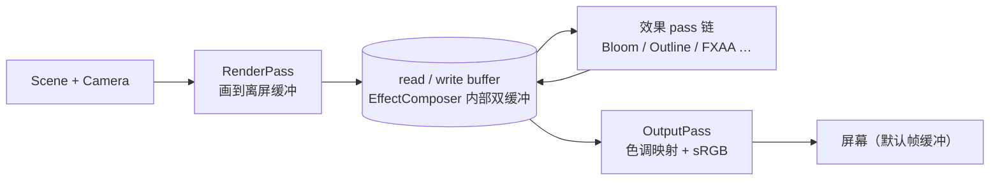

import { Canvas, Controls, Meta } from '@storybook/addon-docs/blocks';
import * as PostprocessingStories from './postprocessing-basics.stories.js';

<Meta of={PostprocessingStories} name="Docs" />

# 后处理

后处理把"渲染场景"和"画到屏幕"拆成两步：先用 `RenderPass` 把场景画到一张离屏缓冲，再让一连串 pass 依次读取上一帧的缓冲、做全屏处理、把结果写回另一张缓冲，直到最后一个 pass 才把结果送到默认帧缓冲（屏幕）。`EffectComposer` 就是这条链的管理者。

四件事共同决定最终画面：

- **pass 顺序** 决定"谁读到什么"。`composer.addPass()` 按调用顺序排列；`RenderPass` 必须是第一步（它产生原始 beauty），`OutputPass` 必须是链尾（它做色调映射和 sRGB 颜色空间转换）。中间的效果 pass 顺序决定叠加结果。
- **`composer.render(delta)`** 替代 `renderer.render(scene, camera)`。一旦启用 composer，原始 render 调用就不再直接画到屏幕。
- **`pass.enabled`** 控制单个 pass 是否参与，不破坏链路结构。composer 自动把"最后一个 enabled pass"的 `renderToScreen` 置 true。
- **代价**：每个 pass 都是一次全屏渲染，分辨率和 pixel ratio 翻倍时像素工作量按面积增长。



## 快速上手

最小闭环：建 composer，加 `RenderPass` + 一个效果 pass + `OutputPass`，把渲染调用改成 `composer.render()`：

```js
import { EffectComposer } from 'three/addons/postprocessing/EffectComposer.js';
import { RenderPass } from 'three/addons/postprocessing/RenderPass.js';
import { UnrealBloomPass } from 'three/addons/postprocessing/UnrealBloomPass.js';
import { OutputPass } from 'three/addons/postprocessing/OutputPass.js';

// 后处理链路里，色调映射由 OutputPass 在链尾统一应用；
// 因此要先在 renderer 上声明用哪种 tone mapping，OutputPass 会读它。
renderer.toneMapping = THREE.ACESFilmicToneMapping;

const composer = new EffectComposer(renderer);
composer.addPass(new RenderPass(scene, camera));

const bloomPass = new UnrealBloomPass(
  new THREE.Vector2(window.innerWidth, window.innerHeight),
  1.0,  // strength
  0.4,  // radius
  0.85  // threshold
);
composer.addPass(bloomPass);

composer.addPass(new OutputPass());

// 渲染循环里替换原来的 renderer.render(scene, camera)
renderer.setAnimationLoop((time) => {
  const delta = clock.getDelta();
  composer.render(delta);
});
```

| 输入或状态 | 默认值 / 常用起点 | 改变后要注意什么 |
| --- | --- | --- |
| `new EffectComposer(renderer)` | 内部按 renderer 尺寸和 pixel ratio 自动创建 HalfFloat 双缓冲 | renderer 改尺寸时调 `composer.setSize(w, h)`；改 pixel ratio 调 `composer.setPixelRatio(pr)` |
| `RenderPass(scene, camera)` | 链路第一步，产生原始 beauty | 它持有 scene 和 camera 引用，相机参数变化时不需要重建 pass |
| `composer.addPass(pass)` | 按调用顺序追加到链尾 | 最后一个 enabled pass 自动 `renderToScreen = true`，不需要手动设 |
| `pass.enabled` | 默认 `true` | 关闭后 composer 跳过它，但它在 passes 数组里的位置不变 |
| `renderer.toneMapping` | `NoToneMapping`（默认） | 后处理链路下 OutputPass 读它；不设会让 bloom 等效果过曝 |
| `composer.render(delta)` | delta 是秒 | 不传 delta 时 composer 用内部 `Timer` 计算；建议显式传入与动画一致的 delta |

## Pass 链与渲染缓冲

EffectComposer 内部维护一对 `readBuffer` 和 `writeBuffer`（默认 HalfFloatType 的 `WebGLRenderTarget`）。每个 pass 执行时：

1. 从 `readBuffer` 读上一帧结果。
2. 把处理后的结果写到 `writeBuffer`。
3. 如果 `pass.needsSwap` 为 true（大多数效果 pass 都是），交换两个缓冲，下一 pass 把刚才的写缓冲当读缓冲。

只有"最后一个 enabled pass"会把结果画到屏幕。EffectComposer 在每帧 `render()` 里用 `isLastEnabledPass(i)` 推导，并直接设置 `pass.renderToScreen = (this.renderToScreen && this.isLastEnabledPass(i))`——你不要手动维护 `renderToScreen`，调 `addPass` / `removePass` / `pass.enabled` 后链尾自动重算。

```js
// composer.render() 内部对每个 pass 的处理（简化）
for (let i = 0; i < passes.length; i++) {
  const pass = passes[i];
  if (pass.enabled === false) continue;
  pass.renderToScreen = renderToScreen && isLastEnabledPass(i);
  pass.render(renderer, writeBuffer, readBuffer, delta, maskActive);
  if (pass.needsSwap) swapBuffers();
}
```

### OutputPass 为什么必须在链尾

`WebGLRenderer` 直接画到屏幕时会自动做 sRGB 颜色空间转换和色调映射；但通过 composer 渲染时，原始帧画到的是离屏 render target，自动转换不触发。链尾加一个 `OutputPass` 才能把：

- `renderer.toneMapping`（如 `ACESFilmicToneMapping`）应用到最终画面；
- linear-sRGB 颜色空间转换成 `renderer.outputColorSpace`（默认 sRGB）。

不写 OutputPass 时，链尾的效果 pass（例如 UnrealBloomPass）会把线性颜色直接画到屏幕，画面会过曝、偏色。下方范例可切换 OutputPass 开关观察这个差异——这就是它"必须在链尾"的可观察证据。

少数 pass 要求 sRGB 输入（FXAA 是典型），按 OutputPass 文档：sRGB 输入的 pass 要排在 OutputPass **之后**。大多数效果 pass（Bloom、Outline、SMAA）在 linear-sRGB 空间工作，排在 OutputPass 之前。

## Bloom（UnrealBloomPass）

`UnrealBloomPass` 提取画面中亮度高于 `threshold` 的像素，做多级高斯模糊后再叠加回原图，形成光晕。三个参数共同决定光晕形态：

- **`strength`**：光晕叠加强度。`0` 等于不叠光晕（但仍有一次全屏拷贝开销）。
- **`radius`**：光晕扩散半径，范围 `[0, 1]`。它影响 composite material 里的 `bloomRadius`，数值越大光晕越散。
- **`threshold`**：亮度阈值。只有亮度高于此值的像素参与 bloom——中心高光球在任何 threshold 下都会发光，中等亮度的物体只有 threshold 调低才会进入光晕。

UnrealBloomPass 的官方说明要求"renderer 必须启用 tone mapping"；这等价于让 OutputPass 在链尾应用色调映射，否则高亮区域会直接饱和成白色。

下面的范例把整条链路摆在一起。先开关 bloom 观察光晕出现/消失，再调 threshold 看中等亮度的黄色方块何时进入光晕；最后关掉 OutputPass，整张画面会立刻过曝偏色。

<Canvas of={PostprocessingStories.BloomPlayground} />

<Controls of={PostprocessingStories.BloomPlayground} />

Canvas 进入视口前 `200px` 启动，离开后暂停并保留最后一帧。bloom 关闭时 `pass.enabled = false`，composer 会跳过它；`strength = 0` 仍会执行一次全屏拷贝，性能上不如直接 `enabled = false`。

## OutlinePass（描边）

`OutlinePass` 给"被选中对象"加描边。它每帧把 `selectedObjects` 单独画一遍蒙版，做一次深度测试以区分"可见边缘"和"被遮挡边缘"，再做高斯模糊后叠加回原图。构造签名：

```js
import { OutlinePass } from 'three/addons/postprocessing/OutlinePass.js';

const outlinePass = new OutlinePass(
  new THREE.Vector2(width, height),
  scene,
  camera,
  selectedObjects // 初始数组；可省略，之后赋值
);
```

切换选中对象不需要重建 pass，直接替换 `outlinePass.selectedObjects` 数组即可。常用可调项：

| 属性 | 默认值 | 影响 |
| --- | --- | --- |
| `selectedObjects` | `[]`（构造时可传入） | 描边的目标对象数组；赋新数组立即生效 |
| `edgeStrength` | `3` | 描边叠加强度 |
| `edgeThickness` | `1` | 描边厚度，实际影响内部高斯模糊核半径 |
| `edgeGlow` | `0` | 从可见边缘向内的辉光强度，`0` 即纯描边 |
| `pulsePeriod` | `0` | 大于 `0` 时按秒为周期做强度脉动 |
| `visibleEdgeColor` | `(1,1,1)` | 可见边缘颜色 |
| `hiddenEdgeColor` | `(0.1,0.04,0.02)` | 被遮挡部分的暗示色 |

`selectedObjects` 在真实项目里通常由 Raycaster 命中后写入——这就是它和[拾取课](?path=/docs/raycaster-pointer-interaction--docs)的衔接点：拾取决定"选中了谁"，OutlinePass 决定"选中后怎么显示"。下方范例用控件模拟选中切换，观察描边如何在对象之间移动。

<Canvas of={PostprocessingStories.OutlineSelection} />

<Controls of={PostprocessingStories.OutlineSelection} />

## 抗锯齿后处理（FXAA / SMAA）

`WebGLRenderer` 的 `antialias: true` 是 MSAA，只在画到默认帧缓冲时生效。一旦用 EffectComposer 把原始帧画到离屏 render target，MSAA 就**不再起作用**——你看到的就是几何边缘的锯齿。要在后处理链路里补回抗锯齿，有两种常用 pass：

```js
import { FXAAPass } from 'three/addons/postprocessing/FXAAPass.js';
import { SMAAPass } from 'three/addons/postprocessing/SMAAPass.js';

// FXAA：开销低，处理速度快；对纹理边缘无效，只对几何边缘有效
const fxaaPass = new FXAAPass();
composer.addPass(fxaaPass); // FXAA 需要 sRGB 输入，按文档应排在 OutputPass 之后

// SMAA：质量略好，三步（边缘检测 / 权重 / 混合）；文档明确要求排在 OutputPass 之前
const smaaPass = new SMAAPass();
composer.addPass(smaaPass);
```

| 方案 | 工作空间 | 在链路中的位置 | 适用 |
| --- | --- | --- | --- |
| `renderer.antialias: true`（MSAA） | 默认帧缓冲 | 仅在不使用 composer 时有效 | 简单场景，没有后处理时直接用 |
| `FXAAPass` | 需要 sRGB 输入 | OutputPass **之后** | 性能优先、WebGL1 兼容 |
| `SMAAPass` | linear-sRGB | OutputPass **之前** | 质量优先 |
| `FXAAShader` + `ShaderPass` | 同 FXAAPass | OutputPass 之后 | 旧代码；新项目优先用 `FXAAPass`，自动管理 resolution uniform |

FXAA / SMAA 在边缘锯齿上的视觉差异在低分辨率小画布里不直观；建议在自己的项目里全屏对比。可观察证据是几何边缘（尤其斜边和高对比处）的锯齿是否变柔——若看不到差异，先确认当前链尾是否真的画到屏幕、是否与 OutputPass 顺序冲突。

EffectComposer 的默认 render target 是 HalfFloatType、不带 MSAA 采样。需要 MSAA 后处理时，可传入自定义 render target 并设 `samples`（多采样帧缓冲在 WebGL2 上有效），但这会显著增加显存和带宽，先确认 FXAA/SMAA 不能满足再考虑。

## 性能代价

每个 pass 都是一次完整全屏渲染。粗略估算：链路里有 `RenderPass + Bloom + Outline + OutputPass` 时，单帧至少 4 次全屏绘制，再加上 bloom 内部的多级模糊（5 个 mip 各两次高斯）和 outline 的蒙版 + 模糊。控制代价的常见手段：

- **分辨率与 pixel ratio 是平方级影响**。drawing buffer 翻倍意味着像素数变成 4 倍。给 composer 用与 renderer 一致的 pixel ratio 上限（如 `min(devicePixelRatio, 2)`），移动端可主动降到 `1`。
- **按需关闭 pass**。`pass.enabled = false` 比 `strength = 0` 更省——后者仍执行一次全屏拷贝。
- **静态场景只在变化时渲染**。用 `ResizeObserver` 或事件驱动触发 `composer.render()`，而不是常驻 `setAnimationLoop`。
- **bloom 的内部缓冲是按主缓冲尺寸缩放的 mip 链**；调小 UnrealBloomPass 的初始 resolution 不会改变最终输出分辨率，但会影响它的 mip 上限。性能受限时优先调 strength / threshold / radius，而不是降主缓冲分辨率。

后处理的完整性能模型（draw calls、triangles、纹理带宽、dispose）在[性能课](?path=/docs/performance-and-disposal--docs)展开，本课只关注它作为额外全屏绘制的事实。

## 最佳实践

- 链路固定为 `RenderPass → 效果 pass … → OutputPass`；OutputPass 一定是链尾，否则线性颜色直接进屏幕。
- `renderer.toneMapping` 是后处理链路必设项；OutputPass 会在链尾读它，不设默认是 `NoToneMapping`，bloom 等高亮效果会过曝。
- 不要手动维护 `pass.renderToScreen`；用 `addPass` / `removePass` / `pass.enabled` 控制链路，composer 自动算链尾。
- 选中状态切换直接赋新数组给 `outlinePass.selectedObjects`，不要重建 pass；未选中时赋空数组。
- renderer 改尺寸时同步调 `composer.setSize(w, h)`；改 pixel ratio 调 `composer.setPixelRatio(pr)`，否则内部缓冲停留在旧尺寸。
- FXAA / SMAA 各有推荐位置（OutputPass 后 / 前），按文档排，否则颜色空间不匹配会让画面偏亮或偏暗。
- 不需要后处理时不要为了"统一接口"留一个空 composer——直接 `renderer.render()` 比 `composer.render()` 少至少两次全屏绘制。

## 常见问题

- 为什么加了 EffectComposer 后画面过曝、颜色发白？
  链尾缺少 OutputPass，效果 pass 把线性颜色直接画到屏幕。把 `new OutputPass()` 加到链路最后；同时确认 `renderer.toneMapping` 不是 `NoToneMapping`。
- 为什么 bloom 一直饱和成纯白块？
  没启用色调映射。UnrealBloomPass 文档明确要求 renderer 启用 tone mapping；让 OutputPass 在链尾应用 `renderer.toneMapping`（如 `ACESFilmicToneMapping`），或降低 `strength` / 提高 `threshold`。
- 为什么改了 `pass.renderToScreen` 没效果或下次又被覆盖？
  EffectComposer 每帧用 `isLastEnabledPass(i)` 重算每个 pass 的 `renderToScreen`。要改变链尾就调 `addPass` / `removePass` 或 `pass.enabled`，不要手设这个属性。
- 为什么 renderer 配了 `antialias: true`，进后处理链路后边缘还是有锯齿？
  MSAA 只在画到默认帧缓冲时生效；composer 把第一帧画到离屏 render target，MSAA 不再起作用。用 `FXAAPass`（链尾 OutputPass 之后）或 `SMAAPass`（OutputPass 之前）补回抗锯齿。
- 为什么 `outlinePass.selectedObjects = [mesh]` 之后描边不出现？
  检查三件事：mesh 确实在 scene 树里、OutlinePass 在 OutputPass 之前、被选中对象本身在这一帧被渲染（被剔除或 `visible = false` 时不会产生蒙版）。
- 为什么改 UnrealBloomPass 的 resolution 参数对最终画面分辨率没影响？
  resolution 只是 bloom 内部缓冲的初始尺寸，最终输出仍由 composer 的主缓冲决定。`composer.setSize()` 会按主尺寸更新 bloom 的内部缓冲；想改变光晕形态就调 strength / radius / threshold。
- 为什么 FXAA 加在 OutputPass 之前画面偏暗？
  FXAA 需要 sRGB 输入，按文档要排在 OutputPass 之后；放在之前它会按 linear-sRGB 处理亮度，结果偏暗。SMAA 则相反，必须排在 OutputPass 之前。

## 总结回顾

摘要：

后处理把"渲染场景"和"画到屏幕"拆开，由 EffectComposer 管理一条 pass 链：`RenderPass` 把场景画到内部双缓冲，效果 pass（Bloom、Outline、FXAA/SMAA 等）依次读、写、交换缓冲，最后一个 enabled pass 自动画到屏幕。链尾的 `OutputPass` 负责色调映射和 sRGB 颜色空间转换，是后处理链路必经的出口。`UnrealBloomPass` 用 `strength` / `radius` / `threshold` 控制光晕，要求 renderer 启用 tone mapping；`OutlinePass` 通过 `selectedObjects` 数组决定描边目标，常用 `edgeStrength` / `edgeThickness` 调形态。MSAA 不作用于离屏 render target，进后处理链路后要用 `FXAAPass`（链尾之后）或 `SMAAPass`（链尾之前）补抗锯齿。每个 pass 都是一次全屏绘制，分辨率和 pixel ratio 是平方级影响。

一句话：

> EffectComposer 用一条 pass 链替代 renderer.render，OutputPass 永远在链尾，每多一个 pass 就多一次全屏渲染。

知识要点：

- RenderPass、效果 pass 和 OutputPass 在链路里各自的位置为什么不能换？
- 为什么 `composer.render()` 替代 `renderer.render()` 之后 MSAA 失效，要靠 FXAA / SMAA 补回？
- OutputPass 不写时画面为什么会过曝？它和 `renderer.toneMapping` 是什么关系？
- UnrealBloomPass 的 strength / radius / threshold 各自影响什么？为什么它要求启用 tone mapping？
- OutlinePass 怎样和拾取衔接？切换选中对象时为什么不需要重建 pass？
- FXAA 和 SMAA 在链路中的位置为什么相反？

## 参考资料

- [Three.js Docs：EffectComposer](https://threejs.org/docs/?q=EffectComposer#examples/en/postprocessing/EffectComposer)
- [Three.js Docs：UnrealBloomPass](https://threejs.org/docs/?q=UnrealBloomPass#examples/en/postprocessing/UnrealBloomPass)
- [Three.js Docs：OutlinePass](https://threejs.org/docs/?q=OutlinePass#examples/en/postprocessing/OutlinePass)
- [Three.js Docs：OutputPass](https://threejs.org/docs/?q=OutputPass#examples/en/postprocessing/OutputPass)
- [Three.js Examples：WebGL Postprocessing](https://threejs.org/examples/?q=postproce#webgl_postprocessing)
- [Three.js Examples：WebGL Postprocessing Outline](https://threejs.org/examples/?q=postproce#webgl_postprocessing_outline)
- [Three.js Examples：WebGL Postprocessing SMAA](https://threejs.org/examples/?q=postproce#webgl_postprocessing_smaa)
- [Three.js Manual：How to use post-processing](https://threejs.org/manual/#en/post-processing)
