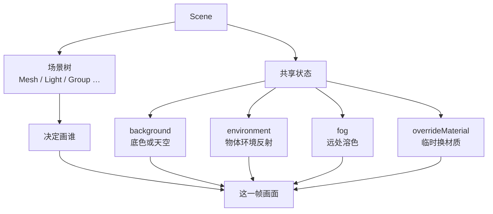

import { Canvas, Controls, Meta } from '@storybook/addon-docs/blocks';
import * as SceneStories from './scene-render-root.stories.js';

<Meta of={SceneStories} name="Docs" />

# Scene

`Scene` 是交给 `renderer.render(scene, camera)` 的场景根：决定**画哪些对象**，并带上这次渲染共享的**底色、环境反射、雾和临时材质**。相机作为 `render` 的第二个参数使用，不一定要挂进 Scene。



| 成员 | 默认 | 回查要点 |
| --- | --- | --- |
| `add` / `children` | 空 | 没挂上就不会进这次渲染 |
| `position` / `rotation` / `scale` | 单位变换 | 能改，但实务上通常变换内容 Group |
| `background` | `null` | 底色或天空；不照亮物体 |
| `environment` | `null` | 全场环境反射；不自动变底色 |
| `fog` | `null` | `Fog` 或 `FogExp2`；材质要允许参与 |
| `overrideMaterial` | `null` | 临时换材质；用完恢复；`allowOverride=false` 可排除 |
| `backgroundIntensity` / `Blurriness` / `Rotation` | `1` / `0` / 零旋转 | 主要作用于环境式背景纹理 |
| `environmentIntensity` / `Rotation` | `1` / 零旋转 | 只作用于全局环境反射 |
| `isScene` | `true` | 只读类型标记 |

## 快速上手

创建 Scene，挂上对象，再设背景与雾：

```js
const scene = new THREE.Scene();
scene.background = new THREE.Color('#dbe8e1');
scene.fog = new THREE.Fog('#dbe8e1', 6, 22);

scene.add(mesh, light);
renderer.render(scene, camera);
```

## 挂载对象

要把 Mesh、Light、Group 画进这一帧，先把它们 `add` 进 Scene。`renderer.render(scene, camera)` 从 Scene 开始遍历可见对象；没挂上去的对象不会进入这次渲染。

Scene 的 `children` 只列直属对象，后代仍由 Object3D 层级管理。把 Group 加入 Scene，就会连同可见后代一起进入遍历；移除 Group，整棵子树都退出当前渲染入口。

```js
const root = new THREE.Group();
root.add(body, label);
scene.add(root);

scene.traverse((object) => {
  console.log(object.type, object.name);
});
```

相机不一定要加入 Scene：只要把它作为第二个参数传给 `renderer.render()` 就能使用。需要相机继承父级变换、用 helper 观察或统一管理时，再挂入场景树。

## 变换 Scene

Scene 继承 Object3D，所以也能设 `position` / `rotation` / `scale`。完整的父子层级、世界坐标规则见 [Object3D](?path=/docs/object3d-transform-hierarchy--docs)。

但实务上很少改 Scene 自身变换：它会带动整棵已挂载子树，也容易和“只想移动场景内容”搞混。更常见的做法是把可移动内容放进一个 Group，只变换这个 Group；Scene 保持不动，继续只当渲染根。

切换「变换写到」，比较 `scene.position`、内容 Group 与网格世界坐标；再开关 `scene.add(marker)` 观察直属 `children` 数量。相机始终未入树。

<Canvas of={SceneStories.MountAndTransform} />

<Controls of={SceneStories.MountAndTransform} />

## 背景

背景决定画布上“没有物体的地方”长什么样：可以是纯色底，也可以是天空盒一类的环境贴图。它只填充未被物体盖住的像素，**不照亮物体**。

```js
scene.background = new THREE.Color('#dbe8e1');
// 或
scene.background = environmentTexture;
scene.backgroundIntensity = 0.8;
scene.backgroundBlurriness = 0.2;
scene.backgroundRotation.set(0, Math.PI / 4, 0);
```

- `background`：`Color`、平面纹理，或用作天空盒的立方体 / 等距矩形纹理。
- `backgroundIntensity` / `backgroundBlurriness` / `backgroundRotation`：主要调节环境式背景纹理；纯色时无效。`backgroundRotation` 只转背景，不转材质反射方向。

切换纯色与环境贴图背景，再调 Intensity / Blurriness / Rotation。本例故意保持 `scene.environment = null`，物体明暗只来自灯光。

<Canvas of={SceneStories.Background} />

<Controls of={SceneStories.Background} />

背景与环境贴图的加载、color space 和 PMREM 处理见 [纹理](?path=/docs/textures-and-maps--docs) 与 [PBR](?path=/docs/pbr-and-environment-maps--docs)。

## 环境

环境是挂在 Scene 上的全局“周围世界”，给物理材质提供反射和间接光照。金属、光滑塑料要靠它才看得出颜色与明暗；它**不会**自动变成画布底色——想看到天空，还得另设 `background`。

```js
scene.environment = environmentTexture;
scene.environmentIntensity = 1.2;
scene.environmentRotation.set(0, Math.PI / 6, 0);
```

- `environment` / `environmentIntensity` / `environmentRotation`：全场环境反射及其强度、朝向。
- 某个材质自己写了 `envMap` 时，优先用材质上的贴图，不再吃 Scene 的全局环境。

开关 `scene.environment`，并调 Intensity / Rotation。左侧金属球只吃 Scene 环境；右侧球自带 `material.envMap`，关掉全场环境后仍保持反射。背景始终是固定纯色。

<Canvas of={SceneStories.Environment} />

<Controls of={SceneStories.Environment} />

PMREM 预过滤、HDRI 加载、金属度 / 粗糙度与色调映射见 [PBR](?path=/docs/pbr-and-environment-maps--docs)。

## 雾

雾让远处物体逐渐溶进雾色，常用来暗示距离、藏远裁剪面，或统一远景气氛。它改的是**物体表面颜色**，不是在空中另画一团烟；空白背景仍由 `background` 决定。

```js
scene.fog = new THREE.Fog('#dbe8e1', 6, 22);
// 或
scene.fog = new THREE.FogExp2('#dbe8e1', 0.055);
```

- `Fog(color, near=1, far=1000)`：`near` 前不变，到 `far` 完全变成雾色；`near >= far` 时过渡失去正常意义。
- `FogExp2(color, density=0.00025)`：从相机起按密度指数变浓。
- 材质的 `fog` 默认可参与；设为 `false` 则该物体不受雾影响。

切换雾类型与参数；关闭“背景跟随雾色”可观察远处硬边。橙色球关闭了 `material.fog`，不受雾影响。

<Canvas of={SceneStories.Fog} />

<Controls of={SceneStories.Fog} />

## 材质覆盖

材质覆盖是一次渲染时的**临时换装**：物体形状和位置不变，但全场（或多数物体）统一用同一种材质画出来。常见用途是看法线、做深度 / 遮罩通道，或快速排查“到底是几何问题还是材质问题”。

`overrideMaterial` 写在 Scene 上，影响随后的 `render`；用完必须恢复，否则后面每一帧都会继续被覆盖。某个材质要排除时，设 `material.allowOverride = false`。

```js
const previous = scene.overrideMaterial;

try {
  scene.overrideMaterial = new THREE.MeshNormalMaterial();
  renderer.render(scene, camera);
} finally {
  scene.overrideMaterial = previous;
}
```

<Canvas of={SceneStories.OverrideMaterial} />

<Controls of={SceneStories.OverrideMaterial} />

## 清理场景

从 Scene 里 `remove` / `clear` 只拆掉父子关系，**不会**释放 GPU 里的几何、材质和纹理。确认资源不再使用后，还要分别 `dispose()`。

```js
scene.traverse((object) => {
  object.geometry?.dispose();

  const materials = Array.isArray(object.material)
    ? object.material
    : object.material
      ? [object.material]
      : [];

  materials.forEach((material) => {
    Object.values(material).forEach((value) => {
      if (value && typeof value.dispose === 'function') {
        value.dispose();
      }
    });
    material.dispose();
  });
});

scene.clear();
```

环境纹理若由 `PMREMGenerator` 生成，用完后还要释放 generator 与相关 render target；细节见 [性能](?path=/docs/performance-and-disposal--docs)。

## 最佳实践

- 用一个 Scene 表示一次明确的渲染根，不把 Scene 嵌套当作普通 Group 使用。
- 需要整体移动场景内容时，变换内容 Group；让 Scene 保持单位变换。
- 背景、环境光与雾分别调试；相同颜色不代表它们是同一机制。
- Fog 颜色通常从背景主色开始，再根据目标调整，避免远处对象出现硬边。
- 临时设置 `overrideMaterial` 时使用 `try/finally` 或集中渲染函数恢复旧值。
- 环境纹理只加载和预处理一次，通过 Scene 在多个材质间共享。
- 清理场景时遍历并 dispose 几何、材质与纹理；`scene.clear()` 不能替代资源释放。

## 常见问题

- 为什么 `scene.add()` 之后仍然看不到对象？
  Scene 只负责让对象进入场景树；继续检查相机是否看得到对象、对象是否被裁剪，以及材质和光照是否能让它显示。
- 为什么改了 `scene.position`，构图却和预期不一样？
  Scene 的变换会作用于整棵已挂载子树；若只想移动内容，把内容放进 Group 并变换 Group，完整 TRS 规则回查 [Object3D](?path=/docs/object3d-transform-hierarchy--docs)。
- 为什么设置了背景，物体仍然很暗？
  `scene.background` 只负责背景像素；需要添加 Light，或设置可用于照明的 `scene.environment`。
- 为什么设置了 `scene.environment`，画布底色却没有变化？
  `environment` 主要参与材质的环境光照；若要改变底色，另外设置 `scene.background`。
- 为什么雾没有效果？
  检查对象与相机的距离、Fog 的范围，以及材质是否启用雾；对象距离没有进入雾的范围时，画面不会出现明显变化。
- 为什么开了雾，空白背景却没有雾气？
  雾只改写支持雾的物体颜色，不会在空像素上画体积烟；空白处仍由 `background` 决定。
- 为什么临时设置 `overrideMaterial` 后，后续渲染一直使用法线材质？
  临时覆盖后恢复原值，最好用 `try/finally` 保证 `scene.overrideMaterial` 最终恢复为旧材质或 `null`。
- 为什么开了材质覆盖，物体形状却没变？
  `overrideMaterial` 只换绘制材质，不改几何与变换；要排除某个材质时设 `allowOverride = false`。
- 为什么 `scene.clear()` 之后显存仍然没有下降？
  `clear()` 只移除场景树中的对象；确认资源不再被使用后，还要分别对 geometry、material 和 texture 调用 `dispose()`。

## 总结回顾

摘要：

Scene 既是场景树的渲染根，也是一次渲染共享状态的容器。挂载决定谁进入遍历；Scene 自身也能变换，但实务上通常只变换内容 Group。background、environment、fog 与 overrideMaterial 分别控制底色/天空、环境反射、远景溶色和临时换材质。移除对象不等于释放资源。

一句话：

> 把 Scene 当作渲染根，并分别管理对象树、背景、环境、雾和材质覆盖。

知识要点：

- Scene 作为根容器与内容 Group 的职责有什么不同？
- 为什么很少直接变换 Scene 自身？
- background 与 environment 分别影响哪部分结果？
- `Fog` 和 `FogExp2` 怎样根据深度产生不同过渡？
- 为什么 `scene.clear()` 不能替代资源释放？

## 参考资料

- [Three.js Docs：Scene](https://threejs.org/docs/pages/Scene.html)
- [Three.js Docs：Fog](https://threejs.org/docs/pages/Fog.html)
- [Three.js Docs：FogExp2](https://threejs.org/docs/pages/FogExp2.html)
- [Three.js Manual：Scene graph](https://threejs.org/manual/en/scenegraph.html)
- [Three.js Manual：Fog](https://threejs.org/manual/en/fog.html)
