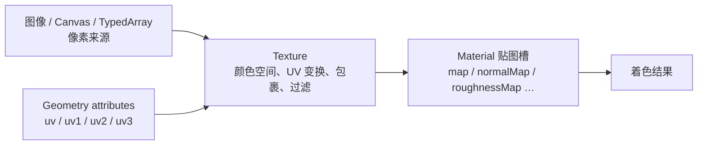

import { Canvas, Controls, Meta } from '@storybook/addon-docs/blocks';
import * as TextureStories from './textures-and-maps.stories.js';

<Meta of={TextureStories} name="Docs" />

# 纹理

几何体的 UV 回答“表面这一点去纹理的哪里取样”，`Texture` 回答“图像数据怎样变换、越界和过滤”，材质贴图槽回答“采样值用作颜色、粗糙度、法线还是别的数据”。把这三层分开，才能预测一张图为什么会拉伸、重复、偏色或没有产生预期材质效果。



## 快速上手

用 `TextureLoader.loadAsync()` 加载颜色贴图，声明它存储的是 sRGB 颜色，再交给材质：

```js
const loader = new THREE.TextureLoader();
const texture = await loader.loadAsync('/textures/base-color.webp');

texture.colorSpace = THREE.SRGBColorSpace;

const material = new THREE.MeshStandardMaterial({
  map: texture,
  roughness: 0.6,
  metalness: 0.1
});
mesh.material = material;
```

下面的实例走过真实异步加载、颜色空间设置、`material.map` 接入和成功 / 失败状态更新。范例使用本地生成的 SVG URL，因此不依赖远端服务。

<Canvas of={TextureStories.TextureLoading} />

| 输入或状态 | 默认值 / 常用起点 | 改变后要注意什么 |
| --- | --- | --- |
| `colorSpace` | `NoColorSpace` | `map`、`emissiveMap` 等颜色纹理通常设 `SRGBColorSpace`；法线、粗糙度等数据纹理保持无颜色空间 |
| `wrapS / wrapT` | `ClampToEdgeWrapping` | 改成 `RepeatWrapping` 或 `MirroredRepeatWrapping` 后标记 `texture.needsUpdate = true` |
| `repeat / offset / center / rotation` | `(1,1)` / `(0,0)` / `(0,0)` / `0` | `matrixAutoUpdate = true` 时渲染前自动组合 UV 变换；`rotation` 单位是弧度 |
| `magFilter` | `LinearFilter` | 纹理被放大时生效；可用 `NearestFilter` 保留像素边缘 |
| `minFilter` | `LinearMipmapLinearFilter` | 纹理被缩小时生效；mipmap 过滤减少远处闪烁，但增加纹理存储和生成成本 |
| `anisotropy` | `1` | 提高倾斜表面的清晰度，也增加纹理采样成本；上限由 renderer 能力决定 |
| `flipY` | 普通 `Texture` 为 `true` | `GLTFLoader` 会按 glTF 约定处理为 `false`；手工替换 glTF 材质纹理时常需同步该方向 |
| `needsUpdate` | 只写入 `true` 触发上传，版本从 `0` 开始 | 像素或 GPU 采样状态改变后设置；不要每帧无条件设置 |

## 加载与更新

`TextureLoader` 适合浏览器可解码的图片 URL。`loadAsync(url, onProgress)` 返回 `Promise<Texture>`；真正的像素请求是异步的，加载前不要依赖 `texture.image.width` 等结果。多资源进度和失败汇总交给 `LoadingManager`。

```js
const manager = new THREE.LoadingManager();
manager.onProgress = (url, loaded, total) => {
  status.textContent = `${loaded} / ${total}: ${url}`;
};
manager.onError = (url) => {
  status.textContent = `加载失败：${url}`;
};

const texture = await new THREE.TextureLoader(manager).loadAsync(url);
```

不同来源的更新方式不同：

| 类型 | 来源 | 内容变化后的动作 | 典型用途 |
| --- | --- | --- | --- |
| `TextureLoader` 返回的 `Texture` | 图片 URL | 首次加载由 loader 标记更新；替换像素来源后再设 `needsUpdate` | PNG、JPEG、WebP、AVIF、SVG |
| `CanvasTexture` | `<canvas>` | 重新绘制 canvas 后设 `texture.needsUpdate = true` | 标签、图表、动态文字 |
| `DataTexture` | `TypedArray` | 修改数组后设 `texture.needsUpdate = true` | 程序遮罩、查找表、数据图 |
| `VideoTexture` | `<video>` | renderer 会处理新视频帧 | 视频表面 |

初次使用后不能就地改变纹理的尺寸、`format` 或 `type`。需要换存储结构时，释放旧纹理并新建实例。只改变 `offset`、`repeat`、`rotation` 等 UV 变换属性，不需要重新上传像素。

## UV 与包裹

默认 `UVMapping` 从纹理的 `channel` 指定几何 attribute：`0` 对应 `uv`，`1` 对应 `uv1`，依次可到 `uv3`。UV 通常位于 `0..1`；越界以后是夹住边缘、重复还是镜像重复，由 `wrapS`（U 方向）和 `wrapT`（V 方向）决定。

```js
texture.wrapS = THREE.RepeatWrapping;
texture.wrapT = THREE.RepeatWrapping;
texture.repeat.set(3, 2);
texture.offset.set(0.1, 0);
texture.center.set(0.5, 0.5);
texture.rotation = THREE.MathUtils.degToRad(30);
texture.needsUpdate = true;
```

调整下面的变换和包裹方式。把 `repeat` 调到 `2` 以上后切换 `ClampToEdgeWrapping`，画面不会平铺，而会在 UV 越界区域拉长边缘像素。

<Canvas of={TextureStories.UvAndWrapping} />

<Controls of={TextureStories.UvAndWrapping} />

纹理变形若只发生在某个模型上，先检查该几何体的 UV 展开；所有模型都出现相同方向或重复问题，再检查 `Texture`。`Texture.transformUv()` 可在 CPU 侧用相同矩阵换算一个 UV，适合调试，不应逐像素代替 shader 采样。

## 颜色空间

颜色纹理和数据纹理即使都以 RGB 通道保存，数值含义也不同：

- base color、emissive 和 UI 图片保存的是供人眼显示的颜色，通常按 sRGB 编码；采样前要解码到线性工作空间。
- normal、roughness、metalness、AO、alpha 和 displacement 保存的是数值，不能做 sRGB 解码，使用 `NoColorSpace`。
- `renderer.outputColorSpace = THREE.SRGBColorSpace` 管最终画布编码，不能代替输入纹理声明。

同一份像素在左侧被声明为 sRGB 颜色，右侧被误当成线性数据。比较中间调和灰条即可看出错误声明会改变亮度；两侧使用相同 renderer 输出条件。

<Canvas of={TextureStories.ColorSpace} />

`GLTFLoader` 会根据 glTF 材质语义设置颜色空间和 `flipY`。手工替换加载后模型的 `material.map` 时，新的颜色纹理仍要自己设置 `SRGBColorSpace`，通常也要把 `flipY` 设为 `false` 才与原 UV 方向一致。

## 过滤与 mipmap

纹素和屏幕像素不再一一对应时才需要过滤：

- 放大由 `magFilter` 决定，核心选择是保留像素边缘的 `NearestFilter`，或平滑插值的 `LinearFilter`。
- 缩小由 `minFilter` 决定。无 mipmap 的 nearest / linear 只从原图取样；mipmap 过滤会从更接近当前屏幕尺寸的层级取样。
- `anisotropy` 专门改善斜视表面在一个方向上被强烈压缩时的模糊，最大值用 `renderer.capabilities.getMaxAnisotropy()` 查询。

下面的平面沿深度方向倾斜。切换过滤预设，再移动相机；观察近端像素边缘与远端闪烁 / 模糊是两类问题。

<Canvas of={TextureStories.Filtering} />

<Controls of={TextureStories.Filtering} />

`generateMipmaps` 默认是 `true`。渲染目标、压缩纹理和自带 mip 层的纹理有各自上传规则；不要只为“更清晰”关闭 mipmap。贴图尺寸和显存压力属于资产与性能问题，分别在 [资产](?path=/docs/asset-pipeline-checklist--docs) 和性能课程继续处理。

## 材质贴图槽

纹理对象只保存数据与采样规则，放进哪个材质属性才决定用途。多数强度属性会与贴图通道相乘，而不是被贴图完全替代。例如 `roughnessMap` 的绿色通道会乘上 `material.roughness`。

| 槽位 | 数据含义 | 颜色空间 / 关键边界 |
| --- | --- | --- |
| `map` | 基础颜色，乘 `material.color` | 颜色数据，通常 `SRGBColorSpace` |
| `emissiveMap` | 自发光颜色，乘 `emissive` 与 `emissiveIntensity` | 颜色数据，通常 `SRGBColorSpace` |
| `roughnessMap` | 绿色通道控制粗糙度 | 数据纹理；还受 `roughness` 乘数影响 |
| `metalnessMap` | 蓝色通道控制金属度 | 数据纹理；还受 `metalness` 乘数影响 |
| `normalMap` | RGB 存切线空间或对象空间法线 | 数据纹理；强度由 `normalScale` 控制 |
| `aoMap` | 红色通道控制环境遮蔽 | 数据纹理；用 `texture.channel` 选择 UV attribute |
| `alphaMap` | 绿色通道控制透明度 | 数据纹理；通常还要设置 `transparent` 或 `alphaTest` |
| `bumpMap` | 灰度扰动表面法线 | 只改明暗，不改轮廓；受 `bumpScale` 控制 |
| `displacementMap` | 顶点沿法线位移 | 需要足够顶点密度；会真实改变轮廓和包围范围 |

分别关闭颜色、粗糙度和法线贴图。画面与读数会显示三个槽位各自改变什么；添加或移除槽位后实例设置 `material.needsUpdate = true`，因为 shader 是否采样该贴图的分支发生了变化。

<Canvas of={TextureStories.MaterialMapSlots} />

<Controls of={TextureStories.MaterialMapSlots} />

同一张纹理可以复用给多个材质，也可以让不同 `Texture` 共享同一个 `Source`。释放时按所有权去重：只有确认没有材质继续使用后才调用 `texture.dispose()`。

## 最佳实践

- 先按“颜色还是数值”声明 `colorSpace`，再调灯光和材质；颜色空间错误会污染后续所有视觉判断。
- 优先修模型 UV，再用 `repeat` / `offset` 做运行时构图；不要用极端纹理变换掩盖错误展开。
- 只在像素或采样状态变化后设置 `texture.needsUpdate`；添加 / 移除材质贴图槽时再设置 `material.needsUpdate`。
- 用目标显示尺寸选择源图分辨率；限制移动端贴图尺寸，并在倾斜表面确有收益时提高 anisotropy。
- 对 glTF 模型优先让 `GLTFLoader` 建立纹理语义；手工替换时同时复核颜色空间、`flipY`、UV channel 和贴图强度。
- 同一图片多处复用时共享纹理或 `Source`；销毁场景时对 texture 去重后 `dispose()`。

## 常见问题

- 为什么贴图完全不出现？
  先确认请求成功，再检查纹理是否赋给正确的材质槽，以及几何体是否有对应的 UV；不要只盯着图片 URL。
- 为什么设置了 `repeat`，贴图却只拉长边缘？
  先把 `wrapS` 和 `wrapT` 设置为 `THREE.RepeatWrapping`，再设置 `repeat`，最后将 `texture.needsUpdate` 设为 `true`。
- 为什么贴图颜色偏亮、偏灰或对比异常？
  颜色纹理使用 `texture.colorSpace = THREE.SRGBColorSpace`，法线、粗糙度等数据纹理保持 `THREE.NoColorSpace`；可参考 [Three.js Color Management](https://threejs.org/manual/en/color-management.html)。
- 为什么给 glTF 手工替换的图片上下颠倒？
  glTF 纹理通常使用 `texture.flipY = false`；替换后同时复核颜色空间、UV channel 和贴图槽位。
- 为什么远处纹理闪烁或出现摩尔纹？
  缩小时优先使用 mipmap 过滤；斜视表面再按 renderer 的上限增加 anisotropy，避免只靠提高原图分辨率解决。
- 为什么近处的像素画变模糊？
  将 `magFilter` 设置为 `THREE.NearestFilter`，让放大时保留硬边。
- 为什么法线贴图让颜色或凹凸变得不对？
  把法线贴图放入 `normalMap` 而不是 `map`，保持 `NoColorSpace`，并确认模型的切线和法线方向约定一致。
- 为什么 Canvas 内容变了，画面里的贴图却没变？
  更新 Canvas 后设置 `texture.needsUpdate = true`，通知 GPU 重新上传像素。
- 为什么运行时添加 `map` 后材质仍然像没有贴图？
  从没有贴图切换到有贴图会改变 shader 分支；设置 `material.needsUpdate = true`，让材质重新编译。

## 总结回顾

摘要：

纹理从像素来源进入 `Texture`，由几何 UV 决定采样位置，再由材质槽解释采样结果。UV 变换和包裹控制位置与越界，过滤和 mipmap控制缩放时的取样，颜色空间保证颜色与数值按正确语义进入线性着色流程；像素 / 采样状态与材质贴图分支分别通过 `texture.needsUpdate` 和 `material.needsUpdate` 生效。

一句话：

> 先分清 UV、Texture 采样和材质槽三层，再按颜色语义与生效时机设置纹理。

知识要点：

- UV、纹理对象和材质贴图槽分别决定最终画面的哪一部分？
- 什么时候应使用 `SRGBColorSpace`，什么时候必须保持 `NoColorSpace`？
- 放大、缩小和倾斜观察时分别由哪些过滤参数控制？
- 为什么属性或 Canvas 已经改变，GPU 画面仍可能保留旧状态？
- 怎样从拉伸、偏色、闪烁和上下颠倒判断纹理问题？

## 参考资料

- [Three.js Manual：Textures](https://threejs.org/manual/en/textures.html)
- [Three.js Manual：Texture types](https://threejs.org/manual/en/texture-types.html)
- [Three.js Manual：Color management](https://threejs.org/manual/en/color-management.html)
- [Three.js Docs：Texture](https://threejs.org/docs/pages/Texture.html)
- [Three.js Docs：TextureLoader](https://threejs.org/docs/pages/TextureLoader.html)
- [Three.js Docs：CanvasTexture](https://threejs.org/docs/pages/CanvasTexture.html)
- [Three.js Docs：DataTexture](https://threejs.org/docs/pages/DataTexture.html)
- [Three.js Docs：MeshStandardMaterial](https://threejs.org/docs/pages/MeshStandardMaterial.html)
