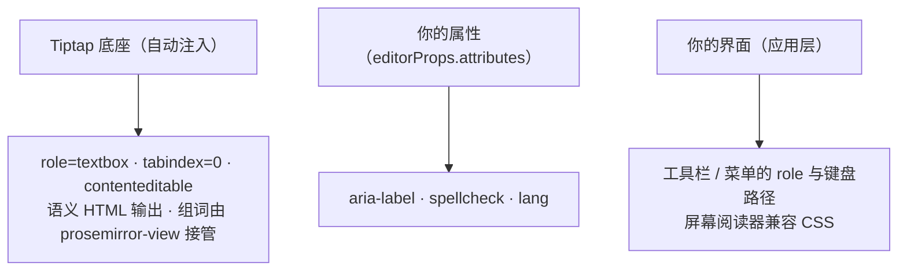

import { Canvas, Controls, Meta } from '@storybook/addon-docs/blocks';
import * as AccessibilityStories from './accessibility.stories';

<Meta of={AccessibilityStories} name="Docs" />

# 无障碍与输入细节

Tiptap 是 headless 编辑器，「能打字」不等于「可访问」——官方无障碍指南的核心主张就是：编辑器本身不提供界面，保证它可访问是你的责任。Tiptap 自己只做两件事：往编辑区注入一个最小的 ARIA 底座（`role="textbox"`、`tabindex="0"`、`contenteditable`），并让默认扩展输出语义化 HTML；输入法组词则由底层 prosemirror-view 全程接管。其余全是标准 HTML 属性、CSS 与应用层的事：`aria-label` 要用 `editorProps.attributes` 补，拼写检查是 `spellcheck` / `lang` 两个标准属性，工具栏和菜单的键盘路径要自己搭——Tiptap 没有专门的「无障碍配置 API」。本课把这些散落的开关收拢成一张清单。看完开场参考表你应该能预测：`role="textbox"` 关不掉、`tabindex="0"` 只在可编辑时出现、拼写检查只是往编辑区写一个标准 HTML 属性。



| 输入 | 默认值 | 回查要点 |
| --- | --- | --- |
| `role` | `textbox`（Tiptap 注入） | 构造与应用属性时都并入 `editorProps.attributes`；传同名属性可覆盖 |
| `tabindex` | `0`（可编辑时） | 不可编辑默认不加；`coreExtensionOptions.tabindex.value` 可覆盖（见 1.4） |
| `contenteditable` | 随 `editable` | 底层 prosemirror-view 写入 |
| `aria-label` | 无 | 用 `editorProps.attributes` 自行补充 |
| `spellcheck` | 不设置 | 标准 HTML 属性，取字符串 `'true'` / `'false'`，经 `editorProps.attributes` 写入 |
| `lang` | 不设置 | 与 `spellcheck` 搭配声明内容语言 |
| `editor.view.composing` | `false` | 组词（composition）进行中为 `true` |
| 事务 meta `composition` | 无 | 组词输入产生的事务携带组词 ID |

边界：本课管编辑区本身与输入链路。工具栏与菜单的实现见 3.4 菜单；快捷键的编写见 4.3 快捷键与输入规则。

## ARIA 属性

编辑区的属性分两处来源。第一处是 Tiptap 固定注入的底座：`@tiptap/core` 在创建视图和每次应用属性时，都把 `role="textbox"` 与 `editorProps.attributes` 合并（先放 role，再展开你的属性），所以无论怎么配置，编辑区始终带 textbox 语义——想换 role 只能显式传同名属性覆盖。`tabindex` 由核心扩展 Tabindex 提供：可编辑时给 `tabindex="0"`，不可编辑时默认什么都不加；有了它键盘用户按 Tab 就能进入编辑区。`contenteditable` 则随 `editable` 选项由 prosemirror-view 写入。

第二处是你要补的：官方指南建议给编辑区加 `aria-label`（一页多个编辑器时读屏用户靠它区分），给你的工具栏加 `role="toolbar"`、菜单加 `role="menu"`、菜单项加 `role="menuitem"`——这些 role 挂在你自己写的 DOM 上，不是 Tiptap 的配置项。官方指南整体对齐 WCAG（键盘可用、无键盘陷阱、Name/Role/Value 等条款）。

下面的实例读数直接取自 `editor.view.dom` 的实际属性：

<Canvas of={AccessibilityStories.AriaAttributes} />
<Controls of={AccessibilityStories.AriaAttributes} />

| 读者操作 | 可观察证据 |
| --- | --- |
| 查看初始读数 | role 恒为 textbox；tabindex=0、contenteditable=true 来自核心扩展与 editable 选项 |
| 在「aria-label」输入文字 | 读数 aria-label 同步出现，role 不受影响——核心注入与你的属性共存 |
| 清空「aria-label」 | 属性从 DOM 移除 |
| 打开 Show code | 看到该 Canvas 实际执行的 `aria-attributes.ts` |

构造时补充 `aria-label` 的最小写法：

```ts
new Editor({
  extensions: [StarterKit],
  editorProps: {
    attributes: {
      // Tiptap 已注入 role="textbox"，这里补语义名称
      'aria-label': '课程正文编辑器',
    },
  },
});
```

## 键盘可达性

- **默认快捷键覆盖常用编辑操作：** Mod-B 加粗、Mod-I 斜体、Mod-Z 撤销、Shift+方向键扩展选区等（`Mod` 在 macOS 上是 Cmd、其他平台是 Ctrl；完整清单见官方 keyboard-shortcuts 页）。哪些生效取决于装了哪些扩展，官方页面明确说明并非所有快捷键都可用。这些是纯编辑快捷键——官方文档没有专门的「屏幕阅读器快捷键」。
- **自定义入口是 `addKeyboardShortcuts()`：** 键名写法、返回值与冲突规则见 4.3 快捷键与输入规则；「跳到工具栏」这类导航键也在这里绑。
- **官方无障碍示例采用的键盘约定**（示范做法，不是 API）：`Tab` 聚焦编辑区（`tabindex="0"` 已保证）；`Alt+F10` 从编辑区跳到工具栏，方向键移动、Enter 激活、`Tab` / `Esc` 回到正文；`Shift+方向键` 选字后 `Tab` 打开选中菜单，`Esc` 退出。
- **键盘陷阱要留出口：** 模态框、键盘唤出的菜单「进得去出不来」就是陷阱；每个用键盘打开的浮层都要响应 `Esc`（对应 WCAG 2.1.2 No Keyboard Trap）。

## 屏幕阅读器

底座是语义 HTML：默认扩展输出 `<p>`、`<h1>`、`<ul>`、`<strong>` 等标准标签，屏幕阅读器无需配置就能按结构朗读；自定义扩展的 `renderHTML` 也应输出语义标签（见 4.1 Schema、节点与标记）。

macOS VoiceOver 有一个已知怪癖：相邻块元素的文字会被连读，`<h1>Heading</h1><p>Paragraph</p>` 被读成「HeadingParagraph」。官方修复是在块级元素后补一个零宽空格：

```css
/* 官方指南给出的写法（CSS 嵌套语法） */
.tiptap {
  h1::after,
  h2::after,
  h3::after,
  h4::after,
  h5::after,
  h6::after,
  p::after {
    content: '\200B';
  }
}
```

## 拼写检查

### spellcheck 与 lang

浏览器原生拼写检查不需要任何扩展：往编辑区（`contenteditable` 元素）写两个标准 HTML 属性即可，`spellcheck="true"` 请求检查、`lang` 声明内容语言。属性值都是字符串。Tiptap 里经 `editorProps.attributes` 写入：

```ts
new Editor({
  extensions: [StarterKit],
  editorProps: {
    attributes: {
      spellcheck: 'true', // 请求浏览器检查拼写
      lang: 'en-US', // 声明语言；浏览器字典设置仍然生效
    },
  },
});
```

实例把两个属性接成控件，运行期切换，读数是 DOM 上的实际属性值：

<Canvas of={AccessibilityStories.Spellcheck} />
<Controls of={AccessibilityStories.Spellcheck} />

| 读者操作 | 可观察证据 |
| --- | --- |
| 关闭「spellcheck」 | 读数 spellcheck 变为 false；页面红线是否消失由浏览器决定 |
| 切换「lang」 | 读数 lang 同步变化，新值以字符串写入 DOM |
| 打开 Show code | 看到该 Canvas 实际执行的 `spellcheck-demo.ts` |

边界：属性只表达「请求」。下划线与建议菜单完全由浏览器控制——用户可在浏览器设置里关闭拼写检查、对应语言的字典必须已安装；不同浏览器表现不同，官方建议在支持的目标浏览器上实测。

### 运行期切换与排查

运行期用 `setOptions()` 切换。官方给出的模式是展开旧的 `editorProps` 和 `attributes`——`setOptions` 会整体替换 `editorProps`，不展开就把已有的事件钩子一并丢了；`attributes` 用函数形式时，更新函数而不是展开对象：

```ts
function setSpellcheck(editor: Editor, enabled: boolean): void {
  const { editorProps } = editor.options;
  const previous = (editorProps?.attributes ?? {}) as Record<string, string>;
  editor.setOptions({
    editorProps: {
      ...editorProps,
      attributes: {
        ...previous, // 保留 class、role、lang 等
        spellcheck: enabled ? 'true' : 'false',
      },
    },
  });
}
```

红线没出现时，按官方排查清单核对：

- 编辑区元素上是否真有 `contenteditable="true"` 与 `spellcheck="true"`（可用上面实例的读数核对）；
- 浏览器 / 系统拼写检查是否开启，对应语言字典是否安装；
- 先输入一个拼错词再按空格——部分浏览器不标记「未编辑过」的既有文字；
- 自定义 node view 或嵌套元素上是否有 `spellcheck="false"` / `contenteditable="false"`，有则该段文本被排除；
- 红线有但点不出建议——检查应用是否替换了右键菜单或拦截了 `contextmenu` 事件。

### 自定义拼写检查器

要自定义建议菜单、私有词典或跨浏览器一致的表现，官方路线是用扩展加 decorations 自查：storage 里存错误区间与已检查的文档快照，`addDecorations()` 只在快照与当前 `state.doc` 一致时返回行内 decoration，文档变化后防抖重查、用 `editor.commands.updateDecorations()` 触发重绘（机制见 4.6 Decorations 与插件）。引擎可选 nspell 加 `.aff` / `.dic` 词典文件本地检查，或 LanguageTool 这类 HTTP 服务（其免费公共接口禁止自动化请求，需自建或付费）。开自定义检查时应设 `spellcheck: 'false'` 关掉原生红线，避免两套下划线。隐私方面：浏览器拼写检查可能按用户设置把文本发往远程服务，敏感内容优先本地引擎。

## 输入法与移动端

### 组词

输入法（IME）的组词过程由底层 prosemirror-view 全程接管：它监听 `compositionstart` / `compositionupdate` / `compositionend` 事件与 DOM 变更，把组词中间态同步进文档。两处可观察的痕迹：`editor.view.composing` 在组词进行中为 `true`；组词输入产生的事务携带 meta `composition`（值为组词 ID），可在 `transaction` 回调里用 `getMeta('composition')` 读出。

下面的实例把这两处接成读数。把输入法切到中文 / 日文，在编辑区打拼音；不用输入法直接敲英文作对照：

<Canvas of={AccessibilityStories.ImeComposition} />

| 读者操作 | 可观察证据 |
| --- | --- |
| 用输入法打拼音（未上屏） | 读数「组词中」为是；组词产生的每个事务都带 composition 标记，计数增加 |
| 候选词上屏后 | 「组词中」回到否，计数停止增长 |
| 直接敲英文 | 「组词中」恒为否；「最近事务标记」为无 |
| 打开 Show code | 看到该 Canvas 实际执行的 `ime-composition.ts` |

### 组词期间的坑

组词期间文档正处于「浏览器在写、编辑器在同步」的中间态，此时强行插手是已知事故来源：

- **不要在组词中追加事务。** 官方仓库有典型案例：Emoji 扩展的 `appendTransaction` 在组词中运行，导致输入法被提前提交（issue #6758）。事务回调里先判断 `editor.view.composing` 与 `getMeta('composition')`，组词中的事务直接跳过。
- **格式命令可能丢格式。** 移动端日文 IME 下应用加粗等效果后格式被重置（issue #5733）。菜单命令在移动端应避开组词窗口，或组词结束后再应用。
- **副作用延后。** 保存、字数统计、远端同步若在组词中读取文档，拿到的可能是不完整的中间态——防抖到 `compositionend`（可用 `view.composing` 判断）再执行。

### 移动端注意点

移动端没有「普通输入」可依赖：Android 的输入法把几乎一切输入都当作组词处理（硬件键盘除外），prosemirror-view 靠 composition 事件、DOM 变更监听和一系列内部补丁来应对；iOS Safari 对中文、日文用户同样问题多发。ProseMirror 作者在官方论坛确认了这一现状。这意味着：桌面浏览器自测通过不代表移动端可用——覆盖目标机型的真机测试不可省，IME 相关修复也仍在随版本持续进入 Tiptap 更新。

## 最佳实践

- **按三层分工补齐，别找不存在的开关。** 底座（role、tabindex、语义 HTML、组词接管）Tiptap 已给；属性层（`aria-label`、`spellcheck`、`lang`）走 `editorProps.attributes`；界面层（工具栏 / 菜单的 role 与键盘路径、读屏兼容 CSS）是你自己的 DOM——Tiptap 没有统一的无障碍配置 API。
- **`spellcheck` 与 `lang` 成对设置。** 只开 spellcheck 不声明语言，浏览器按错误语言请求检查，建议质量差；两个值都是字符串。
- **组词期间不动文档。** 事务回调先查 `view.composing` 与 `getMeta('composition')`；保存、统计、协作同步防抖到组词结束。
- **键盘路径面向工具栏设计。** 给工具栏绑 Alt+F10 类导航键与 `Esc` 出口，按钮用真实 `<button>`；浮层「键盘进得去，就要键盘出得来」。

## 常见问题

- 用了输入法之后输入错乱：候选词被提前上屏，或加粗等格式丢失
  按序排查：是否有扩展在组词期间追加事务（`appendTransaction`、`onUpdate` 里的命令调用）——事务回调里跳过 `editor.view.composing` 为真或带 composition meta 的事务；格式类命令是否在移动端组词中触发——改为组词结束后应用。两类问题在官方仓库分别有对应案例（#6758 组词被提前提交、#5733 移动端日文 IME 丢格式）。
- 组词打到一半，保存 / 统计拿到的内容少一截
  组词中间态还没真正进文档时副作用就执行了。处理：把保存、字数统计、远端同步防抖，并在回调里等 `editor.view.composing` 回到 `false` 再读取 `editor.state`。
- 桌面浏览器一切正常，移动端用户报输入异常
  Android 把几乎所有输入当组词处理，iOS Safari 对中日文输入问题多发，桌面自测覆盖不到这些路径。处理：在目标机型真机上回归输入法输入、回删、选区三个场景；出现问题时先看是否踩了「组词期间动文档」的坑，再怀疑机型特例。

## 总结回顾

摘要：

Tiptap 的无障碍 = 官方注入的最小底座加上你补的三层清单。底座包括 `role="textbox"`（核心在构造与应用属性时都与 `editorProps.attributes` 合并）、可编辑时的 `tabindex="0"`、随 `editable` 的 `contenteditable`，以及默认扩展输出的语义 HTML；组词过程由 prosemirror-view 接管，`view.composing` 与事务 meta `composition` 是两处可观察痕迹。你要补的：`aria-label` 等语义属性经 `editorProps.attributes` 写入；拼写检查是 `spellcheck` 与 `lang` 两个标准 HTML 属性，运行期用 `setOptions()` 展开旧值切换，红线与建议最终由浏览器和字典决定；工具栏与菜单的 role、键盘路径（Tab、Alt+F10 约定、Esc 出口）和 VoiceOver 连读的零宽空格修复属于界面层。组词期间不要追加事务、格式命令与副作用，移动端以真机测试为准。

一句话：

> headless 不等于自动可访问：Tiptap 给 ARIA 底座和语义 HTML，剩下的属性、键盘路径与输入兼容都是标准 Web 手段，没有专门的无障碍配置 API。

知识要点：

- Tiptap 默认往编辑区注入哪些属性？`role="textbox"` 为什么关不掉、怎么覆盖？
- `tabindex="0"` 何时出现？不可编辑的编辑器如何重新可聚焦？
- 官方指南建议你自己加哪些 role？加在哪些 DOM 上？
- 原生拼写检查靠哪两个属性？运行期切换的正确写法是什么？红线不出现时查哪几处？
- macOS VoiceOver 连读的怪癖怎么修？
- 组词期间文档处于什么状态？哪两类操作要避开这个窗口？
- 为什么桌面自测通过不代表移动端输入没问题？

## 参考资料

- [Accessibility | Tiptap Guides](https://tiptap.dev/docs/guides/accessibility)
- [Spellcheck | Tiptap Guides](https://tiptap.dev/docs/guides/spellcheck)
- [Keyboard shortcuts | Tiptap Editor Docs](https://tiptap.dev/docs/editor/core-concepts/keyboard-shortcuts)
- [EditorView.composing 与事务 meta | ProseMirror Docs](https://prosemirror.net/docs/ref/#view.EditorView.composing)
- [Contenteditable on Android is the Absolute Worst | ProseMirror Forum](https://discuss.prosemirror.net/t/contenteditable-on-android-is-the-absolute-worst/3810)
- [Issue #5733：移动端日文 IME 应用格式后丢失 | ueberdosis/tiptap](https://github.com/ueberdosis/tiptap/issues/5733)
- [Issue #6758：组词被 appendTransaction 提前提交 | ueberdosis/tiptap](https://github.com/ueberdosis/tiptap/issues/6758)
- [What's new（含 IME 输入修复记录）| Tiptap Resources](https://tiptap.dev/docs/resources/whats-new)
- [Editor.ts（getEditorViewAttributes 的 role 合并）| ueberdosis/tiptap](https://github.com/ueberdosis/tiptap/blob/main/packages/core/src/Editor.ts)
- [tabindex.ts（核心 Tabindex 扩展）| ueberdosis/tiptap](https://github.com/ueberdosis/tiptap/blob/main/packages/core/src/extensions/tabindex.ts)
