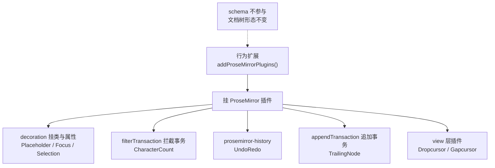

import { Canvas, Controls, Meta } from '@storybook/addon-docs/blocks';
import * as BehaviorStories from './behavior-extensions.stories';

<Meta of={BehaviorStories} name="Docs" />

# 行为扩展

行为扩展是一类不改变内容形态的扩展：装上它们，`getJSON()` 的文档树不会多出任何节点或标记，变的是编辑过程本身——空文档的提示文案、字数上限、撤销历史、焦点高亮、文档末尾的落点。实现上它们不碰 schema，而是往编辑器挂 ProseMirror 插件：用 decoration 往节点挂状态类与属性，用 filterTransaction 拦下不允许的事务，用 appendTransaction 追加事务，或直接接入历史与拖放等底层插件。本课覆盖 `@tiptap/extensions` 里的九个功能扩展；改变内容形态的文本样式与结构扩展见 [3.1](?path=/docs/text-style-extensions--docs)、[3.2](?path=/docs/content-extensions--docs)，菜单见 3.4。

看完开场图和参考表，你应该能预测：limit 设为 50 后第 51 个字打进去会怎样、连续插入三句按一次撤销会回退多少、光标移进列表后三种 Focus 模式各给几层节点挂类、以标题结尾的文档第一次点进去会发生什么。



| 扩展 | 作用 | StarterKit | 关键默认值 |
| --- | --- | --- | --- |
| Placeholder | 空文档 / 空节点显示提示 | 不含 | `placeholder: 'Write something …'`、`showOnlyCurrent: true` |
| CharacterCount | 字数与词数统计、上限拦截 | 不含 | `limit: null`、`mode: 'textSize'`、`autoTrim: true` |
| UndoRedo | 撤销与重做 | 含 | `depth: 100`、`newGroupDelay: 500` |
| Focus | 光标所在节点挂 `has-focus` 类 | 不含 | `className: 'has-focus'`、`mode: 'all'` |
| TrailingNode | 文档末尾补一个段落 | 含 | `notAfter: ['paragraph']` |
| Dropcursor | 拖放悬停时的指示线 | 含 | `color: 'currentColor'`、`width: 1` |
| Gapcursor | 块与块空隙的光标 | 含 | 无选项 |
| Selection | 失焦时保留选区样式 | 不含 | `className: 'selection'` |
| UniqueID | 给节点补稳定 id 属性 | 不含（独立包） | `types: []`、`attributeName: 'id'` |

单独引入都从聚合包取：`import { Placeholder } from '@tiptap/extensions'`（子路径如 `@tiptap/extensions/placeholder` 亦可）；UniqueID 用独立包 `@tiptap/extension-unique-id`。StarterKit 已含的四个（UndoRedo、Dropcursor、Gapcursor、TrailingNode）不要重复注册——同名扩展会冲突，要排除就写 `StarterKit.configure({ undoRedo: false })`。

## 占位提示：Placeholder

Placeholder 往空文本块挂 node decoration：`is-empty` 类加 `data-placeholder` 属性，整篇文档为空时再追加 `is-editor-empty`。它不注入任何显示样式——提示文案要靠自己的 `::before` 规则把属性读出来；完整的选择器写法、逐项选项表和可交互实例见[样式课的占位符小节](?path=/docs/style-editor--docs)，本课只补行为视角。

从行为看，三个开关决定「哪些空节点拿到装饰」：

| 选项 | 默认值 | 行为 |
| --- | --- | --- |
| `showOnlyWhenEditable` | `true` | 只读状态下不显示 |
| `showOnlyCurrent` | `true` | 只装饰光标所在的空节点 |
| `includeChildren` | `false` | 深入列表项等嵌套节点找空块 |

文案与类名都可以传函数，按节点动态返回（参数 `{ editor, node, pos, hasAnchor }`）：

```ts
import { Placeholder } from '@tiptap/extensions';

Placeholder.configure({
  // 标题行与正文给不同提示
  placeholder: ({ node }) =>
    node.type.name === 'heading' ? '无标题' : '写点什么吧…',
});
```

边界：装饰只落在文本块（paragraph、heading 这类）上——bulletList、listItem 这类容器节点不会挂占位符；`includeChildren` 是「深入容器找里面的文本块」，不是给容器挂类。

## 焦点高亮：Focus

Focus 在编辑器「聚焦且可编辑」时，往包含光标的节点挂 `has-focus` 类（node decoration）；失焦或只读时类整体消失。它只挂类，样式完全由你写——典型用途是当前块高亮、聚焦时才出现的块级操作入口。`mode` 决定「包含光标的节点」取到哪几层：

| mode | 挂到哪 |
| --- | --- |
| `'all'`（默认） | 光标所在路径上的所有节点 |
| `'deepest'` | 只有最内层文本块 |
| `'shallowest'` | 只有最外层节点 |

实例用两层列表（ul > li > p）对照三种模式：

<Canvas of={BehaviorStories.Focus} />
<Controls of={BehaviorStories.Focus} />

| 读者操作 | 可观察证据 |
| --- | --- |
| 点进列表项文字 | 默认 all 模式下读数为 `ul › li › p`，三层都出现虚线框 |
| 切 mode 为 deepest / shallowest，再点进文字 | 读数只剩 `p` / 只剩 `ul`，只有对应层有虚线框 |
| 点编辑区外 | 失焦后类整体消失，读数变「未聚焦」 |
| 打开 Show code | 看到该 Canvas 实际执行的 `focus.ts` |

```ts
import { Focus } from '@tiptap/extensions';

Focus.configure({ mode: 'deepest' });
```

```css
.tiptap .has-focus {
  outline: 2px dashed #4f7cff;
  outline-offset: 2px;
}
```

Placeholder 与 Focus 是同一套 decoration 机制的两个方向：Focus 挂「光标在哪」，Placeholder 挂「哪里为空」。

## 字数统计与限制：CharacterCount

CharacterCount 一手把读数挂到 `editor.storage.characterCount` 上，一手把 `limit` 变成事务层的一道闸。默认 `limit: null`（不限制）、`mode: 'textSize'`、`autoTrim: true`。

### 读数：characters 与 words

```ts
const { characters, words } = editor.storage.characterCount;

characters(); // 字符数，按配置的 mode 计算
words(); // 词数
characters({ node: editor.state.doc.firstChild }); // 只统计单个节点
characters({ mode: 'nodeSize' }); // 覆盖默认口径
```

两种口径：`textSize`（默认）按文档文本计，叶子节点之间补一个空格再数；`nodeSize` 按 ProseMirror 的节点大小计，包含结构开销——同一份文档，nodeSize 的读数更大。两个计数函数都可替换：`textCounter` / `wordCounter`，比如用 `Intl.Segmenter` 让 emoji 算一个字、按 `\s+` 分词。

读数不是响应式的：它只是函数，每次调用都从当前文档现算，放进 `update` 事件回调里读到的才是最新值。另外默认分词按空格切，连续中文整段算一个词——下面实例的 `words()` 读数可以直接验证。

### limit：在事务层拦截

配置 `limit` 后，CharacterCount 用 `filterTransaction` 检查每个改变文档的事务（规则核对自源码）：

- 不超限的事务照常通过；
- 会超限的打字、程序化插入被整体拦下——没有任何报错，表现就是「打不进去了」；
- 粘贴例外：超限的粘贴被裁剪到上限以内塞入，而不是拒收；
- 已超限的文档只允许减少、不允许再增加。

`autoTrim` 只管初始内容：`true`（默认）时初始内容超限会被自动裁剪并在控制台警告；设为 `false` 保留原样，由使用者手动删减。

```ts
CharacterCount.configure({ limit: 240 });
```

<Canvas of={BehaviorStories.CharacterCount} />
<Controls of={BehaviorStories.CharacterCount} />

| 读者操作 | 可观察证据 |
| --- | --- |
| 连点「插入 10 字」到 50 字 | 第 6 次点击字数不再增加，读数标注「被拦截」 |
| 在 30 字时点「粘贴语义插入 40 字」 | 只进 20 字，字数停在 50，读数标注「已裁剪到上限」 |
| 切 mode 为 nodeSize（内容保留） | `characters()` 读数从 10 变 14——doc 与段落的结构开销也算进去 |
| 切 limit 为不限 | 同样的操作全部放行 |
| 打开 Show code | 看到该 Canvas 实际执行的 `character-count.ts` |

## 撤销与重做：UndoRedo

UndoRedo 包装 prosemirror-history，注册 `undo()` / `redo()` 两条命令和快捷键 Mod-z、Shift-Mod-z、Mod-y。两个选项：`depth: 100`（最多保留多少组历史）、`newGroupDelay: 500`（间隔多少毫秒后开启新组）。

一次 undo 回退多少由分组规则决定：**位置相邻且间隔小于 newGroupDelay 的变更合成一组**，一次撤销回退一组。同一事务必然同组；同拍连续提交、位置相邻的程序化命令间隔趋近 0，也合为一组。实例用两种节奏插入同样的三句，对照一次撤销的结果：

<Canvas of={BehaviorStories.UndoRedo} />

| 读者操作 | 可观察证据 |
| --- | --- |
| 点「连续插入三句」再点「撤销」 | 三句一起消失——同拍插入合为一组 |
| 点「逐句插入（间隔 700ms）」再点「撤销」 | 只少最后一句——间隔超过 newGroupDelay 各自成组 |
| 连点「撤销」再点「重做」 | 按原分组逐组恢复，canUndo / canRedo 读数随之变化 |
| 打开 Show code | 看到该 Canvas 实际执行的 `undo-redo.ts` |

```ts
UndoRedo.configure({ depth: 500, newGroupDelay: 1000 });
```

边界：**UndoRedo 与 Collaboration 扩展互斥**——协作历史由 Yjs 自己管理（「撤销别人的修改」通常不是想要的语义），装了 `@tiptap/extension-collaboration` 就要移除 UndoRedo，见[协作入门课](?path=/docs/collaboration--docs)。

## 末尾补段：TrailingNode

TrailingNode 用 `appendTransaction` 保证文档末尾始终有一个可落光标的块：最后一个节点不在 `notAfter` 名单里时，就追加一个段落。默认补的节点取 schema 顶层内容的默认类型（通常是 paragraph），`notAfter` 默认为 `['paragraph']`——所以「以段落结尾」不补，「以标题、表格结尾」会补。

关键细节：检查挂在**每一次事务**上——哪怕只是移动光标的选区事务，也会触发补段。所以初始内容以标题结尾的文档，第一次点进去（或按方向键）末尾就会多出段落。StarterKit 已默认启用，这就是「文档末尾总是多出一个空段落」的常见来源。

<Canvas of={BehaviorStories.TrailingNode} />
<Controls of={BehaviorStories.TrailingNode} />

| 读者操作 | 可观察证据 |
| --- | --- |
| 保持「标题结尾」，点进编辑区或点「光标移到文末」 | 「最后一个节点」从 heading 变为 paragraph，子节点数 +1 |
| 关闭 TrailingNode 重复上述操作 | 文档保持 heading 结尾，不再补段 |
| 切「结尾预设」为段落结尾 | 不补——paragraph 在 notAfter 名单里 |
| 切为表格结尾 | 表格之后补出段落，光标有了落点 |
| 打开 Show code | 看到该 Canvas 实际执行的 `trailing-node.ts` |

关闭与按次跳过：

```ts
// 整体关闭：从 StarterKit 排除
const editor = new Editor({
  extensions: [StarterKit.configure({ trailingNode: false })],
});

// 只让当前这个事务跳过补段
editor.chain().command(({ tr }) => {
  tr.setMeta('skipTrailingNode', true);
  return true;
}).run();
```

## 光标指示：Dropcursor 与 Gapcursor

两个光标指示扩展都来自 StarterKit，都只在特殊时刻出现，通常注册即用，最多调样式。

### 拖放指示线：Dropcursor

把内容拖进编辑器时，落点处出现一条指示线（封装 prosemirror-dropcursor）。三个选项：`color`（默认 `'currentColor'`，跟随文字颜色）、`width`（默认 1）、`class`。想统一改观感也可以直接写 CSS：线元素挂 `.prosemirror-dropcursor-block` / `.prosemirror-dropcursor-inline`。

```ts
Dropcursor.configure({ color: '#4f7cff', width: 2 });
```

### 空隙光标：Gapcursor

普通文本选区无法落点的位置——典型是文档末尾的表格之后、两个表格之间——Gapcursor 显示一个可用方向键移动的光标，避免光标「卡住」。它没有选项；视觉基线由 core 注入的样式（`.ProseMirror-gapcursor`）提供，`injectCSS: false` 时要自带，见[样式课](?path=/docs/style-editor--docs)。

与 TrailingNode 的分工：TrailingNode 让文档末尾总有段落可落，消灭了最常见的 gapcursor 场景；补不了的位置（表格之间的空隙）由 Gapcursor 兜底。

## 节点身份：UniqueID

UniqueID 在文档变更时给指定类型的节点补上稳定 `id` 属性：节点拆分、合并、撤销、粘贴后，id 跟随内容而不是位置，适合锚点跳转、评论定位、协作重连后的节点识别。它是行为扩展里的特例——不新增节点与标记，但会往节点 `attrs` 写数据。

v3.31.4 的 `@tiptap/extensions` 尚未包含它（本工作区已核对），需单独安装 `@tiptap/extension-unique-id`：

```ts
import { UniqueID } from '@tiptap/extension-unique-id';

UniqueID.configure({
  types: ['heading', 'paragraph'], // 默认 []——什么都不加；传 'all' 表示除 doc、text 外全部
  attributeName: 'id', // 渲染到 HTML 标签时加 data- 前缀
});
```

`generateID` 可换生成算法（默认 uuidv4）；服务端给 JSON 文档补 id 用同包的 `generateUniqueIds(doc, extensions)`，无需创建编辑器实例。协作场景两条注意：`filterTransaction` 里忽略远端变更（如 `!isChangeOrigin(transaction)`），等 provider `synced` 之后再挂载编辑器，见[协作入门课](?path=/docs/collaboration--docs)。

## 最佳实践

- **注册前先对照 StarterKit 清单。** undoRedo、dropcursor、gapcursor、trailingNode 已默认启用：改配置用 `StarterKit.configure({ undoRedo: { depth: 500 } })`，排除传 `false`；再手动 import 同名扩展会因重名冲突报错。
- **字数上限分「硬拦截」与「软提示」。** `limit` 在事务层硬拦（打字停住、粘贴裁剪），适合发布字数红线；不配 `limit`、只在 `update` 回调里读 storage 做进度提示，体验更柔和。两者可以同时上——读数给用户看，limit 兜底。
- **协作场景做替换，不做叠加。** 装了 `collaboration` 就移除 UndoRedo；UniqueID 配 `filterTransaction` 忽略远端事务，并在 `synced` 后挂载编辑器。
- **空编辑器引导用组合。** TrailingNode 保证光标有落点，Placeholder 负责提示文案——两者配合才是完整的空文档体验。

## 常见问题

- 打字突然打不进、粘贴的内容被截掉一截
  CharacterCount 的 `limit` 在事务层拦截（filterTransaction），全程无报错——先查 `editor.storage.characterCount.characters()` 读数与 limit 配置。这是有意设计；需要柔性提示就移除 limit，只留读数。
- 撤销一次回退了一大段
  分组所致：相邻且间隔小于 `newGroupDelay`（默认 500ms）的变更合成一组，一次 undo 回退一组——连续的程序化命令同一拍提交也会合组。想细分就调小 newGroupDelay，或让程序化插入之间留出间隔。
- 文档末尾总是多出一个空段落
  StarterKit 默认启用了 TrailingNode：末尾不是段落时，任何事务（包括移动光标）都会补一个。确定不要就 `StarterKit.configure({ trailingNode: false })`；个别事务不想触发，用 `tr.setMeta('skipTrailingNode', true)`。
- 协作编辑器里撤销行为混乱
  UndoRedo 与 Collaboration 互斥，协作历史由 Yjs 管理。移除 UndoRedo（StarterKit 记得 `undoRedo: false`）。
- has-focus 类不出现
  Focus 只在「聚焦且可编辑」时挂类：先点进编辑器，只读状态下整个机制停用；另外它只挂类——CSS 里没有 `.has-focus` 规则就看不到任何变化。
- gapcursor 或拖放指示线看不到
  Gapcursor 只出现在普通选区落不进的位置（文末表格之后、表格之间），有 TrailingNode 时文末总有段落、场景变少；关闭 `injectCSS` 后要自带 `.ProseMirror-gapcursor` 基线。拖放指示线默认 `currentColor`，文字颜色太浅时换个 color 或调 width。

## 总结回顾

摘要：

行为扩展不往 schema 里加节点或标记——装上它们 `getJSON()` 的树不变，变的是编辑过程：各自往编辑器挂 ProseMirror 插件，实现提示、计数、历史、高亮、补段与光标指示。九个成员里 dropcursor、gapcursor、undoRedo、trailingNode 已随 StarterKit 启用，Placeholder、CharacterCount、Focus、Selection 从 `@tiptap/extensions` 单独引入，UniqueID 用独立包。焦点高亮实例演示了 Focus 按 mode 把 `has-focus` 挂到不同层级、失焦即消失；字数实例演示了 CharacterCount 的 storage 读数与 limit 在事务层的拦截规则——超限输入被拒、粘贴被裁剪、autoTrim 只管初始内容；撤销实例演示了「相邻 + 间隔小于 newGroupDelay 合为一组」的分组规则；末尾补段实例演示了 TrailingNode 在任何事务上检查并补出落点段落。Placeholder 的选项与显示 CSS 已在样式课讲过，Dropcursor 与 Gapcursor 是注册即用的光标指示，UniqueID 以独立包给节点补稳定 id。

一句话：

> 行为扩展不动 schema、只挂 ProseMirror 插件——文档树形态不变，编辑体验由 decoration、filterTransaction、appendTransaction 和 history 这些插件机制完成。

知识要点：

- 判断一个扩展是不是行为扩展的标准是什么？
- 九个成员哪些已在 StarterKit 里？单独引入从哪个包 import？重复注册会怎样？
- CharacterCount 的读数从哪取？textSize 与 nodeSize 差在哪？limit 的拦截规则有哪几条？autoTrim 管什么？
- 一次 undo 回退多少由什么决定？newGroupDelay 与 depth 各控制什么？为什么与 Collaboration 互斥？
- Focus 的三种 mode 各把 has-focus 挂到哪？什么条件下类整体消失？
- TrailingNode 何时补段？怎么关闭、怎么跳过一次？「文末多出空段落」的常见来源是什么？
- UniqueID 与其他行为扩展的差异是什么？服务端补 id 用什么 API？

## 参考资料

- [Placeholder extension | Tiptap Editor Docs](https://tiptap.dev/docs/editor/extensions/functionality/placeholder)
- [Focus extension | Tiptap Editor Docs](https://tiptap.dev/docs/editor/extensions/functionality/focus)
- [CharacterCount extension | Tiptap Editor Docs](https://tiptap.dev/docs/editor/extensions/functionality/character-count)
- [UndoRedo extension | Tiptap Editor Docs](https://tiptap.dev/docs/editor/extensions/functionality/undo-redo)
- [TrailingNode extension | Tiptap Editor Docs](https://tiptap.dev/docs/editor/extensions/functionality/trailing-node)
- [Dropcursor extension | Tiptap Editor Docs](https://tiptap.dev/docs/editor/extensions/functionality/dropcursor)
- [Gapcursor extension | Tiptap Editor Docs](https://tiptap.dev/docs/editor/extensions/functionality/gapcursor)
- [UniqueID extension | Tiptap Editor Docs](https://tiptap.dev/docs/editor/extensions/functionality/uniqueid)
- [CharacterCount 的默认值与 limit 拦截规则 | @tiptap/extensions 源码](https://github.com/ueberdosis/tiptap/blob/main/packages/extensions/src/character-count/character-count.ts)
- [prosemirror-history（分组与 depth 规则）| ProseMirror GitHub](https://github.com/ProseMirror/prosemirror-history)
