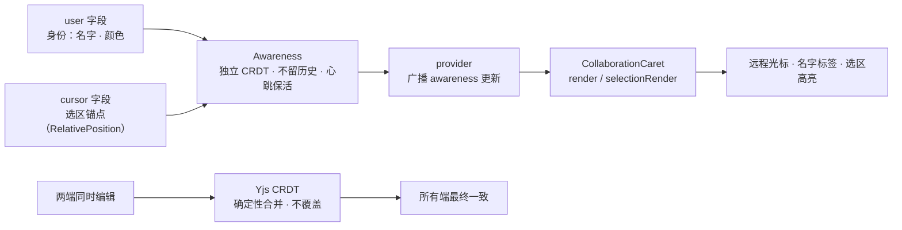

import { Canvas, Meta } from '@storybook/addon-docs/blocks';
import * as CollaborationUxStories from './collaboration-ux.stories';

<Meta of={CollaborationUxStories} name="Docs" />

# 协作光标与在线状态

多人编辑时，用户看得见的是三样东西：别人的光标和选区、谁在线、内容撞车后的结果。它们分属两条通道：身份与光标走 **awareness**——Yjs 在文档数据之外附带的一条"现场状态"通道，由 CollaborationCaret 画成编辑器里的 decorations；内容撞车走 **CRDT 合并**——并发修改自动归一，不需要人工调和。本课覆盖 CollaborationCaret 的配置与样式、awareness 状态的读写与监听，以及并发场景下的体验设计。

看完开场图和参考表，你应该能预测：对方点了一下页面别处，他的光标会怎样；两端同时在同一位置插词，文本会变成什么样。



| 成员 | 默认值 / 取值 | 回查要点 |
| --- | --- | --- |
| `provider` | `null`（必填） | 须暴露 `.awareness`；缺失时创建编辑器即抛错 |
| `user` | `{ name: null, color: null }` | `color` 须为 `#RRGGBB`，非法按透明处理 |
| `render(user)` | 内置竖线光标 + 名字标签 | 返回光标 DOM；默认类名 `collaboration-carets__caret` / `__label` |
| `selectionRender(user)` | 内置选区背景 `color` + `70` | 返回 DecorationAttrs；默认类名 `ProseMirror-yjs-selection` |
| `editor.storage.collaborationCaret.users` | `[]` | 全员（含自己）的 awareness 快照数组 `{ clientId, ...user }` |
| `updateUser(attributes)` | — | 即时更新本人身份并广播；旧命令 `user` 已弃用 |
| awareness 心跳 | 每 15s 自动重播 | 30s 无更新即被当作离线清理（`outdatedTimeout = 30000`） |

## 远程光标：从 awareness 到屏幕

awareness 是每份 Y.Doc 可以挂载的"现场状态"：每个成员维护一条只属于自己的状态（默认两个字段——`user` 身份、`cursor` 选区锚点），由 provider 广播给同房间的所有人。它是一个独立的小 CRDT：同步快、最终一致，但**不留历史**——状态只有"现在"，某成员 30 秒收不到心跳（自身每 15 秒自动重播一次）就会被当作离线清理。这决定了它适合放光标、正在编辑哪一段这类现场信号，不适合放业务数据。

CollaborationCaret 负责把这条通道画出来：监听 awareness 更新，把每个远程 `cursor`（用 RelativePosition 记录的内容锚点）映射回当前文档坐标，交给 `render` / `selectionRender` 生成 ProseMirror decorations——竖线光标、名字标签、选区高亮都是普通 DOM，样式完全由你控制。

一个容易忽略的前提：**光标发布以焦点为前提**。光标插件只在编辑器持有浏览器焦点时把选区写入 `cursor` 字段，失焦（focusout）立刻置空——对方点了一下页面别处，他的光标就从你的屏幕上消失。双人协作台可以完整走一遍这条链路：

<Canvas of={CollaborationUxStories.CollabStage} />

| 读者操作 | 可观察证据 |
| --- | --- |
| 点进阿绿编辑器输入或拖选 | 阿橙编辑器出现绿色竖线光标＋名字标签；拖选时出现同色选区高亮 |
| 点「阿绿在开头插入一句」 | 按钮不抢焦点，阿绿的光标持续发布；阿橙的光标在阿绿编辑器里随文字平移，而不是停在旧的字符位置 |
| 点「updateUser() 改名换色」 | 两列在线名单变成「绿绿」，阿橙侧的光标标签立即换名换色 |
| 点进阿橙编辑器 | 阿绿失焦，绿光标从阿橙视图消失；阿橙的光标开始出现在阿绿视图；两列聚焦读数互换 |
| 观察左下角读数 | 阿橙眼中的 awareness 名单与阿绿端 `storage.users` 一致——在线状态已收敛 |
| 打开 Show code | 看到该 Canvas 实际执行的 `collab-stage.ts` |

范例里的"provider"是 `local-relay.ts`：把两份 Y.Doc 的更新和 awareness 更新互相转发（带 30ms 模拟延迟），这正是所有 provider 的最小职责——接入真实 provider 后，本页所有行为不变，只是转发方从本地函数换成了网络。

## 配置 CollaborationCaret

四个配置围绕一个问题分工：身份与光标**从哪条通道来**（`provider`）、**我是谁**（`user`）、**画成什么样**（`render` / `selectionRender`）；另有一个 storage 出口供界面读在线名单。它必须与 Collaboration 扩展同时使用——光标 decorations 依赖 Collaboration 注册的同步绑定，只装 CollaborationCaret 画不出任何东西。

```ts
import { Collaboration } from '@tiptap/extension-collaboration';
import { CollaborationCaret } from '@tiptap/extension-collaboration-caret';

new Editor({
  extensions: [
    Document,
    Paragraph,
    Text,
    Collaboration.configure({ document: ydoc }),
    CollaborationCaret.configure({
      provider, // 必填：须暴露 .awareness
      user: { name: '阿绿', color: '#16a34a' },
    }),
  ],
});
```

### provider：awareness 从哪来

`provider` 是协作网络层，CollaborationCaret 只有一个要求：`provider.awareness` 是一个 y-protocols 的 Awareness 实例。HocuspocusProvider、y-websocket 的 WebsocketProvider、Tiptap 的 TiptapCollabProvider 都满足；漏传或传错，创建编辑器时直接抛 `The "provider" option is required for the CollaborationCaret extension`。托管 provider 把 awareness 操作封装得更直接：`setAwarenessField()` 写状态、`awarenessUpdate` / `awarenessChange` 事件收心跳与增删改——开源栈则直接读写 `provider.awareness`，本课两种视角通用。

想理解 provider 到底承担什么，可以看范例这个 30 行的空实现——双向转发两类二进制流，回程按 origin 跳过防死循环：

```ts
// 文档内容通道：本地变更 → 对方；origin 标记防止回程死循环
docA.on('update', (update, origin) => {
  if (origin === RELAY) return;
  Y.applyUpdate(docB, update, RELAY);
});

// 在线状态通道：awareness 更新按 client 编码后转发
awarenessA.on('update', ({ added, updated, removed }, origin) => {
  if (origin === RELAY) return;
  const clients = [...added, ...updated, ...removed];
  applyAwarenessUpdate(awarenessB, encodeAwarenessUpdate(awarenessA, clients), RELAY);
});
```

### user：身份与颜色约束

`user` 写进自己的 awareness 状态并广播，除 `name` / `color` 外可带任意附加属性（`avatar`、`role` 等）。颜色有硬校验：只接受 `#RRGGBB` 六位 hex，其他格式（`rgb()`、三位缩写）的光标按透明渲染、默认选区直接不画。

```ts
CollaborationCaret.configure({
  provider,
  user: { name: '阿绿', color: '#16a34a' }, // color 必须是 #RRGGBB
});

// 登录、切换账号时动态更新身份，全端即时生效，无需重建编辑器
editor.commands.updateUser({ name: '绿绿', color: '#0d9488', avatar: '/av/green.png' });
```

### render 与 selectionRender：自定义光标外观

`render` 返回的 DOM 就是对方看到的竖线与标签；`selectionRender` 返回 DecorationAttrs，决定选区怎么包。两个函数都接收**对方**的 user 对象——标签上除了名字，还能摆头像、角色。双人协作台用的正是自定义实现：

```ts
function renderCaret(user: Record<string, any>): HTMLElement {
  const caret = document.createElement('span');
  caret.className = 'collab-ux-caret';
  caret.style.borderColor = user.color;
  const label = document.createElement('div');
  label.className = 'collab-ux-label';
  label.style.backgroundColor = user.color;
  label.textContent = user.name;
  caret.append(label);
  return caret;
}

function renderSelection(user: Record<string, any>): DecorationAttrs {
  return {
    nodeName: 'span',
    class: 'collab-ux-selection',
    style: `background-color: ${user.color}33`,
    'data-user': user.name,
  };
}
```

不配置时使用内置实现：光标是 `collaboration-carets__caret` 竖线加 `collaboration-carets__label` 名字标签，选区是背景色 `color` + 70 透明度的 `ProseMirror-yjs-selection`。**扩展不内置任何 CSS**——不给样式就是无样式的行内元素。官方文档提供了默认类名的完整样式块，关键是这几条：

```css
.tiptap .collaboration-carets__caret {
  border-left: 1px solid;
  border-right: 1px solid;
  margin-left: -1px;
  margin-right: -1px;
  position: relative;
  pointer-events: none;
}

.tiptap .collaboration-carets__label {
  position: absolute;
  top: -1.4em;
  font-size: 12px;
  font-weight: 600;
  border-radius: 3px 3px 3px 0;
  user-select: none;
  white-space: nowrap;
}
```

### storage.users：在线名单

扩展把 awareness 的全员状态（含自己）整理成数组缓存在 storage 里，在线头像栏、协作者列表直接读它。`onUpdate` 选项已弃用，监听变化改用 awareness 的 update 事件：

```ts
const users = editor.storage.collaborationCaret.users;
// [{ clientId: 1204, name: '阿绿', color: '#16a34a' }, ...]

provider.awareness.on('update', () => {
  renderOnlineBar(editor.storage.collaborationCaret.users); // 扩展在 awareness 更新时维护这份缓存
});
```

成员消失只有两种途径：30 秒心跳超时被清理，或对方显式断开（awareness 状态置 `null` 并广播）——双人协作台的读数把 awareness 名单与 `storage.users` 并排摆着，两者一致说明在线状态已收敛。

## 同时编辑：并发与冲突体验

内容层不需要 UX 兜底——Yjs 的 CRDT 保证并发修改自动合并：**无锁、不覆盖、所有端最终一致**。两个人同时在同一位置插入，两个词都会留下，先后顺序由确定性规则决定（同一次会话内固定，但未必符合"先点的排前面"的直觉）；两人同时改同一段文字，两边的改动都保留。需要人工调和的"冲突弹窗"在协作编辑里不存在。

体验层的真实课题是**位置与预期**。光标用 RelativePosition 锚定内容而不是字符偏移：有人在你的光标前插入文字，你的光标在对方屏幕上自动平移（双人协作台的「在开头插入一句」演示的正是这一点）；文字被删，光标落在最近的存活位置。UX 要管理的是预期：轻提示（"阿橙正在编辑本段"）好过拦截，模态合并框和段落硬锁都违背"无冲突"的心智。

<Canvas of={CollaborationUxStories.ConcurrentMerge} />

| 读者操作 | 可观察证据 |
| --- | --- |
| 点「两端同时在段首插入」 | 两条命令各自先落到本地（30ms 后才交换更新，构成真正的并发）：读数显示两端文本一致，绿橙两个词都保留、互不覆盖 |
| 多点几次「两端同时在段首插入」 | 文本持续增长，网络往返稳定后两端读数始终一致——并发次数越多越能确认这不是巧合 |
| 点「仅阿绿插入」 | 对照：单端插入没有并发，先后顺序就是操作顺序 |
| 打开 Show code | 看到该 Canvas 实际执行的 `concurrent-merge.ts` |

撤销同理由协作接管：Collaboration 扩展注册协作版的 `undo` / `redo`，只回滚自己的改动、不动他人内容；使用 StarterKit 时要关闭其内置的 UndoRedo，接入方式见[协作入门课](?path=/docs/collaboration--docs)。

## 最佳实践

- **身份在连接入口统一分配。** `user` 随登录态生成：名字取账号昵称，颜色从服务端调色板轮转分配，避免两人撞色；登录切换、改名走 `updateUser` 即时广播，不要销毁重建编辑器。
- **工具栏按钮一律拦截 mousedown 或链尾补 focus()。** 协作下这不只是焦点问题：按钮抢走焦点会把你自己正在发布的光标从所有人的屏幕上撤掉。双人协作台的插入按钮就是 `mousedown` + `preventDefault` 的写法。
- **awareness 只放现场数据。** 光标、正在编辑的段落、鼠标位置都合适；它不留历史、30 秒无心跳即被清理，不能当业务存储。持久数据走 Y.Doc 内容或服务端。
- **冲突体验做提示、不做拦截。** 内容正确性已由 CRDT 保证，UX 的增量价值是预期管理：提示谁在编辑哪一段、避免整篇 HTML 覆盖保存（绕过增量同步，会把小冲突放大成整篇替换）。

## 常见问题

- 看不到对方光标
  按四个前提逐一排查：对方编辑器是否持有焦点（失焦即清空 `cursor` 字段）；`provider.awareness` 是否存在且双方连到同一房间；编辑器是否同时装了 Collaboration 扩展（光标 decorations 依赖它的同步绑定）；对方 `user.color` 是否为 `#RRGGBB`（非法颜色按透明渲染）。最后确认引入了光标样式——扩展不内置 CSS。
- 自己的光标在对方屏幕上时有时无
  设计行为：光标只在编辑器持有浏览器焦点时发布，失焦（包括点到页面上的按钮）立刻清空 `cursor` 字段。工具栏按钮用 `mousedown` + `preventDefault`，或在命令链末尾补 `focus()`，光标就不会闪断。
- 光标变成透明、选区没有高亮
  颜色格式不满足校验（`#RRGGBB` 六位 hex）。非法颜色会被规范成 `transparent`：光标边框和标签底色消失，默认选区渲染函数直接返回空、高亮不画。把颜色统一收敛成六位 hex 再下发。
- 创建编辑器时抛 `"The provider option is required"`
  `CollaborationCaret.configure({ provider })` 漏传，或传入的对象没有 `.awareness` 属性。自建 provider 时至少挂一个 y-protocols 的 Awareness 实例（见 `local-relay.ts`）。
- 两人同时编辑同一段，合并结果的顺序"不对"
  CRDT 的正常行为：并发插入保证不丢失、两端最终一致，但顺序由确定性规则决定，不承诺符合"谁先操作谁在前"的直觉。不要为顺序做拦截或加锁，用轻提示（"阿橙正在编辑本段"）管理预期即可。

## 总结回顾

摘要：

协作的"看得见"层由两条通道支撑：awareness 承载现场状态——`user` 身份与 `cursor` 选区锚点，独立成小 CRDT、不留历史、靠 15 秒心跳对抗 30 秒离线清理；CollaborationCaret 监听这条通道，把远程光标映射回当前文档坐标，经 `render` / `selectionRender` 画成 decorations，光标发布以编辑器持有焦点为前提，失焦即从对方视野消失。配置层面：`provider` 必填且须暴露 `.awareness`，`user` 的颜色只认 `#RRGGBB`，扩展不带样式需要自己补 CSS，在线名单读 `storage.users` 并监听 awareness 的 update 事件。内容层面：并发修改由 Yjs CRDT 确定性合并，两端永远一致、互不覆盖，只是同位置并发插入的顺序可能反直觉；并发合并范例用 30ms 延迟的 relay 让两端的插入真正并发，读数持续证明一致性。

一句话：

> 协作体验层的分工很清楚：身份与光标走 awareness 通道、由 CollaborationCaret 画成 decorations，内容冲突交给 CRDT 自动合并——UX 的职责是提示与预期管理，不是调和与拦截。

知识要点：

- awareness 是什么？它与 Y.Doc 的内容同步有何区别？心跳与 30 秒超时意味着什么？
- CollaborationCaret 画出远程光标需要哪几个前提同时成立？
- `user.color` 有什么格式约束？不满足时光标和选区各会怎样？
- `render` 与 `selectionRender` 各自决定什么？扩展内置样式吗？
- 在线名单从哪里读？变化时监听什么事件？`onUpdate` 选项还能用吗？
- 自己的光标什么时候会从对方屏幕上消失？工具栏按钮该怎么写？
- 两人同时在同一位置插入，结果由什么保证？顺序为什么可能"不对"？UX 应该提示什么、避免什么？

## 参考资料

- [CollaborationCaret | Tiptap Editor Docs](https://tiptap.dev/docs/editor/extensions/functionality/collaboration-caret)
- [Collaboration | Tiptap Editor Docs](https://tiptap.dev/docs/editor/extensions/functionality/collaboration)
- [Awareness | Tiptap Collaboration Docs](https://tiptap.dev/docs/collaboration/core-concepts/awareness)
- [Awareness | Hocuspocus Docs](https://tiptap.dev/docs/hocuspocus/guides/awareness)
- [Hocuspocus Overview | Tiptap Docs](https://tiptap.dev/docs/hocuspocus/getting-started/overview)
