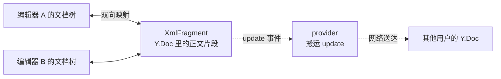

import { Canvas, Controls, Meta } from '@storybook/addon-docs/blocks';
import * as CollaborationStories from './collaboration.stories';

<Meta of={CollaborationStories} name="Docs" />

# 协作入门

非协作编辑器里，`editor.state.doc` 就是内容的唯一真源（见[内容与文档模型课](?path=/docs/content-model--docs)）；接入协作后，真源换成了 Yjs 的 `Y.Doc`——一份独立于任何编辑器的共享文档，编辑器的文档树只是它里面正文片段的投影。分工由此确定：`Collaboration` 扩展负责「编辑器文档树 ↔ 片段」的双向映射，provider 负责「把变更搬到其他用户」。这层分工可以直接验证：同步的前提是**共享同一个 Y.Doc**，不是「有网络」——同一页面里两个编辑器接上同一个 `Y.Doc`，不需要任何 provider 就能看到实时同步。



| 对象 | 职责 | 回查要点 |
| --- | --- | --- |
| `Y.Doc` | 协作文档的真源，装载正文片段与其他共享状态 | `new Y.Doc()`；变更经 `update` 事件流出；`clientId` 属于它 |
| XmlFragment / `field` | 正文在 Y.Doc 里的存放片段 | `field` 默认 `'default'`，换名即分出独立片段 |
| `Collaboration` 扩展 | 编辑器文档树 ↔ 片段的双向映射 | `document` + `field`，或直接给 `fragment` |
| `undo` / `redo` 命令 | 协作版撤销，来自 Yjs UndoManager | 用它必须关掉 StarterKit 的 `undoRedo` |
| provider | 把 update 搬到其他用户，顺带携带在线状态 | 本地共享 Y.Doc 时可以没有 |

## 快速上手

依赖两个包：协作扩展与 `yjs` 本体（本工作区的 `yjs` 由扩展的 peer dependency 带入，新项目按官方命令显式安装）。接线三步：建 `Y.Doc` → 关掉 StarterKit 自带的撤销 → 挂 `Collaboration`。

```bash
npm install @tiptap/extension-collaboration @tiptap/y-tiptap yjs
```

```ts
import { Editor } from '@tiptap/core';
import { StarterKit } from '@tiptap/starter-kit';
import { Collaboration } from '@tiptap/extension-collaboration';
import * as Y from 'yjs';

// 一份协作文档：多个用户、多个编辑器共享的就是同一个实例
const ydoc = new Y.Doc();

const editor = new Editor({
  element: document.querySelector('#editor')!,
  extensions: [
    // 协作自带历史支持：不关掉 undoRedo 会告警，且两套撤销历史互相干扰
    StarterKit.configure({ undoRedo: false }),
    Collaboration.configure({ document: ydoc }),
  ],
});
```

验证思路：把页面开两个浏览器窗口、接上 provider，两边实时同步；没有 provider 时编辑照常进入本地 `Y.Doc`，只是不出本机——本页第一个实例就是这种最小形态，两个编辑器共享一个 `Y.Doc`，同步立即可见。

## Yjs 文档模型

协作场景的模型一句话：**内容只有一份，住在 `Y.Doc` 里；每个编辑器都是它的一个视图。** 本地输入经扩展写进 `Y.Doc`，`Y.Doc` 的变化再映射回每个视图——同一页面里的两个编辑器与跨网络的两个浏览器在这条链路上没有区别。下面的实例是本课主线证据：两个编辑器给了两份不同的初始 content，共享同一个 `Y.Doc` 时立刻一致，切到独立文档后立即分道扬镳。

<Canvas of={CollaborationStories.SharedDoc} />
<Controls of={CollaborationStories.SharedDoc} />

| 读者操作 | 可观察证据 |
| --- | --- |
| 先看初始状态 | 共享模式下 A、B 一致——尽管两份初始 content 不同，双方都以先写入 Y.Doc 的那份为准 |
| 在 A 里打字 | B 逐字出现同样内容，「A 与 B 内容一致」保持「是」 |
| 看「Y.Doc update 次数」 | 初始 content 写入时已非 0，此后每次编辑递增——变更确实进了 Y.Doc |
| 切换「连接方式」为各自独立 Y.Doc | 重建后两边各显示自己的初始 content，此后互不影响；clientId 一分为二 |
| 打开 Show code | 看到该 Canvas 实际执行的 `shared-doc.ts` |

### Y.Doc：共享文档的容器

`Y.Doc` 是 Yjs 的文档对象，一份协作文档对应一个实例。它不关心内容形态，内部按「共享类型」组织数据：正文是一个 XmlFragment，此外还能挂 `Y.Map`、`Y.Array` 等其他共享状态（比如「初始内容是否已写入」的标记）。最常用的成员只有三个：

```ts
import * as Y from 'yjs';

const ydoc = new Y.Doc();

ydoc.clientID; // 本机在这个文档里的身份（数字），创建时生成
ydoc.on('update', (update) => {
  // 每次变更的增量编码（Uint8Array），交给 provider 或本地缓存
});
ydoc.destroy(); // 编辑器销毁时一并销毁，释放监听
```

注意 `clientId` 标识的是 Y.Doc 实例而不是编辑器：实例里共享模式的两个编辑器共用一个文档，clientId 相同；切到独立模式才一分为二。

### update 与合并

协作不传整篇文档，传增量：每次变更加上一段 update 编码。Yjs 是 CRDT（无冲突复制数据类型），update 的合并不依赖顺序——乱序到达、重复接收、离线补发，各方最终状态都一致。这个性质决定了分工：编辑器只管往 `Y.Doc` 写，provider 只管把 update 搬到别处，互相不需要知道对方存在。实例读数「Y.Doc update 次数」就是 `doc.on('update', …)` 的触发次数；独立模式下两个文档各数各的，编辑 A 不会让 B 的计数动。

### 片段：正文的存放处

正文存放在 `Y.XmlFragment` 里——一个与 ProseMirror 文档树同构的树形结构，`Collaboration` 的全部工作就是维持片段树与编辑器文档树的双向映射。默认片段名是 `'default'`；`field` 换名即分出独立片段。初始 `content` 选项的生效条件也由片段决定：

- 片段为空：编辑器的初始 content 被写入 Y.Doc，成为共享内容（实例里 update 计数初始非 0 就是它）；
- 片段非空：以 Y.Doc 为准，content 被忽略——这就是实例里「两份初始 content 只活下来一份」的原因。

## Collaboration 扩展

扩展名叫 `Collaboration`，职责两条：把编辑器绑定到指定片段（双向映射），以及接管撤销（注册协作版的 `undo` / `redo`）。它不做任何网络通信——多人同步完全交给 provider。即使没有任何 provider，编辑也照常进入 `Y.Doc`：内容已经在 CRDT 里，后续接上 provider 就能同步出去。

### document、field 与 fragment

| 选项 | 默认值 | 用途 |
| --- | --- | --- |
| `document` | `null` | 接入的 Y.Doc 实例，与 provider 共用同一个 |
| `field` | `'default'` | 正文片段名；同一 Y.Doc 承载多个字段时换名区分 |
| `fragment` | `null` | 直接传 XmlFragment，设置后优先于 `document` + `field` |
| `provider` | `null` | 同步不经过它；供 collaboration-caret 等感知能力读取 |
| `onFirstRender` | — | Yjs 内容首次渲染进编辑器后触发 |
| `ySyncOptions` / `yUndoOptions` | `{}` | 透传给底层同步 / 撤销插件的参数，一般不用动 |

多字段是 `field` 的典型场景：标题与正文存进同一个 `Y.Doc` 的两个片段，同步、持久化都按一份文档走。下面的实例演示这种隔离。

<Canvas of={CollaborationStories.CollabFields} />

| 读者操作 | 可观察证据 |
| --- | --- |
| 对照两个编辑器的标签 | 同一个 Y.Doc，字段分别是 `'title'` 与 `'body'` |
| 在任一侧打字 | 另一侧纹丝不动——字段之间互不相通 |
| 看读数「Y.Doc 上的片段」 | 恰好列出 body、title 两个名字 |
| 打开 Show code | 看到该 Canvas 实际执行的 `collab-fields.ts` |

除了正文片段，同一个 `Y.Doc` 还能挂 `Y.Map` 放共享元数据，与字段互不干扰——「初始内容已写入」标记就是这么存的。

### 撤销与 undoRedo

协作改变了撤销的语义：不能把别人的修改也撤掉。扩展因此自带撤销——`undo` / `redo` 命令和 Mod-z、Mod-y、Shift-Mod-z 快捷键都由它注册，底层是 Yjs UndoManager，只跟踪本机输入的变更，远程修改不进撤销栈。前提是把编辑器默认的本地撤销关掉，否则两套历史互相干扰：

```ts
StarterKit.configure({ undoRedo: false }); // 唯一要求的配合项
```

忘了关时扩展会在创建阶段控制台警告：`"@tiptap/extension-collaboration" comes with its own history support and is not compatible with "@tiptap/extension-undo-redo".`

边界：自定义插件里需要区分「这次变更是本地输入还是 Yjs 同步进来」时，用扩展导出的 `isChangeOrigin(transaction)` 判断；插件用法见[Decorations 与插件课](?path=/docs/decorations-plugins--docs)。

## provider

provider 是 Yjs 生态对「搬运 update 的组件」的统称，一般同时承担两件事：把本机 `Y.Doc` 的 update 发出去、把收到的 update 应用进来；在此之上通过 awareness 协议携带光标位置与在线状态（体验层内容归[协作体验课](?path=/docs/collaboration-ux--docs)）。它对 `Collaboration` 是透明的：扩展只认 `Y.Doc`，provider 接不接不影响编辑进入本地文档——所以本页实例可以完全没有 provider。

接线只有一个要点：provider 与扩展共用**同一个 `Y.Doc` 实例**，同步不经过扩展的 `provider` 选项：

```ts
import { HocuspocusProvider } from '@hocuspocus/provider';

const provider = new HocuspocusProvider({
  url: 'wss://collab.example.com', // Hocuspocus 服务地址
  name: 'docs/42', // 文档标识：同一个 name 的所有客户端共享一份文档
  document: ydoc, // 与 Collaboration.configure 传同一个实例
});
```

| provider | 对接 | 适用 |
| --- | --- | --- |
| `TiptapCollabProvider`（`@tiptap-pro/provider`） | Tiptap Collaboration Cloud / 自托管企业版 | 用官方托管或企业部署 |
| `HocuspocusProvider`（`@hocuspocus/provider`） | 自托管 Hocuspocus 服务 | 自建后端；一条 WebSocket 可多路复用同步多份文档 |
| `y-websocket` | 社区通用 WebSocket 服务 | 已有简单同步服务 |
| `y-webrtc` | P2P 连接 | 无服务器的演示场景 |
| `y-indexeddb` | 浏览器本地存储 | 离线缓存，与任意传输型 provider 叠加 |

边界：Hocuspocus 服务器搭建、鉴权与持久化归[Hocuspocus 后端课](?path=/docs/hocuspocus--docs)；协作光标与在线状态的呈现归[协作体验课](?path=/docs/collaboration-ux--docs)。

## 最佳实践

- **初始内容在同步完成后判空写入，不要依赖静态 content。** `content` 只在片段为空时写入一次，多端同时首连一份空文档会互相竞争。推荐在 provider 的 `onSynced` 回调里用标记判断：

```ts
const provider = new HocuspocusProvider({
  url: 'wss://collab.example.com',
  name: 'docs/42',
  document: ydoc,
  onSynced() {
    // 首次同步完成后：只有空文档才写入初始内容，标记本身也存在 Y.Doc 里
    if (!ydoc.getMap('config').get('initialContentLoaded')) {
      ydoc.getMap('config').set('initialContentLoaded', true);
      editor.commands.setContent('<p>会议纪要</p>');
    }
  },
});
```

- **`undoRedo: false` 当作接入清单的第一项。** 它是协作接入唯一的强制配合项，遗漏不会报错、只有控制台警告，但撤销语义已经错了——评审时对着扩展清单过一遍。
- **一份文档的粒度按业务定，字段按 `field` 分。** 标题 + 正文这类「同一实体的多个区域」放进一个 `Y.Doc` 用 `field` 区分，同步与持久化都按一份文档走；完全独立的文档用不同的文档标识（provider 的 `name`），不要塞进同一个 Y.Doc。
- **离线与持久化分两层。** 传输型 provider 管在线同步，`y-indexeddb` 管浏览器本地缓存，两者可叠加出「离线可编辑、联网即同步」；服务端持久化（重启不丢文档）是后端职责，见 Hocuspocus 后端课。

## 常见问题

- 控制台出现 `"@tiptap/extension-collaboration" comes with its own history support` 警告
  扩展列表里还留着 undoRedo（StarterKit 默认启用）。改成 `StarterKit.configure({ undoRedo: false })`；不关的话两套撤销历史并存，一次撤销可能回滚包含他人修改的整段内容。
- 页面刷新后初始内容重复出现，或文档内容意外丢失
  初始内容依赖静态 `content`，而它只在片段为空时写入。改用「同步完成后判空再写入」的写法（见最佳实践第一条）；想测全新文档时换一个文档标识（如 provider 的 `name`），不要反复清空现有文档。
- 同一页面两个编辑器都加了 `Collaboration`，却完全不同步
  检查两者是否共享**同一个** `Y.Doc` 实例——写成两个 `new Y.Doc()` 就是两份独立文档（本页实例的「独立模式」）。另外确认打包结果里 `yjs` 只有一份：依赖被解析成两个副本时，两边的 `Y.Doc` 无法互通。
- 协作场景下部分内容悄悄消失，本地却无法复现
  各端扩展（即 schema）不一致：新客户端写入的类型，旧客户端的 schema 不认识，同步过来后被按非法内容过滤。保持各端扩展配置一致，灰度升级要考虑 schema 兼容；本地排查可开 `enableContentCheck` 观察 `contentError` 事件。

## 总结回顾

摘要：

协作把内容的真源从 `editor.state.doc` 换成 Yjs 的 `Y.Doc`：编辑器的文档树只是 `Y.Doc` 里正文片段（XmlFragment）的投影，`Collaboration` 扩展负责这层双向映射并接管撤销。共享文档实例证明同步的前提是共享同一个 `Y.Doc` 而不是有网络——两个编辑器接同一份文档时实时一致，且初始 `content` 只在片段为空时写入；多字段实例证明 `field` 能在一份文档里分出互不相通的片段。update 是变更的增量编码，合并与顺序无关，provider 只负责把它搬到其他用户——Hocuspocus、y-websocket、y-webrtc、y-indexeddb 各管一段，可按需叠加。接入的强制配合项只有一条：关掉 StarterKit 的 `undoRedo`，撤销由 Yjs UndoManager 接管，远程修改不进撤销栈。

一句话：

> 协作的真源是 Y.Doc，编辑器只是它的视图；Collaboration 负责映射，provider 只负责搬运——同步的前提是共享同一个 Y.Doc，不是有网络。

知识要点：

- 协作开启后谁是真源？编辑器文档树与 `Y.Doc` 是什么关系？
- `document`、`field`、`fragment` 各怎么用？默认片段名是什么？
- 为什么必须关闭 StarterKit 的 `undoRedo`？协作撤销由谁提供、能撤销谁的修改？
- update 是什么？为什么说 provider 只搬运、不参与合并？
- `content` 选项在协作下何时生效？多端初始内容的推荐写法是什么？
- provider 家族各成员分别对接什么？`y-indexeddb` 与传输型 provider 什么关系？

## 参考资料

- [Collaboration extension | Tiptap Editor Docs](https://tiptap.dev/docs/editor/extensions/functionality/collaboration)
- [Install Collaboration | Tiptap Docs](https://tiptap.dev/docs/collaboration/getting-started/install)
- [Tiptap Collaboration Overview | Tiptap Docs](https://tiptap.dev/docs/collaboration/getting-started/overview)
- [Hocuspocus Overview | Tiptap Docs](https://tiptap.dev/docs/hocuspocus/getting-started/overview)
- [Hocuspocus Provider Overview | Tiptap Docs](https://tiptap.dev/docs/hocuspocus/provider/overview)
