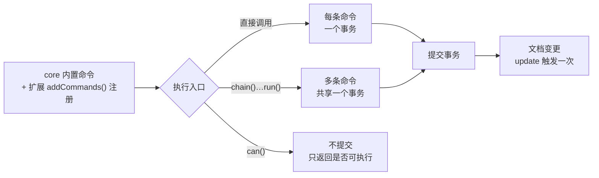

import { Canvas, Controls, Meta } from '@storybook/addon-docs/blocks';
import * as CommandsStories from './commands.stories';

<Meta of={CommandsStories} name="Docs" />

# 命令

命令是把修改提交给编辑器的标准入口：加粗、插入、清空、切换标题、移动光标，全部通过调用命令完成。命令挂在 `editor.commands` 上，来源有两处——`@tiptap/core` 内置一组通用命令，每个扩展再用 `addCommands()` 注册自己的命令，装上即出现。执行入口只有三个：直接调用（每条命令立即提交一个事务）、`chain()`（多条命令共享一个事务，`run()` 时一次提交）、`can()`（走同一条链路但不提交，只回答「能不能执行」）。程序化插入结构化内容用 `insertContent`，它内部委托给接受位置参数的 `insertContentAt`。

[内容与文档模型课](?path=/docs/content-model--docs)已经讲过 `setContent` 与 `clearContent` 这两个整体替换命令；本课覆盖其余的命令机制。看完开场图和参考表，你应该能预测：直接调用两条命令和链式执行两条命令，`update` 事件各触发几次、`can()` 为 false 的命令执行后文档会怎样、`insertContent` 插完光标停在哪。



| 入口 | 写法 | 回查要点 |
| --- | --- | --- |
| 直接调用 | `editor.commands.toggleBold()` | 每条命令立即提交一个事务 |
| 链式执行 | `editor.chain().focus().toggleBold().run()` | 共享一个事务；`run()` 前不生效，返回是否全部成功 |
| 内联命令 | `editor.chain().command(({ tr }) => { … })` | 链内直接操作事务 `tr` |
| 预检 | `editor.can().toggleBold()` | 不产生事务、不修改文档 |
| 依次尝试 | `editor.commands.first(…)` | 第一个返回 `true` 的命令生效后停止 |
| 选区插入 | `editor.commands.insertContent(value, options)` | `updateSelection` 默认 `true` |
| 定位插入 | `editor.commands.insertContentAt(position, value, options)` | `position` 为数字或 `{ from, to }` |
| 整体替换 / 清空 | `editor.commands.setContent(…)` | 属于内容输入输出，见[内容与文档模型课](?path=/docs/content-model--docs) |

## 命令的组装与执行

每条命令都是同一种形状的函数：接受参数，返回一个拿到执行上下文的回调，把修改写进事务 `tr`，返回 `true` / `false` 表示是否生效。这个约定是整条命令链的地基——`run()` 的返回值、`can()` 的判断都建立其上。回调拿到的上下文只有几个成员：

| props | 用途 |
| --- | --- |
| `tr` | 当前事务，所有修改都记进它 |
| `state` | 应用了事务之后的编辑器状态预览 |
| `dispatch` | 提交事务；预检（`can()`）时为 `undefined` |
| `commands` | 在命令内部调用其他命令 |
| `chain` / `can` | 在命令内部继续组链或预检 |
| `editor` / `view` | 实例与视图 |

core 内置 50 余条命令，其中 `insertContent`、`setTextSelection` 这类在日常代码里直接调用；`joinBackward`、`liftEmptyBlock` 等主要作为编辑器按键行为的组成步骤，由内部经 `first()` 组合调用，平时无需碰它们。扩展注册的命令（如 `toggleBold`）与 core 命令调用方式完全一致，见本课第三节；自己写命令见[自定义 Node 与 Mark 课](?path=/docs/custom-node-mark--docs)。

### 链式执行：chain 与 run

连续的直接调用会提交多个事务：两条格式命令各提交一次，`update` 事件也触发两次。`chain()` 把命令收集起来，到 `run()` 才一起提交——全部命令共享同一个事务，一次提交、一次 `update`；`run()` 返回链上每条命令是否都成功。点击按钮会夺走编辑器焦点，所以工具条里的链几乎都以 `.focus()` 开头——focus 也是一条命令，在链里只是其中一步，不会多出事务。

<Canvas of={CommandsStories.ChainTransaction} />

| 读者操作 | 可观察证据 |
| --- | --- |
| 点「直接调用两条命令」 | 「上次操作 update 事件」读数变为 2 次，加粗、高亮读数变「是」 |
| 点「链式执行两条命令」 | 同样的命令序列，读数只变为 1 次——两条命令合并进同一个事务 |
| 再点一次任一按钮 | toggle 语义：已有格式被撤销，读数翻回「否」 |
| 打开 Show code | 看到该 Canvas 实际执行的 `chain-transaction.ts` |

```ts
// 直接调用：每条命令立即提交一个事务，update 触发两次
editor.commands.toggleBold();
editor.commands.toggleHighlight();

// 链式执行：共享一个事务，run() 时一次提交，update 只触发一次
editor.chain().focus().toggleBold().toggleHighlight().run();
```

链内还可以用 `.command()` 内联一段事务操作，凡是能对 `tr` 做的修改都能塞进链里：

```ts
editor.chain().focus().command(({ tr }) => {
  tr.insertText('由命令直接操作事务');
  return true; // 内联命令同样必须返回 boolean
}).run();
```

### 预检与依次尝试：can 与 first

`can()` 用同一套命令做「干跑」：把 `dispatch` 置空，命令照常计算，但事务不会提交，只返回是否可以成功。菜单按钮的禁用态是它的典型用途——`can()` 为 false 的命令执行后文档不会有变化（本页第三个实例里，光标在代码块内时 `can().toggleBold()` 为 false，点「加粗」没有效果）。

```ts
editor.can().toggleBold(); // 是否可以切换加粗
editor.can().chain().toggleBold().toggleItalic().run(); // 整条链是否可行
```

`first()` 接受一组命令，依次尝试，遇到第一个返回 `true` 的停止——适合「优先做 A，不行就退而求 B」的回退逻辑。编辑器自身的删除、回车行为就是 core 用 `first()` 组合出来的：

```ts
editor.commands.first(({ commands }) => [
  () => commands.undoInputRule(),
  () => commands.deleteSelection(),
]);
```

## insertContent：插入内容

`insertContent(value, options)` 在当前选区处插入内容，内部委托给 `insertContentAt({ from, to }, value, options)`——后者多一个位置参数，可以定位插入。`value` 接受三种形态：纯文本、HTML 字符串、JSON 节点（单个对象或节点数组）。下面的实例把三种预设插到三个位置，从读数核对结果。

<Canvas of={CommandsStories.InsertContent} />
<Controls of={CommandsStories.InsertContent} />

| 读者操作 | 可观察证据 |
| --- | --- |
| 保持「插入位置」为空段落，预设为 JSON 节点数组 | 编辑器出现「插入的标题」与「插入的段落」，原空段被替换，没有残留空段 |
| 切换位置为当前选区（段中） | 第一段被切开，块级内容插进缝隙 |
| 切换位置为文档末尾 | 走 `insertContentAt` 定位插入，内容追加到文档末尾 |
| 关闭「updateSelection」 | 「光标 from–to」读数不再跳到插入内容末尾 |
| 打开 Show code | 看到该 Canvas 实际执行的 `insert-content.ts` |

### 三种内容形态

```ts
// 纯文本
editor.commands.insertContent('插入的文本');

// HTML 字符串
editor.commands.insertContent('<strong>加粗</strong>文字');

// JSON 节点：单个对象或节点数组，形状与 getJSON() 输出一致
editor.commands.insertContent([
  { type: 'heading', attrs: { level: 2 }, content: [{ type: 'text', text: '插入的标题' }] },
  { type: 'paragraph', content: [{ type: 'text', text: '插入的段落' }] },
]);
```

JSON 内容必须符合 schema：类型名未注册或结构装不下时，按[内容与文档模型课](?path=/docs/content-model--docs)的非法内容规则处理。插入位置还有两条边界值得记住：

- 块级内容插到空段落时，会替换掉这个空段落，而不是在旁边新增——所以实例里插入标题后没有残留空段；
- 块级内容插在段落中间时，原段落被切开、内容插进缝隙；想插到某段之前，用 `insertContentAt` 给出该段开头的位置。

### 选项与默认值

| 选项 | 默认值 | 作用 |
| --- | --- | --- |
| `updateSelection` | `true` | 插入后把光标移到插入内容末尾 |
| `applyInputRules` | `false` | 是否对插入的文本执行输入规则（如 `# ` 变标题） |
| `applyPasteRules` | `false` | 是否对插入的内容执行粘贴规则 |
| `parseOptions` | 继承编辑器配置 | 解析 HTML 的选项；未显式传入时按 `preserveWhitespace: 'full'` 解析 |

`applyInputRules` / `applyPasteRules` 默认关闭，因为程序化插入通常不需要再触发一次「用户输入」的规则链，需要时显式开启（见常见问题）。`parseOptions` 的默认值来自源码核对：`insertContentAt` 在 `editor.options.parseOptions` 之上叠加 `preserveWhitespace: 'full'`，与构造时的解析行为不同；要压缩空白就显式传 `preserveWhitespace: false`。

### 定位插入：insertContentAt

`insertContent` 只认当前选区；要插到别处，用 `insertContentAt`，`position` 接受数字（文档位置）或 `{ from, to }` 范围：

```ts
// 追加到文档末尾
editor.commands.insertContentAt(editor.state.doc.content.size, {
  type: 'paragraph',
  content: [{ type: 'text', text: '追加在末尾' }],
});

// 替换指定范围（第一个段落）
editor.commands.insertContentAt({ from: 1, to: 10 }, '新内容');
```

## 调用扩展注册的命令

扩展的职责不只是定义内容形态，还注册操作它的命令：Bold 注册 `toggleBold`，Heading 注册 `toggleHeading`，List 注册 `toggleBulletList`，Blockquote 注册 `toggleBlockquote`……注册后即出现在 `editor.commands`、`chain()`、`can()` 上，与 core 命令完全同构。反过来，没装的扩展命令也不存在——既不在 TypeScript 类型里，运行时调用也会报错，所以命令是否存在由已安装扩展决定。下面的实例装了一组结构扩展，工具条的每个按钮就是一条扩展命令。

<Canvas of={CommandsStories.ExtensionCommands} />
<Controls of={CommandsStories.ExtensionCommands} />

| 读者操作 | 可观察证据 |
| --- | --- |
| 切换「光标位置」到标题、引用块、列表项 | 对应激活读数（标题 / 引用 / 列表）变「是」——isActive 反映选区所在块 |
| 切换到代码块 | 「can().toggleBold()」读数变 false；点「加粗」无效果，run() 返回 false |
| 点「toggleHeading」「toggleBlockquote」等按钮 | 当前块与目标格式互切，激活读数随之翻转 |
| 把光标点进普通文字（不选中），点「toggleBold」后直接打字 | 新输入的文字带上加粗——空选区切换的是「下一次输入」的格式 |
| 打开 Show code | 看到该 Canvas 实际执行的 `extension-commands.ts` |

### 三件套：set、toggle 与 unset

扩展通常为同一能力注册三条命令：设置（set）、切换（toggle）、清除（unset）——Bold 就是 `setBold` / `toggleBold` / `unsetBold`。toggle 系列先判断目标是否已激活，激活则撤销、未激活则设置；不同成员作用在不同对象上：

| 命令 | 作用对象 | 语义 |
| --- | --- | --- |
| `toggleMark(typeOrName, attributes?, options?)` | 标记 | 空选区时切换的是「下一次输入」的格式；`options.extendEmptyMarkRange` 默认 `false`，开启后空选区撤销会扩展到整个标记范围 |
| `toggleNode(typeOrName, toggleTypeOrName, attributes?)` | 块级节点 | 当前块是前者就换成后者，否则换成前者；`toggleHeading` 等基于它 |
| `toggleWrap(typeOrName, attributes?)` | 包裹节点 | 已包裹则解除（lift），未包裹则包裹（wrapIn）；`toggleBlockquote` 基于它 |
| `toggleList(listTypeOrName, itemTypeOrName, keepMarks?, attributes?)` | 列表 | 在两种列表类型间互转；`toggleBulletList`、`toggleOrderedList` 基于它 |

```ts
editor.commands.toggleMark('bold');
editor.commands.toggleMark('bold', { color: 'red' });
editor.commands.toggleMark('bold', { color: 'red' }, { extendEmptyMarkRange: true });

editor.commands.toggleNode('paragraph', 'heading', { level: 1 });
editor.commands.toggleWrap('blockquote');
editor.commands.toggleList('bulletList', 'listItem');
```

需要「不做判断、直接设置或清除」时用 set / unset 变体，适合「强制开」「强制关」的菜单语义；core 还有一批维护性命令按名即懂：`updateAttributes` 更新当前节点或标记的属性，`resetAttributes` 重置为默认值，`unsetAllMarks` 清除选区内全部标记，`clearNodes` 把块级节点退回段落。选区类命令（`focus` 的定位参数、`setTextSelection`、`scrollIntoView`、`selectAll` 等）见[选区与焦点课](?path=/docs/selection--docs)；列表命令的细节见[结构扩展课](?path=/docs/content-extensions--docs)。

### 状态与能力：isActive 与 can

工具条的两个经典信号各有一条 API：`isActive` 读当前激活状态，`can()` 预检能否执行。

```ts
editor.isActive('bold'); // 光标选区是否处于加粗状态
editor.isActive('heading', { level: 2 }); // 带属性判断
editor.can().toggleBulletList(); // 当前位置能否切换列表
```

`isActive` 的空选区行为与 `toggleMark` 对称：光标落在加粗文字中间、什么都没选中时，它读取的是 stored marks，依然返回 true——这正是「输入时工具条持续高亮」的原理。

## 最佳实践

- **菜单按钮三件套：高亮用 isActive，禁用用 can()，执行用 `chain().focus()…run()`。** 三个信号都来自同一套命令机制，不要在菜单代码里自己另写判断逻辑。
- **多步修改一律用链。** 一次事务、一次提交、一次 `update` 事件；直接调用 N 条命令就提交 N 个事务，监听方（[事件课](?path=/docs/events--docs)的 `onUpdate`）和协作场景都会被放大。
- **插入局部内容用 insertContent / insertContentAt，整体替换才用 setContent。** 为插一段内容而重建整棵文档树，会丢掉不该动的状态，也让 update 语义变得模糊。
- **确需触发输入 / 粘贴规则时显式开启。** `insertContent(text, { applyInputRules: true })` 才会让 `# ` 之类的规则生效，粘贴规则同理。

## 常见问题

- 点了格式按钮没反应
  先给链首加 `.focus()`——按钮点击会夺走编辑器焦点；仍无效果时用 `editor.can().xxx()` 预检，false 说明当前位置不允许该命令（如代码块内加粗），此时执行不会生效也不会报错，应禁用按钮而不是调用命令。
- 空选区时 toggleMark 好像什么都没做
  正常行为：没有选中文字时，切换的是「下一次输入」的格式（stored marks），已有文档不变；要撤销整个标记范围，传 `{ extendEmptyMarkRange: true }`，或先用 `extendMarkRange` 把选区扩到整个标记范围。
- insertContent 插入 `# ` 没有变成标题
  `applyInputRules` 默认 `false`，程序化插入不触发输入规则；显式传 `{ applyInputRules: true }`，从外部「粘贴」语义进入的内容同理开 `applyPasteRules`。
- 链中一条命令失败，后面还执行吗？
  会：链上命令都按顺序执行，`run()` 的返回值是「是否每条命令都返回 `true`」，过程不抛异常。用它做失败提示；要在执行前拦截，用 `can().chain()…run()` 预检。

## 总结回顾

摘要：

命令是修改编辑器的标准入口，来自 core 内置与扩展的 `addCommands()` 注册，两者调用方式完全同构。每条命令把修改写进事务并返回 boolean；直接调用每条命令立即提交一个事务，`chain()` 把多条命令合并进同一个事务、`run()` 时一次提交并返回是否全部成功——命令链实例用 update 事件计数验证了「2 次 vs 1 次」的差异。`can()` 用同一套命令干跑预检、不产生事务，`first()` 依次尝试取第一个成功者，编辑器自身的按键回退行为正是它的组合。程序化插入用 `insertContent`（当前选区）与 `insertContentAt`（任意位置）：三种内容形态——纯文本、HTML、符合 schema 的 JSON；`updateSelection` 默认让光标移到插入内容末尾，`applyInputRules` / `applyPasteRules` 默认关闭，块级内容替换空段、段中插入切开段落——插入内容实例把这三组行为逐一摆进读数。扩展命令大多以 set / toggle / unset 三件套出现，toggle 家族各管标记、块级节点、包裹与列表；`isActive` 读激活状态（空选区时读 stored marks），`can()` 给出禁用信号——扩展命令实例用一段含代码块的文档演示了三者如何配合。

一句话：

> 命令把修改写进事务：直接调用一条一个事务，链式共享一个事务一次提交，can() 只预检不提交——插入结构化内容交给 insertContent / insertContentAt。

知识要点：

- 命令的执行入口有哪三个？各自的事务与 `update` 事件行为是什么？
- `run()` 的返回值是什么？链中一条命令失败会怎样？
- `can()` 与 `first()` 各解决什么问题？`.focus()` 为什么通常放在链首？
- `insertContent` 接受哪三种内容形态？块级内容插到空段落、段落中间各会发生什么？
- `insertContentAt` 与 `insertContent` 的差异是什么？`updateSelection`、`applyInputRules` 的默认值是什么？
- 扩展命令的三件套是什么？`toggleMark` 在空选区时切换的是什么？`extendEmptyMarkRange` 何时用？
- `isActive` 与 `can()` 分别对应工具条的哪个信号？空选区时 `isActive` 读什么？

## 参考资料

- [Commands | Tiptap Editor Docs](https://tiptap.dev/docs/editor/api/commands)
- [insertContent command | Tiptap Editor Docs](https://tiptap.dev/docs/editor/api/commands/content/insert-content)
- [toggleMark command | Tiptap Editor Docs](https://tiptap.dev/docs/editor/api/commands/nodes-and-marks/toggle-mark)
- [toggleNode command | Tiptap Editor Docs](https://tiptap.dev/docs/editor/api/commands/nodes-and-marks/toggle-node)
- [insertContentAt 默认值与插入行为 | @tiptap/core 源码](https://github.com/ueberdosis/tiptap/blob/main/packages/core/src/commands/insertContentAt.ts)
