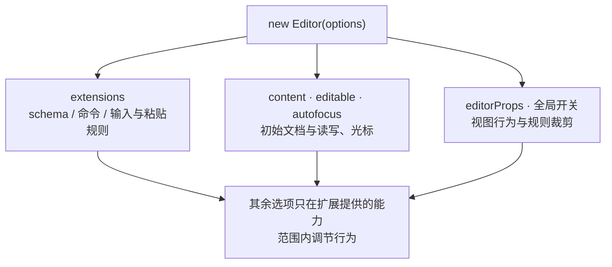

import { Canvas, Controls, Meta } from '@storybook/addon-docs/blocks';
import * as ConfigureStories from './configure.stories';

<Meta of={ConfigureStories} name="Docs" />

# 编辑器配置

创建编辑器的所有配置都集中在 `new Editor(options)` 的选项对象里：`extensions` 是主选项，schema、命令、输入规则全部由它派生，决定编辑器“能做什么”；`content`、`editable`、`autofocus` 定下初始文档与读写状态；`editorProps` 和各类开关把配置直通到底层 ProseMirror 视图，决定“怎么用”。看完开场参考表你应该能预测：只装 StarterKit 时行首输入 “## ” 会变成标题、禁用 undoRedo 后 Ctrl/Cmd+Z 失效、`autofocus: 'end'` 时光标停在文档末尾——这些结论都能在下方交互实例里核对。

选项对象在构造时一次性读取并复制进实例，事后修改传入的对象不会生效；运行期调整要走对应 API，见下文“运行期改配置”。



| 选项 | 默认值 | 回查要点 |
| --- | --- | --- |
| `extensions` | `[]` | 主选项：schema、命令、输入/粘贴规则全由它决定；空列表几乎没有可用功能 |
| `content` | `''` | HTML 字符串 / JSON 文档 / JSON 数组 / `null`；只在创建时解析（见 1.3 与 2.1） |
| `editable` | `true` | 只约束用户输入、不拦截命令；运行期用 `setEditable()` 切换（见 1.3） |
| `autofocus` | `false` | 初始光标位置：`'start'` / `'end'` / `'all'` / 位置数字 / `true`（等价 start）/ `null` |
| `element` | 自建游离 div | 挂载目标的三种取值与 `mount()` 补挂见 1.3 第一个编辑器 |
| `editorProps` | `{}` | 直通 ProseMirror 视图：DOM 属性、事件钩子、剪贴板转换、滚动 |
| `enableInputRules` | `true` | `false` 全关；传扩展数组（名字或实例）做白名单 |
| `enablePasteRules` | `true` | 同上，作用于粘贴规则 |
| `injectCSS` | `true` | 注入 `.ProseMirror` 必需的最小样式；关闭须自备样式（见 1.5 样式） |
| `injectNonce` | `undefined` | 给注入的 style 标签加 CSP nonce |
| `parseOptions` | `{}` | 解析选项，常用 `preserveWhitespace: 'full'` |
| `textDirection` | `undefined` | `'ltr'` / `'rtl'` / `'auto'`；缺省时不给节点加 `dir` 属性 |
| `coreExtensionOptions` | `{}` | 核心扩展的选项入口，常用 `tabindex.value` 覆盖默认 `tabindex="0"` |
| `enableCoreExtensions` | `true` | `false` 全关，或按名禁用 `keymap`、`paste` 等核心扩展 |
| `enableContentCheck` | `false` | `true` 时非法内容触发 `contentError` 事件；`onContentError` 默认实现会抛错 |
| `emitContentError` | `false` | `true` 时保留非法内容，但仍发出 `contentError` 警告 |
| `enableExtensionDispatchTransaction` | `true` | 是否允许扩展自带 `dispatchTransaction` 钩子 |
| `onXxx` 回调 | 空函数 | `onBeforeCreate` / `onCreate` / `onUpdate` 等，参数与时机见 2.4 事件 |

## extensions：决定编辑器能做什么

扩展是能力的唯一来源：schema 里有哪些节点和标记、`editor.commands` 上有哪些命令、行首输入 “# ” 这类自动转换规则，全部来自 `extensions` 列表。列表为空时连 document、paragraph 都不存在，编辑器几乎没有可用功能。

三种常用组合写法：

```ts
import StarterKit from '@tiptap/starter-kit';
import Image from '@tiptap/extension-image';
import Mention from '@tiptap/extension-mention';

// 1. 一把梭：v3 的 StarterKit 已内置大部分常用扩展
new Editor({ extensions: [StarterKit] });

// 2. 精确组装：从文档骨架起步，只加需要的扩展
new Editor({ extensions: [Document, Paragraph, Text, Image] });

// 3. 混合：StarterKit 打底，再补它没有的扩展
new Editor({ extensions: [StarterKit, Mention.configure({ HTMLAttributes: {} })] });
```

v3 的 StarterKit 内置：文档骨架（document、paragraph、text）、文本标记（bold、italic、strike、code、underline、link）、结构节点（heading、blockquote、bulletList、orderedList、codeBlock、hardBreak、horizontalRule）与配套行为（undoRedo、listKeymap、trailingNode、dropcursor、gapcursor）。它不含 image、mention 这类扩展，需要时自行加入列表。

### 用 configure() 调整单个扩展

每个扩展都提供 `configure()`，参数是与该扩展默认 options 深合并的部分配置；它返回一个新扩展实例，不改动原扩展。单独引入的扩展直接 configure，StarterKit 内置的扩展经同名子项 configure，两条路径效果相同：

```ts
import Link from '@tiptap/extension-link';

// 单独引入的扩展：直接 configure
const link = Link.configure({ openOnClick: false });

// StarterKit 内置的扩展：经子项 configure
const kit = StarterKit.configure({
  link: { openOnClick: false }, // 官方推荐：点击编辑区内的链接不跳转
  heading: { levels: [1, 2, 3] }, // 只支持 1-3 级标题
});
```

配置是深合并：只写想改的键，其余沿用扩展默认值。各扩展 options 的完整清单见对应扩展文档；options 的合并与 storage 机制原理见 4.2 Extension 体系。

### 禁用 StarterKit 子项

子项传 `false` 表示不注册该扩展，它带来的 schema 成员、命令与规则一并消失：

```ts
// 协作场景必须禁用本地撤销栈，否则与 Yjs 的 UndoManager 冲突（见 7.1）
const kit = StarterKit.configure({ undoRedo: false });
```

下面的实例用真实 `@tiptap/core` 创建编辑器：切换预设会以新扩展列表重建编辑器，读数展示扩展列表与命令可用性的对应关系。

<Canvas of={ConfigureStories.Extensions} />
<Controls of={ConfigureStories.Extensions} />

| 读者操作 | 可观察证据 |
| --- | --- |
| 切换「extensions 预设」为禁用 undoRedo | 编辑器重建；读数「undo 命令」变为不存在，Ctrl/Cmd+Z 不再回退 |
| 切换为 heading 限定 1-3 级，输入 “#### 文字” | 文字保持普通段落；输入 “## 文字” 仍转为标题 |
| 打开 Show code | 看到该 Canvas 实际执行的 `extension-presets.ts` |

## content 与解析选项

`content` 接受 HTML 字符串、JSON 文档、JSON 数组或 `null`，构造时经 schema 解析成初始文档，且只在创建时解析一次。两种格式的写法、以及“schema 不认识的内容被丢弃”已在 1.3 初始内容讲过；运行期更换内容用 `setContent` 命令（见 2.2 命令），修改构造参数对已创建的实例无效。

### parseOptions：解析行为

解析默认按常规 HTML 规则折叠空白，`preserveWhitespace` 可以保留：

```ts
new Editor({
  extensions: [StarterKit],
  content: '<p>多 行   文本</p>',
  parseOptions: {
    preserveWhitespace: true, // 保留空格，换行归一为空格
    // preserveWhitespace: 'full', // 连同换行一起原样保留
  },
});
```

### 非法内容：默认丢弃与 contentError

默认（`enableContentCheck: false`）遇到 schema 无法处理的内容时静默丢弃，不报任何错。想在解析阶段及时发现，打开检查开关：

```ts
new Editor({
  extensions: [StarterKit],
  content: badContent,
  enableContentCheck: true, // 非法内容触发 contentError 事件
  onContentError: ({ error }) => {
    // 注意：onContentError 的默认实现是直接抛出错误，必须自己提供处理函数
    showErrorToast(error);
  },
});
```

更宽容的替代是 `emitContentError: true`：保留非法内容继续编辑，但仍然发出 `contentError` 供上报提示。两开关默认都是 `false`。

## autofocus：初始光标位置

`autofocus` 接受 `FocusPosition` 取值，编辑器挂载后自动调用一次 `commands.focus()` 把光标放到指定位置；默认 `false` 不聚焦，`null` 与之等价，`true` 等价 `'start'`，数字按文档位置处理。运行期移动光标不用这个选项，用 `focus()` 命令（见 2.3 选区与焦点）。

下面的实例切换取值时会以新选项重建编辑器，观察光标落点与「聚焦元素」读数：

<Canvas of={ConfigureStories.Autofocus} />
<Controls of={ConfigureStories.Autofocus} />

| 读者操作 | 可观察证据 |
| --- | --- |
| 选择 `'start'` / `'end'` | 编辑区自动聚焦，光标分别停在开头和末尾，读数「聚焦元素」是编辑区本体 |
| 选择 `'all'` | 整篇内容被选区高亮，读数「选区范围」从 0 覆盖到文档末尾 |
| 选择 `false` 后点击编辑区 | 初始化时不聚焦；手动点击才获得焦点 |
| 打开 Show code | 看到该 Canvas 实际执行的 `autofocus-position.ts` |

## editorProps：视图层配置

`editorProps` 默认为空对象，它的成员会被 Tiptap 原样转交给底层 ProseMirror `EditorView`，管的是视图层：编辑区元素的 DOM 属性、DOM 事件拦截、剪贴板转换、滚动边距等。Tiptap 自身固定给编辑区注入 `role="textbox"`，你的 `attributes` 会合并进去。它与 `editor.on()` 事件监听（2.4 事件）的分工：事件监听只做观察，`editorProps` 的钩子可以拦截、替换默认行为。

### attributes：改写编辑区 DOM 属性

对象或 `(state) => 对象` 两种形式；`class` 会追加到 `ProseMirror` 类之后，而不是覆盖：

```ts
new Editor({
  extensions: [StarterKit],
  editorProps: {
    attributes: {
      class: 'prose prose-lg lg:prose-xl max-w-none', // Tailwind 排版类
      spellcheck: 'false',
    },
  },
});
```

### 事件钩子：拦截 DOM 与输入行为

常用钩子一览，返回 `true` 表示“我已处理”，默认行为被拦截：

| 钩子 | 触发时机 |
| --- | --- |
| `handleKeyDown` / `handleClick` / `handleDoubleClick` | 编辑区上的按键、单击、双击 |
| `handleClickOn` 等带 On 后缀 | 同上，但额外给出被点的节点与位置 |
| `handleTextInput` | 用户输入文本前，可替换或拦截插入内容 |
| `handlePaste` / `handleDrop` | 粘贴、拖放发生时 |
| `handleDOMEvents` | 任意原生 DOM 事件（blur、mousedown 等）|

注意 `handleDOMEvents` 是例外：返回 `true` 只表示“由我接管”，`preventDefault` 需要自己调用；其余钩子返回 `true` 即已拦截默认行为。

### 粘贴与复制转换

剪贴板内容在进入文档前可整体改写：`transformPastedHTML` 清洗粘贴的 HTML、`transformPastedText` 改写纯文本、`transformPasted` 改写解析后的文档切片，`transformCopied` 在复制/剪切时改写输出。下面的实例同时演示 attributes 与粘贴转换，并通过 `setOptions` 在运行期生效：

<Canvas of={ConfigureStories.EditorProps} />
<Controls of={ConfigureStories.EditorProps} />

| 读者操作 | 可观察证据 |
| --- | --- |
| 勾选「attributes 加 class」 | 读数「编辑区 class」出现 cfg-demo-editor，编辑区左侧出现蓝色竖条 |
| 勾选「粘贴文本转大写」后向编辑区粘贴文字 | 粘贴进来的文字全部变为大写 |
| 打开 Show code | 看到该 Canvas 实际执行的 `editor-props-demo.ts` |

`editorProps` 里的 `nodeViews` / `markViews` 同样存在，但 Tiptap 推荐用扩展的 `addNodeView` 自管 DOM（见 4.5 Node View 与 Mark View）；`decorations` 属性一般交给扩展的 `addProseMirrorPlugins`（见 4.6 Decorations 与插件）。

## enableInputRules 与 enablePasteRules

扩展可以声明输入规则（输入时触发，如 “# ” 转标题）和粘贴规则（粘贴时触发）。两个开关默认 `true` 全部生效；设为 `false` 全部关闭；传扩展数组（扩展名或扩展实例）则只保留名单内扩展的规则：

```ts
new Editor({
  extensions: [StarterKit],
  enableInputRules: [StarterKit, Bold], // 只保留这些扩展的输入规则
  enablePasteRules: false, // 粘贴规则全部关闭
});
```

<Canvas of={ConfigureStories.InputRules} />
<Controls of={ConfigureStories.InputRules} />

| 读者操作 | 可观察证据 |
| --- | --- |
| 开关保持开启，在空行输入 “# ” 加空格 | 立即转为一级标题，读数「光标所在块」变为 heading |
| 关闭开关后重建，再输入 “# ” | 保持普通文字，读数「光标所在块」仍是 paragraph |
| 打开 Show code | 看到该 Canvas 实际执行的 `input-rules-toggle.ts` |

规则本身的编写与输入规则体系见 4.3 快捷键与输入规则。

## 低频选项

以下选项不常改动，按需取用：

- **injectCSS / injectNonce：** `injectCSS` 默认 `true`，往页面注入让 ProseMirror 正常显示的最小样式（`white-space: pre-wrap`、gapcursor 等）；有自己的完整样式方案时可关掉，但要保证替代样式覆盖了这批必需规则。`injectNonce` 给注入的 style 标签加 CSP nonce。样式体系见 1.5 样式。
- **textDirection：** `'ltr'` / `'rtl'` / `'auto'`，会给所有节点加 `dir` 属性（`auto` 按内容检测）；缺省时不加任何 `dir`。
- **coreExtensionOptions.tabindex.value：** 覆盖编辑区默认的 `tabindex="0"`（1.3 观察过该行为）；同组还有 `clipboardTextSerializer.blockSeparator` 与 `delete.async` 等核心扩展细节。
- **enableCoreExtensions：** Tiptap 内置一组核心扩展（`editable`、`commands`、`keymap`、`paste`、`drop`、`delete`、`focusEvents`、`tabindex`、`clipboardTextSerializer`、`textDirection`）。传 `false` 全部禁用，或传对象按名禁用，如 `enableCoreExtensions: { keymap: false }`，用于完全接管输入处理的深度定制。
- **enableExtensionDispatchTransaction：** 默认允许扩展自带 `dispatchTransaction` 钩子；设为 `false` 可禁止扩展级的事务转发。

## 运行期改配置

构造完成后 `editor.options` 就是配置的唯一真源，用 `setOptions()` 部分更新（浅合并）：

```ts
editor.setOptions({
  editorProps: { attributes: { class: 'updated' } }, // 已挂载时立即转交视图生效
});
```

改什么、用什么，对照下表：

| 想改什么 | 运行期入口 |
| --- | --- |
| 读写状态 | `editor.setEditable()`（1.3） |
| 文档内容 | `editor.commands.setContent()`（2.2） |
| 光标与选区 | `editor.commands.focus()`（2.3） |
| `editorProps` 等其余选项 | `editor.setOptions()` |
| `extensions`（schema 与命令） | 无：构造时固定，需要重建编辑器 |

## 最佳实践

- **从 StarterKit 起步，用 configure 裁剪。** 一把梭获得常用能力，需要微调时 configure 子项或传 `false`，比从零拼装扩展列表更不容易漏（比如忘记 document/paragraph 导致 schema 不完整）。
- **autofocus 慎用非 false 值。** 编辑器挂载即抢页面焦点，会打断用户正在进行的输入，移动端还会弹出键盘；常规做法是保持默认 `false`，由用户点击或业务流程显式调用 `focus()`。
- **视图层用 editorProps，文档逻辑用扩展。** 改 DOM 属性、拦截事件、转换剪贴板属于 editorProps；一旦逻辑要产生文档变更（如自动加标记、清理结构），用扩展的规则或插件实现（见 4.6）。
- **injectCSS 保持默认 true。** 除非已有完整的样式方案，否则关闭会让换行、空格折叠等表现异常且难以定位。

## 常见问题

- 控制台警告 Duplicate extension names found: ['heading']
  同名扩展重复注册：StarterKit 已内置 heading，又单独往列表里加了一个 `Heading`。官方只给出警告，但重复成员可能导致行为异常。处理：不要重复引入，改用 `StarterKit.configure({ heading: { ... } })` 配置内置子项。
- 修改了创建时传入的 options 对象，编辑器没有变化
  选项在构造时一次性复制进 `editor.options`，外部对象从此与实例无关。运行期改配置按上文对照表走 `setOptions()`、`setEditable()`、`setContent()`；`extensions` 变化只能重建编辑器。
- handleDOMEvents 返回 true 后默认行为还在
  这个钩子的约定与其他钩子不同：返回 `true` 只是声明“由我接管”，阻止默认行为要自己调用 `event.preventDefault()`；其余 `handleXXX` 钩子返回 `true` 即已拦截。
- 初始 content 里 schema 不认识的内容悄悄消失了
  默认行为就是静默丢弃（丢弃规则见 1.3）。排查阶段可临时打开 `enableContentCheck: true` 并提供 `onContentError`，让非法内容在解析时显式报错，而不是无声丢失。

## 总结回顾

摘要：

`new Editor(options)` 是编辑器的唯一配置入口，选项在构造时一次性读取。`extensions` 是主选项——schema、命令、输入与粘贴规则全部由它派生，空列表几乎没有可用功能；StarterKit 内置大部分常用扩展，用 `configure()` 深合并调整子项、用 `false` 禁用子项。`content` 在创建时解析一次，`parseOptions.preserveWhitespace` 控制空白处理，`enableContentCheck` 让非法内容显式报错而不是静默丢弃。`autofocus` 决定挂载后的初始光标（`true` 等价 `'start'`），只在初始化时生效。`editorProps` 把 DOM 属性、事件钩子和剪贴板转换直通 ProseMirror 视图，可用 `setOptions()` 在运行期更新。配置一旦偏离预期，先检查是不是构造期读取与运行期 API 没有对上。

一句话：

> extensions 决定编辑器能做什么，其余选项决定怎么用；配置在构造时读取，运行期改配置必须走对应 API。

知识要点：

- `extensions` 决定哪些东西？`configure()` 的合并语义和返回值是什么？如何禁用 StarterKit 子项？
- `autofocus` 有哪些取值？`true` 等价于什么？为什么它只在初始化时生效？
- `editorProps` 管哪一层？`attributes` 的 `class` 是覆盖还是追加？事件钩子返回 `true` 意味着什么？
- `enableInputRules` / `enablePasteRules` 的三种取值形式分别是什么效果？
- 非法内容默认怎么处理？如何让它在解析时显式报错？
- 运行期想改读写状态、内容、光标、其他选项、扩展列表，分别该用什么 API？

## 参考资料

- [Configuration | Tiptap Editor Docs](https://tiptap.dev/docs/editor/getting-started/configure)
- [Editor 类 API | Tiptap Editor Docs](https://tiptap.dev/docs/editor/api/editor)
- [Get started | Tiptap Editor Docs](https://tiptap.dev/docs/editor/getting-started/overview)
- [StarterKit | Tiptap Editor Docs](https://tiptap.dev/docs/editor/extensions/functionality/starter-kit)
- [Editor.ts 源码（构造默认值）| ueberdosis/tiptap](https://github.com/ueberdosis/tiptap/blob/main/packages/core/src/Editor.ts)
