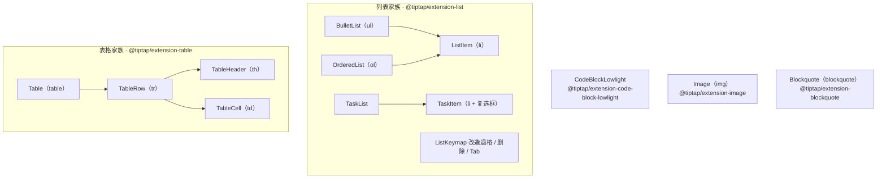

import { Canvas, Controls, Meta } from '@storybook/addon-docs/blocks';
import * as ContentExtensionsStories from './content-extensions.stories';

<Meta of={ContentExtensionsStories} name="Docs" />

# 结构扩展

本课进入节点类扩展：无序 / 有序 / 任务列表、表格、代码块、图片、引用块——它们改变文档的块级形态，习惯上称为结构扩展。理解它们只需要两个支点：**结构以「节点家族」为单位协同**，一个结构由多个节点组成（列表 = 列表节点 + 列表项节点，表格 = 四个节点），家族装一半，命令和输入规则就不完整；**嵌套能力由 schema 决定**，容器节点的 content 表达式与成员节点的 group 决定「什么能套什么」，个别配置（TaskItem 的 nested、Image 的 inline）是直接改写 schema 的开关。

StarterKit 已经自带一部分结构成员（无序 / 有序列表、ListKeymap、引用块、无高亮的 CodeBlock）；任务列表、表格、图片、高亮代码块需要单独安装。看完开场图和参考表，你应该能回答：给文档加任务列表要装什么、toggle 命令的快捷键是什么；看完各节，你应该能预测：在引用块里点 toggleBulletList 会不会成功、把 Image 的 inline 打开后文档结构会怎么变。



| 结构 | 节点家族 | import 来源 | StarterKit 自带 | 切换命令 | 快捷键 | 输入规则 |
| --- | --- | --- | --- | --- | --- | --- |
| 无序列表 | BulletList + ListItem | `@tiptap/extension-list` | 是（含 ListKeymap） | `toggleBulletList` | Mod-Shift-8 | `- ` `* ` `+ ` |
| 有序列表 | OrderedList + ListItem | `@tiptap/extension-list` | 是 | `toggleOrderedList` | Mod-Shift-7 | `1. ` |
| 任务列表 | TaskList + TaskItem | `@tiptap/extension-list` | 否 | `toggleTaskList` | Mod-Shift-9 | `[ ] ` `[x] ` |
| 表格 | Table + TableRow + TableHeader + TableCell | `@tiptap/extension-table` | 否 | `insertTable` | Tab / Shift-Tab 跳格 | — |
| 代码块 | CodeBlockLowlight | `@tiptap/extension-code-block-lowlight` | 自带无高亮 CodeBlock | `toggleCodeBlock` | Mod-Alt-c | 三个反引号 + 语言名 + 空格 |
| 图片 | Image | `@tiptap/extension-image` | 否 | `setImage` | — | `` `` `` |
| 引用块 | Blockquote | `@tiptap/extension-blockquote` | 是 | `toggleBlockquote` | Mod-Shift-b | `> ` |

快捷键里的 Mod 在 Windows / Linux 上是 Ctrl，macOS 上是 ⌘。切换命令的 set / toggle / unset 三件套与 `isActive`、`can()` 用法见[命令课](?path=/docs/commands--docs)。

## 列表

列表 = 外层列表节点包着内层列表项节点。无序与有序两个列表**共用同一个 ListItem**；任务列表用自己的 TaskItem（自带复选框）。切换命令注册在列表节点上（`toggleBulletList` 等，基于 toggleList，见命令课的 toggle 家族）；嵌套命令 `sinkListItem` / `liftListItem` / `splitListItem` 定义在 `@tiptap/core`，由列表项扩展按自己的项名绑定快捷键。

家族必须成对安装：缺了项节点（ListItem / TaskItem），content 表达式就会引用不存在的节点类型，创建编辑器时直接抛 `Unknown node type` 错误。不想逐个核对成员就用 ListKit——从同一个包导入，一次装齐六个成员（bulletList、listItem、orderedList、taskItem、taskList、listKeymap），configure 时按名配置或传 `false` 关闭：

```ts
import { ListKit } from '@tiptap/extension-list';

const extensions = [
  Document,
  Paragraph,
  Text,
  ListKit, // 或 ListKit.configure({ taskItem: { nested: true } })
];
```

### 无序与有序列表

```ts
import { BulletList, ListItem, OrderedList } from '@tiptap/extension-list';

const extensions = [
  Document,
  Paragraph,
  Text,
  BulletList,
  OrderedList,
  ListItem, // 两个列表共用的项节点
];
```

| 选项（BulletList / OrderedList 同形） | 默认值 | 作用 |
| --- | --- | --- |
| `itemTypeName` | `'listItem'` | 项节点名，换自定义项名时两边同步改 |
| `keepMarks` | `false` | 回车拆分列表项时，是否把上一行的标记带到新行 |
| `keepAttributes` | `false` | 拆分时是否同步保留属性 |
| `HTMLAttributes` | `{}` | 渲染到 ul / ol 上的额外属性 |

输入规则与快捷键见开场参考表：行首输入 `- `、`* `、`+ ` 变无序列表，`1. ` 变有序列表，数字可以任意。

### 任务列表

```ts
import { TaskList, TaskItem } from '@tiptap/extension-list';

const extensions = [
  Document,
  Paragraph,
  Text,
  TaskList,
  TaskItem, // 默认 nested: false，对嵌套的影响见「结构的组合与嵌套」
];
```

| 选项 | 默认值 | 作用 |
| --- | --- | --- |
| `nested` | `false` | 任务项里能否嵌套其他块级内容；**直接改写 schema** |
| `onReadOnlyChecked` | — | 只读编辑器里点复选框的回调；不提供则只读状态下不可勾选 |
| `a11y.checkboxLabel` | — | 自定义复选框 aria-label：`(node, checked) => string` |
| `taskListTypeName` | `'taskList'` | 父列表节点名 |
| `HTMLAttributes` | `{}` | 额外属性 |

勾选状态存在节点的 `checked` 属性里，`getJSON()` 可见；可编辑时点击复选框直接更新属性，只读时默认不可勾选、`onReadOnlyChecked` 返回 `true` 才允许变更。渲染产物是 `ul[data-type="taskList"]` 与 `li[data-type="taskItem"]`（复选框包在 label 里、正文包在 div 里），样式定制入口就是这两个选择器。

### 嵌套操作：Tab、Enter 与 ListKeymap

列表项扩展给三个按键绑定了 core 命令，这是列表嵌套的全部日常操作：

| 按键 | 命令 | 行为 |
| --- | --- | --- |
| Tab | `sinkListItem(项名)` | 当前列表项下沉一层（产生嵌套） |
| Shift-Tab | `liftListItem(项名)` | 当前列表项提升一层 |
| Enter | `splitListItem(项名)` | 拆出新的列表项 |

ListKeymap 在这之上改造 Backspace / Delete / Tab 的默认行为：ProseMirror 原生会把相邻列表项「并进一段」，ListKeymap 改成保留列表结构地合并段落。StarterKit 已自带；运行时默认覆盖 `listItem`（配 bulletList / orderedList）与 `taskItem`（配 taskList）两套组合，自定义项名时用 `listTypes` 选项同步。

下面的实例演示三种列表的切换与嵌套；任务项在实例里显式开了 `nested: true`，默认值的行为差异由「结构的组合与嵌套」一节专门演示。

<Canvas of={ContentExtensionsStories.ListFamily} />

| 读者操作 | 可观察证据 |
| --- | --- |
| 光标放进普通段落，点 toggleBulletList / toggleOrderedList / toggleTaskList | 「当前列表」读数切换；任务列表出现复选框 |
| 光标在列表项内点「Tab 缩进」 | 「嵌套深度」读数加一，列表项里长出子列表 |
| 点「Shift-Tab 提升」 | 深度减一；最外层再提升就退出列表 |
| 打开 Show code | 看到该 Canvas 实际执行的 `list-family.ts` |

## 表格

表格的结构是固定层级：table 只装 tableRow，row 只装 tableCell / tableHeader，不像列表和引用块那样能自由容纳各类块级内容；表格节点带 isolating 标记，内外的选区与命令互不越界。因此所有表格命令都以「光标所在的表格 / 行 / 列 / 单元格」为作用对象——执行任何表格命令前，先把光标放进表格。

### 建表与结构命令

```ts
import { Table, TableCell, TableHeader, TableRow } from '@tiptap/extension-table';

const extensions = [
  Document,
  Paragraph,
  Text,
  Table,
  TableRow,
  TableHeader,
  TableCell,
];

// 不传参数时默认 3×3 且带表头行
editor.chain().focus().insertTable({ rows: 3, cols: 3, withHeaderRow: true }).run();
```

| 命令 | 作用 |
| --- | --- |
| `insertTable({ rows, cols, withHeaderRow })` | 建表；默认 3×3 含表头行 |
| `addColumnBefore` / `addColumnAfter` / `deleteColumn` | 光标所在列：前插 / 后插 / 删除 |
| `addRowBefore` / `addRowAfter` / `deleteRow` | 光标所在行：上插 / 下插 / 删除 |
| `toggleHeaderRow` / `toggleHeaderColumn` / `toggleHeaderCell` | 表头状态切换：整行 / 整列 / 单个单元格 |
| `mergeCells` / `splitCell` / `mergeOrSplit` | 合并选中的多个单元格 / 拆分 / 二合一（多选时合并、单个已合并格时拆分） |
| `setCellAttribute(name, value)` | 给当前单元格设属性；需先在 TableCell 上注册同名自定义属性 |
| `goToNextCell` / `goToPreviousCell` | 跳到下一格 / 上一格（表格内 Tab / Shift-Tab 绑定的就是它们） |
| `fixTables` | 检查并修复文档中损坏的表格 |

`setCellAttribute` 的前置是给单元格节点加自定义属性，属于 extend 扩展的用法（完整机制见[Extension 体系课](?path=/docs/extension-system--docs)）：

```ts
const CustomTableCell = TableCell.extend({
  addAttributes() {
    return {
      ...this.parent?.(),
      backgroundColor: { default: null },
    };
  },
});

// 之后：editor.commands.setCellAttribute('backgroundColor', '#fde68a')
```

### 列宽调整：resizable

| 选项 | 默认值 | 作用 |
| --- | --- | --- |
| `resizable` | `false` | 开启列宽拖拽（可编辑状态下才出现手柄） |
| `handleWidth` | `5` | 列边界手柄的触发宽度（px） |
| `cellMinWidth` | `25` | 单元格最小宽度 |
| `lastColumnResizable` | `true` | 最后一列是否可拖；关闭时拖动改变的是表格整体宽度 |
| `allowTableNodeSelection` | `false` | 允许把整表作为节点选中 |
| `renderWrapper` | `false` | 非拖拽 / 只读时也输出 tableWrapper 包裹层，保证与 NodeView 布局一致 |

开启 resizable 后，表格由 TableView 渲染（带 colgroup 与拖拽手柄）。表格内还有一条内置行为：光标在最后一格按 Tab，会先追加一行再跳进去。

<Canvas of={ContentExtensionsStories.TableLab} />
<Controls of={ContentExtensionsStories.TableLab} />

| 读者操作 | 可观察证据 |
| --- | --- |
| 调整「行数 / 列数 / withHeaderRow」 | 表格按 insertTable 参数重建，「表格尺寸」「含表头行」读数同步 |
| 点 addRowAfter / addColumnAfter / deleteRow 等按钮 | 行列读数实时变化；「光标在表格内」为「是」时命令才生效 |
| 拖选两个单元格后点 mergeOrSplit | 单元格合并；再点一次拆回 |
| 开「resizable」后拖动列边界 | 出现 TableView 拖拽手柄，列宽随手柄变化 |
| 打开 Show code | 看到该 Canvas 实际执行的 `table-lab.ts` |

## 代码块

StarterKit 自带的 CodeBlock 没有语法高亮。要高亮，换成 CodeBlockLowlight——同一个 codeBlock 节点的另一个实现，并把 StarterKit 的自带成员禁用掉，避免同名节点重复注册：

```ts
import StarterKit from '@tiptap/starter-kit';
import { CodeBlockLowlight } from '@tiptap/extension-code-block-lowlight';
import { common, createLowlight } from 'lowlight';

const lowlight = createLowlight(common); // 注册常用语言包

const editor = new Editor({
  extensions: [
    StarterKit.configure({ codeBlock: false }), // 让位给低光版
    CodeBlockLowlight.configure({ lowlight }),
  ],
});
```

- **语言存节点属性。** `attrs.language` 进 getJSON，渲染为 `<code class="language-js">`；代码文本本身不变，高亮只是渲染层的装饰叠加。
- **lowlight 实例由应用注入。** 装哪些语言包、支持哪些语言由它决定；体积敏感时用 `lowlight/lib/core` 按需注册语言。
- **未标注语言时**走 lowlight 自动检测；`defaultLanguage` 可强制指定兜底语言（如 `'plaintext'`）。

| 选项 | 默认值 | 作用 |
| --- | --- | --- |
| `lowlight` | （必传） | lowlight 实例，决定高亮能力 |
| `defaultLanguage` | `null` | 无语言标注时的兜底语言 |
| `languageClassPrefix` | `'language-'` | code 上语言类名前缀 |
| `exitOnTripleEnter` | `true` | 连按三次 Enter 自动退出代码块 |
| `exitOnArrowDown` | `true` | 在代码块末尾按 ↓ 退出 |
| `exitOnArrowUp` | `true` | 在代码块开头按 ↑ 退出 |
| `enableTabIndentation` | `false` | 允许 Tab 在代码块内缩进 |
| `tabSize` | `4` | 缩进的空格数 |

快捷键 Mod-Alt-c 切换；输入规则是三个反引号（或三个波浪线）+ 可选语言名 + 空格。切换已有代码块的语言用 `setCodeBlock({ language })` 或 `updateAttributes('codeBlock', { language })`，后者只改属性、不动内容。

<Canvas of={ContentExtensionsStories.CodeHighlight} />

| 读者操作 | 可观察证据 |
| --- | --- |
| 点语言按钮切换 javascript / css / python / plaintext | 「语言属性」与「code 类名」读数同步变化 |
| 对比 javascript 与 plaintext 的「高亮片段」读数 | 前者 lowlight 输出若干带 hljs- 类的片段，后者为 0 个 |
| 在代码块内连按三次 Enter | 自动退出代码块（exitOnTripleEnter 默认开启） |
| 打开 Show code | 看到该 Canvas 实际执行的 `code-highlight.ts` |

## 图片

Image 是叶子节点（img）：没有内容、不参与嵌套，核心配置只有一个 schema 级开关 inline：

```ts
import { Image } from '@tiptap/extension-image';

const extensions = [Document, Paragraph, Text, Image];

// src 必填；alt / title / width / height 是内置属性
editor.commands.setImage({ src: 'https://example.com/cat.png', alt: '一只猫', title: '猫' });
```

| 选项 | 默认值 | 作用 |
| --- | --- | --- |
| `inline` | `false` | 块级（doc 的直接子节点）还是行内（落进段落与文字同行）；**改写 schema** |
| `allowBase64` | `false` | 是否允许 data: URI 图片——解析规则直接排除 data: 开头的 src |
| `resize` | `false` | 可拖拽调整尺寸的 NodeView 包装（directions / minWidth / minHeight 等子配置） |
| `HTMLAttributes` | `{}` | img 上的额外属性 |

输入规则：`` 后接空格触发插入。图片节点 draggable，可直接拖动换位。要自定义尺寸调整的渲染行为，底层机制见[Node View 与 Mark View 课](?path=/docs/node-views--docs)。

边界：Image 只负责**显示**。上传要在 `setImage` 之前完成——把文件传到自己的存储、拿到 URL 再插入，扩展本身不处理上传。

<Canvas of={ContentExtensionsStories.ImageInline} />
<Controls of={ContentExtensionsStories.ImageInline} />

| 读者操作 | 可观察证据 |
| --- | --- |
| 切换「inline」开关 | 同一份 HTML 输入：「img 父节点」读数在 doc 与 paragraph 之间切换 |
| 观察编辑器渲染 | 行内模式图片与文字同行；块级模式图片独立成块 |
| 打开 Show code | 看到该 Canvas 实际执行的 `image-inline.ts` |

## 引用块

Blockquote 是结构成员里最简单的一个——单节点、无必配项，`HTMLAttributes` 是唯一选项：

```ts
import { Blockquote } from '@tiptap/extension-blockquote';

Blockquote.configure({ HTMLAttributes: { class: 'my-quote' } });
```

命令三件套 `setBlockquote` / `toggleBlockquote` / `unsetBlockquote`（toggleWrap 家族，见命令课），快捷键 Mod-Shift-b，输入规则 `> ` 加空格。它的关键在 content 表达式：`block+`——**任何块级内容都能装进引用块**：段落、列表、代码块、图片，甚至引用块本身。嵌套证据见下一节实例。

## 结构的组合与嵌套

一种结构能不能装进另一种，由两件事决定：**容器节点的 content 表达式**与**成员节点所属的 group**。表达式语法见[内容与文档模型课](?path=/docs/content-model--docs)，定义方式见[Schema、节点与标记课](?path=/docs/schema-nodes-marks--docs)；本课成员的关键定义如下：

| 节点 | content 表达式 | 意味着 |
| --- | --- | --- |
| listItem | `paragraph block*` | 首段是段落，其后可套任意块级节点——列表嵌套列表就在这里发生 |
| taskItem | `paragraph+`（nested 关）/ `paragraph block*`（nested 开） | 默认拒绝一切嵌套；开了 nested 才与 listItem 等同 |
| blockquote | `block+` | 通用块级容器，段落、列表、代码块、图片都能进 |
| table | `tableRow+`（isolating） | 只装行；内外选区互不越界 |
| image | group 为 `block` 或 `inline` | 随 inline 配置决定进 doc 还是进 paragraph |

本课有两个「配置改写 schema」的开关：**TaskItem.nested** 与 **Image.inline**——它们的取值直接改写节点进入 schema 时的 content / group，因此同一份 HTML 也会解析出不同的文档结构。

<Canvas of={ContentExtensionsStories.SchemaNesting} />
<Controls of={ContentExtensionsStories.SchemaNesting} />

| 读者操作 | 可观察证据 |
| --- | --- |
| 光标位置选「引用块内段落」，点 toggleBulletList | 操作成功，「光标所在链」读数出现 doc › blockquote › bulletList › listItem › paragraph |
| 光标位置选「任务列表项」（nested 关），点「Tab 缩进」 | 上次操作读数「失败」，所在链不变——paragraph+ 拒绝嵌套 |
| 开「TaskItem nested」重复上一步 | 操作成功，所在链出现 taskItem › taskList › taskItem |
| 打开 Show code | 看到该 Canvas 实际执行的 `schema-nesting.ts` |

## 最佳实践

- **家族成对安装，懒得核对清单就用 Kit。** 列表用 ListKit、表格用 TableKit 一次装齐；手动安装时核对成员——列表缺 ListItem、表格缺 TableRow 时，content 表达式引用了不存在的节点类型，创建编辑器会直接抛 `Unknown node type` 错误。
- **与 StarterKit 共存时先让位。** StarterKit 已带无序 / 有序列表、ListKeymap、引用块和无高亮 CodeBlock；换 CodeBlockLowlight 时用 `StarterKit.configure({ codeBlock: false })` 禁用同名成员，避免同名节点重复注册。
- **结构切换走命令，不要手拼 JSON。** toggle 命令内部处理了提升 / 包裹 / 合并相邻列表等边界；直接构造列表、表格的 JSON 很容易凑出 schema 外的形态。
- **图片的显示与上传分离。** Image 不管上传；在 `setImage` 前把文件传到自己的存储，拿到 URL 再插入，上传 UI 用 placeholder / 菜单等机制自行搭。

## 常见问题

- 列表里按 Tab 没有缩进
  先确认光标在列表项内；再确认 schema 允许嵌套——任务列表项默认 `nested: false`，Tab 的 sinkListItem 会被 schema 拒绝，开 `TaskItem.configure({ nested: true })`。自定义了项名时，同步检查列表项的 content 表达式是否含 `block*`。
- 表格里按 Backspace / Delete 把整张表删了
  内置行为：所有单元格都被选中时，删除键删除整表。点进任意一个单元格让选区回到单格再编辑；真要删整表用 `deleteTable` 命令。
- 代码块里连按三次回车就退出了，想多打几行空行
  `exitOnTripleEnter` 默认 `true`，三连 Enter 自动退出是设计行为；配置 `exitOnTripleEnter: false` 关闭。退出的其他方式：快捷键 Mod-Alt-c，末尾按 ↓（`exitOnArrowDown`）、开头按 ↑（`exitOnArrowUp`）生效。
- 图片插入后不显示
  依次检查：src 是否可访问的绝对地址；data: URI 是否开了 `allowBase64`（默认解析规则直接排除 data: 开头的 src）；用 getJSON 看 image 节点是否真的进了文档——没进说明被 schema 过滤（inline 模式下 img 只能出现在段落里）。
- 调用 `toggleTaskList` 报错，或 TypeScript 类型里没有这条命令
  任务列表家族没装全：不装 TaskList，`commands` 上就没有这条命令；只装 TaskList 缺 TaskItem，创建编辑器时抛 `Unknown node type`。两个成员成对安装，或直接用 ListKit。

## 总结回顾

摘要：

结构扩展改变文档的块级形态，理解它们靠两个支点：节点家族与 schema 约束。列表家族里无序与有序共用 ListItem、任务列表用自带复选框的 TaskItem，StarterKit 自带其中大部分成员，缺的成员（任务列表、表格、图片、高亮代码块）按家族成对安装或用 ListKit / TableKit 一次装齐；切换命令注册在列表节点上，嵌套命令 Tab / Shift-Tab / Enter 绑定在列表项上，ListKeymap 再改造退格与删除的合并行为——列表家族实例用「当前列表」与「嵌套深度」读数演示了这一切。表格由四个节点组成，所有命令以光标所在表格为作用对象，insertTable 默认 3×3 含表头行，resizable 开启列宽拖拽——表格实例把建表参数与命令全家福摆进读数。代码块要高亮就换 CodeBlockLowlight 并禁用 StarterKit 自带成员，语言存进节点属性、高亮由注入的 lowlight 实例在渲染层完成——代码高亮实例用语言切换验证了类名与高亮片段的联动。图片是叶子节点，inline 是 schema 级开关；引用块 content 为 block+，是通用块级容器。最后，嵌套能力由容器的 content 表达式与成员的 group 决定，TaskItem.nested 与 Image.inline 这类配置直接改写 schema——嵌套实例里同一个 Tab，nested 关时被拒绝、开时任务项里长出子任务列表。

一句话：

> 结构扩展以节点家族为单位协同，嵌套能力由 schema 的 content 表达式决定——nested 与 inline 这类配置是直接改写 schema 的开关。

知识要点：

- 三种列表的节点家族分别是什么？哪些结构 StarterKit 自带、哪些要单独装？
- 列表嵌套对应哪些命令与按键？ListKeymap 改造了什么行为？
- insertTable 不传参数建出什么？mergeOrSplit 与 setCellAttribute 各怎么用、各有什么前置？
- CodeBlockLowlight 与 CodeBlock 差在哪？高亮由谁完成、语言存在哪、code 类名长什么样？
- Image 的 inline 开关改变什么？为什么上传不归 Image 管？
- 什么决定「哪种结构能套哪种结构」？TaskItem.nested 与 Image.inline 各改写 schema 的什么？

## 参考资料

- [Bullet List | Tiptap Editor Docs](https://tiptap.dev/docs/editor/extensions/nodes/bullet-list)
- [Ordered List | Tiptap Editor Docs](https://tiptap.dev/docs/editor/extensions/nodes/ordered-list)
- [List Item | Tiptap Editor Docs](https://tiptap.dev/docs/editor/extensions/nodes/list-item)
- [Task List | Tiptap Editor Docs](https://tiptap.dev/docs/editor/extensions/nodes/task-list)
- [Task Item | Tiptap Editor Docs](https://tiptap.dev/docs/editor/extensions/nodes/task-item)
- [List Keymap | Tiptap Editor Docs](https://tiptap.dev/docs/editor/extensions/functionality/listkeymap)
- [List Kit | Tiptap Editor Docs](https://tiptap.dev/docs/editor/extensions/functionality/list-kit)
- [Table | Tiptap Editor Docs](https://tiptap.dev/docs/editor/extensions/nodes/table)
- [Table Kit | Tiptap Editor Docs](https://tiptap.dev/docs/editor/extensions/functionality/table-kit)
- [Code Block Lowlight | Tiptap Editor Docs](https://tiptap.dev/docs/editor/extensions/nodes/code-block-lowlight)
- [Image | Tiptap Editor Docs](https://tiptap.dev/docs/editor/extensions/nodes/image)
- [Blockquote | Tiptap Editor Docs](https://tiptap.dev/docs/editor/extensions/nodes/blockquote)
- [ListKeymap 默认 listTypes、TaskItem content 表达式与 toggleList 回退行为 | tiptap 源码](https://github.com/ueberdosis/tiptap)
