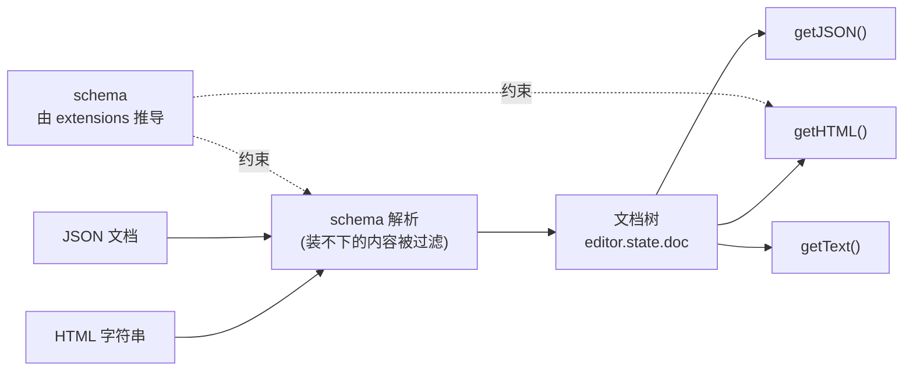

import { Canvas, Controls, Meta } from '@storybook/addon-docs/blocks';
import * as ContentModelStories from './content-model.stories';

<Meta of={ContentModelStories} name="Docs" />

# 内容与文档模型

Tiptap 编辑器里看到的 DOM 只是投影，真正的内容只有一份：一棵受 schema 约束的**文档树**，代码里随时可读，即 `editor.state.doc`。HTML 字符串与 JSON 文档是这棵树的两个方向——输入时解析成树，输出时从树序列化出来；所以同一份内容不管用哪种格式输入，输出都完全一致。schema 由 `extensions` 推导而来，它决定什么能进树：默认模式下装不下的内容被静默过滤，开启 `enableContentCheck` 后会经 `contentError` 事件报告。

[第一个编辑器课](?path=/docs/first-editor--docs)已经见过 `content` 的两种写法；本课把它展开成完整的输入输出模型。看完开场图和参考表，你应该能预测：用未注册的标签初始化编辑器会发生什么、`getText()` 与 `getHTML()` 差在哪、同一份内容换一种格式输入后读数会不会变。



| API | 方向 | 接受 / 返回 | 回查要点 |
| --- | --- | --- | --- |
| `content` 选项 | 输入 | HTML 字符串 / JSON 文档 / `null` | 只在创建时解析一次 |
| `editor.commands.setContent()` | 输入 | 同 `content` | 运行期整体替换文档；`emitUpdate` 默认 `true` |
| `editor.commands.clearContent()` | 输入 | — | 清空文档；`emitUpdate` 默认 `true` |
| `editor.getJSON()` | 输出 | JSON 文档 | 树的直接表示，推荐的存储格式 |
| `editor.getHTML()` | 输出 | HTML 字符串 | 形状由各扩展的 renderHTML 规则决定 |
| `editor.getText()` | 输出 | 纯文本 | 块间分隔符 `blockSeparator` 默认 `"\n\n"` |
| `editor.isEmpty` | 输出 | boolean | 没有文字、也没有叶子节点即为空 |
| `enableContentCheck` 选项 | 输入校验 | 默认 `false` | 开启后非法内容经 `contentError` 事件报告 |
| `emitContentError` 选项 | 输入校验 | 默认 `false` | 检查关闭时也报告 `contentError`，内容照常过滤 |

## HTML 与 JSON 的输入输出

一切输入输出都经过文档树：格式之间不直接转换，路径永远是「输入 → 树 → 输出」。因此两种格式表达同一份文档时，输出逐字符一致——这不是巧合，是树作为唯一真源的直接结果。下面的实例用两种格式输入同一份文档，并逐项核对三种输出。

<Canvas of={ContentModelStories.RoundTrip} />
<Controls of={ContentModelStories.RoundTrip} />

| 读者操作 | 可观察证据 |
| --- | --- |
| 切换「content 输入格式」为 HTML 或 JSON | 编辑器渲染相同；三项「与基准一致」读数保持「是」 |
| 对比两个输入预设的写法 | 写法不同，getJSON 输出框的内容却逐字符相同 |
| 打开 Show code | 看到该 Canvas 实际执行的 `round-trip.ts` |

输入侧的两种写法：

```ts
// 两种输入表达同一份文档，解析结果相同
new Editor({
  extensions,
  content: '<h2>会议纪要</h2><p>输入输出都经过<strong>文档树</strong>。</p>',
});

new Editor({
  extensions,
  content: {
    type: 'doc',
    content: [
      {
        type: 'heading',
        attrs: { level: 2 },
        content: [{ type: 'text', text: '会议纪要' }],
      },
      {
        type: 'paragraph',
        content: [
          { type: 'text', text: '输入输出都经过' },
          { type: 'text', text: '文档树', marks: [{ type: 'bold' }] },
          { type: 'text', text: '。' },
        ],
      },
    ],
  },
});
```

输出侧从同一棵树序列化：

```ts
editor.getHTML(); // '<h2>会议纪要</h2><p>输入输出都经过<strong>文档树</strong>。</p>'
editor.getJSON(); // 上面 JSON 输入所写的文档树
editor.getText(); // '会议纪要\n\n输入输出都经过文档树。'
```

### 输出：getJSON、getHTML、getText

- **getJSON()** 返回文档树的完整 JSON 表示：所有节点、标记与属性都在，结构稳定、便于遍历和修改，是持久化存储的推荐格式。
- **getHTML()** 按各扩展的 renderHTML 规则生成语义化 HTML，适合直接插入页面、邮件等 HTML 上下文；注意它不是「你输入的 HTML 的回放」，结构细节由 schema 说了算。
- **getText()** 只取纯文本，块与块之间插入 `blockSeparator`（默认 `"\n\n"`），适合检索、字数统计、纯文本通知等场景。
- **isEmpty** 在文档里没有任何文字、也没有图片这类叶子节点时为 `true`——单个空段落也算空。

三个方法都定义在 `Editor` 实例上，依赖一个真实实例；没有编辑器实例时的静态转换（`generateHTML` / `generateJSON`）属于服务端渲染场景，见[输出与静态渲染课](?path=/docs/output-rendering--docs)。

### 输入：content 与 setContent

`content` 是构造选项：创建时解析一次，接受 HTML 字符串、JSON 文档或 `null`（空文档），运行期修改构造参数不会影响已创建的实例。HTML 直观，适合写死在代码里的初始文案；JSON 结构稳定，适合来自数据库或接口的数据；还可以传省略 doc 包装的 JSON 节点数组。运行期整体替换用 `setContent` 命令，接受与 `content` 相同的内容形态；`clearContent()` 清空文档。两者默认都会触发 `update` 事件。

```ts
const editor = new Editor({ element, extensions, content: '<p>初始内容</p>' });

editor.commands.setContent('<h1>新文档</h1>'); // 整体替换，触发 update
editor.commands.setContent(editor.getJSON(), { emitUpdate: false }); // 静默替换
editor.commands.clearContent(); // 清空文档
```

只要替换一部分而非整体时，用 `insertContent`，见[命令课](?path=/docs/commands--docs)。

## 文档树

文档树只有一个根节点 `doc`，其下是块级节点（paragraph、heading、列表等），块级节点里装行内内容（text 与 mention 这类行内节点）。`getJSON()` 的输出就是这棵树的直接表示，字段固定为五个：

| 字段 | 出现在 | 含义 |
| --- | --- | --- |
| `type` | 所有节点 | 节点类型名，如 `doc`、`paragraph`、`text` |
| `content` | 有子节点的节点 | 子节点数组；doc 装块级节点，块级节点装行内内容 |
| `text` | 仅 text 节点 | 文本内容；text 是树的叶子 |
| `marks` | text 与行内节点 | 挂在节点上的标记数组（粗体、链接等），不占树的层级 |
| `attrs` | 节点与标记 | 属性，如 heading 的 `level`、image 的 `src` |

下面的实例可以边编辑边看树生长：右侧的树由 `getJSON()` 实时画出，与左侧编辑器逐字对应。

<Canvas of={ContentModelStories.DocTree} />

| 读者操作 | 可观察证据 |
| --- | --- |
| 在编辑区打字 | 对应 text 节点的文本实时变化，层级不变 |
| 选中文本点「加粗」 | text 节点多出 bold 标记，树没有因此加深一层 |
| 点「一级标题」 | 当前 paragraph 换成 heading，`level` 存进 `attrs` |
| 回车另起一段 | doc 下多出一个 paragraph 节点，读数「doc 子节点」加一 |
| 点「setContent 重置」 | 整棵树被替换为初始内容——整体替换，不是追加 |
| 打开 Show code | 看到该 Canvas 实际执行的 `doc-tree.ts` |

### 节点、标记与文本

- **节点（node）构成树的结构**：doc、paragraph、heading 都是节点，一层套一层；每个节点属于块级或行内，能装什么由 schema 决定（见下一节）。
- **标记（mark）不占树的层级**：粗体在树里是 text 节点的 `marks` 数组里多一项，而不是「bold 节点包住 text」。这就是加粗、加链接不会改变文档块级结构的原因——它们不是节点。
- **行内节点与 text 平级**：mention、hardBreak 这类行内节点占据树的行内位置，它们同样可以用 `marks` 挂标记。
- node 与 mark 的职责差异、parseHTML / renderHTML 与 attributes 的定义方式见[Schema、节点与标记课](?path=/docs/schema-nodes-marks--docs)。

## Schema 与合法内容

schema 描述这棵树允许长成什么样：有哪些节点类型、每种节点能装什么、允许哪些标记。它不需要手写——由 `extensions` 推导而来，装了哪些扩展，schema 就认识哪些类型。schema 约束是双向的：输入时过滤装不下的内容，运行期用户也无法通过打字或粘贴制造 schema 外的结构。

下面的实例把两种非法内容喂给一个只认识 Document、Paragraph、Text、Bold 的编辑器，对照默认模式与检查模式的差异。

<Canvas of={ContentModelStories.SchemaGuard} />
<Controls of={ContentModelStories.SchemaGuard} />

| 读者操作 | 可观察证据 |
| --- | --- |
| 切换「content 预设」为含未注册标签的 HTML（检查关闭） | marquee 标签静默消失，合法段落保留，无任何报错 |
| 切换为未注册节点类型的 JSON（检查关闭） | 文档降级为空段落；浏览器控制台出现 `[tiptap warn]: Invalid content.` |
| 开启「enableContentCheck」重复上述操作 | 错误框与读数给出 contentError 信息，合法部分仍被保留 |
| 打开 Show code | 看到该 Canvas 实际执行的 `schema-guard.ts` |

### 节点能装什么：content 表达式

每种节点用 content 表达式声明子内容的形状：document 是 `block+`（一个以上块级节点），paragraph 是 `inline*`（任意多个行内内容）。组（group）把类型归类——`block` 组收拢 paragraph、heading、列表等块级类型，`inline` 组收拢 text 与行内节点；标记另有独立白名单，节点声明自己允许哪些标记挂上来。

```ts
// 概念示意：读扩展定义时能对上号即可；完整的定义方式见 4.1
const Paragraph = Node.create({
  name: 'paragraph',
  content: 'inline*', // 只装行内内容
  group: 'block', // 属于块级组，因此能被 document 的 block+ 接纳
});
```

反过来，不要手写 JSON 去凑 content 表达式：程序生成的内容应先经 `getJSON()` 产出，或用输出与静态渲染课的 `generateJSON` 从 HTML 转换。

### 非法内容的两种处理

**默认（检查关闭）：** HTML 按标签名过滤，未注册标签静默丢弃，连警告都没有；JSON 校验类型名，遇到未注册的节点类型会在控制台 `console.warn` 后降级为空文档。还要注意一个更隐蔽的坑：结构不合法的 JSON（比如 doc 顶层直接放 text）既不报错也不警告，会直接进入文档树，可能引发渲染异常。

**开启 `enableContentCheck: true`：** 构造编辑器或 `setContent` 遇到非法内容时，经 `contentError` 事件报告，随后按默认规则降级重建——合法部分保留，非法部分过滤，不会抛出未捕获异常。两种解析器的严格度不同：HTML 只按标签名过滤、结构偏差会被解析器自动修复；JSON 按结构与类型名校验。所以同一份内容用 HTML 喂不报错、换成 JSON 报错，并不是矛盾。

```ts
const editor = new Editor({
  extensions,
  content: someUserHtml, // 内容来源不可控时尤其需要检查
  enableContentCheck: true,
  onContentError: ({ error }) => {
    // error.message 形如 '[tiptap error]: Invalid HTML content'
    reportToMonitoring(error);
  },
});
```

注意：默认的 `onContentError` 回调会把错误重新抛出，开启检查后应提供自己的回调，否则实例创建会中断。`setContent` 可以用第二参数的 `errorOnInvalidContent` 按次覆盖检查行为（开启时解析失败会直接抛错）；运行期插入路径还提供 `emitContentError: true`，在不改变「过滤后继续」行为的前提下收到通知。协作场景下文档树由 Yjs 维护，内容处理方式见[协作入门课](?path=/docs/collaboration--docs)。

## 最佳实践

- **存储选 JSON，渲染用 HTML。** `getJSON()` 覆盖全部节点、标记与属性，是无损形态，适合入库；`getHTML()` 是渲染形态，适合直接展示。需要 Markdown、纯文本等其他格式时，从 JSON 或 HTML 二次转换。
- **持续存储用 onUpdate 加 getJSON()。** 每次文档变更都会触发 `update` 事件，在回调里把 `getJSON()` 写回存储（建议防抖）；事件时序与参数见[事件课](?path=/docs/events--docs)。
- **外部内容一律走解析，不要手写 JSON。** 用户粘贴或历史遗留的 HTML 直接交给编辑器，schema 会过滤并修复结构；手拼 JSON 很容易凑出 schema 外的形态，自产内容用 `enableContentCheck` 兜底校验。
- **格式互转仍以 schema 为界。** HTML 转 JSON 用 `generateJSON`，JSON 转 HTML 用 `generateHTML`（无编辑器实例，见[输出与静态渲染课](?path=/docs/output-rendering--docs)）；它们同样只认识已安装的扩展，输出不会比 schema 更宽。

## 常见问题

- getHTML() 的输出和我当初输入的 HTML 不一样：属性顺序变了、标签被改写
  正常行为。输出由各扩展的 renderHTML 规则生成，不是输入的回放；解析时结构已按 schema 重组。要判断「内容是否变化」，比较 `getJSON()` 的结果，不要比较 HTML 字符串。
- schema 外的内容直接消失，连警告都没有，排查不到原因
  默认模式下 HTML 解析是静默的。给编辑器加 `enableContentCheck: true` 和自己的 `onContentError` 回调，非法内容会经 `contentError` 事件暴露；也可以像本页第三个实例那样，用预设内容做二分排查。
- 同一份内容，HTML 输入没事，换成 JSON 却报 Invalid JSON content
  两种解析器严格度不同：HTML 按标签名过滤、结构自动修复；JSON 按结构与类型名校验。按报错定位到具体节点修正 JSON；确定只需要 HTML 时保持 HTML 输入，或先用 `generateJSON` 转成树再核对。
- isEmpty 为 true，但文档里明明还有一个空段落
  `isEmpty` 只看有没有文字和叶子节点，空段落视为空——做「用户是否输入过」判断时这正是想要的语义。若要把空段落与空文档区分开，检查 `editor.state.doc.childCount` 与首子节点的 `type`。

## 总结回顾

摘要：

编辑器里的内容只有一份真源：受 schema 约束的文档树，代码里通过 `editor.state.doc` 随时可读。输入端，`content` 选项在创建时解析一次，`setContent` 命令在运行期整体替换，两者都接受 HTML 字符串或 JSON 文档；输出端，`getJSON`、`getHTML`、`getText` 把同一棵树序列化成三种形态——往返等价实例用两种格式输入同一份文档、逐项核对三种输出一致，验证了树是中枢。树只有 doc 一个根，块级节点套行内内容；标记不占层级、挂在 text 节点的 marks 数组上，所以加粗不会改变文档结构——文档树实例让你边编辑边看树生长。schema 由 extensions 推导，content 表达式与组决定每种节点能装什么；非法内容默认静默过滤，开启 enableContentCheck 后经 contentError 事件报告并降级重建——非法内容实例对照了两种模式，也暴露了 HTML 与 JSON 解析严格度的差异。存储选 JSON、渲染用 HTML、外部内容走解析，是本课的三条取舍结论。

一句话：

> 文档树是唯一真源，HTML 与 JSON 只是它在输入输出两端的投影；schema 说了算什么能进树，非法内容默认静默过滤。

知识要点：

- 同一份文档用 HTML 与 JSON 两种输入，输出为什么完全一致？格式之间如何转换？
- getJSON、getHTML、getText 各适合什么场景？getText 的块分隔符默认值是什么？
- 文档树 JSON 的五个字段各出现在哪些节点上？marks 挂在哪里、为什么加粗不加深树的层级？
- content 表达式与组描述什么？schema 是怎么来的？
- 默认模式与开启 enableContentCheck 后，非法内容各怎么处理？两种解析器的严格度差异是什么？
- content、setContent、clearContent 各在什么时机用？emitUpdate 的默认值是多少？

## 参考资料

- [Export to JSON and HTML | Tiptap Editor Docs](https://tiptap.dev/docs/guides/output-json-html)
- [Schema | Tiptap Editor Docs](https://tiptap.dev/docs/editor/core-concepts/schema)
- [Nodes and Marks | Tiptap Editor Docs](https://tiptap.dev/docs/editor/core-concepts/nodes-and-marks)
- [setContent command | Tiptap Editor Docs](https://tiptap.dev/docs/editor/api/commands/content/set-content)
- [Editor 类 API（getJSON / getHTML / getText / isEmpty）| Tiptap Editor Docs](https://tiptap.dev/docs/editor/api/editor)
