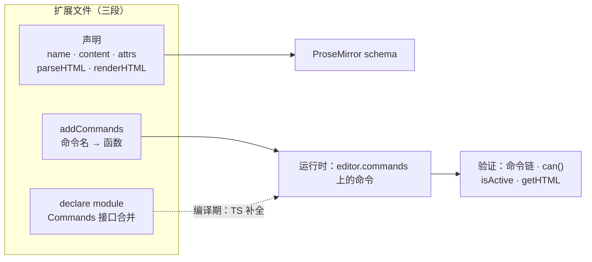

import { Canvas, Meta } from '@storybook/addon-docs/blocks';
import * as CustomNodeMarkStories from './custom-node-mark.stories';

<Meta of={CustomNodeMarkStories} name="Docs" />

# 自定义 Node 与 Mark

[Schema、节点与标记课](?path=/docs/schema-nodes-marks--docs)讲过扩展的**声明侧**：name、content/group、addAttributes、parseHTML/renderHTML——这些字段决定一种内容类型"是什么、能收什么、能出什么"。但光有声明还不够：声明出来的能力要有调用入口（命令），调用入口要有类型提示（接口合并），成品要装进编辑器验证。本课把这条闭环走完，产出一份可直接分发的扩展源码。

核心模型是**双轨登记**：`addCommands` 在运行时把命令写进 `editor.commands`；`declare module` 在编译期把命令名合并进 TypeScript 的 `Commands` 接口。两条轨道互不替代——漏了运行时登记，调用直接报错；漏了编译期登记，一切照常运行，只是补全静默消失。



一个自定义扩展文件的完整骨架与讲解归属：

| 骨架成员 | 职责 | 讲解位置 |
| --- | --- | --- |
| `name` | 类型名，attrs 与命令的命名空间 | [4.1](?path=/docs/schema-nodes-marks--docs) / 本课 |
| `content` / `group` / `marks` 等结构字段 | 能装什么、属于哪个组、能挂哪些标记 | [4.1](?path=/docs/schema-nodes-marks--docs) |
| `addAttributes` | 属性的收——存——出链路 | [4.1](?path=/docs/schema-nodes-marks--docs) |
| `parseHTML` / `renderHTML` | HTML 进出规则 | [4.1](?path=/docs/schema-nodes-marks--docs) |
| `addCommands` | 注册 `editor.commands` 上的命令 | 本课 |
| `declare module`（Commands 接口） | 给命令补全 TS 类型 | 本课 |
| `addOptions` / `addStorage` | 配置项与扩展私有状态 | [4.2](?path=/docs/extension-system--docs) |
| 生命周期钩子（`onCreate` 等） | 挂进编辑器生命周期 | [4.2](?path=/docs/extension-system--docs) |
| `addKeyboardShortcuts` / `addInputRules` | 快捷键与输入规则 | [4.3](?path=/docs/keyboard-input-rules--docs) |
| `addNodeView` / `addDecorations` | 自管 DOM 渲染 / 纯视觉装饰 | [4.5](?path=/docs/node-views--docs) / [4.6](?path=/docs/decorations-plugins--docs) |

## 快速上手：一个最小的自定义 Mark

从零写一个扩展只需要三步：写扩展文件 → 注册进 `extensions` → 调用命令。下面的 `Small` 扩展给文字套上 HTML 原生的 `<small>` 标签，十几行就能用：

```ts
// small.ts —— 一个最小但完整的自定义 Mark
import { Mark } from '@tiptap/core';

export const Small = Mark.create({
  name: 'small',

  // 收：粘贴或初始 content 里的 small 标签都认（声明侧规则见 4.1 课）
  parseHTML() {
    return [{ tag: 'small' }];
  },

  // 出：getHTML() 与复制时输出 small 标签，0 是内容插入点
  renderHTML({ HTMLAttributes }) {
    return ['small', HTMLAttributes, 0];
  },

  // 注册命令：this.type 是 small 在 schema 里的 MarkType
  addCommands() {
    return {
      toggleSmall:
        () =>
        ({ commands }) =>
          commands.toggleMark(this.type),
    };
  },
});

// 第二轨：把命令名合并进 Commands 接口，TS 才认识 toggleSmall
declare module '@tiptap/core' {
  interface Commands<ReturnType> {
    small: {
      toggleSmall: () => ReturnType;
    };
  }
}
```

注册与调用：

```ts
import { Editor } from '@tiptap/core';
import { Document } from '@tiptap/extension-document';
import { Paragraph } from '@tiptap/extension-paragraph';
import { Text } from '@tiptap/extension-text';
import { Small } from './small';

const editor = new Editor({
  extensions: [Document, Paragraph, Text, Small],
  content: '<p>选中这段文字试试</p>',
});

// 选中文字后执行：链式调用（先聚焦再执行）或单发调用都可以
editor.chain().focus().toggleSmall().run();
editor.commands.toggleSmall();
```

可观察结果：选区内的文字被套上标记，`editor.getHTML()` 输出 `<small>…</small>`；类型声明补上之后，输入 `editor.commands.` 时补全列表里出现 `toggleSmall`。本课接下来的小节把每一步的机制拆开讲，范例换成带属性、带参数命令的两个扩展。

## 注册命令：addCommands

命令是扩展的公开 API：把 transaction 细节包进命令函数，菜单按钮、快捷键、测试都只调命令。`addCommands()` 返回一张"命令名 → 命令函数"的表，编辑器创建时逐个扩展执行 `addCommands()`，把结果按 `extensions` 数组顺序合并进 `editor.commands`（数组靠后的同名命令覆盖靠前的）。

每个命令函数是两层：外层收参数，内层收 `CommandProps` 并**返回 boolean**：

```ts
// 摘自本课范例 custom-extensions.ts：批注标记的两个命令
addCommands() {
  return {
    setAnnotation:
      (attributes: { id: string }) =>
      ({ chain, state }) => {
        // 返回 false 表示"当前不可用"：单发与链式调用得到 false，can() 干跑同样判定不可用
        if (state.selection.empty) {
          return false;
        }
        return chain().setMark(this.type, attributes).run();
      },

    unsetAnnotation:
      () =>
      ({ commands }) =>
        commands.unsetMark(this.type),
  };
}
```

两层函数的可用上下文：

| 位置 | 成员 | 含义 |
| --- | --- | --- |
| 外层 `this` | `this.name` | 扩展名，命令的自然命名空间 |
| 外层 `this` | `this.type` | 该类型在 schema 里的 `MarkType` / `NodeType`，喂给内置命令 |
| 外层 `this` | `this.editor` | 编辑器实例 |
| 外层 `this` | `this.options` / `this.storage` | 配置与私有状态（[4.2](?path=/docs/extension-system--docs)） |
| 外层 `this` | `this.parent` | 扩展内置扩展时被覆盖的原命令（[4.2](?path=/docs/extension-system--docs)） |
| 内层 props | `commands` | 单发调用其他命令 |
| 内层 props | `chain()` / `can()` | 组命令链；`can()` 是试运行版命令链 |
| 内层 props | `tr` / `state` / `view` | 当前事务、编辑器状态与视图，需要手写 transaction 时使用 |
| 内层 props | `dispatch` | 实际执行时是派发函数；`can()` 干跑时为 `undefined`——手写事务修改前用 `if (dispatch)` 守卫 |

写命令的首选方式是**组合内置命令**，而不是手写 transaction。Mark 类命令通常组合 `setMark` / `unsetMark` / `toggleMark`（传 `this.type` 或 `this.name`），Node 类命令有三种典型形态，摘自本课范例的 Callout 扩展：

```ts
// 插入：组合 insertContent，插入后光标跟随进新节点
insertCallout:
  () =>
  ({ commands }) =>
    commands.insertContent({
      type: this.name,
      attrs: { type: 'info' },
      content: [{ type: 'paragraph' }],
    }),

// 切换：光标所在块在 callout 与普通段落之间来回
toggleCallout:
  () =>
  ({ commands }) =>
    commands.toggleNode(this.name, 'paragraph', { type: 'info' }),

// 改属性：光标不在 callout 内时 updateAttributes 找不到目标，命令返回 false
setCalloutType:
  (attributes: { type: CalloutType }) =>
  ({ commands }) =>
    commands.updateAttributes(this.name, attributes),
```

返回 boolean 回答的是"这个命令成功了吗"。单发调用的返回值就是它；链式调用把整条命令合并成一个事务，`run()` 派发事务并返回**所有命令返回值的逻辑与**——某个命令返回 false 不会撤销其他命令已加入事务的变更，只让整条链的返回值变成 false；`editor.can().xxx(...)` 则以 `dispatch = undefined` 干跑同一个命令，把返回值变成"现在能不能做"的查询。所以命令内部的边界条件（选区为空、光标位置不对）应该用返回值表达，菜单按钮的禁用态、`can()` 读数自然就联动了。

## 补全类型：declare module

`addCommands()` 只登记了运行时命令。TypeScript 对自定义命令一无所知：`editor.commands.setAnnotation` 没有补全，链式调用直接类型报错——运行时明明有这个命令。补全靠 TS 的**模块声明合并**（module augmentation）：`declare module '@tiptap/core'` 把命令名与参数类型合并进 `Commands` 接口，本课范例的声明：

```ts
declare module '@tiptap/core' {
  interface Commands<ReturnType> {
    // 以扩展名为命名空间分组，避免命令名互相污染
    annotation: {
      // 参数类型写在这里，调用点就能得到检查与补全
      setAnnotation: (attributes: { id: string }) => ReturnType;
      unsetAnnotation: () => ReturnType;
    };
  }
}
```

两个细节决定写法：

- **签名末尾必须写 `=> ReturnType`。** `ReturnType` 由调用方式注入：单发调用 `editor.commands.setAnnotation({...})` 时是 boolean，链式调用 `editor.chain().focus().setAnnotation({...})` 时是命令链——这正是链式 API 的类型基础，写死返回值会让链式调用断型。
- **接口里用扩展名做命名空间**（`annotation: { ... }`），与官方扩展的声明方式一致，也让多个扩展的同名命令不互相干扰。

声明要生效，三条缺一不可：

- 文件是**模块**：顶层有 `import` 或 `export`，`declare module` 才表示"增强既有模块"而不是声明一个新模块。
- 文件被 import 进项目（或放进 tsconfig include 范围的 `.d.ts`），类型系统才能看到这份声明。
- 模块名精确为 `'@tiptap/core'`——包名写错不报错，但合并到了不存在的模块上。

最省心的做法是类型声明与扩展写在**同一个文件**：import 扩展就自动带上声明，随扩展一起分发，不存在"忘了被引用"的问题。本课范例 `custom-extensions.ts` 就是这么组织的（下一节实验台的 Show code 展示的就是这份源码）。

双轨登记对称地各有一个失效模式，回查时按症状定位：

| 症状 | 缺了哪一轨 | 处理 |
| --- | --- | --- |
| 运行时 `editor.commands.xxx is not a function`，类型反而没报错 | 运行时登记（`addCommands` 没执行或没注册上） | 检查扩展是否进了 `extensions` 数组 |
| 运行一切正常，但没有补全、链式调用类型报错 | 编译期登记（缺 `declare module` 或未生效） | 按上面三条逐一核对 |

同一机制还覆盖扩展自身的类型：`addOptions` 与 `addStorage` 的类型分别通过 `ExtensionOptions` / `ExtensionStorage` 接口合并补全（[4.2](?path=/docs/extension-system--docs)）；命令参数的更精细类型约束（如按扩展名收窄参数）见 [TypeScript 课](?path=/docs/typescript--docs)。

## 在编辑器中验证

写好的扩展装进 `extensions` 数组后，验证有五个抓手：命令是否注册（读 `editor.commands`）、状态是否正确（`isActive` / `getAttributes`）、命令此刻是否可用（`can()`）、输出是否符合声明（`getHTML()`）、HTML 是否按 `parseHTML` 收进文档。下面的实验台把五个抓手放在一屏：左边是装了 Annotation 与 Callout 两个自定义扩展的编辑器，右边是 `getHTML()` 输出，底部读数实时反映光标状态。

<Canvas of={CustomNodeMarkStories.EditorLab} />

| 读者操作 | 可观察证据 |
| --- | --- |
| 选中一段文字，点「添加批注」 | 「光标处」出现 `annotation(note-N)`，getHTML 的 span 带上 `data-annotation` |
| 光标放进提示块，点「切换类型」 | type 在 info / warning / success 间循环，getHTML 的 `data-callout` 同步变化 |
| 光标停在普通段落，看「can().setCalloutType」 | 读数为 false——`updateAttributes` 找不到目标，命令返回 false |
| 点「插入 callout」 | 文档多出一个提示块；初始 HTML 里的 `div[data-callout]` 也走 `parseHTML` 被收进文档 |
| 打开 Show code | 看到实验台装载的扩展源码 `custom-extensions.ts`，含两段 `declare module` 声明 |

读数「已注册的自定义命令」列出五个命令名——这是 `addCommands` 执行成功的运行时证据；`can()` 读数则是命令返回值语义的直接演示：同一个命令，光标位置不同，可用性不同。

还有一个容易忽略的边界：扩展只负责 DOM 结构与行为（`data-*` 属性、标签名），提示块的底色、批注的下划线都来自页面 CSS。Tiptap 是 headless 编辑器，扩展分发到任何项目时只带结构与行为，视觉由使用方决定——所以验证扩展时看的是 DOM 属性与 HTML 输出，而不是"好不好看"。

## 最佳实践

- **命令是扩展的唯一调用面。** transaction 细节、边界判断全部收进命令；菜单、快捷键、测试只调命令。命名跟随内置动词：`setXxx` / `toggleXxx` / `unsetXxx` / `insertXxx`，调用方不需要读源码就能预测行为。
- **用返回值表达可用性，别抛错、别静默。** 选区为空、光标位置不对时 `return false`，`can()` 与菜单禁用态就自动正确；手写事务修改时用 `if (dispatch)` 守卫，别在干跑阶段改状态。返回 true 却什么都没做，是链式调用里最难排查的坑。
- **类型声明与扩展同文件。** 三条生效条件里"被 import"最容易漏，同文件让它不可能漏；分发扩展时声明随源码一起走。
- **先考虑 extend，再考虑从零写。** 内置扩展已经具备声明、命令、类型三件套，只需要小改时用 `.extend()` 覆盖（机制见 [4.2](?path=/docs/extension-system--docs)）；只有编辑器里全新的内容类型才值得从零写本课的完整闭环。

## 常见问题

- 写了 `declare module`，`editor.commands.xxx` 仍然没有补全
  按三条生效条件逐项核对：文件顶层是否有 `import` / `export`（不是模块则声明不生效）、该文件是否被任何文件 import 进项目、模块名是否精确为 `'@tiptap/core'`。最隐蔽的是最后一条：包名写错时 TS 不报错，声明合并到了不存在的模块上。
- 调用命令抛 `editor.commands.xxx is not a function`
  扩展没有进 `extensions` 数组，或同名命令被覆盖（合并按数组顺序、后者胜出）。在控制台打印 `Object.keys(editor.commands)` 核对命令名是否存在；确认扩展注册顺序中是否有人用同名命令覆盖了它。
- `can()` 永远返回 true，菜单按钮的禁用态不生效
  命令没有表达可用性：要么无条件返回 true，要么手写 tr 修改前没按 `if (dispatch)` 守卫——干跑时也改了事务，`can()` 自然判定"可行"。把边界条件写成返回值、用 `dispatch` 守卫事务修改；只组合内置命令时这两件事框架都代劳，不用自己处理。
- 命令内部的 `chain()` 忘了 `.run()`，命令"没反应"也不报错
  `chain()` 只构建命令序列，`.run()` 才派发事务。命令里组合链式调用时结尾必须有 `.run()`（或 `scrollIntoView()`），否则返回的链对象被丢弃，什么都不会发生。

## 总结回顾

摘要：

从零写一个 Tiptap 扩展是三段式：声明（schema 字段、parseHTML/renderHTML、addAttributes，见 4.1 课）定义内容类型本身；`addCommands()` 把能力包装成命令——两层函数（外层收参数、内层收 CommandProps 返回 boolean），优先组合 `setMark` / `insertContent` / `toggleNode` / `updateAttributes` 等内置命令，`this.type` / `this.name` 把扩展与 schema 类型连起来，返回值是命令的结果语义，`can()` 借同一返回值干跑出可用性查询；`declare module '@tiptap/core'` 把命令名与参数合并进 `Commands` 接口，补全链式调用的类型。运行时与编译期双轨登记缺一不可，症状各异、按表回查。验证有五个抓手：命令列表、`isActive` / `getAttributes`、`can()`、`getHTML()`、parseHTML 收录——实验台把它们放在一屏，用批注标记与提示块节点两个真实扩展演示了完整回路。

一句话：

> 自定义扩展 = 声明定义内容 + addCommands 注册命令 + declare module 补全类型，运行时与编译期两轨都齐了，才算一个可分发的扩展。

知识要点：

- 一个自定义扩展文件的最小骨架有哪些成员？哪些声明字段属于 4.1 课，本课新增的是哪两段？
- `addCommands` 的 `this` 上下文里有哪些成员？命令函数为什么是两层、为什么必须返回 boolean？
- 命令返回 false 时，命令链和 `can()` 各是什么行为？怎样用返回值表达"当前不可用"？
- `addCommands` 与 `declare module` 各登记哪一轨？`Commands<ReturnType>` 里 `=> ReturnType` 的作用是什么？
- `declare module` 生效的三个条件是什么？两个失效模式分别是什么症状？
- 在编辑器里验证一个新扩展有哪五个抓手？headless 边界下为什么不能靠"视觉"验证？

## 参考资料

- [Node API | Tiptap Editor Docs](https://tiptap.dev/docs/editor/extensions/custom-extensions/create-new/node)
- [Mark API | Tiptap Editor Docs](https://tiptap.dev/docs/editor/extensions/custom-extensions/create-new/mark)
- [Extension API | Tiptap Editor Docs](https://tiptap.dev/docs/editor/extensions/custom-extensions/create-new/extension)
- [Create Mark | Tiptap Editor Docs](https://tiptap.dev/docs/guides/create-mark)
- [Commands | Tiptap Editor Docs](https://tiptap.dev/docs/editor/api/commands)
