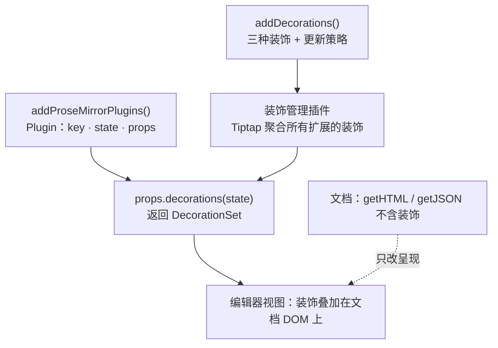

import { Canvas, Controls, Meta } from '@storybook/addon-docs/blocks';
import * as DecorationsPluginsStories from './decorations-plugins.stories';

<Meta of={DecorationsPluginsStories} name="Docs" />

# Decorations 与插件

装饰器（decoration）是叠在文档之上的呈现层：给命中的文字加高亮、在光标边插一枚协作头像、给空段落画一个占位框——这些都只改变"看起来是什么样"，不改变"内容是什么"。`getHTML()` 与 `getJSON()` 的输出里找不到任何装饰，保存后装饰也随之消失：它只活在编辑器视图里，需要持久化的数据要由使用方另行保存。

装饰的真正来源是 ProseMirror 插件的 `decorations` prop。Tiptap 把这件事分成两层：`addDecorations()` 是声明式自动挡——扩展只声明"该有哪些装饰"，位置映射与重建时机由 Tiptap 代管；`addProseMirrorPlugins()` 是底层逃生口——自己 `new Plugin`、维护插件状态、手动映射位置，Tiptap 的 input rules、placeholder、撤销历史等内置能力都建在它上面。多数装饰场景用前者就够；需要选区驱动装饰、与事务通信（meta）或插件独有能力时才下到后者。本课沿"三种装饰 → 声明式装饰 → 插件逃生口"推进，两个实例用同一个搜索任务走完两条路径。



三种装饰的回查入口（Tiptap 层工厂，`import { Decoration } from '@tiptap/core'`）：

| 装饰 | 工厂 | 做什么 | 关键参数 | 典型用途 |
| --- | --- | --- | --- | --- |
| inline | `Decoration.Inline(from, to, attrs?)` | 给一段行内内容附加属性，渲染成带样式的 span | `class` / `style` / `nodeName` | 搜索高亮、拼错词标红 |
| widget | `Decoration.Widget(pos, render, options)` | 在一个文档位置插入 DOM 元素，不属于文档内容 | `key` 必填、`side` | 协作光标、行内徽章 |
| node | `Decoration.Node(pos, to, attrs?)` | 给单个节点的 DOM 外层附加属性 | `pos` 与 `pos + node.nodeSize` | 命中块轮廓、空段占位样式 |

## 三种装饰

三种装饰回答同一个问题——**在哪里、加什么视觉**。位置一律用文档位置（from / to 的数法见[选区与焦点课](?path=/docs/selection--docs)），视觉一律用 DecorationAttrs（`class`、`style`、`nodeName` 与普通 HTML 属性）。装饰不改 schema：它不注册任何内容类型，也因此不会进 `getHTML()` / `getJSON()`。这是它与相邻机制的分界——内容要进文档走[自定义 Node 与 Mark 课](?path=/docs/custom-node-mark--docs)，节点要自管 DOM 渲染走 [Node View 与 Mark View 课](?path=/docs/node-views--docs)，只改呈现才用装饰。

声明入口是任何扩展都有的 `addDecorations()` 钩子，返回一个装饰规格对象，`create` 全量构建装饰数组：

```ts
import { Decoration, Extension } from '@tiptap/core';

const Highlight = Extension.create({
  name: 'highlight',
  addDecorations() {
    return {
      create: ({ state }) => [Decoration.Inline(1, 5, { class: 'highlight' })],
    };
  },
});
```

下面的实验台把三种装饰放进同一个搜索场景：命中的文字获得 inline 高亮与前置的 ★ 徽章（widget），命中所在的段落获得 node 轮廓。搜索词存放在扩展 storage 里，是文档之外的外部状态；改词即调 `updateDecorations` 重建（机制见下一节）。

<Canvas of={DecorationsPluginsStories.SearchDecorations} />
<Controls of={DecorationsPluginsStories.SearchDecorations} />

| 读者操作 | 可观察证据 |
| --- | --- |
| 改「搜索词」 | 读数「三种装饰计数」同步变化；命中处出现高亮、★ 徽章与段落轮廓 |
| 清空「搜索词」 | 三种装饰全部消失——按空集重建 |
| 在有高亮的词前后打字 | 高亮与徽章跟随文字移动：装饰只做位置映射 |
| 看 getHTML() 输出 | 读数「装饰痕迹」恒为无：装饰不进文档 |
| 打开 Show code | 看到该 Canvas 实际执行的 `search-decorations.ts` |

### inline：包住一段行内内容

inline 装饰给 from 到 to 之间的每个行内节点附加 attrs，ProseMirror 渲染时把它们合并进包裹行内内容的 span。摘自本课范例：

```ts
// 命中的文字包一层高亮 span；attrs 与 renderHTML 的属性对象同构
decorations.push(Decoration.Inline(from, to, { class: 'dp-match' }));
```

`class` 会追加到已有类名、`style` 拼接进已有样式、`nodeName` 能把包裹元素换成别的标签。两个边界：范围跨段时会拆成每段各自的 span（作用的是"行内内容"，不含块的包裹元素）；范围两端默认排他——正好插在 from / to 上的新文字不继承装饰，需要延续时在 spec 里设 `inclusiveStart` / `inclusiveEnd`。

### widget：在位置上插一个 DOM 元素

widget 装饰在一个文档位置插入真实的 DOM 元素：看得见、可以绑事件，但不是文档内容，`getHTML()` 里同样没有它。render 回调返回元素，惰性调用（画到才执行）：

```ts
// 命中位置前插一枚徽章；side: -1 表示画在位置之前
decorations.push(
  Decoration.Widget(
    from,
    () => {
      const badge = document.createElement('span');
      badge.className = 'dp-badge';
      badge.textContent = '★';
      return badge;
    },
    { key: `dp-badge-${from}`, side: -1 },
  ),
);
```

`key` 是 widget 的身份，也是最易踩的坑：key 相同，ProseMirror 就视为同一个 widget、跨重绘复用 DOM；key 不稳定（循环索引）或重复，会导致闪烁、错位乃至崩溃。规则是**稳定、位置无关、全局唯一**——`comment-${id}` 这类业务 id 最好，一个实体要两个 widget 时加后缀（`comment-${id}-start` / `-end`）；只有无状态的演示 widget（如这里的固定徽章）才允许位置派生 key。render 在 create 返回之后才执行，别在里面读会变的临时变量。

widget 选项回查表：

| 选项 | 默认 | 作用 |
| --- | --- | --- |
| `key` | 必填 | widget 身份；稳定且全局唯一，同 key 复用 DOM |
| `side` | `0` | 负数画在位置之前，正数在后；多个 widget 按值排序 |
| `marks` | 自动 | 指定 widget 周围绘制哪些标记 |
| `stopEvent` | — | 决定哪些冒泡到 widget 的事件由编辑器忽略 |
| `ignoreSelection` | `false` | widget 内部的选区变化不触发视图重同步 |
| `relaxedSide` | `false` | 允许 DOM 选区留在位置另一侧，不被强制拉回 |
| `destroy` | — | widget 被移除或编辑器销毁时调用，收 DOM 节点 |

协作光标就是 widget 装饰的典型应用（`@tiptap/extension-collaboration-caret`，见[协作体验课](?path=/docs/collaboration-ux--docs)）。用 React / Vue 组件当 widget 各有官方渲染器（`ReactWidgetRenderer` / `VueWidgetRenderer`），属于框架集成的范围，见 [React 集成课](?path=/docs/react--docs)与 [Vue 集成课](?path=/docs/vue--docs)。

### node：给节点的 DOM 外层加属性

node 装饰不碰节点内容，改的是节点自己的包裹元素（如 `p`、`h1`）上的属性。from 和 to 必须精确夹住一个节点，惯用写法是 `pos` 与 `pos + node.nodeSize`。摘自本课范例——给命中所在的顶层块加轮廓：

```ts
// $pos.before(1) / after(1)：doc 直接子节点（顶层块）的起止位置
decoratedBlocks.add(state.doc.resolve(from).before(1));

for (const blockStart of decoratedBlocks) {
  decorations.push(
    Decoration.Node(blockStart, state.doc.resolve(blockStart).after(1), {
      class: 'dp-match-block',
    }),
  );
}
```

与 inline 的分工：inline 作用于块内的行内内容，node 作用于块的外层元素——"给含命中的段落画轮廓"是 node，"把命中的词涂黄"是 inline。attrs 里的 `nodeName` 还能把目标节点再包进一层新元素。

## addDecorations：声明式装饰

`addDecorations()` 在 Extension / Node / Mark 三类扩展上都可用，返回一个 DecorationSpec（或 null）；`this` 上下文与其他钩子一致（`name`、`options`、`storage`、`editor`，见 [Extension 体系课](?path=/docs/extension-system--docs)）。规格成员与默认值：

| 成员 | 必填 | 默认 | 作用 |
| --- | --- | --- | --- |
| `create` | 是 | — | 全量构建装饰数组；初始化与 `updateDecorations()` 都执行它 |
| `update` | 否 | `'document'` | 更新策略，见下表 |
| `shouldUpdate` | 否 | `tr.docChanged` | 返回 `false` 时只映射位置、不重建（不能与 manual 同用） |
| `createInRange` | 仅 changedRanges 需要 | — | 只为变更块重建；只返回锚点落在 `[from, to)` 内的装饰 |

三种更新策略回答"文档变化后装饰怎么跟"：

| 策略 | 行为 | 适用 |
| --- | --- | --- |
| `'document'`（默认） | 每次文档变化都全量重建 | 装饰逻辑全局、文档不大——永远正确的选择 |
| `'changedRanges'` | 只对变更的顶层块调 `createInRange`，其余装饰映射位置 | 每个装饰只依赖所在块的内容（搜索、批注） |
| `'manual'` | 只映射位置；重建只发生在初始化与 `updateDecorations()` | 装饰由外部状态驱动（搜索词、远程数据） |

`create` 有两条纪律：读文档用参数 `state`，不要读 `editor.state`——事务应用过程中视图状态还没更新，`editor.state` 拿到的是旧文档（开发模式会出警告）；这些回调跑在 ProseMirror 的更新循环里，不允许抛错——可能失败的逻辑用 try/catch 包住，返回空数组兜底。

搜索词这类外部状态变化后，把新值写进 storage 再手动重建：

```ts
// 摘自本课范例：storage 存外部状态，命令按扩展名定向重建
editor.storage.searchHighlight.term = nextTerm;
editor.commands.updateDecorations('searchHighlight'); // 无参则重建所有扩展
```

`updateDecorations()` 无视策略与 `shouldUpdate`，总是全量跑一遍 `create`——上面的实验台正是 `manual` 策略加这条命令的完整演示。选区依赖的装饰（如"给光标所在句子上色"）要特别注意：`'changedRanges'` 明确不适用于选区依赖逻辑；默认策略下纯选区变化只映射位置、不重建，要重建得让 `shouldUpdate` 在选区变化的事务上返回 `true`（代价是全量重跑 `create`）——选区高频变化时，下探到插件层往往更直接。

## addProseMirrorPlugins：插件逃生口

`addProseMirrorPlugins()` 同样在三类扩展上都可用，返回 ProseMirror `Plugin` 数组（从 `@tiptap/pm/state` 导入 `Plugin` 与 `PluginKey`）。装饰插件是一套固定骨架——插件状态存 DecorationSet，`props.decorations` 把它交给视图：

```ts
import { Extension } from '@tiptap/core';
import { Plugin, PluginKey } from '@tiptap/pm/state';
import { DecorationSet } from '@tiptap/pm/view';

const pluginKey = new PluginKey<DecorationSet>('myDecorations');

const MyPlugin = Extension.create({
  name: 'myPlugin',
  addProseMirrorPlugins() {
    return [
      new Plugin<DecorationSet>({
        key: pluginKey,
        state: {
          init: () => DecorationSet.empty, // 编辑器创建时的初始插件状态
          apply: (tr, previous) =>
            tr.docChanged ? previous.map(tr.mapping, tr.doc) : previous,
        },
        props: {
          decorations: (state) => pluginKey.getState(state), // 装饰出口
        },
      }),
    ];
  },
});
```

四个部件各司其职：

| 部件 | 职责 |
| --- | --- |
| `key: PluginKey` | 插件的名字与取回句柄；`getState(state)` 从任意 state 读插件状态 |
| `state.init` | 编辑器创建时的初始插件状态 |
| `state.apply` | 每个事务流经这里，纯函数地推进状态：meta 到达就重建，文档变化就 `set.map(tr.mapping, tr.doc)` |
| `props.decorations` | 视图每次重绘来这里取 DecorationSet；多个插件各自返回，视图叠加显示 |

`apply` 里的两个分支正是插件层与声明层的分水岭。外部输入经事务的 **meta 通道**进入插件：`tr.setMeta(pluginKey, value)` 把数据搭在事务上，`apply` 里 `tr.getMeta(pluginKey)` 取出——setMeta 不改变文档，只是给插件状态一个更新的理由（撤销历史识别自己的事务也是同一机制）：

```ts
// 摘自本课范例 plugin-search.ts：搜索词经 meta 写进插件
export function setSearchTerm(editor: Editor, term: string): void {
  const tr = editor.state.tr.setMeta(searchPluginKey, { term });
  editor.view.dispatch(tr);
}
```

下面的实例用同一个搜索任务演示手写路径：改词是 meta 分支（全量重建），打字是映射分支（`DecorationSet.map`）。装饰集合的构建与位置映射都由你亲手管理，插件状态里除了 DecorationSet 还能携带任意数据（这里的当前搜索词）。

<Canvas of={DecorationsPluginsStories.PluginSearch} />
<Controls of={DecorationsPluginsStories.PluginSearch} />

| 读者操作 | 可观察证据 |
| --- | --- |
| 改「搜索词」 | 事务带着 meta 进入插件：两项读数随插件状态重建同步变化 |
| 在编辑器里打字 | 高亮跟随移动：`apply` 里 `DecorationSet.map` 的映射结果 |
| 移动光标、全选 | 无文档变化，插件状态原样保留（apply 只在 docChanged 时映射） |
| 打开 Show code | 看到该 Canvas 实际执行的 `plugin-search.ts` |

这条手写路径并不孤立：Tiptap 的 `addDecorations()` 内部就是把所有扩展的装饰声明聚合成**一个** ProseMirror 插件——同样的 `state.init` / `apply` 加 `props.decorations` 结构。理解了手写版，声明版的行为（重建时机、位置映射、多扩展合并）都能对号入座。另外，PM 层与 Tiptap 层的 `Decoration` 是两个同名类：PM 工厂是小写的 `Decoration.inline` / `widget` / `node`，Tiptap 层是大写的 `Inline` / `Widget` / `Node`，从 `@tiptap/pm/view` 导入时注意区分。

`Plugin` 的能力不止装饰：`appendTransaction` 可以在事务后追加事务，`filterTransaction` 可以拦截事务，`view` 钩子直接持有 EditorView。这些属于 prosemirror-state 与 prosemirror-view 本身的深入内容，本手册以"够支撑 Tiptap 自定义"为深度，不再展开；需要时从下方参考资料进入 ProseMirror 官方参考。

## 最佳实践

- **默认 `addDecorations()`，出现四个信号再下插件。** 装饰要高频跟随选区（`shouldUpdate` 全量重建代价大）、需要 meta 通信、需要 `appendTransaction` / `filterTransaction` / `view` 等插件能力、或要包装一个现成的 PM 插件——满足其一才写 `addProseMirrorPlugins()`。
- **更新策略按依赖范围选。** 装饰只依赖所在块的内容 → `'changedRanges'`；由外部状态驱动 → `'manual'` + `updateDecorations`；拿不准 → `'document'`（默认，永远正确），性能问题出现后再收紧。
- **装饰数据的持久化责任在使用方。** 装饰不进 `getHTML()` / `getJSON()`：搜索词存 storage、批注锚点存自己的数据结构，编辑器重建后由数据重新生成装饰。
- **`create` 保持纯净。** 只读传入的 `state`，不读 `editor.state`；不抛错（try/catch 返回空数组兜底）；不在里面派发事务。
- **widget key 用业务身份。** `comment-${id}` 式稳定、位置无关、全局唯一的 key；仅无状态演示 widget 允许位置派生 key。

## 常见问题

- 想让搜索高亮、批注在刷新后还在，该怎么持久化？
  装饰不进 `getHTML()` / `getJSON()`，所以要持久化的是数据而不是装饰：把搜索词、批注锚点（位置加内容）存进自己的数据结构或服务端，编辑器初始化后由数据重新生成装饰——本课范例用 storage 加 `updateDecorations` 命令就是这个模式的最小版。
- widget 闪烁、位置错乱，控制台报 widget 相关警告或错误
  先查 key：是否用了循环索引、是否随位置变化、是否多个 widget 撞了同一个 key。改成稳定、位置无关、全局唯一的业务 id；同一实体多个 widget 用 `-start` / `-end` 后缀区分。
- 装饰不更新，或更新出了错误内容
  三个高发点逐一排查：`manual` 策略下忘了调 `editor.commands.updateDecorations()`；`create` 里读了 `editor.state`（事务期间是旧文档，应改读参数 `state`）；`shouldUpdate` 返回了 `false`，把本该重建的变化也跳过了。
- 手写插件的装饰在打字后跑位或消失
  `apply` 里漏了 `previous.set.map(tr.mapping, tr.doc)`——文档变了而装饰没跟着映射位置；或 `props.decorations` 没有经 `pluginKey.getState(state)` 接回状态，视图拿到的是 undefined。
- 同时要用两个 `Decoration`，import 冲突或行为不对
  `@tiptap/core` 与 `@tiptap/pm/view` 各有一个 `Decoration`：前者配 `addDecorations()`，后者配手写插件。同一个文件都要用时给其中一个起别名，如 `import { Decoration as PMDecoration } from '@tiptap/pm/view'`。

## 总结回顾

摘要：

装饰器是文档之外的呈现层：三种装饰各管一种视觉——inline 给一段行内内容包样式、widget 在位置上插真实 DOM 元素、node 给节点的外层包裹加属性；它们改 schema 之外的呈现，因此 `getHTML()` / `getJSON()` 里没有装饰，持久化由使用方另存数据。声明入口 `addDecorations()` 用一个 DecorationSpec 描述"该有什么装饰"：`create` 全量构建，`update` 选更新策略（默认 `'document'` 全量重建，`'changedRanges'` 只重建变更块，`'manual'` 只映射位置、配合 storage 与 `updateDecorations()` 命令由外部状态驱动），`create` 里必须读参数 `state` 而非 `editor.state`。底层逃生口 `addProseMirrorPlugins()` 手写 ProseMirror 插件：`PluginKey` 命名并取回状态，`state.init` / `apply` 纯函数式推进（meta 到达重建、docChanged 时 `DecorationSet.map`），`props.decorations` 把集合交给视图，外部输入经 `tr.setMeta` 进入。widget 的 key 要稳定、位置无关、全局唯一，是不稳定视觉与崩溃的头号来源。两个实例用同一个搜索任务走完声明与手写两条路径：同一种高亮，一条由 Tiptap 代管更新，一条亲手管理状态与映射。

一句话：

> 装饰只改呈现、不进文档：`addDecorations()` 声明"该有什么"，`addProseMirrorPlugins()` 手写"怎么维护"，两层最终都汇入 ProseMirror 插件的 `decorations` prop。

知识要点：

- 装饰与 mark、文档内容的边界在哪里？为什么 `getHTML()` / `getJSON()` 里没有装饰？
- 三种装饰各改什么？inline / widget / node 的工厂方法与关键参数是什么？
- widget 的 `key` 要满足什么规则？`side` 控制什么？
- `addDecorations()` 的三种更新策略分别适合什么场景？默认是哪种？
- 搜索词这类外部状态变化后，怎样触发装饰重建？`create` 里为什么不能读 `editor.state`？
- 装饰插件骨架的四个部件（key、state.init/apply、props.decorations）各做什么？meta 通道怎么用？
- 出现哪些信号时，应该从 `addDecorations()` 下探到 `addProseMirrorPlugins()`？

## 参考资料

- [Decorations | Tiptap Editor Docs](https://tiptap.dev/docs/editor/core-concepts/decorations)
- [Decorations (Vanilla JS) | Tiptap Guide](https://tiptap.dev/docs/guides/decorations-vanilla)
- [Decorations API | Tiptap Editor Docs](https://tiptap.dev/docs/editor/api/decorations)
- [Extension API（addProseMirrorPlugins） | Tiptap Editor Docs](https://tiptap.dev/docs/editor/extensions/custom-extensions/create-new/extension)
- [ProseMirror Reference: Decorations（prosemirror-view）](https://prosemirror.net/docs/ref/#view.Decorations)
- [ProseMirror Reference: Plugin 与 PluginKey（prosemirror-state）](https://prosemirror.net/docs/ref/#state.Plugin)
