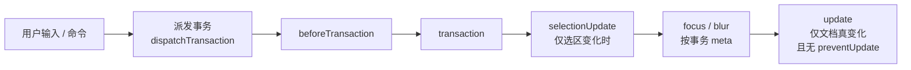

import { Canvas, Meta } from '@storybook/addon-docs/blocks';
import * as EventsStories from './events.stories';

<Meta of={EventsStories} name="Docs" />

# 事件

编辑器里的每一次变化——打字、粘贴、移动光标、执行命令——都是向编辑器派发一个**事务（transaction）**，事件则是事务的广播：每派发一个事务，编辑器按固定顺序发出一串事件，先宣布「事务要应用了」，再宣布「事务已生效」，最后才轮到 `update`。把编辑器接入外部世界——保存文档、刷新字数统计、同步工具栏状态——都从监听这些事件出发。每个回调收到的载荷里都带着触发它的 `transaction`，而载荷中的 `editor` 一律指向**最新**状态，旧文档要从 `transaction.before` 读。

看完开场图和参考表，你应该能预测：只按方向键移动光标时 `update` 不会发出；`setContent(emitUpdate: false)` 之后，本页第三个实例里「文档实际变化」与「update 次数」两个读数会开始分岔。



| 事件 | 触发时机 | 载荷关键字段 | 回查要点 |
| --- | --- | --- | --- |
| `beforeCreate` | 构造函数内同步发出 | `editor` | 只能经 options 注册，`on()` 注册收不到 |
| `mount` | 视图挂载到 DOM 后（同步） | `editor` | 传入 `element` 时构造期间即发出 |
| `create` | 挂载后异步发出（`setTimeout 0`） | `editor` | `isInitialized` 此后才为 `true`；`autofocus` 也在这一拍执行 |
| `unmount` | 视图从 DOM 移除后 | `editor` | 销毁时先 `destroy` 后 `unmount` |
| `destroy` | 调用 `destroy()` 时发出 | 无载荷 | 随后视图卸载、全部监听被移除 |
| `beforeTransaction` | 事务应用前 | `editor` `transaction` `nextState` | 此时 `editor.state` 仍是旧状态；无 options 形态 |
| `transaction` | 事务应用后，每次派发都发 | `editor` `transaction` `appendedTransactions` | 最频繁；被静默的更新也发 |
| `selectionUpdate` | 选区变化时 | `editor` `transaction` | 光标移动、单击都会触发，文档可能没变 |
| `focus` / `blur` | 编辑区获得 / 失去焦点 | `editor` `event` `transaction` | `event` 是原生 `FocusEvent` |
| `update` | 文档真正变化后 | `editor` `transaction` `appendedTransactions` | 唯一的「内容变了」信号；持久化挂这里 |
| `paste` / `drop` | 粘贴 / 拖入内容时 | `editor` `event` `slice`（`drop` 多一个 `moved`） | options 形态是 `(event, slice)` 平铺参数 |
| `delete` | 整个节点或标记被删除时 | `editor` `transaction` `type` `partial` 等 | 默认异步发出；普通删字不触发 |
| `contentError` | 非法内容被检查出来时 | `editor` `error` | 见[内容与文档模型课](?path=/docs/content-model--docs) |

## 接收事件

两种注册方式，选择取决于时机与形式：构造 options 适合「跟着实例走」的固定监听，也是生命周期早期事件的唯一入口；`editor.on()` 适合运行期动态增删，配套 `once`（只触发一次）与 `off`（移除）。

```ts
import { Editor } from '@tiptap/core';

// 方式一：构造 options——生命周期早期事件只能在这里接
const editor = new Editor({
  element: document.querySelector('#app') as HTMLElement,
  extensions,
  content: '<p>初始内容</p>',
  onUpdate({ editor }) {
    save(editor.getJSON()); // 文档变化时执行
  },
});

// 方式二：实例监听——on / once / off
const saveHandler = ({ editor }: { editor: Editor }) => save(editor.getJSON());
editor.on('update', saveHandler);
editor.once('create', () => editor.commands.focus('end'));
editor.off('update', saveHandler);
```

时序上有三条规则：

- **`beforeCreate` 在构造函数内同步发出**，`new Editor()` 返回之前就结束了。事后 `editor.on('beforeCreate', …)` 必然错过，想在文档创建前调整 options（比如按条件增删 `extensions`），只能走 `onBeforeCreate`。
- **`create` 在挂载后的下一个宏任务才发出**（`setTimeout 0`），`autofocus` 的聚焦也发生在这一拍。所以在 `new Editor()` 之后注册 `editor.on('create')` 仍来得及；`isInitialized` 在此之后才为 `true`。
- **构造函数返回时状态已就绪。** schema、初始文档、视图都在构造期间同步建立，立刻读 `editor.state`、调用命令都是安全的，不必等 `create`——它只是「一切就绪」的通知，不是状态可用的前提。

在 React / Vue 中通常改用框架提供的 options 形式与生命周期挂钩，见[React 集成课](?path=/docs/react--docs)与[Vue 集成课](?path=/docs/vue--docs)。

## 事件家族

按触发次数分三类：**生命周期事件**在编辑器一生中只发一两次，围绕创建、挂载与销毁；**事务驱动事件**随每次事务派发按固定顺序成串发出，是日常监听的主战场；**输入事件**贴着用户的粘贴、拖放与删除动作。下面的观测台实例把三类事件都记录在案，可以逐条验证本节结论。

<Canvas of={EventsStories.Observatory} />

| 读者操作 | 可观察证据 |
| --- | --- |
| 打开实例 | 顶部已有 `beforeCreate` → `mount` → `create` 三行——前两个同步、`create` 晚一拍 |
| 在编辑区打字 | 每次按键依次出现 `beforeTransaction` → `transaction` → `selectionUpdate` → `update` 四行 |
| 只按方向键移动光标 | 出现 `selectionUpdate`，`update` 不出现——文档没变 |
| 点击实例外空白处再点回编辑区 | `blur` 与 `focus` 各一行 |
| 粘贴一段文字 | 多出 `paste` 一行，随后是同样的四连 |
| 打开 Show code | 看到该 Canvas 实际执行的 `event-observatory.ts` |

### 生命周期事件

围绕创建与销毁两个时刻：

- **创建期按 `beforeCreate` → `mount` → `create` 的顺序发出。** `beforeCreate` 是最后的调整机会，此时文档尚未创建；`mount` 表示视图已挂载到 DOM；`create` 表示初始化完成，适合做聚焦、拉取远端数据等收尾工作。
- **销毁期先 `destroy` 后 `unmount`。** `destroy()` 被调用时同步发出 `destroy` 事件（无载荷），随后视图卸载发出 `unmount`，最后 `removeAllListeners()` 清空全部监听——不要指望在 `destroy` 回调里再收到别的事件。
- **挂载与卸载可分离。** v3 提供 `editor.mount(element)` 与 `editor.unmount()`，用于移动挂载点或暂离 DOM；`unmount` 后编辑器状态仍在，可以再次挂载。

```ts
new Editor({
  extensions,
  onBeforeCreate({ editor }) {
    // 最后的调整机会：文档尚未创建
  },
  onCreate({ editor }) {
    // 初始化完成：聚焦、加载远端草稿都在这里做
  },
  onDestroy() {
    // 收尾清理；之后监听会被整体移除
  },
});
```

### 事务驱动事件

一次事务派发按顺序触发五个事件：

1. **beforeTransaction**——事务应用前发出，载荷里的 `nextState` 是即将生效的新状态；此时 `editor.state` 仍是旧状态，需要预读未来状态时用它。
2. **transaction**——事务应用后发出。它是「每次都发」的事件：只要事务被正常应用，无论改没改文档、是否被静默，都会到达。
3. **selectionUpdate**——仅当本次派发使选区变化时发出；只改内容不动光标时不会有它，光标移动而内容不变时只有它。
4. **focus / blur**——事务携带焦点变化 meta 时发出，`event` 是原生 `FocusEvent`，可用于联动外部工具栏或浮层。
5. **update**——压轴，也最挑剔：同时满足「事务没有携带 `preventUpdate` meta」「事务链上有文档变化」「新旧文档不相等」才会发出。

```ts
editor.on('beforeTransaction', ({ editor, nextState }) => {
  // editor.state 还是旧的；新状态在 nextState
});

editor.on('transaction', ({ transaction, appendedTransactions }) => {
  // 每次派发都到；高频，别在这里做重活
});

editor.on('update', ({ editor, transaction }) => {
  save(editor.getJSON()); // 文档确实变了
});
```

`appendedTransactions` 是插件通过 `appendTransaction` 在初始事务之后追加的事务——一个用户动作引发的整批变化都装在载荷里；插件机制本身属于[Decorations 与插件课](?path=/docs/decorations-plugins--docs)。

### 输入事件

- **paste / drop** 在用户向编辑器粘贴或拖入内容时发出，`slice` 是即将插入的 ProseMirror 内容切片，可以趁机做检查或改写；`drop` 的 `moved` 区分「拖动移动」与「拖动复制」。注意 options 形态的参数是平铺的——`onPaste(event, slice)`、`onDrop(event, slice, moved)`，而 `editor.on('paste')` 收到的是载荷对象，两种写法不要混记。
- **delete** 由核心的 delete 扩展在文档变化后分析得出：整个节点被删除（如整段、图片）或标记被整体移除时发出，载荷区分 `type: 'node' | 'mark'` 并给出删除前后位置；默认在 `setTimeout 0` 中异步发出（可用 `coreExtensionOptions.delete.async` 关闭）。普通删几个字不会触发它。

## 从回调参数读取状态

所有载荷都以 `editor` 开头，而事件发出时事务已经应用完毕——所以在任何回调里读 `editor.state`、`editor.getJSON()` 拿到的都是**最新**状态。这是本课最重要的约定：回调参数不是「变化前的快照」。需要旧状态时，从 `transaction.before`（事务应用前的文档）读；`transaction.doc` 则与 `editor.state.doc` 一致，是事务后的文档。

| 想读什么 | 从哪读 |
| --- | --- |
| 最新文档 | `editor.getJSON()` / `editor.state.doc`（回调里永远是新的） |
| 本次变化前的文档 | `transaction.before` |
| 是否改了文档 / 选区 | `transaction.docChanged` / `transaction.selectionSet` |
| 变化的具体步骤与位置 | `transaction.steps` / `transaction.mapping` |
| 本次事务的自定义标记 | `transaction.getMeta(key)` |

实例把「更新前字数」与「更新后字数」并排放在一起：前者读自 `transaction.before`，后者读自 `editor.state`——同一个回调里的两种读法分别拿到旧状态与新状态；下方的模拟保存面板则是 `update` 回调里读最新状态写存储的标准形态。

<Canvas of={EventsStories.ReadLatestState} />

| 读者操作 | 可观察证据 |
| --- | --- |
| 在编辑区打字 | 「更新前字数」是改动前的值、「更新后字数」是改动后的值，随每次 update 同步刷新 |
| 全选并删除所有文字 | 「更新前字数」明显大于「更新后字数」；保存面板 isEmpty 变为 true |
| 回车另起一段 | 「段落数」加一，保存面板的 JSON 快照多一个 paragraph 节点 |
| 打开 Show code | 看到该 Canvas 实际执行的 `read-latest-state.ts` |

```ts
editor.on('update', ({ editor, transaction }) => {
  // editor 已是新状态；transaction.before 是本次变化前的文档
  const before = transaction.before.textContent.length;
  const after = editor.state.doc.textContent.length;

  localStorage.setItem('doc', JSON.stringify(editor.getJSON()));
  console.log(`字数 ${before} → ${after}`);
});
```

## 静默更新与事务标记

`update` 的开关是事务上的 `preventUpdate` meta。核心命令层不需要手工设置：`setContent` 与 `clearContent` 提供 `emitUpdate` 选项（默认 `true`），传 `false` 就是在事务上打上 `preventUpdate` 标记。`setEditable` 则相反——它默认 `emitUpdate = true`，即使文档一个字没变也会直接补发一次 `update`。需要自定义标记时用 `setMeta` 命令：它把任意键值写进当前事务；同一条 `chain()` 上的所有命令共享这个事务，回调里用 `getMeta` 就能读出来。

```ts
// 静默整体替换：文档变了，update 不发（transaction 照发）
editor.commands.setContent(remoteJson, { emitUpdate: false });
editor.commands.clearContent({ emitUpdate: false });

// 默认会发 update：setEditable 即使文档没变也补发一次
editor.commands.setContent('<h1>新文档</h1>'); // 发出 update
editor.setEditable(false, false); // 第二个参数 emitUpdate 默认 true，传 false 静默

// 自定义事务标记：同一 chain 共享一个事务
editor.chain().setMeta('imported', true).insertContent(html).run();

editor.on('update', ({ transaction }) => {
  if (transaction.getMeta('imported')) return; // 跳过外部导入引发的变化
});
```

实例把三条路放进同一个日志：默认替换、静默替换、setMeta 标记导入。读数里「文档实际变化」按前后 JSON 是否不同统计，「update 次数」按事件计数——静默替换一次，两者立即分岔。

<Canvas of={EventsStories.TransactionMeta} />

| 读者操作 | 可观察证据 |
| --- | --- |
| 点「setContent 预设 A」 | 日志出现 `transaction`（meta 无）与 `update`，「文档实际变化」与「update 次数」同步加一 |
| 点「预设 B（emitUpdate: false）」 | 文档变了、`transaction` 显示 doc ✓ 与 meta preventUpdate=true，但 `update` 不出现，update 次数不动 |
| 点「setMeta 标记导入」 | update 行与「最近 meta」读数显示 imported 标记 |
| 连续点两次预设 B | 第二次文档未变：两个计数都不加一——「新旧文档不相等」也是 update 的条件 |
| 打开 Show code | 看到该 Canvas 实际执行的 `transaction-meta.ts` |

## 最佳实践

- **持久化挂 update，并做防抖。** `update` 是唯一的「内容变了」信号；连续打字会高频触发，写存储前加 200–500ms 防抖，并确认防抖实现带 trailing 执行，最后一次变化不会被吞掉。
- **按问题选事件，不要都挂 update。** 内容变化用 `update`；光标相关 UI（工具栏激活态、光标位置读数）用 `selectionUpdate`；两者都要、需要读 meta、或要兜住被静默的变更，用 `transaction` 并自行判断 `docChanged`。
- **transaction 回调保持轻。** 它随每次派发发出——打字、移动光标、程序化命令都算——重活放到 `update` 或防抖队列里。
- **外部导入用 meta 区分来源。** `setMeta` 打标加回调里 `getMeta` 过滤，比维护一个独立布尔变量可靠：meta 与触发它的事务同生共死，不会出现「标记还挂着、事务已经过去」的错位。

## 常见问题

- 文档确实变了，update 却没触发
  先查这次变更的来源：`setContent` / `clearContent` 是否传了 `emitUpdate: false`，代码里是否有 `setMeta('preventUpdate', true)`。需要「任何文档变化都收到」时改监听 `transaction` 并判断 `docChanged`；程序化静默写入后，主动调一次保存逻辑也是常见做法。
- 切换 editable 后冒出一次 update，文档明明没变
  `setEditable(editable)` 的第二参数默认 `true`，切换后会直接补发一次 `update`。不需要就传 `setEditable(editable, false)`；在 update 回调里做保存时，注意别把这次「伪更新」当成用户输入。
- editor.on('beforeCreate', fn) 注册了却收不到
  `beforeCreate` 在构造函数内同步发出，`new Editor()` 返回后注册必然错过。改在 options 里传 `onBeforeCreate`；想在文档创建前调整选项，也只能走这条通道。
- 删了字却收不到 delete 事件
  `delete` 不是「每次删除都发」：它只在整个节点（如整段、图片）或整个标记被删除时由核心 delete 扩展发出，且默认异步。普通打字删除走的是 `update`；需要细粒度的删除信息时，对比 `transaction.before` 与最新文档。

## 总结回顾

摘要：

编辑器把每一次变化都当作事务来派发，事件则是事务的广播。生命周期事件（创建期 `beforeCreate` → `mount` → `create`，销毁期 `destroy` → `unmount`）只发一两次；事务驱动事件随每次派发按固定顺序成串发出——`beforeTransaction` → `transaction` → `selectionUpdate` → `focus/blur` → `update`，其中 `update` 要求文档真变化且没有 `preventUpdate` meta；输入事件 `paste`、`drop`、`delete` 贴着用户操作，`delete` 默认异步且只在整节点或整标记被删时发出。事件观测台实例演示了这串顺序：打字四连、方向键只有 `selectionUpdate`、失焦聚焦各一行。所有回调载荷里的 `editor` 都指向最新状态，旧文档从 `transaction.before` 读——读取最新状态实例并排呈现了同一回调里的新旧两份字数，模拟保存面板演示了持久化的标准形态。`update` 的开关是事务上的 `preventUpdate` meta，`setContent` 的 `emitUpdate: false` 与 `setEditable` 默认补发的那次更新都由它解释；`setMeta` 命令往事务里写自定义标记，供回调里 `getMeta` 过滤——静默更新与事务标记实例用「文档实际变化」与「update 次数」两个读数的分岔验证了这套机制。

一句话：

> 每次变化都是一次事务、一串事件；回调里的 editor 永远指向最新状态，update 只在文档真变了且没被 preventUpdate 拦下时发出。

知识要点：

- 事件有哪些注册方式？`beforeCreate` 与 `create` 的发出时机各是什么，为什么前者只能经 options 注册？
- 一次事务派发按什么顺序触发哪些事件？`update` 不发出的三个条件是什么？
- 回调里怎么读最新文档、怎么读变化前的文档？`docChanged` 与 `selectionSet` 各判断什么？
- `setContent` / `clearContent` / `setEditable` 各自的 `emitUpdate` 行为与默认值是什么？
- `setMeta` 命令怎么用？回调里怎么读回标记，典型过滤场景是什么？
- `paste` / `drop` / `delete` 的触发条件与载荷有什么特点？

## 参考资料

- [Events | Tiptap Editor Docs](https://tiptap.dev/docs/editor/api/events)
- [Editor 类 API（on / once / off / setEditable / isInitialized）| Tiptap Editor Docs](https://tiptap.dev/docs/editor/api/editor)
- [setMeta command | Tiptap Editor Docs](https://tiptap.dev/docs/editor/api/commands/set-meta)
- [setContent command | Tiptap Editor Docs](https://tiptap.dev/docs/editor/api/commands/content/set-content)
- [ProseMirror Transaction（before / docChanged / getMeta）| prosemirror.net](https://prosemirror.net/docs/ref/#state.Transaction)
