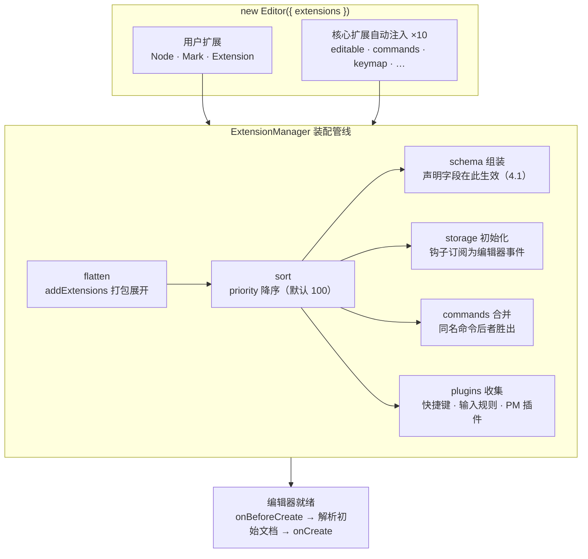
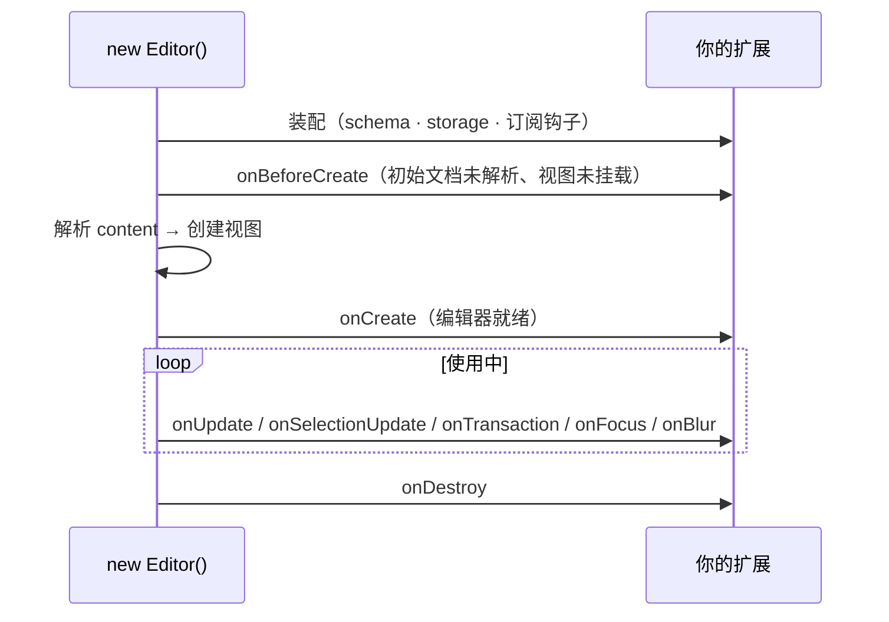

import { Canvas, Controls, Meta } from '@storybook/addon-docs/blocks';
import * as ExtensionSystemStories from './extension-system.stories';

<Meta of={ExtensionSystemStories} name="Docs" />

# Extension 体系

Tiptap 编辑器的每一分能力——内容类型、命令、快捷键、输入规则、粘贴规则、事件响应——都由扩展提供。所有扩展共享同一副骨架：用 `Extension.create` / `Node.create` / `Mark.create` 传入一份配置对象，得到一个扩展实例；创建编辑器时，`ExtensionManager` 把 `extensions` 数组装配成 schema、命令表、插件列表和事件订阅。所以读任何一个扩展，先认出它属于哪一类、声明了哪些组成要素，行为就能预测。

本课回答五个问题：三类扩展怎么区分、`extensions` 数组按什么顺序装配、options 如何被 configure 覆盖、storage 怎样保存每实例状态、如何用 extend 在现有扩展上加工。schema 声明字段（parseHTML / renderHTML / addAttributes）见[Schema、节点与标记课](?path=/docs/schema-nodes-marks--docs)，命令注册与类型补全的完整闭环见[自定义 Node 与 Mark 课](?path=/docs/custom-node-mark--docs)，快捷键与输入规则的用法见[快捷键与输入规则课](?path=/docs/keyboard-input-rules--docs)。看完开场图你应该能预测：把 alpha 的 priority 调到 1000 后它会装配到最前，但同名命令仍由数组靠后的 beta 响应。



三类扩展一览：

| | Extension | Node | Mark |
| --- | --- | --- | --- |
| `type` | `'extension'` | `'node'` | `'mark'` |
| 创建入口 | `Extension.create` | `Node.create` | `Mark.create` |
| 进 schema | 不声明内容类型（可用 `addGlobalAttributes` 给别的类型补属性） | 声明一种节点类型 | 声明一种标记类型 |
| 职责 | 行为与机制 | 文档结构 | 文本注记 |
| 内置例子 | placeholder、character-count、text-align | paragraph、heading、table | bold、link、highlight |

## 三类扩展

判断入口只有一句话：**要往文档里存一种新内容，用 Node 或 Mark；只给编辑器添行为，用 Extension。** Node 与 Mark 的分工（占不占树的一层）在[Schema、节点与标记课](?path=/docs/schema-nodes-marks--docs)讲过；本课关心的是三类扩展共同的构成要素。三份配置接口正是这样叠出来的：`ExtensionConfig` 只含机制字段（本课全部内容），`NodeConfig` 与 `MarkConfig` 在它之上追加各自的 schema 声明字段（4.1 课的内容）。

机制字段按用途分四组，每组都是配置对象上的一个方法或属性：

| 组成要素 | 成员 | 作用 |
| --- | --- | --- |
| 身份 | `name` | 扩展名，全编辑器唯一；命令、storage、全局属性都以它为命名空间 |
| 身份 | `priority` | 装配优先级，数值越大越早参与装配（默认 100，见下一节） |
| 能力 | `addCommands` / `addKeyboardShortcuts` | 注册命令 / 快捷键（用法见 4.4 / 4.3） |
| 能力 | `addInputRules` / `addPasteRules` | Markdown 式输入与粘贴转换（4.3） |
| 能力 | `addProseMirrorPlugins` / `addDecorations` | 底层插件与纯视觉装饰（4.6 / 4.5） |
| 能力 | `addGlobalAttributes` | 给多个节点 / 标记一次性补属性（收存出链路见 4.1） |
| 能力 | `transformPastedHTML` / `addExtensions` / `extendNodeSchema` / `extendMarkSchema` | 改粘贴 HTML / 打包子扩展 / 给 schema 追加自定义字段 |
| 数据 | `addOptions` / `addStorage` | 配置默认值 / 每实例可变状态（本课后两节） |
| 时机 | `onBeforeCreate` … `onDestroy` | 生命周期钩子（本课最后一节） |

这些成员在运行时都通过 `this` 访问，可用成员因方法而异：

| `this` 成员 | 哪里可用 | 含义 |
| --- | --- | --- |
| `this.name` | 全部 | 扩展名 |
| `this.parent` | configure / extend 之后 | 被继承的原实现，配合可选链调用（见 extend 一节） |
| `this.options` | `addStorage` 起的后续方法 | 解析后的配置对象（下一节） |
| `this.storage` | 运行期方法（命令、钩子等） | 本扩展在当前编辑器的私有状态（下下节） |
| `this.editor` | 运行期方法 | 编辑器实例 |
| `this.type` | Node / Mark 的运行期方法 | 该类型在 schema 里的 `NodeType` / `MarkType`（Extension 上为 null） |

一个容易踩的顺序细节：`addOptions` 的 `this` 里只有 `name` 和 `parent`——选项默认值在装配最前面求值，那时还读不到 `editor`，也读不到 `storage`。

## 装配顺序

`new Editor({ extensions })` 到编辑器就绪之间，`ExtensionManager` 按固定管线装配：

1. **注入核心扩展。** 编辑器自动把 10 个核心扩展排进数组最前面：`editable`、`clipboardTextSerializer`、`commands`、`focusEvents`、`keymap`、`tabindex`、`drop`、`paste`、`delete`、`textDirection`。它们不在你写的 `extensions` 数组里，但 `editor.extensionManager.extensions` 里能看到，也能用 `enableCoreExtensions` 按名关闭。
2. **flatten 展开。** 逐个调用扩展的 `addExtensions()`，把打包的子扩展摊平——StarterKit 就是一个 `addExtensions` 大包，内部对每个成员 `configure` 后推入数组，置为 `false` 即可剔除。
3. **sort 排序。** 按 `priority` 降序排列，默认 100；数值相同时保持注册顺序（稳定排序）。发现重名扩展时控制台警告 `Duplicate extension names found`。
4. **组装 schema。** 排好序的 Node / Mark 扩展按 4.1 课的声明字段合并成 ProseMirror `Schema`，`addGlobalAttributes` 也在这里落进各类型的 attrs。
5. **初始化 storage 并订阅钩子。** 逐个扩展调用 `addStorage()` 建立状态表，把 `onBeforeCreate` 等 8 个钩子订阅成编辑器事件（见生命周期一节）。
6. **汇总命令表与插件列表。** 命令按装配顺序合并进 `editor.commands`，同名命令**后者胜出**；插件（快捷键、输入规则、PM 插件）收集时顺序反转再排序——同优先级时后注册者的插件排前面，自定义快捷键因此能覆盖内置快捷键（4.3）。`priority` 还决定各类型在 schema 里的先后，官方文档明确它影响 schema 顺序与插件顺序。

下面的装配线把这些步骤放在一屏：左列是用户扩展的最终装配顺序，右列是自动注入的核心扩展；每切一次预设都重新 `new Editor` 走一遍完整管线。

<Canvas of={ExtensionSystemStories.AssemblyLine} />
<Controls of={ExtensionSystemStories.AssemblyLine} />

| 读者操作 | 可观察证据 |
| --- | --- |
| 保持默认预设 | 装配顺序与注册顺序一致；`signature()` 由数组靠后的 beta 响应 |
| 切换为「交换注册顺序」 | 装配顺序变成 beta 在前，`signature()` 改由 alpha 响应——同名命令以后注册者为准 |
| 切换为「alpha 提到 priority 1000」 | alpha 跳到装配顺序最前，但 `signature()` 仍由 beta 响应——priority 只重排，不改“后者胜出” |
| 看「扩展总数（含核心扩展）」读数 | 用户 6 个 + 核心 10 个 = 16：核心扩展不在数组里也照样参与装配 |
| 打开 Show code | 看到该 Canvas 实际执行的 `assembly-line.ts` |

## options 与 storage

配置与状态是两套机制：**options 回答“使用者配置了什么”，storage 回答“这个编辑器运行到现在是什么状态”。**

### addOptions 与 configure

`addOptions()` 返回默认值对象；使用者用 `.configure()` 覆盖。configure 的关键行为有三条：

- **深合并。** 内部用 `mergeDeep` 把默认值与传入对象逐键合并，只写想改的项，嵌套对象也不用整体重写。
- **返回新实例。** configure 产出一个新的扩展实例（原实例的 `name` 与配置原样保留），所以基础扩展可以当单例共享，变体按需派生：`Highlight.configure({ multicolor: true })` 不会影响别处注册的 `Highlight`（用法见[文本样式扩展课](?path=/docs/text-style-extensions--docs)）。
- **求值时机最早。** `addOptions` 在装配最前面执行，`this` 上拿不到 `editor`；配置对象本身不该在运行期修改——`this.options` 每次读取都是重新求值的结果，把它当可变状态用会静默失效。

给使用者的参数补全靠 TypeScript 接口合并（`ExtensionOptions`），机制与命令的 `Commands` 合并相同，写法见[TypeScript 课](?path=/docs/typescript--docs)。

### addStorage 与 this.storage

`addStorage()` 返回初始状态；编辑器创建时，ExtensionManager 把每个扩展的 storage 按扩展名收进 `editor.extensionStorage`。读写各有正路：

| 路径 | 写法 | 场景 |
| --- | --- | --- |
| 扩展内部 | `this.storage.xxx` | 命令、钩子里读写运行状态 |
| 编辑器外部 | `editor.storage.<extensionName>.xxx` | 页面代码读取，character-count 的统计就是这么暴露的（见[行为扩展课](?path=/docs/behavior-extensions--docs)） |

两条路径指向同一个对象——所以外部读数与内部写入永远一致。storage 属于**编辑器实例**：同一个扩展类注册进两个编辑器，状态互不相通；重建编辑器，storage 从 `addStorage()` 的初始值重新开始。`MyExtension.storage` 这种类上的静态访问只会拿到临时副本，改它不生效（见常见问题）。

下面的实例用同一个 Shout 扩展演示两条机制：切换配置方式观察深合并，插入喊话观察 storage 计数。

<Canvas of={ExtensionSystemStories.OptionsStorage} />
<Controls of={ExtensionSystemStories.OptionsStorage} />

| 读者操作 | 可观察证据 |
| --- | --- |
| 切换为「configure({ prefix })」 | options 读数只有 prefix 变成 `"≫ "`，suffix、uppercase 仍是默认——深合并只覆盖提及的项 |
| 切换为「extend + this.parent 只改 uppercase」 | uppercase 变 true，插入的文字全部大写；prefix、suffix 保持默认 |
| 连点「插入一句喊话」 | `this.storage.applied` 与 `editor.storage.shout.applied` 同步递增——内外两条路径是同一份状态 |
| 点「重建编辑器」 | storage.applied 归零——storage 属于编辑器实例，不属于扩展类 |
| 打开 Show code | 看到该 Canvas 实际执行的 `options-storage.ts` |

## 扩展现有扩展：extend

`configure` 只能改默认值；要动行为——换快捷键、改 schema 声明、补属性、加命令——用 `.extend()`。extend 同样返回新实例，并把原实例记为 `parent`：

- **字段级覆盖。** extend 的配置对象与原配置合并，显式给出的成员覆盖原实现，没写的原样继承。`Blockquote.extend({ content: 'paragraph*' })` 只改 content，其余声明全部保留。
- **`this.parent?.()` 调原实现。** 在被覆盖的成员里可以调用被覆盖前的版本。addOptions 里先取回原默认值再覆盖一项；addAttributes 里展开既有属性再加新的。可选链是官方提醒——原扩展不一定声明过这个成员：

```ts
// 官方示例：覆盖 Heading 的默认 levels，其余选项保持原默认值
const CustomHeading = Heading.extend({
  addOptions() {
    return {
      ...this.parent?.(),
      levels: [1, 2, 3],
    };
  },
});

// 官方示例：给 TableCell 补一个自定义属性，已有属性一个不丢
const CustomTableCell = TableCell.extend({
  addAttributes() {
    return {
      ...this.parent?.(),
      myCustomAttribute: { /* 声明见 4.1 课 */ },
    };
  },
});
```

按需求选入口：

| 需求 | 用什么 |
| --- | --- |
| 只改默认值 | `.configure({ … })` |
| 覆盖任意成员（快捷键、命令、schema 字段、钩子） | `.extend({ … })` |
| 全新的内容类型或机制 | 从零 `create`（完整闭环见[自定义 Node 与 Mark 课](?path=/docs/custom-node-mark--docs)） |

两个边界：`name` 实际上不建议改——它存在文档 JSON 里，改名意味着历史内容全部失配，官方的建议是复制整个扩展再全局改名；`extendNodeSchema` / `extendMarkSchema` 在 schema 组装时为节点 / 标记追加自定义字段，实现里可按传入的扩展筛选作用范围，属于进阶用法，类型声明见[TypeScript 课](?path=/docs/typescript--docs)。

## 生命周期钩子

钩子的本质是事件订阅：装配的第 5 步把扩展声明的 8 个钩子逐一挂到编辑器事件上，效果等同在 `editor.on(...)` 里注册监听（事件对象与参数见[事件课](?path=/docs/events--docs)）。钩子的 `this` 上有 `name`、`options`、`storage`、`editor`，Node / Mark 扩展还有 `type`。



| 钩子 | 触发时机 | 典型用途 |
| --- | --- | --- |
| `onBeforeCreate` | schema 已装配、初始文档未解析、视图未挂载 | 赶在创建前改 `options`（如 content、editorProps） |
| `onCreate` | 视图挂载后（挂载后的宏任务里，构造函数已返回） | 需要真实 state / DOM 的初始化 |
| `onUpdate` | 文档内容变化 | 计数、自动保存 |
| `onSelectionUpdate` | 只有选区变化 | 工具栏高亮联动 |
| `onTransaction` | 任何状态变化（文档或选区） | 统一响应每次状态更新 |
| `onFocus` / `onBlur` | 焦点进入 / 离开 | 菜单显隐 |
| `onDestroy` | `destroy()` 时，事件注销前 | 释放扩展持有的外部资源 |

除了这 8 个，还有一个特殊的 `dispatchTransaction({ transaction, next })`：拦截所有事务的中间件链，按 priority 排序，不调 `next()` 事务就不派发——属于插件层能力，见[Decorations 与插件课](?path=/docs/decorations-plugins--docs)。

下面的实例把 Trace 扩展装进编辑器，8 个钩子全部记入右侧日志；`onBeforeCreate` 还会追加一个段落，让“先于文档解析”变成看得见的结果。

<Canvas of={ExtensionSystemStories.LifecycleHooks} />

| 读者操作 | 可观察证据 |
| --- | --- |
| 看初始文档 | 多出一段「onBeforeCreate 追加的段落」——该钩子执行时初始文档还没解析 |
| 对照日志开头 | 顺序固定为 onBeforeCreate → onCreate；onCreate 触发时视图已挂载 |
| 点进编辑器输入一个字 | 日志依次出现 onUpdate 与 onTransaction——文档变化必然伴随状态变化 |
| 只点动光标不输入 | 只有 onSelectionUpdate 与 onTransaction——选区变化不触发 onUpdate |
| 点「销毁编辑器」 | onDestroy 出现在日志末尾 |
| 点「重建编辑器」 | 新一轮 onBeforeCreate → onCreate，日志从零开始 |
| 打开 Show code | 看到该 Canvas 实际执行的 `lifecycle-hooks.ts` |

## 最佳实践

- **定制走三级：configure → extend → 从零写。** 只改默认值用 `configure`；要动行为（快捷键、命令、解析输出、schema 字段）用 `extend`；只有编辑器里全新的内容类型才值得从零写（4.4 课的完整闭环）。
- **把扩展当不可变单例。** configure / extend 都返回新实例、不动原对象——放心导出一个基础实例到处复用，变体按需派生；反过来，一个变体只注册一次，别把原扩展和变体同时放进数组。
- **options 配置、storage 状态。** 创建后不该变的数据放 options，运行期会变的数据放 storage；不要在 `this.options` 上累积状态（每次读取都是重新求值），也不要绕过扩展直接改 `editor.storage`。
- **priority 不到必要时不用。** 默认 100 覆盖绝大多数场景；确有规则或快捷键竞争再调，并用装配线这类读数核对结果，不要凭感觉叠优先级。
- **钩子按信号选，不按习惯选。** 只关心内容变化用 `onUpdate`；工具栏联动这类“每次状态变化都要跑”的逻辑用 `onTransaction`；需要 DOM 的初始化放 `onCreate`，赶在创建前的配置放 `onBeforeCreate`。

## 常见问题

- 控制台警告 `Duplicate extension names found: ['bold']`
  同名扩展被注册了两次——常见于 `Bold.configure({ ... })` 之后又把原 `Bold` 一并放进数组，或 extend 出的变体与原扩展同时注册。处理：同一个名字只保留一个实例；确实需要两种不同行为就复制扩展源码并全局改名（含历史 JSON 内容的迁移）。重名不报错、只有警告：同名类型在 schema 与命令表里都以后注册者为准，行为难以预测，按警告定位并去掉多余实例。
- `MyExtension.storage.count += 1` 从扩展类上直接改不生效
  `MyExtension.storage` 每次访问都会重新执行 `addStorage()` 并返回浅拷贝，改的是临时对象。可变状态只有两条正路：扩展内部 `this.storage`，编辑器外部 `editor.storage.<extensionName>`。
- 钩子里读 `editor.state` 或 `editor.view` 拿到 undefined
  这发生在 `onBeforeCreate`：它触发时初始文档还没解析、视图还没挂载。需要 state 或 DOM 的初始化挪到 `onCreate`；`onBeforeCreate` 只适合改 `options` 这类“赶在创建前”的事。
- 只点了一下光标，`onUpdate` 没触发
  这是正常行为：`onUpdate` 只在文档内容变化时触发，纯选区变化走 `onSelectionUpdate`，两者都会伴随 `onTransaction`。要“任何变化都响应”就监听 `onTransaction`。
- extend 的钩子里调用 `this.parent()` 抛 not a function
  `this.parent` 指向被覆盖的原实现，但原扩展不一定声明过这个成员。官方写法是可选链 `this.parent?.()`，在 `addOptions` / `addAttributes` 里配合展开使用（见 extend 一节的示例）。

## 总结回顾

摘要：

Tiptap 的一切能力都来自扩展。三类扩展共享同一副骨架：`Extension` / `Node` / `Mark` 用 `create(config)` 产出实例，配置接口逐层叠加——Extension 只有机制字段，Node 与 Mark 再追加 schema 声明（4.1）；机制字段覆盖身份（name、priority）、能力（命令、快捷键、输入与粘贴规则、插件、全局属性、打包）、数据（options、storage）与时机（8 个生命周期钩子）。创建编辑器时 ExtensionManager 按管线装配：注入 10 个核心扩展，flatten 展开 `addExtensions` 打包，按 priority 降序稳定排序（默认 100，重名警告），组装 schema，初始化 storage 并把钩子订阅成编辑器事件，最后按装配顺序合并命令表（同名后者胜出）并收集插件（同优先级时后注册者在前）。configure 深合并默认值、extend 字段级覆盖并可经 `this.parent?.()` 调原实现，两者都返回新实例、不动原对象；options 是装配时定死的配置，storage 是每编辑器实例一份的可变状态，内部 `this.storage` 与外部 `editor.storage.<name>` 指向同一对象。装配线实例展示了顺序与命令合并，配置与状态实例验证了深合并与实例隔离，生命周期实例用日志和一段“提前追加”的段落还原了从 onBeforeCreate 到 onDestroy 的完整时序。

一句话：

> 扩展用一份 config 声明能力，ExtensionManager 按 priority 装配出编辑器的一切——configure 改配置、storage 存状态、extend 在旧扩展上长出新行为。

知识要点：

- 三类扩展的判断入口是什么？`type` 值与典型成员各是什么？
- `extensions` 数组经历哪几步装配？priority 的默认值是多少？同名命令谁胜出？
- 核心扩展从哪来？`addExtensions` 与 StarterKit 的关系是什么？
- configure 与 extend 各自返回什么？为什么基础扩展可以当单例共享？
- options 与 storage 的分工是什么？内部与外部各通过什么路径访问 storage？为什么重建编辑器后 storage 会归零？
- extend 里 `this.parent?.()` 的作用是什么？哪些场景必须保留原默认值？
- 8 个生命周期钩子分别何时触发？`onBeforeCreate` 与 `onCreate` 的能力差异是什么？`onUpdate`、`onSelectionUpdate`、`onTransaction` 如何取舍？

## 参考资料

- [Extensions | Tiptap Editor Docs](https://tiptap.dev/docs/editor/core-concepts/extensions)
- [Extend an existing extension | Tiptap Editor Docs](https://tiptap.dev/docs/editor/extensions/custom-extensions/extend-existing)
- [Extension API | Tiptap Editor Docs](https://tiptap.dev/docs/editor/extensions/custom-extensions/create-new/extension)
- [Tiptap 仓库（ueberdosis/tiptap）](https://github.com/ueberdosis/tiptap)
  装配管线、configure / extend / storage 的行为均对照 `@tiptap/core` 3.31.4 的 `ExtensionManager` 与 `Extendable` 源码核实。
