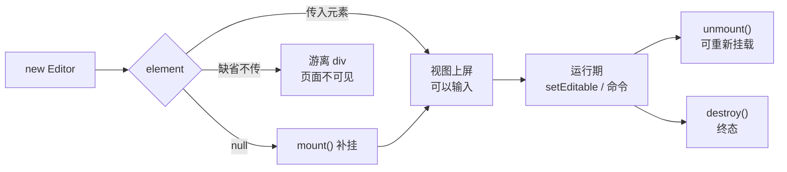

import { Canvas, Controls, Meta } from '@storybook/addon-docs/blocks';
import * as FirstEditorStories from './first-editor.stories';

<Meta of={FirstEditorStories} name="Docs" />

# 第一个编辑器

本课把一个真正能输入的 Tiptap 编辑器跑起来，并看清它完整的一生：`new Editor(options)` 创建实例，`element` 决定挂到哪，`content` 经 schema 解析成初始文档，`setEditable()` 随时切换读写，`destroy()` 收尾清理。看完开场图和参考表，你应该能预测：不传 `element` 时编辑器去了哪里、切换 `editable` 时 DOM 上会变什么、`destroy()` 之后挂载元素里还剩什么。

Tiptap 是 headless 编辑器：实例本身不带外观与工具栏，所有可见 DOM 都由实例写进你提供的挂载元素，样式与菜单由你自己接（见 1.5 样式与 3.4 菜单）。



| 构造输入 | 默认值 | 回查要点 |
| --- | --- | --- |
| `element` | 缺省时自建游离 div | 决定编辑器出现在哪；显式传 `null` 时用 `mount()` 补挂 |
| `extensions` | `[]` | 必须传入扩展列表，否则几乎没有可用内容；本课用 `StarterKit` |
| `content` | `''` | HTML 字符串或 JSON 文档，只在创建时解析一次 |
| `editable` | `true` | 运行期用 `setEditable()` 切换 |

## 快速上手

最小闭环：装三个包 → 放一个挂载元素 → 四行代码创建实例 → 页面出现可输入的段落。

1. 安装依赖。本工作区的 Storybook 已安装 @tiptap 运行时依赖（`@tiptap/core`、`@tiptap/pm`、`@tiptap/starter-kit` 等全套在 devDependencies 里），本课范例可直接在页面里运行；在你自己的项目里安装这三个包即可。本页交互实例用原生 DOM 复现同样的生命周期（真实 Tiptap 代码以各代码块为准），两者对照阅读。

   ```bash
   npm install @tiptap/core @tiptap/pm @tiptap/starter-kit
   ```

   三个包各管一层：`@tiptap/core` 是编辑器主 API，`@tiptap/pm` 是底层引擎 ProseMirror，`@tiptap/starter-kit` 是常用扩展合集。

2. 页面里放一个挂载元素：

   ```html
   <div class="element"></div>
   ```

3. 创建编辑器：

   ```ts
   import { Editor } from '@tiptap/core';
   import StarterKit from '@tiptap/starter-kit';

   new Editor({
     element: document.querySelector<HTMLDivElement>('.element'),
     extensions: [StarterKit],
     content: '<p>Hello World!</p>',
   });
   ```

4. 运行验证：页面出现 "Hello World!" 段落，光标点进去就能输入。检查 DOM，挂载元素里多了一个 `<div class="tiptap ProseMirror" contenteditable="true" tabindex="0">`。没有构建工具时也可以用 CDN 加 `<script type="module">` 直接运行，写法见参考资料。

## 创建与挂载

`element` 是唯一决定编辑器出现在哪里的输入：构造函数在它内部创建 ProseMirror 视图。不传或显式传 `null` 时不占页面，但实例照常存在、命令照常可执行。

下面的实例用原生 DOM 复现 Tiptap 生命周期各步骤的可观察结果（并非调用真实编辑器，真实代码以快速上手和各小节代码块为准）。

<Canvas of={FirstEditorStories.Mount} />
<Controls of={FirstEditorStories.Mount} />

| 读者操作 | 可观察证据 |
| --- | --- |
| 切换「element 取值」为传入元素 | 左侧挂载元素内出现 `tiptap ProseMirror` 视图，读数「视图位置」变为已上屏 |
| 切换为 `element: null + mount()` | 先创建实例再补挂，结果与传入元素相同 |
| 切换为缺省（不传） | 左框保持为空，读数显示视图在游离 div 中，页面上不可见 |
| 打开 Show code | 看到该 Canvas 实际执行的 `mount-element.ts` |

### element 的三种取值

```ts
// 常规：元素已在页面里，构造时立即挂载
new Editor({
  element: document.querySelector<HTMLDivElement>('.element'),
  extensions: [StarterKit],
});

// 元素还没进 DOM（异步渲染、弹窗）：先创建实例，再补挂
const editor = new Editor({ element: null, extensions: [StarterKit] });
editor.mount(document.querySelector<HTMLDivElement>('.element'));

// 缺省：实例挂进构造函数自建的游离 div，页面不可见（新手最常见）
const orphan = new Editor({ extensions: [StarterKit] });
```

前两种在页面上等价；第三种是「实例创建成功却看不到」的根源，排查见常见问题。

### 挂载后的 DOM

Tiptap 往 `element` 里写入一个视图 div：`tiptap` 类由 Tiptap 加上，`ProseMirror` 类来自底层引擎，样式定制围绕它们展开（见 1.5 样式）。

```html
<div class="element">
  <div class="tiptap ProseMirror" contenteditable="true" tabindex="0">
    <p>Hello World!</p>
  </div>
</div>
```

`contenteditable` 跟随 `editable` 状态；`tabindex="0"` 默认只加在可编辑视图上，让编辑器能被聚焦，配置入口见 1.4 配置。

## 初始内容

`content` 接受 HTML 字符串或 JSON 文档，构造时经 schema 解析成初始文档，两种写法可以表达同一份内容。本页实例的 schema 只有 `document > paragraph > text` 三个成员，与官方 minimal setup 一致。

<Canvas of={FirstEditorStories.Content} />
<Controls of={FirstEditorStories.Content} />

| 读者操作 | 可观察证据 |
| --- | --- |
| 切换「content 预设」为 HTML 字符串或 JSON 文档 | 两者渲染出相同的两段文字 |
| 切换为含未注册标签 | 只剩 `<p>` 段落，读数显示 img、aside 被丢弃 |
| 打开 Show code | 看到该 Canvas 实际执行的 `initial-content.ts` |

### HTML 字符串与 JSON 文档

```ts
new Editor({
  extensions: [StarterKit],
  content: '<p>你好</p>', // HTML 字符串
});

new Editor({
  extensions: [StarterKit],
  content: {
    type: 'doc', // JSON 文档（ProseMirror 文档树）
    content: [
      { type: 'paragraph', content: [{ type: 'text', text: '你好' }] },
    ],
  },
});
```

HTML 直观，适合写死在代码里的初始文案；JSON 结构稳定，适合来自数据库或接口的数据。两种格式的输入输出细节见 2.1 内容与文档模型。

### 解析规则

- 解析只发生在创建时。运行期更新内容要用 `setContent` 命令（见 2.2 命令），修改构造参数不会影响已创建的实例。
- 解析按 schema 进行：schema 没有的节点或标记会被直接丢弃，比如没注册图片扩展时 `content` 里的 `` 会消失。schema 由 `extensions` 决定，原理见 4.1 Schema、节点与标记。
- `editor.isEmpty` 可以判断初始内容是不是空文档。

## 可编辑状态

`editable` 决定用户能否输入：构造时用选项定初值，运行期用 `setEditable()` 随时切换。它只约束用户输入，不拦截命令调用——只读展示的场景照样能用 `setContent` 等命令改文档（见 2.2 命令）。

<Canvas of={FirstEditorStories.Editable} />
<Controls of={FirstEditorStories.Editable} />

| 读者操作 | 可观察证据 |
| --- | --- |
| 保持「editable」开启，在编辑区打字 | 内容实时变化 |
| 关闭「editable」后再打字 | 无法输入；读数 contenteditable 变为 "false"，tabindex 消失 |
| 打开 Show code | 看到该 Canvas 实际执行的 `editable-toggle.ts` |

### setEditable 与 isEditable

```ts
const editor = new Editor({ editable: false, extensions: [StarterKit] }); // 构造时只读

editor.setEditable(true); // 切回可编辑；第二参数 emitUpdate 默认 true
editor.setEditable(false, false); // 不触发 update 事件的切换
editor.isEditable; // 读取当前状态
```

`emitUpdate` 决定切换要不要触发 `update` 事件，v3 默认为 true；事件监听见 2.4 事件。

### 切换时的 DOM 变化

- `contenteditable` 在 `"true"` 与 `"false"` 之间切换；
- 可编辑时视图带 `tabindex="0"`，只读时该属性被移除；
- 已输入的内容不受切换影响。

## 销毁与清理

编辑器实例不会自动回收。离开页面、关闭弹窗、热更新重建之前，都要调用 `editor.destroy()`，否则视图 DOM、事件监听和挂载元素上的反向引用会一直留在内存里。

<Canvas of={FirstEditorStories.Teardown} />
<Controls of={FirstEditorStories.Teardown} />

| 读者操作 | 可观察证据 |
| --- | --- |
| 选择 `unmount()`，再开启「mount() 重新挂载」 | 挂载元素先变空，重新挂载后两段内容原样恢复 |
| 选择 `destroy()`，再尝试重新挂载 | 挂载元素为空，读数 isDestroyed 为 true，重新挂载无效 |
| 打开 Show code | 看到该 Canvas 实际执行的 `teardown-editor.ts` |

### destroy() 做了什么

`destroy()` 是终态。调用后：视图 DOM 从挂载元素移除；实例上注册的事件监听全部解绑，并发出最后的 `destroy` 事件；挂载元素上指向实例的反向引用被删除，避免循环引用造成内存泄漏；扩展管理器、schema 等内部对象一并弃用；`injectCSS`（默认 true）注入的样式会在页面最后一个编辑器销毁时移除。

```ts
editor.destroy();
editor.isDestroyed; // true
```

销毁后不要再调用实例方法：持有实例的地方在销毁后置空引用，调用前用 `isDestroyed` 判断。要继续编辑，用同样的选项 `new Editor` 重建。

### unmount 还是 destroy

`unmount()` 只把视图从元素上摘下来，文档状态保留在实例上，之后 `mount()` 可以换一个元素挂回去；`destroy()` 连实例一起终结。临时摘下、搬家用 `unmount()`；页面卸载、彻底弃用用 `destroy()`。React 与 Vue 集成会随组件卸载自动销毁，见 6.1 React 集成与 6.2 Vue 集成。

| | `unmount()` | `destroy()` |
| --- | --- | --- |
| 视图 DOM | 从挂载元素移除 | 从挂载元素移除 |
| 文档状态 | 保留，可重新挂载 | 弃用 |
| 实例 | 仍可用，可换宿主 | 终态，`isDestroyed` 为 true |
| 适用 | 临时摘下、搬家 | 页面卸载、彻底弃用 |

## 常见问题

- 页面上看不到编辑器，实例却创建成功了
  先确认 `element` 真的拿到了节点：脚本先于 DOM 执行时 `querySelector` 返回 null，编辑器会挂进游离 div。把初始化放到 `defer` 脚本或 body 末尾的模块脚本里，或用 `element: null` 加 `mount()` 补挂。注意 `element` 只接受元素本身，不接受选择器字符串。
- destroy() 之后调用实例方法报错或无响应
  销毁是终态。销毁后置空实例引用，调用前用 `editor.isDestroyed` 防御；需要继续编辑时用相同选项 `new Editor` 重建，不要复用已销毁的实例。

## 总结回顾

摘要：

一个 Tiptap 编辑器 = 一个 `Editor` 实例加一个挂载元素。构造时传入 `extensions` 决定 schema 与行为、`element` 决定视图挂在哪（缺省时挂进游离 div，`null` 时等 `mount()` 补挂）、`content` 经 schema 解析成初始文档且只在创建时解析一次、`editable` 定下初始读写状态。运行期用 `setEditable()` 切换读写，DOM 上的 `contenteditable` 与 `tabindex` 随之变化；临时摘下视图用 `unmount()`，文档状态可恢复；彻底弃用用 `destroy()`，它归还视图 DOM、解绑监听、清掉反向引用，是唯一终态。外观与工具栏不在实例里——headless 的部分由你在挂载元素之外自己接。

一句话：

> `element` 决定编辑器挂在哪里，`content` 只在创建时解析一次，`setEditable()` 随时切换读写，`destroy()` 是唯一终态——实例的生命周期由你负责。

知识要点：

- 创建编辑器最少需要哪三个包、哪些构造选项？
- `element` 缺省、传 `null` 各会发生什么？`mount()` 何时用？
- `content` 的两种格式是什么？哪些内容会在解析时被丢弃？
- `setEditable()` 切换时 DOM 上变了什么？`emitUpdate` 默认值是多少？
- `unmount()` 与 `destroy()` 的差异是什么？销毁后如何安全地持有引用？

## 参考资料

- [Get started | Tiptap Editor Docs](https://tiptap.dev/docs/editor/getting-started/overview)
- [Vanilla JavaScript 安装 | Tiptap Editor Docs](https://tiptap.dev/docs/editor/getting-started/install/vanilla-javascript)
- [Editor 类 API | Tiptap Editor Docs](https://tiptap.dev/docs/editor/api/editor)
- [Configuration | Tiptap Editor Docs](https://tiptap.dev/docs/editor/getting-started/configure)
- [Minimal setup example | Tiptap Editor Docs](https://tiptap.dev/docs/examples/basics/minimal-setup)
- [Editor.ts 源码 | ueberdosis/tiptap](https://github.com/ueberdosis/tiptap/blob/main/packages/core/src/Editor.ts)
