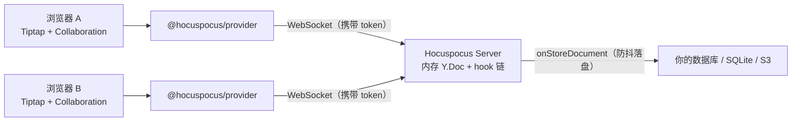

import { Meta } from '@storybook/addon-docs/blocks';

<Meta id="hocuspocus" title="实时协作/Hocuspocus 后端" name="Docs" />

# Hocuspocus 后端

Hocuspocus 是 Tiptap 官方开源（MIT）的 Yjs WebSocket 协作服务器：客户端之间实时同步、自动合并冲突，文档保存在你自己的数据库里，不消耗 Tiptap 云服务额度。协作前端的部分——Yjs 文档模型与 provider 的通用抽象——由[协作入门](?path=/docs/collaboration--docs)一课承接，本课聚焦服务器本身：怎么把它跑起来、怎么鉴权、怎么把文档落库、怎么部署到生产。

先建立三个能预测后文所有操作的判断：

- **文档状态在服务器内存里。** 所有客户端的更新先合并进内存中的 Y.Doc，再按需落库；不接持久化，进程重启内容就没了。
- **hook 链是唯一的扩展点。** 鉴权、持久化、限流、日志全部通过 hooks（或包装了 hooks 的官方扩展）注入，像中间件栈一样按序执行。
- **前端只认 `@hocuspocus/provider`。** 连接、重连、鉴权与 awareness 都由它负责，Tiptap 编辑器通过 extension-collaboration 挂在它同步的 Y.Doc 上。

本课按 Hocuspocus 4.x 编写：服务端需要 Node.js 22+，也支持 Bun、Deno 与 Cloudflare Workers；v4 的 hook payload 使用 Web 标准 `Request` / `Headers`。



按职责记包名，回查时先定位层级：

| 包 | 职责 |
| --- | --- |
| `@hocuspocus/server` | 服务端本体：`Server` / `Hocuspocus` 类与 hook 链 |
| `@hocuspocus/provider` | 浏览器端 provider：连接、重连、鉴权、awareness |
| `@hocuspocus/cli` | 命令行一键起服务，支持 `--port`、`--sqlite` 等参数 |
| `@hocuspocus/extension-sqlite` / `-database` / `-s3` | 三种官方持久化扩展 |
| `@hocuspocus/extension-redis` | 多实例之间的文档同步（不做持久化） |
| `@hocuspocus/extension-logger` / `-throttle` / `-webhook` | 日志、限流、webhook 通知 |
| `@hocuspocus/transformer` | Y.Doc 与 HTML / JSON 互转的辅助包 |
| `@hocuspocus/provider-react` | provider 的 React 绑定 |

## 快速上手

最小闭环：命令行起一个协作服务器，前端用 provider 接上编辑器，开两个标签页互见输入。服务端代码无法在 Storybook 浏览器环境运行，本课示例需在本机 Node.js 22+ 环境执行。

第一步，起服务器。最快路径是官方 CLI，不写任何代码：

```bash
# 默认就是无鉴权、内存态的协作服务器
npx @hocuspocus/cli --port 1234
```

需要 hook 或持久化时换成代码启动：

```bash
npm install @hocuspocus/server
```

```js
// server.mjs
import { Server } from '@hocuspocus/server'

const server = new Server({
  port: 1234,
})

server.listen()
```

第二步，前端接线。安装 provider 与协作扩展：

```bash
npm install yjs @hocuspocus/provider @tiptap/extension-collaboration
```

```ts
import * as Y from 'yjs'
import { HocuspocusProvider } from '@hocuspocus/provider'
import { Editor } from '@tiptap/core'
import StarterKit from '@tiptap/starter-kit'
import Collaboration from '@tiptap/extension-collaboration'

// 同一份 Y.Doc 同时交给 provider 和编辑器扩展
const ydoc = new Y.Doc()

const provider = new HocuspocusProvider({
  url: 'ws://127.0.0.1:1234',
  name: 'example-document', // 服务器上的文档名，同名即同文档
  document: ydoc,
})

const editor = new Editor({
  element: document.querySelector('#app'),
  extensions: [
    // 协作模式用 Yjs 的 undo 机制，需关掉 StarterKit 自带的 undoRedo
    StarterKit.configure({ undoRedo: false }),
    Collaboration.configure({ document: ydoc }),
  ],
})
```

第三步，验证。两个浏览器标签页打开页面，任意一侧输入，另一侧立刻出现相同内容；重启服务器进程后内容消失——这就是"内存态"的直接观察结果，解决办法见持久化一节。extension-collaboration 的配置细节由[协作入门](?path=/docs/collaboration--docs)展开，本课不重复。

## Server 配置

`Server` 类负责网络层（HTTP + WebSocket 升级），内部持有一个 `Hocuspocus` 实例处理协议与 hook 链；`server.listen()` 启动监听并返回 `Promise<Hocuspocus>`，收到 SIGINT / SIGQUIT / SIGTERM 信号时默认先走 `destroy()` 再退出（`stopOnSignals` 默认开启）。配置直接写在构造函数里：

```js
import { Server } from '@hocuspocus/server'

const server = new Server({
  name: 'hocuspocus-fra1-01', // 实例名，多实例部署时必须唯一
  port: 1234,
  timeout: 60000,
  debounce: 5000,
  maxDebounce: 30000,
  quiet: true,
  websocketOptions: { maxPayload: 1024 * 1024 },
})

server.listen()
```

注意 `port` 默认是 `80`（官方示例惯用 `1234`）；`address` 不设时监听所有接口。常用配置与默认值（与仓库源码 `defaultConfiguration` 核对过）：

| 配置项 | 默认值 | 说明 |
| --- | --- | --- |
| `port` | `80` | 监听端口（`Server` 层配置） |
| `address` | 无（全部接口） | 绑定的主机地址 |
| `timeout` | `60000` | 连接健康检查间隔；认证前作为从建连起算的绝对截止时间 |
| `debounce` | `2000` | `onStoreDocument` 的防抖延迟（毫秒） |
| `maxDebounce` | `10000` | 距上次存储最长多久必触发一次 `onStoreDocument` |
| `quiet` | `false` | `true` 时静默启动，不打印启动画面 |
| `websocketOptions` | `{}` | 转发给底层 WebSocket 服务器的选项 |
| `yDocOptions` | `{ gc: true }` | 传给内存 Y.Doc 的 Yjs 配置 |
| `unloadImmediately` | `true` | 最后一个连接断开后立即从内存卸载文档 |
| `stopOnSignals` | `true` | 收到进程信号时执行 `destroy()` 再退出 |

### 认证前的资源限制

消息在认证完成前会缓冲在连接的内存里。为防止未认证客户端耗尽服务器内存（对应安全公告 GHSA-xwhh-v746-pj9m），v4 提供三个上限，任一超出即关闭连接：

| 配置项 | 默认值 | 限制 |
| --- | --- | --- |
| `maxUnauthenticatedQueueSize` | 5 MiB | 单连接认证前缓冲的字节总量 |
| `maxUnauthenticatedQueueMessages` | `1000` | 单连接认证前缓冲的消息条数 |
| `maxPendingDocuments` | `100` | 单连接认证前可打开的不同文档数 |

`timeout` 在认证前同样起保护作用：从连接建立起算、不因收到数据而刷新；首次认证成功后才恢复为普通的空闲超时行为。

## Hook 链

hooks 是传入 `Server` 配置的异步方法，v4 的 payload 使用 Web 标准 `Request` / `Headers`（`onRequest`、`onUpgrade` 例外——它们运行在 WebSocket 升级前的 HTTP 层，用 Node.js 类型）。

两条执行规则可以预测一切 hook 行为：

- **按序执行，配置在链尾。** extensions 按注册顺序先执行，你在构造函数里写的同名 hook 排在所有扩展之后。
- **抛错即中断。** 多数 hook 抛异常或 reject 会中断 hook 链，后续扩展与配置里的同一 hook 不再执行；在连接类 hook（`onConnect`、`onAuthenticate`）里抛错会直接终止该客户端连接。

hook 触发顺序（对照官方 hooks 文档全量列出，供回查）：

| # | hook | 触发时机 |
| --- | --- | --- |
| 1 | `onConfigure` | Server 创建并配置完成后 |
| 2 | `onListen` | `listen()` 后，开始接受连接 |
| 3 | `onRequest` | 收到 HTTP 请求；reject 可自行响应（适合自定义路由） |
| 4 | `onUpgrade` | 收到 WebSocket 升级请求；reject 可自行处理升级 |
| 5 | `onConnect` | 新连接建立；抛错终止连接 |
| 6 | `onAuthenticate` | 收到认证请求；抛错终止连接，返回值成为 context |
| 7 | `onTokenSync` | 连接中收到新 token；无需重连即可重新验证 |
| 8 | `onLoadDocument` | 加载 / 创建文档；应返回 Y.Doc 或原始 `Uint8Array` |
| 9 | `afterLoadDocument` | 所有 `onLoadDocument` 成功后，文档确认已在内存打开 |
| 10 | `connected` | 连接建立完成 |
| 11 | `beforeSync` | 同步消息处理前（同步方法，不是 async） |
| 12 | `beforeHandleMessage` | 消息被应用前；抛错可拒绝消息或断开连接 |
| 13 | `afterHandleMessage` | 更新应用完成后 |
| 14 | `beforeHandleAwareness` | awareness 消息解码后、应用前；可原地修改 `states` |
| 15 | `onAwarenessUpdate` | awareness 变化后 |
| 16 | `onChange` | 文档内容变化时（payload 含 `transactionOrigin`） |
| 17 | `onStoreDocument` | 持久化时机；已内置防抖；抛错则文档留在内存并重试 |
| 18 | `beforeBroadcastStateless` | 广播 stateless 消息前 |
| 19 | `onStateless` | 收到 stateless 消息 |
| 20 | `onDisconnect` | 连接终止 |
| 21 | `afterUnloadDocument` | 文档从服务器卸载后（此时已访问不到文档） |
| 22 | `onDestroy` | `destroy()` 关闭服务器后 |

旧文章里的 `onCreateDocument` 已不存在，对应 hook 是 `onLoadDocument`。

hook 之间靠 `context` 传递数据：`onAuthenticate` 的返回值会作为 `context` 出现在后续 hook 的 payload 中，v4 还支持泛型 `Server<Context>` 让它全链路类型安全。

## 鉴权

数据流：provider 构造时给 `token` → 连接建立后客户端把 token 发给服务器 → `onAuthenticate(data)` 校验 → 抛错断连，返回值存入 context。

```js
import { Server } from '@hocuspocus/server'

const server = new Server({
  async onAuthenticate(data) {
    // 客户端未传 token 时，data.token 是空字符串
    if (data.token !== 'super-secret-token') {
      throw new Error('Not authorized!') // 抛错即断开连接
    }

    // 返回值会成为后续 hook 里的 context
    return { user: { id: 1234, name: 'John' } }
  },
})

server.listen()
```

客户端不需要为鉴权写额外流程，`token` 直接进 provider：

```js
const provider = new HocuspocusProvider({
  url: 'ws://127.0.0.1:1234',
  name: 'example-document',
  document: ydoc,
  token: 'super-secret-token', // 支持字符串、函数或 Promise
})
```

实战中 token 通常是 JWT，校验写在 `onAuthenticate` 里即可——无效签名抛错，连接随之终止：

```ts
import { verify } from 'jsonwebtoken'

async onAuthenticate(data) {
  const payload = verify(data.token, process.env.JWT_SECRET)
  return { userId: payload.sub }
}
```

### 只读连接与 token 更新

不想拒绝连接、只想降级为只读时，设置 `data.connection.readOnly = true`：

```js
const usersWithWriteAccess = ['jane', 'john', 'christina']

async onAuthenticate(data) {
  // 演示用 URL 参数识别用户；真实项目一般从 token 解析身份
  if (!usersWithWriteAccess.includes(data.requestParameters.get('user'))) {
    data.connection.readOnly = true // 该连接的更新会被服务器拒绝，只能接收别人的修改
  }
}
```

认证结果在客户端的表现：成功触发 `onAuthenticated`；失败触发 `onAuthenticationFailed({ reason })`，连接随后被关闭（v4 的 `onClose({ event })` 带有 `event.code` 与 `event.reason`，可用于定位原因）。

长会话的 token 过期用 `onTokenSync`：客户端发来新 token 时无需重连即可重新验证，可同步更新 `connection.readOnly`，抛错表示 token 无效。

## 持久化

不接持久化时，文档只活在内存里。持久化接口就是两个 hook：

- **`onLoadDocument`：** 文档被打开时调用，从数据库加载并合并进内存 Y.Doc；返回 Y.Doc 或原始 `Uint8Array`。
- **`onStoreDocument`：** 文档变化后调用；防抖已内置（`debounce` 默认 2 秒，`maxDebounce` 保证最长 10 秒必触发一次）；抛错时文档留在内存、稍后重试；`destroy()` 关闭服务器前会 flush 未完成的存储。

```ts
import { Server } from '@hocuspocus/server'
import * as Y from 'yjs'

const server = new Server({
  async onLoadDocument(data) {
    // 数据库存的是 Y.encodeStateAsUpdate 的二进制结果
    const update = await loadFromDatabase(data.documentName)
    if (update) {
      Y.applyUpdate(data.document, update)
    }
    return data.document
  },

  async onStoreDocument(data) {
    await saveToDatabase(data.documentName, Y.encodeStateAsUpdate(data.document))
  },
})

server.listen()
```

**主存储必须是 Yjs 的二进制格式（`Uint8Array`）。** 官方明确警告：不要只存 JSON、等用户连接时再重建 Yjs 文档——更新无法正确合并，"content will duplicate on new connections"。可以额外存一份 JSON 快照便于展示，但主存储必须是二进制。

不想自己写时，用官方持久化扩展——它们本质上就是上面两个 hooks 的封装：

| 扩展 | 用途 |
| --- | --- |
| `@hocuspocus/extension-sqlite` | 开箱即用的 SQLite 持久化 |
| `@hocuspocus/extension-database` | 通用数据库驱动，接你自己的存储 |
| `@hocuspocus/extension-s3` | 存入 Amazon S3 或兼容 S3 的服务 |

```js
import { Server } from '@hocuspocus/server'
import { SQLite } from '@hocuspocus/extension-sqlite'

const server = new Server({
  port: 1234,
  extensions: [new SQLite({ database: 'db.sqlite' })],
})

server.listen()
```

区分两个相似的 hook：要响应每次内容变化（统计、通知）用 `onChange`；落库一律用 `onStoreDocument`——防抖和重试都是它内置的。

## 前端接入：@hocuspocus/provider

provider 负责连接生命周期、鉴权与 awareness；最小创建代码见快速上手。常用配置回查表：

| 配置项 | 默认值 | 说明 |
| --- | --- | --- |
| `url` | `''` | Hocuspocus 服务器地址 |
| `name` | `''` | 文档名，同名客户端共享同一文档 |
| `document` | `new Y.Doc()` | 复用已有 Y.Doc（与编辑器共享时必传） |
| `token` | `''` | 鉴权 token，支持字符串、函数或 Promise |
| `awareness` | `new Awareness()` | 在线状态对象，协作光标的基础 |
| `forceSyncInterval` | `false` | 设为毫秒数后，周期性向服务器请求更新对账 |
| `flushDelay` | `false` | 设为毫秒数后合并批量发送更新，降低流量；`false` 立即发送 |
| `sessionAwareness` | `false` | 在文档名中嵌入 sessionId，需 v4 服务器 |

### 事件回调

事件既可在构造时传入，也可在初始化后用 `provider.on(...)` / `provider.off(...)` 动态绑定。常用回调：

| 回调 | 参数 | 触发时机 |
| --- | --- | --- |
| `onConnect` | 无 | provider 成功连上服务器 |
| `onAuthenticated` / `onAuthenticationFailed` | `({ reason })`（失败时） | 鉴权成功 / 失败 |
| `onStatus` | `({ status })` | 连接状态变化 |
| `onSynced` | `({ state })` | 文档完成（初次）同步 |
| `onMessage` / `onOutgoingMessage` | `({ event, message })` / `({ message })` | 收到 / 即将发出一条消息 |
| `onStateless` | `({ payload })` | 收到 stateless 消息，可回 `provider.sendStateless()` |
| `onAwarenessUpdate` / `onAwarenessChange` | `({ added, updated, removed })` / `({ states })` | awareness 更新 / 变化 |
| `onClose` / `onDisconnect` | `({ event })` | 连接关闭（v4 的 `event` 含 `code`、`reason`）/ 断开 |
| `onDestroy` | 无 | provider 即将销毁 |

判断"文档是否已同步"用两条路：`onSynced` 回调处理初次同步完成的时机（隐藏 loading、加载本地数据）；`provider.isSynced` 布尔值随时可读，适合做条件判断。

`awareness` 之上的协作光标与在线状态属于交互层，做法见[协作体验](?path=/docs/collaboration-ux--docs)一课。

### 多文档共享连接

页面要同时开多个文档时，用 `HocuspocusProviderWebsocket` 共享一条 WebSocket，重连策略统一在连接层管理：

```js
import {
  HocuspocusProvider,
  HocuspocusProviderWebsocket,
} from '@hocuspocus/provider'

// 连接层实例：多个文档复用同一条 socket
const socket = new HocuspocusProviderWebsocket({
  url: 'ws://127.0.0.1:1234',
  maxAttempts: 5, // 默认 0 表示无限重试；重连自带指数退避与 jitter
})

// 重试耗尽只通知 socket 层，不会转发给单个文档 provider
socket.on('maxAttemptsFailed', ({ error }) => {
  console.error('重连失败：', error)
})

const provider = new HocuspocusProvider({
  websocketProvider: socket,
  name: 'example-document',
})

// 做"重试"按钮时：
// provider.configuration.websocketProvider.connect()
```

两个边界：在 Node.js 环境使用 provider（测试脚本、SSR）需传 `WebSocketPolyfill`（如 `ws` 包）；`messageReconnectTimeout` 默认 30000 毫秒，超过该时长没收到消息会主动关闭连接。

## 生产部署

部署前先选拓扑，三种方案按成本递增：

- **单实例：** 最简单，适合中小规模；Yjs 本身非常省资源。
- **多实例、按文档分流：** 官方推荐的水平扩展方式——部署多个互相独立的实例，按文档名把同一文档的用户路由到同一实例（不同实例之间不共享状态）。
- **多实例 + Redis：** 需要高可用（实例故障转移、滚动发布）时，用 `@hocuspocus/extension-redis` 在实例间转发文档更新与 awareness。

```js
import { Server } from '@hocuspocus/server'
import { Redis } from '@hocuspocus/extension-redis'
import { SQLite } from '@hocuspocus/extension-sqlite'

const server = new Server({
  name: 'server-1', // 多实例必须用唯一的 name
  port: 1234,
  extensions: [
    new Redis({
      host: '127.0.0.1', // 所有实例连同一个 Redis
      port: 6379,
      // 加载文档时等待其他实例当前状态的最长时间（毫秒），0 为不等待
      awaitInitialSyncTimeout: 1000,
    }),
    new SQLite(),
  ],
})

server.listen()
```

Redis 方案的两个代价，决定了"降负载不该选它"：

- 所有消息会在全部实例上处理——它解决的是高可用，不是分摊 CPU；想降负载用按文档分流。
- 配合持久化扩展时，一个实例存储文档后其他实例会被阻止写入，避免写冲突。

### 接入现有 HTTP 服务

不想单独起进程时，用不带网络层的核心类 `Hocuspocus` 配合 crossws 适配器，把连接桥接进 Express、Hono、Bun、Deno 等现有服务（核心调用是 `hocuspocus.handleConnection(...)`）。这种自管模式下 `onRequest`、`onUpgrade`、`onListen` 不会被触发。

### 进程退出与反向代理

`stopOnSignals` 默认开启：SIGINT / SIGQUIT / SIGTERM 会先走 `destroy()`——flush 未完成的存储后再退出，容器环境直接接收信号即可。放到 Nginx 等反代后面时，确认代理支持 WebSocket 协议升级，并把空闲读超时调大到不小于服务器 `timeout`（默认 60 秒），否则挂机的协作连接会被代理提前掐断。

## 服务端扩展点

**stateless 消息通道**——文档同步之外的自定义消息：

- 服务端收：`onStateless({ payload })`，payload 是字符串；客户端用 `provider.sendStateless('...')` 发送。
- 服务端发：`document.broadcastStateless('...')` 广播给文档的所有客户端，`connection.sendStateless('...')` 发给单个连接；发出前还有 `beforeBroadcastStateless` 可拦截。
- 客户端收：`onStateless({ payload })` 回调。

典型用途是评论提醒、随文档走的自定义信令。

### 服务端直改文档

不走 WebSocket，在服务端进程内直接打开并修改文档：

```ts
import { Hocuspocus } from '@hocuspocus/server'

const hocuspocus = new Hocuspocus()

const docConnection = await hocuspocus.openDirectConnection('my-document', {})
await docConnection.transact((doc) => {
  doc.getMap('meta').set('title', '新标题')
})
await docConnection.disconnect()
```

默认断开后立即从内存卸载文档；想让文档保持热状态用 `disconnect({ unloadImmediately: false })`。

### 扩展包速查

| 扩展 | 作用 |
| --- | --- |
| `@hocuspocus/extension-logger` | 打印连接与消息日志 |
| `@hocuspocus/extension-throttle` | 限制消息频率 |
| `@hocuspocus/extension-webhook` | 把文档变更推送到 webhook |
| `@hocuspocus/transformer` | Y.Doc 与 HTML / JSON 互转，常用于服务端生成快照 |

## 常见问题

- **重启服务器后文档内容全没了。**
  没接持久化：文档只存在内存里，`npx @hocuspocus/cli` 和未配置 `onLoadDocument` / `onStoreDocument`（或持久化扩展）的 `Server` 都是这样。按持久化一节接入扩展或 hooks；若仍有客户端持有本地 Y.Doc，重连后其本地状态会自动同步回服务器，等于恢复了一份副本。
- **新连接进来看到重复内容。**
  存储格式错了：只存 JSON、连接时再重建 Y.Doc 是官方明确警告的反模式——更新无法正确合并，新连接会出现内容重复。主存储必须是 `Y.encodeStateAsUpdate` 输出的 `Uint8Array` 二进制。
- **客户端触发 `onAuthenticationFailed`，或连接被服务器直接关闭。**
  按顺序检查：provider 是否传了 `token`（未传时服务器收到空字符串）；`onAuthenticate` 是否抛错（抛错即断连）；v4 可在 `onClose({ event })` 里读 `event.code` 与 `event.reason` 定位原因。长会话 token 过期改走 `onTokenSync`，无需重连。
- **部署多个实例后，同一文档的用户互相看不到修改。**
  同一文档的所有连接必须在同一实例上。要么在负载均衡层按文档名做一致性路由，要么给所有实例接同一个 `@hocuspocus/extension-redis` 并保证各实例 `name` 唯一；注意 Redis 方案下所有消息会在全部实例上处理。
- **页面挂一会儿就断线，或经过 Nginx 反代后频繁掉线。**
  这类"空闲断连"要对齐三层超时：服务器 `timeout`（默认 60000 毫秒）、provider 侧 `messageReconnectTimeout`（默认 30000 毫秒）、反代的空闲读超时（Nginx 默认 60 秒，且需支持 WebSocket upgrade）。provider 自带指数退避重连，断线会自动恢复；掉线频繁才需要调参。

## 总结回顾

摘要：

Hocuspocus 是 Tiptap 官方开源（MIT）的 Yjs WebSocket 协作服务器，包生态按 server / provider / cli / extensions 分层。它的状态模型决定了使用方式：文档合并在服务器内存中进行，鉴权、持久化、限流都通过按序执行的 hook 链注入——`onAuthenticate` 校验 token 并把用户信息存入 context，`onLoadDocument` / `onStoreDocument` 构成持久化接口（官方 SQLite / Database / S3 扩展是它们的封装），主存储必须用 Yjs 二进制格式。前端用 `@hocuspocus/provider` 接入：token、事件回调、同步状态与共享连接层都由它提供。部署按规模在单实例、按文档分流的多实例、Redis 互联的高可用方案之间选择。

一句话：

> Hocuspocus 服务器的状态在内存、能力在 hook 链——鉴权拦在 `onAuthenticate`，持久化挂在 `onLoadDocument` / `onStoreDocument`，前端一切连接行为由 `@hocuspocus/provider` 驱动。

知识要点：

- Hocuspocus 由哪些包组成？服务端需要什么运行时？
- 文档状态存在哪里？不接持久化会发生什么？
- hook 链按什么顺序执行？在 hook 里抛错会怎样？
- token 从客户端怎么传、在哪里校验？只读连接和 token 过期怎么处理？
- 持久化接口是哪两个 hook？为什么主存储必须是 `Uint8Array`？
- provider 怎么创建、怎么读同步状态、多文档怎么共享一条连接？
- 多实例部署有哪三种拓扑？Redis 方案的代价是什么？

## 参考资料

- [Hocuspocus Overview](https://tiptap.dev/docs/hocuspocus/getting-started/overview)
  定位、与 Yjs 的关系、运行时支持（Node / Bun / Deno / Cloudflare Workers）。
- [Server Configuration](https://tiptap.dev/docs/hocuspocus/server/configuration)
  全部配置项与默认值、Generic Context、认证前资源限制与安全公告背景。
- [Server Hooks](https://tiptap.dev/docs/hocuspocus/server/hooks)
  hook 全量清单、执行顺序与各 payload 签名。
- [Authentication Guide](https://tiptap.dev/docs/hocuspocus/guides/authentication)
  `onAuthenticate` 写法、token 传递与 readOnly 设置。
- [Persistence Guide](https://tiptap.dev/docs/hocuspocus/guides/persistence)
  手动持久化 hooks、官方扩展与 Uint8Array 存储格式警告。
- [Server Examples](https://tiptap.dev/docs/hocuspocus/server/examples)
  CLI 用法、Express / Hono / Bun / Deno 集成与 openDirectConnection。
- [Provider Install](https://tiptap.dev/docs/hocuspocus/provider/install)
  provider 安装命令与最小连接代码。
- [Provider Configuration](https://tiptap.dev/docs/hocuspocus/provider/configuration)
  `HocuspocusProvider` 与 `HocuspocusProviderWebsocket` 全部配置项。
- [Provider Events](https://tiptap.dev/docs/hocuspocus/provider/events)
  全部事件回调签名与动态绑定方式。
- [Scalability Guide](https://tiptap.dev/docs/hocuspocus/guides/scalability)
  水平扩展策略与按文档分流建议。
- [Redis Extension](https://tiptap.dev/docs/hocuspocus/server/extensions/redis)
  多实例同步的配置、初始化同步超时与写冲突互斥。
- [ueberdosis/hocuspocus 仓库](https://github.com/ueberdosis/hocuspocus)
  MIT 许可、packages 目录包清单、README 最小示例，以及默认值源码（`packages/server/src/Hocuspocus.ts`、`Server.ts`）。
