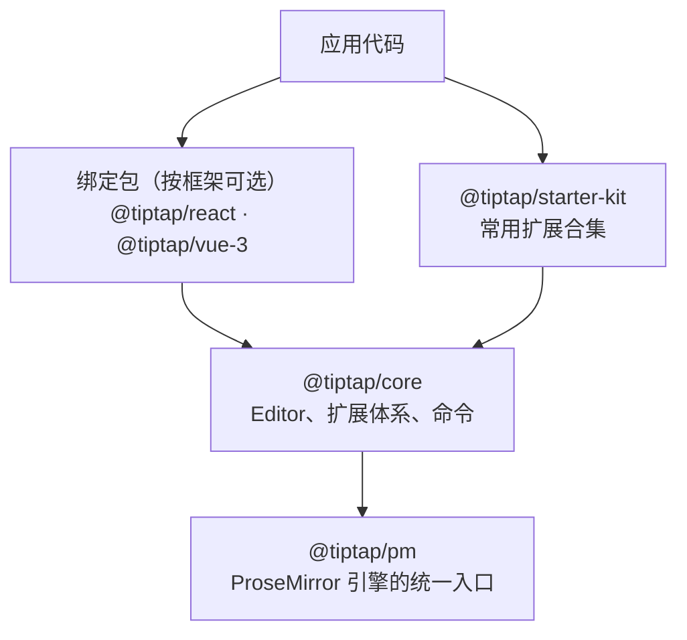

import { Canvas, Controls, Meta } from '@storybook/addon-docs/blocks';
import * as Install from './install.stories';

<Meta of={Install} name="Docs" />

# 安装

Tiptap 是框架无关的 headless 编辑器，安装就是装齐三类 npm 包：内核 `@tiptap/core`、引擎 `@tiptap/pm`、扩展（起步通常用预打包的 `@tiptap/starter-kit`），再按项目框架决定要不要加一个绑定包。装好后几行代码就能把一个真实可输入的编辑器挂载到页面上。本课给出原生 JavaScript、React、Vue 3 三条安装路径的命令与最小代码，并讲清每个包的职责。

> 本页内嵌范例会实际挂载一个 Tiptap 编辑器，因此依赖 `@tiptap` 系列包：学习本课前先按下方命令安装依赖；未安装时在 Storybook 中打开本页会提示模块解析失败，安装后刷新即可恢复。



| 包 | 何时安装 | 职责 | 关键限制 |
| --- | --- | --- | --- |
| `@tiptap/core` | 原生 JS 路径显式安装；框架路径由绑定包的 peer 依赖带入 | 编辑器内核：`Editor` 类、扩展体系、命令链 | 与 `@tiptap/pm` 版本必须一致 |
| `@tiptap/pm` | 三条路径都显式安装 | ProseMirror 引擎的统一重导出入口 | 业务代码通常不直接 import 它 |
| `@tiptap/starter-kit` | 推荐安装 | 官方预打包的常用扩展合集，一次带入 11 个节点、6 个标记和若干功能扩展 | 与单独安装的扩展不能重名 |
| `@tiptap/react` / `@tiptap/vue-3` | 按项目框架二选一 | React / Vue 的组件与 hooks 绑定 | 原生 JS 路径不需要 |

## 选择安装路径

路径由项目框架决定：原生 JS 直接用 `@tiptap/core`，React 用 `@tiptap/react`，Vue 3 用 `@tiptap/vue-3`。三条命令只差第一段：

```bash
# 原生 JavaScript
npm install @tiptap/core @tiptap/pm @tiptap/starter-kit

# React
npm install @tiptap/react @tiptap/pm @tiptap/starter-kit

# Vue 3
npm install @tiptap/vue-3 @tiptap/pm @tiptap/starter-kit
```

原生路径装 `@tiptap/core` 本体；框架路径换成绑定包——绑定包把 `@tiptap/core` 和 `@tiptap/pm` 声明为精确版本的 peer 依赖（如 3.31.4 配 3.31.4），npm 7+ 会自动补装它们。`@tiptap/pm` 和 `@tiptap/starter-kit` 三条路径都要装。

官方还为 Next.js、Nuxt、Vue 2、Svelte、Alpine.js、PHP 等提供安装指南，另有社区维护的 Angular、Solid 集成；这些场景从[安装总览](https://tiptap.dev/docs/editor/getting-started/install)进入。

## 安装路径

三条路径结构相同：安装依赖 → 最小代码挂载 → 打开页面看到一个可输入的编辑器。差异只在挂载写法。

### 原生 JavaScript

有构建工具（Vite、Webpack、Rollup 等）时，准备一个空容器并挂载：

```html
<div class="element"></div>
```

```js
import { Editor } from '@tiptap/core'
import StarterKit from '@tiptap/starter-kit'

new Editor({
  element: document.querySelector('.element'),
  extensions: [StarterKit],
  content: '<p>Hello World!</p>',
})
```

`element` 是挂载目标，编辑器会把内容区插入这个元素；`extensions` 决定编辑器有哪些能力；`content` 是初始内容。在 TypeScript 里记得对 `querySelector` 的结果做空值处理。打开页面即可看到并编辑 `Hello World!`。

官方指南还演示了原生 JS 接工具栏按钮（点击调用 `editor.chain().focus().toggleBold().run()` 一类命令）的完整写法；命令链的用法见[命令课](?path=/docs/commands--docs)。

### 不用构建工具：CDN

没有构建工具时，用 `<script type="module">` 直接从 CDN 引入 ESM 版本：

```html
<script type="module">
  import { Editor } from 'https://cdn.jsdelivr.net/npm/@tiptap/core@3.31.3/+esm'
  import StarterKit from 'https://cdn.jsdelivr.net/npm/@tiptap/starter-kit@3.31.3/+esm'

  new Editor({
    element: document.querySelector('.element'),
    extensions: [StarterKit],
    content: '<p>Hello from CDN!</p>',
  })
</script>
```

要点：`script` 必须带 `type="module"`；URL 末尾的 `+esm` 让 jsdelivr 提供 ESM 构建，并把依赖（含 `@tiptap/pm`）一并解析，无需逐个引入；版本号写死在 URL 中，升级意味着改 URL。官方指南提供了带工具栏按钮的完整 HTML 文件，可直接保存为 `.html` 打开验证。

### React

```bash
npm install @tiptap/react @tiptap/pm @tiptap/starter-kit
```

最小组件只涉及 `useEditor` 与 `EditorContent`：

```jsx
import { useEditor, EditorContent } from '@tiptap/react'
import StarterKit from '@tiptap/starter-kit'

const Tiptap = () => {
  const editor = useEditor({
    extensions: [StarterKit],
    content: '<p>Hello World!</p>',
  })

  return <EditorContent editor={editor} />
}

export default Tiptap
```

`useEditor` 创建编辑器实例，`EditorContent` 负责挂载渲染。绑定包支持的 React 版本以官方 peer 依赖为准（当前为 17、18、19）。官方安装页还覆盖 EditorContext、SSR 与 Composable API；深入用法见[React 集成课](?path=/docs/react--docs)。

### Vue 3

```bash
npm install @tiptap/vue-3 @tiptap/pm @tiptap/starter-kit
```

`<script setup>` 写法最短：

```html
<template>
  <editor-content :editor="editor" />
</template>

<script setup>
  import { useEditor, EditorContent } from '@tiptap/vue-3'
  import StarterKit from '@tiptap/starter-kit'

  const editor = useEditor({
    content: '<p>Hello World!</p>',
    extensions: [StarterKit],
  })
</script>
```

绑定包要求 Vue 3 及以上。Options API 项目改为在 `mounted()` 中 `new Editor(...)`、在 `beforeUnmount()` 中 `editor.destroy()`；v-model、Nuxt 等内容见官方安装页与[Vue 集成课](?path=/docs/vue--docs)。

## 包职责

三条安装命令的形状差异直接来自包的分工：内核（`@tiptap/core`）、引擎（`@tiptap/pm`）、扩展合集（`@tiptap/starter-kit`）与绑定包各管一层。下面按成员展开。

### @tiptap/core

这是框架无关的编辑器内核：`Editor` 类、`Extension` / `Node` / `Mark` 扩展体系、命令链都定义在这里，业务代码总是从它 import（框架项目则通过绑定包间接使用）。

版本上有硬约束：`@tiptap/core` 对 `@tiptap/pm` 声明的是**精确版本**的 peer 依赖，两个包必须同步升级。这也解释了框架路径的命令里为什么没有 `@tiptap/core`——绑定包把它声明为 peer 依赖，npm 7+ 自动补装；npm 6 或未开启自动安装 peer 依赖的包管理器需要自行确保它存在。

### @tiptap/pm

Tiptap 建立在 ProseMirror 之上，`@tiptap/pm` 是官方对 ProseMirror 各包（`prosemirror-state`、`prosemirror-view`、`prosemirror-model` 等）的统一重导出。安装它而不是逐个安装 `prosemirror-*` 包，是为了保证 ProseMirror 版本始终与 Tiptap 所用版本一致，避免 Tiptap 与扩展之间出现版本冲突。

多数业务代码不会 import 它——它只为底层服务。写自定义扩展需要 ProseMirror API 时，从子路径导入，例如 `import { EditorState } from '@tiptap/pm/state'`。个别未被重导出的包（如 `prosemirror-collab`）需要时再单独安装。

### @tiptap/starter-kit

`StarterKit` 是官方把最常用的扩展打成一个包，`extensions: [StarterKit]` 一次全部启用。v3 包含：

| 分组 | 包含的扩展 |
| --- | --- |
| 节点 | Blockquote、BulletList、CodeBlock、Document、HardBreak、Heading、HorizontalRule、ListItem、OrderedList、Paragraph、Text |
| 标记 | Bold、Code、Italic、Link、Strike、Underline |
| 功能扩展 | Dropcursor、Gapcursor、UndoRedo、ListKeymap、TrailingNode |

它是普通扩展，可以 `configure`：传 `false` 关闭某个子扩展，传对象做配置，还可以在引入同名自定义扩展前关闭内置项：

```js
StarterKit.configure({
  // 关闭一个子扩展
  undoRedo: false,
  // 配置一个子扩展
  heading: {
    levels: [1, 2],
  },
  // 引入自己的 Link 扩展前，先关闭内置 Link，避免重名
  link: false,
})
```

Tiptap 不允许两个同名扩展共存，这是与单独安装 `@tiptap/extension-*` 包混用时的主要注意点。

下面的范例实际挂载了一个编辑器：切换「扩展集合」，对比 `StarterKit` 与只装 Document、Paragraph、Text 三个基础节点的「最小三件套」——编辑器照样能跑，但 schema 里能装下的内容类型立刻变少。

<Canvas of={Install.Interactive} />
<Controls of={Install.Interactive} />

| 读者操作 | 可观察证据 |
| --- | --- |
| 观察初始状态 | 页面上出现真实可输入的编辑器；读数显示 StarterKit 带入 22 个扩展 |
| 在 StarterKit 下输入 `# ` 加空格 | 当前行变成一级标题（Markdown 式输入规则随扩展生效） |
| 切换「扩展集合」为「最小三件套」 | 扩展数量降为 3；节点类型只剩文档骨架；标记类型变为「无」 |
| 切换后继续打字 | 仍可输入普通段落，但标题、粗体等类型已不可用 |
| 打开 Show code | 看到 `new Editor` 挂载与两种扩展集合的实际代码 |

切换扩展集合会按新 schema 重建编辑器，已有内容按新 schema 重新解析，装不下的结构会被丢弃或降级。

## 最佳实践

- **所有 `@tiptap/*` 包写进同一条安装命令、同批升级。** `@tiptap/core` 对 `@tiptap/pm` 是精确版本的 peer 依赖，官方也强调 `@tiptap/pm` 的价值在于保证 ProseMirror 版本一致；分散安装或只升级一部分容易出现版本错配。升级时把命令里的包一起改到同一版本再重装。
- **起步用 StarterKit，裁剪用 `configure({ xxx: false })`，不要先自己拼最小集合。** 需要某个能力时先查 StarterKit 清单；确认不需要时关闭它，比逐个挑选 `@tiptap/extension-*` 包更容易保持依赖完整。与单独安装的扩展混用时，用 `link: false` 这类写法处理重名。

## 常见问题

- 编辑器能正常输入，但标题、列表毫无样式，看起来和纯文本一样，是不是没装对？
  不是故障。Tiptap 是 headless 编辑器，默认不附带视觉样式，StarterKit 也只带极少的默认样式，外观由使用者自行编写或引入。样式定制见[样式课](?path=/docs/style-editor--docs)。
- 安装阶段出现 peer 依赖警告（如 `@tiptap/core` 要求某精确版本的 `@tiptap/pm`），或运行时报找不到 `@tiptap/pm` 的模块。
  把所有 `@tiptap/*` 包写进同一条安装命令一起安装，确认版本号一致后重装。判断依据：`@tiptap/core` 对 `@tiptap/pm` 声明精确版本 peer 依赖，而 npm 7+ 才会自动安装 peer 依赖，npm 6 及部分包管理器配置不会。

## 总结回顾

摘要：

安装 Tiptap 的关键是看清三层分工：`@tiptap/pm` 是 ProseMirror 引擎的统一入口，`@tiptap/core` 是框架无关的内核，扩展决定编辑器能装下什么内容，`@tiptap/starter-kit` 把常用扩展一次打包。路径由项目框架决定：原生 JS 装 `@tiptap/core @tiptap/pm @tiptap/starter-kit`，React / Vue 3 把第一段换成对应绑定包并挂上 `useEditor` 与 `EditorContent`；没有构建工具时走 CDN。三条路径装完都用几行代码得到真实可输入的编辑器，范例里切换扩展集合可以直接看到「扩展决定 schema」：StarterKit 带来 22 个扩展，最小三件套只剩文档骨架。

一句话：

> 安装 Tiptap = 装齐版本一致的「`@tiptap/core` + `@tiptap/pm`」内核与一组扩展（起步用 `@tiptap/starter-kit`），再按框架决定要不要绑定包。

知识要点：

- 三条安装路径的命令各差哪一段？为什么 React / Vue 的命令里没有 `@tiptap/core`？
- `@tiptap/pm` 装完为什么通常不 import？它保证了什么？
- StarterKit 里有哪些扩展？如何关闭其中一个？
- 不用构建工具时如何安装并运行编辑器？
- 装好后如何验证安装成功？

## 参考资料

- [Install the Editor（安装总览）](https://tiptap.dev/docs/editor/getting-started/install)
- [Vanilla JavaScript 安装指南](https://tiptap.dev/docs/editor/getting-started/install/vanilla-javascript)
- [React 安装指南](https://tiptap.dev/docs/editor/getting-started/install/react)
- [Vue 3 安装指南](https://tiptap.dev/docs/editor/getting-started/install/vue3)
- [StarterKit 扩展（包含清单与 configure）](https://tiptap.dev/docs/editor/extensions/functionality/starterkit)
- [Tiptap 与 ProseMirror（`@tiptap/pm` 的重导出与版本一致性）](https://tiptap.dev/docs/editor/core-concepts/prosemirror)
- [@tiptap/core（npm 包元数据，peer 依赖依据）](https://www.npmjs.com/package/@tiptap/core)
