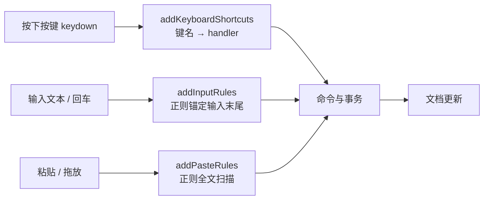

import { Canvas, Controls, Meta } from '@storybook/addon-docs/blocks';
import * as KeyboardInputRulesStories from './keyboard-input-rules.stories';

<Meta of={KeyboardInputRulesStories} name="Docs" />

# 快捷键与输入规则

Tiptap 编辑器里"边输入边变化"的自动化行为，全部来自扩展的三个注册点：`addKeyboardShortcuts` 把按键绑定到命令，`addInputRules` 用正则把"刚输入的文本"变换成标记或节点（Markdown 快捷输入就是它驱动的），`addPasteRules` 对"粘贴或拖放进来的文本"做同样的变换。三者殊途同归——命中后都落到命令与事务上（命令链见[命令课](?path=/docs/commands--docs)），差别只在触发时机与匹配方式。所以写自定义输入行为时，先选触发时机，再从现成 helper 里挑。

[Extension 体系课](?path=/docs/extension-system--docs)讲过这三个 `add*` 方法是扩展的构成要素之一，本课把它们的机制与写法展开：键名怎么写、返回值意味着什么、正则有什么约定、触发被哪些条件拦下、怎么开关与程序化触发。看完开场图和参考表，你应该能预测：给扩展加一条 `'Mod-Shift-9'` 绑定后按这个键会发生什么、打字输入 `**粗体**` 与程序化插入同样字符串的结果差异、粘贴规则的正则少写一个 `g` 标志会怎样。



三个注册点一览（默认值对照 `@tiptap/core` 源码核实）：

| 注册点 | 触发时机 | 匹配方式 | 现成 helper | 编辑器选项 |
| --- | --- | --- | --- | --- |
| `addKeyboardShortcuts` | 按下按键 | 键名字符串 | 无，直接写映射 | 总是启用 |
| `addInputRules` | 输入文本、回车、组合输入结束 | 正则，锚定输入末尾（`$`） | markInputRule / nodeInputRule / textblockTypeInputRule / wrappingInputRule / textInputRule | `enableInputRules`（默认 true） |
| `addPasteRules` | 粘贴、拖放 | 正则，全文扫描（`g` 标志） | markPasteRule / nodePasteRule / textPasteRule | `enablePasteRules`（默认 true） |

## addKeyboardShortcuts 快捷键

`addKeyboardShortcuts()` 返回一个"键名 → handler"的映射。`@tiptap/core` 在组装编辑器时，把每个扩展的这份映射转成一个独立的 ProseMirror keymap 插件；编辑器自身还内置一个 keymap 扩展承担基础按键——回车拆段、退格合并、`Mod-a` 全选等。扩展的 handler 签名是 `({ editor }) => boolean`，返回 true 表示"事件已处理"，ProseMirror 到此为止；返回 false 则放行给后续处理者。

```ts
import { Extension } from '@tiptap/core'

const DateShortcut = Extension.create({
  name: 'dateShortcut',
  addKeyboardShortcuts() {
    return {
      // Mod 在 macOS 上是 Cmd，在其他平台是 Ctrl
      'Mod-Shift-9': () => this.editor.commands.insertContent(new Date().toLocaleDateString()),
    }
  },
})
```

### 键名写法

键名是基于 `event.key` 的字符串，修饰键与主键用 `-` 连接：

| 写法 | 含义 |
| --- | --- |
| `Mod` | macOS 上展开为 Cmd，其他平台展开为 Ctrl |
| `Cmd` / `Meta`、`Ctrl`（Control）、`Alt`、`Shift` | 对应修饰键；修饰键的书写顺序任意，内部会重排成规范顺序 |
| 字母、数字 | `event.key` 对应的字符，字母写小写 |
| `Space` | 空格的别名 |
| `Enter`、`ArrowLeft`、`Backspace` 等 | 功能键直接用 `event.key` 名 |

两个与 Shift 有关的细节：其一，被 Shift 改变的字符（如 `?`、`:`）不用显式写 Shift 前缀；其二，字母组合键在不同键盘状态（大写锁定、平台差异）下读到的 `event.key` 大小写会变，所以内置扩展对字母组合注册了两个变体——Bold 同时绑定 `'Mod-b'` 与 `'Mod-B'`。自定义字母快捷键建议照做。

### 返回值与冲突

返回 true 的 handler 赢得这次按键，事件不再继续派发；返回 false（或 undefined）则继续尝试。尝试顺序就是 keymap 插件的顺序：先按扩展 `priority` 降序排（默认都是 100），同优先级按 `extensions` 数组的**逆序**——写在数组末尾的自定义扩展会先于 StarterKit 里的扩展拿到按键。想让事件"到此为止"就返回 true；想观察或记录但不拦截，就返回 false 让内置扩展继续。

```ts
// 想先做点什么再放行：执行自定义动作后返回 false，Bold 的 Mod-b 仍会执行
addKeyboardShortcuts() {
  return {
    'Mod-b': () => {
      console.log('Mod-b 按下，放行给后续扩展')
      return false
    },
  }
}
```

### 覆盖内置快捷键

覆盖内置绑定用 `.extend()`（机制见[Extension 体系课](?path=/docs/extension-system--docs)）：重写 `addKeyboardShortcuts()` 返回同键名的新映射即可。扩展实例自身的映射先于被扩展执行，返回 true 后内置绑定不再生效：

```ts
import BulletList from '@tiptap/extension-bullet-list'

const CustomBulletList = BulletList.extend({
  addKeyboardShortcuts() {
    return {
      'Mod-l': () => this.editor.commands.toggleBulletList(),
    }
  },
})
```

下面的实例把三种写法放进同一个编辑器：切换预设后点击编辑器、按对应快捷键，读数会记录每次触发的 handler、返回值与文档变化。

<Canvas of={KeyboardInputRulesStories.KeyboardShortcuts} />
<Controls of={KeyboardInputRulesStories.KeyboardShortcuts} />

| 读者操作 | 可观察证据 |
| --- | --- |
| 新增绑定预设下按 Ctrl/Cmd+Shift+9 | 读数记录"返回 true（插入日期）"，编辑器出现当天日期 |
| 覆盖预设下按 Ctrl/Cmd+B | 自定义 handler 返回 true，插入"【已拦截】"，文本不再加粗 |
| 放行预设下按 Ctrl/Cmd+B | 自定义 handler 返回 false，Bold 接手，getHTML 出现 strong |
| 打开 Show code | 看到该 Canvas 实际执行的 `keyboard-shortcuts.ts` |

## addInputRules 输入规则

输入规则监听"刚输入的文本"：每次输入时，把新文本模拟进文档得到"光标之前的全文"，逐条用规则的 `find` 正则去匹配，命中后在该事务上执行变换。`addInputRules()` 返回规则数组，每条规则是一个 `InputRule`，通常由 helper 生成。Markdown 快捷输入——`**粗体**`、`# 空格`、`> 空格`——都是这个机制驱动的。

规则实际在三个时机被检查：普通文本输入（`handleTextInput`）、回车（作为 `"\n"` 再跑一遍，所以 ` ``` ` + 回车也能开代码块）、输入法组合结束（`compositionend` 后补跑）。变换前输入的文本已先插入文档，因此 handler 拿到的 state 就是"输入完成后"的状态；变换后紧跟退格可以退回原始文本，靠的是 `undoInputRule` 命令（见下）。

### 触发边界与撤销

三条守门条件决定了"打字了但规则没跑"的常见场景：

- 光标在代码块内、或紧邻行内代码标记时，规则不触发——`spec.code` 的内容按代码对待，不做 Markdown 变换；
- 输入法组合过程中（`view.composing`）跳过，等组合结束后统一检查；
- 规则按注册顺序执行，第一条命中的生效。

撤销分两层：规则默认 `undoable: true`，变换后紧跟的 Backspace 会先走 `undoInputRule` 命令，把文档恢复成输入的原始 Markdown 文本（`@tiptap/core` 的退格处理链第一步就是它）；声明 `undoable: false` 的规则不保留这份恢复信息，退格不会"反悔"。

### 规则 helper

五个 helper 按变换方式分工，`find` 都可以是正则或自定义匹配函数：

| helper | 变换方式 | 典型正则 | 内置使用 |
| --- | --- | --- | --- |
| `markInputRule` | 给匹配文本加标记 | `/\*\*([^*]+)\*\*$/` | bold、italic、strike、code |
| `nodeInputRule` | 用节点替换匹配范围 | `/^(?:---\|—-\|___\s\|\*\*\*\s)$/` | horizontal-rule、image |
| `textblockTypeInputRule` | 改变当前文本块的类型 | `/^(#{1,6})\s$/` | heading、code-block |
| `wrappingInputRule` | 把当前块包进新节点 | `/^\s*([-+*])\s$/` | bullet-list、ordered-list、blockquote |
| `textInputRule` | 替换为固定文本（`replace`） | `/->$/` | 符号替换 |

正则约定：输入规则匹配的是"光标之前的文本"，所以要锚定末尾——以 `$` 结尾；块级规则（标题、列表、引用）习惯再以 `^` 开头，把触发限制在块首。`getAttributes` 可以是对象或 `(match) => attrs` 函数，从捕获组里取属性；返回 `false` / `null` 表示本次不加属性。

```ts
// 摘自 @tiptap/extension-heading：# 的个数决定标题级别
addInputRules() {
  return this.options.levels.map((level) =>
    textblockTypeInputRule({
      find: new RegExp(`^(#{${Math.min(...this.options.levels)},${level}})\\s$`),
      type: this.type,
      getAttributes: { level },
    }),
  )
}
```

### 自定义 handler

helper 覆盖不到的变换，直接用 `InputRule` 类写 handler。handler 收到 `{ state, range, match, commands, chain, can }`：`match` 是正则结果（捕获组从 `match[1]` 起），`range` 是将被替换的范围（`from` / `to`），命令与链式命令照常使用。handler 返回 null、或没有产生任何 step，本次变换就不生效：

```ts
import { Extension, InputRule } from '@tiptap/core'

const PlayShortcut = Extension.create({
  name: 'playShortcut',
  addInputRules() {
    return [
      new InputRule({
        find: /:play:$/,
        handler({ chain, range }) {
          chain().insertContentAt(range, '▶').run()
        },
      }),
    ]
  },
})
```

下面的实例覆盖三组规则：内置 mark 规则、内置块级规则、三个 helper 写成的自定义规则（自定义语法 `%%高亮%%`、`->`、`@@@`，避免与内置的 `==`、`---` 撞车）。直接在编辑器的空行里打字即可触发；两个按钮用同一个字符串对照 `insertContentAt` 的程序化路径。

<Canvas of={KeyboardInputRulesStories.InputRules} />
<Controls of={KeyboardInputRulesStories.InputRules} />

| 读者操作 | 可观察证据 |
| --- | --- |
| marks 预设下在空行输入 `**粗体**` | 输入最后一个 `*` 时文本变加粗，getHTML 输出 strong |
| blocks 预设下在空行输入 `#` + 空格 | 当前行变 h1；`-` + 空格、`1.` + 空格分别开出两种列表 |
| custom 预设下在空行输入 `%%高亮%%`、`->`、`@@@` | 分别变高亮标记、箭头字符、分隔线节点 |
| 点「模拟输入（applyInputRules: true）」 | 清空后插入当前预设的样例字符串并触发同一变换 |
| 点「普通插入（false）」 | 同样的字符串保持纯文本——程序化插入默认不走规则 |
| 打开 Show code | 看到该 Canvas 实际执行的 `input-rules.ts` |

## addPasteRules 粘贴规则

粘贴规则与输入规则同构：`addPasteRules()` 返回规则数组，helper 一样分 mark / node / text 三类，命中后同样调用命令。差别在机制侧——它不走按键与输入事件，而是挂在事务处理上：粘贴或拖放产生的事务（`uiEvent` 为 `paste` / `drop`）应用后，规则插件扫描进来的文本，对每个匹配执行 handler。所以它能命中"粘贴前不存在、粘贴后才出现"的内容，也能处理大段文本里的多处匹配。

### 与输入规则的差异

| 维度 | 输入规则 | 粘贴规则 |
| --- | --- | --- |
| 触发 | 打字、回车、组合输入结束 | 粘贴、拖放 |
| 匹配范围 | 光标之前的文本，正则锚定 `$` | 粘贴进来的文本，正则加 `g` 全文扫描 |
| 检查时机 | 输入事务应用前（`handleTextInput`） | 事务应用后（`appendTransaction`） |
| 特殊跳过 | 代码上下文、输入法组合中 | 来自其他 ProseMirror 编辑器的粘贴（`data-pm-slice`）不重复处理 |
| handler 额外参数 | — | `pasteEvent` / `dropEvent`（剪贴板与拖放事件） |

`g` 标志不是风格建议而是硬性要求：内部用 `matchAll` 扫描全文，缺 `g` 会直接抛 TypeError。`getAttributes` 的 match 参数之后还会收到剪贴板事件，可按粘贴来源给属性。

### 粘贴规则 helper

三个 helper 与输入规则的同名版本一一对应；`nodePasteRule` 额外接受 `getContent` 提供节点内容：

```ts
// 摘自官方 paste-rules 文档：==文本== 粘贴后变高亮
import { Mark, markPasteRule } from '@tiptap/core'

const HighlightMark = Mark.create({
  name: 'highlight',
  addPasteRules() {
    return [
      markPasteRule({
        find: /(?:==)((?:[^=]+))(?:==)/g, // 注意 g 标志
        type: this.type,
      }),
    ]
  },
})
```

下面的实例让读者真实粘贴（Ctrl/Cmd+V）触发规则，按钮则用 `insertContentAt` 对照"模拟粘贴"与"普通插入"：

<Canvas of={KeyboardInputRulesStories.PasteRules} />
<Controls of={KeyboardInputRulesStories.PasteRules} />

| 读者操作 | 可观察证据 |
| --- | --- |
| markdown 预设下粘贴 `**粗体** 和 _斜体_` | 粘贴后自动变加粗与斜体，getHTML 输出 strong 与 em |
| url 预设下粘贴 `https://tiptap.dev` | Link 的粘贴规则自动加链接，getHTML 输出 a 标签 |
| custom 预设下粘贴含 `%%重点%%` 的文本 | 自定义 markPasteRule 把它变高亮 |
| 点「模拟粘贴（applyPasteRules: true）」与「普通插入（false）」 | 清空后插入同一字符串，两种结果——只有打开开关才变换 |
| 打开 Show code | 看到该 Canvas 实际执行的 `paste-rules.ts` |

## 开关与程序化触发

两层开关控制规则是否生效。`enableInputRules` / `enablePasteRules` 是编辑器级开关：默认 true（全部启用），传 `false` 全关，传数组则只启用列出的扩展（扩展名或扩展实例）。它是"规则插件是否注册"的总闸，关闭后连内置的 Markdown 快捷输入一起停用：

```ts
new Editor({
  extensions: [StarterKit],
  enableInputRules: ['heading', 'bold'], // 只保留标题与加粗的输入规则
  enablePasteRules: false,               // 关闭所有粘贴规则
})
```

程序化插入是第二层开关：`insertContentAt`（`insertContent` 同）默认不触发规则，显式传 `applyInputRules: true` / `applyPasteRules: true` 后，规则插件会对这次插入的文本跑一遍完整规则链——上一节两个实例的按钮就是这么实现的。这也是自动化测试里模拟"用户打字 / 粘贴"的官方路径，无需真实键盘事件：

```ts
editor.commands.insertContentAt(position, '**粗体**', {
  applyInputRules: true,   // 触发输入规则
  applyPasteRules: true,   // 触发粘贴规则
})
```

## StarterKit 自带的 Markdown 快捷输入

以下清单是 StarterKit（v3.31.4）各扩展注册的快捷输入事实，可直接当速查表用。各扩展规则的可配置项（如 heading 的级别、link 的 autolink 开关）归对应扩展课，本课只列触发语法与结果：

| 输入 | 结果 | 扩展 | 粘贴同样生效 |
| --- | --- | --- | --- |
| `**文本**`、`__文本__` | 加粗 | Bold | ✓ |
| `*文本*`、`_文本_` | 斜体 | Italic | ✓ |
| `~~文本~~` | 删除线 | Strike | ✓ |
| `` `文本` `` | 行内代码 | Code | ✓ |
| `#` ~ `######` + 空格 | 标题级别 1–6 | Heading | — |
| `>` + 空格 | 引用 | Blockquote | — |
| `-` / `+` / `*` + 空格 | 无序列表 | BulletList | — |
| `1.` + 空格（任意数字） | 有序列表 | OrderedList | — |
| ` ``` ` / `~~~`（可带语言）+ 空格或回车 | 代码块 | CodeBlock | — |
| `---`、`___`、`***`（后两者需尾随空格） | 分隔线 | HorizontalRule | — |
| 输入 URL 后按空格 / 回车 | 自动链接（autolink 默认开） | Link | — |
| `[文字](URL)` | 链接 | Link | ✓（含纯 URL） |

不在 StarterKit 里的 Markdown 语法：图片 `` 与高亮 `==文本==`——装上 `@tiptap/extension-image`、`@tiptap/extension-highlight` 后按同样机制生效。mark 类扩展的规则与快捷键配置见[文本样式扩展课](?path=/docs/text-style-extensions--docs)，块级结构扩展见[结构扩展课](?path=/docs/content-extensions--docs)。

## 最佳实践

- **先选触发时机，再选 helper。** "用户按键执行命令"用 addKeyboardShortcuts；"输入中自动变换"用 addInputRules；"粘贴后清理或转换"用 addPasteRules。同一个正则换一个注册点，触发的时机就完全不同——输入规则要求 `$` 结尾，粘贴规则要求 `g` 标志，迁移时两者都要改。
- **自定义规则集中在一个专门的 Extension 里。** 一个 `Extension.create` 的 `addInputRules` / `addPasteRules` 可以引用其他扩展注册的类型（`this.editor.schema.marks.highlight`），不必侵入那些扩展的源码；要改内置扩展的规则再用 `.extend()`。
- **用返回值与注册顺序表达按键优先级。** 想拦截返回 true、想观察放行返回 false；自定义扩展写在 `extensions` 数组末尾即先于 StarterKit 拿到按键，特殊需求再用 `priority` 调整。
- **自动化测试用 insertContentAt 模拟。** `applyInputRules` / `applyPasteRules` 打开后与真实打字、粘贴走同一条规则链，不依赖键盘事件与剪贴板，在无头环境也能覆盖规则逻辑。
- **给规则留撤销与关闭的余地。** 输入规则默认 `undoable`，变换后退格可反悔；不希望"反悔"的规则显式声明 `undoable: false`。编辑器级的 `enableInputRules` 数组形态可以只保留用户需要的规则，作为性能与行为裁剪的入口。

## 常见问题

- 在代码块或行内代码里输入 Markdown 语法不触发变换
  这是守门条件而非故障：`spec.code` 的内容按代码对待，输入规则有意跳过（输入法组合中同样跳过）。在普通段落里重试即可；若想在代码块内保留纯文本输入，无需任何处理。
- 自定义快捷键按了没反应
  先查键名：键名基于 `event.key`，字母组合键建议像内置扩展一样同时注册小写与大写两个变体（Bold 同时注册 `Mod-b` 与 `Mod-B`）。再查拦截：返回 false 会放行给后续扩展，想拦截必须返回 true；若与其他扩展抢同一键，同优先级下数组末尾的扩展先执行，仍冲突可用 `priority` 调整。
- 粘贴规则完全不生效，控制台报 `matchAll` 相关 TypeError
  粘贴规则的正则必须加 `g` 标志——内部用 `matchAll` 全文扫描，缺 `g` 会直接抛错。对照输入规则迁移过来的正则时，除了加 `g`，还要把锚定末尾的 `$` 去掉或改写。
- `insertContent` 插入 `**粗体**` 没有变成加粗
  程序化插入默认不触发规则。需要变换时传 `applyInputRules: true`（或 `applyPasteRules: true`）；编辑器级的 `enableInputRules` 若被关掉，开了 apply 选项也不会有规则可跑。
- 输入规则变换后想退回原始 Markdown 文本
  变换后立刻按 Backspace：`@tiptap/core` 的退格处理第一步就是 `undoInputRule`，会把刚生成的标记 / 节点恢复成输入的文本。也可以显式调用 `editor.commands.undoInputRule()`；声明 `undoable: false` 的规则没有这份恢复信息。

## 总结回顾

摘要：

Tiptap 的输入侧自动化由三个扩展注册点承担：`addKeyboardShortcuts` 把键名映射到 handler，每个扩展一份、各自成为独立的 keymap 插件，返回 true 拦截、false 放行，同优先级下数组末尾的扩展先执行，覆盖内置绑定用 `.extend()` 重写同键名映射；`addInputRules` 监听打字、回车与输入法组合结束，用锚定输入末尾的正则匹配后经 markInputRule、nodeInputRule、textblockTypeInputRule、wrappingInputRule、textInputRule 五个 helper 或自定义 handler 完成变换，代码上下文与组合输入中跳过，undoable 让退格可以反悔；`addPasteRules` 在粘贴与拖放的事务之后全文扫描进来的文本，正则必须带 `g` 标志，helper 与输入规则一一对应。开关分两层：`enableInputRules` / `enablePasteRules` 决定规则插件是否注册，`insertContentAt` 的 `applyInputRules` / `applyPasteRules` 决定单次程序化插入是否走规则链，后者也是自动化测试模拟输入的官方路径。StarterKit 的 Markdown 快捷输入清单可作为日常速查。

一句话：

> 三个注册点对应三种触发时机——按键绑定命令、输入规则匹配行尾、粘贴规则全文扫描——命中后都汇入同一条命令与事务链路。

知识要点：

- addKeyboardShortcuts 的 handler 签名与返回值语义是什么？冲突时按键按什么顺序裁决？
- 键名里 `Mod` 在不同平台展开成什么？字母组合键建议怎么注册？
- 输入规则在哪三个时机被检查？哪些上下文会让规则跳过？变换后如何退回原始文本？
- 五个输入规则 helper 分别做什么变换？正则的 `$` 与 `^` 约定各指什么？自定义 handler 收到哪些参数？
- 粘贴规则与输入规则在触发、匹配、检查时机上有哪三点差异？为什么正则必须带 `g` 标志？
- `enableInputRules` 传 false、数组、true 各是什么行为？`insertContentAt` 如何程序化触发规则？

## 参考资料

- [Keyboard Shortcuts | Tiptap Editor Docs](https://tiptap.dev/docs/editor/core-concepts/keyboard-shortcuts)
- [Input Rules | Tiptap Editor Docs](https://tiptap.dev/docs/editor/api/input-rules)
- [Paste Rules | Tiptap Editor Docs](https://tiptap.dev/docs/editor/api/paste-rules)
- [Markdown shortcuts 官方示例 | Tiptap Editor Docs](https://tiptap.dev/docs/examples/basics/markdown-shortcuts)
- [ProseMirror Reference: keymap](https://prosemirror.net/docs/ref/#keymap)
- [ProseMirror Guide: Input Rules](https://prosemirror.net/docs/guide/#input_rules)
