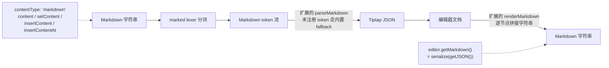

import { Meta } from '@storybook/addon-docs/blocks';

<Meta id="markdown" title="框架集成与生态/Markdown" name="Docs" />

# Markdown

`@tiptap/markdown` 是官方的 Markdown 解析与序列化包：装上它，Markdown 字符串就成了继 HTML、JSON 之后的第三种内容形态。它解决的是**整段 Markdown 作为内容进出编辑器**的问题——把一段 Markdown 载入编辑器、把编辑器文档导出成 Markdown、为自定义扩展补上 Markdown 读写能力。它与两个相邻课程分工明确：打字时 `**加粗**` 自动变格式的"Markdown 式输入规则"是编辑器内部的变换（见[快捷键与输入规则课](?path=/docs/keyboard-input-rules--docs)）；HTML 与 JSON 的离线转换是另一条管线（见[输出与静态渲染课](?path=/docs/output-rendering--docs)）。

包的管线可以用一张图概括，后面每一节都在展开它的某一段：



解析方向靠 [marked](https://marked.js.org/)（npm 依赖，随包自动安装）把 Markdown 分词，再由各扩展注册的处理函数把 token 转成 JSON；序列化方向反过来，各扩展把 JSON 节点拼回 Markdown 字符串。**扩展没写处理函数的部分：解析方向有内置 fallback 兜住常见 token，序列化方向则静默输出空串**——这是本课最重要的不对称。

说明：本工作区不安装 `@tiptap/markdown`，本课以官方文档与源码讲解为主，示例需先在自己的项目中执行 `npm install @tiptap/markdown` 再运行验证。文中行为均核对到官方 Markdown 文档与 GitHub main 分支源码（`@tiptap/markdown` 3.30.3，MIT）。

先记最常回查的入口与默认值：

| 入口 / 选项 | 方向 | 默认值与回查要点 |
| --- | --- | --- |
| `contentType: 'markdown'` | 输入 | `contentType` 默认 `'json'`；只有显式声明 `'markdown'` 的字符串才走 Markdown 解析 |
| `setContent` / `insertContent` / `insertContentAt` | 输入 | 三个命令都接受 `{ contentType: 'markdown' }` 选项 |
| `editor.getMarkdown()` | 输出 | 等价于 `editor.markdown.serialize(editor.getJSON())`，由包在编辑器创建时挂上 |
| `editor.markdown` | 双向 | `MarkdownManager` 实例，`parse()` / `serialize()` 可不经过编辑器文档 |
| `indentation` | 配置 | `{ style: 'space', size: 2 }`，控制列表与代码块缩进 |
| `markedOptions` | 配置 | 传给 `marked.setOptions()`，默认 `{}`；`gfm: true` 开启表格与任务列表 |
| `marked` | 配置 | 传入自定义 marked 实例，默认用包内置的 |
| `markdownTokenName` | 自定义 | 扩展声明自己处理哪种 token，默认等于扩展名 |
| `parseMarkdown` / `renderMarkdown` | 自定义 | 扩展上的 token→JSON 与 JSON→字符串钩子 |
| `markdownTokenizer` | 自定义 | 把非标准 Markdown 语法变成自定义 token |

## 快速上手

安装并接入一个能读写 Markdown 的编辑器：

```bash
npm install @tiptap/markdown
```

```ts
import { Editor } from '@tiptap/core'
import StarterKit from '@tiptap/starter-kit'
import { Markdown } from '@tiptap/markdown'

const editor = new Editor({
  extensions: [StarterKit, Markdown],
  // 初始内容按 Markdown 解析：没有 contentType: 'markdown' 会被当成 HTML
  content: '# Hello World\n\nThis is **Markdown**!',
  contentType: 'markdown',
})

// 输出 Markdown
const markdown = editor.getMarkdown()
// '# Hello World\n\nThis is **Markdown**!'
```

闭环成立只需两件事：扩展列表里有 `Markdown`，内容处声明 `contentType: 'markdown'`。StarterKit 覆盖的常见节点（标题、列表、代码块、加粗等）自带 Markdown 处理函数，开箱即可往返；验证方式也直给——`editor.markdown` 能打印出 `MarkdownManager` 实例，说明接入成功。

## 输入：把 Markdown 写进编辑器

Markdown 字符串进入编辑器只有一条规则：**字符串 + 显式 `contentType: 'markdown'` 才走 Markdown 解析**。入口有两类。

初始化时用 `content` 选项，Markdown 在编辑器创建的 `onBeforeCreate` 阶段被解析成 JSON，再交给正常的建文档流程，所以初始 Markdown 里的语法错误与普通内容一样受 schema 约束。此时 `content` 必须是字符串——声明了 `'markdown'` 却传入其他类型会直接抛错：

```ts
const editor = new Editor({
  extensions: [StarterKit, Markdown],
  content: '# Hello World\n\nThis is **Markdown**!',
  contentType: 'markdown',
})
```

编辑器运行中用三个内容命令，都接受 `{ contentType: 'markdown' }` 选项（命令链见[命令课](?path=/docs/commands--docs)）：

```ts
editor.commands.setContent('# New Content', { contentType: 'markdown' })
editor.commands.insertContent('**Bold** text', { contentType: 'markdown' })
editor.commands.insertContentAt(10, '## Heading', { contentType: 'markdown' })
editor.commands.insertContentAt({ from: 10, to: 20 }, '**Replace**', { contentType: 'markdown' })
```

判断规则有三条，覆盖所有取值组合：

- **字符串 + 声明 `'markdown'`**：解析成 JSON 后交给命令，等价于先 `editor.markdown.parse(content)` 再按 JSON 插入。
- **字符串 + 未声明**：一切照旧——按 HTML 解析，这是 Tiptap 的原有行为。忘写 `contentType` 是最常见的丢内容原因（见常见问题）。
- **非字符串（JSON 对象等）**：始终按 JSON 处理，`contentType` 写了 `'markdown'` 也不起作用——包内部先用 `assumeContentType` 判断，非字符串直接按 JSON 放行。

解析产出的就是普通 JSON 文档，之后与 HTML、JSON 输入走完全相同的路径，schema 之外的内容同样被过滤或降级（约束见[内容与文档模型课](?path=/docs/content-model--docs)）。

## 输出：把文档转回 Markdown

输出方向的第一入口是实例方法 `editor.getMarkdown()`。它由 Markdown 包在编辑器创建时挂到实例上，实现只有一行——把当前文档序列化：

```ts
const markdown = editor.getMarkdown()
// 内部等价于：editor.markdown.serialize(editor.getJSON())
```

不需要编辑器实例时，直接用 `editor.markdown` 这个 `MarkdownManager` 在字符串与 JSON 之间转换：

```ts
const json = editor.markdown.parse('# Hello World')
const markdown = editor.markdown.serialize(json)
```

`editor.markdown` 与 `editor.storage.markdown.manager` 是同一个实例（扩展把 manager 存进自己的 storage，再挂到编辑器上）。编辑器路径的优势是扩展自动全部注册——包在编辑器创建时把所有已装扩展交给 manager；手动 new 的 manager 则要自己注册扩展（见「MarkdownManager 独立使用」）。

两个输出行为值得知道：

- **连续空段落不会丢。** 序列化时第一个空段落输出为空行，后续连续空段落用 `&nbsp;` 标记占位，这样 Markdown 再解析回来时空段落数量不变。
- **特殊字符会被转义。** 文本里的 `` ` `` `*` `_` `[` 等字符输出时加反斜杠（如 `\*`），防止下次解析被误认成格式语法；代码块与行内代码内部不转义。

## 扩展配置

`Markdown.configure()` 有三个选项，默认值如下：

| 选项 | 默认值 | 作用 |
| --- | --- | --- |
| `indentation` | `{ style: 'space', size: 2 }` | 列表与代码块的缩进风格和宽度，`style` 可选 `'space'` 或 `'tab'` |
| `markedOptions` | `{}` | 透传给 `marked.setOptions()`，控制分词行为 |
| `marked` | `undefined` | 传入自定义 marked 实例，替代包内置的那个 |

```ts
// 用 4 个空格缩进（默认 2 个）
Markdown.configure({ indentation: { style: 'space', size: 4 } })

// 用 tab 缩进
Markdown.configure({ indentation: { style: 'tab', size: 1 } })

// 开启 GFM：表格、任务列表等扩展语法
Markdown.configure({ markedOptions: { gfm: true } })

// 整个编辑器共用一个预配置的 marked 实例
import { marked } from 'marked'
marked.setOptions({ gfm: true, breaks: true })
Markdown.configure({ marked: marked })
```

`markedOptions` 常用的取值：`gfm: true` 启用 GitHub Flavored Markdown（表格、任务列表、删除线）；`breaks: true` 把单个换行渲染成 `<br>`；`pedantic: false` 保持宽松解析。完整选项见 marked 官方文档。

还有一类"隐藏输入"：Markdown 里的 HTML 片段不走 token 解析，而是交给各扩展现有的 `parseHTML` 处理——`<div class="custom">...</div>` 能不能进文档，取决于对应扩展的 HTML 解析规则，与 HTML 输入的过滤行为一致。

## 自定义解析

让扩展认识某种 Markdown 语法，靠扩展上的两个声明：`markdownTokenName` 指定接哪种 token（省略时默认等于扩展名），`parseMarkdown(token, helpers)` 把 token 转成 JSON。官方 bold 扩展的实现就是完整示范——`bold` 节点名与 marked 的 `strong` token 名不一致，所以显式声明：

```ts
// 摘自 @tiptap/extension-bold 源码
const Bold = Mark.create({
  name: 'bold',

  markdownTokenName: 'strong', // 接住 marked 的 strong token

  parseMarkdown: (token, helpers) => {
    // 先解析标记内部的内联内容，再把 bold 标记应用上去
    return helpers.applyMark('bold', helpers.parseInline(token.tokens || []))
  },

  renderMarkdown: (node, h) => {
    return `**${h.renderChildren(node)}**`
  },
})
```

`token` 是 marked 的分词结果，常见属性有 `type`（token 类型）、`text`（原文）、`tokens`（子 token）、`depth`（标题层级）、`items`（列表项），自定义 tokenizer 还能带任意属性。`parseMarkdown` 的返回值有三种形态：单个 JSON 节点、节点数组、或标记专用的 `{ mark, content, attrs? }`（配合 `applyMark` 使用）。

helpers 是解析的主要工具，按内容层级二选一，**两个方法都不校验 token 类型，传错层级由你自己负责**：

| helper | 用途 | 返回 |
| --- | --- | --- |
| `helpers.parseInline(tokens)` | 把内联 token 解析成带 marks 的文本节点，用作节点的 `content` | `JSONContent[]` |
| `helpers.parseChildren(tokens)` | 把块级 token 解析成子节点（列表项、引用块等） | `JSONContent[]` |
| `helpers.applyMark(name, content, attrs?)` | 给解析好的内容套上标记 | `{ mark, content, attrs }` |
| `helpers.createTextNode(text, marks?)` | 直接造文本节点 | `JSONContent` |
| `helpers.createNode(type, attrs?, content?)` | 直接造任意节点 | `JSONContent` |

不写任何 `parseMarkdown` 时，包对常见 token 有内置 fallback：`paragraph` 转 `paragraph`、`heading` 转带 `level` 的 `heading`、`text` 转文本节点、`html` 走扩展的 `parseHTML`。自己的 handler 可以覆盖它们。判断某个 token 会怎么解析，直接打印分词结果最快：

```ts
const tokens = editor.markdown.instance.lexer('# Hello **World**')
console.log(JSON.stringify(tokens, null, 2))
```

## 自定义序列化

让扩展能把文档写回 Markdown，靠扩展上的 `renderMarkdown(node, helpers, context)`：`node` 是待序列化的 JSON 节点，返回值是字符串，与前后节点的输出直接拼接。两个约定要守住：返回值必须是字符串；块级节点结尾加 `\n\n` 与下一块隔开。

```ts
const CustomHeading = Node.create({
  name: 'customHeading',
  renderMarkdown: (node, helpers, context) => {
    const level = node.attrs?.level || 1
    const prefix = '#'.repeat(level)
    const content = helpers.renderChildren(node.content || [])
    return `${prefix} ${content}\n\n`
  },
})
```

helpers 与 context 承担了拼接的全部细节：

| helper | 用途 |
| --- | --- |
| `helpers.renderChildren(nodes, separator?)` | 递归渲染子节点，`separator` 默认 `''` |
| `helpers.indent(content)` | 按当前层级缩进每一行 |
| `helpers.wrapInBlock(prefix, content)` | 给每一行加前缀（引用块的 `> ` 就靠它） |
| `helpers.renderChild(node, index)` | 渲染单个子节点并保留兄弟序号 |

`context` 描述节点在文档树中的位置：`index`（父级中的序号）、`level`（嵌套层级）、`parentType`（父节点类型）、`previousNode`（前一个兄弟节点）、`meta`（父节点传下的自定义数据，含 `parentAttrs`）。依赖兄弟状态的输出（比如列表末项不加换行）从这里取判断依据。

嵌套内容（列表项套列表项）手写缩进非常繁琐，两件工具专门解决它：

- **`markdownOptions: { indentsContent: true }`**：声明"本节点的子内容要缩进一层"，manager 会把子节点放到 `level + 1` 渲染，`helpers.indent` 随之生效。
- **`renderNestedMarkdownContent(node, helpers, prefix, context)`**：从 `@tiptap/markdown` 导出的现成函数，一行完成"渲染子内容并按行加前缀"，列表项类节点的首选：

```ts
import { renderNestedMarkdownContent } from '@tiptap/markdown'

const CustomListItem = Node.create({
  name: 'customListItem',
  renderMarkdown: (node, helpers, context) => {
    return renderNestedMarkdownContent(node, helpers, '=> ', context)
  },
})
```

边界要记牢：**没有 `renderMarkdown` 的节点类型，序列化时静默输出空串**——不是报错，是内容从 Markdown 输出里消失。官方扩展（StarterKit 覆盖的常见节点、image 等）都自带 Markdown 处理函数，风险集中在没考虑 Markdown 的第三方扩展上。另一个极端场景是标记跨块级元素：`**` 语法无法跨块包裹，官方 bold 扩展为此声明了 `markdownOptions.htmlReopen`（`<strong>` / `</strong>`），用 HTML 标签在块边界重新打开标记——写跨块安全的 mark 序列化时可以照此办理。

## 自定义语法：markdownTokenizer

marked 认识的语法之外，自定义语法要先用 `markdownTokenizer` 变成自定义 token，再交给 `parseMarkdown` / `renderMarkdown` 读写。三件套构成完整闭环。以官方文档的 YouTube 嵌入为例，约定语法 ``：

```ts
const YouTubeEmbed = Node.create({
  name: 'youtubeEmbed',
  atom: true, // 自包含节点，不需要 helpers 解析子内容

  // 1) 自定义 tokenizer：从源文本识别出自定义语法，产出自定义 token
  markdownTokenizer: {
    name: 'youtube', // token 类型名，parseMarkdown 靠它接住
    level: 'inline', // 'block' 或 'inline'，默认 'inline'
    // 可选：提示 lexer 从哪里开始尝试匹配，加速扫描
    start: (src) => src.indexOf(',
    tokenize(src, tokens, lexer) {
      // 正则匹配成功则返回自定义 token，属性随意定义；
      // 失败返回 undefined 交给下一个 tokenizer
      const match = /^!\[youtube\]\(([^?)]+)\?([^)]*)\)/.exec(src)
      if (!match) {
        return undefined
      }
      // 从语法的 query 部分解析出 token 属性
      const params = new URLSearchParams(match[2])
      return {
        type: 'youtube',
        videoId: match[1],
        start: Number(params.get('start')) || 0,
        width: Number(params.get('width')) || 560,
        height: Number(params.get('height')) || 315,
      }
    },
  },

  // 2) 解析：token → JSON
  parseMarkdown: (token) => ({
    type: 'youtubeEmbed',
    attrs: {
      videoId: token.videoId || '',
      start: token.start || 0,
      width: token.width || 560,
      height: token.height || 315,
    },
  }),

  // 3) 序列化：JSON → 能被 tokenizer 读回的语法
  renderMarkdown: (node, helpers) => {
    const { videoId, start, width, height } = node.attrs || ({} as any)
    return `\n\n`
  },
})
```

`tokenize` 的签名是 `(src, tokens, lexer)`：`src` 是从候选位置开始的剩余文本，`lexer.inlineTokens(src)` / `lexer.blockTokens(src)` 用来对子文本继续分词。调好后用 `editor.markdown.instance.lexer(...)` 能看到新 token 出现在分词结果里，是确认 tokenizer 生效的第一步。

## MarkdownManager 独立使用

`MarkdownManager` 是独立的类，不依赖编辑器实例，转换脚本、服务端批处理可以直接 new：

```ts
import { MarkdownManager } from '@tiptap/markdown'
import Bold from '@tiptap/extension-bold'

const manager = new MarkdownManager({
  indentation: { style: 'space', size: 2 },
  markedOptions: { gfm: true },
})

manager.registerExtension(Bold) // 独立使用必须自己注册参与解析/序列化的扩展
manager.hasMarked() // marked 库是否可用（正常安装后为 true）

const json = manager.parse('# Hello **World**')
const markdown = manager.serialize(json)
```

完整的方法与属性清单：

| 成员 | 签名 / 默认值 | 用途 |
| --- | --- | --- |
| `parse(markdown)` | → JSON | Markdown 字符串转 Tiptap JSON |
| `serialize(content)` | → `string` | JSON 或文档内容转 Markdown |
| `registerExtension(extension)` | 逐个注册 | 注册参与解析与序列化的扩展（编辑器路径下由包自动完成） |
| `hasMarked()` | → `boolean` | 检测 marked 库是否可用 |
| `renderNodeToMarkdown(node, parentNode?, index?, level?)` | → `string` | 渲染单个节点，调试单个扩展的序列化输出 |
| `renderNodes(nodes, parentNode?, separator = '', level = 0)` | → `string` | 渲染节点数组 |
| `instance` | marked 实例 | 直接调 `lexer()` 观察分词 |
| `indentCharacter` / `indentString` | `' '` / `'  '` | 列表缩进字符与缩进串，随 `indentation` 配置派生 |

构造选项与 `Markdown.configure` 一致（`indentation`、`marked`、`markedOptions`）。与编辑器路径的唯一差别就是扩展注册：编辑器里包会把全部已装扩展交给 manager，独立使用时漏注册哪个扩展，哪个扩展的内容就在转换结果里消失。

## 最佳实践

- **解析与序列化成对写。** 自定义语法只写 `parseMarkdown` 不写 `renderMarkdown`，内容进得来出不去；反之只出不进。写完立刻做一次 `parse → serialize → parse` 的往返验证，两边输出一致才算闭环。
- **`contentType` 显式声明，不要省略。** 它是 Markdown 与 HTML 两种字符串的唯一区分手段，省略意味着按 HTML 解析。团队内把"带 `contentType` 的命令调用"定为惯例，能消灭一大类丢内容事故。
- **存储形态仍然推荐 JSON，Markdown 放在导入导出边界。** JSON 无损覆盖节点、标记与属性（结论见[内容与文档模型课](?path=/docs/content-model--docs)）；Markdown 适合人直接编辑的场景——配置文件、git 仓库里的文档、外部工具交换——进出各转换一次即可。
- **大文档控制解析与序列化频率。** 解析结果按需缓存（惰性解析），局部修改用 `insertContentAt` 增量插入新 Markdown 而不是整篇重设；序列化缓存要在文档更新时失效，注意用 `JSON.stringify` 对比全文档的开销本身也不小。

## 常见问题

- content 里明明是 Markdown，渲染出来却是纯文本，`#`、`**` 原样显示
  字符串没带 `contentType: 'markdown'`，被按 HTML 解析了——Markdown 语法符号不是合法 HTML 标签，被原样保留或过滤。给 `content` 选项或 `setContent` / `insertContent` 调用补上 `{ contentType: 'markdown' }`。
- `getMarkdown()` 的输出里某些节点的内容消失了
  该节点类型没有 `renderMarkdown`，序列化时静默输出空串。检查对应扩展是否提供 Markdown 处理函数：官方扩展大多自带，第三方扩展可能缺失——补写钩子，或导出前把这些节点先转换成有钩子的类型。
- 输出的 Markdown 里出现 `\*`、`\[` 这样的反斜杠
  文本内容本身含有 Markdown 特殊字符，序列化时加反斜杠防止下次解析被误认成格式语法，是刻意的保真行为。代码块与行内代码内部不转义。
- 初始化时抛错 "The `contentType` option is set to 'markdown', but the initial content is not a string"
  声明 `contentType: 'markdown'` 时 `content` 必须是 Markdown 字符串。已有 JSON 文档就不要声明这个选项，直接传 JSON 对象。
- `@tiptap/static-renderer` 的 `renderToMarkdown` 和本课的 `getMarkdown()` 有什么区别
  前者是静态渲染器的轻量输出，不创建编辑器、不运行扩展的 Markdown 钩子，官方注明输出未对照具体 Markdown 方言校验（见[输出与静态渲染课](?path=/docs/output-rendering--docs)）；后者基于 marked 与各扩展的 Markdown 处理函数，支持 GFM、自定义语法与精确往返。正经的 Markdown 读写选 `@tiptap/markdown`。
- TypeScript 报错说 `getMarkdown` 或 `contentType` 不存在
  这些成员由 `@tiptap/markdown` 的类型声明合并进 `@tiptap/core`，先确认包已安装且版本与 `@tiptap/core` 同为 3.x；仍报错时检查 `tsconfig.json` 的 `moduleResolution` 配置能否读取包的 `dist/index.d.ts`。

## 总结回顾

摘要：

`@tiptap/markdown` 把 Markdown 变成 Tiptap 的第三种内容形态：进入方向，`contentType: 'markdown'` 让 `content`、`setContent`、`insertContent`、`insertContentAt` 接受 Markdown 字符串，包先用 marked 分词、再由各扩展的 `parseMarkdown` 把 token 转成 JSON；离开方向，`editor.getMarkdown()`（等价于 `serialize(getJSON())`）由各扩展的 `renderMarkdown` 把文档拼回字符串，`editor.markdown` 这个 `MarkdownManager` 还能脱离编辑器文档独立转换。扩展通过 `markdownTokenName`（默认扩展名）声明接哪种 token，通过 `markdownTokenizer` 把自定义语法纳入分词；解析方向对常见 token 有内置 fallback，序列化方向没有钩子的节点静默输出空串——这个不对称加上"忘写 contentType 按 HTML 解析"，构成本课最重要的两个坑。配置面很小：`indentation` 控制缩进，`markedOptions` / `marked` 控制 GFM 等分词行为。

一句话：

> Markdown 在 Tiptap 里只是"token → JSON → 字符串"的管线，扩展各自认领自己的 token——解析缺钩子有 fallback 兜底，序列化缺钩子就无声丢内容。

知识要点：

- 把 Markdown 写进编辑器有哪几个入口？`contentType` 的三条判断规则是什么？
- `editor.getMarkdown()` 内部等价于什么？想不经过编辑器文档直接转换用哪个对象？
- `Markdown.configure` 的三个选项各控制什么？默认值分别是什么？
- 扩展上让某种 Markdown 语法可读、可写的钩子分别叫什么？token 名与扩展名不一致时怎么声明？
- `parseMarkdown` 的 helpers 里 `parseInline` 与 `parseChildren` 怎么选？返回值有哪三种形态？
- `renderMarkdown` 怎么让子内容多缩进一层？嵌套列表项推荐用什么现成函数？
- 非 marked 标准语法要走哪三个声明才能完整读写？
- 哪些情况会导致内容从 Markdown 输出里静默消失？怎么排查？

## 参考资料

- [Install Markdown | Tiptap Editor Docs](https://tiptap.dev/docs/editor/markdown/getting-started/installation)
- [Markdown Basic Usage | Tiptap Editor Docs](https://tiptap.dev/docs/editor/markdown/getting-started/basic-usage)
- [Custom Parsing | Tiptap Editor Docs](https://tiptap.dev/docs/editor/markdown/advanced-usage/custom-parsing)
- [Custom Serializing | Tiptap Editor Docs](https://tiptap.dev/docs/editor/markdown/advanced-usage/custom-serializing)
- [MarkdownManager API | Tiptap Editor Docs](https://tiptap.dev/docs/editor/markdown/api/markdown-manager)
- [@tiptap/markdown 源码（packages/markdown） | tiptap GitHub](https://github.com/ueberdosis/tiptap/tree/main/packages/markdown)
