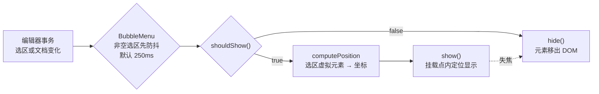

import { Canvas, Controls, Meta } from '@storybook/addon-docs/blocks';
import * as MenusStories from './menus.stories';

<Meta of={MenusStories} name="Docs" />

# 菜单

Tiptap 的编辑器本体不带任何菜单。BubbleMenu 与 FloatingMenu 两个扩展负责「菜单什么时候出现、出现在哪里」，菜单本身长什么样、有什么按钮，完全由你提供的 DOM 元素决定——这是 headless 思路在菜单上的体现：扩展注册一个 ProseMirror 插件，在事务流里用 `shouldShow` 裁决显隐，把你的元素挂到编辑器旁边，用 Floating UI 按选区或光标位置定位；`element` 不传，插件干脆不注册。两个扩展共享这一套机制，差别只在默认显示条件：BubbleMenu 盯「非空文本选区」（选中文字弹气泡菜单），FloatingMenu 盯「顶层空文本块」（光标停在空段落弹插入菜单）。

看完开场图和参考表，你应该能预测：选中文字后菜单多久出现、光标停在什么位置才弹浮动菜单、把编辑器放进 `overflow: hidden` 的容器后菜单会怎样。



| 选项 | BubbleMenu 默认 | FloatingMenu 默认 | 回查要点 |
| --- | --- | --- | --- |
| `element` | `null`（必配） | `null`（必配） | 菜单 DOM 由使用者提供；不传则整个插件不注册 |
| `pluginKey` | `'bubbleMenu'` | `'floatingMenu'` | 事务 meta 的钥匙，多实例时用于区分 |
| `updateDelay` | `250` | `250` | 显隐更新的防抖毫秒数（BubbleMenu 对非空选区生效） |
| `resizeDelay` | `60` | `60` | 窗口 resize 后重定位的防抖 |
| `shouldShow` | 默认显示条件 | 默认显示条件 | 返回值完全接管显隐 |
| `appendTo` | 编辑器的父元素 | 编辑器的父元素 | 可传元素或函数，决定裁剪上下文 |
| `options` | `strategy: 'absolute'`、`placement: 'top'`、`offset: 8` | 同左，`placement: 'right'` | 直通 Floating UI `computePosition` |
| `getReferencedVirtualElement` | — | — | 自定义定位参照，返回 `null` 回落到选区 |
| 注册命令 | — | `updateFloatingMenuPosition()` | 手动触发重定位 |

上表默认值对照本工作区安装的 v3.31.4 源码核对过（见参考资料），个别数值与官方文档页的表格不一致时以源码为准。

## 快速上手

三步：建菜单元素 → `configure` 传入 → 触发显示条件。StarterKit 不包含这两个菜单扩展，因为菜单元素必须由使用者提供：

```ts
import { Editor } from '@tiptap/core';
import { BubbleMenu } from '@tiptap/extension-bubble-menu';
import { FloatingMenu } from '@tiptap/extension-floating-menu';
import { StarterKit } from '@tiptap/starter-kit';

// 1. 菜单 DOM 自己建：扩展不提供任何 UI
const bubbleEl = document.createElement('div');
bubbleEl.innerHTML = '<button type="button">加粗</button>';

const editor = new Editor({
  element: document.querySelector('#app'),
  extensions: [
    StarterKit,
    // 2. 装扩展时把元素交给它；3. 选中文字或点到空段落触发显示
    BubbleMenu.configure({ element: bubbleEl }),
    FloatingMenu.configure({ element: document.createElement('div') }),
  ],
  content: '<p>选中文字弹气泡菜单，光标停在空段落弹浮动菜单。</p>',
});
```

按钮的事件绑定、显隐判断与定位微调见下面两节实例。React / Vue 用户通常改用官方菜单组件包装这两个扩展，组件只是把 `element` 的创建与 `shouldShow` 的接法变成 props，机制与本课相同（见[React 集成课](?path=/docs/react--docs)、[Vue 集成课](?path=/docs/vue--docs)与 [UI Components 课](?path=/docs/ui-components--docs)）。

## 显示条件

显隐只有一个裁判：每次事务后插件调用 `shouldShow({ editor, element, view, state, oldState, from, to })`，返回 `true` 就定位并显示，返回 `false` 就隐藏——显示中的菜单元素被移出 DOM，隐藏后由插件在下次显示时重新挂载。默认显示条件是这个回调的缺省实现，两个扩展各不相同：

| 条件 | BubbleMenu | FloatingMenu |
| --- | --- | --- |
| 编辑器聚焦（`view.hasFocus()`；BubbleMenu 另接受焦点在菜单内） | 是 | 是 |
| 可编辑（`editor.isEditable`） | 是 | 是 |
| 选区 | 非空 | 空（光标） |
| 内容 | 选区内有文字；选中图片等节点选区也算 | 顶层（`$anchor.depth === 1`）空文本块，且不是代码块 |

隐藏的触发不止 `shouldShow`：编辑器失焦会直接隐藏，BubbleMenu 在开始拖拽选区时也会隐藏；点击菜单内部不会——插件在 mousedown 捕获阶段标记 preventHide，并给菜单元素设置 `tabIndex = 0`，让焦点进菜单也算「没离开」。菜单上的按钮执行命令仍建议 `chain().focus()…run()`，把焦点送回编辑器（见[命令课](?path=/docs/commands--docs)）。

自定义 `shouldShow` 后完全接管，默认条件不再参与：

```ts
BubbleMenu.configure({
  element: bubbleEl,
  // 只有选区处于加粗状态（或链接内）时显示
  shouldShow: ({ editor }) => editor.isActive('bold') || editor.isActive('link'),
});
```

`shouldShow` 每次事务都会被调用，里面只做便宜判断（`isActive`、选区检查）；重计算放到按钮点击回调里。一个时间差值得知道：BubbleMenu 对非空选区的显隐更新有 `updateDelay` 防抖（默认 250ms），FloatingMenu 当前版本即时显隐、`updateDelay` 存而未用（源码核对）。

### Bubble menu：选中文字才显示

下面的实例把默认条件、`shouldShow` 接管与防抖延迟放进同一台编辑器，读数实时显示菜单可见性与选区状态。

<Canvas of={MenusStories.BubbleShow} />
<Controls of={MenusStories.BubbleShow} />

| 读者操作 | 可观察证据 |
| --- | --- |
| 选中一段文字 | 约 250ms 后「菜单可见」变「是」，菜单出现在选区上方 |
| 把 updateDelay 切到 0 再选中 | 菜单立即出现——延迟来自 250ms 的默认防抖 |
| 光标点进文字中间（空选区） | 「选区 from–to」读数为「空」，菜单不出现——默认条件要求非空选区 |
| shouldShow 切到「仅加粗选区」 | 选中普通文字不显示，选中「已有加粗」才显示——返回值完全接管默认条件 |
| 点菜单上的「加粗」 | 「加粗」读数翻转，菜单保持可见——菜单内点击不隐藏 |
| 点页面其他位置 | 「菜单可见」回到「否」——失焦直接隐藏 |
| 打开 Show code | 看到该 Canvas 实际执行的 `bubble-show.ts` |

### Floating menu：空段落才显示

默认条件里的「顶层」指光标锚点 `$anchor.depth === 1`——直接挂在文档下的文本块；引用块、列表项里的空段是 depth 2，不显示。「空」指该文本块没有子节点也没有文字，代码块除外。

<Canvas of={MenusStories.FloatingShow} />
<Controls of={MenusStories.FloatingShow} />

| 读者操作 | 可观察证据 |
| --- | --- |
| 点第一段（空段落） | 「光标位置」读数 depth 1 · 空，菜单出现在该行右侧——placement 默认 right |
| 切换 placement 为 top / bottom / left | 菜单换到参照矩形的对应一侧 |
| 点第二段（有文字） | 读数 depth 1 · 非空，菜单隐藏——默认条件要求空文本块 |
| 点引用块里的空段 | 读数 depth 2 · 空，菜单不出现——默认条件要求顶层 |
| 在空段落里输入文字 | 读数变 depth 1 · 非空，菜单立即消失 |
| 点菜单上的「引用」 | 空段落被包进引用块，读数变 depth 2，菜单随之隐藏 |
| 打开 Show code | 看到该 Canvas 实际执行的 `floating-show.ts` |

## 定位策略

菜单的定位参照是选区的**虚拟元素**：插件把选区包成一个提供 `getBoundingClientRect` 的假元素，交给 Floating UI 的 `computePosition` 算出坐标。虚拟元素的来源按选区类型自动选择——文本选区取首尾位置 DOMRect 的并集（`posToDOMRect`），节点选区直接取节点 DOM 的矩形（Node View 取 wrapper），表格单元格选区合并两个单元格的矩形。要贴着别的元素定位（比如图片工具条贴图片、锚点菜单贴锚点），用 `getReferencedVirtualElement` 返回自定义参照。

`options` 对象直通 `computePosition`，常用键如下：

| options 键 | 默认 | 作用 |
| --- | --- | --- |
| `placement` | `'top'`（BubbleMenu）/ `'right'`（FloatingMenu） | 菜单贴在参照矩形的哪一侧 |
| `strategy` | `'absolute'` | `'fixed'` 改为相对视口定位，逃出 overflow 裁剪 |
| `offset` | `8` | 与参照矩形的主轴距离 |
| `flip` | `{}`（开启） | 目标侧放不下时翻到对面 |
| `shift` | `{}`（开启） | 视口边缘滑动夹紧，不超出屏幕 |
| `arrow` | `false` | 配置后启用箭头中间件 |
| `scrollTarget` | `window` | 监听哪个元素的 scroll 事件重定位（容器内滚动要指向容器） |

挂载点由 `appendTo` 决定，默认是**编辑器的父元素**（v3.31.4 两个扩展一致；更早版本的 FloatingMenu 曾默认 `document.body`，以所用版本源码为准）。挂载点决定 `absolute` 菜单的定位基准，也决定它被哪个 `overflow` 上下文裁剪。

位置更新发生在每次事务之后，窗口 resize（`resizeDelay` 防抖）与 `scrollTarget` 的滚动也会触发。程序化修改内容后需要立即校正时，用事务 meta 或命令手动刷新：

```ts
// BubbleMenu：用 pluginKey 发 meta
editor.view.dispatch(editor.state.tr.setMeta('bubbleMenu', 'updatePosition'));

// FloatingMenu：装扩展后自带命令
editor.commands.updateFloatingMenuPosition();
```

meta 还接受 `'show'` / `'hide'` 强制显隐，以及 `{ type: 'updateOptions', options }` 在运行时改配置。

### 溢出裁剪与挂载点

编辑器放在卡片、侧栏这类 `overflow: hidden` 容器里时，默认挂载点也在容器内——菜单照常显示，却被容器边缘裁掉。修复有两条路：`options.strategy: 'fixed'` 改为相对视口定位，或 `appendTo` 把菜单挂到容器外。下面的实例把三种配置放进同一个被裁剪的场景。

<Canvas of={MenusStories.MenuClipping} />
<Controls of={MenusStories.MenuClipping} />

| 读者操作 | 可观察证据 |
| --- | --- |
| 选中容器顶部第一段文字 | 「菜单可见」已是「是」，菜单却被容器上边缘裁掉 |
| 切「溢出处理」为 strategy fixed | 菜单改为相对视口定位，完整显示 |
| 切「溢出处理」为 appendTo body | 菜单同样完整显示，「菜单挂载点」读数变为 body |
| 打开 Show code | 看到该 Canvas 实际执行的 `menu-clipping.ts` |

## 最佳实践

- **菜单按钮三件套照旧：** 高亮用 `isActive`、禁用用 `can()`、执行用 `chain().focus()…run()`；显隐逻辑全部交给 `shouldShow`，不要在业务代码里手动改菜单元素的样式或位置。
- **同页多个菜单用不同 `pluginKey`。** 每个插件实例只服务一个 `element`；一个编辑器要两个气泡菜单（格式菜单 + 链接编辑浮层）时，各自 `configure` 并用不同 `pluginKey`，事务 meta 才不会串扰。
- **容器裁剪换 strategy 或挂载点，不要硬调 z-index。** 裁剪是 `overflow` 上下文问题，z-index 无解；`strategy: 'fixed'` 与 `appendTo` 任选其一（实例三）。
- **`shouldShow` 保持轻量。** 它随每次事务执行，重判断（解析内容、查网络状态）应移到显示后的交互环节。

## 常见问题

- 选中了文字，气泡菜单没出现
  依次排查：`configure` 是否传了 `element`（不传则整个插件不注册）；编辑器是否聚焦且 `editable`；选区是否真的非空（光标停在文字上不显示）；自定义的 `shouldShow` 是否返回了 false；刚选中后等约 250ms——`updateDelay` 默认防抖，不是失效。
- 点击菜单按钮后命令没生效
  按钮点击会把焦点移给按钮，命令链首加 `.focus()` 把焦点送回编辑器；仍无效果时用 `can()` 预检当前位置是否允许该命令。菜单本体不会因点击而隐藏（preventHide + `tabIndex = 0`），若自定义代码在 blur 时手动隐藏菜单，需自查该分支。
- 菜单只显示了一半或完全看不见
  挂载点落在带 `overflow: hidden` 的容器里，被容器边缘裁剪；用 `options.strategy: 'fixed'` 或 `appendTo` 换挂载点（见溢出裁剪实例）。注意祖先元素带 `transform` 时 `fixed` 的定位基准会变成该祖先，此时只能换 `appendTo`。
- 程序化修改内容后菜单位置不对
  插件只在事务、window resize 与 `scrollTarget` 滚动后重定位；编辑器在容器里滚动时把容器传给 `options.scrollTarget`，程序化改内容后用 `tr.setMeta(pluginKey, 'updatePosition')` 或（FloatingMenu）`updateFloatingMenuPosition()` 命令手动刷新。
- 想让菜单显示但默认条件不满足
  写 `shouldShow` 接管显隐，例如空选区也要显示格式菜单：`shouldShow: ({ editor }) => editor.isFocused`。默认条件只在未传 `shouldShow` 时生效，两者不叠加。

## 总结回顾

摘要：

菜单扩展不提供 UI：你创建菜单元素交给 `configure`，插件接管显隐与定位——每次事务后用 `shouldShow` 裁决，返回 true 就把元素挂到挂载点（默认编辑器的父元素），按选区虚拟元素用 Floating UI 定位。BubbleMenu 的默认条件是「聚焦、可编辑、非空且有文字的选区」，对非空选区有 250ms 防抖；FloatingMenu 的默认条件是「聚焦、可编辑、顶层（depth 1）空文本块」，即时显隐——气泡菜单实例与浮动菜单实例分别用读数验证了两组条件。自定义 `shouldShow` 完全接管默认条件；点击菜单不隐藏（preventHide 与 `tabIndex`），失焦与拖拽直接隐藏。定位由 `options` 直通 `computePosition`：placement 默认 top / right、offset 8、flip 与 shift 默认开启；裁剪实例演示了 `overflow: hidden` 容器内菜单被裁的现象与两条修复路——`strategy: 'fixed'` 或 `appendTo` 换挂载点；程序化改动后用 pluginKey meta 或 `updateFloatingMenuPosition()` 命令手动重定位。

一句话：

> 菜单扩展只管「何时显示、显示在哪」：显隐由 shouldShow 裁决，位置由选区虚拟元素加 Floating UI 决定，菜单 DOM 与按钮行为始终是你的代码。

知识要点：

- 两个菜单扩展提供什么、不提供什么？不传 `element` 会怎样？
- BubbleMenu 与 FloatingMenu 的默认显示条件分别是哪几条？自定义 `shouldShow` 后默认条件还参与吗？
- 选中文字后菜单为什么延迟出现？哪个控件能对比防抖前后？
- FloatingMenu 为什么不在引用块内的空段落出现？depth 条件是什么？
- 菜单的定位参照矩形从哪来？`placement`、`offset` 的默认值各是多少？
- 菜单被容器裁剪的原因是什么？两条修复路分别改什么？
- 怎么手动触发重定位？两个扩展分别怎么写？
- 点击菜单为什么不会隐藏菜单？焦点如何回到编辑器？

## 参考资料

- [BubbleMenu | Tiptap Editor Docs](https://tiptap.dev/docs/editor/extensions/functionality/bubble-menu)
- [FloatingMenu | Tiptap Editor Docs](https://tiptap.dev/docs/editor/extensions/functionality/floatingmenu)
- [Custom menu | Tiptap Editor Docs](https://tiptap.dev/docs/editor/getting-started/style-editor/custom-menus)
- [BubbleMenuPlugin 默认值与默认 shouldShow | @tiptap/extension-bubble-menu 源码](https://github.com/ueberdosis/tiptap/blob/main/packages/extension-bubble-menu/src/bubble-menu-plugin.ts)
- [FloatingMenuPlugin 默认值与默认 shouldShow | @tiptap/extension-floating-menu 源码](https://github.com/ueberdosis/tiptap/blob/main/packages/extension-floating-menu/src/floating-menu-plugin.ts)
- [computePosition | Floating UI Docs](https://floating-ui.com/docs/computePosition)
