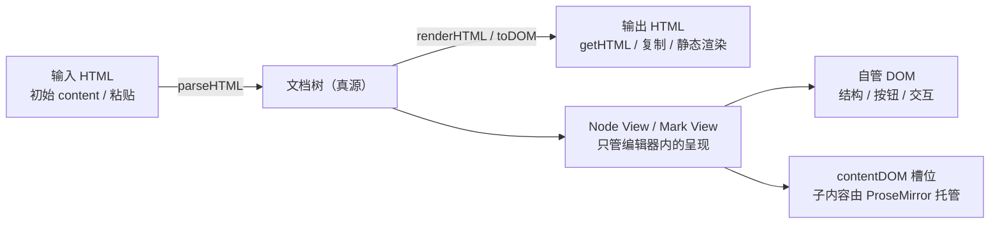

import { Canvas, Controls, Meta } from '@storybook/addon-docs/blocks';
import * as NodeViewsStories from './node-views.stories';

<Meta of={NodeViewsStories} name="Docs" />

# Node View 与 Mark View

到此为止，自定义扩展在编辑器里的样子一直由 schema 的 renderHTML 一手包办：它吐出什么 DOM，编辑器里就长什么样。这一课把"编辑器内这一块屏幕"的控制权单独拿出来——Node View 与 Mark View。核心判断一句话：**schema 声明继续决定输入与输出，node view 只接管编辑器内的呈现与交互**；代价是必须接住 ProseMirror 的生命周期契约——contentDOM 槽位、update 的复用或重建、事件与 DOM 变更的边界。

本课回答四个问题：什么时候需要 node view；最小可用的一版怎么写；嵌套内容怎么继续可编辑（contentDOM）；自管 DOM 的生命周期如何运作（update / selectNode / destroy / stopEvent / ignoreMutation）。Mark View 一节讲行内标记的差异点。看完两张参考表和两个实验台，你应该能预测：点 node view 里的按钮时事务怎么走、属性变化后视图是复用还是重建、`getHTML()` 为什么和编辑器里的 DOM 长得不一样。从零编写扩展声明与命令的流程见[自定义 Node 与 Mark 课](?path=/docs/custom-node-mark--docs)，schema 声明字段的完整清单见[Schema、节点与标记课](?path=/docs/schema-nodes-marks--docs)。



`addNodeView()` 渲染函数收到的入参（`addMarkView()` 只收到其中标记相关的一列）：

| 入参 | 谁收到 | 用途 |
| --- | --- | --- |
| `node` | 仅 Node View | 当前节点的快照，读 `node.attrs` 靠它 |
| `mark` | 仅 Mark View | 当前标记的快照，读 `mark.attrs` 靠它 |
| `view` | 两者 | ProseMirror 的 EditorView，手工 dispatch 事务用 |
| `editor` | 两者 | Tiptap 编辑器实例，调命令、读状态 |
| `getPos` | 仅 Node View | 当前节点在文档中的位置；节点被删除后拿不到值，必须判空 |
| `HTMLAttributes` | 两者 | 属性级 renderHTML 的产物，vanilla 写法要自己挂到 dom 上 |
| `decorations` / `innerDecorations` | 仅 Node View | 落在节点与其内容上的装饰，详见[Decorations 与插件课](?path=/docs/decorations-plugins--docs) |
| `inline` | 仅 Mark View | 标记的内容是否行内 |
| `updateAttributes` | 仅 Mark View | 改这一处标记属性的助手，不用自己算位置 |

返回对象可用的成员与缺省行为（Node View 全部可用，Mark View 支持 `dom` / `contentDOM` / `update` / `ignoreMutation` / `destroy`）：

| 成员 | 作用 | 不定义时（默认） |
| --- | --- | --- |
| `dom` | 必填，视图的外层容器 | — |
| `contentDOM` | 嵌套内容的槽位 | Mark View：dom 自身就是内容容器；Node View：内容全部自管，光标进不来 |
| `update` | 同类型节点 / 标记更新时决定复用还是重建 | 有 contentDOM 的节点属性一变就整棵重建；叶子节点 markup 未变则续用 |
| `selectNode` / `deselectNode` | 节点选区选中与移除时的钩子 | 加上 / 去掉 `ProseMirror-selectednode` 类 |
| `setSelection` | 定制选区落进节点时的 DOM 选区 | 按文档位置创建默认 DOM 选区 |
| `stopEvent` | 拦截从视图冒泡的事件 | 返回 false，编辑器照常处理所有事件 |
| `ignoreMutation` | 返回 true 让编辑器忽略某次 DOM 变更 | 没有 contentDOM 时全部忽略；有 contentDOM 则重新解析受影响范围 |
| `destroy` | 视图被移除或编辑器销毁时清理 | — |

## 快速上手：一个最小的 Node View

官方给出的完整流程是四步：创建节点扩展 → 用 `addNodeView()` 注册视图 → 写渲染函数 → 把扩展装进编辑器。渲染函数收进入参表里的那些 props，返回一个至少带 `dom` 的对象：

```ts
import { Node, mergeAttributes } from '@tiptap/core'

const VideoCard = Node.create({
  name: 'videoCard',
  group: 'block',

  addAttributes() {
    return {
      views: { default: 0 },
    }
  },

  // 输出契约不因 node view 而变：getHTML / 粘贴仍走这两条声明
  parseHTML() {
    return [{ tag: 'div[data-video-card]' }]
  },
  renderHTML({ HTMLAttributes }) {
    return ['div', mergeAttributes({ 'data-video-card': '' }, HTMLAttributes), 0]
  },

  // 编辑器内渲染：返回渲染函数，函数返回 { dom }
  addNodeView() {
    return ({ node, HTMLAttributes }) => {
      const dom = document.createElement('div')
      dom.setAttribute('data-video-card', '')
      // HTMLAttributes 要自己挂上去——框架包装器（React/Vue）会代劳，vanilla 不会
      for (const [name, value] of Object.entries(HTMLAttributes)) {
        dom.setAttribute(name, String(value))
      }
      dom.textContent = `视频卡片（播放量 ${node.attrs.views}）`
      return { dom }
    }
  },
})
```

只有 `dom` 的视图没有任何可编辑内容，适合纯展示节点。两个设计决定值得注意：**node view 与输出无关是官方刻意的设计**——编辑器里可以做交互播放器界面，`getHTML()` 输出的仍只是 renderHTML 声明的那个空壳标签，JSON 输出更不受影响；node view 在只读编辑器里同样生效，所以预览端也能用同一套视图。

需要复杂 UI 时，React / Vue 有各自的包装器（`ReactNodeViewRenderer` + `NodeViewWrapper` 等），把渲染函数换成组件，生命周期契约不变——那是[React 集成课](?path=/docs/react--docs)与[Vue 集成课](?path=/docs/vue--docs)的主题，本课只做 vanilla 版本。

## contentDOM：把内容交给 ProseMirror

自管 DOM 不等于自管内容。返回对象里多给一个 `contentDOM`，ProseMirror 就会把 schema 允许的子内容装进这个元素——**你必须把它显式 append 进 `dom` 的某个位置**，它就是内容洞：

```ts
// 官方文档的最小结构：非编辑标签 + 可编辑内容
const dom = document.createElement('div')

const label = document.createElement('span')
label.textContent = 'Node view'
label.contentEditable = 'false'   // 非编辑区手动关掉可编辑

const contentDOM = document.createElement('div')

dom.append(label, contentDOM)     // contentDOM 必须显式挂进 dom

return { dom, contentDOM }
```

能装进这个洞的依旧是 schema 说的算：节点声明了 `content: 'inline*'` 就装行内内容，声明 `block+` 就装块级内容。官方把这条排在嵌套视图指南最前面——**Schema first**：嵌套内容不渲染时，先回头查父子节点的 `content` 表达式，再查视图代码。不给 `contentDOM` 的视图（或叶子节点）则完全自管渲染，光标进不去，适合 mention 这类原子块。

混合内容有一条经验：凡是不想被光标点进去的元素（按钮、标签、图标），手动加 `contenteditable="false"`，否则光标可能落到自管区域里造成选区错乱。本课的计数卡就是"头部非编辑区 + contentDOM 内容区"的混合结构。

## 读写属性与事件交互

属性读取直接走进入参的节点 / 标记快照：`node.attrs.count`。属性写入走事务：Node View 用 `getPos()` 定位再 `setNodeMarkup`，这是官方文档的写法；Mark View 更省事，渲染函数直接送来 `updateAttributes` 助手，它在文档里找到这一处标记实例并改写属性。两件事各有一个坑：`getPos()` 在节点刚被删除后拿不到值，调用前判空；按钮点击会把焦点抢走，官方示例随后调用 `editor.commands.focus()` 把焦点还给编辑器。

```ts
// Node View 里改属性（官方文档写法）：getPos 定位 + setNodeMarkup
button.addEventListener('click', () => {
  const pos = getPos()
  if (typeof pos !== 'number') return        // 节点已删除，拿不到位置
  view.dispatch(view.state.tr.setNodeMarkup(pos, undefined, {
    count: node.attrs.count + 1,
  }))
  editor.commands.focus()                    // 把焦点还给编辑器
})

// Mark View 里改属性：用入参里的助手，不用自己算位置
dom.addEventListener('click', () => {
  updateAttributes({ level: 'warn' })
})
```

事件交互默认不需要额外配置：`stopEvent` 不定义时编辑器照常处理所有冒泡事件，按钮的 `click` 监听照常触发。当自管区域里的交互不该被编辑器接管时（比如视图里嵌了输入框、滚动容器），才定义 `stopEvent`——对不希望编辑器处理的事件返回 true 即可。

## 生命周期：复用还是重建

自管 DOM 的代价在生命周期里偿还。文档每次更新，ProseMirror 会拿着新的节点 / 标记询问视图：`update(node)` 返回 true 表示"我复用现有 DOM 自己刷新"，返回 false 表示"放弃，重建整个视图"。`update` 只会收到同类型节点（想让一个视图服务多种节点需声明 `multiType`）。不定义 `update` 时也有默认规则：有 contentDOM 的非叶子节点，属性一变（markup 不再相同）就整棵重建；叶子节点 markup 未变则原地续用。其余成员各司其职——`selectNode` / `deselectNode` 响应节点选区，`destroy` 在节点被删除或编辑器销毁时给你清理的机会。

下面的实验台把这条契约做成可观察的证据：计数卡头部有两个按钮（走 `setNodeMarkup` 改 `count`），内容区是 contentDOM 槽位；右侧日志实时记录视图事件，读数统计 `update()` 与 `destroy()` 次数。切换 Controls 里的「定义 update 方法」，同一动作会走出两条不同的生命周期路径。

<Canvas of={NodeViewsStories.NodeViewLab} />
<Controls of={NodeViewsStories.NodeViewLab} />

| 读者操作 | 可观察证据 |
| --- | --- |
| 点卡片头部的「+1」 | 读数 count 与 update() 次数同步 +1，destroy 不变——DOM 被复用，只有头部文案刷新；日志新增 update()（点在头部还会顺带选中卡片，出现 selectNode()） |
| 关掉「定义 update 方法」再点「+1」 | 日志出现 destroy() + create() 一对，update() 计数保持 0——没有 update 就整棵重建，内容区文字被重新装进新的 contentDOM |
| 点「选中计数卡」，再点进内容区打字 | selectNode() / deselectNode() 成对出现，读数「节点选区选中」随之切换，卡片边框高亮同步变化 |
| 点进卡片内容区编辑文字 | 文字改动不经过 node view 的任何钩子——子内容由 ProseMirror 托管，视图只提供槽位 |
| 打开 Show code | 看到该 Canvas 实际执行的 `counter-card.ts` |

两个容易忽略的细节都在实验台里可见：其一，`update` 复用 DOM 时闭包里的 `node` 还是旧快照，必须手动换成 `update` 收到的新节点，否则下次点按钮会基于旧值计算；其二，读 count 要读文档树（`editor.state.doc`），不要从自管 DOM 里反读——文档才是真源。

## Mark View：行内标记的自管 DOM

Mark View 与 Node View 共用一套契约，差异有三点：注册在 `Mark.create` 的 `addMarkView()` 上；渲染函数收到的 props 换成了 `mark` / `inline` / `updateAttributes`；`contentDOM` 不传时 **dom 自身就是内容容器**，被标记的文字直接由 ProseMirror 装进 dom。要分离容器与内容（比如外层做徽标底、内层放文字），就显式传一个 `contentDOM`——官方文档提示此时给它设 `contenteditable = 'true'` 保证可编辑。`update(mark)` 的语义与 Node View 相同：返回 true 复用 DOM 自己刷新，返回 false 重建。

```ts
// 官方文档的最小 Mark View：dom + contentDOM 两层
addMarkView() {
  return ({ mark, HTMLAttributes, updateAttributes }) => {
    const dom = document.createElement('b')
    const contentDOM = document.createElement('span')

    contentDOM.contentEditable = 'true'
    dom.appendChild(contentDOM)

    return { dom, contentDOM }
  }
}
```

下面的实验台里，badge 标记渲染成可点击的徽标：点击徽标本身就用 `updateAttributes` 循环切换等级，右侧的 `getHTML()` 输出与编辑器里的两层 DOM 结构并排对照。

<Canvas of={NodeViewsStories.MarkViewLab} />
<Controls of={NodeViewsStories.MarkViewLab} />

| 读者操作 | 可观察证据 |
| --- | --- |
| 点编辑器里的徽标 | 等级按 info → warn → error 循环切换，日志新增 update()——DOM 被复用，只换了 data-badge |
| 关掉「定义 update 方法」再点徽标 | 日志出现 destroy() + create() 一对——等级变化触发整棵重建 |
| 选中一段普通文字后点「挂 / 摘 badge」 | 文字挂上默认 info 等级的徽标（create()）；再点一次摘掉，日志出现 destroy() |
| 对照右侧 getHTML() | 输出只有 `<span data-badge="…">`——mark view 的两层结构、class、点击行为一概不出现在输出里 |
| 打开 Show code | 看到该 Canvas 实际执行的 `badge-mark.ts` |

官方在 Node view examples 页收集了拖拽把手、编辑器内绘图等完整示例（声明为示例代码、不承诺维护），需要成型的做法时先去那里找参考。

## 最佳实践

- **输入输出留在 schema 声明里，node view 只管编辑器内。** parseHTML / renderHTML 是唯一的数据契约，node view 里别存业务状态——要数据读文档树，要输出改声明。
- **Schema first。** 内容不渲染、嵌套视图不出现，先查 `content` 表达式，再查 contentDOM 是否 append 进了 dom；这两处覆盖了绝大多数"视图不工作"的问题。
- **有属性交互的视图写 `update` 返回 true。** 复用 DOM 比整棵重建便宜，还保住了焦点与滚动位置；复用时记得把闭包里的 node / mark 换成新快照。
- **非编辑区手动 `contenteditable="false"`，按钮点击后 `focus()` 还焦。** 防止光标落进自管区域，是官方混合内容指南的明确建议。
- **`destroy` 里清理全局副作用。** 计时器、window 级监听、外部组件实例都在这里摘除，节点频繁增删时才不会泄漏。
- **复杂 UI 升级到框架包装器。** vanilla 适合轻交互；组件树、状态管理交给 React / Vue 的 NodeViewWrapper 模式（生命周期契约与本课一致）。

## 常见问题

- 插入节点成功了，但内容区空白或不可编辑
  按顺序查三处：节点的 `content` 表达式是否允许当前子内容（Schema first）；`contentDOM` 是否真的 append 进了 `dom`；非编辑区是否漏了 `contenteditable="false"`，导致光标永远进不了内容区。嵌套视图还要确认每个子节点有自己的视图。
- 点了按钮，界面没反应或报错
  先判空 `getPos()`——节点刚被删除时拿不到位置，直接 dispatch 会出错；再确认属性写入走的是事务（`setNodeMarkup` / `updateAttributes`），直接改 DOM 会被下一次文档同步覆盖。
- 属性变了，视图显示却是旧值
  两种可能：定义了 `update` 但没有用收到的 `node` / `mark` 快照刷新（返回 true 后 ProseMirror 不会再帮你刷新自管部分）；或者闭包里的 `node` 没有换成新快照，下一次交互基于旧值计算。
- 自管区域里的 DOM 变更（如动画改样式）触发编辑器重新解析
  定义 `ignoreMutation`：发生在 contentDOM 之外的变更返回 true 让编辑器忽略。默认规则只保护"没有 contentDOM"的视图，混合内容视图需要自己划定边界。
- 想要 React / Vue 组件版的 node view
  生命周期契约与本课完全一致，只是渲染函数换成 `ReactNodeViewRenderer(Component)` / `VueNodeViewRenderer(Component)`，组件里用 `NodeViewWrapper` / `NodeViewContent` 声明容器与槽位——分别见[React 集成课](?path=/docs/react--docs)与[Vue 集成课](?path=/docs/vue--docs)。

## 总结回顾

摘要：

Node View 与 Mark View 把"编辑器内长什么样"的控制权从 schema 的 toDOM 移交给扩展自管：`addNodeView()` / `addMarkView()` 注册一个渲染函数，返回 `{ dom, contentDOM, … }`，schema 声明（parseHTML / renderHTML）继续独占输入与输出，getHTML 永远不走视图的 DOM。contentDOM 是嵌套内容的槽位，必须显式 append 进 dom，能装什么由 content 表达式决定（Schema first）；mark view 不传 contentDOM 时 dom 自身就是内容容器。属性读取走进入参的 node / mark 快照，写入走事务——Node View 用 `getPos()` + `setNodeMarkup`（记得判空），Mark View 用现成的 `updateAttributes` 助手。生命周期是自管的代价：`update` 返回 true 复用 DOM 自己刷新、返回 false 整棵重建，不定义时属性一变就重建；`selectNode` / `deselectNode` 响应节点选区，`stopEvent` 收窄编辑器的事件处理，`ignoreMutation` 划定 DOM 变更的忽略边界，`destroy` 负责清理。节点视图实验台用 update / destroy 计数让"复用还是重建"直接可观察，标记视图实验台把编辑器内的徽标与 getHTML 输出并排对照，验证视图与输出无关。

一句话：

> schema 管输入输出，视图管编辑器内：contentDOM 交内容，update 定复用，destroy 做清理。

知识要点：

- 什么时候需要 Node View？renderHTML 与 node view 各自负责什么？输出（getHTML / JSON）会不会包含视图的 DOM？
- 渲染函数能收到哪些入参？`getPos` 为什么要判空？Mark View 比 Node View 多了什么、少了什么？
- contentDOM 的契约是什么？内容不显示时按什么顺序排查？混合内容为什么要手动关可编辑？
- `update` 返回 true / false 分别意味着什么？不定义 `update` 时默认行为是什么？复用 DOM 时闭包里的 node 要做什么？
- `selectNode` / `stopEvent` / `ignoreMutation` / `destroy` 各自的默认行为是什么？

## 参考资料

- [Create a custom node view | Tiptap Editor Docs](https://tiptap.dev/docs/editor/extensions/custom-extensions/node-views)
- [Node views with JavaScript | Tiptap Editor Docs](https://tiptap.dev/docs/editor/extensions/custom-extensions/node-views/javascript)
- [Mark views with JavaScript | Tiptap Editor Docs](https://tiptap.dev/docs/editor/extensions/custom-extensions/mark-views/javascript)
- [Node view examples | Tiptap Editor Docs](https://tiptap.dev/docs/editor/extensions/custom-extensions/node-views/examples)
- [Nested node views | Tiptap Editor Docs](https://tiptap.dev/docs/guides/nested-node-view-content)
- [ProseMirror Reference: NodeView 与 MarkView](https://prosemirror.net/docs/ref/#view.NodeView)
