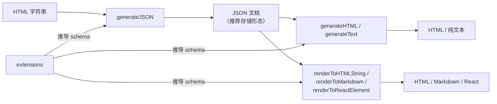

import { Canvas, Controls, Meta } from '@storybook/addon-docs/blocks';
import * as OutputRenderingStories from './output-rendering.stories';

<Meta of={OutputRenderingStories} name="Docs" />

# 输出与静态渲染

存储里的内容要变成页面时，不一定要创建编辑器实例。编辑器实例上的 `getJSON()` / `getHTML()` 读取属于编辑期操作，[内容与文档模型课](?path=/docs/content-model--docs)已经讲过；本课处理**没有实例**的场景：把入库的 JSON 直接渲染成 HTML、把一段 HTML 转成 JSON 入库、在服务端或 React 组件树里回显内容。所有这些入口共享同一个模型——**schema 由 `extensions` 推导，转换只是把编辑器的解析、序列化路径抽成了独立函数**；schema 认不认识内容，决定转换是成功、静默过滤还是抛错。



| API | 所在包 | 方向 | 回查要点 |
| --- | --- | --- | --- |
| `generateHTML(doc, extensions)` | `@tiptap/core`（服务端换 `@tiptap/html`） | JSON → HTML | schema 外的节点或标记直接抛错 |
| `generateJSON(html, extensions)` | 同上 | HTML → JSON | 未注册标签静默过滤，与编辑器的 HTML 解析一致 |
| `generateText(doc, extensions, options?)` | `@tiptap/core` | JSON → 纯文本 | `blockSeparator` 默认 `"\n\n"`；不依赖 DOM |
| `renderToHTMLString` / `renderToMarkdown` / `renderToReactElement` | `@tiptap/static-renderer` | JSON → HTML / Markdown / React | 不实例化编辑器，插件与生命周期钩子不运行 |
| 只读 `Editor` 实例 | — | JSON → 完整编辑器 DOM | 与编辑器渲染完全一致，可直接复用编辑器 CSS |

## 离线转换

`generateHTML` 与 `generateJSON` 就是编辑器「输入解析、输出序列化」两条路径的独立版本：schema 同样由传入的 `extensions` 推导，解析同样只认识已安装的扩展。它们是纯函数——传内容与 extensions，直接返回结果，不挂载 DOM、不触发事件，因此可以在浏览器、Node 脚本、服务端接口里随意调用。

导入来源有两个，行为有差异：

- **`@tiptap/core`**：直接使用浏览器 DOM。`generateHTML` 序列化时要建 HTML 文档，`generateJSON` 解析时要用 `DOMParser`——在 Node 端调用会抛 `there is no window object available`。浏览器项目从这里导入即可，少打包一份虚拟 DOM。
- **`@tiptap/html`**：用虚拟 DOM 实现同样两个函数，服务端与浏览器都能跑。Node 端做转换时从这里导入。

`generateText` 从 `@tiptap/core` 导入，实现不碰 DOM，Node 端可直接使用。

### generateHTML：JSON 转 HTML

把存储的 JSON 文档按 schema 序列化成 HTML 字符串，适合博客文章、邮件模板这类「从存储直接出页面」的场景。下面的实例全程没有创建用于转换的编辑器，只把结果与一条只读编辑器路径做对照。

<Canvas of={OutputRenderingStories.JsonToHtml} />
<Controls of={OutputRenderingStories.JsonToHtml} />

| 读者操作 | 可观察证据 |
| --- | --- |
| 保持「JSON 预设」为合法文档 | 「与只读编辑器输出一致」读数为「是」——离线函数与编辑器实例共用同一条序列化路径 |
| 切换为含未注册节点（image）的文档 | generateHTML 读数变「抛错」，错误框显示 `Unknown node type: image` |
| 对比同一预设下的只读编辑器输出 | 编辑器路径没有抛错，而是降级为空文档——两条路径共用 schema，但兜底方式不同 |
| 打开 Show code | 看到该 Canvas 实际执行的 `json-to-html.ts` |

```ts
import { generateHTML } from '@tiptap/core';

const html = generateHTML(
  {
    type: 'doc',
    content: [
      { type: 'paragraph', content: [{ type: 'text', text: '服务端或浏览器都行' }] },
    ],
  },
  [Document, Paragraph, Text, Bold],
);
// '<p>服务端或浏览器都行</p>'
```

边界：**离线转换没有编辑器的降级兜底**。编辑器解析非法 JSON 时会先警告、再降级成空文档继续工作（见[内容与文档模型课](?path=/docs/content-model--docs)的非法内容一节）；`generateHTML` 直接把 `Node.fromJSON` 的错误抛出来——JSON 里有 schema 外的节点抛 `Unknown node type: xxx`，有 schema 外的标记抛 `There is no mark type xxx in this schema`。所以转换所用 extensions 必须覆盖存储内容可能出现的所有类型，来源不可控的 JSON 要先清理。

### generateJSON：HTML 转 JSON

反向转换：把一段 HTML 解析成 JSON 文档，适合把用户粘贴的 HTML、历史遗留的富文本入库——入库后 JSON 成为无损的存储形态。

<Canvas of={OutputRenderingStories.HtmlToJson} />
<Controls of={OutputRenderingStories.HtmlToJson} />

| 读者操作 | 可观察证据 |
| --- | --- |
| 切换「HTML 预设」为含未注册标签的 HTML | 「doc 子节点」从 4 个变成 2 个，`marquee`、`img` 连同内容消失，错误读数保持「无」 |
| 查看「generateHTML 往返」读数 | 生成的 JSON 直接回渲染成功——它是合法文档，可以直接入库 |
| 切回合法 HTML 对比 JSON 输出 | heading 与 paragraph 的结构与[内容与文档模型课](?path=/docs/content-model--docs)的树完全一致 |
| 打开 Show code | 看到该 Canvas 实际执行的 `html-to-json.ts` |

```ts
import { generateJSON } from '@tiptap/core';

const json = generateJSON('<p>用户粘贴的内容</p>', [
  Document,
  Paragraph,
  Text,
  Bold,
]);
```

边界：**HTML 方向按标签名静默过滤**——未注册标签连同其内容直接丢弃，连警告都没有，这和编辑器的 HTML 解析走同一条路。`generateJSON` 不接受内容检查选项，需要告警时要么在转换前用 `DOMParser` 自行扫描标签，要么改用编辑器实例加 `enableContentCheck: true` 解析。和 `generateHTML` 放在一起看，方向不对称是本课最重要的坑：同一份内容，JSON 方向严格校验、HTML 方向静默过滤。

### generateText：JSON 转纯文本

`getText()` 的离线版本：不建编辑器实例，直接从 JSON 产出纯文本，适合检索索引、通知摘要。可观察证据见上面「JSON 转 HTML」实例的 generateText 读数。

```ts
import { generateText } from '@tiptap/core';

// 块与块之间默认插入 "\n\n"
const text = generateText(doc, extensions);

generateText(doc, extensions, {
  blockSeparator: '\n', // 换成单换行
  textSerializers: {
    // 自定义叶子节点的文本表示，例如 mention 显示为 @名字
    mention: ({ node }) => `@${node.attrs.label}`,
  },
});
```

- **`blockSeparator`**：块级节点之间的分隔字符串，默认 `"\n\n"`，与 `getText()` 一致。
- **`textSerializers`**：按节点类型自定义文本序列化。image 这类叶子节点若不提供序列化器，输出中不会留下痕迹。
- 边界：与 `generateHTML` 走同一条 `Node.fromJSON` 路径，遇到 schema 外的节点或标记同样抛错。

## 静态渲染器

`generateHTML` 只能产出 HTML 字符串。`@tiptap/static-renderer` 是官方的静态渲染包：输入 Tiptap JSON，按需产出 HTML 字符串、Markdown 或 React 元素，典型用途是 SSR——页面在服务端渲染好内容，客户端不必加载编辑器。

```bash
npm install @tiptap/static-renderer
```

三个渲染函数签名相同，只是返回类型不同；按子路径导入可以只打包需要的那一种：

| 函数 | 导入路径 | 返回 |
| --- | --- | --- |
| `renderToHTMLString` | `@tiptap/static-renderer/pm/html-string` | `string` |
| `renderToMarkdown` | `@tiptap/static-renderer/pm/markdown` | `string` |
| `renderToReactElement` | `@tiptap/static-renderer/pm/react` | React 元素 |

```ts
import StarterKit from '@tiptap/starter-kit';
import { renderToHTMLString } from '@tiptap/static-renderer/pm/html-string';

const html = renderToHTMLString({
  extensions: [StarterKit],
  content: docJson, // JSON 文档或 ProseMirror Node
  // staticEditorOptions: { textDirection: 'auto' }, // 目前唯一可配的编辑器级选项
});
// '<p>Hello World!</p>'
```

选型上与 `generateHTML` 的分工：两者都能出 HTML，`generateHTML` 更轻（就在 `@tiptap/core` 里）；需要 **Markdown、React 元素或自定义输出映射**时用 `renderToHTMLString` 一家。包内还有一组不依赖 ProseMirror 运行时的 `json` 子路径（`@tiptap/static-renderer/json/html` 的 `renderJSONContentToString`、`json/react` 的 `renderJSONContentToReactElement`），包体更小，但要求为每种节点和标记手工提供映射，适合节点类型很少、对体积极敏感的场景。

### 自定义输出映射

默认输出按各扩展的 renderHTML 规则生成；`options` 里可以为单个节点或标记替换输出，也可以兜住 schema 之外的内容：

```ts
renderToHTMLString({
  extensions: [StarterKit],
  content: docJson,
  options: {
    nodeMapping: {
      // 替换 paragraph 的输出形态
      paragraph({ children }) {
        return `<div class="custom-paragraph">${serializeChildrenToHTMLString(children)}</div>`;
      },
    },
    markMapping: {
      bold({ children }) {
        return `<strong>${serializeChildrenToHTMLString(children)}</strong>`;
      },
    },
    // schema 之外的节点 / 标记的兜底输出，避免直接漏内容
    unhandledNode: ({ node }) => `[unknown node ${node.type.name}]`,
    unhandledMark: ({ mark }) => `[unknown mark ${mark.type.name}]`,
  },
});
```

- 编辑器里的 NodeView 不会自动用于静态渲染（Node View 依赖真实编辑器实例，见[Node View 与 Mark View 课](?path=/docs/node-views--docs)）；需要还原 NodeView 外观时，用 `nodeMapping` 把该节点类型映射到对应组件，含可编辑内容的 NodeView 在 React 场景用 `ReactNodeViewContentProvider` 包装 children。
- `renderToMarkdown` 的输出没有对照某个具体 Markdown 方言做校验，是否符合你的 GFM/CommonMark 预期需要自行确认；Markdown 与 Tiptap 的完整集成见[Markdown 课](?path=/docs/markdown--docs)。

### 静态路径不运行钩子

静态渲染只构建 schema 并执行 renderHTML：**不创建 `Editor`，所以 `addProseMirrorPlugins`、`onCreate`、`onUpdate` 和所有 transaction 钩子从不运行**。依赖这些钩子写入的属性不会出现在输出里——典型如 UniqueID 扩展的 `data-id`、TableOfContents 的 `id` / `data-toc-id`。解决办法是渲染前预处理 JSON，扩展为静态场景提供了对应的预处理函数：

```ts
import { generateUniqueIds } from '@tiptap/extension-unique-id';

let doc = sourceJson;
doc = generateUniqueIds(doc, extensions); // 补上钩子在编辑期才会写入的 id
const html = renderToHTMLString({ content: doc, extensions });
```

判断一份扩展能否直接用于静态渲染，就看它的输出属性是 renderHTML 从 `attrs` 读出来的（能），还是生命周期钩子写进 `attrs` 的（不能，需要预处理）。

## 服务端回显的三条路径

把存储的内容回显到页面，官方指南给了三条路，选择标准是「输出给谁消费」：

| 路径 | 产出 | 适合 | 代价 |
| --- | --- | --- | --- |
| 只读 `Editor` 实例（`editable: false`） | 完整编辑器 DOM | 需要与编辑器里一模一样的视图，直接复用编辑器 CSS，不用维护第二套样式 | 打包并运行整个编辑器 |
| `generateHTML` / `generateText` | HTML / 纯文本字符串 | 博客文章、邮件、通知等「从存储出 HTML」的场景 | 只有 schema 转换；Node 端注意从 `@tiptap/html` 导入 |
| `@tiptap/static-renderer` | HTML / Markdown / React 元素 | SSR 框架里渲染成组件或字符串；需要 Markdown 输出或自定义映射 | 独立包；钩子不运行，依赖钩子的属性要预处理 |

三条路的共同前提一致：extensions 与写入端一致，schema 才能正确还原内容。纯静态展示选后两种；编辑场景的只读态、或需要与编辑器逐像素一致时选第一种。

## 最佳实践

- **存储用 JSON，展示时才转 HTML。** JSON 无损覆盖节点、标记与属性，HTML 是渲染形态——这是[内容与文档模型课](?path=/docs/content-model--docs)的结论，无实例场景同样成立：入库用 `generateJSON`，出库用 `generateHTML`。
- **转换所用 extensions 必须与写入端一致。** schema 决定转换结果：缺扩展时 JSON 方向抛错、HTML 方向静默过滤，两种下场都意味着内容损失。两端共用同一份 extensions 定义是最稳的做法。
- **批量转换注意 schema 重建成本。** 每次调用都会从 extensions 重新推导一份 schema；大批量导出时减少调用次数，或用 `getSchema` 自行缓存 schema 后配合 `getHTMLFromFragment` 序列化。
- **静态渲染前预处理插件属性。** 钩子不运行，UniqueID 这类扩展的属性不会自动出现；用扩展提供的预处理函数先处理 JSON，再交给渲染函数。

## 常见问题

- 在 Node 里调用 generateHTML / generateJSON 抛 "there is no window object available"
  这两个函数的 `@tiptap/core` 版本依赖浏览器 DOM。改从 `@tiptap/html` 导入同名函数（内部用虚拟 DOM 实现），调用代码不变；`generateText` 不依赖 DOM，留在 `@tiptap/core` 即可。
- generateHTML 抛 "Unknown node type: xxx" 或 "There is no mark type xxx in this schema"
  extensions 不认识 JSON 里的节点或标记，离线路径没有编辑器的降级兜底。补齐 extensions，或转换前清理来源不可控的 JSON。对照方向差异：`generateJSON` 对未注册 HTML 标签是静默过滤，不报错。
- 静态渲染或离线转换的输出里没有 data-id 等属性
  这些属性由扩展的钩子在编辑器运行期写入，静态路径不运行钩子。用扩展提供的预处理函数（如 `generateUniqueIds`）先处理 JSON 再渲染。
- generateHTML 的输出和编辑器 getHTML() 不一致
  正常情况下两者共用同一条序列化路径，输出应逐字符一致（本课第一个实例可验证）。不一致时先核对两处的 extensions 是否同一份定义、版本是否相同——schema 差异会直接改变输出结构。

## 总结回顾

摘要：

没有编辑器实例时，内容产出靠同一份 schema 支撑的三组入口。离线转换函数把编辑器的解析与序列化抽成纯函数：`generateHTML` 把存储的 JSON 渲染成 HTML，与只读编辑器的 `getHTML()` 输出逐字符一致，但遇到 schema 外的节点或标记会直接抛错，而编辑器路径会降级为空文档；`generateJSON` 把 HTML 转成可入库的 JSON，未注册标签按标签名静默过滤——方向不对称是本课最重要的坑；`generateText` 是 `getText()` 的离线版，可自定义块分隔符与叶子节点的文本表示。`@tiptap/static-renderer` 在此之上提供 HTML、Markdown、React 三种输出和自定义映射，但静态路径不创建编辑器，所有生命周期钩子不运行，依赖钩子的属性要用预处理函数补齐。服务端回显按消费方选路径：要和编辑器完全一致的视图用只读实例，只要 HTML 用 `generateHTML`，要组件或 Markdown 用静态渲染器。

一句话：

> 没有编辑器实例也能产出内容——extensions 推导出的 schema 是唯一裁判：它认识的照常转换，HTML 方向静默过滤，JSON 方向直接抛错。

知识要点：

- 没有编辑器实例时，JSON 转 HTML、HTML 转 JSON、JSON 转纯文本分别用什么函数？浏览器与服务端项目各从哪个包导入？
- 同一份 schema 外的内容，`generateHTML` 与 `generateJSON` 的处理有什么不同？错误消息分别长什么样？
- `@tiptap/static-renderer` 能产出哪三种结果？替换单个节点的输出和兜住未知节点分别用什么选项？
- 静态渲染不会运行哪些东西？依赖钩子的属性（如 UniqueID 的 `data-id`）怎么补上？
- 服务端回显的三条路径各适合什么场景？选择标准是什么？
- `generateText` 的块分隔符默认值是什么？怎么自定义 mention 这类叶子节点的文本表示？

## 参考资料

- [Export to JSON and HTML | Tiptap Editor Docs](https://tiptap.dev/docs/guides/output-json-html)
- [generateHTML / generateJSON Utility | Tiptap Editor Docs](https://tiptap.dev/docs/editor/api/utilities/html)
- [Static Renderer | Tiptap Editor Docs](https://tiptap.dev/docs/editor/api/utilities/static-renderer)
