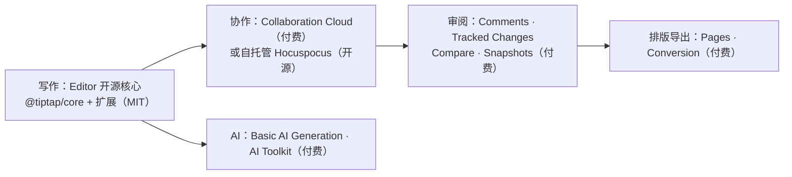

import { Meta } from '@storybook/addon-docs/blocks';

<Meta id="paid-products" title="付费产品线/付费能力概览" name="Docs" />

# 付费能力概览

[是什么一课](?path=/docs/what-is-tiptap--docs)已经给出许可三层表：开源核心 MIT、Pro 扩展与 UI 走 Pro License、云与附加产品按套餐计费。本课是手册的收尾课，把第二、三层展开成一张**商业能力地图**：每条产品线解决什么问题、有没有开源替代路线、装在哪个套餐里，最后给出"什么信号该上付费、什么场景开源够用"的选型判断。按 NOTE.md 的边界，本课只做选型认知，不深入任何产品的实现——需要细节时以各产品官方文档为准。

先建立全局图景：付费产品不是"更强的编辑器"，而是沿着**文档生产链路**（协作 → 审阅 → 排版导出 → AI）展开的成品方案。

| 产品 | 一句话定位 | 开源替代 | 获取门槛 |
| --- | --- | --- | --- |
| Collaboration Cloud | 托管实时协作与文档存储 | 自托管 Hocuspocus（见[Hocuspocus 后端课](?path=/docs/hocuspocus--docs)） | Start 档起 |
| Documents | 云端文档的 REST API / webhook 管理与服务端操作 | 自托管时文档在自己 DB | REST API 在 Team 档起 |
| Snapshots | 文档版本：手动 + 自动存版本、回滚、预览 | 无官方开源；可基于 Yjs update 自建 | 私有 registry + 订阅 |
| Comments | 行内评论、线程、提及与 REST API 审核 | 无官方开源；简化版可基于 mark + decorations 自研 | 私有 registry + 订阅（需 Cloud 环境） |
| Tracked Changes | 修订模式：红线标注、接受/拒绝、作者归属 | 无官方开源 | 附加产品，单独计费 |
| Compare | 两份文档/两个版本的差异渲染 | 无官方开源（底层可用 prosemirror-changeset 自研） | pilot 计划，面向 Business / Enterprise |
| Basic AI Generation | 编辑器内 AI 命令、自动补全、图像生成 | 无官方开源；可自接 LLM + 命令管线自研 | Start 档起 |
| AI Toolkit | 给 AI agent 读写 Tiptap 文档的工具与原语 | 包本体开源，完整访问需付费 add-on | 附加产品，单独计费 + JWT |
| Conversion | DOCX / PDF / ODT / EPUB 导入导出（编辑器扩展或 REST API） | Markdown 走开源的 `@tiptap/markdown` | Start 档起；REST API 在 Team 档起 |
| Pages | 类 Word 分页排版：页眉页脚、页码、脚注 | 无官方开源 | Team 档起；beta |

## 能力地图

付费产品线共享一个共同框架：**编辑器本体（开源）只负责"写"，产品线补齐写完之后与写之前的链路**。下面按链路分四组展开，每个产品回答三个问题：解决什么问题、怎么获取、开源路线走到哪里。

### 协作与文档管理

- **Collaboration Cloud**：把[协作三课](?path=/docs/collaboration--docs)里自建的那套后端变成托管服务。技术底座与自托管完全相同——开源 Hocuspocus + Yjs，前端从 `HocuspocusProvider` 换成 `TiptapCollabProvider` 即可切换，其余代码不动；反过来迁回自托管也是换 provider。部署形态有三档：Cloud（官方托管）、Dedicated Cloud（专属实例）、On-Premises（Docker 部署在你自己的基础设施，企业档洽谈）。选型要点：协作能力本身开源免费，付费买的是**托管运维**——高可用、扩容、文档存储与备份不用自己做。
- **Documents**：Tiptap Cloud 文档的管理面——经 REST API 与 webhook 对云端文档做增删改查与服务端操作，文档格式就是[内容与文档模型课](?path=/docs/content-model--docs)讲的 Tiptap JSON。自托管路线的对应物是"文档存在自己数据库"（Hocuspocus 持久化 hook），服务端操作用 `generateHTML` / `generateJSON`（见[输出与静态渲染课](?path=/docs/output-rendering--docs)）。
- **Snapshots**（版本历史）：在协作文档上做手动与自动版本记录——`saveVersion` 存版本、按间隔自动存、回滚到任意版本、版本列表与服务端预览，元数据里记录触发方式与贡献者。包为 `@tiptap-pro/extension-snapshot`，**绑定 Tiptap Cloud**：文档要求 TiptapCollabProvider 与云端环境。自托管路线没有官方开源版本历史，可以基于 Yjs 的 update 流自己攒，工程量不小。

### 评论与审阅

- **Comments**：行内/节点评论、线程、解决状态、@ 提及（webhook 通知）、评论富文本，以及编辑器外经 REST API 审核管理。包为 `@tiptap-pro/extension-comments`，依赖 Tiptap Cloud 的 Document server 环境。自托管无官方开源版；[Decorations 与插件课](?path=/docs/decorations-plugins--docs)的 mark + decoration 机制能自研简化版（高亮 + 侧栏列表），但线程同步、离线评论、重叠区间这些工程细节都要自己补。它与[协作体验课](?path=/docs/collaboration-ux--docs)的 CollaborationCaret 分工：后者回答"谁的光标在哪"，Comments 回答"谁对哪段内容说了什么"。
- **Tracked Changes**：类 Word 修订模式——所有编辑变成可审阅的"建议"，覆盖插入、删除、替换、标记变化、属性变化、块拆分、列表升降级等八类变更，支持单个/批量/按范围/按作者接受或拒绝，每次修订带作者与时间戳。基于 Yjs 协作，AI 改写也会作为待审建议进入流程。官方明确它是**不包含在任何套餐里的付费附加产品**，单独计费、有试用。
- **Compare**：对比两份文档或同一文档的两个版本，把差异以可定制样式渲染出来；headless 设计，可跑在客户端或服务端，不需要编辑器实例。包为 `@tiptap-pro/compare`。获取方式特殊：文档标注为 pilot 计划、需联系销售、面向 Business 与 Enterprise 客户，而定价页 Team 档也列有 "version comparison"——两处口径以官方页面当前状态为准。

### AI 能力

- **Basic AI Generation**：编辑器内的轻量 AI 层——内置与自定义 AI 命令、输入自动补全、流式输出、图像生成。LLM 可走 Tiptap 云代理调 OpenAI，也可接自定义 LLM 与自建后端。扩展从私有 registry 安装，Start 档起可用。官方已把它定位为简单场景的入口，agentic 工作流指向 AI Toolkit（文档提供迁移指南）。
- **AI Toolkit**：面向 AI agent 的工具层——给 agent 提供读写 Tiptap 文档的工具定义与原语（如 `tiptapEdit`、`proofread`），配套省 token 的文档编码格式 Tiptap Shorthand（beta，官方宣称最高降低约 50% token 消耗）；兼容 Vercel AI SDK、LangChain、OpenAI / Anthropic SDK，可跑在浏览器或服务端。注意它的分发模式很特别：**npm 包本体开源，但完整访问需要购买付费 add-on 并配置 Tiptap Access Control JWT**——装得上、用不了是默认状态。这是"能力确需自研"时替代程度最高的付费产品：工具协议是公开的，付出的是授权费与自研时间之间的差价。

### 格式与排版

- **Conversion**：格式转换的"桥"——导入 DOCX / Markdown，导出 DOCX / PDF / ODT / EPUB / Markdown（及旧版 DOC），同步处理不走任务队列。两条集成路线：编辑器扩展（`@tiptap-pro/extension-convert-kit` 提供 schema，编辑器内命令触发）或 REST API（服务端无头转换）。注意旧的 `@tiptap-pro/extension-import` / `extension-export` 已废弃、2026 年日落，网上旧教程会失效。开源边界：Markdown 进出用 [`@tiptap/markdown`](?path=/docs/markdown--docs)（MIT，本手册 6.4 已讲）；DOCX 等二进制格式没有官方开源路线，社区库（如 mammoth、docx）能做基本转换，但与 Tiptap schema 的映射质量自理。
- **Pages**：分页排版层——A4 / Letter 等页面格式与自定义边距、Word 式页眉页脚（`{page}` / `{total}` 占位符、首页与奇偶页变体）、自动编号的脚注尾注、显式与自动分页、协作友好的编辑覆盖层。需要三个包配合：`@tiptap-pro/extension-pages` + `extension-convert-kit`（schema）+ `extension-pages-tablekit`（分页安全表格）；DOCX 往返与 PDF/ODT/EPUB 导出要再叠加 Conversion。产品处于 **beta**，官方建议锁定精确版本；超高一页的非可拆分块（大图、嵌套表格）会导致布局死循环。Team 档起可用。分页是编辑器领域公认难题，无开源替代。

## 许可与获取

两条获取纪律先说清，对所有 Pro 产品一致：

- **私有 npm registry。** `@tiptap-pro/*` 不在公共 npm 上，需要在 Tiptap 账号（My features → Pro Extensions）生成个人 token，配置进 `.npmrc` / `.yarnrc.yml` 后正常 `npm install`。token 是长期凭证：当密码对待、加进 `.gitignore`、CI/CD 用专用账号。部分扩展（Snapshots、Comments、AI Toolkit 完整访问）要求**活跃订阅**才可访问，其余部分试用或免费账号即可拉取。
- **订阅失效即授权失效。** Pro License 条款规定授权跟随活跃订阅——续费期内持续授权，停止续费后失效。这与 MIT 包"拿到即永久拥有"是两种产权模型，评估长期成本时要算进去。

套餐与额度（**2026-10-02 查询自官方定价页，价格与额度易变，以下单页面实时口径为准**）：

| 套餐 | 月付 / 年付（每套餐价） | 开发者席位 | 环境 | Cloud 文档（每环境） | 关键能力增量 |
| --- | --- | --- | --- | --- | --- |
| Start | $59 / $49 | 2 | 2 | 500 | 实时协作、评论、文档历史、行内 AI、DOCX/Markdown 导入与五格式导出、UI Components |
| Team | $179 / $149 | 5 | 3 | 5,000 | + 版本对比、Pages 分页、REST API / webhook、服务端文档操作 |
| Business | $1,199 / $999 | 10 | 5 | 50,000 | + 优先支持、99.9% SLA |
| Enterprise | 自定义 | 自定义 | 自定义 | 自定义 | + On-Premises / 专属云、自有认证/存储/AI 模型、SLA、SOC 2 |

计费口径的四个要点：

- **按开发席位计费，不按最终用户。** 编辑器的使用者数量不影响价格，影响价格的是开发者席位数（超出后加购约 $49/席/月，年付 $39）、环境数与 Cloud 文档量。年付比月付省 20%。
- **只有存在 Tiptap Cloud 的文档计入额度**，存在自己数据库的文档不消耗——自托管协作路线因此不产生文档费。
- **超限不阻断。** 超出文档额度后仍可继续创建，官方发邮件通知，无人响应时会**自动升级套餐**——这是潜在的意外账单来源。
- **附加产品不在任何套餐内**：AI Toolkit 与 Tracked Changes 单独计费；没有免费云套餐，但所有付费档含 30 天免费试用（无需信用卡），开源、教育、初创折扣按个案评估。

## 选型判断

拿到需求后按信号查表——先看是否命中"开源够用"，再看付费项：

| 需求信号 | 判断 | 推荐路线 |
| --- | --- | --- |
| 单人编辑、内容存自己的数据库 | 开源够用 | Editor 核心 + 扩展（手册 1–5 章） |
| 只需要 Markdown 进出 | 开源够用 | `@tiptap/markdown`（6.4） |
| 不想手写菜单，项目是 React | 开源够用 | UI Components 源码复制（6.3） |
| 多人实时编辑，且有能力运维后端 | 开源够用 | Yjs + 自托管 Hocuspocus（7.1–7.3） |
| 多人协作，但不想承担后端运维 | 付费（买运维） | Collaboration Cloud，换 `TiptapCollabProvider` |
| 需要评论、版本历史、修订、版本对比 | 付费（云绑定能力） | Comments / Snapshots / Tracked Changes / Compare |
| 需要 DOCX / PDF / ODT / EPUB 互通 | 付费 | Conversion（Markdown 除外） |
| 需要 Word 式分页排版 | 付费 | Pages |
| 编辑器内嵌 AI 命令与补全 | 付费 | Basic AI Generation |
| 要构建读写文档的 AI agent | 付费 add-on | AI Toolkit |

三个容易误判的边界：

- **付费不等于更强的编辑器。** schema、扩展系统、命令这些编辑器核心能力全部开源；付费买的是周边链路成品（协作托管、审阅、格式、AI 集成）。编辑功能上"开源版做不到"的场景远比想象少。
- **自托管不是零成本。** Hocuspocus 授权免费，但部署、鉴权、持久化、扩容都是你的活（见 Hocuspocus 后端课）；Collaboration Cloud 与 Hocuspocus 同底座，付费买的是运维而不是私有功能。团队没有运维带宽时，订阅可能比自托管便宜。
- **云绑定能力没有开源路线。** Comments、Snapshots、Tracked Changes、Compare、Pages 官方均无开源版本，自托管 Hocuspocus 不能补上它们；需要这类能力时，决策不是"开源 vs 付费"，而是"自研 vs 付费"。

## 课程对照

手册已学内容与付费产品的同源关系，跳转用得上：

| 已学课程 | 对应付费产品 | 关系 |
| --- | --- | --- |
| [协作入门](?path=/docs/collaboration--docs)、[协作体验](?path=/docs/collaboration-ux--docs) | Collaboration Cloud | 同一套 Yjs 技术；`TiptapCollabProvider` 与 `HocuspocusProvider` 一换即切换 |
| [Hocuspocus 后端](?path=/docs/hocuspocus--docs) | Documents | 自托管时文档在自己 DB；Cloud 时经 REST API / webhook 管理 |
| [Markdown](?path=/docs/markdown--docs) | Conversion | `@tiptap/markdown` 是 Markdown 进出的开源路线；Conversion 补 DOCX 等二进制格式与服务端 API |
| [UI Components](?path=/docs/ui-components--docs)、[菜单](?path=/docs/menus--docs) | —— | UI Components 源码 MIT（含 simple-editor 模板）；其中 Comments、Version History 等 Cloud 组件需订阅 |
| [内容与文档模型](?path=/docs/content-model--docs) | Documents、AI Toolkit | REST API 与 AI 工具读写的都是 Tiptap JSON |
| [命令](?path=/docs/commands--docs) | Basic AI Generation | AI 命令最终仍走编辑器命令 / `insertContent` 管线 |

## 常见问题

- 订了一个套餐，是不是所有 Pro 扩展都能用？
  不是。先排除两个附加产品——AI Toolkit 与 Tracked Changes 永远单独计费；再看档位门槛——Pages、REST API / webhook 在 Team 档起；Compare 走 pilot 需联系销售。下单前对着定价页与产品页各核一遍当前口径。
- 自托管了 Hocuspocus，能装 Comments / Snapshots 吗？
  装不上或用不起来：两者要求 Tiptap Cloud 的 Document server 环境与 `TiptapCollabProvider`，授权也绑定订阅。协作本身可自托管，云绑定能力不可；确实只要"能评论"，可按 Decorations 与插件课的机制自研简化版。
- Cloud 文档数超额度会发生什么？
  不会被禁止创建：官方邮件通知，无人处理时自动升级到更高套餐。把文档额度纳入监控；同时注意自存文档不计数，超限往往意味着该把部分文档迁回自己数据库或规划扩容包。
- 网上教程里的 `@tiptap-pro/extension-import` / `extension-export` 装不到或行为对不上？
  这两个旧扩展已废弃、2026 年日落。改用 Conversion 的当前形态：`@tiptap-pro/extension-convert-kit`（编辑器内）或 Conversion REST API（服务端）。

## 总结回顾

摘要：

付费产品线沿文档生产链路展开：协作段是 Collaboration Cloud 与 Documents（与自托管 Hocuspocus 同底座，付费买运维）；审阅段是 Comments、Tracked Changes、Compare 与 Snapshots（云绑定、无开源替代）；AI 段从 Basic AI Generation 的编辑器内命令到 AI Toolkit 的 agent 工具层（包开源、访问付费）；格式与排版段是 Conversion 与 Pages。获取上一律走私有 npm registry 与个人 token，授权跟随活跃订阅；套餐按开发席位、环境与 Cloud 文档量计费，AI Toolkit 与 Tracked Changes 是套餐外的附加产品。选型从信号出发：单人文档、Markdown、React 菜单、有运维能力的协作都能走开源路线；评论审阅、版本历史、Office 互通、分页与 AI 深度集成才指向付费。

一句话：

> 付费边界不在编辑器强弱，而在文档生产链路的成品方案——先判断开源路线够不够，再判断付费买的是能力还是运维。

知识要点：

- 付费产品线沿什么链路组织？四组各解决什么问题？
- 哪些能力存在开源替代？Collaboration Cloud 与自托管 Hocuspocus 如何切换？
- 哪些产品被绑定在 Tiptap Cloud 上？为什么自托管补不了它们？
- Pro 扩展从哪里安装？token 与订阅失效的纪律是什么？
- 套餐按什么计费？哪些产品不在任何套餐内？超额度会发生什么？
- 什么信号该上付费、什么场景开源够用？决策表怎么查？
- 已学课程中哪些内容与付费产品同源？

## 参考资料

- [Tiptap Docs 总站](https://tiptap.dev/docs)
  产品分区（Editor / Collaboration / AI / Comments / Documents / Conversion 等）与 Browse by feature 入口，本课能力地图的清单依据。
- [Tiptap Pricing](https://tiptap.dev/pricing)
  套餐结构、价格数字、席位/环境/文档额度、附加产品与试用条款（本课价格均为 2026-10-02 查询口径）。
- [Pro Extensions 指南](https://tiptap.dev/docs/guides/pro-extensions)
  私有 npm registry 配置、个人 token 纪律、要求活跃订阅的扩展清单。
- [Editor Introduction](https://tiptap.dev/docs/editor/introduction)
  编辑器开源定位与 30 天试用说明。
- [Collaboration Overview](https://tiptap.dev/docs/collaboration/getting-started/overview)
  Collaboration Cloud 定位、`TiptapCollabProvider` / `HocuspocusProvider` 切换、Cloud / Dedicated / On-Premises 三档部署。
- [Collaboration Documents](https://tiptap.dev/docs/collaboration/documents)
  云端文档的存储、REST API 与 webhook 管理。
- [Snapshots（Version History）](https://tiptap.dev/docs/collaboration/documents/snapshot)
  手动/自动版本、回滚与预览、`@tiptap-pro/extension-snapshot` 的云依赖。
- [Comments Overview](https://tiptap.dev/docs/comments/getting-started/overview)
  评论能力清单、Tiptap Cloud 与 Document server 环境要求。
- [Tracked Changes Overview](https://tiptap.dev/docs/tracked-changes/getting-started/overview)
  八类变更追踪、接受/拒绝与作者归属、"不包含在任何套餐"的计费定位。
- [Compare Overview](https://tiptap.dev/docs/compare/getting-started/overview)
  版本对比能力与 pilot 计划获取方式（Business / Enterprise）。
- [Basic AI Generation Overview](https://tiptap.dev/docs/ai/basic/overview)
  AI 命令、自动补全、图像生成与 LLM 接入方式。
- [AI Toolkit Overview](https://tiptap.dev/docs/ai/ai-toolkit/overview)
  agent 工具定义、Tiptap Shorthand 省 token、包开源但访问需 add-on + JWT 的分发模式。
- [Conversion Overview](https://tiptap.dev/docs/conversion/getting-started/overview)
  导入导出格式清单、ConvertKit 包结构、旧 Import/Export 扩展日落计划。
- [Pages Overview](https://tiptap.dev/docs/pages/getting-started/overview)
  分页排版能力、三包依赖、beta 状态与非可拆分块限制。
